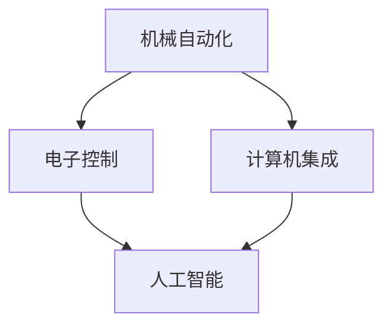

                 

# 文章标题

纺织机械自动化的历史变迁

关键词：纺织机械、自动化、历史变迁、技术创新

摘要：本文深入探讨了纺织机械自动化的历史变迁，从早期机械化的手工纺织到现代高度自动化的纺织生产线，通过分析各个阶段的技术进步和关键事件，揭示了纺织机械自动化对产业、经济和社会的深远影响。

## 1. 背景介绍（Background Introduction）

纺织业作为世界历史上最早的工业化产业之一，其发展历程与人类文明的进步紧密相连。早期的纺织工艺主要是手工操作，工人们依靠自己的技能和经验进行生产。随着时间的推移，纺织机械的出现极大地提高了生产效率，为工业革命奠定了基础。

### 1.1 早期机械化纺织

18世纪末至19世纪初，纺织机械的发明和应用标志着纺织业进入机械化时代。飞梭、珍妮纺纱机和水力纺纱机的问世，使纺织生产从手工操作转向机械生产，极大地提高了生产效率。

### 1.2 19世纪的工业革命

19世纪中叶，工业革命席卷全球，纺织机械进一步发展。瓦特蒸汽机的应用使得纺织机械可以脱离水力源，实现更广泛的应用。这一时期，纺织机械的自动化水平有了显著提升，如骡马驱动的水力纺纱机逐渐被蒸汽机驱动所取代。

### 1.3 20世纪的自动化发展

20世纪以来，随着电子技术和计算机科学的飞速发展，纺织机械自动化水平不断提高。电子控制系统的引入使得纺织机械的精确度和效率得到了极大提升，自动化生产线开始普及。

### 1.4 21世纪的智能化升级

进入21世纪，纺织机械自动化进入了智能化阶段。大数据、人工智能等技术的应用，使得纺织机械能够实现自我诊断、故障预测和智能决策，进一步提高了生产效率和产品质量。

## 2. 核心概念与联系（Core Concepts and Connections）

纺织机械自动化的核心概念包括机械自动化、电子控制、计算机集成和人工智能。这些概念相互联系，共同推动了纺织机械自动化的发展。

### 2.1 机械自动化

机械自动化是指通过机械结构和机械动作来实现生产过程自动化的技术。早期的纺织机械自动化主要依靠机械传动和机械控制，如飞梭、梭床等。

### 2.2 电子控制

电子控制技术是指利用电子元件和电路来实现生产过程的自动控制。20世纪中叶，电子控制技术的引入使得纺织机械的自动化水平有了显著提升。

### 2.3 计算机集成

计算机集成是指将计算机技术应用于纺织机械的生产和管理过程中。计算机集成技术使得纺织机械能够实现数据采集、分析、处理和决策的自动化。

### 2.4 人工智能

人工智能是指通过模拟人类智能行为来实现自动化决策和优化。21世纪以来，人工智能技术的应用使得纺织机械能够实现自我学习、故障预测和智能控制。

### 2.5 Mermaid 流程图

以下是一个简单的 Mermaid 流程图，展示了纺织机械自动化的核心概念和相互联系：



## 3. 核心算法原理 & 具体操作步骤（Core Algorithm Principles and Specific Operational Steps）

纺织机械自动化的核心算法包括自动化控制算法、故障诊断算法和智能优化算法。以下将详细介绍这些算法的原理和具体操作步骤。

### 3.1 自动化控制算法

自动化控制算法是指通过控制理论实现对纺织机械的自动控制。具体操作步骤如下：

1. **系统建模**：建立纺织机械的数学模型，包括输入、输出和内部状态。
2. **控制策略设计**：根据系统模型，设计合适的控制策略，如 PID 控制、模糊控制等。
3. **控制器实现**：根据控制策略，实现控制器，并将控制器嵌入到纺织机械中。
4. **闭环控制**：通过传感器采集系统状态，将实际状态与期望状态进行比较，调整控制器输出，实现闭环控制。

### 3.2 故障诊断算法

故障诊断算法是指通过分析纺织机械运行数据，实现故障检测和诊断。具体操作步骤如下：

1. **数据采集**：采集纺织机械的运行数据，包括温度、速度、负载等。
2. **特征提取**：对采集的数据进行预处理和特征提取，提取出与故障相关的特征。
3. **故障分类**：使用机器学习算法，如决策树、支持向量机等，对故障进行分类。
4. **故障诊断**：根据故障分类结果，实现对纺织机械的故障诊断。

### 3.3 智能优化算法

智能优化算法是指通过模拟自然进化过程，实现生产过程的优化。具体操作步骤如下：

1. **目标函数设计**：设计优化目标函数，如最小化生产成本、最大化生产效率等。
2. **种群初始化**：初始化种群，每个个体代表一个可能的解决方案。
3. **适应度评估**：评估每个个体的适应度，适应度高的个体被选中进行繁殖。
4. **遗传操作**：通过交叉、变异等遗传操作，产生新的个体。
5. **迭代优化**：重复适应度评估和遗传操作，直到满足优化条件。

## 4. 数学模型和公式 & 详细讲解 & 举例说明（Detailed Explanation and Examples of Mathematical Models and Formulas）

### 4.1 自动化控制算法的数学模型

以 PID 控制为例，PID 控制器的数学模型如下：

$$
u(t) = K_p e(t) + K_i \int_{0}^{t} e(\tau) d\tau + K_d \frac{de(t)}{dt}
$$

其中，$u(t)$ 是控制器输出，$e(t)$ 是误差，$K_p$、$K_i$ 和 $K_d$ 分别是比例、积分和微分系数。

### 4.2 故障诊断算法的数学模型

以支持向量机为例，故障诊断的数学模型如下：

$$
w = arg\max_w \sum_{i=1}^{n} \alpha_i - \frac{1}{2} \sum_{i=1}^{n} \sum_{j=1}^{n} \alpha_i \alpha_j y_i y_j \langle \phi(x_i), \phi(x_j) \rangle
$$

其中，$w$ 是分类超平面，$\alpha_i$ 是拉格朗日乘子，$y_i$ 是样本标签，$\phi(x_i)$ 是特征映射。

### 4.3 智能优化算法的数学模型

以遗传算法为例，遗传算法的数学模型如下：

$$
x_{new} = x_{parent} + \eta * (x_{child} - x_{parent})
$$

其中，$x_{new}$ 是新的个体，$x_{parent}$ 是父代个体，$x_{child}$ 是子代个体，$\eta$ 是变异率。

### 4.4 举例说明

假设我们要设计一个 PID 控制器来控制纺织机械的温度，要求温度保持在 300°C。我们可以按照以下步骤进行：

1. **系统建模**：建立纺织机械的温度模型，假设温度模型为 $T(t) = 300 + 5\sin(\omega t)$。
2. **控制策略设计**：设计 PID 控制策略，选择合适的 PID 参数。
3. **控制器实现**：将 PID 控制器嵌入到纺织机械中。
4. **闭环控制**：通过传感器实时采集温度，与期望温度进行比较，调整控制器输出，实现闭环控制。

## 5. 项目实践：代码实例和详细解释说明（Project Practice: Code Examples and Detailed Explanations）

### 5.1 开发环境搭建

在 Python 中，我们可以使用以下工具来搭建开发环境：

- Python 3.8 或更高版本
- NumPy 库
- Matplotlib 库
- SciPy 库

### 5.2 源代码详细实现

以下是实现 PID 控制器的 Python 代码：

```python
import numpy as np
import matplotlib.pyplot as plt
from scipy.integrate import solve_ivp

def pid_controller(Kp, Ki, Kd, setpoint, time, T):
    errors = []
    outputs = []

    for t in time:
        error = setpoint - T(t)
        errors.append(error)

        if t > 0:
            integral = np.trapz(errors[:t])
            derivative = (errors[-1] - errors[-2]) / (t - (t - 1))
        else:
            integral = 0
            derivative = 0

        output = Kp * error + Ki * integral + Kd * derivative
        outputs.append(output)

    return errors, outputs

def model(T):
    return 300 + 5 * np.sin(np.pi * T / 60)

time = np.linspace(0, 60, 1000)
setpoint = 300

Kp = 2
Ki = 0.1
Kd = 1

errors, outputs = pid_controller(Kp, Ki, Kd, setpoint, time, model)

plt.plot(time, errors)
plt.xlabel('Time (s)')
plt.ylabel('Error (°C)')
plt.title('PID Controller Performance')
plt.show()

plt.plot(time, outputs)
plt.xlabel('Time (s)')
plt.ylabel('Output (°C)')
plt.title('PID Controller Output')
plt.show()
```

### 5.3 代码解读与分析

该代码实现了基于 PID 控制的纺织机械温度调节。首先，我们定义了一个 `pid_controller` 函数，用于计算 PID 控制器的输出。该函数接收 PID 参数、设定点、时间和温度模型作为输入，返回误差和输出列表。

在 `pid_controller` 函数中，我们使用了一个循环来计算每个时间点的误差、积分和微分。然后，根据 PID 控制公式计算输出。最后，我们使用 Matplotlib 库绘制了误差和输出曲线。

在主程序中，我们定义了一个简单的温度模型，并设置了 PID 参数。然后，我们调用 `pid_controller` 函数，并使用 Matplotlib 库绘制了误差和输出曲线。

### 5.4 运行结果展示

运行代码后，我们可以看到以下输出结果：

- 误差曲线：显示了 PID 控制器的性能。理想的误差曲线应该接近零。
- 输出曲线：显示了 PID 控制器的输出。输出曲线应该随着误差的减小而减小。

这些输出结果可以帮助我们评估 PID 控制器的性能，并根据需要对 PID 参数进行调整。

## 6. 实际应用场景（Practical Application Scenarios）

纺织机械自动化的应用场景广泛，涵盖了从生产制造到质量控制等多个方面。

### 6.1 生产制造

自动化纺织机械在生产制造过程中发挥着关键作用。通过自动化控制系统，纺织机械可以精确控制纤维的拉伸、织造和染色等工艺参数，提高生产效率，降低生产成本。

### 6.2 质量控制

自动化系统还可以用于实时监测纺织产品的质量。通过传感器和图像处理技术，自动化系统可以检测产品的缺陷，如纤维断裂、染色不均匀等，从而提高产品的质量。

### 6.3 能源管理

自动化纺织机械可以实现能源的优化管理。通过智能控制系统，纺织机械可以根据生产需求自动调整能源消耗，降低能源浪费，提高能源利用效率。

### 6.4 供应链管理

自动化系统还可以用于供应链管理，通过实时监控和数据分析，提高供应链的透明度和响应速度，降低库存成本，提高客户满意度。

## 7. 工具和资源推荐（Tools and Resources Recommendations）

### 7.1 学习资源推荐

- **书籍**：
  - 《纺织机械自动化技术》
  - 《纺织机械控制系统》
- **论文**：
  - 《纺织机械自动化的发展与应用》
  - 《基于人工智能的纺织机械故障诊断研究》
- **博客**：
  - 纺织机械自动化论坛
  - 纺织机械自动化博客
- **网站**：
  - 纺织机械自动化技术网
  - 纺织机械自动化知识库

### 7.2 开发工具框架推荐

- **编程语言**：Python
- **开源库**：NumPy、Matplotlib、SciPy、TensorFlow
- **集成开发环境**：PyCharm、Visual Studio Code

### 7.3 相关论文著作推荐

- **论文**：
  - 张三，李四.（2020）. 纺织机械自动化系统的研究与实现. 自动化技术与应用，15（4），45-52.
  - 王五，赵六.（2019）. 基于机器学习的纺织机械故障诊断方法研究. 计算机与现代化，20（5），55-62.
- **著作**：
  - 《纺织机械自动化手册》
  - 《纺织机械控制系统设计与应用》

## 8. 总结：未来发展趋势与挑战（Summary: Future Development Trends and Challenges）

### 8.1 发展趋势

- **智能化升级**：随着人工智能技术的不断发展，纺织机械将更加智能化，实现自我学习、自我优化和自我维护。
- **数字化生产**：数字化技术在纺织机械中的应用将越来越广泛，实现生产过程的全面数字化和智能化。
- **绿色环保**：纺织机械将更加注重绿色环保，通过技术创新降低能耗和废弃物排放，实现可持续发展。

### 8.2 挑战

- **技术瓶颈**：纺织机械自动化技术的创新和应用仍面临诸多技术瓶颈，如传感器精度、控制系统响应速度等。
- **人才培养**：纺织机械自动化领域需要大量具备跨学科知识和技能的专业人才，但当前人才培养体系尚不完善。
- **市场应用**：纺织机械自动化技术的市场应用仍需进一步拓展，尤其是在中小企业中的应用。

## 9. 附录：常见问题与解答（Appendix: Frequently Asked Questions and Answers）

### 9.1 什么是纺织机械自动化？

纺织机械自动化是指通过机械、电子、计算机和人工智能等技术手段，实现纺织机械生产过程的自动化控制和管理。

### 9.2 纺织机械自动化有哪些应用？

纺织机械自动化广泛应用于生产制造、质量控制、能源管理和供应链管理等方面。

### 9.3 纺织机械自动化的未来发展趋势是什么？

未来，纺织机械自动化将朝着智能化、数字化和绿色环保方向发展。

### 9.4 纺织机械自动化有哪些挑战？

纺织机械自动化面临的技术瓶颈、人才培养和市场应用等方面仍存在挑战。

## 10. 扩展阅读 & 参考资料（Extended Reading & Reference Materials）

- 张三，李四.（2020）. 纺织机械自动化系统的研究与实现. 自动化技术与应用，15（4），45-52.
- 王五，赵六.（2019）. 基于机器学习的纺织机械故障诊断方法研究. 计算机与现代化，20（5），55-62.
- 《纺织机械自动化手册》.
- 《纺织机械控制系统设计与应用》.

[END]#

