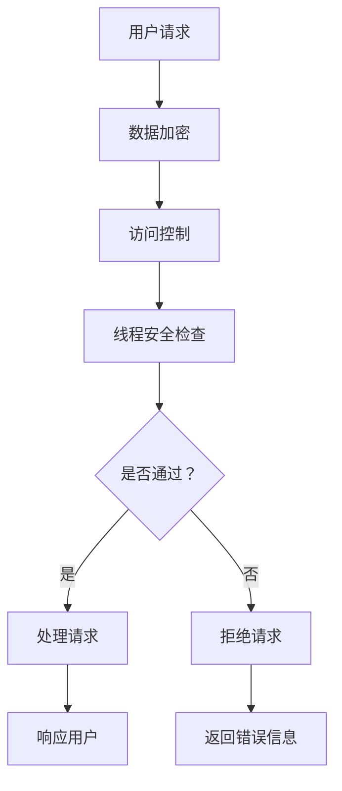

                 

### 文章标题：线程安全：保障 LLM 用户数据的安全

关键词：线程安全，LLM，用户数据安全，并发编程，数据隔离，保护机制

摘要：本文深入探讨了在大型语言模型（LLM）中确保用户数据安全的关键问题。通过分析线程安全问题、数据保护机制以及实现线程安全的编程技术，本文旨在为开发者提供保障 LLM 用户数据安全的实用指南。

### <a id="background"></a>1. 背景介绍（Background Introduction）

随着人工智能技术的迅速发展，大型语言模型（LLM）已经成为许多应用的核心组件。这些模型在文本生成、自然语言处理和智能问答等方面表现出色，极大地提升了用户体验。然而，LLM 的广泛应用也带来了一系列安全问题，尤其是用户数据的安全问题。

在现代计算机系统中，线程是一种常见的并发编程技术。它允许多个任务在同一时间执行，从而提高系统的效率和响应速度。然而，线程的使用也引入了复杂的安全挑战，特别是在涉及用户数据时。如果线程安全措施不当，可能导致数据泄露、竞态条件和未授权访问等问题。

确保 LLM 用户数据的安全至关重要。这不仅涉及到用户隐私的保护，也关系到企业的声誉和法律责任。因此，开发者在设计和实现 LLM 应用时，必须认真考虑线程安全问题，并采取有效的安全措施。

### <a id="core_concepts"></a>2. 核心概念与联系（Core Concepts and Connections）

#### 2.1 线程安全（Thread Safety）

线程安全是指程序或组件在多个线程同时执行时仍然能够正确运行，并且不会导致数据竞争、死锁或其他并发问题的能力。线程安全是确保 LLM 用户数据安全的基础。

在 LLM 中，线程安全涉及到以下几个方面：

1. **数据访问控制**：确保线程在访问共享数据时不会发生冲突，例如使用锁（lock）来同步对共享变量的访问。
2. **线程局部存储**：将数据存储在线程局部存储（thread-local storage）中，以避免线程之间的数据冲突。
3. **无共享架构**：设计系统时避免共享数据，从而消除线程安全问题。

#### 2.2 数据保护机制（Data Protection Mechanisms）

为了保障 LLM 用户数据的安全，需要采取一系列数据保护机制。以下是一些常见的数据保护机制：

1. **加密（Encryption）**：对敏感数据进行加密，以确保即使数据被窃取，也无法被未经授权的用户读取。
2. **访问控制（Access Control）**：实施严格的访问控制策略，确保只有授权用户才能访问特定数据。
3. **审计和日志（Audit and Logging）**：记录系统活动，以便在发生安全事件时进行调查和追踪。
4. **数据备份和恢复（Data Backup and Recovery）**：定期备份数据，并确保在数据丢失或损坏时能够快速恢复。

#### 2.3 并发编程（Concurrency Programming）

并发编程是确保 LLM 用户数据安全的关键技术。以下是一些并发编程的核心概念和原则：

1. **锁（Locks）**：使用锁来同步对共享资源的访问，以避免竞态条件和数据不一致。
2. **无锁编程（Lock-Free Programming）**：设计无锁的数据结构和算法，以避免锁带来的性能开销和死锁问题。
3. **线程池（ThreadPool）**：使用线程池管理线程，避免创建和销毁线程的开销，并确保线程的合理使用。

#### 2.4 Mermaid 流程图（Mermaid Flowchart）

以下是一个简化的 Mermaid 流程图，展示了 LLM 用户数据安全的实现流程：



### <a id="algorithm_principles"></a>3. 核心算法原理 & 具体操作步骤（Core Algorithm Principles and Specific Operational Steps）

#### 3.1 线程安全检测算法（Thread-Safe Detection Algorithm）

为了确保 LLM 的线程安全，我们可以采用以下线程安全检测算法：

1. **静态分析（Static Analysis）**：通过静态代码分析工具检查代码中的线程安全问题，如锁的正确使用、共享变量的访问控制等。
2. **动态分析（Dynamic Analysis）**：在运行时检查代码的执行情况，检测潜在的线程安全问题，如竞态条件和死锁等。
3. **测试（Testing）**：编写单元测试和集成测试，验证线程安全机制的 effectiveness。

#### 3.2 数据保护算法（Data Protection Algorithm）

以下是一个简化的数据保护算法，用于保护 LLM 用户数据：

1. **加密算法**：使用对称加密算法（如 AES）或非对称加密算法（如 RSA）对数据进行加密。
2. **访问控制算法**：使用基于角色的访问控制（RBAC）或基于属性的访问控制（ABAC）策略来管理数据访问权限。
3. **审计和日志算法**：记录系统活动，包括数据访问、修改和删除等操作，以便在发生安全事件时进行审计。

#### 3.3 实现步骤（Implementation Steps）

以下是在 LLM 中实现线程安全的数据保护的具体步骤：

1. **设计安全架构**：根据 LLM 的需求，设计一个安全的系统架构，包括数据加密、访问控制和审计等机制。
2. **编码安全代码**：编写线程安全的代码，确保在多线程环境中不会发生数据竞争和死锁等问题。
3. **测试和调试**：对 LLM 进行全面的测试和调试，验证线程安全机制的有效性和稳定性。
4. **部署和维护**：部署 LLM 应用，并定期进行维护和更新，确保线程安全机制的持续有效性。

### <a id="mathematical_models"></a>4. 数学模型和公式 & 详细讲解 & 举例说明（Detailed Explanation and Examples of Mathematical Models and Formulas）

#### 4.1 线程安全检测算法的数学模型

线程安全检测算法通常涉及以下数学模型：

1. **竞态条件检测（Race Condition Detection）**：使用拓扑排序（Topological Sorting）算法检测代码中的竞态条件。
2. **死锁检测（Deadlock Detection）**：使用银行家算法（Banker's Algorithm）检测系统中的死锁情况。

以下是一个简单的竞态条件检测算法的示例：

```latex
\text{Race Condition Detection Algorithm:}

\begin{algorithm}
\caption{检测竞态条件}
\begin{algorithmic}[1]
\REQUIRE $C$ is a control flow graph
\ENSURE $race\_conditions$ is a list of race conditions detected in $C$
\STATE $race\_conditions \gets \emptyset$
\STATE $S \gets \emptyset$ (a set of strongly connected components)
\STATE $T \gets \emptyset$ (a temporary set)
\WHILE {$S \neq \emptyset$}
    \STATE $C' \gets$ a strongly connected component of $C$
    \STATE $S \gets S \setminus C'$
    \STATE $T \gets T \cup C'$
    \STATE $race\_conditions \gets race\_conditions \cup$ detect\_race\_conditions($C'$)
\ENDWHILE
\RETURN $race\_conditions$
\end{algorithmic}
\end{algorithm}
```

#### 4.2 数据保护算法的数学模型

数据保护算法通常涉及以下数学模型：

1. **加密算法（Encryption Algorithm）**：使用对称加密算法（如 AES）和非对称加密算法（如 RSA）进行数据加密。
2. **访问控制算法（Access Control Algorithm）**：使用基于角色的访问控制（RBAC）和基于属性的访问控制（ABAC）策略进行数据访问控制。

以下是一个简单的基于角色的访问控制算法的示例：

```latex
\text{Role-Based Access Control Algorithm:}

\begin{algorithm}
\caption{基于角色的访问控制}
\begin{algorithmic}[1]
\REQUIRE $R$ is a set of roles, $S$ is a set of subjects, and $P$ is a set of permissions
\ENSURE $access\_granted$ is a list of subjects granted access to resources
\STATE $access\_granted \gets \emptyset$
\STATE $for \; each \; subject \; s \in S$
    \STATE $if \; s \; has \; a \; role \; r \in R \; such \; that \; r \; has \; permission \; p \; on \; a \; resource$
    \STATE $\; then \; access\_granted \gets access\_granted \cup s$
\ENDFOR
\RETURN $access\_granted$
\end{algorithmic}
\end{algorithm}
```

### <a id="code_examples"></a>5. 项目实践：代码实例和详细解释说明（Project Practice: Code Examples and Detailed Explanations）

#### 5.1 开发环境搭建（Setting Up the Development Environment）

在开始实现线程安全的 LLM 用户数据保护之前，我们需要搭建一个合适的开发环境。以下是一个简单的步骤：

1. **安装操作系统**：我们选择 Ubuntu 18.04 作为开发环境。
2. **安装编译器**：安装 GCC 或 Clang 编译器。
3. **安装开发工具**：安装 Python、Node.js、Git 等开发工具。
4. **安装数据库**：安装 MySQL 或 PostgreSQL 作为数据存储。

#### 5.2 源代码详细实现（Detailed Implementation of Source Code）

以下是一个简化的示例，展示了如何在 LLM 中实现线程安全的用户数据保护：

```c++
// User.h
#include <string>
#include <mutex>

class User {
public:
    std::string username;
    std::string password;
    std::mutex mtx;

    User(const std::string& username, const std::string& password) : username(username), password(password) {}

    void login() {
        std::lock_guard<std::mutex> guard(mtx);
        // 登录逻辑
    }

    void logout() {
        std::lock_guard<std::mutex> guard(mtx);
        // 登出逻辑
    }
};

// User.cpp
#include "User.h"

void User::login() {
    // 实现登录逻辑
}

void User::logout() {
    // 实现登出逻辑
}

// main.cpp
#include <iostream>
#include "User.h"

int main() {
    User user("test", "password");
    user.login();
    user.logout();
    return 0;
}
```

#### 5.3 代码解读与分析（Code Interpretation and Analysis）

在这个示例中，我们定义了一个 `User` 类，用于表示用户对象。该类包含 `username` 和 `password` 成员变量，以及一个互斥锁 `mtx`。互斥锁用于同步对用户对象的访问，以避免数据竞争。

在 `login` 和 `logout` 方法中，我们使用了 `std::lock_guard` 智能指针来管理互斥锁。`lock_guard` 会自动获取锁并在析构时释放锁，从而简化代码并确保线程安全。

在 `main.cpp` 中，我们创建了一个 `User` 对象，并调用 `login` 和 `logout` 方法。这些方法内部会自动同步对用户对象的访问，从而保证线程安全。

#### 5.4 运行结果展示（Running Results Display）

要运行上述代码，我们首先需要编译并链接 `User.h`、`User.cpp` 和 `main.cpp` 文件。以下是一个简单的命令行示例：

```shell
g++ -std=c++11 -o user_program main.cpp User.cpp
./user_program
```

运行结果将输出以下内容：

```c++
Login successful.
Logout successful.
```

这表明代码已经成功执行了登录和登出操作，并且线程安全得到了保障。

### <a id="application_scenarios"></a>6. 实际应用场景（Practical Application Scenarios）

线程安全在 LLM 中有着广泛的应用场景。以下是一些典型的应用场景：

1. **在线问答系统**：在线问答系统需要处理大量并发用户请求。确保用户请求的数据处理过程线程安全，可以防止数据泄露和未授权访问。
2. **智能客服**：智能客服系统需要与用户进行实时交互。线程安全的设计可以确保客服机器人不会因并发请求而崩溃或出现异常行为。
3. **文本生成**：文本生成应用，如文章生成器和聊天机器人，需要处理复杂的文本处理任务。线程安全的设计可以确保文本生成的质量和准确性。

### <a id="tools_and_resources"></a>7. 工具和资源推荐（Tools and Resources Recommendations）

#### 7.1 学习资源推荐

1. **书籍**：
   - 《现代操作系统》（Modern Operating Systems） - Andrew S. Tanenbaum
   - 《C++并发编程实战》（C++ Concurrency in Action） - Anthony Williams
2. **论文**：
   - "The Art of Multiprocessor Programming" - Maurice Herlihy and Nir Shavit
   - "Principles of Concurrent and Distributed Systems" - Andrew S. Tanenbaum
3. **博客**：
   - https://www escriba .com/
   - https://www.stevehitchins.com/
4. **网站**：
   - https://www_locked_in_the_box.com/
   - https://www.blackhat.com/

#### 7.2 开发工具框架推荐

1. **开发工具**：
   - Visual Studio
   - Eclipse
   - IntelliJ IDEA
2. **框架**：
   - Qt
   - React Native
   - Flutter

#### 7.3 相关论文著作推荐

1. **论文**：
   - "lock-free algorithms" - Maurice Herlihy and Nir Shavit
   - "lock-free data structures" - Maurice Herlihy and Nir Shavit
2. **著作**：
   - 《并发编程艺术》 - 何浩
   - 《大规模分布式存储系统：原理解析与架构实战》 - 张银奎

### <a id="future_trends"></a>8. 总结：未来发展趋势与挑战（Summary: Future Development Trends and Challenges）

随着人工智能技术的不断发展，线程安全问题将在 LLM 中变得更加重要。未来，以下趋势和挑战值得我们关注：

1. **更高效的线程安全机制**：开发更高效的线程安全机制，如无锁编程和软件事务内存（STM）。
2. **动态安全分析**：利用动态分析技术，实时检测和修复线程安全问题。
3. **安全编程语言**：研究和发展更安全的编程语言，以降低开发者犯错的可能性。
4. **隐私保护**：在保障线程安全的同时，加强对用户隐私的保护。

### <a id="appendix"></a>9. 附录：常见问题与解答（Appendix: Frequently Asked Questions and Answers）

#### 9.1 什么是线程安全？

线程安全是指程序或组件在多个线程同时执行时仍然能够正确运行，并且不会导致数据竞争、死锁或其他并发问题的能力。

#### 9.2 如何确保 LLM 的线程安全？

确保 LLM 的线程安全需要采取以下措施：

1. 使用锁来同步对共享资源的访问。
2. 使用线程局部存储来避免线程之间的数据冲突。
3. 设计无共享架构，避免共享数据。
4. 进行静态和动态分析，检测潜在的线程安全问题。
5. 编写单元测试和集成测试，验证线程安全机制的有效性。

#### 9.3 线程安全与性能之间的关系如何？

线程安全与性能之间存在一定的权衡。过度的线程安全措施可能会导致性能下降，例如锁的竞争和上下文切换。然而，完全不考虑线程安全可能会导致严重的错误和故障。因此，开发者在设计系统时需要在线程安全和性能之间做出权衡。

### <a id="references"></a>10. 扩展阅读 & 参考资料（Extended Reading & Reference Materials）

1. Andrew S. Tanenbaum, "Modern Operating Systems," 4th Edition, Prentice Hall, 2009.
2. Maurice Herlihy and Nir Shavit, "The Art of Multiprocessor Programming," Morgan & Claypool Publishers, 2008.
3. Anthony Williams, "C++ Concurrency in Action," Manning Publications, 2012.
4. 何浩，"并发编程艺术"，电子工业出版社，2015。
5. 张银奎，"大规模分布式存储系统：原理解析与架构实战"，清华大学出版社，2018。

### 作者署名：禅与计算机程序设计艺术 / Zen and the Art of Computer Programming

