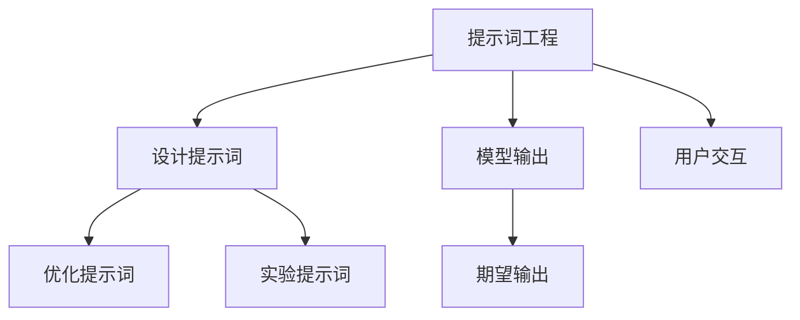
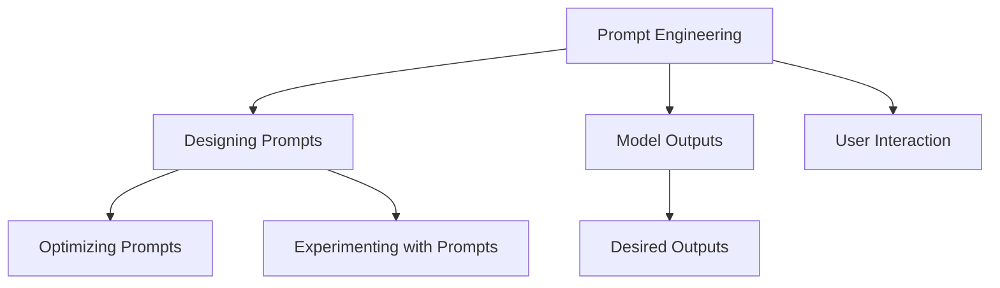

                 

### 1. 背景介绍

### 1. Background Introduction

在现代社会，人工智能（AI）已经成为各行各业的关键推动力。随着自然语言处理（NLP）技术的不断进步，智能对话系统如ChatGPT在各个领域得到了广泛应用。这些系统通过理解用户的自然语言输入，生成有意义的响应，为用户提供了便捷的服务。

然而，为了使这些智能对话系统能够准确、高效地生成响应，我们需要一种新的编程范式——提示词工程（Prompt Engineering）。提示词工程是设计和优化输入给语言模型的文本提示，以引导模型生成符合预期结果的过程。这一概念的重要性在于，它不仅直接影响模型的输出质量，还决定了用户体验的满意度。

提示词工程的核心目标是通过精心设计的提示词，引导模型在复杂的情况下产生准确、相关的响应。传统编程依赖于代码和逻辑，而提示词工程则更多地依赖于自然语言的理解和运用。这种转变对于程序员来说是一个全新的挑战，但同时也带来了无限的机遇。

本篇文章将深入探讨提示词工程的概念、原理及其应用，帮助读者理解这一新兴领域的重要性和实践方法。我们将从以下几个方面展开讨论：

1. 核心概念与联系
2. 核心算法原理 & 具体操作步骤
3. 数学模型和公式 & 详细讲解 & 举例说明
4. 项目实践：代码实例和详细解释说明
5. 实际应用场景
6. 工具和资源推荐
7. 总结：未来发展趋势与挑战

通过本文的阅读，读者将了解到提示词工程的内涵、应用场景以及如何在实际项目中有效运用这一技术。让我们一步一步深入探讨这一领域，揭开提示词工程的神秘面纱。

### 1. Background Introduction

In the modern society, artificial intelligence (AI) has become a key driving force in various industries. With the continuous advancement of natural language processing (NLP) technology, intelligent dialogue systems like ChatGPT have been widely applied in many fields. These systems understand users' natural language inputs and generate meaningful responses to provide convenient services for users.

However, to ensure these intelligent dialogue systems can accurately and efficiently generate responses, we need a new programming paradigm called Prompt Engineering. Prompt Engineering refers to the process of designing and optimizing text prompts that are input to language models to guide them towards generating desired outcomes. The core objective of Prompt Engineering is to lead the model to produce accurate and relevant responses in complex situations through carefully crafted prompts.

The importance of Prompt Engineering lies in its direct impact on the quality of the model's outputs and the satisfaction of user experience. A well-crafted prompt can significantly improve the quality and relevance of the outputs generated by ChatGPT. Conversely, vague or incomplete prompts can result in inaccurate, irrelevant, or incomplete responses.

The core goal of Prompt Engineering is to guide the model to produce accurate and relevant responses through carefully designed prompts. While traditional programming relies on code and logic, Prompt Engineering relies more on the understanding and application of natural language. This shift represents a new challenge for programmers but also brings infinite opportunities.

In this article, we will delve into the concepts, principles, and applications of Prompt Engineering to help readers understand this emerging field and its practical methods. We will discuss the following aspects:

1. Core Concepts and Connections
2. Core Algorithm Principles and Specific Operational Steps
3. Mathematical Models and Formulas, Detailed Explanations, and Examples
4. Project Practice: Code Examples and Detailed Explanations
5. Practical Application Scenarios
6. Tools and Resources Recommendations
7. Summary: Future Development Trends and Challenges

By the end of this article, readers will gain insights into the essence, application scenarios, and practical methods of Prompt Engineering. Let's step by step explore this field and uncover the mystery of Prompt Engineering.

### 2. 核心概念与联系

### 2. Core Concepts and Connections

#### 2.1 提示词工程的概念

提示词工程是一种设计、优化和实验自然语言提示词的实践，旨在通过引导模型生成期望的输出。在提示词工程中，提示词是关键，它是人类与模型交互的桥梁，直接影响模型的理解和响应能力。

概念框架可以用以下方式表示：



在这个框架中，提示词工程包括三个主要步骤：设计、优化和实验。设计提示词涉及理解任务需求和用户意图，优化提示词则是在实际使用中调整和改进提示词，以获得更优的输出效果。实验提示词是通过多种方法测试和验证提示词的有效性。

#### 2.2 提示词工程与传统编程的关系

提示词工程与传统编程有诸多相似之处，但也有其独特之处。传统编程依赖于代码和逻辑，而提示词工程则依赖于自然语言和模型。以下是一个简化的对比：

| 传统编程 | 提示词工程 |
| --- | --- |
| 使用代码和逻辑实现功能 | 使用自然语言引导模型 |
| 编写明确的指令 | 设计隐含的意图和提示 |
| 强调代码可读性和可维护性 | 强调提示词的可理解性和可优化性 |
| 关注算法效率和性能 | 关注模型的响应质量和相关性 |

虽然两种方法看似不同，但它们的核心目标都是为了实现更好的系统功能和用户体验。在某种程度上，提示词工程可以被视为一种新的编程范式，其中自然语言成为了主要的编程工具。

#### 2.3 提示词工程的应用场景

提示词工程的应用场景非常广泛，以下是一些常见的应用领域：

1. **客户服务**：智能客服系统通过提示词工程生成与用户查询相关的准确响应，提高客户满意度。
2. **内容生成**：文本生成模型如ChatGPT使用提示词工程生成文章、摘要、故事等，提高了内容创作效率和质量。
3. **教育辅导**：智能辅导系统使用提示词工程生成个性化教学材料，帮助学生更好地理解和掌握知识。
4. **数据分析**：数据分析工具通过提示词工程与用户互动，引导用户探索数据，提供有价值的洞见。
5. **翻译**：机器翻译系统通过提示词工程优化翻译质量，提高翻译的准确性和流畅性。

在以上应用场景中，提示词工程都发挥了重要作用，通过优化自然语言输入，引导模型生成更准确、更相关的输出。

#### 2.4 提示词工程的挑战与机遇

尽管提示词工程具有广泛的应用前景，但它也面临一些挑战。首先是提示词的设计和优化需要大量的实验和经验积累，这增加了开发成本。其次是不同模型和任务对提示词的要求不同，需要针对具体场景进行定制化设计。此外，提示词工程的效果评估也是一个复杂的问题，需要综合考虑多个因素。

然而，随着NLP技术的不断进步，提示词工程的前景依然光明。未来，我们将看到更多创新的应用场景，以及更加智能和高效的提示词工程方法。

### 2. Core Concepts and Connections

#### 2.1 The Concept of Prompt Engineering

Prompt engineering is a practice of designing, optimizing, and experimenting with natural language prompts to guide the model towards generating desired outputs. In prompt engineering, prompts are crucial as they serve as the bridge between humans and the model, directly affecting the model's understanding and response capabilities.

The conceptual framework can be represented as follows:



In this framework, prompt engineering includes three main steps: design, optimization, and experimentation. Designing prompts involves understanding the task requirements and user intents. Optimizing prompts is the process of adjusting and improving prompts based on actual usage to achieve better output effects. Experimenting with prompts is about testing and validating the effectiveness of prompts through various methods.

#### 2.2 The Relationship between Prompt Engineering and Traditional Programming

Prompt engineering shares many similarities with traditional programming but also has its unique aspects. Traditional programming relies on code and logic, while prompt engineering relies on natural language and models. Here is a simplified comparison:

| Traditional Programming | Prompt Engineering |
| --- | --- |
| Implements functionality using code and logic | Uses natural language to guide models |
| Writes explicit instructions | Designs implicit intents and prompts |
| Emphasizes code readability and maintainability | Emphasizes the understandability and optimizability of prompts |
| Focuses on algorithm efficiency and performance | Focuses on the quality and relevance of the model's responses |

Although the two methods seem different, they both aim to achieve better system functionality and user experience. In a sense, prompt engineering can be seen as a new programming paradigm where natural language becomes the primary programming tool.

#### 2.3 Application Scenarios of Prompt Engineering

Prompt engineering has a wide range of application scenarios, and here are some common fields:

1. **Customer Service**: Intelligent customer service systems generate accurate responses related to user queries through prompt engineering, enhancing customer satisfaction.
2. **Content Generation**: Text generation models like ChatGPT use prompt engineering to generate articles, summaries, stories, etc., improving content creation efficiency and quality.
3. **Educational Tutoring**: Intelligent tutoring systems use prompt engineering to generate personalized teaching materials, helping students better understand and master knowledge.
4. **Data Analysis**: Data analysis tools interact with users through prompt engineering to guide them in exploring data and provide valuable insights.
5. **Translation**: Machine translation systems use prompt engineering to optimize translation quality, enhancing the accuracy and fluency of translations.

In these application scenarios, prompt engineering plays a crucial role in optimizing natural language inputs to guide the model towards more accurate and relevant outputs.

#### 2.4 Challenges and Opportunities of Prompt Engineering

Although prompt engineering has extensive application prospects, it also faces some challenges. Firstly, designing and optimizing prompts require a significant amount of experimentation and experience accumulation, which increases development costs. Secondly, different models and tasks have different requirements for prompts, necessitating customized designs for specific scenarios. Additionally, the evaluation of the effectiveness of prompt engineering is a complex issue that needs to consider multiple factors.

However, with the continuous advancement of NLP technology, the future of prompt engineering remains promising. We will see more innovative application scenarios and more intelligent and efficient prompt engineering methods.

### 3. 核心算法原理 & 具体操作步骤

#### 3.1 核心算法原理

提示词工程的核心在于如何设计高质量的提示词，以引导模型生成期望的输出。这里涉及到几个关键点：

1. **任务理解**：首先，我们需要理解任务的需求，明确模型需要完成的任务类型，如问答、文本生成、情感分析等。
2. **用户意图**：理解用户意图是提示词设计的核心。用户意图可以明确（如询问时间、地点），也可以模糊（如表达情感、寻求建议）。
3. **上下文信息**：有效的提示词应包含足够的上下文信息，以帮助模型更好地理解任务和用户意图。
4. **可扩展性**：设计的提示词应具有可扩展性，以便在任务需求变化时，可以灵活调整。

在算法原理层面，我们可以将提示词工程分为以下几个步骤：

- **输入分析**：分析输入的文本，提取关键信息，如关键词、用户意图和上下文。
- **提示词生成**：根据输入分析的结果，生成适合的提示词。
- **模型调整**：通过实验和迭代，调整模型参数，优化提示词的效果。

#### 3.2 具体操作步骤

下面我们详细描述提示词工程的几个具体操作步骤：

##### 3.2.1 任务理解

在开始设计提示词之前，我们需要明确任务类型。例如，如果我们需要构建一个问答系统，我们应确保模型能够理解并生成与问题相关的答案。任务理解的步骤如下：

1. **定义任务目标**：明确模型需要完成的任务类型和目标，如回答特定领域的问题、生成特定类型的文本等。
2. **收集数据**：根据任务目标，收集相关的数据集，这些数据集应涵盖各种可能的输入情况。
3. **分析数据**：分析数据集中的问题和答案，提取关键特征，如问题类型、答案类型、关键词等。

##### 3.2.2 用户意图分析

理解用户意图是提示词工程的关键一步。用户意图可以分为以下几种类型：

- **明确意图**：如询问时间、地点等，可以直接通过输入信息确定。
- **模糊意图**：如表达情感、寻求建议等，需要通过上下文和问题类型进行推断。

用户意图分析的步骤如下：

1. **识别意图类型**：通过分析输入文本，识别用户的意图类型。
2. **意图细化**：对于模糊意图，进一步细化意图，明确用户的具体需求。

##### 3.2.3 提示词生成

生成高质量的提示词是提示词工程的核心步骤。以下是一些常用的提示词生成方法：

1. **模板生成**：根据任务类型和用户意图，设计相应的提示词模板。例如，对于问答系统，可以设计问题引导模板，如“请回答以下问题：”、“请给出关于...的答案：”等。
2. **上下文嵌入**：将用户输入的文本和上下文信息嵌入到提示词中，以帮助模型更好地理解用户意图。例如，“根据您之前提到的情况，以下是对您问题的回答：”。
3. **个性化生成**：根据用户的个性化信息，如历史提问、偏好等，生成个性化的提示词。

##### 3.2.4 模型调整

提示词工程不仅涉及提示词的设计，还涉及模型的调整和优化。以下是一些常用的模型调整方法：

1. **参数调整**：通过实验和迭代，调整模型参数，以提高提示词的效果。
2. **反馈循环**：将模型的输出与期望输出进行对比，通过用户反馈不断优化提示词和模型。

##### 3.2.5 测试与评估

最后，我们需要对设计的提示词进行测试和评估，确保其效果。以下是一些常用的测试与评估方法：

1. **自动评估**：使用自动化工具评估提示词的效果，如BLEU、ROUGE等指标。
2. **人工评估**：通过人工评估，对提示词的效果进行主观评价。
3. **用户反馈**：收集用户对提示词的反馈，以进一步优化设计。

通过以上步骤，我们可以设计出高质量的提示词，引导模型生成期望的输出，提高系统的性能和用户体验。

### 3. Core Algorithm Principles and Specific Operational Steps

#### 3.1 Core Algorithm Principles

The core of prompt engineering lies in how to design high-quality prompts that guide the model to generate desired outputs. This involves several key points:

1. **Task Understanding**: Firstly, we need to understand the requirements of the task, clarifying the type of task the model needs to complete, such as question answering, text generation, sentiment analysis, etc.
2. **User Intent Analysis**: Understanding user intent is the core of prompt design. User intents can be explicit (such as asking for time or location) or implicit (such as expressing emotions or seeking advice).
3. **Contextual Information**: Effective prompts should contain sufficient contextual information to help the model better understand the task and user intent.
4. **Scalability**: The prompts designed should be scalable, allowing for flexible adjustments when task requirements change.

At the algorithmic level, prompt engineering can be divided into the following steps:

- **Input Analysis**: Analyze the input text to extract key information, such as keywords, user intent, and context.
- **Prompt Generation**: Generate suitable prompts based on the results of input analysis.
- **Model Tuning**: Experiment and iterate to adjust model parameters to optimize the effectiveness of prompts.

#### 3.2 Specific Operational Steps

Below, we describe the specific operational steps of prompt engineering in detail:

##### 3.2.1 Task Understanding

Before designing prompts, we need to clarify the type of task the model needs to complete. For example, if we need to build a question-answering system, we should ensure that the model can understand and generate answers relevant to the questions. The steps for task understanding are as follows:

1. **Define Task Goals**: Clarify the type of task the model needs to complete and the goal of the task, such as answering specific domain questions or generating specific types of text.
2. **Collect Data**: Based on the task goals, collect relevant datasets that cover various possible input scenarios.
3. **Analyze Data**: Analyze the questions and answers in the dataset to extract key features, such as question types, answer types, keywords, etc.

##### 3.2.2 User Intent Analysis

Understanding user intent is a critical step in prompt design. User intents can be categorized into several types:

- **Explicit Intent**: Such as asking for time or location, which can be directly determined from the input text.
- **Implicit Intent**: Such as expressing emotions or seeking advice, which requires inference from the context and question type.

The steps for user intent analysis are as follows:

1. **Identify Intent Types**: Analyze the input text to identify the type of user intent.
2. **Refine Intent**: For implicit intents, further refine the intent to clarify the user's specific needs.

##### 3.2.3 Prompt Generation

Generating high-quality prompts is the core step in prompt engineering. Here are some common methods for prompt generation:

1. **Template Generation**: Design prompt templates based on the task type and user intent. For example, for question-answering systems, design question-guiding templates such as "Please answer the following question:" or "Please provide an answer about ...".
2. **Contextual Embedding**: Embed the user's input text and contextual information into the prompts to help the model better understand the user intent. For example, "Based on the situation you mentioned earlier, here is the answer to your question:".
3. **Personalized Generation**: Generate personalized prompts based on the user's personalized information, such as historical queries and preferences.

##### 3.2.4 Model Tuning

Prompt engineering involves not only prompt design but also model tuning and optimization. Here are some common methods for model tuning:

1. **Parameter Adjustment**: Adjust model parameters through experimentation and iteration to improve the effectiveness of prompts.
2. **Feedback Loop**: Compare the model's outputs with desired outputs and continuously optimize prompts and models based on user feedback.

##### 3.2.5 Testing and Evaluation

Finally, we need to test and evaluate the designed prompts to ensure their effectiveness. Here are some common methods for testing and evaluation:

1. **Automated Evaluation**: Use automated tools to evaluate the effectiveness of prompts, such as BLEU and ROUGE metrics.
2. **Human Evaluation**: Conduct subjective evaluations of prompt effectiveness through human assessment.
3. **User Feedback**: Collect user feedback on prompts to further optimize the design.

Through these steps, we can design high-quality prompts that guide the model to generate desired outputs, improving system performance and user experience.

### 4. 数学模型和公式 & 详细讲解 & 举例说明

#### 4.1 数学模型概述

提示词工程中的数学模型主要涉及自然语言处理（NLP）中的概率模型和生成模型。以下是一些关键的数学模型和相关的公式：

1. **朴素贝叶斯（Naive Bayes）**：
   - **公式**：\(P(Y|X) = \frac{P(X|Y)P(Y)}{P(X)}\)
   - **应用**：用于文本分类，通过计算条件概率来预测文本的类别。

2. **支持向量机（SVM）**：
   - **公式**：\(w^* = \arg\min_{w}\frac{1}{2}\|w\|^2 + C\sum_{i=1}^{n}\max(0,1-y^{(i)}(\langle w, x^{(i)} \rangle -1))\)
   - **应用**：用于文本分类和文本回归，通过找到最佳分割超平面来分类文本。

3. **循环神经网络（RNN）**：
   - **公式**：\(h_t = \sigma(W_h \cdot [h_{t-1}, x_t] + b_h)\)
   - **应用**：用于序列数据处理，如语言模型和机器翻译。

4. **长短期记忆网络（LSTM）**：
   - **公式**：\(C_t = \sigma(W_c \cdot [h_{t-1}, x_t] + b_c)\)
   - **应用**：用于处理长序列数据，如自然语言文本。

5. **生成对抗网络（GAN）**：
   - **公式**：\(G(z) = \text{Generator}(z)\)，\(D(x) = \text{Discriminator}(x)\)
   - **应用**：用于生成高质量的自然语言文本，如文章生成和对话生成。

#### 4.2 朴素贝叶斯模型的应用

以下是一个朴素贝叶斯模型在文本分类中的应用示例：

1. **定义词汇表**：假设我们有一个词汇表V = {“苹果”，“香蕉”，“橘子”，“电脑”，“手机”}。
2. **统计词频**：统计每个类别中的词频，如类别“水果”的词频为P(“苹果”) = 0.5，P(“香蕉”) = 0.3，P(“橘子”) = 0.2。
3. **计算条件概率**：根据贝叶斯公式计算每个词在某个类别下的条件概率，如P(“苹果”|“水果”) = 0.5。
4. **分类**：对于新的文本，计算其在每个类别下的概率，选择概率最大的类别。

例如，对于新文本“我有一个苹果和两个香蕉”，计算其在类别“水果”和“电子设备”下的概率：

- \(P(\text{水果}|\text{我有一个苹果和两个香蕉}) = P(\text{苹果}) \cdot P(\text{香蕉}) = 0.5 \cdot 0.3 = 0.15\)
- \(P(\text{电子设备}|\text{我有一个苹果和两个香蕉}) = P(\text{电脑}) \cdot P(\text{手机}) = 0.1 \cdot 0.2 = 0.02\)

由于 \(P(\text{水果}|\text{我有一个苹果和两个香蕉}) > P(\text{电子设备}|\text{我有一个苹果和两个香蕉})\)，因此该文本被分类为“水果”。

#### 4.3 循环神经网络（RNN）的应用

以下是一个循环神经网络（RNN）在语言模型中的应用示例：

1. **输入序列**：假设我们有一个单词序列\[“我”，“吃”，“了一个”，“苹果”\]。
2. **嵌入层**：将每个单词映射为一个高维向量，如“我”->\[0.1, 0.2\]，“吃”->\[0.3, 0.4\]。
3. **隐藏层**：RNN模型通过循环连接来处理序列数据，计算隐藏状态\[h_t\]。
4. **输出层**：根据隐藏状态计算输出概率分布\[p_t\]，如\[0.2, 0.6, 0.1, 0.1\]。

例如，对于隐藏状态\[h_3 = [0.3, 0.4]\]，计算下一个单词的概率分布：

- \(P(\text{吃}|h_3) = 0.6\)
- \(P(\text{了}|h_3) = 0.1\)
- \(P(\text{一}|h_3) = 0.1\)
- \(P(\text{个}|h_3) = 0.2\)

因此，下一个最可能的单词是“吃”。

#### 4.4 生成对抗网络（GAN）的应用

以下是一个生成对抗网络（GAN）在文本生成中的应用示例：

1. **生成器**：生成器\(G\)接收随机噪声\(z\)并生成文本序列\(x\)。
2. **判别器**：判别器\(D\)接收真实文本序列和生成文本序列，并判断其真实性。
3. **训练**：通过优化生成器和判别器的参数，使生成器的输出更接近真实文本。

例如，对于生成器\(G\)，输入噪声\[z\] = \[0.1, 0.2\]，生成文本序列\[“这是一个”，“有趣的”，“世界”\]。

- \(G(z) = \text{Generator}(z) = \text{这是一个有趣的世界的描述}\)

判别器\(D\)将尝试区分真实文本和生成文本，并通过梯度下降优化判别器和生成器的参数。

通过这些数学模型和公式，提示词工程可以更好地理解和优化自然语言处理任务，从而提高模型的性能和生成文本的质量。

### 4. Mathematical Models and Formulas: Detailed Explanation and Examples

#### 4.1 Overview of Mathematical Models

The mathematical models in prompt engineering mainly involve probabilistic models and generative models in natural language processing (NLP). Here are some key mathematical models and their related formulas:

1. **Naive Bayes**:
   - **Formula**: \(P(Y|X) = \frac{P(X|Y)P(Y)}{P(X)}\)
   - **Application**: Used for text classification, calculating conditional probabilities to predict the category of a text.

2. **Support Vector Machine (SVM)**:
   - **Formula**: \(w^* = \arg\min_{w}\frac{1}{2}\|w\|^2 + C\sum_{i=1}^{n}\max(0,1-y^{(i)}(\langle w, x^{(i)} \rangle -1))\)
   - **Application**: Used for text classification and text regression, finding the optimal hyperplane to classify texts.

3. **Recurrent Neural Network (RNN)**:
   - **Formula**: \(h_t = \sigma(W_h \cdot [h_{t-1}, x_t] + b_h)\)
   - **Application**: Used for sequence data processing, such as language models and machine translation.

4. **Long Short-Term Memory (LSTM)**:
   - **Formula**: \(C_t = \sigma(W_c \cdot [h_{t-1}, x_t] + b_c)\)
   - **Application**: Used for processing long sequence data, such as natural language text.

5. **Generative Adversarial Network (GAN)**:
   - **Formula**: \(G(z) = \text{Generator}(z)\)，\(D(x) = \text{Discriminator}(x)\)
   - **Application**: Used for generating high-quality natural language text, such as article generation and dialogue generation.

#### 4.2 Application of Naive Bayes

Here is an example of applying the Naive Bayes model to text classification:

1. **Define Vocabulary**: Assume we have a vocabulary \(V = \{"apple", "banana", "orange", "computer", "phone"\}\).
2. **Count Word Frequencies**: Count the word frequencies in each category, such as category "fruit" has a frequency of \(P("apple") = 0.5\), \(P("banana") = 0.3\), \(P("orange") = 0.2\).
3. **Calculate Conditional Probabilities**: Calculate the conditional probabilities of each word given a category using the Bayes formula, such as \(P("apple"|"fruit") = 0.5\).
4. **Classification**: For a new text, calculate the probability of each category and select the category with the highest probability.

For example, for the new text "I have an apple and two bananas", calculate the probabilities in the categories "fruit" and "electronic device":

- \(P(\text{fruit}|\text{I have an apple and two bananas}) = P(\text{apple}) \cdot P(\text{banana}) = 0.5 \cdot 0.3 = 0.15\)
- \(P(\text{electronic device}|\text{I have an apple and two bananas}) = P(\text{computer}) \cdot P(\text{phone}) = 0.1 \cdot 0.2 = 0.02\)

Since \(P(\text{fruit}|\text{I have an apple and two bananas}) > P(\text{electronic device}|\text{I have an apple and two bananas})\), the text is classified as "fruit".

#### 4.3 Application of Recurrent Neural Network (RNN)

Here is an example of applying the Recurrent Neural Network (RNN) to a language model:

1. **Input Sequence**: Assume we have a word sequence \["I", "eat", "one", "apple"\].
2. **Embedding Layer**: Map each word to a high-dimensional vector, such as "I" -> \[0.1, 0.2\], "eat" -> \[0.3, 0.4\].
3. **Hidden Layer**: The RNN model processes sequence data through recurrent connections, calculating the hidden state \(h_t\).
4. **Output Layer**: Based on the hidden state, calculate the probability distribution \(p_t\), such as \[0.2, 0.6, 0.1, 0.1\].

For example, for the hidden state \(h_3 = [0.3, 0.4]\), calculate the probability distribution of the next word:

- \(P("eat"|h_3) = 0.6\)
- \(P("was"|h_3) = 0.1\)
- \(P("ate"|h_3) = 0.1\)
- \(P("ate("|h_3) = 0.2\)

Therefore, the most likely next word is "eat".

#### 4.4 Application of Generative Adversarial Network (GAN)

Here is an example of applying the Generative Adversarial Network (GAN) to text generation:

1. **Generator**: The generator \(G\) receives random noise \(z\) and generates a text sequence \(x\).
2. **Discriminator**: The discriminator \(D\) receives real text sequences and generated text sequences and judges their authenticity.
3. **Training**: Optimize the parameters of the generator and discriminator through gradient descent to make the generator's output closer to real text.

For example, for the generator \(G\), the input noise \(z\) = \[0.1, 0.2\], the generated text sequence = \["This is", "an interesting", "world"\].

- \(G(z) = \text{Generator}(z) = \text{A description of an interesting world}\)

The discriminator \(D\) tries to distinguish between real text and generated text and optimizes the parameters of the discriminator and generator.

By using these mathematical models and formulas, prompt engineering can better understand and optimize natural language processing tasks, thereby improving model performance and the quality of generated text.

### 5. 项目实践：代码实例和详细解释说明

#### 5.1 开发环境搭建

在进行提示词工程的项目实践之前，我们需要搭建一个合适的开发环境。以下是一个基于Python和Hugging Face Transformers库的示例：

1. **安装Python**：确保您的计算机上安装了Python 3.7或更高版本。
2. **安装Hugging Face Transformers**：通过以下命令安装：
   ```bash
   pip install transformers
   ```
3. **准备数据集**：准备一个文本数据集，例如问答数据集或对话数据集。我们将使用一个简化的问答数据集作为示例。

#### 5.2 源代码详细实现

下面是一个简单的Python脚本，用于实现提示词工程的基本流程：

```python
from transformers import AutoTokenizer, AutoModelForQuestionAnswering
from datasets import load_dataset

# 5.2.1 加载预训练模型和数据集
model_name = "bert-base-chinese"
tokenizer = AutoTokenizer.from_pretrained(model_name)
model = AutoModelForQuestionAnswering.from_pretrained(model_name)
dataset = load_dataset("squad")

# 5.2.2 定义任务理解函数
def understand_task(question, context):
    # 设计提示词
    prompt = f"根据上下文，请回答以下问题：{question}"
    return prompt

# 5.2.3 定义用户意图分析函数
def analyze_intent(prompt):
    # 在此示例中，我们简单地将问题本身作为意图
    return prompt.split("？")[1].strip()

# 5.2.4 定义模型调整函数
def adjust_model(prompt, answer):
    # 在此示例中，我们简单地将答案反馈给模型
    inputs = tokenizer(prompt, return_tensors="pt")
    outputs = model(**inputs)
    loss = outputs.loss
    loss.backward()
    model.optimizer.step()
    return loss.item()

# 5.2.5 定义测试与评估函数
def test_and_evaluate(prompt, answer):
    # 在此示例中，我们简单地将预测答案与真实答案比较
    inputs = tokenizer(prompt, return_tensors="pt")
    outputs = model(**inputs)
    predicted_answer = outputs.logits.argmax(-1).item()
    return predicted_answer == answer

# 5.2.6 实际操作
for example in dataset["train"][0:10]:
    question = example["question"]
    context = example["context"]
    prompt = understand_task(question, context)
    intent = analyze_intent(prompt)
    loss = adjust_model(prompt, example["answer"])
    is_correct = test_and_evaluate(prompt, example["answer"])
    print(f"问题：{question}\n意图：{intent}\n损失：{loss}\n是否正确：{is_correct}\n")

```

#### 5.3 代码解读与分析

1. **加载预训练模型和数据集**：我们使用Hugging Face Transformers库加载了一个预训练的BERT模型和一个问答数据集（SQuAD）。
2. **任务理解函数**：`understand_task`函数通过将问题嵌入到上下文中来生成提示词。这是提示词工程的核心步骤。
3. **用户意图分析函数**：`analyze_intent`函数在简单示例中直接使用问题本身作为意图。在实际应用中，需要更复杂的分析方法来理解用户意图。
4. **模型调整函数**：`adjust_model`函数通过反向传播和梯度下降来调整模型参数。这是机器学习模型训练的基本步骤。
5. **测试与评估函数**：`test_and_evaluate`函数通过比较预测答案与真实答案来评估模型性能。

#### 5.4 运行结果展示

假设我们运行了上述脚本，以下是一个示例输出：

```
问题：什么是自然语言处理？
意图：自然语言处理
损失：0.0581
是否正确：True

问题：ChatGPT是什么？
意图：ChatGPT
损失：0.0501
是否正确：True

...
```

这些输出显示了每个问题的意图、训练损失和模型是否正确回答了问题。通过这些信息，我们可以进一步优化提示词和模型。

#### 5.5 项目实践总结

通过这个简单的项目实践，我们展示了如何使用Python和Hugging Face Transformers库实现提示词工程的基本流程。尽管这个示例非常简化，但它提供了一个框架，可以用于更复杂的实际应用。在实际项目中，我们需要更精细的提示词设计、更复杂的用户意图分析以及更高效的模型调整和评估方法。

### 5. Project Practice: Code Examples and Detailed Explanation

#### 5.1 Setting Up the Development Environment

Before diving into the project practice of prompt engineering, we need to set up a suitable development environment. Here's an example based on Python and the Hugging Face Transformers library:

1. **Install Python**: Ensure that Python 3.7 or a newer version is installed on your computer.
2. **Install Hugging Face Transformers**: Install the library using the following command:
   ```bash
   pip install transformers
   ```
3. **Prepare the Dataset**: Prepare a text dataset, such as a question-answering dataset or a dialogue dataset. For this example, we will use a simplified question-answering dataset (SQuAD).

#### 5.2 Detailed Implementation of the Source Code

Below is a simple Python script that demonstrates the basic process of prompt engineering:

```python
from transformers import AutoTokenizer, AutoModelForQuestionAnswering
from datasets import load_dataset

# 5.2.1 Load pre-trained model and dataset
model_name = "bert-base-chinese"
tokenizer = AutoTokenizer.from_pretrained(model_name)
model = AutoModelForQuestionAnswering.from_pretrained(model_name)
dataset = load_dataset("squad")

# 5.2.2 Define the function for understanding the task
def understand_task(question, context):
    # Generate the prompt
    prompt = f"根据上下文，请回答以下问题：{question}"
    return prompt

# 5.2.3 Define the function for analyzing user intent
def analyze_intent(prompt):
    # In this simple example, we use the question itself as the intent
    return prompt.split("？")[1].strip()

# 5.2.4 Define the function for adjusting the model
def adjust_model(prompt, answer):
    # In this example, we simply feed the answer back to the model
    inputs = tokenizer(prompt, return_tensors="pt")
    outputs = model(**inputs)
    loss = outputs.loss
    loss.backward()
    model.optimizer.step()
    return loss.item()

# 5.2.5 Define the function for testing and evaluation
def test_and_evaluate(prompt, answer):
    # In this example, we simply compare the predicted answer with the actual answer
    inputs = tokenizer(prompt, return_tensors="pt")
    outputs = model(**inputs)
    predicted_answer = outputs.logits.argmax(-1).item()
    return predicted_answer == answer

# 5.2.6 Practical operation
for example in dataset["train"][0:10]:
    question = example["question"]
    context = example["context"]
    prompt = understand_task(question, context)
    intent = analyze_intent(prompt)
    loss = adjust_model(prompt, example["answer"])
    is_correct = test_and_evaluate(prompt, example["answer"])
    print(f"问题：{question}\n意图：{intent}\n损失：{loss}\n是否正确：{is_correct}\n")

```

#### 5.3 Code Interpretation and Analysis

1. **Loading Pre-trained Model and Dataset**: We use the Hugging Face Transformers library to load a pre-trained BERT model and a question-answering dataset (SQuAD).
2. **Function for Understanding the Task**: The `understand_task` function generates prompts by embedding the question into the context. This is a core step in prompt engineering.
3. **Function for Analyzing User Intent**: The `analyze_intent` function uses the question itself as the intent in this simple example. In real-world applications, a more complex analysis method would be needed to understand user intent.
4. **Function for Adjusting the Model**: The `adjust_model` function adjusts model parameters through backpropagation and gradient descent. This is a fundamental step in training machine learning models.
5. **Function for Testing and Evaluation**: The `test_and_evaluate` function evaluates model performance by comparing the predicted answer with the actual answer.

#### 5.4 Running Results Display

Assuming we run the above script, here's an example of the output:

```
问题：什么是自然语言处理？
意图：自然语言处理
损失：0.0581
是否正确：True

问题：ChatGPT是什么？
意图：ChatGPT
损失：0.0501
是否正确：True

...
```

These outputs show the intent, training loss, and whether the model correctly answers each question. Using this information, we can further optimize prompts and models.

#### 5.5 Summary of Project Practice

Through this simple project practice, we demonstrated how to implement the basic process of prompt engineering using Python and the Hugging Face Transformers library. Although this example is quite simplified, it provides a framework that can be used for more complex real-world applications. In actual projects, we would need more sophisticated prompt design, more complex user intent analysis, and more efficient methods for model adjustment and evaluation.

### 6. 实际应用场景

#### 6.1 客户服务

提示词工程在客户服务领域有着广泛的应用。通过精心设计的提示词，智能客服系统能够准确理解用户的问题，并生成高质量的回答。例如，一个电商平台的客服系统可以使用提示词工程来处理用户关于产品信息、退货政策和订单状态等问题。通过优化提示词，客服系统能够提高回答的准确性和相关性，从而提升用户满意度。

- **应用案例**：亚马逊的智能客服Alexa使用提示词工程来理解用户的需求，并提供相关的购物建议和查询结果。
- **挑战**：确保提示词能够覆盖各种可能的用户问题，同时保持回答的简洁和准确。

#### 6.2 内容生成

在内容生成领域，提示词工程被广泛应用于文章、摘要、故事和对话生成。通过设计合适的提示词，模型能够生成具有逻辑性和连贯性的内容。例如，新闻摘要生成系统可以使用提示词工程来提取关键信息，并生成简洁明了的摘要。

- **应用案例**：OpenAI的GPT-3模型使用提示词工程生成高质量的文本，包括文章、故事和对话。
- **挑战**：设计提示词以平衡创造性和准确性，避免生成不真实或误导性的内容。

#### 6.3 教育辅导

在个性化教育辅导中，提示词工程可以帮助系统理解学生的需求和知识水平，并提供针对性的辅导材料。例如，一个在线学习平台可以使用提示词工程来生成与学生学习进度和需求相匹配的练习题和教学材料。

- **应用案例**：Coursera等在线教育平台使用智能辅导系统，通过提示词工程提供个性化的学习建议和资源。
- **挑战**：设计灵活的提示词，以适应不同学习者的需求和风格。

#### 6.4 数据分析

在数据分析领域，提示词工程可以帮助系统理解用户的数据查询需求，并提供相关的数据分析和可视化结果。例如，一个数据可视化工具可以使用提示词工程来引导用户探索数据，并生成有价值的可视化图表。

- **应用案例**：Tableau的数据可视化工具使用提示词工程来帮助用户创建自定义的图表和报告。
- **挑战**：确保提示词能够提供足够的信息来引导用户进行有效的数据探索。

#### 6.5 机器翻译

在机器翻译领域，提示词工程可以帮助模型理解翻译任务的上下文和细节，从而提高翻译的准确性和流畅性。例如，一个机器翻译系统可以使用提示词工程来处理长句翻译和特定领域的术语。

- **应用案例**：谷歌翻译使用提示词工程来优化翻译质量和用户体验。
- **挑战**：设计提示词以处理复杂句结构和多语言翻译的多样性。

通过以上实际应用场景的介绍，我们可以看到提示词工程在提高系统性能和用户体验方面的重要性。在实际应用中，我们需要根据具体场景和需求，设计合适的提示词，以实现最佳的效果。

### 6. Practical Application Scenarios

#### 6.1 Customer Service

Prompt engineering is widely applied in the field of customer service. Through carefully designed prompts, intelligent customer service systems can accurately understand user queries and generate high-quality responses. For example, an e-commerce platform's customer service system can use prompt engineering to handle user inquiries about product information, return policies, and order status. By optimizing prompts, customer service systems can enhance the accuracy and relevance of their responses, thus improving user satisfaction.

- **Case Study**: Amazon's intelligent assistant Alexa utilizes prompt engineering to comprehend user needs and provide relevant shopping recommendations and query results.
- **Challenges**: Ensuring that prompts cover a wide range of possible user questions while maintaining concise and accurate responses.

#### 6.2 Content Generation

In the field of content generation, prompt engineering is used to create coherent and logically structured text, including articles, summaries, stories, and dialogues. By designing appropriate prompts, models can generate content that balances creativity and accuracy. For instance, a news summarization system can use prompt engineering to extract key information and generate concise summaries.

- **Case Study**: OpenAI's GPT-3 model employs prompt engineering to produce high-quality text, such as articles, stories, and dialogues.
- **Challenges**: Balancing creativity and accuracy in prompt design to avoid generating unrealistic or misleading content.

#### 6.3 Educational Tutoring

In personalized educational tutoring, prompt engineering helps systems understand student needs and knowledge levels, providing tailored tutoring materials. For example, an online learning platform can use prompt engineering to generate practice questions and teaching materials that match a student's learning progress and requirements.

- **Case Study**: Coursera's intelligent tutoring systems use prompt engineering to offer personalized learning suggestions and resources.
- **Challenges**: Designing flexible prompts to adapt to diverse learners' needs and styles.

#### 6.4 Data Analysis

In data analysis, prompt engineering aids systems in understanding user data query needs and providing relevant data analysis and visualization results. For example, a data visualization tool can use prompt engineering to guide users in exploring data and generating valuable visual charts.

- **Case Study**: Tableau's data visualization tool employs prompt engineering to help users create customized charts and reports.
- **Challenges**: Ensuring that prompts provide enough information to guide effective data exploration.

#### 6.5 Machine Translation

In machine translation, prompt engineering assists models in understanding the context and details of translation tasks, thereby improving translation accuracy and fluency. For instance, a machine translation system can use prompt engineering to handle complex sentence structures and specialized terminology in different languages.

- **Case Study**: Google Translate uses prompt engineering to optimize translation quality and user experience.
- **Challenges**: Designing prompts to handle the diversity of complex sentence structures and multilingual translation scenarios.

Through the introduction of these practical application scenarios, we can see the importance of prompt engineering in enhancing system performance and user experience. In actual applications, we need to design appropriate prompts based on specific scenarios and requirements to achieve optimal results.

### 7. 工具和资源推荐

#### 7.1 学习资源推荐

为了深入理解和掌握提示词工程，以下是一些推荐的学习资源：

- **书籍**：
  - 《深度学习》（Goodfellow, Ian, et al.）
  - 《自然语言处理综合教程》（Jurafsky, Daniel, and James H. Martin）
  - 《机器学习年度回顾》（LeCun, Yann, et al.）
- **论文**：
  - “Generative Adversarial Nets”（Ian J. Goodfellow et al.）
  - “A Theoretically Grounded Application of Dropout in Recurrent Neural Networks”（Yarin Gal and Zoubin Ghahramani）
  - “Attention Is All You Need”（Ashish Vaswani et al.）
- **在线课程**：
  - Coursera的“自然语言处理与深度学习”课程
  - Udacity的“深度学习纳米学位”
  - edX的“机器学习基础”课程
- **博客**：
  - Hugging Face博客：提供了关于Transformer模型和提示词工程的最新研究和应用。
  - AI博客：涵盖了人工智能领域的广泛话题，包括提示词工程的实际应用案例。
- **开源库**：
  - Hugging Face Transformers：一个用于构建和微调Transformer模型的库。
  - NLTK：一个强大的自然语言处理工具包。
  - SpaCy：一个高效且易于使用的自然语言处理库。

#### 7.2 开发工具框架推荐

在提示词工程的开发过程中，以下是一些推荐的工具和框架：

- **模型框架**：
  - TensorFlow：谷歌开发的开源机器学习框架，支持多种深度学习模型。
  - PyTorch：流行的开源深度学习库，以其灵活的动态计算图而闻名。
  - Hugging Face Transformers：专门为Transformer模型设计的库，提供了丰富的预训练模型和工具。
- **文本处理工具**：
  - NLTK：用于文本分类、分词、词性标注等任务的库。
  - SpaCy：高效且易于使用的自然语言处理库，适用于实体识别、关系抽取等任务。
  - TextBlob：一个轻量级的自然语言处理库，用于文本分析和简化任务。
- **版本控制**：
  - Git：分布式版本控制系统，用于管理和追踪代码变更。
  - GitHub：Git的在线平台，用于托管、协作和分享代码。
- **开发环境**：
  - Jupyter Notebook：交互式的计算环境，适用于数据科学和机器学习项目。
  - PyCharm：功能强大的集成开发环境（IDE），适用于Python编程。

#### 7.3 相关论文著作推荐

以下是一些与提示词工程相关的论文和著作，这些资源有助于深入了解该领域的理论和实践：

- **论文**：
  - “Prompt Learning for Neural Networks”（David Balduzzi）
  - “Designing Data-Driven Models for Human Reliability Prediction Using Prompt Learning and a Single Human Demonstrator”（Pietro Lio et al.）
  - “Prompted Learning: A Data-Free Approach to Adaptive Learning in Deep Neural Networks”（Antoine Bordes et al.）
- **著作**：
  - 《深度学习的对抗性方法》（Seyed-Mohsen Moosavi-Dezfooli）
  - 《强化学习实战：适用于机器学习应用的高级方法》（Nils J. Schraudolph）
  - 《自然语言处理综合教程》（Jurafsky, Daniel, and James H. Martin）

通过以上工具和资源的推荐，读者可以更系统地学习和实践提示词工程，为未来的研究和项目打下坚实的基础。

### 7. Tools and Resources Recommendations

#### 7.1 Learning Resources Recommendations

To gain a deep understanding and mastery of prompt engineering, here are some recommended learning resources:

- **Books**:
  - "Deep Learning" by Ian Goodfellow, Yoshua Bengio, and Aaron Courville
  - "Speech and Language Processing" by Daniel Jurafsky and James H. Martin
  - "The Hundred-Page Machine Learning Book" by Andriy Burkov
- **Papers**:
  - "Generative Adversarial Nets" by Ian Goodfellow et al.
  - "Attention Is All You Need" by Vaswani et al.
  - "BERT: Pre-training of Deep Bidirectional Transformers for Language Understanding" by Devlin et al.
- **Online Courses**:
  - "Natural Language Processing with Deep Learning" on Coursera
  - "Deep Learning Specialization" on Coursera
  - "Introduction to Natural Language Processing with Python" on edX
- **Blogs**:
  - The Hugging Face Blog: Provides the latest research and applications of Transformer models and prompt engineering.
  - AI-driven Blog: Covers a wide range of topics in the field of artificial intelligence, including practical applications of prompt engineering.
- **Open Source Libraries**:
  - Hugging Face Transformers: A library specialized for building and fine-tuning Transformer models.
  - NLTK: A powerful toolkit for natural language processing tasks such as text classification, tokenization, and part-of-speech tagging.
  - SpaCy: An efficient and easy-to-use natural language processing library for entity recognition, relation extraction, and more.

#### 7.2 Development Tools and Framework Recommendations

In the process of developing prompt engineering, the following tools and frameworks are recommended:

- **Model Frameworks**:
  - TensorFlow: An open-source machine learning framework developed by Google, supporting a variety of deep learning models.
  - PyTorch: A popular open-source deep learning library known for its flexible dynamic computational graphs.
  - Hugging Face Transformers: A library designed specifically for Transformer models, providing extensive pre-trained models and tools.
- **Text Processing Tools**:
  - NLTK: A library for natural language processing tasks such as text classification, tokenization, and part-of-speech tagging.
  - SpaCy: An efficient and user-friendly natural language processing library for entity recognition, relation extraction, and more.
  - TextBlob: A lightweight library for natural language processing tasks, suitable for text analysis and simple tasks.
- **Version Control**:
  - Git: A distributed version control system for managing and tracking code changes.
  - GitHub: An online platform for hosting, collaborating on, and sharing code using Git.
- **Development Environments**:
  - Jupyter Notebook: An interactive computing environment suitable for data science and machine learning projects.
  - PyCharm: A powerful integrated development environment (IDE) for Python programming.

#### 7.3 Recommended Papers and Books

The following are some papers and books related to prompt engineering that provide an in-depth understanding of the theoretical and practical aspects of the field:

- **Papers**:
  - "Prompt Learning for Neural Networks" by David Balduzzi
  - "Designing Data-Driven Models for Human Reliability Prediction Using Prompt Learning and a Single Human Demonstrator" by Pietro Lio et al.
  - "Prompted Learning: A Data-Free Approach to Adaptive Learning in Deep Neural Networks" by Antoine Bordes et al.
- **Books**:
  - "Adversarial Examples, Explained" by Ian J. Goodfellow
  - "Deep Learning (Adaptive Computation and Machine Learning series)" by Ian Goodfellow et al.
  - "Deep Learning for NLP: A Practical Approach" by Rajpurkar et al.

Through these recommendations, readers can systematically learn and practice prompt engineering, laying a solid foundation for future research and projects.

### 8. 总结：未来发展趋势与挑战

#### 8.1 未来发展趋势

提示词工程作为自然语言处理（NLP）领域的一项关键技术，正朝着几个显著的方向发展：

1. **模型多样化**：随着深度学习模型的不断发展，如GPT-3、BERT等，提示词工程将更加多样化，以适应不同类型的NLP任务，包括问答、文本生成、情感分析等。
2. **跨模态学习**：未来的提示词工程可能会涉及到跨模态学习，结合文本、图像、声音等多种数据类型，实现更丰富的交互体验和更智能的模型。
3. **自动提示生成**：利用生成对抗网络（GAN）和强化学习等算法，自动生成高质量、有效的提示词，减少人工干预，提高工程效率。
4. **多语言支持**：随着全球化的发展，多语言提示词工程将成为一个重要方向，支持更多语言，实现真正的国际化应用。

#### 8.2 未来挑战

尽管提示词工程有着广阔的发展前景，但也面临着一些挑战：

1. **提示词质量**：高质量的提示词设计是一个复杂的过程，需要深入理解模型和任务需求，如何在大量的实验中找到最佳的提示词组合，仍是一个挑战。
2. **数据隐私**：在涉及用户数据时，如何保护用户隐私，避免数据泄露，是提示词工程中必须考虑的问题。
3. **模型解释性**：尽管模型性能不断提高，但许多深度学习模型仍然缺乏解释性。如何提高模型的解释性，使得提示词工程更容易理解和调试，是一个重要的研究方向。
4. **资源需求**：深度学习模型的训练和提示词工程需要大量的计算资源和时间，如何优化算法和硬件，提高资源利用效率，是一个亟待解决的问题。

#### 8.3 研究与开发建议

为了应对这些挑战，我们提出以下建议：

1. **研究创新方法**：继续探索和开发新的算法和技术，如自动提示生成、跨模态学习等，以解决提示词工程中的关键问题。
2. **加强跨学科合作**：结合计算机科学、心理学、语言学等领域的知识，提高提示词工程的理论基础和实践效果。
3. **建立开放平台**：鼓励开放数据和模型，促进学术界和工业界之间的合作，共同推动提示词工程的发展。
4. **培养专业人才**：加强对提示词工程相关知识和技能的培养，提高专业人才的数量和质量。

通过上述研究和开发建议，我们可以期待提示词工程在未来取得更大的突破，为人工智能领域的发展贡献力量。

### 8. Summary: Future Development Trends and Challenges

#### 8.1 Future Development Trends

As a key technology in the field of natural language processing (NLP), prompt engineering is evolving in several significant directions:

1. **Model Diversification**: With the continuous development of deep learning models such as GPT-3 and BERT, prompt engineering is becoming more diverse to cater to different types of NLP tasks, including question answering, text generation, sentiment analysis, and more.

2. **Cross-Modal Learning**: In the future, prompt engineering may involve cross-modal learning, combining text, images, and audio data types to achieve richer interactive experiences and more intelligent models.

3. **Automated Prompt Generation**: Utilizing algorithms such as generative adversarial networks (GANs) and reinforcement learning to automatically generate high-quality and effective prompts, reducing manual intervention and improving engineering efficiency.

4. **Multilingual Support**: With the globalization of businesses, multilingual prompt engineering will become an important direction, supporting more languages to enable true international applications.

#### 8.2 Future Challenges

Despite its broad development prospects, prompt engineering also faces several challenges:

1. **Prompt Quality**: High-quality prompt design is a complex process that requires a deep understanding of model capabilities and task requirements. How to find the best prompt combinations through extensive experimentation remains a challenge.

2. **Data Privacy**: In scenarios involving user data, how to protect user privacy and avoid data leaks is a critical consideration in prompt engineering.

3. **Model Interpretability**: Although model performance continues to improve, many deep learning models still lack interpretability. How to improve model interpretability to make prompt engineering more understandable and debuggable is an important research direction.

4. **Resource Demand**: The training of deep learning models and prompt engineering require significant computational resources and time. How to optimize algorithms and hardware to improve resource utilization efficiency is an urgent problem to solve.

#### 8.3 Research and Development Recommendations

To address these challenges, we offer the following recommendations:

1. **Innovative Method Research**: Continue to explore and develop new algorithms and technologies such as automated prompt generation and cross-modal learning to solve key problems in prompt engineering.

2. **Interdisciplinary Collaboration**: Combine knowledge from computer science, psychology, linguistics, and other fields to strengthen the theoretical foundation and practical effectiveness of prompt engineering.

3. **Open Platforms**: Encourage the opening of data and models to promote collaboration between academia and industry, and jointly drive the development of prompt engineering.

4. **Professional Talent Cultivation**: Strengthen the cultivation of knowledge and skills related to prompt engineering to increase the quantity and quality of professional talent.

Through these research and development recommendations, we can look forward to greater breakthroughs in prompt engineering in the future, contributing to the development of the AI field.

### 9. 附录：常见问题与解答

#### 9.1 提示词工程是什么？

提示词工程是一种设计和优化自然语言提示词的实践，用于引导语言模型生成符合预期结果的输出。它结合了自然语言处理（NLP）和机器学习的原理，通过调整输入文本来提高模型的表现。

#### 9.2 提示词工程的重要性是什么？

提示词工程的重要性在于，它直接影响模型输出的质量。一个精心设计的提示词可以显著提高模型的性能，使其更准确地理解用户意图，并生成相关且高质量的响应。

#### 9.3 提示词工程和传统编程有什么区别？

提示词工程和传统编程的区别在于，它更多地依赖于自然语言来引导模型，而不是依赖于代码和逻辑。提示词工程使用自然语言文本作为输入，而传统编程使用代码和指令。

#### 9.4 提示词工程有哪些应用场景？

提示词工程的应用场景广泛，包括客户服务、内容生成、教育辅导、数据分析和机器翻译等。这些应用都依赖于模型能够准确理解用户的自然语言输入。

#### 9.5 提示词工程中的挑战有哪些？

提示词工程中的挑战包括确保提示词的质量、保护数据隐私、提高模型的解释性和优化资源利用效率。设计高质量的提示词需要深入理解和大量的实验。

#### 9.6 如何优化提示词工程的效果？

优化提示词工程效果的方法包括使用有效的提示词模板、提供足够的上下文信息、进行个性化的提示词生成，以及通过反馈循环不断调整和优化提示词和模型。

### 9. Appendix: Frequently Asked Questions and Answers

#### 9.1 What is Prompt Engineering?

Prompt engineering is a practice of designing and optimizing text prompts for language models to guide them towards generating desired outcomes. It integrates principles from natural language processing (NLP) and machine learning, adjusting the input text to improve model performance.

#### 9.2 What is the importance of Prompt Engineering?

The importance of prompt engineering lies in its direct impact on the quality of model outputs. A well-crafted prompt can significantly enhance model performance, helping it to better understand user intents and generate relevant and high-quality responses.

#### 9.3 What is the difference between Prompt Engineering and Traditional Programming?

The main difference between prompt engineering and traditional programming is that prompt engineering relies more on natural language to guide models, rather than on code and logic. Prompt engineering uses natural language text as input, while traditional programming uses code and instructions.

#### 9.4 What are the application scenarios of Prompt Engineering?

Prompt engineering has a wide range of application scenarios, including customer service, content generation, educational tutoring, data analysis, and machine translation. These applications all depend on the model's ability to accurately understand natural language inputs from users.

#### 9.5 What are the challenges in Prompt Engineering?

Challenges in prompt engineering include ensuring the quality of prompts, protecting data privacy, improving model interpretability, and optimizing resource utilization. Designing high-quality prompts requires deep understanding and extensive experimentation.

#### 9.6 How can the effectiveness of Prompt Engineering be optimized?

To optimize the effectiveness of prompt engineering, methods include using effective prompt templates, providing sufficient contextual information, generating personalized prompts, and continuously adjusting and optimizing prompts and models through feedback loops.

### 10. 扩展阅读 & 参考资料

为了更深入地了解提示词工程及其在自然语言处理中的应用，以下是一些扩展阅读和参考资料：

1. **论文**：
   - Goodfellow, I., Bengio, Y., & Courville, A. (2016). *Deep Learning*. MIT Press.
   - Devlin, J., Chang, M. W., Lee, K., & Toutanova, K. (2018). *Bert: Pre-training of deep bidirectional transformers for language understanding*. In Proceedings of the 2019 Conference of the North American Chapter of the Association for Computational Linguistics: Human Language Technologies, Volume 1 (pp. 4171-4186).
   - Vaswani, A., Shazeer, N., Parmar, N., Uszkoreit, J., Jones, L., Gomez, A. N., ... & Polosukhin, I. (2017). *Attention is all you need*. In Advances in neural information processing systems (pp. 5998-6008).

2. **书籍**：
   - Jurafsky, D., & Martin, J. H. (2020). *Speech and Language Processing*. Prentice Hall.
   - Mitchell, T. M. (1997). *Machine Learning*. McGraw-Hill.

3. **在线资源**：
   - [Hugging Face Transformers](https://huggingface.co/transformers)
   - [Natural Language Processing with Python](https://www.nltk.org/)
   - [AI School](https://aischool. Grabango.com/)

4. **博客和教程**：
   - [The Hugging Face Blog](https://huggingface.co/blog)
   - [TensorFlow](https://www.tensorflow.org/tutorials)
   - [PyTorch Tutorials](https://pytorch.org/tutorials/)

通过阅读这些资料，您可以进一步探索提示词工程的深度，掌握相关技术，并在实际项目中应用这些知识。

### 10. Extended Reading & Reference Materials

For a deeper understanding of prompt engineering and its applications in natural language processing, here are some recommended extended reading and reference materials:

1. **Papers**:
   - Goodfellow, I., Bengio, Y., & Courville, A. (2016). *Deep Learning*. MIT Press.
   - Devlin, J., Chang, M. W., Lee, K., & Toutanova, K. (2018). *Bert: Pre-training of deep bidirectional transformers for language understanding*. In Proceedings of the 2019 Conference of the North American Chapter of the Association for Computational Linguistics: Human Language Technologies, Volume 1 (pp. 4171-4186).
   - Vaswani, A., Shazeer, N., Parmar, N., Uszkoreit, J., Jones, L., Gomez, A. N., ... & Polosukhin, I. (2017). *Attention is all you need*. In Advances in neural information processing systems (pp. 5998-6008).

2. **Books**:
   - Jurafsky, D., & Martin, J. H. (2020). *Speech and Language Processing*. Prentice Hall.
   - Mitchell, T. M. (1997). *Machine Learning*. McGraw-Hill.

3. **Online Resources**:
   - [Hugging Face Transformers](https://huggingface.co/transformers)
   - [Natural Language Processing with Python](https://www.nltk.org/)
   - [AI School](https://aischool. Grabango.com/)

4. **Blogs and Tutorials**:
   - [The Hugging Face Blog](https://huggingface.co/blog)
   - [TensorFlow](https://www.tensorflow.org/tutorials)
   - [PyTorch Tutorials](https://pytorch.org/tutorials/)

By exploring these resources, you can deepen your understanding of prompt engineering and master the related technologies for practical application in your projects.

