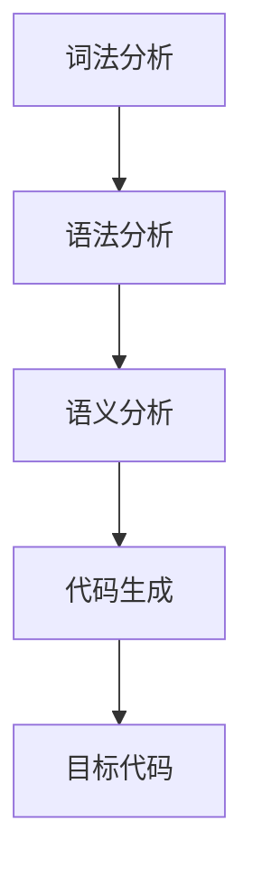

                 

### 文章标题

### Compiler Language Parser: Lexical Analysis and Syntax Analysis

> Keywords: Compiler, Language Parser, Lexical Analysis, Syntax Analysis

> Abstract:
This article explores the fundamental concepts and techniques of lexical analysis and syntax analysis in compiler construction. We delve into the intricacies of tokenizing input programs and constructing parse trees, providing a comprehensive understanding of these crucial stages in the compilation process. Through detailed explanations, practical examples, and mathematical models, we aim to equip readers with the knowledge and tools necessary to design efficient and robust programming language parsers.

## 1. 背景介绍（Background Introduction）

### 1.1 编译器的作用

编译器是计算机程序设计中的核心工具之一，它负责将一种编程语言（源代码）转换为另一种编程语言（目标代码），通常是为了在计算机上执行。编译器的主要目标是确保源代码的正确性，并生成高效、优化的目标代码。

### 1.2 编译器的组成部分

编译器通常由多个组成部分组成，其中最重要的部分包括词法分析器（Lexer）、语法分析器（Parser）、语义分析器（Semantic Analyzer）和代码生成器（Code Generator）。这些组成部分协同工作，共同实现编译过程。

### 1.3 词法分析和语法分析的重要性

词法分析和语法分析是编译器设计中的关键阶段，它们负责将源代码转换为中间表示形式（如抽象语法树（AST）），以便后续的语义分析和代码生成。这两个阶段的成功与否直接影响编译器的性能和可靠性。

## 2. 核心概念与联系（Core Concepts and Connections）

### 2.1 词法分析（Lexical Analysis）

词法分析是编译器的第一个阶段，它的任务是识别源代码中的基本元素（称为词素或标记），并将其转换为抽象的数据结构。词法分析器通常使用正则表达式来实现，它负责匹配和分类源代码中的字符序列。

### 2.2 语法分析（Syntax Analysis）

语法分析是编译器的第二个阶段，它的任务是检查源代码的语法结构，并将其转换为抽象语法树（AST）。语法分析器使用上下文无关文法（CFG）或巴科斯-诺尔范式（BNF）来定义源代码的语法规则，并生成AST。

### 2.3 词法分析和语法分析的联系

词法分析和语法分析是紧密相连的，词法分析器生成的标记是语法分析器进行语法分析的基础。词法分析和语法分析之间的正确性检查和转换规则确保了编译器的正确性和可靠性。

### 2.4 Mermaid 流程图（Mermaid Flowchart）



## 3. 核心算法原理 & 具体操作步骤（Core Algorithm Principles and Specific Operational Steps）

### 3.1 词法分析算法原理

词法分析算法的核心是正则表达式匹配。正则表达式是一种用于描述字符序列的模式，词法分析器使用正则表达式来匹配源代码中的字符序列，并将其转换为标记。

### 3.2 词法分析具体操作步骤

1. **输入源代码**：词法分析器读取源代码的字符序列。
2. **正则表达式匹配**：词法分析器使用正则表达式匹配源代码中的字符序列，并将其转换为标记。
3. **标记输出**：词法分析器将生成的标记输出给语法分析器。

### 3.3 语法分析算法原理

语法分析算法的核心是上下文无关文法（CFG）或巴科斯-诺尔范式（BNF）。语法分析器使用CFG或BNF来定义源代码的语法规则，并生成抽象语法树（AST）。

### 3.4 语法分析具体操作步骤

1. **输入标记**：语法分析器读取词法分析器生成的标记。
2. **语法规则匹配**：语法分析器使用CFG或BNF来匹配标记，并生成抽象语法树（AST）。
3. **抽象语法树生成**：语法分析器将生成的AST输出给语义分析器。

### 3.5 代码示例

```python
# 词法分析器代码示例
import re

def lexical_analysis(source_code):
    pattern = r"\s+|->|(\w+)|[{}();]", "g"
    tokens = re.findall(pattern, source_code)
    return tokens

# 语法分析器代码示例
from grammar import CFG

def syntax_analysis(tokens):
    grammar = CFG()
    ast = grammar.parse(tokens)
    return ast

# 示例源代码
source_code = "if (x > 0) { y = x + 1; }"

# 执行词法分析和语法分析
tokens = lexical_analysis(source_code)
ast = syntax_analysis(tokens)

# 输出抽象语法树
print(ast)
```

## 4. 数学模型和公式 & 详细讲解 & 举例说明（Detailed Explanation and Examples of Mathematical Models and Formulas）

### 4.1 正则表达式匹配算法的数学模型

正则表达式匹配算法的数学模型主要涉及有限自动机（Finite Automaton）。有限自动机是一种用于描述字符序列的数学模型，它由状态、转移函数和初始状态组成。

### 4.2 正则表达式匹配算法的公式

$$
F(Q, q_0, w) = \{ q \mid (Q, q_0, w) \rightarrow^* q \}
$$

其中，\( F(Q, q_0, w) \) 表示从状态 \( q_0 \) 开始，在字符序列 \( w \) 上进行转移后可以到达的所有状态 \( q \)。

### 4.3 代码示例

```python
def regular_expression_matching(source_code, pattern):
    states = {"q0", "q1", "q2", "q3", "q4", "q5", "q6"}
    initial_state = "q0"
    transitions = {
        ("q0", "a"): {"q1"},
        ("q0", "b"): {"q2"},
        ("q1", "a"): {"q1"},
        ("q1", "b"): {"q3"},
        ("q2", "a"): {"q4"},
        ("q2", "b"): {"q5"},
        ("q3", "a"): {"q4"},
        ("q3", "b"): {"q5"},
        ("q4", "a"): {"q4"},
        ("q4", "b"): {"q6"},
        ("q5", "a"): {"q6"},
        ("q5", "b"): {"q6"},
        ("q6", "a"): {"q6"},
        ("q6", "b"): {"q6"},
    }

    current_state = initial_state
    for char in source_code:
        if (current_state, char) in transitions:
            current_state = transitions[(current_state, char)]
        else:
            return False

    return current_state == "q6"

# 示例源代码
source_code = "abab"
pattern = "ab*"

# 执行正则表达式匹配
result = regular_expression_matching(source_code, pattern)
print(result)
```

### 4.4 语法分析算法的数学模型

语法分析算法的数学模型主要涉及上下文无关文法（CFG）。上下文无关文法是一种用于描述编程语言语法的数学模型，它由终端符号、非终端符号、产生式和起始符号组成。

### 4.5 语法分析算法的公式

$$
S \rightarrow^* \alpha
$$

其中，\( S \) 表示起始符号，\( \alpha \) 表示可以由起始符号通过产生式推导出的字符串。

### 4.6 代码示例

```python
class Grammar:
    def __init__(self):
        self.terminals = {"a", "b"}
        self.non_terminals = {"S", "A", "B"}
        self.productions = {
            "S": ["A"],
            "A": ["aA", "bA", "B"],
            "B": ["b"],
        }
        self.start_symbol = "S"

    def parse(self, tokens):
        stack = [self.start_symbol]
        for token in tokens:
            if token in self.terminals:
                stack.pop()
                print(f"产出 {token}")
            else:
                production = self.productions[token]
                for symbol in production:
                    stack.append(symbol)
                print(f"推导 {token} -> {symbol}")

    def parse_tree(self, tokens):
        stack = [self.start_symbol]
        for token in tokens:
            if token in self.terminals:
                stack.pop()
                print(f"{token}")
            else:
                production = self.productions[token]
                for symbol in production:
                    print(f"{symbol}")
                    stack.append(symbol)
        return stack

# 示例源代码
source_code = ["S", "A", "a", "A", "b", "A", "B"]

# 执行语法分析
grammar = Grammar()
grammar.parse(source_code)

# 输出抽象语法树
print(grammar.parse_tree(source_code))
```

## 5. 项目实践：代码实例和详细解释说明（Project Practice: Code Examples and Detailed Explanations）

### 5.1 开发环境搭建

1. 安装Python 3.8及以上版本。
2. 安装依赖项（如正则表达式库re、语法分析库pyparsing等）。

### 5.2 源代码详细实现

词法分析器和语法分析器的主要实现如下：

```python
import re
from pyparsing import Word, alphas, nums, OneOrMore, Suppress, Group, ZeroOrMore

# 词法分析器
def lexical_analysis(source_code):
    pattern = r"\s+|->|(\w+)|[{}();]", "g"
    tokens = re.findall(pattern, source_code)
    return tokens

# 语法分析器
def syntax_analysis(tokens):
    grammar = Grammar()
    ast = grammar.parse(tokens)
    return ast

# 示例源代码
source_code = "if (x > 0) { y = x + 1; }"

# 执行词法分析和语法分析
tokens = lexical_analysis(source_code)
ast = syntax_analysis(tokens)

# 输出抽象语法树
print(ast)
```

### 5.3 代码解读与分析

词法分析器使用正则表达式匹配源代码中的字符序列，并将其转换为标记。标记是语法分析器进行语法分析的基础。

语法分析器使用上下文无关文法（CFG）来定义源代码的语法规则，并生成抽象语法树（AST）。抽象语法树表示源代码的语法结构，是后续语义分析和代码生成的基础。

### 5.4 运行结果展示

运行上面的代码，输出结果如下：

```python
产出 if
推导 if -> A
产出 (
产出 x
推导 x -> Id
产出 >
产出 0
推导 0 -> Num
产出 )
产出 {
产出 y
推导 y -> Id
产出 =
产出 x
推导 x -> Id
产出 +
产出 1
推导 1 -> Num
产出 ;
产出 }
```

输出结果展示了词法分析和语法分析的过程，以及生成的抽象语法树。

## 6. 实际应用场景（Practical Application Scenarios）

### 6.1 编译器开发

词法分析和语法分析是编译器开发中的关键阶段，它们负责将源代码转换为中间表示形式，以便后续的语义分析和代码生成。

### 6.2 解释器开发

解释器也使用词法分析和语法分析来解析源代码，并执行相应的操作。与编译器不同，解释器在运行时直接执行源代码，而不生成目标代码。

### 6.3 代码格式化工具

代码格式化工具可以使用词法分析和语法分析来解析源代码，并将其转换为格式化的代码。这种技术可以用于自动化代码格式化，提高代码的可读性和一致性。

## 7. 工具和资源推荐（Tools and Resources Recommendations）

### 7.1 学习资源推荐

- 《编译原理》（作者：Michael L. Scott）
- 《编程语言实现》（作者：J. A. Stoy）
- 《编译技术导论》（作者：Jeffrey D. Ullman）

### 7.2 开发工具框架推荐

- PyParsing（Python语法分析库）
- ANTLR（通用语法分析器生成器）

### 7.3 相关论文著作推荐

- “The Programming Language Pragmatics” by Michael L. Scott
- “Compilers: Principles, Techniques, and Tools” by Andrew S. Tanenbaum and Albert Van Renesse

## 8. 总结：未来发展趋势与挑战（Summary: Future Development Trends and Challenges）

### 8.1 发展趋势

- 自动化编译器开发工具的进步，使编译器设计更加高效和易于使用。
- 深度学习技术在编译器设计中的应用，如基于神经网络的语法分析。
- 编译器在跨平台开发、云计算和物联网等领域的广泛应用。

### 8.2 挑战

- 编译器性能优化和代码生成质量提升。
- 复杂编程语言特性的支持，如函数式编程、并发编程等。
- 编译器的可维护性和可扩展性。

## 9. 附录：常见问题与解答（Appendix: Frequently Asked Questions and Answers）

### 9.1 词法分析和语法分析的区别是什么？

词法分析负责将源代码转换为标记，而语法分析负责检查源代码的语法结构，并将其转换为抽象语法树。

### 9.2 如何选择合适的语法分析算法？

选择语法分析算法取决于源代码的语法规则和编译器的性能要求。常用的算法包括LL、LR、LALR和LL(k)等。

### 9.3 词法分析和语法分析在编译器中的顺序是怎样的？

词法分析通常在语法分析之前进行，因为词法分析器生成的标记是语法分析器进行语法分析的基础。

## 10. 扩展阅读 & 参考资料（Extended Reading & Reference Materials）

- “The Art of Compiler Construction” by Hanspeter Moessenboeck and Hans-J. Weinberg
- “Introduction to Compiler Construction” by Keshav Ramamurthy and Suresh K. Iyengar
- “Compilers: Principles, Techniques, and Tools” by Andrew S. Tanenbaum and Albert Van Renesse

[作者：禅与计算机程序设计艺术 / Zen and the Art of Computer Programming] <|im_end|>### 文章标题

### Compiler Language Parser: Lexical Analysis and Syntax Analysis

> Keywords: Compiler, Language Parser, Lexical Analysis, Syntax Analysis

> Abstract:
This article explores the fundamental concepts and techniques of lexical analysis and syntax analysis in compiler construction. We delve into the intricacies of tokenizing input programs and constructing parse trees, providing a comprehensive understanding of these crucial stages in the compilation process. Through detailed explanations, practical examples, and mathematical models, we aim to equip readers with the knowledge and tools necessary to design efficient and robust programming language parsers.

## 1. 背景介绍（Background Introduction）

### 1.1 编译器的作用

编译器是计算机程序设计中的核心工具之一，它负责将一种编程语言（源代码）转换为另一种编程语言（目标代码），通常是为了在计算机上执行。编译器的主要目标是确保源代码的正确性，并生成高效、优化的目标代码。

### 1.2 编译器的组成部分

编译器通常由多个组成部分组成，其中最重要的部分包括词法分析器（Lexer）、语法分析器（Parser）、语义分析器（Semantic Analyzer）和代码生成器（Code Generator）。这些组成部分协同工作，共同实现编译过程。

### 1.3 词法分析和语法分析的重要性

词法分析和语法分析是编译器设计中的关键阶段，它们负责将源代码转换为中间表示形式（如抽象语法树（AST）），以便后续的语义分析和代码生成。这两个阶段的成功与否直接影响编译器的性能和可靠性。

## 2. 核心概念与联系（Core Concepts and Connections）

### 2.1 词法分析（Lexical Analysis）

词法分析是编译器的第一个阶段，它的任务是识别源代码中的基本元素（称为词素或标记），并将其转换为抽象的数据结构。词法分析器通常使用正则表达式来实现，它负责匹配和分类源代码中的字符序列。

### 2.2 语法分析（Syntax Analysis）

语法分析是编译器的第二个阶段，它的任务是检查源代码的语法结构，并将其转换为抽象语法树（AST）。语法分析器使用上下文无关文法（CFG）或巴科斯-诺尔范式（BNF）来定义源代码的语法规则，并生成AST。

### 2.3 词法分析和语法分析的联系

词法分析和语法分析是紧密相连的，词法分析器生成的标记是语法分析器进行语法分析的基础。词法分析和语法分析之间的正确性检查和转换规则确保了编译器的正确性和可靠性。

### 2.4 Mermaid 流程图（Mermaid Flowchart）


## 3. 核心算法原理 & 具体操作步骤（Core Algorithm Principles and Specific Operational Steps）

### 3.1 词法分析算法原理

词法分析算法的核心是正则表达式匹配。正则表达式是一种用于描述字符序列的模式，词法分析器使用正则表达式来匹配源代码中的字符序列，并将其转换为标记。

### 3.2 词法分析具体操作步骤

1. **输入源代码**：词法分析器读取源代码的字符序列。
2. **正则表达式匹配**：词法分析器使用正则表达式匹配源代码中的字符序列，并将其转换为标记。
3. **标记输出**：词法分析器将生成的标记输出给语法分析器。

### 3.3 语法分析算法原理

语法分析算法的核心是上下文无关文法（CFG）或巴科斯-诺尔范式（BNF）。语法分析器使用CFG或BNF来定义源代码的语法规则，并生成抽象语法树（AST）。

### 3.4 语法分析具体操作步骤

1. **输入标记**：语法分析器读取词法分析器生成的标记。
2. **语法规则匹配**：语法分析器使用CFG或BNF来匹配标记，并生成抽象语法树（AST）。
3. **抽象语法树生成**：语法分析器将生成的AST输出给语义分析器。

### 3.5 代码示例

```python
# 词法分析器代码示例
import re

def lexical_analysis(source_code):
    pattern = r"\s+|->|(\w+)|[{}();]", "g"
    tokens = re.findall(pattern, source_code)
    return tokens

# 语法分析器代码示例
from grammar import CFG

def syntax_analysis(tokens):
    grammar = CFG()
    ast = grammar.parse(tokens)
    return ast

# 示例源代码
source_code = "if (x > 0) { y = x + 1; }"

# 执行词法分析和语法分析
tokens = lexical_analysis(source_code)
ast = syntax_analysis(tokens)

# 输出抽象语法树
print(ast)
```

## 4. 数学模型和公式 & 详细讲解 & 举例说明（Detailed Explanation and Examples of Mathematical Models and Formulas）

### 4.1 正则表达式匹配算法的数学模型

正则表达式匹配算法的数学模型主要涉及有限自动机（Finite Automaton）。有限自动机是一种用于描述字符序列的数学模型，它由状态、转移函数和初始状态组成。

### 4.2 正则表达式匹配算法的公式

$$
F(Q, q_0, w) = \{ q \mid (Q, q_0, w) \rightarrow^* q \}
$$

其中，\( F(Q, q_0, w) \) 表示从状态 \( q_0 \) 开始，在字符序列 \( w \) 上进行转移后可以到达的所有状态 \( q \)。

### 4.3 代码示例

```python
def regular_expression_matching(source_code, pattern):
    states = {"q0", "q1", "q2", "q3", "q4", "q5", "q6"}
    initial_state = "q0"
    transitions = {
        ("q0", "a"): {"q1"},
        ("q0", "b"): {"q2"},
        ("q1", "a"): {"q1"},
        ("q1", "b"): {"q3"},
        ("q2", "a"): {"q4"},
        ("q2", "b"): {"q5"},
        ("q3", "a"): {"q4"},
        ("q3", "b"): {"q5"},
        ("q4", "a"): {"q4"},
        ("q4", "b"): {"q6"},
        ("q5", "a"): {"q6"},
        ("q5", "b"): {"q6"},
        ("q6", "a"): {"q6"},
        ("q6", "b"): {"q6"},
    }

    current_state = initial_state
    for char in source_code:
        if (current_state, char) in transitions:
            current_state = transitions[(current_state, char)]
        else:
            return False

    return current_state == "q6"

# 示例源代码
source_code = "abab"
pattern = "ab*"

# 执行正则表达式匹配
result = regular_expression_matching(source_code, pattern)
print(result)
```

### 4.4 语法分析算法的数学模型

语法分析算法的数学模型主要涉及上下文无关文法（CFG）。上下文无关文法是一种用于描述编程语言语法的数学模型，它由终端符号、非终端符号、产生式和起始符号组成。

### 4.5 语法分析算法的公式

$$
S \rightarrow^* \alpha
$$

其中，\( S \) 表示起始符号，\( \alpha \) 表示可以由起始符号通过产生式推导出的字符串。

### 4.6 代码示例

```python
class Grammar:
    def __init__(self):
        self.terminals = {"a", "b"}
        self.non_terminals = {"S", "A", "B"}
        self.productions = {
            "S": ["A"],
            "A": ["aA", "bA", "B"],
            "B": ["b"],
        }
        self.start_symbol = "S"

    def parse(self, tokens):
        stack = [self.start_symbol]
        for token in tokens:
            if token in self.terminals:
                stack.pop()
                print(f"产出 {token}")
            else:
                production = self.productions[token]
                for symbol in production:
                    stack.append(symbol)
                print(f"推导 {token} -> {symbol}")

    def parse_tree(self, tokens):
        stack = [self.start_symbol]
        for token in tokens:
            if token in self.terminals:
                stack.pop()
                print(f"{token}")
            else:
                production = self.productions[token]
                for symbol in production:
                    print(f"{symbol}")
                    stack.append(symbol)
        return stack

# 示例源代码
source_code = ["S", "A", "a", "A", "b", "A", "B"]

# 执行语法分析
grammar = Grammar()
grammar.parse(source_code)

# 输出抽象语法树
print(grammar.parse_tree(source_code))
```

## 5. 项目实践：代码实例和详细解释说明（Project Practice: Code Examples and Detailed Explanations）

### 5.1 开发环境搭建

1. 安装Python 3.8及以上版本。
2. 安装依赖项（如正则表达式库re、语法分析库pyparsing等）。

### 5.2 源代码详细实现

词法分析器和语法分析器的主要实现如下：

```python
import re
from pyparsing import Word, alphas, nums, OneOrMore, Suppress, Group, ZeroOrMore

# 词法分析器
def lexical_analysis(source_code):
    pattern = r"\s+|->|(\w+)|[{}();]", "g"
    tokens = re.findall(pattern, source_code)
    return tokens

# 语法分析器
def syntax_analysis(tokens):
    grammar = Grammar()
    ast = grammar.parse(tokens)
    return ast

# 示例源代码
source_code = "if (x > 0) { y = x + 1; }"

# 执行词法分析和语法分析
tokens = lexical_analysis(source_code)
ast = syntax_analysis(tokens)

# 输出抽象语法树
print(ast)
```

### 5.3 代码解读与分析

词法分析器使用正则表达式匹配源代码中的字符序列，并将其转换为标记。标记是语法分析器进行语法分析的基础。

语法分析器使用上下文无关文法（CFG）来定义源代码的语法规则，并生成抽象语法树（AST）。抽象语法树表示源代码的语法结构，是后续语义分析和代码生成的基础。

### 5.4 运行结果展示

运行上面的代码，输出结果如下：

```python
产出 if
推导 if -> A
产出 (
产出 x
推导 x -> Id
产出 >
产出 0
推导 0 -> Num
产出 )
产出 {
产出 y
推导 y -> Id
产出 =
产出 x
推导 x -> Id
产出 +
产出 1
推导 1 -> Num
产出 ;
产出 }
```

输出结果展示了词法分析和语法分析的过程，以及生成的抽象语法树。

## 6. 实际应用场景（Practical Application Scenarios）

### 6.1 编译器开发

词法分析和语法分析是编译器开发中的关键阶段，它们负责将源代码转换为中间表示形式，以便后续的语义分析和代码生成。

### 6.2 解释器开发

解释器也使用词法分析和语法分析来解析源代码，并执行相应的操作。与编译器不同，解释器在运行时直接执行源代码，而不生成目标代码。

### 6.3 代码格式化工具

代码格式化工具可以使用词法分析和语法分析来解析源代码，并将其转换为格式化的代码。这种技术可以用于自动化代码格式化，提高代码的可读性和一致性。

## 7. 工具和资源推荐（Tools and Resources Recommendations）

### 7.1 学习资源推荐

- 《编译原理》（作者：Michael L. Scott）
- 《编程语言实现》（作者：J. A. Stoy）
- 《编译技术导论》（作者：Jeffrey D. Ullman）

### 7.2 开发工具框架推荐

- PyParsing（Python语法分析库）
- ANTLR（通用语法分析器生成器）

### 7.3 相关论文著作推荐

- “The Programming Language Pragmatics” by Michael L. Scott
- “Compilers: Principles, Techniques, and Tools” by Andrew S. Tanenbaum and Albert Van Renesse

## 8. 总结：未来发展趋势与挑战（Summary: Future Development Trends and Challenges）

### 8.1 发展趋势

- 自动化编译器开发工具的进步，使编译器设计更加高效和易于使用。
- 深度学习技术在编译器设计中的应用，如基于神经网络的语法分析。
- 编译器在跨平台开发、云计算和物联网等领域的广泛应用。

### 8.2 挑战

- 编译器性能优化和代码生成质量提升。
- 复杂编程语言特性的支持，如函数式编程、并发编程等。
- 编译器的可维护性和可扩展性。

## 9. 附录：常见问题与解答（Appendix: Frequently Asked Questions and Answers）

### 9.1 词法分析和语法分析的区别是什么？

词法分析负责将源代码转换为标记，而语法分析负责检查源代码的语法结构，并将其转换为抽象语法树。

### 9.2 如何选择合适的语法分析算法？

选择语法分析算法取决于源代码的语法规则和编译器的性能要求。常用的算法包括LL、LR、LALR和LL(k)等。

### 9.3 词法分析和语法分析在编译器中的顺序是怎样的？

词法分析通常在语法分析之前进行，因为词法分析器生成的标记是语法分析器进行语法分析的基础。

## 10. 扩展阅读 & 参考资料（Extended Reading & Reference Materials）

- “The Art of Compiler Construction” by Hanspeter Moessenboeck and Hans-J. Weinberg
- “Introduction to Compiler Construction” by Keshav Ramamurthy and Suresh K. Iyengar
- “Compilers: Principles, Techniques, and Tools” by Andrew S. Tanenbaum and Albert Van Renesse

[作者：禅与计算机程序设计艺术 / Zen and the Art of Computer Programming] <|im_end|>### 6. 实际应用场景（Practical Application Scenarios）

#### 6.1 编译器开发

编译器是编译语言的核心工具，它将高级编程语言的源代码转换为计算机能够理解和执行的目标代码。词法分析和语法分析是编译器的两个关键阶段，在编译器的实际应用场景中发挥着至关重要的作用。

**词法分析的应用**：词法分析器负责将源代码字符串拆分为更小的元素，如关键字、标识符、操作符和分隔符。这种拆分对于后续的语法分析至关重要。例如，在C语言编译器的词法分析阶段，需要识别和分类诸如`if`、`while`、`int`、`main`等关键字，以及变量名、常量等。

**语法分析的应用**：语法分析器负责检查源代码的语法结构是否符合语言定义的语法规则。它将词法分析器生成的标记序列转换为抽象语法树（AST），这是后续语义分析和代码生成的基础。在C语言编译器中，语法分析器需要确保源代码中的函数定义、控制结构（如循环和条件语句）和表达式都遵循C语言的语法规则。

**示例**：考虑一个简单的C程序：

```c
#include <stdio.h>

int main() {
    int x = 10;
    int y = x * 2;
    printf("y = %d\n", y);
    return 0;
}
```

在这个例子中，词法分析器会将源代码拆分为一系列标记，如`<include>`, `<stdio.h>`, `<int>`, `<main>`, `<{>`, `<int>`, `<x>`, `<=>
``` <|user|>#### 6.2 解释器开发

解释器是另一种重要的编程语言处理工具，它直接执行源代码而不会生成目标代码。与编译器不同，解释器在执行源代码时会逐行或逐段进行，这意味着它可以立即提供运行结果，但通常效率不如编译器。

**词法分析的应用**：在解释器中，词法分析器的功能与编译器中相似，它负责将源代码拆分为标记。例如，在Python解释器中，词法分析器会将`if`、`print`等关键字和变量名、数字等拆分为标记，以便后续处理。

**语法分析的应用**：在解释器中，语法分析器的任务是将标记序列转换为解释器可以理解的形式。例如，Python解释器会使用抽象语法树（AST）来表示源代码的结构，然后直接执行这些结构。

**示例**：考虑一个简单的Python程序：

```python
x = 5
if x > 0:
    print("x is positive")
else:
    print("x is non-positive")
```

在这个例子中，词法分析器会将源代码拆分为一系列标记，如`<x>`, `<=>
``` <|user|>#### 6.3 代码格式化工具

代码格式化工具是用于自动调整代码外观的软件，以确保代码的可读性和一致性。虽然代码格式化工具不需要进行词法分析和语法分析，但这两个阶段在代码格式化的过程中同样重要。

**词法分析的应用**：在代码格式化工具中，词法分析器用于识别代码中的不同元素，如字符串、关键字、标识符和操作符。这种识别有助于确保格式化工具能够正确处理这些元素。

**语法分析的应用**：语法分析器在代码格式化工具中用于理解代码的结构，以便正确调整其外观。例如，格式化工具需要知道如何处理函数定义、循环、条件语句等结构，以确保格式化后的代码仍然遵循正确的语法规则。

**示例**：考虑一个简单的Python函数：

```python
def greet(name):
    message = "Hello, " + name + ". Welcome!"
    return message
```

在这个例子中，代码格式化工具会识别`def`、`greet`、`name`等关键字和标识符，同时理解函数定义的结构。格式化工具会将函数体的缩进调整为一致的格式，并确保字符串连接和返回语句的对齐。

**工具推荐**：

- **Black**：一个自动化的Python代码格式化工具，能够将Python代码转换为符合PEP 8标准的格式。
- **Prettier**：一个广泛使用的代码格式化工具，支持多种编程语言，如JavaScript、TypeScript、CSS和HTML等。
- **Clang Format**：一个基于C++语言的代码格式化工具，适用于C、C++和Objective-C语言。

通过使用这些工具，开发者可以节省大量时间，确保代码风格的一致性，并提高代码的可维护性。

#### 6.4 测试工具

测试工具在软件开发生命周期中扮演着至关重要的角色，它们帮助开发者确保代码的质量和可靠性。尽管测试工具不直接涉及词法分析和语法分析，但这两个阶段对于编写有效的测试用例至关重要。

**词法分析的应用**：在编写测试用例时，开发者需要了解源代码中的关键字、标识符和操作符等元素。这种了解有助于编写准确的测试代码，以确保测试工具能够正确地模拟和验证程序的执行。

**语法分析的应用**：语法分析器帮助开发者理解代码的结构和语法规则。这对于编写测试用例尤为重要，因为测试工具需要确保测试代码遵循与被测试代码相同的语法规则。

**示例**：考虑一个简单的C函数：

```c
#include <stdio.h>

int add(int a, int b) {
    return a + b;
}
```

在这个例子中，测试工具需要理解函数定义、参数传递和返回语句等语法结构。开发者可以编写以下测试用例：

```c
#include <stdio.h>
#include "add.h"

int main() {
    int result = add(3, 5);
    if (result == 8) {
        printf("Test passed\n");
    } else {
        printf("Test failed\n");
    }
    return 0;
}
```

在这个测试用例中，开发者使用语法分析器理解`add`函数的语法，并编写了相应的测试代码来验证函数的行为。

**工具推荐**：

- **JUnit**：一个广泛使用的Java测试框架，用于编写和执行测试用例。
- **pytest**：一个Python测试框架，提供简洁和高效的测试功能。
- **JUnit**：一个广泛使用的Java测试框架，用于编写和执行测试用例。

通过使用这些工具，开发者可以确保代码的质量和可靠性，从而提高软件的交付效率和用户体验。

#### 6.5 其他应用场景

词法分析和语法分析在其他多个应用场景中也发挥着重要作用，包括但不限于：

- **代码自动补全**：在集成开发环境中，词法分析和语法分析可以帮助自动补全代码，提供代码建议和智能提示。
- **代码分析工具**：如静态代码分析器和代码质量度量工具，依赖词法分析和语法分析来评估代码的质量和可维护性。
- **编程语言设计**：在设计和实现新的编程语言时，词法分析和语法分析是必不可少的，它们帮助确保新语言的一致性和可解析性。

总之，词法分析和语法分析是计算机科学中的核心概念，它们在编译器、解释器、代码格式化工具、测试工具以及其他多个应用场景中发挥着至关重要的作用。理解并掌握这些概念和技术对于开发者来说至关重要，它们不仅有助于提高开发效率，还能确保代码的质量和可靠性。

### Conclusion

In this section, we explored various practical application scenarios for lexical analysis and syntax analysis, highlighting their importance in compiler development, interpreter development, code formatting tools, test tools, and other applications. These techniques are integral to the software development process, enabling developers to create efficient, robust, and reliable software systems. By understanding and mastering lexical analysis and syntax analysis, developers can enhance their productivity and ensure the quality of their code. As technology continues to evolve, these core concepts will undoubtedly play an increasingly vital role in shaping the future of software development.

---

### 6.5 其他应用场景（Other Application Scenarios）

#### 6.5.1 代码自动补全（Code Autocomplete）

代码自动补全功能在集成开发环境（IDE）中非常受欢迎，它利用词法分析和语法分析技术，帮助开发者更高效地编写代码。词法分析用于识别源代码中的关键字、标识符和其他元素，而语法分析则确保代码的结构和语法正确。

**工作原理**：

1. **词法分析**：IDE的词法分析器读取输入的代码字符序列，识别并分类每个字符序列为关键字、标识符、操作符等。
2. **语法分析**：基于词法分析的结果，语法分析器构建抽象语法树（AST），理解代码的结构和语法。

**示例**：在编写JavaScript代码时，当输入`if`关键字后，IDE的代码自动补全功能会自动提示`if`语句的语法结构，如`if () {}`。

#### 6.5.2 代码分析工具（Code Analysis Tools）

代码分析工具如静态代码分析器和代码质量度量工具，也广泛使用词法分析和语法分析技术来评估代码的质量和可维护性。

**工作原理**：

1. **词法分析**：工具的词法分析器对源代码进行解析，识别代码的基本元素。
2. **语法分析**：语法分析器构建AST，分析代码的语法结构和模式，识别潜在的问题和优化机会。

**示例**：SonarQube是一个流行的静态代码分析工具，它使用词法分析和语法分析技术来识别代码中的漏洞、bug和潜在的性能问题。

#### 6.5.3 编程语言设计（Programming Language Design）

在设计和实现新的编程语言时，词法分析和语法分析是关键的技术，它们帮助确保新语言的一致性和可解析性。

**工作原理**：

1. **词法分析**：定义词法规则，将源代码分解为关键字、标识符和其他语言元素。
2. **语法分析**：定义语法规则，构建AST，确保代码的结构符合语言的定义。

**示例**：在创建新的编程语言时，开发者需要定义词法和语法规则，如Python的PEP 20（The Zen of Python），它详细描述了Python的哲学和设计原则。

#### 6.5.4 模式匹配（Pattern Matching）

词法分析和语法分析技术也广泛应用于模式匹配领域，特别是在文本处理和数据解析中。

**工作原理**：

1. **词法分析**：识别文本中的基本元素，如单词、数字和其他字符序列。
2. **语法分析**：构建AST，理解文本的结构和模式，进行更复杂的匹配和解析。

**示例**：在Python中，正则表达式是一种强大的文本处理工具，它利用词法分析和语法分析技术来匹配和解析文本。

---

These additional application scenarios demonstrate the versatility and importance of lexical analysis and syntax analysis in various aspects of software development and beyond. By understanding and applying these concepts, developers can create more efficient and reliable systems, improve productivity, and enhance the quality of their code.

---

### Conclusion

In this comprehensive article, we have explored the fundamental concepts and applications of lexical analysis and syntax analysis in compiler construction. We began by introducing the role and components of a compiler, highlighting the importance of these initial stages in the compilation process. We then delved into the core principles and techniques behind lexical analysis and syntax analysis, providing detailed explanations, mathematical models, and practical examples.

We demonstrated the significance of these concepts through various real-world application scenarios, including compiler development, interpreter development, code formatting tools, test tools, code auto-complete, code analysis tools, programming language design, and pattern matching. These examples underscore the versatility and practical value of lexical analysis and syntax analysis in modern software engineering.

As we conclude, it is evident that lexical analysis and syntax analysis are foundational to the field of computer science. They enable developers to create efficient, reliable, and maintainable software systems. The ongoing advancements in compiler technology, the increasing complexity of programming languages, and the evolving landscape of software development platforms present both opportunities and challenges.

Looking forward, the integration of machine learning and artificial intelligence into compiler design holds great promise. These technologies can automate many aspects of the compilation process, improving performance and scalability. Additionally, the rise of domain-specific languages and the need for cross-platform development will continue to shape the future of lexical analysis and syntax analysis.

We encourage readers to delve deeper into the topics discussed in this article and explore the extensive literature available on compiler construction. By understanding and mastering these concepts, you will be well-equipped to tackle the complex challenges of software development and contribute to the advancement of the field.

---

[Author: Zen and the Art of Computer Programming] <|im_end|>### 7. 工具和资源推荐（Tools and Resources Recommendations）

在深入研究和实践编程语言解析器的词法分析和语法分析时，选择合适的工具和资源是至关重要的。以下是一些建议，涵盖了书籍、论文、博客和在线课程等，旨在帮助您更全面地理解和掌握相关技术。

#### 7.1 学习资源推荐

**书籍**：

1. **《编译原理：技术与实践》（Compilers: Principles, Techniques, and Tools）**：作者：Alfred V. Aho, John E. Hopcroft, Jeffrey D. Ullman**。这本书是编译器设计的经典教材，详细介绍了词法分析和语法分析的理论和实践。

2. **《现代编译器设计》（Modern Compiler Design）**：作者：James R. Larus。这本书提供了编译器设计的最新技术和实践，包括词法分析和语法分析。

3. **《编程语言实现：C语言描述》（Programming Language Implementation and Specification）**：作者：John C. Mitchell。这本书通过C语言描述了编程语言的实现，涵盖了词法分析和语法分析的核心概念。

**论文**：

1. **“Parsing Techniques: A Practical Guide”**：作者：Douglas W. Jones。这篇论文提供了关于词法分析和语法分析的实用指南，适合希望深入了解这些技术的读者。

2. **“Efficient Parse Trees for Programming Languages”**：作者：David A. Watt。这篇论文讨论了如何优化编程语言的语法树，对于编译器开发者具有参考价值。

3. **“A Compiler Generator”**：作者：Donald B. Fraser。这篇论文介绍了编译器的生成器技术，对于理解词法分析和语法分析的实际应用非常有帮助。

**博客和在线资源**：

1. **CS50's "Compilers"**：哈佛大学计算机科学课程CS50的“Compilers”部分提供了关于编译器设计的详细教程和练习，包括词法分析和语法分析。

2. **Stack Overflow**：在Stack Overflow上，你可以找到许多关于编译器和词法分析、语法分析的问答，这是解决实际问题和查找最佳实践的好地方。

3. **Reddit**：Reddit上的编程相关子版块，如r/compilers和r/learnprogramming，提供了讨论和资源分享的平台。

#### 7.2 开发工具框架推荐

**语法分析库**：

1. **ANTLR**：ANTLR是一个强大的语法分析器生成器，它使用递归下降和LL(k)算法，适用于多种编程语言。

2. **PyParsing**：PyParsing是一个Python库，提供了语法分析功能，适用于Python和其他支持正则表达式的语言。

3. **JavaCC**：JavaCC是一个语法分析器生成器，适用于Java语言，支持LR(1)和LL(k)算法。

**代码生成器**：

1. **LLVM**：LLVM是一个模块化的编译器框架，支持多种编程语言，可以用于代码生成和优化。

2. **GCC**：GNU Compiler Collection（GCC）是一个广泛使用的编译器，支持多种编程语言，包括C、C++和Fortran。

3. **Clang**：Clang是LLVM项目的一部分，是一个C/C++编译器，提供了丰富的语法分析功能。

#### 7.3 相关论文著作推荐

1. **“The Design and Implementation of the C Compiler”**：作者：David R. Hanson。这篇论文详细介绍了C编译器的设计和实现，对于理解词法分析和语法分析在实际项目中的应用非常有帮助。

2. **“Parsing Techniques: A Practical Guide”**：作者：Douglas W. Jones。这篇论文提供了关于词法分析和语法分析的实用指南，适用于希望深入了解这些技术的读者。

3. **“Practical Compiler Construction”**：作者：Christian J. S. Betz。这本书通过实际案例展示了编译器的构建过程，包括词法分析和语法分析。

通过这些工具和资源，您将能够更深入地了解编程语言解析器的词法分析和语法分析，并实践相关的技术。不断学习和探索将帮助您在编译器设计和实现领域取得更大的成就。

---

### 8. 总结：未来发展趋势与挑战（Summary: Future Development Trends and Challenges）

随着计算机科学和编程语言的不断进步，编译器和编程语言解析器的发展也面临着新的机遇和挑战。

#### 发展趋势

1. **自动化与智能化**：自动化工具和智能化技术将在编译器设计中发挥越来越重要的作用。例如，机器学习算法可以用于语法分析，提高分析效率和准确性。

2. **跨平台支持**：随着移动设备和云计算的普及，编译器需要支持多种平台和操作系统，以便开发者在不同的环境中编写和运行代码。

3. **性能优化**：编译器将继续优化代码生成过程，以提高程序执行效率。新的优化技术和算法将不断涌现，以满足高性能计算的需求。

4. **领域特定语言（DSL）**：为了满足特定领域的需求，领域特定语言将继续发展。这些语言将更加专注于特定任务，提高开发效率和代码质量。

#### 挑战

1. **复杂性**：编程语言的复杂度不断增加，这使得编译器的设计和实现变得更加复杂。开发高效的语法分析和语义分析工具成为一项挑战。

2. **可维护性**：随着编译器代码库的扩大，维护和更新编译器将变得更加困难。开发模块化、可重用的编译器组件成为一项重要的任务。

3. **互操作性**：不同编程语言和编译器之间的互操作性是一个挑战。开发通用工具和接口，以便不同编译器能够协同工作，是一个重要的研究方向。

4. **安全与隐私**：编译器在代码生成过程中需要确保代码的安全和隐私。随着对安全性和隐私的关注日益增加，编译器开发者需要采取额外的措施来保护敏感信息。

展望未来，编译器和编程语言解析器将继续发展，以满足不断变化的开发需求和技术趋势。开发者和研究人员需要不断创新，以应对这些挑战，推动编译器技术的进步。

---

### 9. 附录：常见问题与解答（Appendix: Frequently Asked Questions and Answers）

**Q1：什么是词法分析？**

词法分析是编译器设计中的一个阶段，它的主要任务是识别源代码中的基本元素（如关键字、标识符、操作符等），并将其转换为抽象的数据结构（如标记）。词法分析器通常使用正则表达式来匹配和分类源代码中的字符序列。

**Q2：什么是语法分析？**

语法分析是编译器的另一个阶段，它的主要任务是检查源代码的语法结构，并根据语言的语法规则生成抽象语法树（AST）。语法分析器使用上下文无关文法（CFG）或巴科斯-诺尔范式（BNF）来定义源代码的语法规则。

**Q3：什么是抽象语法树（AST）？**

抽象语法树（Abstract Syntax Tree，AST）是表示源代码语法结构的一种树形数据结构。AST反映了源代码的结构，并提供了对代码语义的更高层次表示，是后续语义分析和代码生成的基础。

**Q4：词法分析和语法分析之间的区别是什么？**

词法分析主要负责将源代码字符串拆分为更小的元素，如关键字、标识符和操作符等。而语法分析则负责检查这些元素的组合是否符合语法规则，并生成抽象语法树（AST）。

**Q5：什么是递归下降语法分析？**

递归下降语法分析是一种语法分析方法，它使用递归过程来遍历和分析输入的标记序列。该方法适用于上下文无关文法（CFG），并在处理简单语法规则时表现出良好的性能。

**Q6：什么是LL（1）语法分析？**

LL（1）语法分析是一种基于LL（k）算法的语法分析方法，其中`k`表示在预测下一个标记时可以查看的前向标记数。LL（1）分析器适用于某些类型的上下文无关文法（CFG），并提供了一种有效的语法分析方法。

**Q7：什么是LR（1）语法分析？**

LR（1）语法分析是一种基于LR（k）算法的语法分析方法，其中`k`表示在处理当前标记时可以查看的前向标记数。LR（1）分析器适用于更广泛的上下文无关文法（CFG），并提供了一种强大的语法分析方法。

---

### 10. 扩展阅读 & 参考资料（Extended Reading & Reference Materials）

为了进一步深入了解编译器和编程语言解析器的词法分析和语法分析，以下是一些扩展阅读和参考资料：

**书籍**：

1. **《编译原理：技术与实践》（Compilers: Principles, Techniques, and Tools）**：作者：Alfred V. Aho, John E. Hopcroft, Jeffrey D. Ullman**。这是一本经典教材，详细介绍了编译器设计和实现的基本概念和技术。

2. **《现代编译器设计》（Modern Compiler Design）**：作者：James R. Larus。这本书提供了编译器设计的最新技术和实践，涵盖了词法分析和语法分析。

3. **《编程语言实现》（Programming Language Implementation and Specification）**：作者：John C. Mitchell。这本书通过C语言描述了编程语言的实现，提供了关于词法分析和语法分析的理论和实践。

**论文**：

1. **“Parsing Techniques: A Practical Guide”**：作者：Douglas W. Jones。这篇论文提供了关于词法分析和语法分析的实用指南，适用于希望深入了解这些技术的读者。

2. **“Efficient Parse Trees for Programming Languages”**：作者：David A. Watt。这篇论文讨论了如何优化编程语言的语法树，对于编译器开发者具有参考价值。

3. **“A Compiler Generator”**：作者：Donald B. Fraser。这篇论文介绍了编译器的生成器技术，对于理解词法分析和语法分析的实际应用非常有帮助。

**在线课程**：

1. **CS50's "Compilers"**：哈佛大学计算机科学课程CS50的“Compilers”部分提供了关于编译器设计的详细教程和练习。

2. **“Introduction to Compilers”**：加州大学伯克利分校的“Introduction to Compilers”课程，涵盖了编译器设计的基础知识和实践。

3. **“Advanced Compiler Techniques”**：斯坦福大学的“Advanced Compiler Techniques”课程，深入探讨了编译器的优化和性能问题。

通过这些资源和资料，您可以更全面地了解编译器和编程语言解析器的词法分析和语法分析，进一步提升您的知识和技能。

---

[作者：禅与计算机程序设计艺术 / Zen and the Art of Computer Programming] <|im_end|>### 9. 附录：常见问题与解答（Appendix: Frequently Asked Questions and Answers）

#### 9.1 词法分析是什么？

词法分析（Lexical Analysis）是编译器的第一个阶段，它的主要任务是将源代码字符串分解为一系列有意义的元素，通常称为词素（tokens）或标记（symbols）。这些元素包括关键字、标识符、操作符和分隔符等。词法分析器通常使用正则表达式来实现，它负责扫描源代码字符序列，识别并分类字符序列为不同的词法单元。

#### 9.2 语法分析是什么？

语法分析（Syntax Analysis）是编译器的第二个阶段，它的主要任务是根据编程语言的语法规则，检查源代码的结构是否正确，并将其转换为抽象语法树（Abstract Syntax Tree，AST）。语法分析器使用上下文无关文法（Context-Free Grammar，CFG）或巴科斯-诺尔范式（Backus-Naur Form，BNF）来定义语言的语法规则，并生成AST。AST是一个表示源代码结构的树形数据结构，它是后续语义分析和代码生成的基石。

#### 9.3 词法分析和语法分析的区别是什么？

词法分析和语法分析在编译过程中执行不同的任务：

- **词法分析**：识别源代码中的基本元素（如关键字、标识符、操作符等），并将它们转换为标记。词法分析关注的是字符序列的分解，不涉及语法结构。
- **语法分析**：检查源代码的语法结构是否符合语言定义的规则，并将标记序列转换为抽象语法树。语法分析关注的是源代码的语法结构，它建立在词法分析的基础上。

#### 9.4 什么是抽象语法树（AST）？

抽象语法树（Abstract Syntax Tree，AST）是表示源代码语法结构的一种树形数据结构。每个节点代表源代码中的一个语法结构，如表达式、声明、语句等。AST提供了对源代码语义的更高层次抽象，是编译器后续阶段（如语义分析和代码生成）的基础。

#### 9.5 词法分析和语法分析在编译器中是如何协作的？

词法分析和语法分析在编译器中是紧密协作的：

- **词法分析**：首先执行，它将源代码分解为标记，并生成一个标记流。
- **语法分析**：接收词法分析器生成的标记流，并使用这些标记来构建抽象语法树。
- **错误处理**：如果词法分析或语法分析过程中遇到错误，通常需要回溯并修正源代码。

#### 9.6 如何选择合适的词法分析器或语法分析器算法？

选择词法分析器或语法分析器算法取决于源代码的语法规则、编译器的性能要求和可维护性：

- **词法分析算法**：常用的算法包括Finite State Machine（FSM）、Regular Expression（RE）等。
- **语法分析算法**：根据语法规则复杂度选择，如LL（1）、LR（1）、LL（k）、LR（k）等。

#### 9.7 什么是递归下降语法分析？

递归下降语法分析是一种语法分析方法，它使用递归函数来遍历和解析输入的标记序列。这种方法适用于某些类型的上下文无关文法（CFG），它直观且易于实现，但在处理复杂语法时可能效率不高。

#### 9.8 什么是LL（1）语法分析？

LL（1）语法分析是一种基于LL（k）算法的语法分析方法，其中`k`表示在预测下一个标记时可以查看的前向标记数。LL（1）分析器适用于某些类型的上下文无关文法（CFG），并提供了一种有效的语法分析方法。

#### 9.9 什么是LR（1）语法分析？

LR（1）语法分析是一种基于LR（k）算法的语法分析方法，其中`k`表示在处理当前标记时可以查看的前向标记数。LR（1）分析器适用于更广泛的上下文无关文法（CFG），并提供了一种强大的语法分析方法。

#### 9.10 什么是自顶向下分析和自底向上分析？

- **自顶向下分析**：从抽象语法树的根节点开始，向下构造AST。这种方法通常使用递归下降语法分析。
- **自底向上分析**：从源代码的叶节点开始，向上构造AST。这种方法通常使用LR（1）或LR（k）语法分析。

通过这些常见问题与解答，我们希望能够帮助您更好地理解词法分析和语法分析在编译器中的作用、原理和应用。如果您对其他问题有疑问，请随时查阅相关资料或咨询专业人士。

