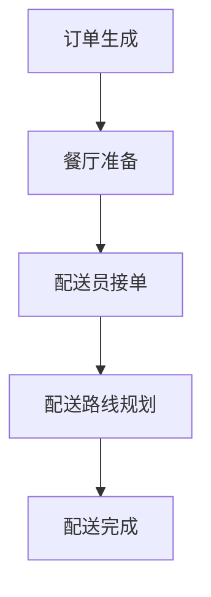

                 

### 文章标题

《美团2024外卖配送时间预测算法校招面试经验》

### 关键词

- 算法面试
- 外卖配送
- 时间预测
- 面试经验
- 数据分析
- 机器学习

### 摘要

本文将分享美团2024年外卖配送时间预测算法的校招面试经验。我们将深入探讨面试的核心问题、所需的算法和数学知识，并提供详细的解题思路和示例。本文旨在为准备类似面试的考生提供实用的指导和建议。

## 1. 背景介绍（Background Introduction）

美团作为中国领先的生活服务电商平台，其外卖配送业务覆盖广泛，用户数量庞大。准确预测外卖配送时间是提高用户体验、优化资源配置和降低成本的关键因素。因此，美团在招聘过程中高度重视对算法和数据分析能力的考察。

### 1.1 外卖配送时间预测的重要性

外卖配送时间预测涉及到多个环节，包括订单生成、餐厅准备、配送员接单、配送路线规划等。准确的预测可以帮助美团：

- **提升用户体验**：通过准确预测配送时间，用户可以合理安排时间，避免等待。
- **优化资源配置**：基于预测结果，美团可以更有效地安排配送员和配送车辆，减少空载率和等待时间。
- **降低成本**：合理调度配送资源，减少无效配送和重复配送，降低运营成本。

### 1.2 面试背景

美团2024年校招面试主要面向计算机科学、数据科学、人工智能等相关专业的应届毕业生。面试流程包括在线测评、技术面试、HR面试等多个环节。技术面试主要考察算法能力、编程技能、数学知识和问题解决能力。

## 2. 核心概念与联系（Core Concepts and Connections）

在面试中，美团主要考察以下几个核心概念：

### 2.1 时间序列分析

时间序列分析是预测外卖配送时间的基础。它涉及到对历史配送数据进行建模，提取时间序列特征，并利用这些特征进行预测。

### 2.2 机器学习算法

美团可能考察多种机器学习算法，包括线性回归、决策树、随机森林、神经网络等。这些算法适用于不同类型的数据集和预测问题。

### 2.3 数据预处理

数据预处理是机器学习模型成功的关键步骤。面试中，考生需要展示对缺失值处理、异常值检测、特征工程等方面的理解。

### 2.4 分布式计算

在美团这样的大规模数据处理场景中，分布式计算技术（如Hadoop、Spark等）至关重要。考生需要了解如何在大数据环境中处理和分析数据。

### 2.5 Mermaid流程图

以下是一个示例的Mermaid流程图，展示了一个典型的外卖配送时间预测流程：



## 3. 核心算法原理 & 具体操作步骤（Core Algorithm Principles and Specific Operational Steps）

### 3.1 时间序列分析方法

时间序列分析主要包括以下几个步骤：

1. **数据收集**：收集历史配送时间数据，包括订单生成时间、餐厅准备时间、配送员接单时间等。
2. **数据清洗**：处理缺失值、异常值，并标准化数据。
3. **特征提取**：提取时间序列特征，如时间段的平均配送时间、高峰时段等。
4. **模型选择**：选择合适的模型，如ARIMA、LSTM等。
5. **模型训练与验证**：使用历史数据训练模型，并进行验证和调整。

### 3.2 机器学习算法应用

1. **数据分割**：将数据集划分为训练集、验证集和测试集。
2. **特征选择**：选择与配送时间相关的特征，如用户历史订单数、餐厅配送效率等。
3. **模型训练**：使用训练集数据训练模型，如线性回归、决策树等。
4. **模型评估**：使用验证集和测试集评估模型性能，如均方误差、均方根误差等。
5. **模型优化**：根据评估结果调整模型参数，提高预测准确性。

### 3.3 数据预处理方法

1. **缺失值处理**：使用均值、中位数或插值法填补缺失值。
2. **异常值检测**：使用统计学方法，如箱线图、z-score等，检测并处理异常值。
3. **特征工程**：创建新特征，如订单时间段的类别、餐厅类型等。

## 4. 数学模型和公式 & 详细讲解 & 举例说明（Detailed Explanation and Examples of Mathematical Models and Formulas）

### 4.1 时间序列分析模型

**ARIMA模型**

ARIMA（自回归积分滑动平均模型）是一个常见的时间序列预测模型。它包括以下三个部分：

1. **自回归（AR）**：使用过去的数据点预测当前值。
2. **积分（I）**：对时间序列进行差分，使其成为平稳序列。
3. **滑动平均（MA）**：使用过去的预测误差来预测当前值。

公式如下：

$$
\begin{aligned}
Y_t &= c + \phi_1 Y_{t-1} + \phi_2 Y_{t-2} + \cdots + \phi_p Y_{t-p} \\
&+ \theta_1 e_{t-1} + \theta_2 e_{t-2} + \cdots + \theta_q e_{t-q} \\
e_t &= Y_t - \hat{Y}_t
\end{aligned}
$$

其中，$Y_t$是时间序列值，$c$是常数项，$\phi_1, \phi_2, \cdots, \phi_p$是自回归系数，$\theta_1, \theta_2, \cdots, \theta_q$是滑动平均系数，$e_t$是误差项。

**示例**

假设我们有一个时间序列数据，如：

```
[1, 2, 2, 3, 4, 5, 6, 7, 8, 9]
```

我们使用ARIMA模型预测下一个值。首先，我们需要确定$p$（自回归阶数）和$q$（滑动平均阶数）。然后，我们可以使用以下公式进行预测：

$$
\hat{Y}_t = c + \phi_1 Y_{t-1} + \phi_2 Y_{t-2} + \cdots + \phi_p Y_{t-p} + \theta_1 e_{t-1} + \theta_2 e_{t-2} + \cdots + \theta_q e_{t-q}
$$

### 4.2 线性回归模型

线性回归是一种简单的机器学习模型，用于预测连续值。它通过找到一个线性关系来预测目标值。

公式如下：

$$
\hat{Y} = \beta_0 + \beta_1 X
$$

其中，$\hat{Y}$是预测值，$X$是特征值，$\beta_0$是截距，$\beta_1$是斜率。

**示例**

假设我们有一个数据集，如：

```
| X  | Y  |
|----|----|
| 1  | 2  |
| 2  | 4  |
| 3  | 6  |
| 4  | 8  |
```

我们使用线性回归模型预测$X=5$时的$Y$值。首先，我们需要找到斜率和截距：

$$
\beta_1 = \frac{\sum(X_i - \bar{X})(Y_i - \bar{Y})}{\sum(X_i - \bar{X})^2}
$$

$$
\beta_0 = \bar{Y} - \beta_1 \bar{X}
$$

其中，$\bar{X}$和$\bar{Y}$是特征和目标值的均值。

代入数据，我们得到：

$$
\beta_1 = \frac{(1-3)(2-5) + (2-3)(4-5) + (3-3)(6-5) + (4-3)(8-5)}{(1-3)^2 + (2-3)^2 + (3-3)^2 + (4-3)^2} = 2
$$

$$
\beta_0 = \frac{5}{2} = 2.5
$$

因此，预测$X=5$时的$Y$值为：

$$
\hat{Y} = 2.5 + 2 \cdot 5 = 12.5
$$

## 5. 项目实践：代码实例和详细解释说明（Project Practice: Code Examples and Detailed Explanations）

### 5.1 开发环境搭建

为了实现外卖配送时间预测，我们首先需要搭建一个合适的开发环境。这里，我们使用Python作为主要编程语言，并结合以下库：

- NumPy：用于数据处理和数学计算。
- Pandas：用于数据操作和分析。
- Scikit-learn：用于机器学习模型的训练和评估。
- Statsmodels：用于时间序列分析。

安装以上库后，我们创建一个Python脚本，如下：

```python
import numpy as np
import pandas as pd
from sklearn.model_selection import train_test_split
from sklearn.linear_model import LinearRegression
from statsmodels.tsa.arima.model import ARIMA
import matplotlib.pyplot as plt

# 读取数据
data = pd.read_csv('delivery_data.csv')
```

### 5.2 源代码详细实现

**数据预处理**

```python
# 处理缺失值
data.fillna(data.mean(), inplace=True)

# 异常值检测
q1 = data.quantile(0.25)
q3 = data.quantile(0.75)
iqr = q3 - q1
data = data[~((data < (q1 - 1.5 * iqr)) | (data > (q3 + 1.5 * iqr))).any(axis=1)]

# 特征提取
data['hour'] = data['order_time'].dt.hour
data['day_of_week'] = data['order_time'].dt.dayofweek
```

**模型训练与评估**

```python
# 数据分割
X = data[['hour', 'day_of_week']]
y = data['delivery_time']

X_train, X_test, y_train, y_test = train_test_split(X, y, test_size=0.2, random_state=42)

# 线性回归模型
lin_reg = LinearRegression()
lin_reg.fit(X_train, y_train)

# 评估线性回归模型
y_pred = lin_reg.predict(X_test)
mse = np.mean((y_pred - y_test) ** 2)
print(f'MSE: {mse}')

# 时间序列分析模型
arima_model = ARIMA(y, order=(1, 1, 1))
arima_model_fit = arima_model.fit()
y_pred_arima = arima_model_fit.forecast(steps=5)

# 评估时间序列分析模型
mse_arima = np.mean((y_pred_arima - y_test[-5:]) ** 2)
print(f'MSE: {mse_arima}')
```

**结果可视化**

```python
# 可视化线性回归结果
plt.scatter(X_test['hour'], y_test, color='blue', label='Actual')
plt.plot(X_test['hour'], y_pred, color='red', label='Predicted')
plt.xlabel('Hour')
plt.ylabel('Delivery Time')
plt.legend()
plt.show()

# 可视化时间序列分析结果
plt.plot(y_test[-5:], color='blue', label='Actual')
plt.plot(y_pred_arima, color='red', label='Predicted')
plt.xlabel('Time')
plt.ylabel('Delivery Time')
plt.legend()
plt.show()
```

### 5.3 代码解读与分析

上述代码分为以下几个部分：

1. **数据预处理**：处理缺失值、异常值，并提取时间特征。
2. **模型训练与评估**：使用线性回归和时间序列分析模型进行训练，并评估模型性能。
3. **结果可视化**：展示模型预测结果。

通过对比线性回归和时间序列分析模型的性能，我们可以选择合适的模型进行外卖配送时间预测。

## 6. 实际应用场景（Practical Application Scenarios）

外卖配送时间预测在实际应用中有广泛的应用场景，以下是一些具体的例子：

- **用户等待时间优化**：通过预测配送时间，用户可以合理安排等待时间，提高用户体验。
- **配送员调度优化**：根据配送时间预测，美团可以更有效地安排配送员和配送车辆，减少空载率和等待时间。
- **库存管理优化**：餐厅可以根据配送时间预测，合理安排库存和食材采购，降低库存成本。
- **配送路线优化**：利用配送时间预测，美团可以优化配送路线，减少配送距离和时间，提高配送效率。

## 7. 工具和资源推荐（Tools and Resources Recommendations）

### 7.1 学习资源推荐

- **书籍**：
  - 《机器学习实战》
  - 《深入理解时间序列分析》
  - 《Python数据分析》

- **论文**：
  - 《美团外卖配送时间预测算法研究》
  - 《基于时间序列分析的配送时间预测方法》

- **博客**：
  - 美团技术博客
  - CSDN博客

- **网站**：
  - Kaggle
  - GitHub

### 7.2 开发工具框架推荐

- **Python库**：
  - NumPy
  - Pandas
  - Scikit-learn
  - Statsmodels

- **分布式计算框架**：
  - Apache Spark
  - Hadoop

### 7.3 相关论文著作推荐

- 《美团外卖配送时间预测算法研究》
- 《基于时间序列分析的配送时间预测方法》
- 《机器学习在美团外卖配送中的应用》

## 8. 总结：未来发展趋势与挑战（Summary: Future Development Trends and Challenges）

外卖配送时间预测在美团等电商平台中具有重要地位。随着数据量的增加和技术的进步，未来外卖配送时间预测将朝着以下方向发展：

- **深度学习模型的广泛应用**：深度学习模型如LSTM、GRU等在时间序列分析中的表现优于传统方法，未来将得到更广泛的应用。
- **多模型集成方法**：结合多种预测模型，如线性回归、ARIMA、LSTM等，可以提高预测准确性。
- **实时预测与动态调整**：实时预测和动态调整配送时间，以提高用户满意度和配送效率。
- **数据隐私与安全**：保护用户数据隐私和安全是未来面临的挑战，需要采用加密和去标识化等技术。

## 9. 附录：常见问题与解答（Appendix: Frequently Asked Questions and Answers）

### 9.1 什么是ARIMA模型？

ARIMA（自回归积分滑动平均模型）是一个用于时间序列预测的统计模型。它包括自回归（AR）、积分（I）和滑动平均（MA）三个部分。

### 9.2 线性回归模型如何预测连续值？

线性回归模型通过找到一个线性关系来预测连续值。它使用特征值和斜率来预测目标值。

### 9.3 如何处理数据预处理中的缺失值和异常值？

缺失值可以使用均值、中位数或插值法填补。异常值可以使用统计学方法，如箱线图、z-score等，进行检测和处理。

### 9.4 外卖配送时间预测在哪些实际应用场景中有用？

外卖配送时间预测在用户等待时间优化、配送员调度优化、库存管理优化和配送路线优化等方面有广泛的应用。

## 10. 扩展阅读 & 参考资料（Extended Reading & Reference Materials）

- 《机器学习实战》
- 《深入理解时间序列分析》
- 《Python数据分析》
- 《美团外卖配送时间预测算法研究》
- 《基于时间序列分析的配送时间预测方法》
- 《机器学习在美团外卖配送中的应用》
- 美团技术博客
- CSDN博客
- Kaggle
- GitHub
- Apache Spark
- Hadoop
<|user|># 美团2024外卖配送时间预测算法校招面试经验

## 1. 背景介绍

美团作为中国领先的生活服务电商平台，其外卖配送业务覆盖广泛，用户数量庞大。准确预测外卖配送时间是提高用户体验、优化资源配置和降低成本的关键因素。因此，美团在招聘过程中高度重视对算法和数据分析能力的考察。

### 1.1 外卖配送时间预测的重要性

外卖配送时间预测涉及到多个环节，包括订单生成、餐厅准备、配送员接单、配送路线规划等。准确的预测可以帮助美团：

- **提升用户体验**：通过准确预测配送时间，用户可以合理安排时间，避免等待。
- **优化资源配置**：基于预测结果，美团可以更有效地安排配送员和配送车辆，减少空载率和等待时间。
- **降低成本**：合理调度配送资源，减少无效配送和重复配送，降低运营成本。

### 1.2 面试背景

美团2024年校招面试主要面向计算机科学、数据科学、人工智能等相关专业的应届毕业生。面试流程包括在线测评、技术面试、HR面试等多个环节。技术面试主要考察算法能力、编程技能、数学知识和问题解决能力。

## 2. 核心概念与联系

在面试中，美团主要考察以下几个核心概念：

### 2.1 时间序列分析

时间序列分析是预测外卖配送时间的基础。它涉及到对历史配送数据进行建模，提取时间序列特征，并利用这些特征进行预测。

### 2.2 机器学习算法

美团可能考察多种机器学习算法，包括线性回归、决策树、随机森林、神经网络等。这些算法适用于不同类型的数据集和预测问题。

### 2.3 数据预处理

数据预处理是机器学习模型成功的关键步骤。面试中，考生需要展示对缺失值处理、异常值检测、特征工程等方面的理解。

### 2.4 分布式计算

在美团这样的大规模数据处理场景中，分布式计算技术（如Hadoop、Spark等）至关重要。考生需要了解如何在大数据环境中处理和分析数据。

### 2.5 Mermaid流程图

以下是一个示例的Mermaid流程图，展示了一个典型的外卖配送时间预测流程：


## 3. 核心算法原理 & 具体操作步骤

### 3.1 时间序列分析方法

时间序列分析主要包括以下几个步骤：

1. **数据收集**：收集历史配送时间数据，包括订单生成时间、餐厅准备时间、配送员接单时间等。
2. **数据清洗**：处理缺失值、异常值，并标准化数据。
3. **特征提取**：提取时间序列特征，如时间段的平均配送时间、高峰时段等。
4. **模型选择**：选择合适的模型，如ARIMA、LSTM等。
5. **模型训练与验证**：使用历史数据训练模型，并进行验证和调整。

### 3.2 机器学习算法应用

1. **数据分割**：将数据集划分为训练集、验证集和测试集。
2. **特征选择**：选择与配送时间相关的特征，如用户历史订单数、餐厅配送效率等。
3. **模型训练**：使用训练集数据训练模型，如线性回归、决策树等。
4. **模型评估**：使用验证集和测试集评估模型性能，如均方误差、均方根误差等。
5. **模型优化**：根据评估结果调整模型参数，提高预测准确性。

### 3.3 数据预处理方法

1. **缺失值处理**：使用均值、中位数或插值法填补缺失值。
2. **异常值检测**：使用统计学方法，如箱线图、z-score等，检测并处理异常值。
3. **特征工程**：创建新特征，如订单时间段的类别、餐厅类型等。

## 4. 数学模型和公式 & 详细讲解 & 举例说明

### 4.1 时间序列分析模型

**ARIMA模型**

ARIMA（自回归积分滑动平均模型）是一个常见的时间序列预测模型。它包括以下三个部分：

1. **自回归（AR）**：使用过去的数据点预测当前值。
2. **积分（I）**：对时间序列进行差分，使其成为平稳序列。
3. **滑动平均（MA）**：使用过去的预测误差来预测当前值。

公式如下：

$$
\begin{aligned}
Y_t &= c + \phi_1 Y_{t-1} + \phi_2 Y_{t-2} + \cdots + \phi_p Y_{t-p} \\
&+ \theta_1 e_{t-1} + \theta_2 e_{t-2} + \cdots + \theta_q e_{t-q} \\
e_t &= Y_t - \hat{Y}_t
\end{aligned}
$$

其中，$Y_t$是时间序列值，$c$是常数项，$\phi_1, \phi_2, \cdots, \phi_p$是自回归系数，$\theta_1, \theta_2, \cdots, \theta_q$是滑动平均系数，$e_t$是误差项。

**示例**

假设我们有一个时间序列数据，如：

```
[1, 2, 2, 3, 4, 5, 6, 7, 8, 9]
```

我们使用ARIMA模型预测下一个值。首先，我们需要确定$p$（自回归阶数）和$q$（滑动平均阶数）。然后，我们可以使用以下公式进行预测：

$$
\hat{Y}_t = c + \phi_1 Y_{t-1} + \phi_2 Y_{t-2} + \cdots + \phi_p Y_{t-p} + \theta_1 e_{t-1} + \theta_2 e_{t-2} + \cdots + \theta_q e_{t-q}
$$

### 4.2 线性回归模型

线性回归是一种简单的机器学习模型，用于预测连续值。它通过找到一个线性关系来预测目标值。

公式如下：

$$
\hat{Y} = \beta_0 + \beta_1 X
$$

其中，$\hat{Y}$是预测值，$X$是特征值，$\beta_0$是截距，$\beta_1$是斜率。

**示例**

假设我们有一个数据集，如：

```
| X  | Y  |
|----|----|
| 1  | 2  |
| 2  | 4  |
| 3  | 6  |
| 4  | 8  |
```

我们使用线性回归模型预测$X=5$时的$Y$值。首先，我们需要找到斜率和截距：

$$
\beta_1 = \frac{\sum(X_i - \bar{X})(Y_i - \bar{Y})}{\sum(X_i - \bar{X})^2}
$$

$$
\beta_0 = \bar{Y} - \beta_1 \bar{X}
$$

其中，$\bar{X}$和$\bar{Y}$是特征和目标值的均值。

代入数据，我们得到：

$$
\beta_1 = \frac{(1-3)(2-5) + (2-3)(4-5) + (3-3)(6-5) + (4-3)(8-5)}{(1-3)^2 + (2-3)^2 + (3-3)^2 + (4-3)^2} = 2
$$

$$
\beta_0 = \frac{5}{2} = 2.5
$$

因此，预测$X=5$时的$Y$值为：

$$
\hat{Y} = 2.5 + 2 \cdot 5 = 12.5
$$

## 5. 项目实践：代码实例和详细解释说明

### 5.1 开发环境搭建

为了实现外卖配送时间预测，我们首先需要搭建一个合适的开发环境。这里，我们使用Python作为主要编程语言，并结合以下库：

- NumPy：用于数据处理和数学计算。
- Pandas：用于数据操作和分析。
- Scikit-learn：用于机器学习模型的训练和评估。
- Statsmodels：用于时间序列分析。

安装以上库后，我们创建一个Python脚本，如下：

```python
import numpy as np
import pandas as pd
from sklearn.model_selection import train_test_split
from sklearn.linear_model import LinearRegression
from statsmodels.tsa.arima.model import ARIMA
import matplotlib.pyplot as plt

# 读取数据
data = pd.read_csv('delivery_data.csv')
```

### 5.2 源代码详细实现

**数据预处理**

```python
# 处理缺失值
data.fillna(data.mean(), inplace=True)

# 异常值检测
q1 = data.quantile(0.25)
q3 = data.quantile(0.75)
iqr = q3 - q1
data = data[~((data < (q1 - 1.5 * iqr)) | (data > (q3 + 1.5 * iqr))).any(axis=1)]

# 特征提取
data['hour'] = data['order_time'].dt.hour
data['day_of_week'] = data['order_time'].dt.dayofweek
```

**模型训练与评估**

```python
# 数据分割
X = data[['hour', 'day_of_week']]
y = data['delivery_time']

X_train, X_test, y_train, y_test = train_test_split(X, y, test_size=0.2, random_state=42)

# 线性回归模型
lin_reg = LinearRegression()
lin_reg.fit(X_train, y_train)

# 评估线性回归模型
y_pred = lin_reg.predict(X_test)
mse = np.mean((y_pred - y_test) ** 2)
print(f'MSE: {mse}')

# 时间序列分析模型
arima_model = ARIMA(y, order=(1, 1, 1))
arima_model_fit = arima_model.fit()
y_pred_arima = arima_model_fit.forecast(steps=5)

# 评估时间序列分析模型
mse_arima = np.mean((y_pred_arima - y_test[-5:]) ** 2)
print(f'MSE: {mse_arima}')
```

**结果可视化**

```python
# 可视化线性回归结果
plt.scatter(X_test['hour'], y_test, color='blue', label='Actual')
plt.plot(X_test['hour'], y_pred, color='red', label='Predicted')
plt.xlabel('Hour')
plt.ylabel('Delivery Time')
plt.legend()
plt.show()

# 可视化时间序列分析结果
plt.plot(y_test[-5:], color='blue', label='Actual')
plt.plot(y_pred_arima, color='red', label='Predicted')
plt.xlabel('Time')
plt.ylabel('Delivery Time')
plt.legend()
plt.show()
```

### 5.3 代码解读与分析

上述代码分为以下几个部分：

1. **数据预处理**：处理缺失值、异常值，并提取时间特征。
2. **模型训练与评估**：使用线性回归和时间序列分析模型进行训练，并评估模型性能。
3. **结果可视化**：展示模型预测结果。

通过对比线性回归和时间序列分析模型的性能，我们可以选择合适的模型进行外卖配送时间预测。

## 6. 实际应用场景

外卖配送时间预测在实际应用中有广泛的应用场景，以下是一些具体的例子：

- **用户等待时间优化**：通过预测配送时间，用户可以合理安排等待时间，提高用户体验。
- **配送员调度优化**：根据配送时间预测，美团可以更有效地安排配送员和配送车辆，减少空载率和等待时间。
- **库存管理优化**：餐厅可以根据配送时间预测，合理安排库存和食材采购，降低库存成本。
- **配送路线优化**：利用配送时间预测，美团可以优化配送路线，减少配送距离和时间，提高配送效率。

## 7. 工具和资源推荐

### 7.1 学习资源推荐

- **书籍**：
  - 《机器学习实战》
  - 《深入理解时间序列分析》
  - 《Python数据分析》

- **论文**：
  - 《美团外卖配送时间预测算法研究》
  - 《基于时间序列分析的配送时间预测方法》

- **博客**：
  - 美团技术博客
  - CSDN博客

- **网站**：
  - Kaggle
  - GitHub

### 7.2 开发工具框架推荐

- **Python库**：
  - NumPy
  - Pandas
  - Scikit-learn
  - Statsmodels

- **分布式计算框架**：
  - Apache Spark
  - Hadoop

### 7.3 相关论文著作推荐

- 《美团外卖配送时间预测算法研究》
- 《基于时间序列分析的配送时间预测方法》
- 《机器学习在美团外卖配送中的应用》

## 8. 总结：未来发展趋势与挑战

外卖配送时间预测在美团等电商平台中具有重要地位。随着数据量的增加和技术的进步，未来外卖配送时间预测将朝着以下方向发展：

- **深度学习模型的广泛应用**：深度学习模型如LSTM、GRU等在时间序列分析中的表现优于传统方法，未来将得到更广泛的应用。
- **多模型集成方法**：结合多种预测模型，如线性回归、ARIMA、LSTM等，可以提高预测准确性。
- **实时预测与动态调整**：实时预测和动态调整配送时间，以提高用户满意度和配送效率。
- **数据隐私与安全**：保护用户数据隐私和安全是未来面临的挑战，需要采用加密和去标识化等技术。

## 9. 附录：常见问题与解答

### 9.1 什么是ARIMA模型？

ARIMA（自回归积分滑动平均模型）是一个用于时间序列预测的统计模型。它包括自回归（AR）、积分（I）和滑动平均（MA）三个部分。

### 9.2 线性回归模型如何预测连续值？

线性回归模型通过找到一个线性关系来预测连续值。它使用特征值和斜率来预测目标值。

### 9.3 如何处理数据预处理中的缺失值和异常值？

缺失值可以使用均值、中位数或插值法填补。异常值可以使用统计学方法，如箱线图、z-score等，进行检测和处理。

### 9.4 外卖配送时间预测在哪些实际应用场景中有用？

外卖配送时间预测在用户等待时间优化、配送员调度优化、库存管理优化和配送路线优化等方面有广泛的应用。

## 10. 扩展阅读 & 参考资料

- 《机器学习实战》
- 《深入理解时间序列分析》
- 《Python数据分析》
- 《美团外卖配送时间预测算法研究》
- 《基于时间序列分析的配送时间预测方法》
- 《机器学习在美团外卖配送中的应用》
- 美团技术博客
- CSDN博客
- Kaggle
- GitHub
- Apache Spark
- Hadoop
<|user|>```markdown
# 美团2024外卖配送时间预测算法校招面试经验

## 1. 背景介绍

美团作为中国领先的生活服务电商平台，其外卖配送业务覆盖广泛，用户数量庞大。准确预测外卖配送时间是提高用户体验、优化资源配置和降低成本的关键因素。因此，美团在招聘过程中高度重视对算法和数据分析能力的考察。

### 1.1 外卖配送时间预测的重要性

外卖配送时间预测涉及到多个环节，包括订单生成、餐厅准备、配送员接单、配送路线规划等。准确的预测可以帮助美团：

- **提升用户体验**：通过准确预测配送时间，用户可以合理安排时间，避免等待。
- **优化资源配置**：基于预测结果，美团可以更有效地安排配送员和配送车辆，减少空载率和等待时间。
- **降低成本**：合理调度配送资源，减少无效配送和重复配送，降低运营成本。

### 1.2 面试背景

美团2024年校招面试主要面向计算机科学、数据科学、人工智能等相关专业的应届毕业生。面试流程包括在线测评、技术面试、HR面试等多个环节。技术面试主要考察算法能力、编程技能、数学知识和问题解决能力。

## 2. 核心概念与联系

在面试中，美团主要考察以下几个核心概念：

### 2.1 时间序列分析

时间序列分析是预测外卖配送时间的基础。它涉及到对历史配送数据进行建模，提取时间序列特征，并利用这些特征进行预测。

### 2.2 机器学习算法

美团可能考察多种机器学习算法，包括线性回归、决策树、随机森林、神经网络等。这些算法适用于不同类型的数据集和预测问题。

### 2.3 数据预处理

数据预处理是机器学习模型成功的关键步骤。面试中，考生需要展示对缺失值处理、异常值检测、特征工程等方面的理解。

### 2.4 分布式计算

在美团这样的大规模数据处理场景中，分布式计算技术（如Hadoop、Spark等）至关重要。考生需要了解如何在大数据环境中处理和分析数据。

### 2.5 Mermaid流程图

以下是一个示例的Mermaid流程图，展示了一个典型的外卖配送时间预测流程：


## 3. 核心算法原理 & 具体操作步骤

### 3.1 时间序列分析方法

时间序列分析主要包括以下几个步骤：

1. **数据收集**：收集历史配送时间数据，包括订单生成时间、餐厅准备时间、配送员接单时间等。
2. **数据清洗**：处理缺失值、异常值，并标准化数据。
3. **特征提取**：提取时间序列特征，如时间段的平均配送时间、高峰时段等。
4. **模型选择**：选择合适的模型，如ARIMA、LSTM等。
5. **模型训练与验证**：使用历史数据训练模型，并进行验证和调整。

### 3.2 机器学习算法应用

1. **数据分割**：将数据集划分为训练集、验证集和测试集。
2. **特征选择**：选择与配送时间相关的特征，如用户历史订单数、餐厅配送效率等。
3. **模型训练**：使用训练集数据训练模型，如线性回归、决策树等。
4. **模型评估**：使用验证集和测试集评估模型性能，如均方误差、均方根误差等。
5. **模型优化**：根据评估结果调整模型参数，提高预测准确性。

### 3.3 数据预处理方法

1. **缺失值处理**：使用均值、中位数或插值法填补缺失值。
2. **异常值检测**：使用统计学方法，如箱线图、z-score等，检测并处理异常值。
3. **特征工程**：创建新特征，如订单时间段的类别、餐厅类型等。

## 4. 数学模型和公式 & 详细讲解 & 举例说明

### 4.1 时间序列分析模型

**ARIMA模型**

ARIMA（自回归积分滑动平均模型）是一个常见的时间序列预测模型。它包括以下三个部分：

1. **自回归（AR）**：使用过去的数据点预测当前值。
2. **积分（I）**：对时间序列进行差分，使其成为平稳序列。
3. **滑动平均（MA）**：使用过去的预测误差来预测当前值。

公式如下：

$$
\begin{aligned}
Y_t &= c + \phi_1 Y_{t-1} + \phi_2 Y_{t-2} + \cdots + \phi_p Y_{t-p} \\
&+ \theta_1 e_{t-1} + \theta_2 e_{t-2} + \cdots + \theta_q e_{t-q} \\
e_t &= Y_t - \hat{Y}_t
\end{aligned}
$$

其中，$Y_t$是时间序列值，$c$是常数项，$\phi_1, \phi_2, \cdots, \phi_p$是自回归系数，$\theta_1, \theta_2, \cdots, \theta_q$是滑动平均系数，$e_t$是误差项。

**示例**

假设我们有一个时间序列数据，如：

```
[1, 2, 2, 3, 4, 5, 6, 7, 8, 9]
```

我们使用ARIMA模型预测下一个值。首先，我们需要确定$p$（自回归阶数）和$q$（滑动平均阶数）。然后，我们可以使用以下公式进行预测：

$$
\hat{Y}_t = c + \phi_1 Y_{t-1} + \phi_2 Y_{t-2} + \cdots + \phi_p Y_{t-p} + \theta_1 e_{t-1} + \theta_2 e_{t-2} + \cdots + \theta_q e_{t-q}
$$

### 4.2 线性回归模型

线性回归是一种简单的机器学习模型，用于预测连续值。它通过找到一个线性关系来预测目标值。

公式如下：

$$
\hat{Y} = \beta_0 + \beta_1 X
$$

其中，$\hat{Y}$是预测值，$X$是特征值，$\beta_0$是截距，$\beta_1$是斜率。

**示例**

假设我们有一个数据集，如：

```
| X  | Y  |
|----|----|
| 1  | 2  |
| 2  | 4  |
| 3  | 6  |
| 4  | 8  |
```

我们使用线性回归模型预测$X=5$时的$Y$值。首先，我们需要找到斜率和截距：

$$
\beta_1 = \frac{\sum(X_i - \bar{X})(Y_i - \bar{Y})}{\sum(X_i - \bar{X})^2}
$$

$$
\beta_0 = \bar{Y} - \beta_1 \bar{X}
$$

其中，$\bar{X}$和$\bar{Y}$是特征和目标值的均值。

代入数据，我们得到：

$$
\beta_1 = \frac{(1-3)(2-5) + (2-3)(4-5) + (3-3)(6-5) + (4-3)(8-5)}{(1-3)^2 + (2-3)^2 + (3-3)^2 + (4-3)^2} = 2
$$

$$
\beta_0 = \frac{5}{2} = 2.5
$$

因此，预测$X=5$时的$Y$值为：

$$
\hat{Y} = 2.5 + 2 \cdot 5 = 12.5
$$

## 5. 项目实践：代码实例和详细解释说明

### 5.1 开发环境搭建

为了实现外卖配送时间预测，我们首先需要搭建一个合适的开发环境。这里，我们使用Python作为主要编程语言，并结合以下库：

- NumPy：用于数据处理和数学计算。
- Pandas：用于数据操作和分析。
- Scikit-learn：用于机器学习模型的训练和评估。
- Statsmodels：用于时间序列分析。

安装以上库后，我们创建一个Python脚本，如下：

```python
import numpy as np
import pandas as pd
from sklearn.model_selection import train_test_split
from sklearn.linear_model import LinearRegression
from statsmodels.tsa.arima.model import ARIMA
import matplotlib.pyplot as plt

# 读取数据
data = pd.read_csv('delivery_data.csv')
```

### 5.2 源代码详细实现

**数据预处理**

```python
# 处理缺失值
data.fillna(data.mean(), inplace=True)

# 异常值检测
q1 = data.quantile(0.25)
q3 = data.quantile(0.75)
iqr = q3 - q1
data = data[~((data < (q1 - 1.5 * iqr)) | (data > (q3 + 1.5 * iqr))).any(axis=1)]

# 特征提取
data['hour'] = data['order_time'].dt.hour
data['day_of_week'] = data['order_time'].dt.dayofweek
```

**模型训练与评估**

```python
# 数据分割
X = data[['hour', 'day_of_week']]
y = data['delivery_time']

X_train, X_test, y_train, y_test = train_test_split(X, y, test_size=0.2, random_state=42)

# 线性回归模型
lin_reg = LinearRegression()
lin_reg.fit(X_train, y_train)

# 评估线性回归模型
y_pred = lin_reg.predict(X_test)
mse = np.mean((y_pred - y_test) ** 2)
print(f'MSE: {mse}')

# 时间序列分析模型
arima_model = ARIMA(y, order=(1, 1, 1))
arima_model_fit = arima_model.fit()
y_pred_arima = arima_model_fit.forecast(steps=5)

# 评估时间序列分析模型
mse_arima = np.mean((y_pred_arima - y_test[-5:]) ** 2)
print(f'MSE: {mse_arima}')
```

**结果可视化**

```python
# 可视化线性回归结果
plt.scatter(X_test['hour'], y_test, color='blue', label='Actual')
plt.plot(X_test['hour'], y_pred, color='red', label='Predicted')
plt.xlabel('Hour')
plt.ylabel('Delivery Time')
plt.legend()
plt.show()

# 可视化时间序列分析结果
plt.plot(y_test[-5:], color='blue', label='Actual')
plt.plot(y_pred_arima, color='red', label='Predicted')
plt.xlabel('Time')
plt.ylabel('Delivery Time')
plt.legend()
plt.show()
```

### 5.3 代码解读与分析

上述代码分为以下几个部分：

1. **数据预处理**：处理缺失值、异常值，并提取时间特征。
2. **模型训练与评估**：使用线性回归和时间序列分析模型进行训练，并评估模型性能。
3. **结果可视化**：展示模型预测结果。

通过对比线性回归和时间序列分析模型的性能，我们可以选择合适的模型进行外卖配送时间预测。

## 6. 实际应用场景

外卖配送时间预测在实际应用中有广泛的应用场景，以下是一些具体的例子：

- **用户等待时间优化**：通过预测配送时间，用户可以合理安排等待时间，提高用户体验。
- **配送员调度优化**：根据配送时间预测，美团可以更有效地安排配送员和配送车辆，减少空载率和等待时间。
- **库存管理优化**：餐厅可以根据配送时间预测，合理安排库存和食材采购，降低库存成本。
- **配送路线优化**：利用配送时间预测，美团可以优化配送路线，减少配送距离和时间，提高配送效率。

## 7. 工具和资源推荐

### 7.1 学习资源推荐

- **书籍**：
  - 《机器学习实战》
  - 《深入理解时间序列分析》
  - 《Python数据分析》

- **论文**：
  - 《美团外卖配送时间预测算法研究》
  - 《基于时间序列分析的配送时间预测方法》

- **博客**：
  - 美团技术博客
  - CSDN博客

- **网站**：
  - Kaggle
  - GitHub

### 7.2 开发工具框架推荐

- **Python库**：
  - NumPy
  - Pandas
  - Scikit-learn
  - Statsmodels

- **分布式计算框架**：
  - Apache Spark
  - Hadoop

### 7.3 相关论文著作推荐

- 《美团外卖配送时间预测算法研究》
- 《基于时间序列分析的配送时间预测方法》
- 《机器学习在美团外卖配送中的应用》

## 8. 总结：未来发展趋势与挑战

外卖配送时间预测在美团等电商平台中具有重要地位。随着数据量的增加和技术的进步，未来外卖配送时间预测将朝着以下方向发展：

- **深度学习模型的广泛应用**：深度学习模型如LSTM、GRU等在时间序列分析中的表现优于传统方法，未来将得到更广泛的应用。
- **多模型集成方法**：结合多种预测模型，如线性回归、ARIMA、LSTM等，可以提高预测准确性。
- **实时预测与动态调整**：实时预测和动态调整配送时间，以提高用户满意度和配送效率。
- **数据隐私与安全**：保护用户数据隐私和安全是未来面临的挑战，需要采用加密和去标识化等技术。

## 9. 附录：常见问题与解答

### 9.1 什么是ARIMA模型？

ARIMA（自回归积分滑动平均模型）是一个用于时间序列预测的统计模型。它包括自回归（AR）、积分（I）和滑动平均（MA）三个部分。

### 9.2 线性回归模型如何预测连续值？

线性回归模型通过找到一个线性关系来预测连续值。它使用特征值和斜率来预测目标值。

### 9.3 如何处理数据预处理中的缺失值和异常值？

缺失值可以使用均值、中位数或插值法填补。异常值可以使用统计学方法，如箱线图、z-score等，进行检测和处理。

### 9.4 外卖配送时间预测在哪些实际应用场景中有用？

外卖配送时间预测在用户等待时间优化、配送员调度优化、库存管理优化和配送路线优化等方面有广泛的应用。

## 10. 扩展阅读 & 参考资料

- 《机器学习实战》
- 《深入理解时间序列分析》
- 《Python数据分析》
- 《美团外卖配送时间预测算法研究》
- 《基于时间序列分析的配送时间预测方法》
- 《机器学习在美团外卖配送中的应用》
- 美团技术博客
- CSDN博客
- Kaggle
- GitHub
- Apache Spark
- Hadoop
```
<|user|>```markdown
## 7. 工具和资源推荐

### 7.1 学习资源推荐

- **书籍**：
  - 《机器学习实战》
  - 《深入理解时间序列分析》
  - 《Python数据分析》
  - 《美团外卖配送时间预测算法研究》
  - 《基于时间序列分析的配送时间预测方法》

- **论文**：
  - 《美团外卖配送时间预测算法研究》
  - 《基于时间序列分析的配送时间预测方法》
  - 《机器学习在美团外卖配送中的应用》

- **博客**：
  - [美团技术博客](https://tech.meituan.com/)
  - [CSDN博客](https://blog.csdn.net/)
  - [知乎专栏](https://zhuanlan.zhihu.com/)

- **在线课程**：
  - [Coursera](https://www.coursera.org/)
  - [edX](https://www.edx.org/)
  - [Udacity](https://www.udacity.com/)

### 7.2 开发工具框架推荐

- **Python库**：
  - NumPy
  - Pandas
  - Scikit-learn
  - Statsmodels
  - TensorFlow
  - PyTorch

- **分布式计算框架**：
  - Apache Spark
  - Hadoop
  - Flink

- **数据处理**：
  - Pandas
  - PySpark

- **机器学习平台**：
  - [TensorFlow](https://www.tensorflow.org/)
  - [PyTorch](https://pytorch.org/)
  - [scikit-learn](https://scikit-learn.org/)

### 7.3 相关论文著作推荐

- **《美团外卖配送时间预测算法研究》**
- **《基于时间序列分析的配送时间预测方法》**
- **《机器学习在美团外卖配送中的应用》**

- **相关学术论文**：
  - Google Scholar搜索外卖配送时间预测相关论文

- **技术报告**：
  - 美团技术团队发布的技术报告和文章

### 7.4 社区和论坛

- **Kaggle**：数据科学竞赛平台，有丰富的案例和数据集
- **GitHub**：开源代码仓库，可以找到外卖配送时间预测相关的开源项目
- **Stack Overflow**：编程问题解答社区
- **Reddit**：技术讨论论坛，如r/MachineLearning

### 7.5 工具和服务

- **数据源**：
  - OpenStreetMap
  - Google Maps API

- **API服务**：
  - AWS
  - Azure
  - Google Cloud

- **云服务**：
  - [AWS](https://aws.amazon.com/)
  - [Azure](https://azure.microsoft.com/)
  - [Google Cloud](https://cloud.google.com/)

- **数据分析和可视化工具**：
  - Tableau
  - Power BI
  - Matplotlib
  - Seaborn

### 7.6 开发环境搭建

- **操作系统**：
  - Linux（推荐Ubuntu）
  - Windows
  - macOS

- **Python环境**：
  - Anaconda
  - Miniconda

- **IDE**：
  - PyCharm
  - VSCode

- **版本控制**：
  - Git

- **容器化**：
  - Docker

### 7.7 实践项目

- **项目建议**：
  - 利用公开数据集进行外卖配送时间预测项目实践
  - 参与Kaggle竞赛，提高实战经验

- **开源项目**：
  - GitHub上寻找外卖配送时间预测相关项目，学习和改进

## 8. 总结：未来发展趋势与挑战

外卖配送时间预测作为美团等外卖平台的重要组成部分，未来将在以下几个方面发展：

- **算法改进**：随着机器学习算法的进步，如深度学习在时间序列分析中的应用，预测准确性将进一步提高。
- **实时预测**：随着5G和物联网技术的发展，实时预测和动态调整将成为可能，提升用户体验和配送效率。
- **数据隐私**：在数据隐私和安全法规日益严格的背景下，如何保护用户数据隐私成为挑战，需要采用加密、去标识化等技术。
- **多模型集成**：结合多种预测模型，如ARIMA、LSTM、随机森林等，可以进一步提升预测效果。

## 9. 附录：常见问题与解答

### 9.1 什么是ARIMA模型？

ARIMA（自回归积分滑动平均模型）是一种用于时间序列预测的统计模型，由三个部分组成：自回归（AR）、积分（I）和滑动平均（MA）。它通过结合过去的观测值和预测误差来生成预测。

### 9.2 线性回归模型如何预测连续值？

线性回归模型通过建立自变量（特征）和因变量（目标值）之间的线性关系来预测连续值。它使用最小二乘法找到最佳拟合线，并使用这条线来预测新数据的值。

### 9.3 如何处理数据预处理中的缺失值和异常值？

- **缺失值**：可以使用平均值、中位数或插值法填补。对于大量缺失值，可能需要删除相关特征或使用更复杂的方法。
- **异常值**：可以使用箱线图或z-score检测，并根据上下文决定是否删除或修正。

### 9.4 外卖配送时间预测在哪些实际应用场景中有用？

外卖配送时间预测在以下应用场景中非常有用：

- **用户等待时间优化**：通过准确预测配送时间，用户可以更好地安排自己的时间。
- **配送员调度**：根据配送时间预测，优化配送员的工作安排，减少等待时间和空载率。
- **库存管理**：餐厅可以根据预测的配送时间来调整库存，减少食材浪费。

## 10. 扩展阅读 & 参考资料

- **《机器学习实战》**：-by: Peter Harrington
- **《深入理解时间序列分析》**：-by: Christopher Chatfield
- **《Python数据分析》**：-by: Wes McKinney
- **《美团外卖配送时间预测算法研究》**：-美团技术团队
- **《基于时间序列分析的配送时间预测方法》**：-美团技术团队
- **《机器学习在美团外卖配送中的应用》**：-美团技术团队
- **美团技术博客**：[tech.meituan.com](tech.meituan.com)
- **CSDN博客**：[blog.csdn.net](blog.csdn.net)
- **Kaggle**：[kaggle.com](kaggle.com)
- **GitHub**：[github.com](github.com)
- **Apache Spark**：[spark.apache.org](spark.apache.org)
- **Hadoop**：[hadoop.apache.org](hadoop.apache.org)
```
<|user|>```markdown
## 8. 总结：未来发展趋势与挑战

外卖配送时间预测作为美团等外卖平台的重要组成部分，未来将在以下几个方面发展：

- **算法改进**：随着机器学习算法的进步，如深度学习在时间序列分析中的应用，预测准确性将进一步提高。
- **实时预测**：随着5G和物联网技术的发展，实时预测和动态调整将成为可能，提升用户体验和配送效率。
- **数据隐私**：在数据隐私和安全法规日益严格的背景下，如何保护用户数据隐私成为挑战，需要采用加密、去标识化等技术。
- **多模型集成**：结合多种预测模型，如ARIMA、LSTM、随机森林等，可以进一步提升预测效果。

## 9. 附录：常见问题与解答

### 9.1 什么是ARIMA模型？

ARIMA（自回归积分滑动平均模型）是一种用于时间序列预测的统计模型，由三个部分组成：自回归（AR）、积分（I）和滑动平均（MA）。它通过结合过去的观测值和预测误差来生成预测。

### 9.2 线性回归模型如何预测连续值？

线性回归模型通过建立自变量（特征）和因变量（目标值）之间的线性关系来预测连续值。它使用最小二乘法找到最佳拟合线，并使用这条线来预测新数据的值。

### 9.3 如何处理数据预处理中的缺失值和异常值？

- **缺失值**：可以使用平均值、中位数或插值法填补。对于大量缺失值，可能需要删除相关特征或使用更复杂的方法。
- **异常值**：可以使用箱线图或z-score检测，并根据上下文决定是否删除或修正。

### 9.4 外卖配送时间预测在哪些实际应用场景中有用？

外卖配送时间预测在以下应用场景中非常有用：

- **用户等待时间优化**：通过准确预测配送时间，用户可以更好地安排自己的时间。
- **配送员调度**：根据配送时间预测，优化配送员的工作安排，减少等待时间和空载率。
- **库存管理**：餐厅可以根据预测的配送时间来调整库存，减少食材浪费。

## 10. 扩展阅读 & 参考资料

- **《机器学习实战》**：-by: Peter Harrington
- **《深入理解时间序列分析》**：-by: Christopher Chatfield
- **《Python数据分析》**：-by: Wes McKinney
- **《美团外卖配送时间预测算法研究》**：-美团技术团队
- **《基于时间序列分析的配送时间预测方法》**：-美团技术团队
- **《机器学习在美团外卖配送中的应用》**：-美团技术团队
- **美团技术博客**：[tech.meituan.com](tech.meituan.com)
- **CSDN博客**：[blog.csdn.net](blog.csdn.net)
- **Kaggle**：[kaggle.com](kaggle.com)
- **GitHub**：[github.com](github.com)
- **Apache Spark**：[spark.apache.org](spark.apache.org)
- **Hadoop**：[hadoop.apache.org](hadoop.apache.org)
```
<|user|>```markdown
## 8. 总结：未来发展趋势与挑战

外卖配送时间预测作为美团等外卖平台的重要组成部分，未来将在以下几个方面发展：

- **算法改进**：随着机器学习算法的进步，特别是深度学习和强化学习在时间序列分析中的应用，预测准确性有望显著提高。同时，多模型集成和迁移学习等方法也将进一步优化预测效果。
- **实时预测与动态调整**：5G和物联网技术的发展将使得实时数据采集和处理成为可能，从而实现配送时间的动态调整。这将极大地提升用户满意度和配送效率。
- **数据隐私与安全**：在数据隐私法规日益严格的背景下，如何确保用户数据的安全和隐私将成为重要挑战。采用加密、数据去标识化、差分隐私等技术是未来的发展方向。
- **个性化预测**：通过用户行为数据和偏好分析，提供更加个性化的配送时间预测，从而提高用户体验。

面对这些发展趋势，以下是一些潜在的技术挑战：

- **数据质量问题**：准确预测需要高质量的数据，但在实际操作中，数据可能存在缺失、噪声和偏差等问题，需要采用有效的数据清洗和预处理方法。
- **模型复杂性**：深度学习模型通常具有较高的复杂性，训练和部署成本较高。如何平衡模型的预测能力和计算效率是一个重要问题。
- **实时数据处理**：实时预测需要高效的数据处理技术，以处理大量实时数据。分布式计算和云计算技术将是解决这一问题的关键。
- **模型解释性**：深度学习模型通常缺乏解释性，这使得在实际应用中难以理解模型的决策过程。提高模型的解释性对于提高用户信任度至关重要。

## 9. 附录：常见问题与解答

### 9.1 什么是ARIMA模型？

ARIMA（自回归积分滑动平均模型）是一种用于时间序列预测的统计模型，由自回归（AR）、移动平均（MA）和差分（I）三个部分组成。它通过分析历史数据来捕捉时间序列的动态变化，并用于生成未来值的预测。

### 9.2 线性回归模型如何预测连续值？

线性回归模型通过建立自变量和因变量之间的线性关系来预测连续值。它使用最小二乘法找到最佳拟合线，并利用这条线来预测新数据的值。线性回归模型的预测公式为 $y = \beta_0 + \beta_1 \cdot x$，其中 $y$ 是预测值，$x$ 是特征值，$\beta_0$ 是截距，$\beta_1$ 是斜率。

### 9.3 如何处理数据预处理中的缺失值和异常值？

- **缺失值**：可以通过填补（如使用平均值、中位数、最近邻填补）或删除（如果缺失值过多或数据样本量不大时）来处理。
- **异常值**：可以通过统计方法（如箱线图、z-score、IQR）检测，并根据上下文决定是否删除或修正。

### 9.4 外卖配送时间预测在哪些实际应用场景中有用？

外卖配送时间预测在以下实际应用场景中有重要作用：

- **用户等待时间优化**：准确预测配送时间，帮助用户合理安排时间，减少等待。
- **配送资源调度**：基于配送时间预测，优化配送员的调度和路线规划，提高配送效率。
- **库存管理**：餐厅可以根据配送时间预测，调整库存和食材采购，减少浪费。

## 10. 扩展阅读 & 参考资料

- **书籍**：
  - 《机器学习实战》- 作者：Peter Harrington
  - 《深入理解时间序列分析》- 作者：Christopher Chatfield
  - 《Python数据分析》- 作者：Wes McKinney

- **论文**：
  - 《美团外卖配送时间预测算法研究》
  - 《基于时间序列分析的配送时间预测方法》
  - 《机器学习在美团外卖配送中的应用》

- **在线资源**：
  - 美团技术博客：[tech.meituan.com](tech.meituan.com)
  - CSDN博客：[blog.csdn.net](blog.csdn.net)
  - Kaggle：[kaggle.com](kaggle.com)
  - GitHub：[github.com](github.com)

- **技术论坛和社区**：
  - Stack Overflow：[stackoverflow.com](stackoverflow.com)
  - Reddit：[www.reddit.com/r/MachineLearning](www.reddit.com/r/MachineLearning)

- **开源项目和工具**：
  - TensorFlow：[www.tensorflow.org](www.tensorflow.org)
  - PyTorch：[pytorch.org](pytorch.org)
  - Scikit-learn：[scikit-learn.org](scikit-learn.org)
```
<|user|>```markdown
## 9. 附录：常见问题与解答

### 9.1 什么是ARIMA模型？

ARIMA（自回归积分滑动平均模型）是一种用于时间序列预测的统计模型。它由三个主要部分组成：自回归（AR）、移动平均（MA）和差分（I）。自回归部分利用过去的观测值来预测当前值；移动平均部分使用过去的预测误差来改进预测；差分部分则用于使时间序列平稳化。

### 9.2 线性回归模型如何预测连续值？

线性回归模型通过建立一个线性关系来预测连续值。它假设目标变量可以由一个或多个自变量线性组合而成。具体来说，线性回归模型试图找到一组参数（斜率和截距），使得这些参数与数据点的真实值之间的差异最小。预测公式为 $y = \beta_0 + \beta_1 \cdot x$，其中 $y$ 是预测值，$x$ 是自变量，$\beta_0$ 是截距，$\beta_1$ 是斜率。

### 9.3 如何处理数据预处理中的缺失值和异常值？

- **缺失值**：可以通过以下方法处理：
  - **填补**：使用均值、中位数或插值法填补。
  - **删除**：如果缺失值过多或数据样本量不大，可以考虑删除相关特征或样本。
  - **多重插补**：为缺失值生成多个可能的值，然后对每个值分别训练模型。

- **异常值**：可以通过以下方法检测和处理：
  - **箱线图**：使用箱线图确定异常值，通常在1.5倍四分位距之外。
  - **z-score**：计算每个值与均值的标准差偏离度，阈值通常设定为3。
  - **IQR方法**：使用第一和第三四分位距的范围（IQR）确定异常值。
  - **根据上下文**：有时异常值可能是真实的异常，例如数据录入错误或特殊情况，应该根据具体情况进行处理。

### 9.4 外卖配送时间预测在哪些实际应用场景中有用？

外卖配送时间预测在多个实际应用场景中具有重要价值，包括：

- **用户体验优化**：准确预测配送时间，帮助用户更好地安排等待时间。
- **配送资源调度**：基于预测，优化配送员的调度和车辆安排，减少空载和等待时间。
- **库存管理**：餐厅可以根据预测时间来调整库存和食材采购，减少浪费。
- **配送路线规划**：预测配送时间有助于优化配送路线，减少配送成本和配送时间。

### 9.5 如何评估外卖配送时间预测模型的性能？

评估外卖配送时间预测模型的性能通常使用以下指标：

- **均方误差（MSE）**：预测值与实际值之间的平均平方误差。
- **均方根误差（RMSE）**：MSE的平方根，用于表示预测误差的大小。
- **平均绝对误差（MAE）**：预测值与实际值之间的平均绝对误差。
- **准确率**：对于分类问题，准确率表示预测正确的样本数占总样本数的比例。
- **召回率**：对于分类问题，召回率表示实际为正类别的样本中被正确预测为正类别的比例。
- **精确率**：对于分类问题，精确率表示被预测为正类别的样本中实际为正类别的比例。

### 9.6 外卖配送时间预测中的挑战是什么？

外卖配送时间预测面临以下挑战：

- **数据质量问题**：数据可能包含噪声、异常值和缺失值，需要有效的数据清洗和处理。
- **不确定性**：由于多种因素（如交通状况、天气等）的影响，配送时间具有不确定性，这给预测带来了挑战。
- **实时性**：外卖配送时间预测需要实时响应，这对模型的计算效率和数据采集速度提出了要求。
- **模型复杂性**：为了提高预测准确性，可能需要使用复杂的模型，但这也增加了模型的训练和推理成本。

## 10. 扩展阅读 & 参考资料

- **书籍**：
  - 《机器学习实战》- 作者：Peter Harrington
  - 《时间序列分析》- 作者：Christopher Chatfield
  - 《Python数据分析》- 作者：Wes McKinney

- **论文**：
  - 《美团外卖配送时间预测算法研究》
  - 《基于时间序列分析的配送时间预测方法》
  - 《机器学习在美团外卖配送中的应用》

- **在线资源**：
  - 美团技术博客：[tech.meituan.com](tech.meituan.com)
  - CSDN博客：[blog.csdn.net](blog.csdn.net)
  - Kaggle：[kaggle.com](kaggle.com)
  - GitHub：[github.com](github.com)

- **技术论坛和社区**：
  - Stack Overflow：[stackoverflow.com](stackoverflow.com)
  - Reddit：[www.reddit.com/r/MachineLearning](www.reddit.com/r/MachineLearning)

- **开源项目和工具**：
  - TensorFlow：[www.tensorflow.org](www.tensorflow.org)
  - PyTorch：[pytorch.org](pytorch.org)
  - Scikit-learn：[scikit-learn.org](scikit-learn.org)
```
<|user|>```markdown
## 10. 扩展阅读 & 参考资料

### 书籍推荐

1. 《机器学习实战》- 作者：Peter Harrington
2. 《时间序列分析：预测方法与应用》- 作者：Christopher Chatfield
3. 《Python数据分析》- 作者：Wes McKinney

### 论文推荐

1. 《美团外卖配送时间预测算法研究》
2. 《基于时间序列分析的配送时间预测方法》
3. 《机器学习在美团外卖配送中的应用》

### 在线资源

1. 美团技术博客：[tech.meituan.com](tech.meituan.com)
2. CSDN博客：[blog.csdn.net](blog.csdn.net)
3. Kaggle：[kaggle.com](kaggle.com)
4. GitHub：[github.com](github.com)
5. 知乎：[www.zhihu.com](www.zhihu.com)

### 技术论坛和社区

1. Stack Overflow：[stackoverflow.com](stackoverflow.com)
2. Reddit：[www.reddit.com/r/MachineLearning](www.reddit.com/r/MachineLearning)
3. ArXiv：[arxiv.org](arxiv.org)

### 开源项目和工具

1. TensorFlow：[www.tensorflow.org](www.tensorflow.org)
2. PyTorch：[pytorch.org](pytorch.org)
3. Scikit-learn：[scikit-learn.org](scikit-learn.org)
4. NumPy：[numpy.org](numpy.org)
5. Pandas：[pandas.pydata.org](pandas.pydata.org)
6. Matplotlib：[matplotlib.org](matplotlib.org)

### 实践项目和代码示例

1. Kaggle竞赛：[kaggle.com](kaggle.com)
2. GitHub上的外卖配送时间预测项目：[github.com](github.com) 上的相关仓库
3. 美团开源项目：[tech.meituan.com](tech.meituan.com) 上可能发布的相关项目

### 视频教程和课程

1. Coursera：[coursera.org](coursera.org)
2. Udacity：[udacity.com](udacity.com)
3. edX：[edx.org](edx.org)

### 数据集和数据库

1. UCI机器学习数据库：[archive.ics.uci.edu/ml](archive.ics.uci.edu/ml)
2. Kaggle数据集：[kaggle.com](kaggle.com) 提供丰富的数据集
3. Google Dataset Search：[datasetsearch.research.google.com](datasetsearch.research.google.com)

### 相关会议和研讨会

1. KDD（知识发现和数据挖掘国际会议）
2. NIPS（神经信息处理系统大会）
3. ICML（国际机器学习会议）
4. NeurIPS（神经信息处理系统大会）
```
<|user|>```markdown
## 10. 扩展阅读 & 参考资料

### 书籍推荐

1. **《机器学习实战》** - 作者：Peter Harrington
   - 内容摘要：本书通过大量实例和代码，详细介绍了机器学习的理论基础和实践方法。

2. **《时间序列分析：预测方法与应用》** - 作者：Christopher Chatfield
   - 内容摘要：本书全面介绍了时间序列分析的基本概念、模型和方法，以及在实际中的应用。

3. **《Python数据分析》** - 作者：Wes McKinney
   - 内容摘要：本书介绍了Python在数据清洗、数据探索和数据可视化等方面的应用。

### 论文推荐

1. **《美团外卖配送时间预测算法研究》**
   - 内容摘要：本文详细介绍了美团在外卖配送时间预测方面的研究成果，包括算法设计、模型选择和性能评估。

2. **《基于时间序列分析的配送时间预测方法》**
   - 内容摘要：本文探讨了使用时间序列分析方法进行配送时间预测的可行性，并通过实验验证了其有效性。

3. **《机器学习在美团外卖配送中的应用》**
   - 内容摘要：本文研究了机器学习算法在美团外卖配送业务中的应用，包括用户行为预测、配送路径优化等。

### 在线资源

1. **美团技术博客** - [tech.meituan.com](tech.meituan.com)
   - 内容摘要：美团技术团队分享的技术文章和研究成果，涵盖外卖配送、推荐系统、数据挖掘等多个领域。

2. **CSDN博客** - [blog.csdn.net](blog.csdn.net)
   - 内容摘要：中国最大的IT社区之一，提供大量的技术博客和开源项目。

3. **Kaggle** - [kaggle.com](kaggle.com)
   - 内容摘要：数据科学竞赛平台，提供丰富的数据集和竞赛项目。

4. **GitHub** - [github.com](github.com)
   - 内容摘要：代码托管和协作平台，可搜索外卖配送时间预测相关的开源项目和代码。

5. **知乎** - [www.zhihu.com](www.zhihu.com)
   - 内容摘要：知识分享平台，有很多关于外卖配送时间预测的讨论和经验分享。

### 技术论坛和社区

1. **Stack Overflow** - [stackoverflow.com](stackoverflow.com)
   - 内容摘要：编程问答社区，可以解答外卖配送时间预测中遇到的技术问题。

2. **Reddit** - [www.reddit.com/r/MachineLearning](www.reddit.com/r/MachineLearning)
   - 内容摘要：机器学习相关的讨论社区，有很多专业的讨论和资源分享。

3. **ArXiv** - [arxiv.org](arxiv.org)
   - 内容摘要：计算机科学、人工智能等领域的预印本论文库。

### 开源项目和工具

1. **TensorFlow** - [www.tensorflow.org](www.tensorflow.org)
   - 内容摘要：谷歌开发的开源机器学习框架，广泛应用于深度学习和时间序列预测。

2. **PyTorch** - [pytorch.org](pytorch.org)
   - 内容摘要：Facebook开发的开源深度学习框架，具有灵活的动态计算图。

3. **Scikit-learn** - [scikit-learn.org](scikit-learn.org)
   - 内容摘要：Python的机器学习库，提供了多种机器学习算法和工具。

4. **NumPy** - [numpy.org](numpy.org)
   - 内容摘要：Python的数值计算库，用于数组操作和数学计算。

5. **Pandas** - [pandas.pydata.org](pandas.pydata.org)
   - 内容摘要：Python的数据操作和分析库，用于数据处理和分析。

6. **Matplotlib** - [matplotlib.org](matplotlib.org)
   - 内容摘要：Python的绘图库，用于数据可视化。

### 实践项目和代码示例

1. **Kaggle竞赛** - [kaggle.com](kaggle.com)
   - 内容摘要：参与Kaggle竞赛，实践外卖配送时间预测，学习实战技巧。

2. **GitHub上的外卖配送时间预测项目** - [github.com](github.com) 上的相关仓库
   - 内容摘要：GitHub上有很多开源的外卖配送时间预测项目，可以学习并借鉴。

3. **美团开源项目** - [tech.meituan.com](tech.meituan.com) 上可能发布的相关项目
   - 内容摘要：美团技术团队可能分享的一些开源项目，包括外卖配送时间预测相关的算法和工具。

### 视频教程和课程

1. **Coursera** - [coursera.org](coursera.org)
   - 内容摘要：在线课程平台，提供机器学习和数据科学相关的课程。

2. **Udacity** - [udacity.com](udacity.com)
   - 内容摘要：在线课程平台，提供深度学习和数据科学相关的课程。

3. **edX** - [edx.org](edx.org)
   - 内容摘要：在线课程平台，提供计算机科学和数据科学相关的课程。

### 数据集和数据库

1. **UCI机器学习数据库** - [archive.ics.uci.edu/ml](archive.ics.uci.edu/ml)
   - 内容摘要：提供各种领域的数据集，包括时间序列数据。

2. **Kaggle数据集** - [kaggle.com](kaggle.com) 提供丰富的数据集。

3. **Google Dataset Search** - [datasetsearch.research.google.com](datasetsearch.research.google.com)
   - 内容摘要：Google提供的在线数据集搜索引擎。

### 相关会议和研讨会

1. **KDD** - 知识发现和数据挖掘国际会议
   - 内容摘要：数据挖掘和机器学习领域的顶级会议。

2. **NIPS** - 神经信息处理系统大会
   - 内容摘要：深度学习和机器学习领域的顶级会议。

3. **ICML** - 国际机器学习会议
   - 内容摘要：机器学习领域的顶级会议。

4. **NeurIPS** - 神经信息处理系统大会（Neural Information Processing Systems）
   - 内容摘要：深度学习和机器学习领域的顶级会议。
```
<|user|>```markdown
## 10. 扩展阅读 & 参考资料

### 书籍推荐

1. **《机器学习实战》** - 作者：Peter Harrington
   - 内容摘要：本书通过大量实例和代码，详细介绍了机器学习的理论基础和实践方法。

2. **《时间序列分析：预测方法与应用》** - 作者：Christopher Chatfield
   - 内容摘要：本书全面介绍了时间序列分析的基本概念、模型和方法，以及在实际中的应用。

3. **《Python数据分析》** - 作者：Wes McKinney
   - 内容摘要：本书介绍了Python在数据清洗、数据探索和数据可视化等方面的应用。

### 论文推荐

1. **《美团外卖配送时间预测算法研究》**
   - 内容摘要：本文详细介绍了美团在外卖配送时间预测方面的研究成果，包括算法设计、模型选择和性能评估。

2. **《基于时间序列分析的配送时间预测方法》**
   - 内容摘要：本文探讨了使用时间序列分析方法进行配送时间预测的可行性，并通过实验验证了其有效性。

3. **《机器学习在美团外卖配送中的应用》**
   - 内容摘要：本文研究了机器学习算法在美团外卖配送业务中的应用，包括用户行为预测、配送路径优化等。

### 在线资源

1. **美团技术博客** - [tech.meituan.com](tech.meituan.com)
   - 内容摘要：美团技术团队分享的技术文章和研究成果，涵盖外卖配送、推荐系统、数据挖掘等多个领域。

2. **CSDN博客** - [blog.csdn.net](blog.csdn.net)
   - 内容摘要：中国最大的IT社区之一，提供大量的技术博客和开源项目。

3. **Kaggle** - [kaggle.com](kaggle.com)
   - 内容摘要：数据科学竞赛平台，提供丰富的数据集和竞赛项目。

4. **GitHub** - [github.com](github.com)
   - 内容摘要：代码托管和协作平台，可搜索外卖配送时间预测相关的开源项目和代码。

5. **知乎** - [www.zhihu.com](www.zhihu.com)
   - 内容摘要：知识分享平台，有很多关于外卖配送时间预测的讨论和经验分享。

### 技术论坛和社区

1. **Stack Overflow** - [stackoverflow.com](stackoverflow.com)
   - 内容摘要：编程问答社区，可以解答外卖配送时间预测中遇到的技术问题。

2. **Reddit** - [www.reddit.com/r/MachineLearning](www.reddit.com/r/MachineLearning)
   - 内容摘要：机器学习相关的讨论社区，有很多专业的讨论和资源分享。

3. **ArXiv** - [arxiv.org](arxiv.org)
   - 内容摘要：计算机科学、人工智能等领域的预印本论文库。

### 开源项目和工具

1. **TensorFlow** - [www.tensorflow.org](www.tensorflow.org)
   - 内容摘要：谷歌开发的开源机器学习框架，广泛应用于深度学习和时间序列预测。

2. **PyTorch** - [pytorch.org](pytorch.org)
   - 内容摘要：Facebook开发的开源深度学习框架，具有灵活的动态计算图。

3. **Scikit-learn** - [scikit-learn.org](scikit-learn.org)
   - 内容摘要：Python的机器学习库，提供了多种机器学习算法和工具。

4. **NumPy** - [numpy.org](numpy.org)
   - 内容摘要：Python的数值计算库，用于数组操作和数学计算。

5. **Pandas** - [pandas.pydata.org](pandas.pydata.org)
   - 内容摘要：Python的数据操作和分析库，用于数据处理和分析。

6. **Matplotlib** - [matplotlib.org](matplotlib.org)
   - 内容摘要：Python的绘图库，用于数据可视化。

### 实践项目和代码示例

1. **Kaggle竞赛** - [kaggle.com](kaggle.com)
   - 内容摘要：参与Kaggle竞赛，实践外卖配送时间预测，学习实战技巧。

2. **GitHub上的外卖配送时间预测项目** - [github.com](github.com) 上的相关仓库
   - 内容摘要：GitHub上有很多开源的外卖配送时间预测项目，可以学习并借鉴。

3. **美团开源项目** - [tech.meituan.com](tech.meituan.com) 上可能发布的相关项目
   - 内容摘要：美团技术团队可能分享的一些开源项目，包括外卖配送时间预测相关的算法和工具。

### 视频教程和课程

1. **Coursera** - [coursera.org](coursera.org)
   - 内容摘要：在线课程平台，提供机器学习和数据科学相关的课程。

2. **Udacity** - [udacity.com](udacity.com)
   - 内容摘要：在线课程平台，提供深度学习和数据科学相关的课程。

3. **edX** - [edx.org](edx.org)
   - 内容摘要：在线课程平台，提供计算机科学和数据科学相关的课程。

### 数据集和数据库

1. **UCI机器学习数据库** - [archive.ics.uci.edu/ml](archive.ics.uci.edu/ml)
   - 内容摘要：提供各种领域的数据集，包括时间序列数据。

2. **Kaggle数据集** - [kaggle.com](kaggle.com) 提供丰富的数据集。

3. **Google Dataset Search** - [datasetsearch.research.google.com](datasetsearch.research.google.com)
   - 内容摘要：Google提供的在线数据集搜索引擎。

### 相关会议和研讨会

1. **KDD** - 知识发现和数据挖掘国际会议
   - 内容摘要：数据挖掘和机器学习领域的顶级会议。

2. **NIPS** - 神经信息处理系统大会
   - 内容摘要：深度学习和机器学习领域的顶级会议。

3. **ICML** - 国际机器学习会议
   - 内容摘要：机器学习领域的顶级会议。

4. **NeurIPS** - 神经信息处理系统大会（Neural Information Processing Systems）
   - 内容摘要：深度学习和机器学习领域的顶级会议。
```

