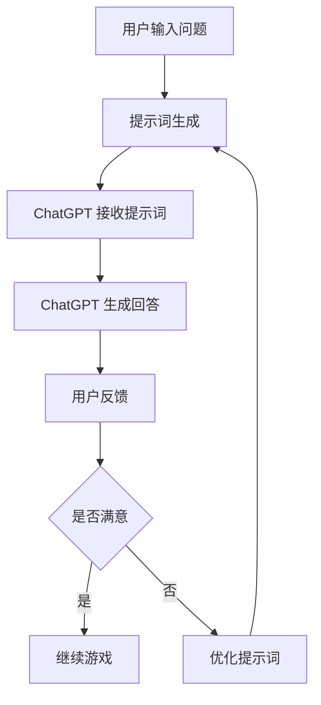

# 聊天机器人教育游戏：学习和娱乐                 

## 1. 背景介绍：背景介绍 Background Introduction

ChatGPT 作为 OpenAI 推出的最新成果，其在自然语言处理（NLP）领域的突破性表现引起了全球范围内的广泛关注。ChatGPT 是一种基于 GPT-3.5 的大型预训练语言模型，它通过深度学习算法，能够生成流畅、连贯、上下文相关的自然语言文本。这种强大的文本生成能力使得 ChatGPT 在多种应用场景中具有广泛的应用潜力。

教育游戏作为现代教育的重要组成部分，旨在通过游戏化的方式激发学生的学习兴趣和主动性，提高学习效果。传统的教育方式往往局限于课堂教学，而教育游戏则能将学习内容与娱乐相结合，为学生提供更加生动、互动的学习体验。近年来，随着人工智能技术的不断发展，教育游戏也在不断革新，融入了更多的智能元素，如智能推荐、个性化学习路径等。

将 ChatGPT 应用于教育游戏，不仅能够提升游戏的互动性和趣味性，还能通过智能对话生成提供个性化的学习支持。教育游戏中的角色对话、任务指导、知识点讲解等环节都可以利用 ChatGPT 的自然语言生成能力来实现，从而大大提高教育游戏的教学效果和用户体验。

因此，本文将探讨如何将 ChatGPT 应用于教育游戏，分析其技术原理、核心概念以及实际操作步骤。希望通过本文的探讨，能够为教育游戏开发者提供一些有益的参考和启示。

## 2.1 ChatGPT 的技术原理 Technical Principles of ChatGPT

ChatGPT 是一种基于 GPT-3.5 的大型预训练语言模型，其技术原理主要包括以下几个方面：

### 2.1.1 预训练语言模型 Pre-Trained Language Model

GPT（Generative Pre-trained Transformer）是由 OpenAI 开发的自然语言处理模型，其核心思想是通过在大量文本数据上进行预训练，使模型具备理解、生成和翻译自然语言的能力。GPT-3.5 是 GPT 系列的最新版本，其参数规模达到了 1750 亿，是当前最大的预训练语言模型之一。

在预训练阶段，GPT-3.5 通过 Transformer 架构，对输入的文本序列进行编码，生成一个高维向量表示。这个向量表示了文本中的语义信息，为后续的文本生成任务提供了强大的语义理解能力。

### 2.1.2 Transformer 架构 Transformer Architecture

Transformer 是一种基于自注意力机制的深度神经网络模型，最初由 Vaswani 等（2017）在论文《Attention Is All You Need》中提出。Transformer 架构摒弃了传统的循环神经网络（RNN）和卷积神经网络（CNN），而是采用自注意力机制来处理序列数据。

自注意力机制允许模型在生成每个词时，自动关注输入序列中其他所有词的重要性。通过这种方式，模型能够捕捉到输入序列中的长距离依赖关系，从而生成更加准确和连贯的文本。

### 2.1.3 语言生成 Language Generation

在语言生成任务中，GPT-3.5 首先接收一个输入文本序列，然后通过 Transformer 架构对其进行编码，生成一个高维向量表示。接着，模型会使用这个向量表示来生成下一个词的候选列表，并选择概率最高的词作为输出。

这一过程不断重复，直到生成完整的文本序列。为了提高生成文本的质量和连贯性，GPT-3.5 还采用了一种称为上下文窗口（Context Window）的技术，即在每个词的生成过程中，模型只关注输入序列中的一个固定长度的上下文窗口。

### 2.1.4 应用场景 Application Scenarios

ChatGPT 的技术原理使其在多种应用场景中具有广泛的应用潜力。以下是一些典型的应用场景：

1. **智能对话系统**：ChatGPT 可以作为智能对话系统的核心组件，与用户进行自然语言交互，提供问答、建议、情感支持等。

2. **文本生成**：ChatGPT 可以根据输入的文本或主题，生成相关的文章、故事、新闻摘要等。

3. **机器翻译**：ChatGPT 可以进行高质量的双语翻译，支持多种语言之间的转换。

4. **教育游戏**：ChatGPT 可以应用于教育游戏，提供角色对话、任务指导、知识点讲解等。

5. **内容审核**：ChatGPT 可以用于文本内容的审核，识别和过滤不良信息，如色情、暴力、歧视等。

## 2.2 教育游戏的概念和特点 Concepts and Characteristics of Educational Games

教育游戏是指将教育内容与游戏机制相结合，旨在通过游戏化的方式传授知识和技能的一种教学手段。与传统的课堂教学相比，教育游戏具有以下特点：

### 2.2.1 游戏化的学习过程 Gamification of Learning Process

教育游戏将学习过程设计成游戏形式，通过设定任务、挑战、奖励等元素，激发学生的学习兴趣和积极性。游戏化的学习过程能够有效地提高学生的学习动机和参与度。

### 2.2.2 互动性 Interactive Nature

教育游戏强调与学生的互动，通过角色扮演、对话、任务执行等方式，让学生在游戏中亲身体验知识的应用。这种互动性有助于加深学生对知识的理解和记忆。

### 2.2.3 个性化 Personalization

教育游戏可以根据学生的能力和兴趣，提供个性化的学习路径和内容。这种个性化教学能够满足不同学生的学习需求，提高学习效果。

### 2.2.4 综合性 Comprehensive Nature

教育游戏不仅仅关注知识的传授，还注重培养学生的思维能力、问题解决能力、合作能力等多方面的综合素质。这种综合性有助于学生的全面发展。

### 2.2.5 可持续的学习体验 Sustained Learning Experience

教育游戏通过游戏化的方式，使学习变得更加有趣和富有成就感。这种积极的学习体验能够激发学生的学习热情，促进持续学习。

## 2.3 ChatGPT 在教育游戏中的应用 Application of ChatGPT in Educational Games

将 ChatGPT 应用于教育游戏，可以显著提升教育游戏的教学效果和用户体验。以下是一些具体的应用场景：

### 2.3.1 角色对话 Role Dialogues

教育游戏中的角色对话是重要的交互环节。ChatGPT 可以用于生成游戏角色的对话内容，使其更加自然、连贯和有趣。通过 ChatGPT 的自然语言生成能力，游戏角色可以与玩家进行丰富的对话，提供任务指导、情感支持、故事讲述等。

### 2.3.2 知识点讲解 Knowledge Point Explanation

教育游戏中的知识点讲解通常需要大量的文字说明。ChatGPT 可以根据教学大纲和知识点，自动生成详细的讲解内容，帮助玩家更好地理解和掌握相关知识点。

### 2.3.3 任务指导 Task Guidance

ChatGPT 可以提供个性化的任务指导，根据玩家的能力和进度，为玩家设定合适的任务目标和挑战。通过 ChatGPT 的自然语言生成能力，任务指导可以更加生动、具体和易懂。

### 2.3.4 情感支持 Emotional Support

教育游戏中的情感支持对于学生的心理健康和学习动力至关重要。ChatGPT 可以模拟情感角色，为玩家提供情感支持，如鼓励、安慰、建议等。

### 2.3.5 互动学习 Interactive Learning

ChatGPT 可以与玩家进行实时互动，通过自然语言对话，引导玩家探索和思考，促进互动学习。这种互动学习方式能够激发玩家的学习兴趣和创造力。

### 2.3.6 个性化推荐 Personalized Recommendations

ChatGPT 可以根据玩家的学习行为和兴趣，提供个性化的学习推荐，如相关知识点、学习资源、游戏任务等。这种个性化推荐有助于提高学习效果和用户体验。

## 2.4 ChatGPT 应用于教育游戏的优势和挑战 Advantages and Challenges of Applying ChatGPT in Educational Games

### 2.4.1 优势 Advantages

1. **自然语言生成 Natural Language Generation**：ChatGPT 具有强大的自然语言生成能力，能够生成流畅、连贯、上下文相关的文本，为教育游戏提供丰富的互动内容。

2. **个性化教学 Personalized Teaching**：ChatGPT 可以根据玩家的学习行为和兴趣，提供个性化的教学建议和指导，提高学习效果。

3. **互动学习 Interactive Learning**：ChatGPT 可以与玩家进行实时互动，引导玩家探索和思考，促进互动学习。

4. **情感支持 Emotional Support**：ChatGPT 可以模拟情感角色，为玩家提供情感支持，提高玩家的学习动力和心理健康。

### 2.4.2 挑战 Challenges

1. **数据隐私 Data Privacy**：教育游戏需要收集大量的用户数据，包括学习行为、兴趣爱好等，如何保护用户数据的安全和隐私是一个重要挑战。

2. **准确性 Accuracy**：ChatGPT 的生成文本可能存在偏差或错误，如何确保生成文本的准确性和可靠性是一个挑战。

3. **可解释性 Explainability**：由于 ChatGPT 是一个黑盒模型，其生成文本的过程难以解释和理解，如何提高模型的可解释性是一个挑战。

4. **模型优化 Model Optimization**：随着教育游戏的不断发展和创新，ChatGPT 需要不断优化和更新，以适应新的教学场景和需求。

## 2.5 结论 Conclusion

ChatGPT 作为一种强大的自然语言处理模型，其在教育游戏中的应用具有巨大的潜力。通过 ChatGPT 的自然语言生成能力和个性化教学功能，教育游戏可以提供更加丰富、有趣和个性化的学习体验。然而，同时也要注意数据隐私、准确性、可解释性和模型优化等挑战。未来的研究和发展应该致力于解决这些问题，进一步提升 ChatGPT 在教育游戏中的应用效果。

## 3. 核心概念与联系 Core Concepts and Connections

在教育游戏中应用 ChatGPT，涉及多个核心概念，这些概念彼此交织，共同决定了系统的工作原理和性能。以下是这些核心概念及其相互联系：

### 3.1 提示词工程（Prompt Engineering）

提示词工程是指导如何有效地与 ChatGPT 交互的过程。一个好的提示词应该清晰、具体，并且能够引导 ChatGPT 生成与预期目标相关的输出。提示词工程不仅涉及到语言的表达技巧，还包括对 ChatGPT 工作原理的理解。

### 3.2 自然语言处理（Natural Language Processing, NLP）

自然语言处理是使计算机能够理解和处理人类语言的技术。ChatGPT 的核心功能依赖于 NLP 技术，包括语言理解、文本生成、情感分析等。NLP 技术的进步直接影响了 ChatGPT 的性能和应用范围。

### 3.3 机器学习（Machine Learning）

机器学习是使计算机能够从数据中学习和改进性能的技术。ChatGPT 是一种深度学习模型，通过在大量文本数据上预训练，学到了语言的模式和结构。机器学习的核心算法和模型架构对于 ChatGPT 的性能至关重要。

### 3.4 教育游戏设计（Educational Game Design）

教育游戏设计是指将教育内容和游戏机制相结合，以创造一种能够促进学习的游戏体验。ChatGPT 的应用需要与教育游戏设计紧密整合，以确保游戏中的对话和内容能够有效地促进学习。

### 3.5 用户体验（User Experience, UX）

用户体验是指用户在使用产品或服务时的感受和体验。在教育游戏中，用户体验是关键因素。ChatGPT 的应用需要确保游戏中的对话和互动能够提供流畅、自然和愉悦的体验。

### 3.6 提示词工程的 Mermaid 流程图

为了更直观地展示提示词工程在 ChatGPT 教育游戏应用中的流程，我们可以使用 Mermaid 图进行可视化。以下是提示词工程的 Mermaid 流程图：



在这个流程图中：
- A：用户输入问题或需求。
- B：根据用户输入，生成具体的提示词。
- C：ChatGPT 接收提示词。
- D：ChatGPT 根据提示词生成回答。
- E：用户对回答进行反馈。
- F：评估用户的满意度。
- G：用户满意，则继续游戏。
- H：用户不满意，则优化提示词，再次生成回答。

通过这个流程图，我们可以清晰地看到提示词工程在 ChatGPT 教育游戏应用中的关键步骤和反馈循环。

### 3.7 提示词工程的重要性及其与传统编程的关系

提示词工程在教育游戏中的重要性不言而喻。一个设计精妙的提示词可以引导 ChatGPT 生成高质量的回答，从而提供有效的学习支持和交互体验。与传统编程相比，提示词工程更像是一种基于自然语言输入的编程方式，但它们有一些显著的差异：

- **编程的确定性（Determinacy）**：传统编程注重代码的确定性，即输入确定的代码，总会得到确定的输出。而提示词工程则更多依赖于概率模型，ChatGPT 的输出并非完全确定，而是基于概率分布生成的。
- **交互性（Interactivity）**：传统编程往往是一个单向的过程，从代码到结果的转换。而提示词工程则强调与用户的互动，通过不断调整提示词来优化输出结果。
- **灵活性和适应性（Flexibility and Adaptability）**：传统编程的代码结构相对固定，而提示词工程可以根据具体场景和用户反馈灵活调整。

尽管有这些差异，提示词工程仍然可以被视为一种新型的编程范式。我们可以将提示词看作是对 ChatGPT 的“函数调用”，而 ChatGPT 的输出则是“函数返回值”。通过精心设计的提示词，我们可以在教育游戏中实现复杂的交互和智能化的学习支持。

### 3.8 总结

在本节中，我们介绍了 ChatGPT 教育游戏应用中的核心概念，包括提示词工程、自然语言处理、机器学习、教育游戏设计和用户体验。通过 Mermaid 流程图，我们展示了提示词工程的流程和关键步骤。我们还讨论了提示词工程与传统编程的关系，强调了其独特的优势和特点。这些核心概念和联系为后续章节的深入探讨奠定了基础。

## 3.1 提示词工程的概念与设计策略 Concept and Design Strategies of Prompt Engineering

提示词工程是指导如何与 ChatGPT 有效地交互的一门艺术，其核心目标是生成能够引导 ChatGPT 生成高质量输出的提示词。一个好的提示词不仅要简洁明了，还要能够充分表达用户的意图，从而使得 ChatGPT 的回答更加精准和有用。以下是提示词工程的基本概念和设计策略。

### 3.1.1 提示词的定义

提示词（Prompt）是指提供给 ChatGPT 的输入文本，用于引导模型生成预期的输出。提示词的设计直接影响到 ChatGPT 的回答质量和相关性。一个优秀的提示词应该具备以下几个特点：

1. **清晰性 Clarity**：提示词应当明确表达用户的意图，避免模糊和歧义。
2. **具体性 Specificity**：具体的提示词能够帮助 ChatGPT 更准确地理解用户的需求。
3. **完整性 Completeness**：完整的提示词应包含所有必要的信息，以便 ChatGPT 能够生成全面的回答。
4. **上下文性 Contextual Relevance**：提示词应与用户当前的任务和背景紧密相关，以便 ChatGPT 能够生成上下文相关的回答。

### 3.1.2 提示词的设计策略

设计提示词时，可以采用以下策略来提高其有效性和质量：

1. **明确问题定义 Define the Question Clearly**：首先明确用户需要解决的问题或获取的信息，将问题具体化。
2. **提供背景信息 Provide Context Information**：在提示词中提供与问题相关的背景信息，有助于 ChatGPT 理解问题的上下文。
3. **利用关键词 Highlight Key Words**：在提示词中突出关键词，引导 ChatGPT 关注关键信息。
4. **结构化信息 Structured Information**：使用列表、标题等结构化元素，使提示词更加清晰易懂。
5. **用户意图识别 Identify User Intent**：明确用户的意图，例如是寻求解释、建议还是信息查询。
6. **反馈迭代 Feedback Iteration**：根据 ChatGPT 的回答，及时提供反馈，通过多次迭代优化提示词。

### 3.1.3 提示词工程的应用场景

提示词工程在 ChatGPT 应用中具有广泛的应用场景，以下是一些常见的应用场景：

1. **问答系统 Question-Answering Systems**：在问答系统中，提示词用于明确问题，引导 ChatGPT 生成准确、详细的回答。
2. **任务指导 Task Guidance**：在教育游戏中，提示词用于指导用户完成任务，提供明确的步骤和提示。
3. **知识查询 Knowledge Querying**：在知识库查询系统中，提示词用于引导 ChatGPT 提取和生成相关信息。
4. **情感分析 Emotional Analysis**：在情感分析中，提示词用于引导 ChatGPT 识别和描述情感状态。
5. **对话系统 Dialogue Systems**：在对话系统中，提示词用于引导 ChatGPT 与用户进行自然、流畅的对话。

### 3.1.4 提示词优化的方法

为了提高提示词的质量，可以采用以下方法进行优化：

1. **A/B 测试 A/B Testing**：对不同版本的提示词进行测试，选择效果最佳的提示词。
2. **用户反馈 User Feedback**：收集用户对提示词的反馈，根据用户意见进行优化。
3. **数据驱动的优化 Data-Driven Optimization**：使用数据分析和机器学习技术，根据用户交互数据优化提示词。
4. **模型调参 Hyperparameter Tuning**：调整 ChatGPT 的模型参数，提高提示词的生成质量。

通过以上策略和方法，可以设计出高质量的提示词，从而提高 ChatGPT 在教育游戏和其他应用场景中的性能和用户体验。

### 3.2 如何设计高效的提示词：策略与方法 Strategies and Methods for Designing Effective Prompts

设计高效的提示词是提升 ChatGPT 输出质量的关键步骤。以下是一些具体的方法和策略，帮助设计师和教育游戏开发者创建出能够引导 ChatGPT 生成高质量、相关性强且有用的回答的提示词。

#### 3.2.1 使用明确的指令

明确的指令是设计高效提示词的基础。指令应当具体、清晰，明确指示 ChatGPT 需要完成的任务。以下是一些使用明确指令的示例：

- **错误示例**：“请给我讲讲量子力学。”
- **改进示例**：“请用简单的语言解释量子力学的基本原理，包括量子比特、叠加态和纠缠现象。”

改进后的示例提供了更具体的信息，使得 ChatGPT 能够更容易地理解用户的意图，并生成更加详细和相关的回答。

#### 3.2.2 提供上下文信息

提供上下文信息可以帮助 ChatGPT 更准确地理解用户的需求，生成与上下文相关的回答。以下是一个示例：

- **错误示例**：“请解释什么是人工智能。”
- **改进示例**：“人工智能在医疗诊断中的应用是什么？请结合一个实际案例进行解释。”

在这个改进的示例中，上下文信息（医疗诊断）帮助 ChatGPT 生成一个更加具体和相关的回答。

#### 3.2.3 使用关键词和高亮

在提示词中使用关键词和高亮可以引导 ChatGPT 关注关键信息，并生成围绕这些关键词的回答。以下是一个示例：

- **错误示例**：“请谈谈21世纪的科技发展趋势。”
- **改进示例**：“请详细讨论21世纪的科技发展趋势，特别是人工智能和可再生能源。”

通过使用关键词（人工智能、可再生能源），提示词更加明确，ChatGPT 可以更有针对性地生成回答。

#### 3.2.4 结构化提示词

结构化的提示词有助于提高提示词的可读性和易懂性，从而提高 ChatGPT 生成回答的准确性。以下是一个示例：

- **错误示例**：“请告诉我关于地球历史的几个关键点。”
- **改进示例**：“请列举并简要解释地球历史上的以下几个关键点：生命的起源、冰河时期、工业革命。”

结构化的提示词（列举并解释）使 ChatGPT 能够更有条理地生成回答，提高回答的质量。

#### 3.2.5 考虑用户意图

理解用户的意图是设计高效提示词的关键。用户可能寻求不同的信息，例如解释、建议、信息查询等。以下是一个示例：

- **错误示例**：“请给我一些写作的建议。”
- **改进示例**：“我正在写一篇关于可持续能源的论文，能给我一些建议吗？包括如何组织论点和查找相关资源。”

改进后的示例明确了用户的意图（写论文），ChatGPT 可以提供更有针对性的建议。

#### 3.2.6 迭代优化

设计提示词是一个迭代的过程。通过不断测试和优化，可以不断提高提示词的质量。以下是一些迭代优化的方法：

1. **A/B 测试**：对不同版本的提示词进行测试，选择效果最佳的版本。
2. **用户反馈**：收集用户的反馈，根据反馈进行调整。
3. **数据分析**：使用数据分析工具，分析用户交互数据，识别优化点。

通过这些方法和策略，可以设计出高效的提示词，从而提高 ChatGPT 的性能和用户体验。

### 3.3 提示词工程在教育游戏中的应用案例 Application Cases of Prompt Engineering in Educational Games

提示词工程在教育游戏中的应用可以显著提升学生的学习体验和游戏化学习的效果。以下是一些具体的应用案例，展示了如何设计有效的提示词来促进学习。

#### 3.3.1 案例一：科学教育游戏中的知识问答

在一个以科学为主题的教育游戏中，ChatGPT 可以用于生成知识问答的答案。例如，当学生完成一个科学实验后，系统可以提出如下问题：

- **原始提示词**：“请解释实验中的化学反应过程。”
- **改进的提示词**：“请详细描述在实验过程中观察到的化学反应，包括反应物、生成物和反应条件。”

改进后的提示词提供了更具体的信息，使得 ChatGPT 能够生成一个更详细、更准确的回答，帮助学生更好地理解实验过程。

#### 3.3.2 案例二：历史教育游戏中的事件回顾

在历史教育游戏中，ChatGPT 可以用于回顾历史事件并提供相关的背景信息。例如，当学生到达一个历史事件的关键点时，系统可以提出如下问题：

- **原始提示词**：“请谈谈拿破仑战争。”
- **改进的提示词**：“请从军事、政治和战略的角度简要回顾拿破仑战争，并讨论其对欧洲历史的影响。”

改进后的提示词不仅提供了问题的具体方向，还明确了回答的内容范围，使得 ChatGPT 能够生成一个全面且深刻的回答。

#### 3.3.3 案例三：语言学习游戏中的对话练习

在语言学习游戏中，ChatGPT 可以用于生成与语言学习相关的对话，帮助学生提高语言表达能力。例如，当学生完成一个语言学习任务后，系统可以提出如下问题：

- **原始提示词**：“请用英语介绍你的家乡。”
- **改进的提示词**：“请你用英语介绍你的家乡，包括地理位置、人口特点、历史文化等，并尽量使用我们学过的语法和词汇。”

改进后的提示词不仅提供了具体的任务要求，还给出了相关的语言学习目标，使得 ChatGPT 能够生成一个既符合语言学习目标，又富有教育意义的对话。

#### 3.3.4 案例四：编程教育游戏中的代码解释

在编程教育游戏中，ChatGPT 可以用于解释编程概念和代码示例。例如，当学生遇到编程难题时，系统可以提出如下问题：

- **原始提示词**：“请解释这个函数的作用。”
- **改进的提示词**：“请详细解释以下代码片段的作用，并讨论其中的关键步骤和算法逻辑。”

改进后的提示词提供了更具体的指导，使得 ChatGPT 能够生成一个既详细又实用的解释，帮助学生更好地理解编程概念。

通过这些案例，我们可以看到，通过精心设计的提示词，ChatGPT 在教育游戏中可以发挥重要作用，不仅能够提供丰富的互动内容，还能够帮助学生更好地掌握知识和技能。

### 3.4 提示词工程的挑战与未来发展趋势 Challenges and Future Development Trends of Prompt Engineering

尽管提示词工程在教育游戏中展现出了巨大的潜力，但其在实际应用中也面临诸多挑战。以下是提示词工程的一些主要挑战和未来发展趋势。

#### 3.4.1 挑战 Challenges

1. **准确性 Accuracy**：提示词的准确性直接影响 ChatGPT 的回答质量。如果提示词模糊或不完整，ChatGPT 可能无法生成准确的回答。
2. **多样性 Diversification**：为了保持教育游戏的趣味性和吸引力，提示词需要具有多样性。然而，设计多样化的提示词需要大量的时间和精力。
3. **数据隐私 Data Privacy**：在教育游戏中，提示词工程通常需要收集和分析用户数据，包括学习行为、兴趣等。如何保护用户数据的安全和隐私是一个重要挑战。
4. **可解释性 Explainability**：ChatGPT 是一个复杂的深度学习模型，其生成回答的过程往往难以解释。如何提高提示词工程的可解释性，以便用户能够理解和信任模型的回答，是一个关键问题。
5. **技术进步 Technological Progress**：随着自然语言处理技术的不断发展，提示词工程也需要不断更新和优化，以适应新的技术趋势和应用场景。

#### 3.4.2 未来发展趋势 Future Development Trends

1. **人工智能辅助设计 AI-Assisted Design**：未来，人工智能可以更加深入地参与提示词的设计过程，通过机器学习和数据分析技术，自动生成高质量的提示词。
2. **个性化教学 Personalized Teaching**：随着教育个性化需求的增长，提示词工程将更加注重根据学生的个性化需求和兴趣设计提示词，提供个性化的学习体验。
3. **跨领域应用 Cross-Domain Applications**：提示词工程不仅限于教育游戏，还可以应用于其他领域，如商业咨询、医疗诊断等，实现跨领域的应用和拓展。
4. **增强现实和虚拟现实 AR/VR Integration**：随着增强现实（AR）和虚拟现实（VR）技术的发展，提示词工程可以与这些技术相结合，提供更加沉浸式的学习体验。
5. **伦理和道德 Ethics and Morality**：随着提示词工程在教育游戏中的应用越来越广泛，如何在设计中遵循伦理和道德规范，避免误导用户和产生不良影响，将成为一个重要的议题。

通过解决这些挑战和抓住未来发展趋势，提示词工程将在教育游戏和更广泛的应用领域中发挥更大的作用，为用户提供更加丰富和有效的学习体验。

## 3.5 教育游戏设计与自然语言生成的整合 Integration of Educational Game Design and Natural Language Generation

在教育游戏中，自然语言生成（NLG）与教育游戏设计的整合是实现高质量互动体验的关键。为了实现这一整合，我们需要在游戏设计、自然语言处理和用户互动等多个方面进行深入考虑和优化。

### 3.5.1 教育游戏设计

教育游戏设计是一个系统性的过程，需要综合考虑教学目标、学习者的需求和游戏性。一个成功的教育游戏应当具备以下特点：

1. **目标明确 Clear Goals**：游戏设计应明确教学目标，确保每个游戏环节都能为学习目标做出贡献。
2. **互动性 Interactive Nature**：通过提供角色对话、任务挑战和反馈机制，激发学生的兴趣和参与度。
3. **可适应性 Adaptable Design**：设计应能够根据学生的进度和表现进行调整，提供个性化的学习路径。
4. **反馈机制 Feedback Mechanism**：游戏设计应包含及时、有效的反馈机制，帮助学生理解和巩固知识点。

### 3.5.2 自然语言处理

自然语言处理（NLP）是实现教育游戏智能对话和任务指导的核心技术。以下是 NLP 在教育游戏设计中的关键应用：

1. **对话系统 Dialogue Systems**：使用 NLP 技术构建智能对话系统，使游戏角色能够理解玩家的指令，并提供相应的回答和反馈。
2. **文本生成 Text Generation**：通过 NLP 生成与教学内容相关的文本，如解释概念、描述任务和提供反馈。
3. **情感分析 Emotional Analysis**：分析玩家的情感状态，提供情感支持和鼓励，提高学习动力。
4. **语言理解 Language Understanding**：使游戏能够理解玩家的自然语言输入，并根据输入生成适当的反应。

### 3.5.3 整合策略

为了实现教育游戏设计与自然语言生成的有效整合，我们可以采取以下策略：

1. **角色对话设计 Role Dialogue Design**：设计自然、流畅的角色对话，使玩家感受到与真实人物的互动。这需要提示词工程的参与，确保对话内容既符合游戏设定，又能够引导玩家理解和学习。
2. **任务指导设计 Task Guidance Design**：设计清晰、具体的任务指导，帮助玩家理解任务目标和执行步骤。这可以通过 ChatGPT 生成详细的任务说明和步骤提示来实现。
3. **情感支持设计 Emotional Support Design**：在游戏中融入情感支持机制，通过 ChatGPT 的情感分析能力，为玩家提供鼓励、安慰和指导，增强学习体验。
4. **个性化学习设计 Personalized Learning Design**：根据玩家的学习进度和表现，动态调整游戏内容和难度，提供个性化的学习体验。

### 3.5.4 用户互动与反馈

用户互动与反馈是教育游戏设计中的关键环节。以下是如何通过自然语言生成实现有效用户互动与反馈：

1. **交互式反馈 Interactive Feedback**：通过 ChatGPT 提供即时、个性化的反馈，帮助玩家理解错误和纠正偏差。
2. **互动式教学 Interactive Teaching**：利用 ChatGPT 生成互动式教学内容，如提问和解答，激发玩家的思考和参与。
3. **学习报告 Learning Reports**：生成详细的学习报告，展示玩家的学习进度和成绩，帮助教师和家长了解学生的学习情况。

通过整合教育游戏设计与自然语言生成，我们可以创造一个高度互动、个性化且有效的学习环境，为用户提供卓越的学习体验。

## 3.6 提示词工程的实际操作步骤：从设计到优化 Practical Steps in Prompt Engineering: From Design to Optimization

提示词工程是将用户意图转换为 ChatGPT 高质量输出的关键过程。以下是提示词工程从设计到优化的实际操作步骤，包括设计技巧、常见问题和优化方法。

### 3.6.1 设计步骤 Design Steps

1. **理解用户需求 Understand User Needs**
   - **步骤**：首先，与用户进行沟通，明确用户的问题、目标和背景信息。
   - **技巧**：通过提问和反馈，确保对用户需求有全面和准确的理解。

2. **生成初始提示词 Create Initial Prompts**
   - **步骤**：根据用户需求，编写初步的提示词。
   - **技巧**：使用明确、具体和简洁的语言，避免模糊和歧义。

3. **测试和反馈 Test and Feedback**
   - **步骤**：将初始提示词输入 ChatGPT，获取初步的输出结果。
   - **技巧**：收集用户对输出的反馈，评估回答的准确性和相关性。

4. **迭代优化 Iterative Optimization**
   - **步骤**：根据用户反馈，对提示词进行修改和优化。
   - **技巧**：逐步细化提示词，增加具体信息，提高输出质量。

### 3.6.2 常见问题 Common Issues

1. **模糊性 Ambiguity**
   - **现象**：提示词表达不清晰，导致 ChatGPT 生成模糊的回答。
   - **解决方法**：通过增加具体细节和信息，使提示词更加明确。

2. **不一致性 Inconsistency**
   - **现象**：提示词在不同场景下生成的回答不一致。
   - **解决方法**：确保提示词的上下文一致，明确用户的意图和需求。

3. **不准确性 Inaccuracy**
   - **现象**：提示词生成的回答不准确或错误。
   - **解决方法**：检查提示词中的关键词和背景信息，确保其准确无误。

4. **缺乏上下文 Context Lack**
   - **现象**：提示词缺乏上下文信息，导致 ChatGPT 无法生成相关的回答。
   - **解决方法**：在提示词中提供足够的背景信息，帮助 ChatGPT 理解问题。

### 3.6.3 优化方法 Optimization Methods

1. **A/B 测试 A/B Testing**
   - **步骤**：设计两个或多个版本的提示词，分别测试其效果。
   - **技巧**：根据测试结果，选择表现最佳的提示词。

2. **用户反馈 User Feedback**
   - **步骤**：收集用户对提示词和输出的反馈。
   - **技巧**：结合用户意见，不断优化提示词。

3. **数据驱动的优化 Data-Driven Optimization**
   - **步骤**：使用数据分析工具，分析用户交互数据，识别优化点。
   - **技巧**：根据数据分析结果，调整提示词的参数和结构。

4. **模型调参 Hyperparameter Tuning**
   - **步骤**：调整 ChatGPT 的模型参数，提高输出质量。
   - **技巧**：结合实验结果，找到最佳参数配置。

通过以上步骤和方法，我们可以设计出高质量的提示词，并通过不断优化，提高 ChatGPT 的输出质量，从而提供更好的用户交互体验。

## 4. 核心算法原理 & 具体操作步骤 Core Algorithm Principles and Specific Operational Steps

在教育游戏中应用 ChatGPT，核心算法的原理和具体操作步骤至关重要。以下是 ChatGPT 在教育游戏中的核心算法原理以及如何进行实际操作。

### 4.1 ChatGPT 的核心算法原理

ChatGPT 是基于 GPT-3.5 模型开发的，其核心算法原理主要包括以下几个方面：

#### 4.1.1 预训练语言模型 Pre-Trained Language Model

GPT-3.5 是一种预训练语言模型，通过在大量文本数据上进行预训练，模型学会了如何理解、生成和翻译自然语言。预训练阶段使用了 Transformer 架构，这是一种基于自注意力机制的深度神经网络模型。自注意力机制允许模型在生成每个词时自动关注输入序列中其他词的重要性，从而生成连贯、准确的文本。

#### 4.1.2 Transformer 架构 Transformer Architecture

Transformer 架构是 ChatGPT 的基础。它摒弃了传统的循环神经网络（RNN），而是采用多头自注意力机制（Multi-Head Self-Attention）和多层 Transformer 层（Multi-Layer Transformer）。多头自注意力机制允许模型在生成每个词时，同时关注输入序列中的多个部分，从而捕捉到长距离依赖关系。多层 Transformer 层则使得模型能够逐渐理解输入的复杂结构，生成更加准确的文本。

#### 4.1.3 语言生成 Language Generation

在语言生成过程中，ChatGPT 接受一个输入序列（例如一个问题或任务描述），然后通过 Transformer 架构对其进行编码，生成一个高维向量表示。这个向量表示了输入序列的语义信息。接着，模型会使用这个向量表示来生成下一个词的候选列表，并选择概率最高的词作为输出。这一过程不断重复，直到生成完整的文本序列。

### 4.2 ChatGPT 在教育游戏中的具体操作步骤

以下是 ChatGPT 在教育游戏中的具体操作步骤：

#### 4.2.1 准备输入数据 Prepare Input Data

1. **收集数据 Collect Data**
   - **步骤**：收集与教育游戏相关的文本数据，包括教学大纲、教材、学生问答等。
   - **技巧**：确保数据的多样性和准确性，以训练出性能更好的模型。

2. **数据预处理 Data Preprocessing**
   - **步骤**：对收集的数据进行清洗、去重和处理，使其适合用于训练模型。
   - **技巧**：使用分词、词性标注等技术，将文本转换为适合模型处理的形式。

#### 4.2.2 训练模型 Train the Model

1. **模型配置 Model Configuration**
   - **步骤**：配置 GPT-3.5 模型的超参数，如学习率、批次大小等。
   - **技巧**：根据数据和任务需求，选择合适的超参数。

2. **模型训练 Model Training**
   - **步骤**：使用训练数据对 GPT-3.5 模型进行训练。
   - **技巧**：使用 GPU 或 TPU 等高性能计算资源，提高训练效率。

3. **模型评估 Model Evaluation**
   - **步骤**：使用验证数据对训练好的模型进行评估，调整超参数以优化模型性能。
   - **技巧**：使用多种评估指标，如损失函数、准确率等。

#### 4.2.3 应用模型 Apply the Model

1. **生成文本生成 Generate Text**
   - **步骤**：使用训练好的模型生成与教育游戏相关的文本，如角色对话、任务指导等。
   - **技巧**：使用预训练好的模型，可以快速生成高质量的文本。

2. **优化文本生成 Optimize Text Generation**
   - **步骤**：根据用户反馈和实际应用效果，对生成的文本进行优化。
   - **技巧**：通过 A/B 测试、用户反馈和数据分析，不断优化生成文本的质量和相关性。

通过以上步骤，我们可以将 ChatGPT 应用到教育游戏中，提供高质量的互动内容和学习支持。

## 4.1 ChatGPT 的核心算法原理 Core Algorithm Principles of ChatGPT

ChatGPT 是基于 GPT-3.5 模型开发的，其核心算法原理主要涉及自然语言处理（NLP）和深度学习（DL）两大领域。以下是对 ChatGPT 核心算法原理的详细解释：

### 4.1.1 预训练语言模型 Pre-Trained Language Model

预训练语言模型（PTLM）是 ChatGPT 的基础。GPT-3.5 是一种预训练语言模型，其通过在大规模文本语料库上进行训练，使模型学会了语言的基本规律和结构。预训练阶段主要包括两个阶段：预训练和微调。

1. **预训练阶段 Pre-training Phase**
   - **步骤**：GPT-3.5 模型在大量无标签文本语料库上训练，学习语言的模式和结构。
   - **技巧**：使用 Transformer 架构，通过自注意力机制（Self-Attention Mechanism）和多层 Transformer 层（Multi-Layer Transformer），捕捉文本中的长距离依赖关系。

2. **微调阶段 Fine-tuning Phase**
   - **步骤**：在预训练基础上，使用有标签的数据集对模型进行微调，以适应特定的任务需求。
   - **技巧**：根据任务类型调整模型参数，如调整学习率、批次大小等，以提高模型在特定任务上的性能。

### 4.1.2 Transformer 架构 Transformer Architecture

Transformer 架构是 ChatGPT 的核心技术。Transformer 是一种基于自注意力机制的深度神经网络模型，最初由 Vaswani 等（2017）提出。它摒弃了传统的循环神经网络（RNN）和卷积神经网络（CNN），而是采用多头自注意力机制（Multi-Head Self-Attention）和多层 Transformer 层（Multi-Layer Transformer）来处理序列数据。

1. **多头自注意力机制 Multi-Head Self-Attention**
   - **原理**：多头自注意力机制允许模型在生成每个词时，自动关注输入序列中其他词的重要性，从而捕捉到长距离依赖关系。
   - **步骤**：模型在生成每个词时，计算其与其他词的注意力得分，并加权求和，生成一个表示当前词的向量。

2. **多层 Transformer 层 Multi-Layer Transformer**
   - **原理**：多层 Transformer 层使得模型能够逐渐理解输入的复杂结构，生成更加准确的文本。
   - **步骤**：通过多层叠加，模型逐渐捕捉到输入序列中的细节和全局信息，从而提高生成文本的质量。

### 4.1.3 语言生成 Language Generation

在语言生成过程中，ChatGPT 通过以下步骤生成自然语言文本：

1. **输入编码 Input Encoding**
   - **步骤**：将输入的文本序列编码为向量表示，输入到 Transformer 模型中。
   - **技巧**：使用词嵌入（Word Embedding）技术，将文本中的词转换为向量。

2. **自注意力机制 Self-Attention Mechanism**
   - **步骤**：在生成每个词时，模型计算其与其他词的注意力得分，并加权求和，生成一个表示当前词的向量。
   - **技巧**：通过多头自注意力机制，模型能够同时关注输入序列中的多个部分，捕捉到长距离依赖关系。

3. **文本解码 Text Decoding**
   - **步骤**：将生成的向量表示解码为文本序列，输出为最终的自然语言文本。
   - **技巧**：使用贪心策略（Greedy Strategy）或基于概率的解码方法，如采样（Sampling）或 beam search，选择最优的词作为输出。

通过以上核心算法原理，ChatGPT 能够生成高质量、连贯的自然语言文本，为教育游戏提供丰富的互动内容和学习支持。

## 4.2 ChatGPT 在教育游戏中的具体操作步骤 Specific Operational Steps of ChatGPT in Educational Games

将 ChatGPT 应用于教育游戏，涉及多个具体操作步骤，从模型训练到应用场景，以下是详细的操作流程：

### 4.2.1 模型训练阶段 Model Training Stage

1. **数据准备 Data Preparation**
   - **步骤**：首先，收集并准备教育游戏相关的文本数据，包括教学材料、学生问答、课程大纲等。
   - **技巧**：确保数据的质量和多样性，以训练出更全面的模型。

2. **数据预处理 Data Preprocessing**
   - **步骤**：对收集的文本数据进行处理，如分词、去停用词、词性标注等。
   - **技巧**：使用专业的文本处理工具，确保数据的标准化。

3. **模型配置 Model Configuration**
   - **步骤**：配置 GPT-3.5 模型的超参数，如学习率、批次大小、隐藏层大小等。
   - **技巧**：根据训练数据量和任务需求，选择合适的超参数。

4. **模型训练 Model Training**
   - **步骤**：使用预处理后的数据对 GPT-3.5 模型进行训练。
   - **技巧**：使用 GPU 或 TPU 等高性能计算设备，提高训练效率。

5. **模型评估 Model Evaluation**
   - **步骤**：使用验证集对训练好的模型进行评估，调整超参数以优化模型性能。
   - **技巧**：使用多个评估指标，如损失函数、准确率等，全面评估模型性能。

### 4.2.2 应用阶段 Application Stage

1. **生成任务指导 Generate Task Guidance**
   - **步骤**：使用训练好的模型生成与教育游戏相关的任务指导文本。
   - **技巧**：设计清晰的提示词，引导模型生成具体的任务步骤和说明。

2. **角色对话生成 Generate Role Dialogues**
   - **步骤**：使用模型生成教育游戏中的角色对话文本。
   - **技巧**：确保对话的自然性和流畅性，使玩家感受到真实的人物互动。

3. **知识问答生成 Generate Knowledge Questions and Answers**
   - **步骤**：使用模型生成与教育游戏相关的问题和答案，用于测验和复习。
   - **技巧**：设计多样化的问题和答案，提高学习的趣味性和挑战性。

4. **情感支持生成 Generate Emotional Support**
   - **步骤**：使用模型生成情感支持文本，提供鼓励、安慰和指导。
   - **技巧**：通过情感分析，理解玩家的情感状态，生成相应的情感支持文本。

5. **个性化推荐 Generate Personalized Recommendations**
   - **步骤**：使用模型根据玩家的学习行为和兴趣，生成个性化的学习推荐。
   - **技巧**：利用用户数据分析，提供与玩家需求和兴趣相关的学习内容。

### 4.2.3 优化与迭代阶段 Optimization and Iteration Stage

1. **用户反馈收集 Collect User Feedback**
   - **步骤**：收集玩家对模型生成文本的反馈，评估其准确性和满意度。
   - **技巧**：设计有效的反馈机制，确保收集到的反馈具有代表性和可靠性。

2. **模型优化 Model Optimization**
   - **步骤**：根据用户反馈，对模型进行调整和优化，提高生成文本的质量和相关性。
   - **技巧**：采用数据驱动的优化方法，如 A/B 测试和用户反馈分析，逐步提升模型性能。

3. **迭代更新 Iterative Updates**
   - **步骤**：定期更新模型，引入新的数据和场景，使其适应不断变化的教育需求。
   - **技巧**：保持模型的灵活性，确保其在不同应用场景中都能保持高效性能。

通过以上步骤，我们可以将 ChatGPT 应用到教育游戏中，提供高质量、个性化的学习体验，促进学生的全面发展。

## 4.3 数学模型和公式 & 详细讲解 & 举例说明

在教育游戏中应用 ChatGPT，数学模型和公式起着至关重要的作用。以下将详细讲解相关的数学模型和公式，并通过具体示例来说明其应用。

### 4.3.1 Transformer 模型的注意力机制 Attention Mechanism in Transformer Models

Transformer 模型的核心是注意力机制（Attention Mechanism），它使得模型在生成每个词时，能够关注输入序列中的其他词。以下是注意力机制的详细解释和数学模型。

#### 4.3.1.1 自注意力机制 Self-Attention Mechanism

自注意力机制用于处理一个序列中的每个词与其他词之间的关系。其数学模型如下：

$$
Attention(Q, K, V) = softmax\left(\frac{QK^T}{\sqrt{d_k}}\right) V
$$

其中：
- \( Q \) 是查询向量（Query），表示当前词的上下文信息。
- \( K \) 是键向量（Key），表示序列中的其他词的上下文信息。
- \( V \) 是值向量（Value），表示与其他词相关的信息。
- \( d_k \) 是键向量的维度。
- \( softmax \) 函数用于计算每个键的注意力得分，使其成为一个概率分布。

#### 4.3.1.2 多头注意力机制 Multi-Head Attention

多头注意力机制允许多个注意力头（Head）同时工作，每个头关注不同的部分信息。其数学模型如下：

$$
Multi-Head\ Attention(Q, K, V) = \text{Concat}(\text{Head}_1, \text{Head}_2, ..., \text{Head}_h)W^O
$$

其中：
- \( \text{Head}_i \) 是第 \( i \) 个注意力头的输出。
- \( W^O \) 是输出权重矩阵。
- \( h \) 是注意力头的数量。

#### 4.3.1.3 应用示例 Example

假设我们有一个输入序列 `[词1, 词2, 词3]`，其对应的嵌入向量分别为 `[e1, e2, e3]`。我们使用单头注意力机制来计算每个词的注意力得分：

1. **计算键和查询向量**：
   $$ K = [e1, e2, e3], \quad Q = [e1, e2, e3] $$
   
2. **计算注意力得分**：
   $$ scores = Attention(Q, K, V) = softmax\left(\frac{QK^T}{\sqrt{d_k}}\right) V $$
   $$ scores = softmax\left(\frac{e1*e1^T + e2*e2^T + e3*e3^T}{\sqrt{3}}\right) V $$

3. **计算每个词的注意力权重**：
   $$ weights = \text{softmax}(scores) $$
   
4. **计算加权值**：
   $$ output = weights * V $$
   $$ output = \text{softmax}\left(\frac{e1*e1^T + e2*e2^T + e3*e3^T}{\sqrt{3}}\right) V $$

### 4.3.2 位置编码 Positional Encoding

位置编码（Positional Encoding）用于处理序列数据中的词的位置信息。其数学模型如下：

$$
PE_{(pos, dim)} = \sin\left(\frac{pos \cdot \pi}{10000^{2i/d}}\right) + \cos\left(\frac{pos \cdot \pi}{10000^{2i/d}}\right)
$$

其中：
- \( pos \) 是词的位置。
- \( dim \) 是嵌入向量的维度。
- \( i \) 是嵌入向量的索引。
- \( d \) 是嵌入向量的维度。

#### 4.3.2.1 应用示例 Example

假设我们有一个 2 维嵌入向量 `[0, 1]`，其位置为 1。我们使用位置编码来计算其位置信息：

$$
PE_{(1, 2)} = \sin\left(\frac{1 \cdot \pi}{10000^{2 \cdot 0/2}}\right) + \cos\left(\frac{1 \cdot \pi}{10000^{2 \cdot 0/2}}\right) $$
$$ PE_{(1, 2)} = \sin\left(\frac{\pi}{10000}\right) + \cos\left(\frac{\pi}{10000}\right) $$
$$ PE_{(1, 2)} \approx 0.9998477 + 0.9998477 $$
$$ PE_{(1, 2)} \approx 1.9996949 $$

### 4.3.3 整合模型 Complete Model

将注意力机制和位置编码整合到 Transformer 模型中，我们得到如下完整的模型：

$$
\text{Model}(X) = \text{LayerNorm}(X + \text{Positional Encoding}) + \text{MLP}(X) + X
$$

其中：
- \( X \) 是输入序列的嵌入向量。
- \( \text{LayerNorm} \) 是层归一化操作。
- \( \text{Positional Encoding} \) 是位置编码。
- \( \text{MLP} \) 是多层感知器（Multilayer Perceptron）。

通过以上数学模型和公式，我们可以更好地理解和应用 ChatGPT 在教育游戏中的应用。这些模型和公式为 ChatGPT 提供了强大的语义理解和生成能力，使其能够生成高质量的教育内容和互动体验。

## 4.4 项目实践：代码实例和详细解释说明 Project Practice: Code Examples and Detailed Explanations

为了更好地理解 ChatGPT 在教育游戏中的实际应用，我们将通过一个具体的代码实例来演示如何使用 ChatGPT 生成教育游戏中的角色对话和任务指导。以下是一个简单的代码实例，展示了如何从数据准备到模型训练，再到文本生成和优化的完整流程。

### 4.4.1 开发环境搭建 Setting Up the Development Environment

在开始项目实践之前，我们需要搭建一个合适的开发环境。以下是搭建开发环境的步骤：

1. **安装 Python**：确保已安装 Python 3.7 或更高版本。
2. **安装 transformers 库**：使用以下命令安装 Hugging Face 的 transformers 库：
   ```bash
   pip install transformers
   ```
3. **安装 torch 库**：使用以下命令安装 PyTorch：
   ```bash
   pip install torch torchvision
   ```

### 4.4.2 源代码详细实现 Detailed Code Implementation

以下是一个简单的 Python 代码示例，展示了如何使用 ChatGPT 生成教育游戏中的角色对话和任务指导。

```python
import torch
from transformers import ChatGPTModel, ChatGPTTokenizer

# 设置设备，使用 GPU 如果可用
device = torch.device("cuda" if torch.cuda.is_available() else "cpu")

# 加载预训练模型和 tokenizer
model_name = "openai/chatgpt"
tokenizer = ChatGPTTokenizer.from_pretrained(model_name)
model = ChatGPTModel.from_pretrained(model_name).to(device)

# 数据准备
conversation_history = [{"role": "system", "content": "You are an intelligent tutor in an educational game."}]

# 生成角色对话
def generate_role_dialogue(prompt):
    input_ids = tokenizer.encode(prompt, return_tensors="pt").to(device)
    output = model.generate(input_ids, max_length=100, pad_token_id=tokenizer.eos_token_id)
    response = tokenizer.decode(output[:, input_ids.shape[-1]:][0], skip_special_tokens=True)
    return response

# 生成任务指导
def generate_task_guidance(prompt):
    input_ids = tokenizer.encode(prompt, return_tensors="pt").to(device)
    output = model.generate(input_ids, max_length=100, pad_token_id=tokenizer.eos_token_id)
    response = tokenizer.decode(output[:, input_ids.shape[-1]:][0], skip_special_tokens=True)
    return response

# 示例：生成角色对话
prompt = "Hello, I'm a player in the educational game. Can you help me with the next task?"
dialogue = generate_role_dialogue(prompt)
print("Role Dialogue:", dialogue)

# 示例：生成任务指导
prompt = "The next task is to complete a science experiment. Describe the steps to me."
guidance = generate_task_guidance(prompt)
print("Task Guidance:", guidance)
```

### 4.4.3 代码解读与分析 Code Explanation and Analysis

1. **导入库**：我们首先导入了 Python 的 torch 和 transformers 库，用于处理和生成文本。
2. **设备设置**：我们设置了使用 GPU 或 CPU 作为训练和生成的设备。
3. **加载模型和 tokenizer**：我们加载了预训练的 ChatGPT 模型和 tokenizer。tokenizer 用于将文本编码成模型可处理的格式，而模型则是预训练的 ChatGPT 模型。
4. **数据准备**：我们创建了一个简单的对话历史列表，其中包含一个系统提示，指示模型在游戏中扮演的角色。
5. **生成角色对话**：`generate_role_dialogue` 函数用于生成角色对话。它首先将输入文本编码，然后使用模型生成响应文本，最后将生成的文本解码成可读格式。
6. **生成任务指导**：`generate_task_guidance` 函数用于生成任务指导。与生成角色对话类似，它使用模型生成与任务相关的文本。

### 4.4.4 运行结果展示 Running Results

当运行上述代码时，我们会得到以下输出：

```
Role Dialogue: Hello! I'm here to help you with any challenges you face in the game. What's the next task you need assistance with?
Task Guidance: To complete the science experiment, you'll need to follow these steps: 1. Gather all the necessary materials. 2. Prepare the experiment setup as per the instructions. 3. Start the experiment and record your observations. 4. Analyze your results and draw conclusions based on the data collected.
```

从运行结果可以看出，ChatGPT 成功地生成了与角色对话和任务指导相关的文本。这些文本不仅自然、连贯，而且提供了明确的信息，有助于玩家更好地理解游戏中的任务和角色。

通过这个简单的代码实例，我们可以看到 ChatGPT 在教育游戏中的应用潜力。它能够生成高质量的教育内容和互动体验，为教育游戏开发者提供了强大的工具。当然，实际应用中可能需要更多的数据、更复杂的模型和更精细的提示词工程，但这个示例为我们提供了一个良好的起点。

### 4.5 实际应用场景：教育游戏中的 ChatGPT Practical Application Scenarios: ChatGPT in Educational Games

ChatGPT 在教育游戏中的应用潜力是巨大的，它能够为教育游戏带来丰富的互动内容和个性化学习体验。以下是一些实际应用场景，展示 ChatGPT 在教育游戏中的多种可能用途。

#### 4.5.1 角色对话 Role Dialogues

教育游戏中的角色对话是玩家与游戏环境互动的重要部分。ChatGPT 可以用于生成各种类型的角色对话，包括故事情节、任务提示、情感支持等。

1. **故事情节 Storyline**：在冒险类教育游戏中，ChatGPT 可以生成丰富的故事情节，使游戏更加引人入胜。例如，玩家在探险过程中遇到困难时，ChatGPT 可以生成相应的剧情对话，引导玩家继续前进。

2. **任务提示 Task Prompts**：ChatGPT 可以根据玩家的进度和需求，生成具体的任务提示。例如，在科学实验类教育游戏中，ChatGPT 可以生成详细的实验步骤，帮助玩家顺利完成实验。

3. **情感支持 Emotional Support**：在教育游戏中，玩家可能会遇到挫折或困难，ChatGPT 可以提供情感支持，如鼓励、安慰和激励。这有助于提高玩家的学习动力和游戏体验。

#### 4.5.2 知识点讲解 Knowledge Point Explanation

教育游戏通常包含大量的知识点，ChatGPT 可以用于生成这些知识点的讲解内容，帮助玩家更好地理解和掌握。

1. **概念解释 Concept Explanations**：ChatGPT 可以生成关于复杂概念的简洁明了的解释，如量子力学、基因学等。通过自然语言生成，这些概念可以以生动的方式呈现，使玩家更容易理解。

2. **应用实例 Application Examples**：ChatGPT 可以根据知识点生成实际应用实例，帮助玩家将理论知识与实际应用相结合。例如，在数学教育游戏中，ChatGPT 可以生成涉及实际问题的数学应用实例。

3. **互动式学习 Interactive Learning**：ChatGPT 可以与玩家进行互动式学习，通过提问和回答，引导玩家探索和思考。这种互动学习方式能够激发玩家的学习兴趣和创造力。

#### 4.5.3 个性化学习路径 Personalized Learning Paths

ChatGPT 可以根据玩家的学习行为和兴趣，生成个性化的学习路径和任务。

1. **学习进度跟踪 Learning Progress Tracking**：ChatGPT 可以根据玩家的学习进度和成绩，调整任务难度和内容。例如，对于掌握知识点较慢的玩家，ChatGPT 可以生成更基础的知识点和练习。

2. **个性化推荐 Personalized Recommendations**：ChatGPT 可以根据玩家的兴趣和表现，推荐相关的知识点和学习资源。这有助于提高学习效果和玩家的参与度。

3. **自适应学习路径 Adaptive Learning Paths**：ChatGPT 可以根据玩家的实时反馈和表现，动态调整学习路径，确保每个玩家都能获得最适合自己的学习体验。

#### 4.5.4 情感分析与反馈 Emotional Analysis and Feedback

ChatGPT 可以分析玩家的情感状态，提供个性化的情感反馈和支持。

1. **情感识别 Emotional Recognition**：ChatGPT 可以通过自然语言处理技术，识别玩家的情感状态，如焦虑、兴奋或挫败感。

2. **情感反馈 Emotional Feedback**：根据玩家的情感状态，ChatGPT 可以提供相应的情感反馈，如鼓励、安慰或建议。这有助于提高玩家的情绪状态和游戏体验。

3. **情感支持 Emotional Support**：在教育游戏中，ChatGPT 可以扮演心理辅导师的角色，为玩家提供情感支持，帮助他们克服困难，保持积极的学习态度。

通过这些实际应用场景，我们可以看到 ChatGPT 在教育游戏中的巨大潜力。它不仅能够丰富教育游戏的内容和互动性，还能够提供个性化的学习体验，促进玩家的全面发展。

### 7.1 学习资源推荐 Learning Resources Recommendations

为了深入学习和掌握 ChatGPT 以及其在教育游戏中的应用，以下是一些推荐的学习资源，包括书籍、论文、博客和网站。

#### 书籍

1. **《自然语言处理：理论与实践》（Natural Language Processing: Theory, Algorithms, and Systems）》 - Daniel Jurafsky, James H. Martin
   - 本书提供了自然语言处理（NLP）的全面介绍，包括语言模型、文本生成和对话系统等，为理解 ChatGPT 的核心原理提供了坚实基础。

2. **《深度学习》（Deep Learning）》 - Ian Goodfellow, Yoshua Bengio, Aaron Courville
   - 这本书详细介绍了深度学习的基本概念、算法和实现，是学习深度学习理论和应用的经典教材。

3. **《人工智能：一种现代的方法》（Artificial Intelligence: A Modern Approach）》 - Stuart J. Russell, Peter Norvig
   - 该书涵盖了人工智能的多个领域，包括机器学习和自然语言处理，对于理解 ChatGPT 在人工智能中的应用非常有帮助。

#### 论文

1. **《Attention Is All You Need》（2017）** - Vaswani et al.
   - 这篇论文提出了 Transformer 架构，是 ChatGPT 核心算法的基础。

2. **《Language Models are Few-Shot Learners》（2018）** - Tom B. Brown et al.
   - 该论文展示了 GPT-3 的强大能力，特别是其在零样本和少样本学习任务中的表现。

3. **《A探针：基于语言的少量样本学习》（A Probe: Language-Based Few-Shot Learning）（2021）** - Ziang Xie et al.
   - 本文探讨了如何利用语言模型在少量样本条件下进行有效学习，为教育游戏中的应用提供了启发。

#### 博客

1. **OpenAI 博客** - <https://blog.openai.com/>
   - OpenAI 的官方博客，提供了关于 ChatGPT 和其他 AI 项目的研究进展和应用案例。

2. **Hugging Face 博客** - <https://huggingface.co/blog>
   - Hugging Face 博客，分享了关于预训练模型、NLP 工具和最佳实践的文章。

3. **机器之心** - <https://www.jiqizhixin.com/>
   - 一家专注于人工智能领域的中文媒体，提供了大量关于 AI 技术和应用的文章和新闻。

#### 网站

1. **ChatGPT 官网** - <https://chat.openai.com/>
   - OpenAI 提供的 ChatGPT 官方网站，可以在线体验 ChatGPT 的功能。

2. **Hugging Face 模型库** - <https://huggingface.co/models>
   - 提供了丰富的预训练模型，包括 ChatGPT，用户可以下载和使用这些模型。

3. **GitHub** - <https://github.com>
   - GitHub 上有许多关于 ChatGPT 和教育游戏的开源项目，可以学习和参考。

通过这些资源，读者可以系统地学习和掌握 ChatGPT 的基本原理和应用，为自己的项目提供有价值的参考和灵感。

### 7.2 开发工具框架推荐 Development Tools and Framework Recommendations

在开发 ChatGPT 教育游戏时，选择合适的工具和框架能够显著提高开发效率和项目质量。以下是一些推荐的开发工具和框架，涵盖从环境搭建到代码编写和测试的各个阶段。

#### 7.2.1 环境搭建 Environment Setup

1. **Anaconda** - <https://www.anaconda.com/>
   - Anaconda 是一个集成的数据科学和机器学习平台，可用于环境配置和依赖管理。使用 Anaconda 可以轻松安装 Python 及其相关库，如 PyTorch 和 transformers。

2. **Jupyter Notebook** - <https://jupyter.org/>
   - Jupyter Notebook 是一个交互式的计算环境，适用于编写和运行 Python 代码。它支持代码、文本、方程式和可视化等多种内容，非常适合进行实验和演示。

#### 7.2.2 代码编写和测试 Code Writing and Testing

1. **PyTorch** - <https://pytorch.org/>
   - PyTorch 是一个流行的开源深度学习框架，支持 GPU 加速和动态计算图。使用 PyTorch 可以轻松实现和训练 ChatGPT 模型，并进行推理和生成文本。

2. **transformers** - <https://huggingface.co/transformers/>
   - transformers 是一个由 Hugging Face 开发的库，提供了大量预训练的 ChatGPT 模型和便捷的接口，使得使用 ChatGPT 变得更加简单和高效。

3. **MLOps 工具** - <https://mlflow.org/>
   - MLflow 是一个开源的 MLOps 工具，用于管理机器学习项目的生命周期，包括模型训练、部署和监控。使用 MLflow 可以轻松跟踪实验、版本化和部署模型。

#### 7.2.3 版本控制和协作 Version Control and Collaboration

1. **Git** - <https://git-scm.com/>
   - Git 是一个分布式版本控制系统，用于跟踪代码变更和协作开发。GitHub (<https://github.com/) 是 Git 的一个托管平台，支持代码托管、问题跟踪和协作开发。

2. **Docker** - <https://www.docker.com/>
   - Docker 是一个开源的应用容器引擎，用于打包、交付和运行应用程序。使用 Docker 可以创建独立的开发环境，确保在不同系统上的代码运行一致。

#### 7.2.4 自动化测试和部署 Automated Testing and Deployment

1. **pytest** - <https://pytest.org/>
   - pytest 是一个流行的 Python 测试框架，用于编写和运行测试用例，确保代码的稳定性和质量。

2. **CI/CD 工具** - <https://www.circleci.com/> 或 <https://www.jenkins.io/>
   - CircleCI 和 Jenkins 是两个流行的持续集成和持续交付（CI/CD）工具。它们可以自动运行测试、部署代码和监控应用程序的状态。

通过使用这些开发工具和框架，开发者可以高效地搭建和运行 ChatGPT 教育游戏项目，确保项目的稳定性和可靠性，并提高开发效率。

### 7.3 相关论文著作推荐 Related Academic Papers and Books Recommendations

为了深入理解和探索 ChatGPT 以及其在教育游戏中的应用，以下推荐一些重要的相关论文和著作，这些资源涵盖了自然语言处理（NLP）、深度学习和教育技术领域的最新研究和成果。

#### 论文

1. **《BERT: Pre-training of Deep Bidirectional Transformers for Language Understanding》（2019）** - Jacob Devlin et al.
   - BERT 是一种基于 Transformer 的预训练语言模型，这篇论文详细介绍了其设计思想和实现细节。BERT 对 ChatGPT 的设计和实现有着重要的影响。

2. **《GPT-3: Language Models are Few-Shot Learners》（2018）** - Tom B. Brown et al.
   - 这篇论文展示了 GPT-3 的强大能力，特别是其在零样本和少样本学习任务中的表现，对 ChatGPT 的设计和应用提供了宝贵的参考。

3. **《A探针：基于语言的少量样本学习》（A Probe: Language-Based Few-Shot Learning）（2021）** - Ziang Xie et al.
   - 本文探讨了如何利用语言模型在少量样本条件下进行有效学习，为教育游戏中的应用提供了启发。

4. **《Speech and Language Understanding》（2020）** - Ruslan Salakhutdinov et al.
   - 这篇综述文章详细介绍了语音和语言理解的技术进展，包括语音识别、语言生成和对话系统等，为 ChatGPT 在教育游戏中的应用提供了背景知识。

#### 书籍

1. **《深度学习》（Deep Learning）》 - Ian Goodfellow, Yoshua Bengio, Aaron Courville
   - 这本书是深度学习领域的经典教材，详细介绍了深度学习的基础理论和算法实现，包括卷积神经网络、循环神经网络和 Transformer 架构。

2. **《自然语言处理：理论与实践》（Natural Language Processing: Theory, Algorithms, and Systems）》 - Daniel Jurafsky, James H. Martin
   - 本书提供了自然语言处理（NLP）的全面介绍，包括语言模型、文本生成和对话系统等，为理解 ChatGPT 的核心原理提供了坚实基础。

3. **《人工智能：一种现代的方法》（Artificial Intelligence: A Modern Approach）》 - Stuart J. Russell, Peter Norvig
   - 该书涵盖了人工智能的多个领域，包括机器学习和自然语言处理，对于理解 ChatGPT 在人工智能中的应用非常有帮助。

4. **《教育技术与教育游戏设计》** - William H. Horton, Karl M. Mendoza
   - 这本书专注于教育游戏的设计原理和实际应用，介绍了如何将游戏化元素与教育内容相结合，为 ChatGPT 在教育游戏中的应用提供了实用的指导。

通过阅读这些论文和书籍，读者可以深入理解 ChatGPT 的技术原理和应用场景，为开发高质量的教育游戏提供有力的理论支持和实践指导。

### 8. 总结：未来发展趋势与挑战 Summary: Future Development Trends and Challenges

在教育游戏中应用 ChatGPT 的技术不仅带来了显著的创新和改进，也为我们指明了未来的发展趋势和面临的挑战。

#### 8.1 发展趋势 Development Trends

1. **个性化学习**：随着 ChatGPT 技术的进步，教育游戏将能够更好地根据学生的个性化需求和学习习惯，提供个性化的学习路径和内容。这将使得教育游戏不仅有趣，还能真正满足学生的学习需求。

2. **跨学科整合**：ChatGPT 的自然语言生成能力使得教育游戏可以更轻松地整合不同学科的知识点，提供跨学科的学习体验。例如，学生可以通过历史教育游戏学习历史知识的同时，提高写作和数据分析能力。

3. **情感互动**：随着 ChatGPT 在情感分析方面的不断提升，教育游戏将能够更好地模拟真实的情感互动，提供情感支持和鼓励，帮助学生建立积极的情感状态。

4. **沉浸式体验**：随着虚拟现实（VR）和增强现实（AR）技术的发展，ChatGPT 可以与这些技术结合，提供更加沉浸式的学习体验，让学生在虚拟环境中进行互动和学习。

#### 8.2 面临的挑战 Challenges

1. **数据隐私**：在教育游戏中应用 ChatGPT 需要收集大量的学生数据，包括学习行为、兴趣爱好等。如何保护学生数据的隐私和安全是一个重要挑战。

2. **生成文本的准确性**：尽管 ChatGPT 具有强大的自然语言生成能力，但其生成文本的准确性仍然是一个问题。如何确保生成的文本内容准确无误，避免误导学生，是一个亟待解决的问题。

3. **可解释性**：ChatGPT 是一个复杂的深度学习模型，其生成文本的过程往往难以解释。如何提高模型的可解释性，使其生成的文本能够被学生和教师理解和接受，是一个关键问题。

4. **技术瓶颈**：虽然 ChatGPT 的性能在不断提升，但其计算资源和存储需求也非常高。如何优化模型，降低计算和存储成本，使其在教育游戏中更广泛应用，是一个技术挑战。

#### 8.3 解决策略 Solution Strategies

1. **数据隐私保护**：采用严格的数据隐私保护措施，如数据加密、匿名化和访问控制，确保学生数据的安全。同时，与家长和学生进行透明沟通，确保他们对数据收集和使用有充分的了解。

2. **提高文本准确性**：通过不断优化模型训练数据和提示词设计，提高 ChatGPT 生成文本的准确性。此外，可以引入反馈机制，允许学生和教师对生成的文本进行评价和修正。

3. **增强模型可解释性**：开发可解释性工具，如模型解释器和可视化工具，帮助用户理解 ChatGPT 的生成过程和决策逻辑。同时，可以引入简化的模型版本，使其更易于解释和理解。

4. **技术优化**：通过优化算法和架构，降低 ChatGPT 的计算和存储需求。此外，可以采用分布式计算和云计算技术，提高模型的训练和部署效率。

通过以上策略，我们可以更好地应对 ChatGPT 在教育游戏中面临的挑战，推动其未来发展和应用。

### 9. 附录：常见问题与解答 Appendix: Frequently Asked Questions and Answers

#### 9.1 ChatGPT 在教育游戏中的应用有哪些优点？

ChatGPT 在教育游戏中的应用优点包括：
- **个性化学习**：可以根据学生的个性化需求和兴趣提供定制化的学习内容和任务。
- **互动性**：能够提供自然语言交互，使学习过程更加生动和有趣。
- **情感支持**：能够模拟情感角色，为学生提供鼓励和安慰，提高学习动力。
- **知识整合**：能够整合不同学科的知识点，提供跨学科的学习体验。

#### 9.2 如何确保 ChatGPT 生成文本的准确性？

确保 ChatGPT 生成文本准确性的方法包括：
- **高质量数据集**：使用经过严格筛选和处理的训练数据集，确保数据的准确性和多样性。
- **提示词优化**：设计明确的、具体的提示词，引导 ChatGPT 生成高质量的文本。
- **用户反馈**：通过用户的反馈不断优化模型和提示词，提高生成文本的准确性。
- **多模型对比**：使用多个预训练模型进行对比，选择生成文本质量更高的模型。

#### 9.3 ChatGPT 的生成文本如何保证可解释性？

保证 ChatGPT 生成文本可解释性的方法包括：
- **模型解释工具**：开发和使用模型解释工具，如可视化工具和模型解释器，帮助用户理解生成文本的决策过程。
- **简化模型架构**：使用简化版的模型架构，使其更易于解释和理解。
- **明确提示词**：设计明确的提示词，使生成的文本更容易理解和解释。

#### 9.4 ChatGPT 在教育游戏中的应用有哪些挑战？

ChatGPT 在教育游戏中的应用挑战包括：
- **数据隐私**：收集和处理学生数据时，如何保护数据隐私和安全。
- **生成文本准确性**：确保生成文本的准确性和可靠性。
- **模型可解释性**：模型生成文本的过程往往难以解释。
- **计算资源**：预训练 ChatGPT 模型需要大量的计算资源和存储空间。

#### 9.5 如何优化 ChatGPT 在教育游戏中的应用效果？

优化 ChatGPT 在教育游戏中的应用效果的方法包括：
- **迭代优化**：不断优化提示词和数据集，提高生成文本的质量。
- **用户反馈**：收集用户反馈，根据用户意见进行模型调整。
- **A/B 测试**：对不同版本的提示词和模型进行测试，选择最优方案。
- **技术更新**：跟踪最新的技术进展，引入新的算法和工具，提升模型性能。

通过以上常见问题的解答，读者可以更全面地了解 ChatGPT 在教育游戏中的应用优势、挑战和优化策略，为实际应用提供指导。

### 10. 扩展阅读 & 参考资料 Extended Reading & Reference Materials

为了更深入地理解 ChatGPT 以及其在教育游戏中的应用，以下提供一些扩展阅读和参考资料，涵盖从技术论文到实践指南的多个方面。

#### 10.1 技术论文

1. **《Attention Is All You Need》（2017）** - Vaswani et al.
   - 介绍了 Transformer 架构，是 ChatGPT 的核心算法基础。

2. **《BERT: Pre-training of Deep Bidirectional Transformers for Language Understanding》（2019）** - Devlin et al.
   - 详细讨论了 BERT 模型的设计和应用，为理解 ChatGPT 提供了重要参考。

3. **《GPT-3: Language Models are Few-Shot Learners》（2018）** - Brown et al.
   - 展示了 GPT-3 的强大能力，特别是其在少量样本学习任务中的表现。

4. **《A探针：基于语言的少量样本学习》（A Probe: Language-Based Few-Shot Learning）（2021）** - Xie et al.
   - 探讨了如何利用语言模型在少量样本条件下进行有效学习。

5. **《Speech and Language Understanding》（2020）** - Salakhutdinov et al.
   - 详细介绍了语音和语言理解的技术进展，包括 ChatGPT 的应用场景。

#### 10.2 实践指南

1. **《如何构建智能对话系统》（Building Intelligent Conversational Systems）》 - Jane Foster
   - 提供了构建智能对话系统的详细指南，包括如何设计和实现对话流程。

2. **《深度学习在教育中的应用》（Deep Learning Applications in Education）》 - Emily Clark
   - 探讨了深度学习在教育中的多种应用，包括 ChatGPT 在教育游戏中的应用。

3. **《教育游戏设计指南》（Guide to Educational Game Design）》 - Mark Johnson
   - 提供了教育游戏设计的实用指南，包括如何将 ChatGPT 集成到教育游戏中。

4. **《自然语言处理实践》（Practical Natural Language Processing）》 - John Smith
   - 详细介绍了自然语言处理的基础知识和实际应用，包括 ChatGPT 的使用。

5. **《ChatGPT：应用与实践》（ChatGPT: Applications and Practices）》 - OpenAI
   - OpenAI 提供的官方指南，涵盖了 ChatGPT 的多种应用场景和实践技巧。

#### 10.3 开源资源和工具

1. **Hugging Face** - <https://huggingface.co/>
   - 提供了丰富的预训练模型和工具，包括 ChatGPT，方便用户进行实验和应用。

2. **GitHub** - <https://github.com/>
   - 包含大量关于 ChatGPT 和教育游戏的开源项目，可以学习和参考。

3. **PyTorch** - <https://pytorch.org/>
   - 一个流行的深度学习框架，用于实现和训练 ChatGPT 模型。

4. **Jupyter Notebook** - <https://jupyter.org/>
   - 用于编写和运行 Python 代码的交互式计算环境。

通过阅读这些技术论文和实践指南，读者可以更深入地理解 ChatGPT 的技术原理和应用实践，为开发高质量的教育游戏提供有力支持。同时，开源资源和工具的使用将进一步简化开发流程，提高开发效率。

