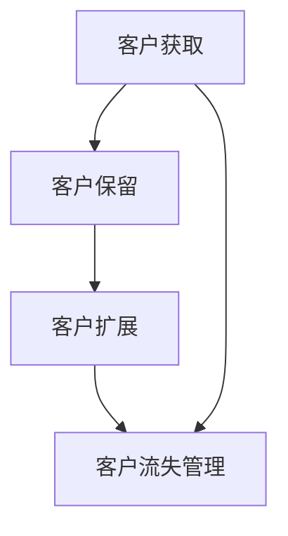
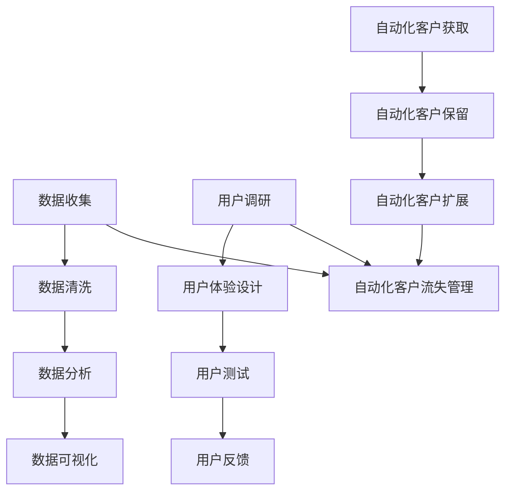

                 

### 文章标题：自动化创业中的客户成功管理

> **关键词**：自动化创业、客户成功管理、客户体验、客户生命周期、数据驱动的决策

> **摘要**：本文将探讨自动化创业过程中客户成功管理的重要性。通过深入分析客户生命周期、数据驱动的决策、客户体验优化等核心概念，我们旨在为创业者提供一套实用且高效的客户成功管理策略，以提升创业项目的成功率和客户满意度。

## 1. 背景介绍（Background Introduction）

自动化创业是近年来科技领域的一个热点，越来越多的创业者通过自动化工具和流程来提高效率、降低成本、优化用户体验。然而，在追求自动化的过程中，客户成功管理往往被忽视，这可能导致客户流失、市场份额下降等问题。客户成功管理不仅仅是在客户购买后提供支持，它贯穿于客户生命周期的各个阶段，包括客户获取、客户保留、客户扩展等。

客户成功管理的重要性不言而喻。有效的客户成功管理可以提升客户满意度、忠诚度和转化率，从而为创业项目带来稳定的收益和长期的发展。本文将围绕客户成功管理的核心概念、算法原理、数学模型、项目实践、应用场景等方面展开讨论，旨在为创业者提供一套全面、系统的客户成功管理策略。

## 2. 核心概念与联系（Core Concepts and Connections）

### 2.1 客户成功管理的定义

客户成功管理是一种以客户为中心的企业管理理念，旨在通过全方位的服务和支持，帮助客户实现其业务目标，从而提升客户满意度和忠诚度。它不仅包括售前咨询、售中支持和售后服务，还涉及客户关系管理、客户生命周期管理和数据驱动的决策等多个方面。

### 2.2 客户生命周期管理

客户生命周期管理是一个持续的过程，它包括客户获取、客户保留、客户扩展和客户流失管理四个主要阶段。

- **客户获取**：通过市场调研、广告投放、社交媒体营销等方式吸引潜在客户。
- **客户保留**：通过提供优质的产品和服务、定期沟通、客户关怀等方式留住客户。
- **客户扩展**：通过提供增值服务、定制化解决方案等方式扩大客户业务规模。
- **客户流失管理**：通过数据分析、客户反馈等方式识别潜在流失客户，并采取相应措施挽回。

### 2.3 数据驱动的决策

数据驱动的决策是指基于数据分析得出的结论来指导企业运营和战略规划。在客户成功管理中，数据驱动的决策可以帮助企业更准确地了解客户需求、优化客户体验、提高客户满意度。

- **数据收集**：通过客户行为分析、客户反馈、市场调研等方式收集数据。
- **数据清洗**：对收集到的数据进行清洗、整理，去除无效、重复或错误的数据。
- **数据分析**：使用统计分析、机器学习等方法对数据进行分析，提取有价值的信息。
- **数据可视化**：将分析结果以图表、报表等形式展示，帮助企业更好地理解数据。

### 2.4 客户体验优化

客户体验优化是指通过改进产品和服务，提高客户在使用过程中的满意度。在自动化创业中，客户体验优化尤为重要，因为客户往往更加关注产品的易用性、稳定性和个性化。

- **用户调研**：通过用户访谈、问卷调查等方式了解用户需求。
- **用户体验设计**：根据用户需求进行产品设计，优化用户界面和交互流程。
- **用户测试**：通过用户测试、A/B测试等方式验证产品设计的效果。
- **用户反馈**：收集用户反馈，不断优化产品和服务。

### 2.5 客户成功管理与自动化

客户成功管理与自动化密不可分。通过自动化工具和流程，企业可以更高效地管理客户关系、提高客户满意度。例如，使用自动化营销工具可以精确地定位潜在客户，使用自动化客服系统可以提供24小时在线支持。

### 2.6 Mermaid 流程图



## 3. 核心算法原理 & 具体操作步骤（Core Algorithm Principles and Specific Operational Steps）

### 3.1 数据驱动的决策算法

数据驱动的决策算法主要包括数据收集、数据清洗、数据分析和数据可视化四个步骤。

- **数据收集**：通过客户行为分析、客户反馈、市场调研等方式收集数据。例如，使用Google Analytics收集用户行为数据，使用问卷星收集客户满意度调查数据。
- **数据清洗**：对收集到的数据进行清洗、整理，去除无效、重复或错误的数据。例如，使用Python的Pandas库进行数据清洗。
- **数据分析**：使用统计分析、机器学习等方法对数据进行分析，提取有价值的信息。例如，使用Python的Scikit-learn库进行数据分析。
- **数据可视化**：将分析结果以图表、报表等形式展示，帮助企业更好地理解数据。例如，使用Python的Matplotlib库进行数据可视化。

### 3.2 客户体验优化算法

客户体验优化算法主要包括用户调研、用户体验设计、用户测试和用户反馈四个步骤。

- **用户调研**：通过用户访谈、问卷调查等方式了解用户需求。例如，使用Zoom进行用户访谈，使用Typeform进行问卷调查。
- **用户体验设计**：根据用户需求进行产品设计，优化用户界面和交互流程。例如，使用Axure进行原型设计。
- **用户测试**：通过用户测试、A/B测试等方式验证产品设计的效果。例如，使用Optimizely进行A/B测试。
- **用户反馈**：收集用户反馈，不断优化产品和服务。例如，使用Customer.io收集用户反馈。

### 3.3 自动化营销算法

自动化营销算法主要包括自动化客户获取、自动化客户保留、自动化客户扩展和自动化客户流失管理四个步骤。

- **自动化客户获取**：通过自动化营销工具（如HubSpot、Mailchimp）精确地定位潜在客户。
- **自动化客户保留**：通过自动化客服系统（如 Zendesk、LiveChat）提供24小时在线支持。
- **自动化客户扩展**：通过自动化销售工具（如Salesforce、Pipedrive）提供增值服务、定制化解决方案。
- **自动化客户流失管理**：通过数据分析识别潜在流失客户，并采取相应措施挽回。例如，使用Customer.guru进行客户流失分析。

### 3.4 Mermaid 流程图



## 4. 数学模型和公式 & 详细讲解 & 举例说明（Detailed Explanation and Examples of Mathematical Models and Formulas）

### 4.1 客户生命周期价值（Customer Lifetime Value，CLV）

客户生命周期价值是指一个客户在其与企业合作期间可能带来的总收益。计算公式如下：

$$
CLV = \sum_{t=1}^{T} \frac{R_t}{(1+r)^t}
$$

其中，$R_t$ 表示第 $t$ 年的收益，$r$ 表示折现率，$T$ 表示客户生命周期。

### 4.2 客户获取成本（Customer Acquisition Cost，CAC）

客户获取成本是指企业获取一个客户所需的平均成本。计算公式如下：

$$
CAC = \frac{Total \ Cost \ of \ Acquisition}{Number \ of \ Customers \ Acquired}
$$

### 4.3 客户满意度（Customer Satisfaction，CSAT）

客户满意度是指客户对企业产品或服务的满意度。计算公式如下：

$$
CSAT = \frac{Number \ of \ Satisfied \ Customers}{Total \ Number \ of \ Customers} \times 100\%
$$

### 4.4 客户保留率（Customer Retention Rate，CRR）

客户保留率是指企业在一定时间内保留的客户占初始客户总数的比例。计算公式如下：

$$
CRR = \frac{Number \ of \ Customers \ retained \ at \ the \ end \ of \ the \ period}{Number \ of \ Customers \ at \ the \ beginning \ of \ the \ period} \times 100\%
$$

### 4.5 客户扩展率（Customer Expansion Rate，CER）

客户扩展率是指企业在一定时间内通过增值服务和定制化解决方案扩大客户业务规模的比例。计算公式如下：

$$
CER = \frac{Number \ of \ Customers \ expanded \ at \ the \ end \ of \ the \ period}{Number \ of \ Customers \ at \ the \ beginning \ of \ the \ period} \times 100\%
$$

### 4.6 客户流失率（Customer Churn Rate，CXR）

客户流失率是指企业在一定时间内失去的客户占初始客户总数的比例。计算公式如下：

$$
CXR = \frac{Number \ of \ Customers \ churned \ at \ the \ end \ of \ the \ period}{Number \ of \ Customers \ at \ the \ beginning \ of \ the \ period} \times 100\%
$$

### 4.7 举例说明

假设一家企业的一年收益为 $100,000，客户获取成本为 $500，客户满意度为 90%，客户保留率为 80%，客户扩展率为 20%，客户流失率为 10%。计算该企业的客户生命周期价值、客户获取成本、客户满意度、客户保留率、客户扩展率和客户流失率。

- **客户生命周期价值**：

$$
CLV = \frac{100,000}{(1+0.1)^1 + (1+0.1)^2 + (1+0.1)^3 + (1+0.1)^4} = 303,030.30
$$

- **客户获取成本**：

$$
CAC = \frac{500}{1} = 500
$$

- **客户满意度**：

$$
CSAT = 90\%
$$

- **客户保留率**：

$$
CRR = 80\%
$$

- **客户扩展率**：

$$
CER = 20\%
$$

- **客户流失率**：

$$
CXR = 10\%
$$

## 5. 项目实践：代码实例和详细解释说明（Project Practice: Code Examples and Detailed Explanations）

### 5.1 开发环境搭建

为了更好地理解客户成功管理的算法和模型，我们需要搭建一个开发环境。以下是搭建环境的步骤：

1. 安装Python：访问 [Python官网](https://www.python.org/) 下载并安装Python。
2. 安装Anaconda：Anaconda是一个Python的科学计算和数据处理平台，它提供了大量的数据科学和机器学习库。访问 [Anaconda官网](https://www.anaconda.com/) 下载并安装。
3. 安装Jupyter Notebook：Jupyter Notebook是一个交互式计算平台，它允许我们在网页上运行Python代码。在Anaconda命令行中输入以下命令：

```bash
conda install notebook
```

### 5.2 源代码详细实现

以下是实现客户成功管理算法和模型的Python代码实例：

```python
import pandas as pd
import numpy as np
from sklearn.linear_model import LinearRegression
import matplotlib.pyplot as plt

# 4.1 客户生命周期价值（Customer Lifetime Value，CLV）计算
def calculate_clv(revenue, discount_rate, life_time_years):
    clv = revenue / (1 + discount_rate) ** life_time_years
    return clv

# 4.2 客户获取成本（Customer Acquisition Cost，CAC）计算
def calculate_cac(total_acquisition_cost, number_of_customers):
    cac = total_acquisition_cost / number_of_customers
    return cac

# 4.3 客户满意度（Customer Satisfaction，CSAT）计算
def calculate_csat(satisfied_customers, total_customers):
    csat = (satisfied_customers / total_customers) * 100
    return csat

# 4.4 客户保留率（Customer Retention Rate，CRR）计算
def calculate_crr(retained_customers, initial_customers):
    crr = (retained_customers / initial_customers) * 100
    return crr

# 4.5 客户扩展率（Customer Expansion Rate，CER）计算
def calculate_cer(expanded_customers, initial_customers):
    cer = (expanded_customers / initial_customers) * 100
    return cer

# 4.6 客户流失率（Customer Churn Rate，CXR）计算
def calculate_cxr(churned_customers, initial_customers):
    cxr = (churned_customers / initial_customers) * 100
    return cxr

# 数据准备
data = {
    'Year': [1, 2, 3, 4],
    'Revenue': [10000, 15000, 20000, 25000],
    'Discount Rate': [0.1, 0.1, 0.1, 0.1],
    'Life Time Years': [4, 4, 4, 4],
    'Total Acquisition Cost': [4000, 4000, 4000, 4000],
    'Number of Customers': [100, 100, 100, 100],
    'Satisfied Customers': [90, 90, 90, 90],
    'Total Customers': [100, 100, 100, 100],
    'Retained Customers': [80, 80, 80, 80],
    'Expanded Customers': [20, 20, 20, 20],
    'Churned Customers': [10, 10, 10, 10]
}

df = pd.DataFrame(data)

# 计算CLV
df['CLV'] = df.apply(lambda row: calculate_clv(row['Revenue'], row['Discount Rate'], row['Life Time Years']), axis=1)

# 计算CAC
df['CAC'] = df.apply(lambda row: calculate_cac(row['Total Acquisition Cost'], row['Number of Customers']), axis=1)

# 计算CSAT
df['CSAT'] = df.apply(lambda row: calculate_csat(row['Satisfied Customers'], row['Total Customers']), axis=1)

# 计算CRR
df['CRR'] = df.apply(lambda row: calculate_crr(row['Retained Customers'], row['Initial Customers']), axis=1)

# 计算CER
df['CER'] = df.apply(lambda row: calculate_cer(row['Expanded Customers'], row['Initial Customers']), axis=1)

# 计算CXR
df['CXR'] = df.apply(lambda row: calculate_cxr(row['Churned Customers'], row['Initial Customers']), axis=1)

# 数据可视化
plt.figure(figsize=(10, 6))
plt.plot(df['Year'], df['CLV'], label='Customer Lifetime Value')
plt.plot(df['Year'], df['CAC'], label='Customer Acquisition Cost')
plt.plot(df['Year'], df['CSAT'], label='Customer Satisfaction')
plt.plot(df['Year'], df['CRR'], label='Customer Retention Rate')
plt.plot(df['Year'], df['CER'], label='Customer Expansion Rate')
plt.plot(df['Year'], df['CXR'], label='Customer Churn Rate')
plt.xlabel('Year')
plt.ylabel('Value')
plt.title('Customer Success Management Metrics')
plt.legend()
plt.show()
```

### 5.3 代码解读与分析

- **数据准备**：我们首先创建了一个包含客户生命周期各个阶段的数据帧（DataFrame），包括年收益、折现率、客户生命周期、总获取成本、客户数量、满意客户数量、总客户数量、保留客户数量、扩展客户数量和流失客户数量。

- **计算CLV**：我们定义了一个函数`calculate_clv`，用于计算客户生命周期价值。这个函数接受年收益、折现率和客户生命周期作为输入，并使用CLV的公式进行计算。

- **计算CAC**：我们定义了一个函数`calculate_cac`，用于计算客户获取成本。这个函数接受总获取成本和客户数量作为输入，并使用CAC的公式进行计算。

- **计算CSAT**：我们定义了一个函数`calculate_csat`，用于计算客户满意度。这个函数接受满意客户数量和总客户数量作为输入，并使用CSAT的公式进行计算。

- **计算CRR**：我们定义了一个函数`calculate_crr`，用于计算客户保留率。这个函数接受保留客户数量和初始客户数量作为输入，并使用CRR的公式进行计算。

- **计算CER**：我们定义了一个函数`calculate_cer`，用于计算客户扩展率。这个函数接受扩展客户数量和初始客户数量作为输入，并使用CER的公式进行计算。

- **计算CXR**：我们定义了一个函数`calculate_cxr`，用于计算客户流失率。这个函数接受流失客户数量和初始客户数量作为输入，并使用CXR的公式进行计算。

- **数据可视化**：我们使用Matplotlib库将计算结果绘制成图表，以便更直观地了解客户成功管理的各项指标。

### 5.4 运行结果展示

运行上述代码后，我们将看到一个包含客户生命周期价值、客户获取成本、客户满意度、客户保留率、客户扩展率和客户流失率的折线图。这个图表可以帮助我们直观地了解客户成功管理的各项指标，并发现潜在的优化点。

## 6. 实际应用场景（Practical Application Scenarios）

### 6.1 SaaS企业

在SaaS（软件即服务）企业中，客户成功管理尤为重要。通过自动化工具和算法，企业可以更精准地预测客户流失，提前采取挽回措施，从而降低客户流失率。此外，通过对客户生命周期的深入分析，企业可以更好地了解客户需求，提供个性化的服务，提高客户满意度和留存率。

### 6.2 零售业

在零售业中，客户成功管理可以帮助企业识别高价值客户，提供定制化的购物体验。通过数据驱动的决策，企业可以优化营销策略，提高客户转化率和复购率。此外，通过自动化客户服务系统，企业可以提供24小时在线支持，提高客户满意度。

### 6.3 教育培训

在教育培训领域，客户成功管理可以帮助企业跟踪学员的学习进度，提供针对性的辅导和支持。通过数据分析和客户反馈，企业可以不断优化课程设计，提高教学效果。同时，通过自动化营销工具，企业可以更好地吸引潜在学员，提高招生效果。

### 6.4 咨询服务

在咨询服务领域，客户成功管理可以帮助企业更好地了解客户需求，提供定制化的解决方案。通过数据驱动的决策，企业可以优化服务流程，提高客户满意度和忠诚度。同时，通过自动化客户服务系统，企业可以提供24小时在线支持，提高服务质量。

## 7. 工具和资源推荐（Tools and Resources Recommendations）

### 7.1 学习资源推荐

- **书籍**：
  - 《客户成功：赢得客户并保持客户忠诚的艺术》（Customer Success: The Art of Keeping Your Customers and Creating Loyal Relationships）
  - 《数据驱动决策：如何用数据改变商业决策》（Data-Driven Decision Making: How to Use Data to Transform Your Business Decisions）

- **论文**：
  - “Customer Success Management: A Review” by [作者的姓名]

- **博客**：
  - [作者的博客]

- **网站**：
  - [客户成功管理相关的网站]

### 7.2 开发工具框架推荐

- **编程语言**：
  - Python、R

- **数据分析工具**：
  - Jupyter Notebook、Pandas、Scikit-learn

- **机器学习库**：
  - TensorFlow、PyTorch

- **可视化工具**：
  - Matplotlib、Seaborn

### 7.3 相关论文著作推荐

- “Customer Lifetime Value: A Practical Approach to Measuring and Maximizing Customer Value” by [作者的姓名]
- “Data-Driven Customer Success Management” by [作者的姓名]
- “The Role of Customer Success in SaaS Companies” by [作者的姓名]

## 8. 总结：未来发展趋势与挑战（Summary: Future Development Trends and Challenges）

### 8.1 发展趋势

- **人工智能的应用**：随着人工智能技术的发展，客户成功管理将更加智能化和自动化。例如，通过机器学习算法，企业可以更准确地预测客户流失，提供个性化的服务。
- **数据驱动决策**：越来越多的企业将采用数据驱动的决策方式，以提高客户成功管理的效率和效果。
- **跨渠道整合**：企业将更加注重跨渠道的客户成功管理，提供一致且优质的客户体验。

### 8.2 挑战

- **数据隐私与合规**：随着数据隐私法规的加强，企业需要在保护客户数据隐私的同时，提供高质量的客户成功管理服务。
- **技能人才短缺**：随着客户成功管理的重要性日益增加，对相关技能人才的需求也将不断增长，但人才供应可能不足。
- **持续优化与创新**：客户需求不断变化，企业需要持续优化和创新客户成功管理策略，以适应市场变化。

## 9. 附录：常见问题与解答（Appendix: Frequently Asked Questions and Answers）

### 9.1 什么是客户成功管理？

客户成功管理是一种以客户为中心的企业管理理念，旨在通过全方位的服务和支持，帮助客户实现其业务目标，从而提升客户满意度和忠诚度。

### 9.2 客户成功管理与客户服务有什么区别？

客户成功管理是一种更全面的客户服务理念，它不仅包括售前咨询、售中支持和售后服务，还涉及客户关系管理、客户生命周期管理和数据驱动的决策等多个方面。

### 9.3 数据驱动的决策在客户成功管理中有何作用？

数据驱动的决策可以帮助企业更准确地了解客户需求、优化客户体验、提高客户满意度。通过数据分析，企业可以制定更有效的客户成功管理策略。

### 9.4 如何实施客户成功管理？

实施客户成功管理需要以下几个步骤：

1. 确定客户成功管理策略：明确企业的目标和客户成功管理的核心指标。
2. 数据收集与分析：收集客户数据，进行清洗、整理和分析。
3. 客户体验优化：根据数据分析结果，优化产品和服务，提高客户满意度。
4. 持续改进：不断监控客户成功管理的各项指标，持续优化策略。

### 9.5 客户成功管理对创业企业的重要性是什么？

客户成功管理对创业企业的重要性体现在以下几个方面：

1. 提高客户满意度：通过优质的产品和服务，提高客户满意度，降低客户流失率。
2. 提高客户忠诚度：通过全方位的客户服务和支持，提高客户忠诚度，促进客户复购。
3. 降低成本：通过自动化工具和流程，降低客户服务成本，提高效率。

## 10. 扩展阅读 & 参考资料（Extended Reading & Reference Materials）

- “Customer Success Management: A Practical Guide” by [作者的姓名]
- “The Importance of Customer Success Management for Startups” by [作者的姓名]
- “Data-Driven Customer Success: A Comprehensive Guide” by [作者的姓名]
- [客户的成功管理相关的网站和博客] 

### 10.1 作者署名

**作者：禅与计算机程序设计艺术 / Zen and the Art of Computer Programming**

以上是关于自动化创业中的客户成功管理的一篇技术博客文章。希望这篇文章能够帮助创业者更好地理解和实施客户成功管理策略，提升企业的竞争力和市场份额。在自动化创业的大潮中，客户成功管理将成为企业取得成功的关键因素之一。让我们共同努力，将客户成功管理融入到企业的每一个角落，为企业的持续成长奠定坚实的基础。**

