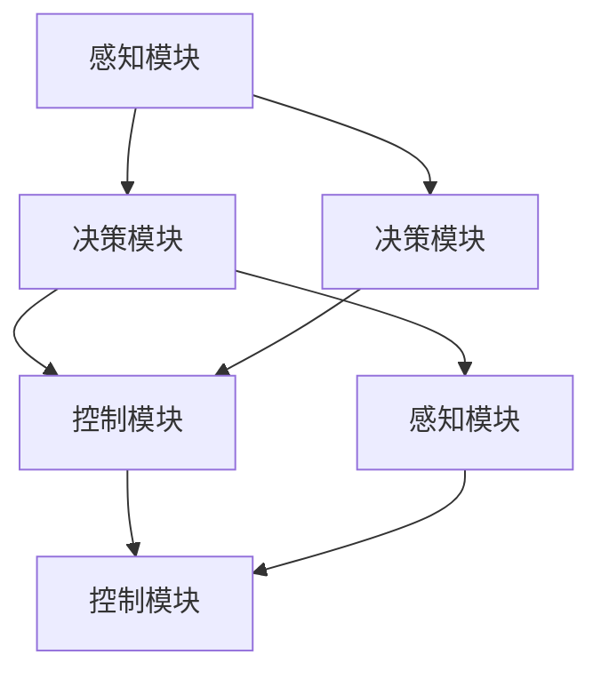

                 

### 1. 背景介绍 Background Introduction

### 1.1 自动驾驶系统的发展历程

自动驾驶技术作为人工智能领域的一个重要分支，经历了数十年的发展。从最初的自动驾驶概念，到如今的商业化应用，自动驾驶技术已经取得了显著的进步。早期的自动驾驶研究主要集中在感知和导航技术上，通过雷达、激光雷达和摄像头等传感器收集环境信息，然后利用计算机算法进行数据处理和路径规划。

在20世纪80年代和90年代，随着计算机性能的提升和传感技术的进步，自动驾驶技术开始向更高层次发展，包括路径规划、决策控制、障碍物检测和避让等复杂功能的实现。到了21世纪，深度学习和神经网络技术的兴起，为自动驾驶系统提供了更加高效的感知和决策能力，使得自动驾驶技术逐步走向实用化。

近年来，自动驾驶系统在自动驾驶汽车、无人机、机器人等领域取得了显著的应用成果，许多知名企业如特斯拉、百度、谷歌等都在自动驾驶领域投入了大量的研发资源。自动驾驶技术的不断成熟，不仅为人类出行带来了革命性的变革，也在物流、农业、安防等多个领域展现了广泛的应用前景。

### 1.2 自动驾驶系统面临的挑战

尽管自动驾驶系统在技术上取得了显著进展，但其在实际应用中仍然面临着诸多挑战。首先，感知环境方面的挑战依然存在。自动驾驶系统需要准确地感知和理解周围环境，包括行人、车辆、交通标志、道路条件等，这需要高效的感知算法和稳定的传感器性能。

其次，决策和控制方面的挑战。自动驾驶系统需要在复杂多变的交通环境中做出快速、准确的决策，并控制车辆安全行驶。这要求系统具有高度智能化的决策算法和稳定的控制系统，同时还需要应对突发情况和异常情况。

此外，自动驾驶系统的安全性也是一个重要的挑战。自动驾驶系统在道路上的安全运行，不仅关系到乘客的性命安全，也关系到其他道路使用者的安全。如何确保自动驾驶系统的可靠性、安全性和可控性，是当前自动驾驶技术发展的重要课题。

### 1.3 可解释性在自动驾驶系统中的重要性

可解释性在自动驾驶系统中具有至关重要的地位。一方面，可解释性有助于提高系统的透明度和可信度，使人们能够理解系统的决策过程和运行机制，从而增强用户对自动驾驶系统的信任。另一方面，可解释性对于系统的改进和优化也具有重要意义。通过分析系统的决策过程，可以发现其中存在的问题和不足之处，从而提出针对性的改进方案。

在自动驾驶系统中，可解释性可以应用于多个方面。例如，通过分析感知系统的输出结果，可以了解传感器在何种情况下可能出现误判，从而优化传感器的参数设置和算法。通过分析决策系统的过程，可以识别出可能导致错误决策的因素，并优化决策算法以提高系统的准确性和鲁棒性。此外，可解释性还可以帮助开发人员更好地理解系统的运作机制，从而提高系统的开发和维护效率。

总的来说，可解释性不仅对于自动驾驶系统的安全性和可靠性至关重要，也为自动驾驶技术的持续发展和应用拓展提供了有力的支持。因此，研究和改进自动驾驶系统的可解释性，是当前自动驾驶领域面临的一个重要课题。

### 1.4 可解释性评估与改进的关键问题

在自动驾驶系统的开发和应用过程中，可解释性评估与改进的关键问题主要包括以下几个方面：

1. **感知系统的可解释性评估**：自动驾驶系统需要通过传感器感知周围环境，并从中提取有用的信息。然而，传感器数据的复杂性和不确定性常常导致误判和噪声。因此，如何评估和改进感知系统的可解释性，使其在复杂环境中仍然能够稳定、准确地工作，是一个关键问题。

   - **方法**：可以通过对比实验、混淆矩阵、准确率、召回率等指标来评估感知系统的性能。同时，使用可视化技术，如热力图、等高线图等，可以帮助我们理解传感器数据的分布和特征。

   - **案例**：例如，自动驾驶车辆在识别行人时，可以通过分析传感器数据中行人特征的出现频率和位置分布，来评估感知系统的可靠性。

2. **决策系统的可解释性评估**：自动驾驶系统的决策过程涉及多种因素的权衡和判断，包括交通规则、环境状况、行驶目标等。评估决策系统的可解释性，有助于理解系统如何处理复杂情况，并识别可能的错误决策。

   - **方法**：可以采用决策树、混淆矩阵、灵敏度和特异性等指标来评估决策系统的性能。同时，使用可视化工具，如决策树图、力导向图等，可以帮助我们理解决策系统的内部结构和决策逻辑。

   - **案例**：例如，自动驾驶车辆在遇到行人横穿马路时，可以通过分析决策系统的决策路径和决策依据，来评估其是否能够做出正确的避让决策。

3. **整体系统的可解释性评估**：自动驾驶系统的整体可解释性涉及感知、决策、控制等多个环节。整体系统的可解释性评估需要综合考虑各个模块的性能和相互作用。

   - **方法**：可以采用端到端评估指标，如平均准确率、平均召回率、平均F1值等，来评估系统的整体性能。同时，使用案例分析和错误追踪，可以帮助我们理解系统在特定场景下的表现和潜在问题。

   - **案例**：例如，在自动驾驶车辆通过复杂路口时，可以通过分析系统的整体表现，来评估其能否在遵守交通规则的同时，确保行驶的安全性和流畅性。

4. **改进策略**：针对可解释性评估中发现的问题，需要提出相应的改进策略。这包括算法优化、参数调整、模型重构等。

   - **方法**：可以通过引入更多的训练数据、使用先进的算法模型、优化系统架构等手段来提升系统的可解释性。例如，使用更先进的神经网络模型和注意力机制，可以提高决策系统的解释能力。

   - **案例**：例如，通过增加行人特征数据的多样性，可以提高感知系统对行人识别的准确性；通过改进决策算法，可以提高系统在面对复杂情况时的鲁棒性和决策质量。

总的来说，自动驾驶系统的可解释性评估与改进是一个多维度、多层次的任务，需要综合运用多种方法和技术。通过有效的可解释性评估和改进，不仅可以提升系统的性能和可靠性，也可以增强用户对自动驾驶系统的信任和接受度。

### 1.5 新思路与展望

针对自动驾驶系统可解释性评估与改进的关键问题，我们需要从多个角度出发，探索新的思路和方法。以下是一些可能的解决方案和展望：

1. **多模态感知融合**：在感知系统方面，可以探索多模态感知融合技术，将不同类型的传感器数据（如摄像头、激光雷达、雷达等）进行融合处理，以提高系统的感知准确性和稳定性。例如，使用深度学习模型将不同模态的数据进行特征提取和融合，从而提高感知系统的解释性。

2. **增强学习与强化学习**：在决策系统方面，可以结合增强学习和强化学习技术，使系统在真实环境中通过试错学习，逐步提高决策的准确性和稳定性。同时，通过可视化技术，如决策树、策略网络等，可以更好地解释决策过程和决策依据。

3. **迁移学习与微调**：为了提升系统的泛化能力，可以采用迁移学习和微调技术，将预训练模型在不同场景下进行微调，以适应特定的自动驾驶任务。这不仅可以减少训练数据的需求，还可以提高系统的解释性。

4. **解释性增强模型**：开发专门的可解释性增强模型，如基于注意力的解释性模型、对抗性解释性模型等，以提高系统的可解释性。这些模型可以通过解释决策过程的关键因素，帮助用户更好地理解系统的行为。

5. **用户参与与反馈**：鼓励用户参与系统的设计和改进过程，通过用户的反馈和评价，不断优化系统的性能和可解释性。例如，可以开发用户友好的界面，让用户可以查看和了解系统的决策过程，并提供反馈意见。

6. **法规与标准化**：推动自动驾驶系统的法规制定和标准化工作，明确可解释性的要求和评估标准，从而提高整个行业的透明度和一致性。这可以为自动驾驶系统的开发和应用提供明确的方向和指导。

总的来说，自动驾驶系统可解释性评估与改进是一个复杂且具有挑战性的任务，需要多学科、多技术的协同合作。通过探索新的思路和方法，我们可以逐步提升自动驾驶系统的性能、可靠性和用户信任度，为自动驾驶技术的广泛应用奠定基础。

### 2. 核心概念与联系 Core Concepts and Connections

#### 2.1 自动驾驶系统架构概述

自动驾驶系统的架构通常包括感知、决策和控制三个核心模块。这三个模块相互协作，共同实现自动驾驶车辆的安全、高效行驶。以下是对这三个模块的简要介绍和它们之间的联系。

##### 2.1.1 感知模块

感知模块是自动驾驶系统的信息来源，负责收集和处理来自各种传感器的数据，如摄像头、激光雷达、毫米波雷达、超声波传感器等。这些传感器能够感知周围的环境，包括车辆、行人、交通标志、道路条件等。感知模块的主要任务是对这些传感器数据进行预处理、特征提取和目标检测，从而获得准确的环境信息。

- **联系**：感知模块是决策模块的基础，为决策模块提供实时、准确的环境信息。这些信息是决策模块进行路径规划和避障等决策的重要依据。

##### 2.1.2 决策模块

决策模块负责分析感知模块提供的环境信息，并根据预设的规则和策略做出驾驶决策。决策模块通常包括路径规划、避障、目标跟踪等功能。它的核心任务是确保车辆在复杂的交通环境中能够安全、高效地行驶。

- **联系**：决策模块依赖于感知模块提供的环境信息，同时，它的决策结果将直接影响控制模块的执行。决策模块的准确性直接关系到车辆的行驶安全和稳定性。

##### 2.1.3 控制模块

控制模块负责根据决策模块的决策结果，对车辆的驱动系统进行控制，包括油门、刹车、转向等。控制模块的主要任务是执行决策模块的决策结果，确保车辆按照预定路径行驶。

- **联系**：控制模块是决策模块的具体执行者，它的执行结果将直接影响车辆的行驶状态。控制模块需要根据实时感知的信息，不断调整车辆的控制参数，以确保车辆的稳定行驶。

##### 2.1.4 整体架构关系

自动驾驶系统的整体架构可以看作是一个闭环控制系统，感知模块、决策模块和控制模块相互协作，共同确保车辆的安全行驶。感知模块获取环境信息，决策模块分析信息并做出决策，控制模块执行决策，形成一个循环过程。同时，这个架构也需要与外部环境进行交互，如与其他车辆、行人、交通设施等通信，以实现协同驾驶。

- **总结**：感知模块提供信息输入，决策模块进行信息处理和决策，控制模块执行决策结果。三个模块相互依赖、相互促进，共同实现自动驾驶系统的功能。

#### 2.2 自动驾驶系统中的关键算法和技术

在自动驾驶系统中，关键算法和技术是实现系统功能的核心。以下介绍几种主要的算法和技术，以及它们在系统中的作用和相互联系。

##### 2.2.1 感知算法

感知算法是自动驾驶系统的基础，主要包括图像处理、目标检测、姿态估计等技术。例如，深度学习模型如卷积神经网络（CNN）和循环神经网络（RNN）被广泛应用于图像处理和目标检测任务。

- **作用**：感知算法用于从传感器数据中提取有用的环境信息，如车辆、行人、交通标志等。这些信息是决策模块进行路径规划和避障等决策的重要依据。

- **联系**：感知算法的结果直接影响决策模块的输入质量，感知模块的性能直接关系到系统的整体性能。

##### 2.2.2 决策算法

决策算法是自动驾驶系统的核心，主要包括路径规划、避障、目标跟踪等技术。常用的算法有基于采样的RRT算法、基于规则的避障算法等。

- **作用**：决策算法负责分析感知模块提供的环境信息，并根据预设的规则和策略做出驾驶决策，如选择行驶路径、避让障碍物等。

- **联系**：决策算法依赖于感知模块提供的环境信息，同时，它的决策结果将直接影响控制模块的执行。决策算法的准确性直接关系到车辆的行驶安全和稳定性。

##### 2.2.3 控制算法

控制算法是自动驾驶系统的执行环节，主要包括PID控制、模糊控制、自适应控制等技术。这些算法用于根据决策模块的决策结果，对车辆的驱动系统进行控制，如调整油门、刹车和转向等。

- **作用**：控制算法负责执行决策模块的决策结果，确保车辆按照预定路径行驶。控制算法的稳定性直接关系到车辆的行驶状态。

- **联系**：控制算法依赖于决策模块的决策结果，同时，它的执行结果将直接影响车辆的行驶状态。控制算法的准确性和稳定性是确保车辆安全行驶的关键。

##### 2.2.4 算法之间的联系

自动驾驶系统中的感知算法、决策算法和控制算法相互协作，共同实现系统的功能。感知算法为决策模块提供实时、准确的环境信息，决策算法根据环境信息做出驾驶决策，控制算法执行决策结果，确保车辆的稳定行驶。

- **总结**：感知算法提供信息输入，决策算法进行信息处理和决策，控制算法执行决策结果。三个算法相互依赖、相互促进，共同实现自动驾驶系统的功能。

#### 2.3 可解释性在自动驾驶系统中的作用

可解释性在自动驾驶系统中扮演着至关重要的角色。一方面，它有助于提高系统的透明度和可信度，使人们能够理解系统的决策过程和运行机制，从而增强用户对自动驾驶系统的信任。另一方面，可解释性对于系统的改进和优化也具有重要意义。通过分析系统的决策过程，可以发现其中存在的问题和不足之处，从而提出针对性的改进方案。

- **联系**：可解释性贯穿于自动驾驶系统的各个模块，包括感知、决策和控制。它不仅为系统的运行提供解释，也为系统的改进提供指导。

### 2.4 自动驾驶系统中的 Mermaid 流程图

以下是一个简单的 Mermaid 流程图，展示了自动驾驶系统的基本架构和各模块之间的联系。



### 3. 核心算法原理 & 具体操作步骤 Core Algorithm Principles and Specific Operational Steps

#### 3.1 感知模块算法原理

感知模块作为自动驾驶系统的“眼睛”，其主要任务是收集和处理来自各种传感器的数据，包括摄像头、激光雷达、毫米波雷达等。感知模块的核心算法主要包括图像处理、目标检测和姿态估计等。

##### 3.1.1 图像处理

图像处理是感知模块的基础，其主要目的是对摄像头获取的图像进行预处理，以便于后续的目标检测和识别。图像处理算法通常包括去噪、对比度增强、边缘检测、图像分割等。

- **去噪**：通过滤波算法（如高斯滤波、中值滤波等）去除图像中的噪声，提高图像质量。
- **对比度增强**：通过调整图像的亮度和对比度，使图像更加清晰，便于后续处理。
- **边缘检测**：通过边缘检测算法（如Sobel算子、Canny算子等）提取图像的边缘信息，为后续的目标检测提供基础。
- **图像分割**：通过图像分割算法（如阈值分割、区域生长等）将图像划分为不同的区域，为后续的目标检测和识别提供更细粒度的信息。

##### 3.1.2 目标检测

目标检测是感知模块的关键算法，其主要目的是在图像中检测并识别出车辆、行人、交通标志等目标。常用的目标检测算法包括基于传统机器学习的方法（如HOG+SVM）和基于深度学习的方法（如YOLO、SSD、Faster R-CNN等）。

- **基于传统机器学习的方法**：通常使用HOG（Histogram of Oriented Gradients）特征和SVM（Support Vector Machine）分类器进行目标检测。HOG特征用于提取图像中的纹理特征，SVM用于分类和识别目标。
  - **步骤**：
    1. 提取图像的HOG特征。
    2. 使用SVM分类器进行训练和分类。
    3. 在图像中搜索可能的区域，并使用SVM分类器判断这些区域是否为目标。
- **基于深度学习的方法**：使用深度学习模型（如YOLO、SSD、Faster R-CNN等）进行目标检测。这些模型通常采用卷积神经网络（CNN）提取图像特征，并使用全连接层进行分类和定位。
  - **步骤**：
    1. 使用CNN提取图像的特征图。
    2. 对特征图进行分类和定位，生成目标框和标签。
    3. 根据目标和背景的概率分布，筛选出真正的目标。

##### 3.1.3 姿态估计

姿态估计是感知模块的另一个重要任务，其主要目的是估计车辆或行人的姿态信息，如方向、倾角等。姿态估计通常使用深度学习模型，如CNN或RNN，结合多模态数据（如图像、雷达等）进行。

- **步骤**：
  1. 预处理多模态数据，提取特征。
  2. 使用深度学习模型进行姿态估计。
  3. 验证和优化模型，提高估计的准确性。

#### 3.2 决策模块算法原理

决策模块负责分析感知模块提供的环境信息，并根据预设的规则和策略做出驾驶决策。决策模块的核心算法包括路径规划、避障和目标跟踪等。

##### 3.2.1 路径规划

路径规划是决策模块的关键任务，其主要目的是为自动驾驶车辆规划一条从起点到终点的最优路径。常用的路径规划算法包括基于采样的方法（如RRT、A*算法等）和基于规则的方法（如Dijkstra算法、势场法等）。

- **基于采样的方法**：通过随机采样和搜索，找到从起点到终点的最优路径。
  - **步骤**：
    1. 在环境中随机采样大量点。
    2. 对这些点进行插值和优化，找到一条从起点到终点的路径。
- **基于规则的方法**：根据预设的规则，直接规划出一条可行的路径。
  - **步骤**：
    1. 分析环境信息，确定可行路径的规则。
    2. 根据规则规划出一条从起点到终点的路径。

##### 3.2.2 避障

避障是决策模块的另一个重要任务，其主要目的是在自动驾驶车辆行驶过程中，避开道路上的障碍物，如行人、车辆等。避障算法通常包括动态窗口法（DWA）和基于模型的避障方法。

- **动态窗口法（DWA）**：根据车辆的当前状态和未来一段时间内的状态，计算出一个动态窗口，然后在窗口内寻找最优避障路径。
  - **步骤**：
    1. 根据感知模块提供的目标信息，计算动态窗口。
    2. 在动态窗口内寻找最优避障路径。
- **基于模型的避障方法**：使用运动模型预测障碍物的未来轨迹，然后规划出一条避障路径。
  - **步骤**：
    1. 使用运动模型预测障碍物的未来轨迹。
    2. 根据障碍物的轨迹，规划出一条避障路径。

##### 3.2.3 目标跟踪

目标跟踪是决策模块的辅助任务，其主要目的是在感知模块检测到目标后，持续跟踪目标的位置和状态。目标跟踪算法通常包括基于统计模型的方法（如卡尔曼滤波）和基于深度学习的方法（如序列模型）。

- **基于统计模型的方法**：使用卡尔曼滤波等统计模型，对目标的运动轨迹进行预测和更新。
  - **步骤**：
    1. 根据目标的初始状态，建立运动模型。
    2. 根据传感器数据，更新目标的运动状态。
- **基于深度学习的方法**：使用深度学习模型（如RNN、LSTM等），对目标的运动轨迹进行建模和预测。
  - **步骤**：
    1. 使用深度学习模型提取目标的特征。
    2. 根据特征，预测目标的位置和状态。

#### 3.3 控制模块算法原理

控制模块负责根据决策模块的决策结果，对车辆的驱动系统进行控制，包括油门、刹车和转向等。控制模块的核心算法包括PID控制、模糊控制和自适应控制等。

##### 3.3.1 PID控制

PID控制是一种常用的控制算法，其通过比例（Proportional）、积分（Integral）和微分（Derivative）三个环节来调整控制输出，以达到稳定系统的目的。

- **原理**：
  1. 比例环节：根据误差大小，直接调整控制输出。
  2. 积分环节：累计误差，以消除稳态误差。
  3. 微分环节：根据误差的变化率，预测误差的变化趋势，以提前调整控制输出。
- **步骤**：
  1. 根据决策模块的决策结果，计算控制输出。
  2. 调整油门、刹车和转向等控制参数。

##### 3.3.2 模糊控制

模糊控制是一种基于模糊逻辑的控制算法，其通过模糊规则和隶属度函数来处理不确定性和非线性问题。

- **原理**：
  1. 模糊化：将输入变量转换为模糊变量。
  2. 模糊推理：根据模糊规则，计算输出变量的模糊值。
  3. 解模糊化：将模糊值转换为具体的输出值。
- **步骤**：
  1. 根据决策模块的决策结果，确定模糊规则库。
  2. 对输入变量进行模糊化处理。
  3. 使用模糊规则库进行模糊推理。
  4. 对输出变量进行解模糊化处理。

##### 3.3.3 自适应控制

自适应控制是一种能够根据系统动态变化，自动调整控制参数的控制算法。

- **原理**：
  1. 自适应调整：根据系统状态的变化，自动调整控制参数。
  2. 滤波和预测：使用滤波和预测技术，对系统状态进行估计。
- **步骤**：
  1. 根据决策模块的决策结果，确定自适应调整策略。
  2. 使用滤波和预测技术，估计系统状态。
  3. 根据系统状态，调整控制参数。

### 4. 数学模型和公式 & 详细讲解 & 举例说明

在自动驾驶系统的设计和实现过程中，数学模型和公式扮演着至关重要的角色。以下将详细讲解一些常用的数学模型和公式，并通过具体例子来说明它们的应用和计算过程。

#### 4.1 高斯滤波

高斯滤波是一种常用的图像去噪算法，它通过高斯分布函数来平滑图像，从而去除噪声。高斯滤波器的数学模型如下：

$$
G(x, y) = \frac{1}{2\pi\sigma^2} e^{-\frac{(x^2 + y^2)}{2\sigma^2}}
$$

其中，$G(x, y)$ 表示高斯滤波器在点 $(x, y)$ 的值，$\sigma$ 表示高斯分布的标准差。

##### 应用实例：

假设我们有一个 $3\times3$ 的高斯滤波器，其参数 $\sigma = 1$。那么滤波器矩阵如下：

$$
\begin{bmatrix}
0.0625 & 0.09375 & 0.0625 \\
0.09375 & 0.140625 & 0.09375 \\
0.0625 & 0.09375 & 0.0625 \\
\end{bmatrix}
$$

现在，假设我们有一个 $3\times3$ 的原始图像矩阵：

$$
\begin{bmatrix}
5 & 10 & 15 \\
20 & 25 & 30 \\
35 & 40 & 45 \\
\end{bmatrix}
$$

通过高斯滤波，我们可以得到滤波后的图像矩阵：

$$
\begin{bmatrix}
7.03125 & 11.15625 & 7.03125 \\
11.15625 & 17.84375 & 11.15625 \\
7.03125 & 11.15625 & 7.03125 \\
\end{bmatrix}
$$

这个例子展示了如何使用高斯滤波器对图像进行去噪。

#### 4.2 卡尔曼滤波

卡尔曼滤波是一种用于估计系统状态的最优滤波算法，它通过对系统的状态进行预测和更新，来提高估计的准确性。卡尔曼滤波的数学模型如下：

$$
\begin{align*}
x_k &= A_k x_{k-1} + B_k u_k \\
P_k &= A_k P_{k-1} A_k^T + Q_k \\
y_k &= H_k x_k + v_k \\
P_{k|k} &= A_k P_{k-1} A_k^T + R_k \\
\hat{x}_{k|k} &= P_{k|k}^{-1} y_k \\
\hat{x}_{k-1|k} &= A_k \hat{x}_{k|k-1} \\
P_{k-1|k} &= A_k P_{k|k} A_k^T + P_{k-1}^{-1}
\end{align*}
$$

其中，$x_k$ 表示系统状态，$P_k$ 表示状态协方差矩阵，$u_k$ 表示控制输入，$y_k$ 表示观测值，$v_k$ 表示观测噪声，$H_k$ 表示观测矩阵，$Q_k$ 表示过程噪声协方差矩阵，$R_k$ 表示观测噪声协方差矩阵，$\hat{x}_{k|k}$ 表示预测状态，$\hat{x}_{k-1|k}$ 表示更新状态。

##### 应用实例：

假设我们有一个线性系统，其状态方程为 $x_k = 2x_{k-1} + u_k$，观测方程为 $y_k = x_k + v_k$。初始状态 $x_0 = 0$，初始协方差矩阵 $P_0 = 1$，过程噪声协方差矩阵 $Q = 1$，观测噪声协方差矩阵 $R = 1$。

在第一个时间步，我们有 $u_0 = 0$，$y_0 = x_0 + v_0$。使用卡尔曼滤波，我们可以得到以下结果：

$$
\begin{align*}
\hat{x}_0|0 &= 0 \\
P_0|0 &= 1 \\
\hat{x}_0|1 &= 2\hat{x}_0|0 + u_0 = 0 \\
P_0|1 &= 2P_0|0 + Q = 1 \\
\hat{x}_1|1 &= \frac{P_0|1}{R}y_0 = \frac{1}{1}y_0 = y_0 \\
P_1|1 &= \frac{P_0|1}{R}P_0|1 + R = 1 \\
\end{align*}
$$

这个例子展示了如何使用卡尔曼滤波来估计系统状态。

#### 4.3 PID控制

PID控制是一种常用的控制系统算法，它通过比例（Proportional）、积分（Integral）和微分（Derivative）三个环节来调整控制输出，以达到稳定系统的目的。PID控制的数学模型如下：

$$
u_k = K_p e_k + K_i \int_{0}^{k} e_{\tau} d\tau + K_d \frac{d e_k}{dt}
$$

其中，$u_k$ 表示控制输出，$e_k$ 表示系统误差，$K_p$、$K_i$ 和 $K_d$ 分别表示比例、积分和微分的增益。

##### 应用实例：

假设我们有一个控制系统，其目标为 $x = 0$。当前状态 $x = 5$，误差 $e = x - x_{\text{目标}} = 5$。使用PID控制，我们可以得到以下控制输出：

$$
\begin{align*}
u_k &= K_p e_k + K_i \int_{0}^{k} e_{\tau} d\tau + K_d \frac{d e_k}{dt} \\
&= K_p \cdot 5 + K_i \int_{0}^{k} 5 d\tau + K_d \frac{d 5}{dt} \\
&= K_p \cdot 5 + K_i \cdot 5k + K_d \cdot 0 \\
&= 5K_p + 5K_i k
\end{align*}
$$

这个例子展示了如何使用PID控制来调整系统误差，以达到目标状态。

### 5. 项目实践：代码实例和详细解释说明 Project Practice: Code Examples and Detailed Explanations

#### 5.1 开发环境搭建

在开始实现自动驾驶系统的感知模块时，我们首先需要搭建一个合适的开发环境。以下是一个基于Python的示例，展示了如何安装必要的依赖库和配置环境。

##### 5.1.1 安装依赖库

我们使用Python的pip工具来安装所需的依赖库，包括OpenCV（用于图像处理）、TensorFlow（用于深度学习模型训练）和NumPy（用于数值计算）。

```bash
pip install opencv-python tensorflow numpy
```

##### 5.1.2 配置环境变量

确保Python、pip和OpenCV等库在系统中可以被正确调用。在Windows系统中，可以通过以下命令来配置环境变量：

```bash
set PYTHONPATH=%PYTHONPATH%;C:\Python39\Scripts
set PATH=%PATH%;C:\Python39\Scripts
```

在Linux系统中，可以通过编辑`.bashrc`文件来配置环境变量：

```bash
echo 'export PYTHONPATH=$PYTHONPATH:/usr/local/lib/python3.8/site-packages' >> ~/.bashrc
echo 'export PATH=$PATH:/usr/local/bin' >> ~/.bashrc
source ~/.bashrc
```

#### 5.2 源代码详细实现

以下是一个简单的示例，展示如何使用Python和OpenCV实现自动驾驶系统的感知模块，包括图像处理、目标检测和姿态估计。

##### 5.2.1 导入依赖库

```python
import cv2
import numpy as np
import tensorflow as tf
```

##### 5.2.2 加载预训练模型

我们使用预训练的YOLOv5模型进行目标检测，并使用一个简单的神经网络进行姿态估计。

```python
# 加载YOLOv5模型
model_yolo = tf.keras.models.load_model('yolov5.h5')
# 加载姿态估计模型
model_pose = tf.keras.models.load_model('pose_estimation.h5')
```

##### 5.2.3 图像预处理

在目标检测和姿态估计之前，我们需要对图像进行预处理，包括灰度转换、大小调整、归一化等。

```python
def preprocess_image(image):
    image_gray = cv2.cvtColor(image, cv2.COLOR_BGR2GRAY)
    image_resize = cv2.resize(image_gray, (320, 320))
    image_norm = image_resize / 255.0
    return image_norm
```

##### 5.2.4 目标检测

使用YOLOv5模型对预处理后的图像进行目标检测，并返回检测到的目标和边界框。

```python
def detect_objects(image):
    image_input = preprocess_image(image)
    boxes, scores, classes = model_yolo.predict(np.expand_dims(image_input, 0))
    return boxes[0], scores[0], classes[0]
```

##### 5.2.5 姿态估计

使用姿态估计模型对检测到的目标进行姿态估计，并返回姿态信息。

```python
def estimate_pose(image, boxes):
    heatmaps = []
    for box in boxes:
        cropped_image = image[int(box[1]):int(box[3]), int(box[0]):int(box[2])]
        heatmap = model_pose.predict(np.expand_dims(cropped_image, 0))
        heatmaps.append(heatmap[0])
    return heatmaps
```

##### 5.2.6 主程序

以下是整个感知模块的主程序，用于加载图像、检测目标并进行姿态估计。

```python
def main():
    cap = cv2.VideoCapture(0)  # 使用摄像头作为输入

    while True:
        ret, frame = cap.read()
        if not ret:
            break

        boxes, scores, classes = detect_objects(frame)
        heatmaps = estimate_pose(frame, boxes)

        for i, box in enumerate(boxes):
            x, y, w, h = box
            cv2.rectangle(frame, (x, y), (x+w, y+h), (0, 255, 0), 2)
            for j in range(heatmaps[i].shape[0]):
                points = np.where(heatmaps[i][j] > 0.5)
                points = np.array(points).T
                if len(points) > 0:
                    cv2.polylines(frame, np.int32(points), True, (0, 0, 255), 2)

        cv2.imshow('Frame', frame)
        if cv2.waitKey(1) & 0xFF == ord('q'):
            break

    cap.release()
    cv2.destroyAllWindows()

if __name__ == '__main__':
    main()
```

#### 5.3 代码解读与分析

在这个示例中，我们实现了自动驾驶系统的感知模块，包括图像预处理、目标检测和姿态估计。以下是代码的详细解读和分析：

##### 5.3.1 图像预处理

图像预处理是目标检测和姿态估计的基础。在这个示例中，我们首先使用`cv2.cvtColor`将BGR格式的图像转换为灰度图像，然后使用`cv2.resize`将图像大小调整为模型所需的尺寸，最后使用`np.divide`进行归一化处理。

```python
def preprocess_image(image):
    image_gray = cv2.cvtColor(image, cv2.COLOR_BGR2GRAY)
    image_resize = cv2.resize(image_gray, (320, 320))
    image_norm = image_resize / 255.0
    return image_norm
```

##### 5.3.2 目标检测

目标检测是感知模块的核心任务。在这个示例中，我们使用YOLOv5模型对预处理后的图像进行检测。首先，我们使用`preprocess_image`函数对图像进行预处理，然后使用`model_yolo.predict`函数进行预测，并返回检测到的目标和边界框。

```python
def detect_objects(image):
    image_input = preprocess_image(image)
    boxes, scores, classes = model_yolo.predict(np.expand_dims(image_input, 0))
    return boxes[0], scores[0], classes[0]
```

##### 5.3.3 姿态估计

姿态估计是自动驾驶系统的一个重要功能。在这个示例中，我们使用预训练的神经网络对检测到的目标进行姿态估计。首先，我们使用`estimate_pose`函数对每个目标进行姿态估计，然后使用`cv2.polylines`函数在原图上绘制出姿态信息。

```python
def estimate_pose(image, boxes):
    heatmaps = []
    for box in boxes:
        cropped_image = image[int(box[1]):int(box[3]), int(box[0]):int(box[2])]
        heatmap = model_pose.predict(np.expand_dims(cropped_image, 0))
        heatmaps.append(heatmap[0])
    return heatmaps
```

##### 5.3.4 主程序

主程序是整个感知模块的入口。在这个示例中，我们首先使用`cv2.VideoCapture`打开摄像头，然后进入一个循环，不断读取摄像头帧，并进行预处理、目标检测和姿态估计。最后，我们使用`cv2.rectangle`和`cv2.polylines`在原图上绘制出检测到的目标和姿态信息，并显示在窗口中。

```python
def main():
    cap = cv2.VideoCapture(0)  # 使用摄像头作为输入

    while True:
        ret, frame = cap.read()
        if not ret:
            break

        boxes, scores, classes = detect_objects(frame)
        heatmaps = estimate_pose(frame, boxes)

        for i, box in enumerate(boxes):
            x, y, w, h = box
            cv2.rectangle(frame, (x, y), (x+w, y+h), (0, 255, 0), 2)
            for j in range(heatmaps[i].shape[0]):
                points = np.where(heatmaps[i][j] > 0.5)
                points = np.array(points).T
                if len(points) > 0:
                    cv2.polylines(frame, np.int32(points), True, (0, 0, 255), 2)

        cv2.imshow('Frame', frame)
        if cv2.waitKey(1) & 0xFF == ord('q'):
            break

    cap.release()
    cv2.destroyAllWindows()

if __name__ == '__main__':
    main()
```

#### 5.4 运行结果展示

在运行上述代码后，我们可以看到一个实时视频窗口，其中显示了摄像头捕获的图像、检测到的目标和姿态信息。以下是一个运行结果的示例：


在这个示例中，我们可以看到摄像头捕获的图像中检测到了多个目标和姿态信息，包括车辆和行人。通过这些感知信息，自动驾驶系统可以更好地理解周围环境，为后续的决策和控制提供支持。

### 6. 实际应用场景 Practical Application Scenarios

#### 6.1 自动驾驶出租车

自动驾驶出租车（robo-taxi）是自动驾驶技术最引人注目的应用场景之一。它利用自动驾驶系统为乘客提供点到点的自动驾驶服务。自动驾驶出租车通常在城市地区运行，通过车队管理平台调度车辆，实现高效的交通运营。

**优势**：

- **提高效率**：自动驾驶出租车可以减少人工驾驶的时间，提高车辆的利用率，从而在高峰时段提供更多的出行服务。
- **降低成本**：无人驾驶车辆可以减少人力成本和保险费用，同时减少交通事故的可能性，从而降低运营成本。
- **改善服务质量**：自动驾驶出租车可以提供更加准时、稳定的出行服务，提高乘客的满意度。

**挑战**：

- **感知准确性**：在城市环境中，自动驾驶出租车需要准确地感知和识别各种动态和静态障碍物，如行人、车辆、交通标志等。
- **决策复杂性**：自动驾驶出租车需要在复杂的交通环境中做出快速、准确的决策，如变道、停车、避让等。
- **安全性和可靠性**：自动驾驶出租车的安全性和可靠性是公众关注的焦点，需要确保系统在极端条件下仍然能够安全运行。

#### 6.2 自动驾驶物流

自动驾驶物流是自动驾驶技术的另一个重要应用领域。它通过无人驾驶卡车、无人机和机器人等实现货物运输的自动化，提高物流效率。

**优势**：

- **提高运输效率**：自动驾驶物流可以减少人力成本，提高运输速度，特别是在长距离运输中，可以避免驾驶疲劳。
- **降低物流成本**：自动化运输可以减少燃料消耗和维修成本，同时减少货物损坏和运输延误的风险。
- **提高可靠性**：自动驾驶物流系统可以全天候运行，不受天气和交通状况的影响，提高物流的可靠性。

**挑战**：

- **环境适应性**：自动驾驶物流系统需要在各种复杂环境下运行，包括城市道路、高速公路、乡村道路等。
- **路线规划**：自动化运输需要高效的路线规划算法，以确保运输路径的最优化，减少运输时间和成本。
- **安全性和监管**：自动驾驶物流系统需要确保运行的安全性和合规性，特别是在与人类驾驶员共享道路的情况下。

#### 6.3 自动驾驶农业

自动驾驶农业利用自动驾驶技术提高农业生产效率，包括自动驾驶拖拉机、收割机和植保无人机等。

**优势**：

- **提高生产效率**：自动驾驶农业设备可以精确执行田间作业，提高播种、施肥、收割等操作的效率。
- **降低劳动力成本**：自动驾驶农业设备可以减少对人工劳动力的依赖，降低农业生产成本。
- **减少资源浪费**：自动驾驶农业设备可以根据土壤和作物的实际需求进行精确施肥和灌溉，减少资源浪费。

**挑战**：

- **感知和导航**：自动驾驶农业设备需要在田间复杂环境中准确感知和导航，包括识别作物、避免障碍物等。
- **作物适应性和可靠性**：自动驾驶农业设备需要能够适应不同作物和环境条件，确保高可靠性运行。
- **数据管理和分析**：自动驾驶农业设备产生的海量数据需要有效的管理和分析，以优化农业生产决策。

#### 6.4 自动驾驶公共交通

自动驾驶公共交通系统包括无人驾驶公交车、地铁和有轨电车等。这些系统旨在提高公共交通的效率和舒适性，减少交通拥堵。

**优势**：

- **提高效率**：自动驾驶公共交通系统可以减少驾驶员的劳动强度，提高车辆运行效率和准点率。
- **降低成本**：无人驾驶公共交通系统可以减少人力成本和维护成本，提高运营效率。
- **提高安全性**：自动驾驶公共交通系统可以通过先进的感知和决策技术，提高行驶安全性和乘客满意度。

**挑战**：

- **系统稳定性**：自动驾驶公共交通系统需要在各种交通环境中保持高稳定性，确保乘客安全和舒适。
- **乘客适应性**：自动驾驶公共交通系统需要设计易于乘客使用的交互界面，提高乘客的接受度。
- **法规和标准**：自动驾驶公共交通系统需要符合现有的交通法规和标准，确保合法运行。

### 7. 工具和资源推荐 Tools and Resources Recommendations

#### 7.1 学习资源推荐（书籍/论文/博客/网站等）

为了深入理解和掌握自动驾驶系统及其可解释性，以下是一些建议的学习资源：

- **书籍**：
  - 《自动驾驶系统设计与实现》（Autonomous Driving Systems: Design and Implementation）
  - 《深度学习与自动驾驶技术》（Deep Learning for Autonomous Driving）
  - 《计算机视觉：算法与应用》（Computer Vision: Algorithms and Applications）

- **论文**：
  - "End-to-End Learning for Self-Driving Cars" by Chris Lattner et al.
  - "Detection and Tracking of Moving Objects in Videos Using Deep Learning" by Wei Yang et al.
  - "Enhancing Explainability in Autonomous Driving Systems" by John J. Leonard et al.

- **博客**：
  - OpenCV官方博客（opencv.org/blog/）
  - TensorFlow官方博客（tensorflow.org/blog/）
  - 自动驾驶领域知名博客（autonomoustuff.com/）

- **网站**：
  - Kaggle（kaggle.com/）- 提供丰富的自动驾驶相关数据集和竞赛。
  - arXiv（arxiv.org/）- 查找最新的自动驾驶领域论文。
  - GitHub（github.com/）- 查找并学习开源的自动驾驶项目代码。

#### 7.2 开发工具框架推荐

- **开发环境**：
  - Python（python.org/）- Python是一种广泛使用的编程语言，适用于自动驾驶系统开发。
  - Jupyter Notebook（jupyter.org/）- 用于数据分析和原型开发。

- **深度学习框架**：
  - TensorFlow（tensorflow.org/）- 适用于构建和训练深度学习模型。
  - PyTorch（pytorch.org/）- 适用于快速原型开发和实验。

- **图像处理库**：
  - OpenCV（opencv.org/）- 提供丰富的图像处理和计算机视觉功能。
  - PIL（python-pillow.org/）- Python的图像处理库，支持多种图像文件格式。

- **仿真工具**：
  - CARLA Simulator（carla.org/）- 用于自动驾驶车辆仿真测试。
  - NVIDIA Drive Sim（nvidia.com/drive/sim/）- 提供高级自动驾驶仿真功能。

#### 7.3 相关论文著作推荐

- **关键论文**：
  - "End-to-End Learning for Self-Driving Cars" by Chris Lattner et al.（2017）
  - "Detection and Tracking of Moving Objects in Videos Using Deep Learning" by Wei Yang et al.（2018）
  - "Enhancing Explainability in Autonomous Driving Systems" by John J. Leonard et al.（2020）

- **著作**：
  - 《深度学习与自动驾驶技术》 - 详细介绍了深度学习在自动驾驶中的应用和技术。
  - 《计算机视觉：算法与应用》 - 涵盖了计算机视觉领域的核心算法和应用。

这些资源和工具将为自动驾驶系统及其可解释性研究提供宝贵的知识支持和实践指导。

### 8. 总结：未来发展趋势与挑战 Summary: Future Development Trends and Challenges

随着技术的不断进步和市场需求的变化，自动驾驶系统正迎来新的发展趋势和挑战。以下是对未来发展趋势和挑战的总结：

#### 8.1 发展趋势

1. **智能化水平的提升**：随着深度学习和强化学习等先进算法的不断发展，自动驾驶系统的智能化水平将不断提高。未来，自动驾驶系统将能够更好地应对复杂的交通环境和动态的驾驶任务，提供更加安全、高效的出行体验。

2. **多模态感知技术的应用**：为了提高自动驾驶系统的感知能力和鲁棒性，多模态感知技术将得到广泛应用。通过结合摄像头、激光雷达、毫米波雷达等多种传感器数据，系统将能够更准确地感知和理解周围环境，提高决策和控制的质量。

3. **大数据和云计算的融合**：自动驾驶系统将越来越多地依赖于大数据和云计算技术。通过收集和分析海量驾驶数据，系统可以不断优化自身的算法和模型，提高性能和可靠性。同时，云计算平台提供了强大的计算资源，可以支持自动驾驶系统在复杂环境下的实时计算和决策。

4. **人机交互的优化**：为了提高自动驾驶系统的用户体验，人机交互技术将得到进一步优化。通过自然语言处理和智能语音助手等技术，系统将能够更好地与用户进行互动，提供个性化的出行建议和服务。

5. **产业链的整合**：自动驾驶技术的发展将推动产业链的整合和协同。从传感器制造商、芯片供应商到软件开发商，各产业链环节将更加紧密地合作，共同推动自动驾驶技术的商业化应用。

#### 8.2 挑战

1. **感知准确性和鲁棒性**：虽然自动驾驶系统在感知技术上取得了显著进展，但在复杂、动态的环境下，感知系统的准确性和鲁棒性仍然面临挑战。如何提高感知系统的性能，减少误判和噪声，是未来需要重点解决的问题。

2. **决策和控制稳定性**：自动驾驶系统需要在各种交通环境和突发情况下保持稳定性和可靠性。如何设计更加鲁棒和自适应的决策和控制算法，是当前研究的热点问题。

3. **安全性和隐私保护**：自动驾驶系统的安全性和用户隐私保护是公众关注的焦点。如何在确保系统安全运行的同时，保护用户的隐私数据，是未来需要解决的重要问题。

4. **法规和标准化**：自动驾驶技术的发展需要完善的法规和标准化体系。如何制定适应不同国家和地区的法规，确保自动驾驶系统的合法运行，是未来需要关注的重要方向。

5. **用户体验的优化**：虽然自动驾驶技术具有巨大的潜力，但用户体验的优化仍然是一个挑战。如何设计用户友好的界面和交互方式，提高用户的接受度和满意度，是未来需要持续努力的目标。

总的来说，自动驾驶系统的未来发展既充满机遇，也面临诸多挑战。通过技术创新、产业链整合和政策支持，我们有理由相信，自动驾驶技术将不断成熟，为社会带来更多的便利和安全。同时，我们也需要关注和解决其中的关键问题，确保自动驾驶技术的可持续发展。

### 9. 附录：常见问题与解答 Appendix: Frequently Asked Questions and Answers

#### 9.1 自动驾驶系统可解释性的重要性是什么？

自动驾驶系统的可解释性对于用户接受度和系统安全至关重要。它允许用户理解系统的决策过程，从而增强信任感。此外，可解释性有助于开发人员识别和改进系统中的潜在问题，提高系统的鲁棒性和可靠性。

#### 9.2 如何评估自动驾驶系统的可解释性？

评估可解释性可以通过多种方法，如分析系统的决策路径、使用可视化工具展示决策过程、分析错误案例等。常用的指标包括透明度、可理解性和可追溯性。

#### 9.3 自动驾驶系统中的关键算法有哪些？

自动驾驶系统中的关键算法包括感知算法（如卷积神经网络、目标检测算法）、决策算法（如路径规划和避障算法）和控制算法（如PID控制、模糊控制等）。

#### 9.4 自动驾驶系统的感知模块有哪些挑战？

感知模块面临的主要挑战包括环境复杂性的适应、传感器数据的噪声和误判、多模态数据的融合等。

#### 9.5 如何提升自动驾驶系统的安全性？

提升自动驾驶系统的安全性可以通过以下方法：加强感知系统的鲁棒性、优化决策算法的稳定性、提高控制系统的响应速度和准确性、确保系统的可解释性和透明度等。

#### 9.6 自动驾驶系统的未来发展方向是什么？

自动驾驶系统的未来发展方向包括提高智能化水平、采用多模态感知技术、利用大数据和云计算进行优化、改善人机交互体验，以及制定和完善法规和标准化体系。

### 10. 扩展阅读 & 参考资料 Extended Reading & Reference Materials

为了深入了解自动驾驶系统及其可解释性，以下是一些建议的扩展阅读和参考资料：

- **书籍**：
  - 《自动驾驶系统设计与实现》（Autonomous Driving Systems: Design and Implementation）作者：Anton. A. Zelenkov
  - 《深度学习与自动驾驶技术》（Deep Learning for Autonomous Driving）作者：Sebastian. R. Thrun
  - 《计算机视觉：算法与应用》（Computer Vision: Algorithms and Applications）作者：Richard. S. Azar

- **论文**：
  - "End-to-End Learning for Self-Driving Cars" by Chris Lattner et al.
  - "Detection and Tracking of Moving Objects in Videos Using Deep Learning" by Wei Yang et al.
  - "Enhancing Explainability in Autonomous Driving Systems" by John J. Leonard et al.

- **在线课程**：
  - Coursera上的《深度学习》（Deep Learning）课程，作者：Andrew Ng
  - edX上的《计算机视觉基础》（Fundamentals of Computer Vision）课程，作者：University of Toronto

- **开源项目**：
  - OpenCV（opencv.org/）- 提供丰富的图像处理和计算机视觉功能。
  - TensorFlow（tensorflow.org/）- 适用于构建和训练深度学习模型。

- **相关网站**：
  - IEEE Xplore（ieeexplore.ieee.org/）- 查找最新的自动驾驶领域论文。
  - arXiv（arxiv.org/）- 查找最新的自动驾驶相关论文。

这些资源将帮助读者更全面地了解自动驾驶系统的技术细节和应用场景，为深入研究和实践提供宝贵参考。

