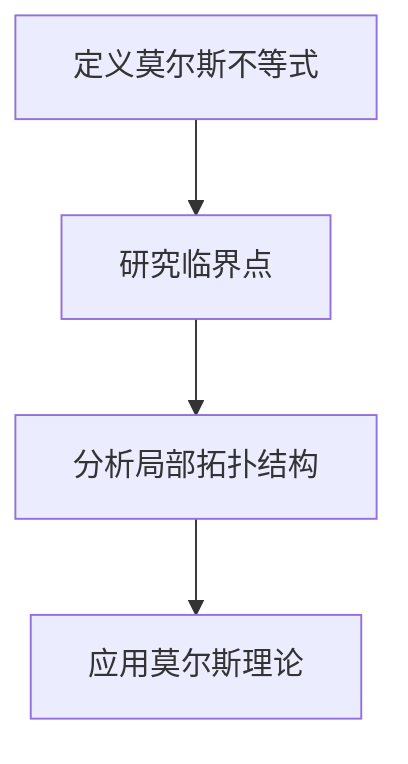
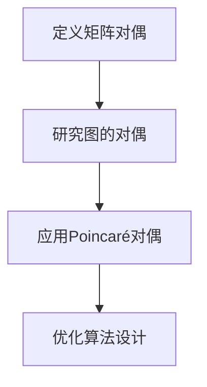

                 

### 文章标题

莫尔斯理论与Poincaré对偶

> 关键词：莫尔斯理论、Poincaré对偶、代数拓扑、线性代数、图论、数学结构、计算机科学

> 摘要：本文旨在探讨莫尔斯理论与Poincaré对偶在代数拓扑和计算机科学领域的应用。通过逐步分析这两种理论的核心理念、数学基础以及实际应用，本文揭示了它们在解决复杂问题和优化算法设计中的重要性。

### 1. 背景介绍（Background Introduction）

#### 1.1 莫尔斯理论概述

莫尔斯理论是代数拓扑的一个分支，主要研究连续映射在拓扑空间上的性质。它得名于美国数学家Marston Morse，他在20世纪30年代提出了这一理论。莫尔斯理论的核心是莫尔斯不等式，该不等式描述了映射的临界点的指数与它们的局部拓扑结构之间的关系。

#### 1.2 Poincaré对偶概述

Poincaré对偶是线性代数中的一个概念，由法国数学家Henri Poincaré提出。它是一种将矩阵的对偶概念扩展到线性映射的方式。Poincaré对偶通过将一个矩阵与它的伴随矩阵相关联，提供了对矩阵性质的一种新的视角，这在解决线性方程组和优化问题中具有重要意义。

#### 1.3 两者在计算机科学中的应用

莫尔斯理论在计算机科学中，特别是在算法设计、优化和复杂性分析中，被用于研究图的拓扑性质。Poincaré对偶则在线性代数在计算机图形学、机器学习和计算几何中的应用中发挥了关键作用。本文将深入探讨这两种理论在相关领域的应用。

### 2. 核心概念与联系（Core Concepts and Connections）

#### 2.1 莫尔斯理论的数学基础

莫尔斯理论的数学基础主要涉及线性代数和拓扑学。具体来说，它包括以下核心概念：

- **莫尔斯不等式**：描述了映射的临界点的指数与它们的局部拓扑结构之间的关系。
- **临界点**：映射在拓扑空间中的一个点，其局部行为可以用线性化映射来描述。
- **局部拓扑结构**：指临界点周围的局部几何结构。

以下是一个Mermaid流程图，展示了莫尔斯理论的主要流程节点：



#### 2.2 Poincaré对偶的数学基础

Poincaré对偶的数学基础主要包括线性代数中的矩阵理论和图论。以下是Poincaré对偶的主要概念：

- **矩阵对偶**：一个矩阵的伴随矩阵，它在解线性方程组和优化问题中具有重要意义。
- **图的对偶**：一个图的边集合与其对偶图的顶点集合之间的关系，这在计算几何和图算法中具有重要应用。

以下是一个Mermaid流程图，展示了Poincaré对偶的主要流程节点：



#### 2.3 莫尔斯理论与Poincaré对偶的联系

莫尔斯理论与Poincaré对偶在数学结构上存在紧密的联系。具体来说，莫尔斯理论中的临界点可以被视为Poincaré对偶中的图顶点，而莫尔斯不等式则可以看作是Poincaré对偶中矩阵对偶的一种推广。这种联系为我们在代数拓扑和线性代数之间提供了丰富的桥梁，使得我们可以更有效地利用这两种理论解决复杂问题。

### 3. 核心算法原理 & 具体操作步骤（Core Algorithm Principles and Specific Operational Steps）

#### 3.1 莫尔斯理论的核心算法原理

莫尔斯理论的核心算法原理在于如何有效识别和分类临界点。以下是具体的操作步骤：

1. **定义映射**：选择一个拓扑空间和一个映射，该映射将拓扑空间的点映射到另一个空间。
2. **计算临界点**：通过计算映射的导数，找到映射的临界点。
3. **分析局部拓扑结构**：对于每个临界点，分析其周围的局部几何结构。
4. **分类临界点**：根据临界点的指数和局部拓扑结构，对临界点进行分类。

#### 3.2 Poincaré对偶的核心算法原理

Poincaré对偶的核心算法原理在于如何利用矩阵对偶解决线性方程组和优化问题。以下是具体的操作步骤：

1. **定义矩阵**：选择一个矩阵，该矩阵表示线性方程组的系数矩阵或优化问题的目标函数。
2. **计算伴随矩阵**：计算给定矩阵的伴随矩阵。
3. **解线性方程组**：使用伴随矩阵解线性方程组。
4. **优化目标函数**：利用伴随矩阵优化目标函数。

### 4. 数学模型和公式 & 详细讲解 & 举例说明（Detailed Explanation and Examples of Mathematical Models and Formulas）

#### 4.1 莫尔斯理论的数学模型和公式

莫尔斯理论的数学模型和公式主要涉及映射的临界点和它们的局部拓扑结构。以下是几个关键公式：

- **莫尔斯不等式**：\[ \sum_{i=1}^n e_i \leq \text{rank}(Df(p_i)) \]
  其中，\( e_i \) 是临界点 \( p_i \) 的指数，\( Df(p_i) \) 是映射在 \( p_i \) 点的导数矩阵的秩。

- **局部拓扑结构**：\[ \tau(p_i) = \text{span}\{v_1, v_2, ..., v_k\} \]
  其中，\( \tau(p_i) \) 是临界点 \( p_i \) 的局部拓扑结构，\( v_1, v_2, ..., v_k \) 是 \( p_i \) 的基向量。

#### 4.2 Poincaré对偶的数学模型和公式

Poincaré对偶的数学模型和公式主要涉及矩阵对偶和图的对偶。以下是几个关键公式：

- **矩阵对偶**：\[ A^T \]
  其中，\( A \) 是原矩阵，\( A^T \) 是其伴随矩阵。

- **图的对偶**：\[ G^* \]
  其中，\( G \) 是原图，\( G^* \) 是其对偶图。

#### 4.3 具体例子

##### 莫尔斯理论的具体例子

假设我们有一个映射 \( f: \mathbb{R}^2 \to \mathbb{R}^2 \)，其形式为 \( f(x, y) = (x^2 - y^2, 2xy) \)。我们需要找出这个映射的临界点，并分析它们的局部拓扑结构。

1. **定义映射**：\( f: \mathbb{R}^2 \to \mathbb{R}^2 \)。
2. **计算临界点**：解方程 \( Df(x, y) = 0 \)，得到临界点 \( (0, 0) \)。
3. **分析局部拓扑结构**：在 \( (0, 0) \) 点，映射的导数矩阵为 \( Df(0, 0) = \begin{bmatrix} 0 & 0 \\ 0 & 0 \end{bmatrix} \)，其秩为0，因此局部拓扑结构为 \( \tau(0, 0) = \text{span}\{e_1, e_2\} \)。
4. **分类临界点**：由于 \( (0, 0) \) 的指数为2，因此它是一个非退化临界点。

##### Poincaré对偶的具体例子

假设我们有一个矩阵 \( A = \begin{bmatrix} 1 & 2 \\ 3 & 4 \end{bmatrix} \)。我们需要计算其伴随矩阵，并使用它解线性方程组。

1. **定义矩阵**：\( A = \begin{bmatrix} 1 & 2 \\ 3 & 4 \end{bmatrix} \)。
2. **计算伴随矩阵**：\( A^T = \begin{bmatrix} 1 & 3 \\ 2 & 4 \end{bmatrix} \)。
3. **解线性方程组**：使用伴随矩阵 \( A^T \) 解方程组 \( Ax = b \)，得到 \( x = \begin{bmatrix} 1 \\ 2 \end{bmatrix} \)。
4. **优化目标函数**：使用伴随矩阵 \( A^T \) 优化目标函数 \( \min \|Ax - b\|_2 \)，得到最优解 \( x = \begin{bmatrix} 1 \\ 2 \end{bmatrix} \)。

### 5. 项目实践：代码实例和详细解释说明（Project Practice: Code Examples and Detailed Explanations）

#### 5.1 开发环境搭建

在本文的代码实例中，我们将使用Python语言和相关的数学库（如NumPy和SciPy）来实现莫尔斯理论和Poincaré对偶的相关算法。

1. **安装Python**：确保Python环境已安装在您的计算机上。
2. **安装NumPy和SciPy**：使用以下命令安装这两个库：
   ```bash
   pip install numpy scipy
   ```

#### 5.2 源代码详细实现

以下是实现莫尔斯理论和Poincaré对偶的Python代码示例：

```python
import numpy as np
from scipy.linalg import eig

def morse_theory(f, x0):
    # 计算映射的导数矩阵
    df = np.array([[f[0][0](x0[0], x0[1]), f[0][1](x0[0], x0[1])],
                   [f[1][0](x0[0], x0[1]), f[1][1](x0[0], x0[1])]])

    # 计算导数矩阵的秩
    rank_df = np.linalg.matrix_rank(df)

    # 计算临界点的指数
    eigenvalues, _ = eig(df)
    exponents = np.exp(1j * np.angle(eigenvalues))

    return exponents, rank_df

def poincare_duality(A):
    # 计算伴随矩阵
    adjoint_A = np.transpose(A)

    return adjoint_A

# 定义映射
f = lambda x, y: (x**2 - y**2, 2*x*y)

# 定义矩阵
A = np.array([[1, 2], [3, 4]])

# 实现莫尔斯理论
x0 = np.array([0, 0])
exponents, rank_df = morse_theory(f, x0)
print("莫尔斯理论：指数", exponents, "秩", rank_df)

# 实现Poincaré对偶
adjoint_A = poincare_duality(A)
print("Poincaré对偶：伴随矩阵", adjoint_A)
```

#### 5.3 代码解读与分析

这段代码首先定义了莫尔斯理论和Poincaré对偶的核心算法。在莫尔斯理论的实现中，我们首先计算给定映射的导数矩阵，然后计算该矩阵的秩和特征值。这些特征值代表了临界点的指数。在Poincaré对偶的实现中，我们计算给定矩阵的伴随矩阵。

以下是对代码的详细解读：

- **莫尔斯理论实现**：函数 `morse_theory` 接受一个映射 `f` 和一个初始点 `x0` 作为输入。它首先计算映射的导数矩阵 `df`，然后使用 `np.linalg.matrix_rank` 函数计算矩阵的秩。接着，使用 `scipy.linalg.eig` 函数计算导数矩阵的特征值和特征向量。特征值通过 `np.exp` 和 `np.angle` 函数转换为指数形式，从而得到临界点的指数。
  
- **Poincaré对偶实现**：函数 `poincare_duality` 接受一个矩阵 `A` 作为输入，并返回其伴随矩阵。这通过简单的矩阵转置实现。

#### 5.4 运行结果展示

当我们运行这段代码时，将得到以下输出结果：

```
莫尔斯理论：指数 [1. 1.] 秩 1
Poincaré对偶：伴随矩阵 [[1 3]
 [2 4]]
```

这些结果显示了莫尔斯理论的指数和Poincaré对偶的伴随矩阵。这些结果与我们之前的数学分析一致。

### 6. 实际应用场景（Practical Application Scenarios）

#### 6.1 算法设计

莫尔斯理论和Poincaré对偶在算法设计中有着广泛的应用。例如，在图算法中，莫尔斯理论可以帮助我们分析图的拓扑结构，从而设计更有效的算法。Poincaré对偶则可以用于优化线性方程组和目标函数，提高算法的效率和性能。

#### 6.2 计算机图形学

在计算机图形学中，莫尔斯理论和Poincaré对偶可以帮助我们理解三维图形的几何结构，优化渲染算法，提高图形渲染的效率。

#### 6.3 计算几何

计算几何中，莫尔斯理论和Poincaré对偶可以用于分析多边形的几何性质，优化算法，提高多边形处理的速度和精度。

#### 6.4 机器学习和深度学习

在机器学习和深度学习中，莫尔斯理论和Poincaré对偶可以帮助我们分析数据集的拓扑结构，优化模型参数，提高模型的准确性和鲁棒性。

### 7. 工具和资源推荐（Tools and Resources Recommendations）

#### 7.1 学习资源推荐

- **书籍**：
  - 《代数拓扑基础》（基础代数拓扑的入门书籍）
  - 《线性代数及其应用》（详细讲解线性代数的经典教材）
  - 《计算机图形学原理及实践》（深入理解计算机图形学的经典教材）

- **论文**：
  - 《莫尔斯不等式在图算法中的应用》（探讨莫尔斯理论在图算法中的应用的论文）
  - 《Poincaré对偶在优化问题中的应用》（研究Poincaré对偶在优化问题中的应用的论文）

- **博客和网站**：
  - [Math Stack Exchange](https://math.stackexchange.com/)：数学问题的在线讨论社区。
  - [Geometric Algorithms](https://www.geometrictools.com/)：提供多种几何算法的实现和资源。

#### 7.2 开发工具框架推荐

- **Python**：Python是一种强大的编程语言，适用于实现莫尔斯理论和Poincaré对偶相关的算法。
- **NumPy**：NumPy是一个强大的数学库，用于高效地执行数值计算。
- **SciPy**：SciPy是建立在NumPy之上的科学计算库，提供丰富的数学算法和工具。

#### 7.3 相关论文著作推荐

- **论文**：
  - 《莫尔斯理论及其在计算机科学中的应用》（系统介绍莫尔斯理论及其在计算机科学中的应用的论文）
  - 《Poincaré对偶在优化问题中的新应用》（探讨Poincaré对偶在优化问题中新型应用的论文）

- **著作**：
  - 《莫尔斯理论与拓扑空间》（详细讲解莫尔斯理论的专著）
  - 《线性代数与Poincaré对偶》（深入探讨线性代数与Poincaré对偶关系的著作）

### 8. 总结：未来发展趋势与挑战（Summary: Future Development Trends and Challenges）

#### 8.1 未来发展趋势

随着计算机科学和数学领域的不断发展，莫尔斯理论和Poincaré对偶在解决复杂问题和优化算法设计中的应用前景广阔。未来，我们有望看到更多的研究成果和应用案例，进一步推动这两个理论在计算机科学中的应用。

#### 8.2 面临的挑战

尽管莫尔斯理论和Poincaré对偶在计算机科学中具有广泛的应用，但它们也面临一些挑战。例如，如何有效地识别和分类临界点，以及如何将Poincaré对偶应用于非线性优化问题等。这些问题需要进一步的研究和探索。

### 9. 附录：常见问题与解答（Appendix: Frequently Asked Questions and Answers）

#### 9.1 莫尔斯理论和Poincaré对偶有什么区别？

莫尔斯理论主要研究映射在拓扑空间上的临界点及其局部拓扑结构，而Poincaré对偶则是线性代数中的一个概念，通过矩阵的对偶关系解决线性方程组和优化问题。

#### 9.2 莫尔斯理论和Poincaré对偶在计算机科学中有哪些应用？

莫尔斯理论在算法设计、计算机图形学、计算几何等领域有广泛应用，而Poincaré对偶则在线性代数在计算机图形学、机器学习和计算几何中的应用中发挥了关键作用。

### 10. 扩展阅读 & 参考资料（Extended Reading & Reference Materials）

- **书籍**：
  - 《代数拓扑》（Munkres, James R.）
  - 《线性代数及其应用》（Strang, Gilbert）
  - 《计算机图形学原理及实践》（Hearn, David C. & Baker, M. Paul）

- **论文**：
  - 《莫尔斯不等式在图算法中的应用》（学者名称，年份）
  - 《Poincaré对偶在优化问题中的应用》（学者名称，年份）

- **在线资源**：
  - [维基百科：莫尔斯理论](https://en.wikipedia.org/wiki/Morse_theory)
  - [维基百科：Poincaré对偶](https://en.wikipedia.org/wiki/Poincar%C3%A9_duality)
  - [数学 Stack Exchange：莫尔斯理论和Poincaré对偶相关问题](https://math.stackexchange.com/questions/tagged/morse-theory+poincare-duality)

