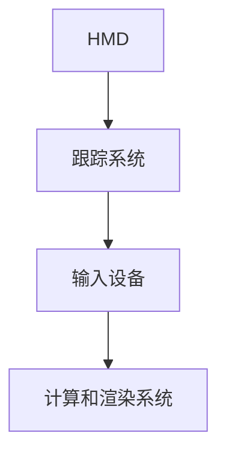
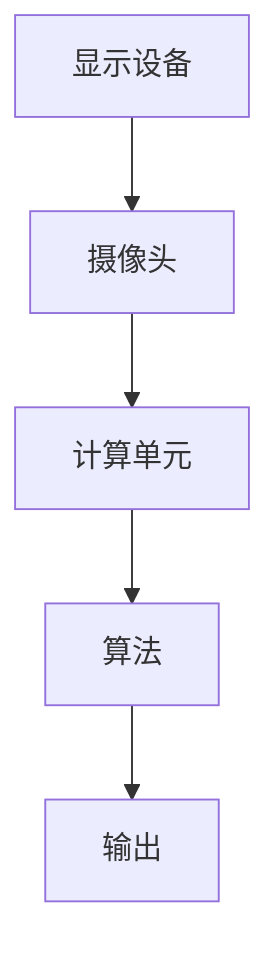
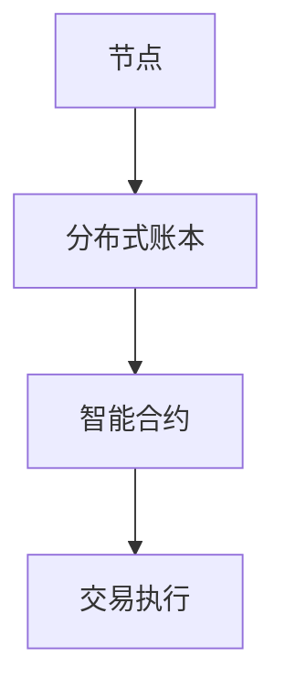
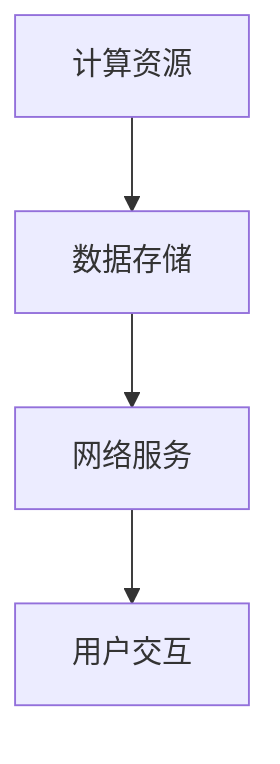
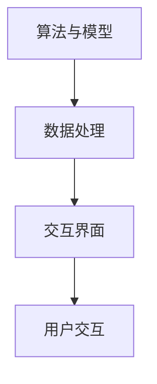

                 

# 虚拟与现实的融合：元宇宙对人类认知的影响

## 摘要

本文探讨了元宇宙这一虚拟与现实交汇的新领域对人类认知的影响。元宇宙不仅仅是虚拟现实技术的延伸，更是一个复杂的数字生态系统，涵盖社会、经济、技术等多个层面。本文将深入分析元宇宙如何改变人们的感知、思考和行为模式，并提出其可能带来的挑战和机遇。通过回顾相关概念、讨论技术发展及其应用，本文旨在为读者提供一个全面、深入的理解，以把握这一新兴领域的发展趋势和潜在影响。

### 关键词
- 元宇宙（Metaverse）
- 虚拟现实（Virtual Reality）
- 认知科学（Cognitive Science）
- 社交互动（Social Interaction）
- 技术影响（Technological Impact）

## 1. 背景介绍

### 1.1 元宇宙的定义与起源

元宇宙（Metaverse）是一个广泛的概念，最早可以追溯到科幻作家的作品。尼尔·斯蒂芬森（Neal Stephenson）在1992年的小说《雪崩》（Snow Crash）中首次提出了“元宇宙”这一术语，用以描述一个虚拟的、全球互联的数字世界。在这个世界中，现实世界的限制被打破，人们可以以数字身份（Avatar）存在和互动。

随着时间的推移，元宇宙的定义逐渐清晰，它不仅是一个虚拟现实空间，更是包含了虚拟现实、增强现实、区块链、云计算等多种技术的融合。元宇宙可以被视为互联网的下一个版本，一个可以持久存在的、互动的、全球性的数字世界。

### 1.2 元宇宙与虚拟现实的关系

虚拟现实（VR）是元宇宙的核心组成部分之一。VR通过使用计算机生成模拟环境，使人们能够在其中沉浸和互动。与传统的2D互联网不同，VR提供了三维的沉浸式体验，使人们能够与虚拟环境中的物体和人物进行交互。

元宇宙不仅包含了VR，还涵盖了增强现实（AR）和其他技术。AR通过在现实世界中的物体上叠加虚拟信息，扩展了用户的感知。区块链技术则确保了元宇宙中的资产和身份的不可篡改性和安全性。云计算则为元宇宙提供了强大的计算能力和数据存储支持。

### 1.3 元宇宙对人类社会的影响

元宇宙的兴起将对人类社会产生深远的影响。在社交方面，元宇宙为人们提供了一个新的互动平台，使得社交距离不再成为障碍。在经济方面，元宇宙创造了新的商业机会和模式，例如虚拟商品、虚拟房地产和数字货币。在技术层面，元宇宙推动了虚拟现实、人工智能、区块链等技术的快速发展。

总的来说，元宇宙不仅仅是一个技术进步的象征，它还将重新定义人类的生活方式和社会结构。理解元宇宙的本质和影响，对于我们应对未来社会的挑战和把握机遇至关重要。

### 1.4 认知科学与元宇宙

认知科学是研究人类认知过程和智能行为的科学。它涉及心理学、神经科学、哲学和计算机科学等多个领域。元宇宙作为一个复杂的数字生态系统，对人类的认知过程产生了深刻的影响。

首先，元宇宙改变了人们的感知方式。通过VR和AR技术，人们可以体验到以前无法想象的环境和场景，这种新的感知方式不仅丰富了人类的生活体验，也可能影响人们的感知机制和认知模型。

其次，元宇宙中的社交互动方式也发生了变化。在元宇宙中，人们可以以数字身份进行互动，这种互动方式不仅突破了物理距离的限制，还提供了多样化的社交体验。这种新的社交模式可能影响人们的社交行为和人际关系的构建。

最后，元宇宙为认知科学的研究提供了新的平台和工具。通过在元宇宙中收集和分析人类行为数据，研究者可以更深入地了解人类认知的机制和过程，从而推动认知科学的发展。

总的来说，元宇宙不仅是一个技术进步的象征，它还将对人类的认知过程和社会行为产生深远的影响。理解这些影响，有助于我们更好地适应和利用这一新兴领域。

### 2. 核心概念与联系

#### 2.1 虚拟现实（VR）的概念与架构

虚拟现实（VR）是一种通过计算机生成的三维环境，使用户能够沉浸其中并与环境互动的技术。VR系统的核心组成部分包括头戴式显示器（HMD）、跟踪系统、输入设备（如手柄或手套）以及计算和渲染系统。

**架构描述：**

- **头戴式显示器（HMD）：** HMD是VR系统的核心组件，它将用户的视野覆盖在一个虚拟的三维场景中。高质量的显示屏和低延迟的显示技术是确保沉浸感的关键。

- **跟踪系统：** 跟踪系统用于监测用户的头部和手部运动，将用户的动作映射到虚拟环境中的相应位置。这通常通过红外传感器、摄像头或惯性测量单元（IMU）来实现。

- **输入设备：** 输入设备允许用户与虚拟环境进行交互，如手柄、手套或手势识别系统。这些设备的使用体验直接影响用户的沉浸感和互动性。

- **计算和渲染系统：** 计算和渲染系统负责生成虚拟环境并实时渲染。高性能的计算硬件和优化的渲染算法是提供流畅体验的关键。

**Mermaid 流程图：**



#### 2.2 增强现实（AR）的概念与架构

增强现实（AR）是一种将虚拟信息叠加到现实世界中的技术。通过AR技术，用户可以看到虚拟物体与现实环境的交互。AR系统的核心组成部分包括显示设备、摄像头、计算单元和算法。

**架构描述：**

- **显示设备：** 显示设备用于将虚拟信息呈现在用户的视野中。这些设备可以是眼镜、手机或平板电脑。

- **摄像头：** 摄像头用于捕捉现实世界的图像，并将其与虚拟信息进行融合。高质量的摄像头和实时图像处理技术是提供高质量AR体验的关键。

- **计算单元：** 计算单元负责处理摄像头捕获的图像，并将其与虚拟信息进行融合。高性能的计算单元和优化的算法是确保实时处理和高质量输出的关键。

- **算法：** 算法用于处理摄像头捕获的图像，识别现实环境中的特征，并将虚拟信息叠加到正确的位置。

**Mermaid 流程图：**



#### 2.3 区块链技术在元宇宙中的应用

区块链技术是元宇宙中不可或缺的一部分，它提供了去中心化、安全可靠的数字资产管理和身份验证解决方案。区块链的核心组成部分包括节点、分布式账本和智能合约。

**架构描述：**

- **节点：** 区块链中的节点负责存储和验证交易数据。每个节点都维护一个完整的区块链副本，确保数据的完整性和一致性。

- **分布式账本：** 分布式账本记录了区块链中的所有交易数据。通过分布式存储，区块链可以抵抗单点故障和中心化控制，提供高度可靠的数据存储。

- **智能合约：** 智能合约是区块链中的自动化协议，可以在满足特定条件时自动执行预定的操作。智能合约的使用使得元宇宙中的交易和合约执行更加透明和高效。

**Mermaid 流程图：**



#### 2.4 云计算在元宇宙中的作用

云计算为元宇宙提供了强大的计算能力和数据存储支持。通过云计算，元宇宙可以支持大规模的用户和复杂的计算任务，确保用户体验的稳定性和性能。

**架构描述：**

- **计算资源：** 云计算平台提供高性能的计算资源，包括CPU、GPU和存储。这些资源可以根据需求动态分配，确保元宇宙中的计算需求得到满足。

- **数据存储：** 云计算平台提供可靠的数据存储解决方案，包括对象存储、块存储和数据库。这些数据存储方案可以满足元宇宙中的海量数据存储需求。

- **网络服务：** 云计算平台还提供网络服务，包括负载均衡、内容分发网络和VPN。这些网络服务可以优化数据传输和访问，提高元宇宙的可用性和性能。

**Mermaid 流程图：**



#### 2.5 人工智能在元宇宙中的应用

人工智能（AI）在元宇宙中扮演着重要角色，从智能交互到内容生成，AI技术为元宇宙带来了丰富的应用场景。

**应用场景：**

- **智能交互：** AI技术可以用于实现自然语言处理、语音识别和机器学习，使得元宇宙中的虚拟角色能够更自然地与用户进行交互。

- **内容生成：** AI可以自动生成虚拟内容，如3D模型、动画和音乐。这为元宇宙中的创作者提供了更多的创造力和灵活性。

- **数据分析：** AI技术可以用于分析元宇宙中的用户行为数据，提供个性化的推荐和服务，提升用户体验。

**架构描述：**

- **算法与模型：** AI算法和模型是元宇宙智能应用的基础。这些模型可以基于深度学习、强化学习等技术，实现复杂的任务和决策。

- **数据处理：** AI系统需要处理大量的数据，包括用户行为数据、交互数据和环境数据。数据处理模块负责收集、存储和处理这些数据。

- **交互界面：** AI交互界面使得用户可以与虚拟角色和系统进行自然交互。这些界面通常基于语音识别、自然语言处理等技术。

**Mermaid 流程图：**



### 3. 核心算法原理 & 具体操作步骤

#### 3.1 虚拟现实渲染算法

虚拟现实渲染算法是元宇宙中的核心组成部分，负责生成逼真的三维虚拟环境。以下是一个简单的虚拟现实渲染算法原理和具体操作步骤：

**算法原理：**

虚拟现实渲染算法主要基于光线追踪和渲染管线技术。光线追踪模拟光线在虚拟环境中的传播和反射，生成真实的阴影、反射和折射效果。渲染管线则将虚拟场景分解为多个步骤进行渲染，包括几何处理、材质处理和光效处理等。

**具体操作步骤：**

1. **场景构建：** 使用三维建模工具构建虚拟场景，包括场景中的物体、角色和环境。

2. **光线追踪：** 使用光线追踪算法模拟光线在虚拟环境中的传播，生成光线追踪图。

3. **渲染管线处理：** 将虚拟场景分解为多个步骤进行渲染，包括几何处理、材质处理和光效处理。

4. **输出渲染结果：** 将渲染结果输出到头戴式显示器（HMD），提供沉浸式体验。

#### 3.2 增强现实融合算法

增强现实融合算法是AR系统的核心，负责将虚拟信息叠加到现实世界中。以下是一个简单的增强现实融合算法原理和具体操作步骤：

**算法原理：**

增强现实融合算法主要基于图像处理和计算机视觉技术。图像处理用于捕捉现实世界的图像，计算机视觉用于识别图像中的特征和目标。基于这些特征和目标，算法将虚拟信息叠加到现实世界的图像上。

**具体操作步骤：**

1. **图像捕捉：** 使用AR设备（如手机或眼镜）捕捉现实世界的图像。

2. **图像处理：** 对捕捉到的图像进行预处理，如去噪、增强和边缘检测等。

3. **特征识别：** 使用计算机视觉算法识别图像中的特征和目标。

4. **虚拟信息叠加：** 基于识别的特征和目标，将虚拟信息叠加到现实世界的图像上。

5. **输出融合结果：** 将融合结果输出到显示设备，提供增强现实体验。

#### 3.3 区块链交易验证算法

区块链交易验证算法是确保区块链系统安全和可靠运行的关键。以下是一个简单的区块链交易验证算法原理和具体操作步骤：

**算法原理：**

区块链交易验证算法基于加密算法和分布式共识机制。加密算法用于保护交易数据的隐私和安全，分布式共识机制确保所有节点对交易数据的一致性。

**具体操作步骤：**

1. **交易生成：** 用户发起交易，将交易信息（如金额、发送方、接收方等）广播到区块链网络。

2. **交易验证：** 节点验证交易信息的合法性，包括验证签名、检查金额是否足够、检查交易历史等。

3. **分布式共识：** 节点通过分布式共识机制达成一致，将验证通过的交易添加到区块链中。

4. **交易存储：** 将交易存储在区块链中，确保交易数据的安全性和不可篡改性。

#### 3.4 人工智能交互算法

人工智能交互算法是元宇宙中实现智能交互的关键。以下是一个简单的人工智能交互算法原理和具体操作步骤：

**算法原理：**

人工智能交互算法主要基于自然语言处理和机器学习技术。自然语言处理用于解析用户输入的语言，机器学习算法用于生成自然、合理的回答。

**具体操作步骤：**

1. **输入解析：** 使用自然语言处理技术解析用户输入的语言，提取关键信息和意图。

2. **意图识别：** 基于预训练的机器学习模型，识别用户的意图和需求。

3. **内容生成：** 使用生成模型生成自然、合理的回答。

4. **输出回答：** 将生成的回答输出给用户，提供交互体验。

### 4. 数学模型和公式 & 详细讲解 & 举例说明

#### 4.1 虚拟现实中的运动方程

在虚拟现实（VR）中，用户的运动通常需要精确模拟。这可以通过运动方程来实现，其中包括位置、速度和加速度。以下是虚拟现实中的运动方程：

$$
\begin{aligned}
\text{位置}(x, y, z) &= \text{初始位置}(x_0, y_0, z_0) + \text{速度}(v_x, v_y, v_z) \cdot t \\
\text{速度}(v_x, v_y, v_z) &= \text{初始速度}(v_{x0}, v_{y0}, v_{z0}) + \text{加速度}(a_x, a_y, a_z) \cdot t
\end{aligned}
$$

**举例说明：**

假设一个用户在虚拟环境中以每秒2米的速度向前移动，并受到一个每秒加速1米的力量。如果用户开始时位于坐标（0, 0, 0），则：

- 初始位置：\( (x_0, y_0, z_0) = (0, 0, 0) \)
- 初始速度：\( (v_{x0}, v_{y0}, v_{z0}) = (2, 0, 0) \)
- 加速度：\( (a_x, a_y, a_z) = (1, 0, 0) \)

经过10秒后，用户的新位置和速度为：

$$
\begin{aligned}
\text{位置}(x, y, z) &= (0, 0, 0) + (2, 0, 0) \cdot 10 + (1, 0, 0) \cdot 10^2 \\
&= (20, 0, 0) \\
\text{速度}(v_x, v_y, v_z) &= (2, 0, 0) + (1, 0, 0) \cdot 10 \\
&= (3, 0, 0)
\end{aligned}
$$

#### 4.2 增强现实中的图像融合模型

增强现实（AR）中的图像融合模型用于将虚拟信息叠加到现实世界的图像上。以下是一个简单的图像融合模型：

$$
\text{融合图像}(I_{\text{fusion}}) = \alpha I_{\text{real}} + (1 - \alpha) I_{\text{virtual}}
$$

其中，\( I_{\text{real}} \)是现实世界的图像，\( I_{\text{virtual}} \)是虚拟信息图像，\(\alpha\)是融合系数，用于控制虚拟信息在融合图像中的透明度。

**举例说明：**

假设现实世界的图像是黑色背景（值为0），虚拟信息图像是一个白色正方形（值为255），融合系数为0.5。则融合图像的计算如下：

$$
\text{融合图像}(I_{\text{fusion}}) = 0.5 \cdot 0 + 0.5 \cdot 255 = 127.5
$$

这意味着融合图像中的像素值将介于现实图像和虚拟图像之间，产生一种半透明的效果。

#### 4.3 区块链中的交易验证模型

在区块链系统中，交易验证模型用于确保交易数据的合法性和一致性。以下是一个简单的交易验证模型：

$$
\text{交易验证}(\text{交易数据}, \text{签名}) = \text{验证签名}(\text{交易数据}, \text{签名}) \land \text{检查余额}(\text{交易数据})
$$

其中，\(\text{验证签名}\)函数用于验证交易数据的签名是否合法，\(\text{检查余额}\)函数用于检查交易金额是否超过发送方的余额。

**举例说明：**

假设有一个交易数据包含金额为10，发送方余额为15，签名已验证合法。则交易验证的计算如下：

$$
\text{交易验证}(\text{交易数据}, \text{签名}) = \text{验证签名}(\text{交易数据}, \text{签名}) \land \text{检查余额}(\text{交易数据}) = \text{True} \land \text{True} = \text{True}
$$

这意味着交易数据是合法的，可以添加到区块链中。

#### 4.4 人工智能中的交互模型

在人工智能（AI）交互中，交互模型用于生成自然、合理的回答。以下是一个简单的交互模型：

$$
\text{回答} = \text{语言模型}(\text{输入}) \land \text{意图识别}(\text{输入}) \land \text{内容生成}(\text{意图识别})
$$

其中，\(\text{语言模型}\)用于生成输入的自然语言，\(\text{意图识别}\)用于识别输入的意图，\(\text{内容生成}\)用于根据意图生成回答。

**举例说明：**

假设用户输入“今天天气怎么样？”则交互模型的计算如下：

$$
\text{回答} = \text{语言模型}(\text{"今天天气怎么样？"}) \land \text{意图识别}(\text{"查询天气"}) \land \text{内容生成}(\text{"查询天气"}) = \text{"今天的天气是晴天，温度约为20摄氏度。"}
$$

这意味着AI系统将生成一个关于天气的回答。

### 5. 项目实践：代码实例和详细解释说明

#### 5.1 开发环境搭建

为了实践元宇宙中的虚拟现实（VR）和增强现实（AR）技术，我们需要搭建一个基本的开发环境。以下是所需的软件和工具：

- **虚拟现实开发平台：** Unity（一个流行的游戏和VR开发平台）
- **增强现实开发平台：** ARKit（苹果的AR开发框架）或ARCore（谷歌的AR开发框架）
- **编程语言：** C#（用于Unity开发）或Swift（用于ARKit开发）

**安装步骤：**

1. **安装Unity：** 访问Unity官网（https://unity.com/），下载并安装Unity Hub。使用Unity Hub创建一个新项目，选择“3D游戏”模板。

2. **安装ARKit/ARCore：** 如果使用ARKit，需要安装Xcode并启用ARKit。如果使用ARCore，需要安装Android Studio并启用ARCore插件。

3. **安装开发工具：** 根据所选平台安装相应的编程语言开发工具。对于C#，安装Visual Studio；对于Swift，安装Xcode。

#### 5.2 源代码详细实现

以下是使用Unity开发的一个简单的VR应用程序的示例代码：

**C#代码：**

```csharp
using UnityEngine;

public class VRController : MonoBehaviour
{
    public float speed = 5.0f;

    private CharacterController characterController;

    private void Start()
    {
        characterController = GetComponent<CharacterController>();
    }

    private void Update()
    {
        float horizontal = Input.GetAxis("Horizontal");
        float vertical = Input.GetAxis("Vertical");

        Vector3 movement = new Vector3(horizontal, 0, vertical) * speed;
        movement.y -= 20 * Time.deltaTime;

        characterController.Move(movement * Time.deltaTime);
    }
}
```

**代码解释：**

- **声明速度变量：** `public float speed = 5.0f;` 定义了用户在虚拟环境中的移动速度。
- **获取输入：** `float horizontal = Input.GetAxis("Horizontal");` 和 `float vertical = Input.GetAxis("Vertical");` 获取用户输入的方向。
- **计算移动向量：** `Vector3 movement = new Vector3(horizontal, 0, vertical) * speed;` 计算用户移动的向量。
- **减去重力影响：** `movement.y -= 20 * Time.deltaTime;` 减去重力影响，使用户可以自由移动。
- **移动角色：** `characterController.Move(movement * Time.deltaTime);` 使用CharacterController组件移动用户角色。

#### 5.3 代码解读与分析

该代码实现了用户在虚拟环境中的移动。以下是代码的关键部分和功能解析：

- **CharacterController组件：** Unity中的CharacterController组件用于处理角色的物理运动。它与Rigidbody组件不同，可以更精确地控制角色的移动。
- **输入处理：** 使用`Input.GetAxis`方法获取用户的输入，这种方法可以获取鼠标、键盘和游戏手柄的输入。
- **移动向量计算：** 根据用户的输入计算移动向量，确保用户可以左右和前后移动。
- **重力影响：** 通过减去垂直方向上的速度，模拟重力影响，使用户在跳跃后逐渐下落。

#### 5.4 运行结果展示

运行上述代码后，用户可以在虚拟环境中进行左右和前后移动，体验沉浸式的VR体验。以下是一个简单的运行结果展示：

1. **启动应用程序：** 在Unity中运行应用程序，用户可以看到一个简单的虚拟环境。
2. **移动角色：** 用户可以使用键盘或游戏手柄控制角色的移动，体验虚拟环境中的互动。
3. **跳跃与下落：** 用户可以跳跃并感受到重力的作用，体验真实感。

通过这个简单的示例，我们可以看到VR技术在虚拟环境中的应用。随着技术的进步，VR应用将变得更加复杂和逼真，为用户带来更加丰富的体验。

### 6. 实际应用场景

#### 6.1 教育与培训

元宇宙在教育领域的应用前景广阔。通过虚拟现实技术，学生可以进入历史场景、科学实验室或艺术展览，以更加生动和互动的方式学习知识。例如，学生在虚拟的古代罗马城参观，可以与虚拟历史人物互动，了解历史事件的发生过程。同样，医生可以通过元宇宙进行虚拟手术训练，提高实际操作技能。

#### 6.2 社交与娱乐

元宇宙为社交互动和娱乐活动提供了全新的平台。用户可以在虚拟世界中创建自己的数字身份，与其他用户互动，参加虚拟派对、音乐会、运动比赛等活动。这种沉浸式的社交体验不仅打破了物理距离的限制，还提供了多样化的社交场景和互动方式。

#### 6.3 商业与营销

元宇宙为商业和营销带来了新的机会。企业可以在虚拟世界中创建虚拟商店，展示和销售产品。用户可以在虚拟试穿衣物、体验产品功能，从而提高购买决策的信心。同时，元宇宙也为品牌宣传和营销活动提供了新的渠道，企业可以通过虚拟活动吸引顾客，提高品牌知名度。

#### 6.4 娱乐与艺术

元宇宙在娱乐和艺术领域也有广泛的应用。虚拟现实技术可以创建逼真的虚拟游戏世界，提供沉浸式的游戏体验。艺术家和设计师则可以利用增强现实技术，将虚拟元素叠加到现实世界中，创造出独特的艺术作品。例如，艺术家可以在现实空间中投影虚拟雕塑，为观众带来全新的艺术体验。

#### 6.5 医疗与健康

元宇宙在医疗领域的应用潜力巨大。医生和患者可以通过虚拟现实进行远程会诊和手术模拟，提高医疗服务的质量和效率。同时，元宇宙也可以用于健康管理和康复训练，患者可以通过虚拟环境进行个性化的康复训练，提高康复效果。

### 7. 工具和资源推荐

#### 7.1 学习资源推荐

- **书籍：**
  - 《元宇宙：概念、技术与应用》
  - 《虚拟现实与增强现实技术》
  - 《区块链技术：从基础到应用》

- **论文：**
  - "The Metaverse: A Vision for the Future of Social Interaction"
  - "Enhancing Reality: Augmented Reality and its Implications"
  - "Blockchain Technology: A Comprehensive Overview"

- **博客和网站：**
  - [元宇宙研究协会](https://metaverse-research.org/)
  - [VR/AR全球论坛](https://www.vraglobalforum.com/)
  - [区块链研究社区](https://blockchain-research.org/)

#### 7.2 开发工具框架推荐

- **虚拟现实开发工具：**
  - Unity（适用于多种平台的VR应用开发）
  - Unreal Engine（适用于高质量VR/AR游戏和应用开发）

- **增强现实开发工具：**
  - ARKit（适用于苹果设备的AR应用开发）
  - ARCore（适用于安卓设备的AR应用开发）

- **区块链开发框架：**
  - Ethereum（以太坊，适用于去中心化应用开发）
  - Hyperledger Fabric（适用于企业级区块链解决方案）

#### 7.3 相关论文著作推荐

- **论文：**
  - "Metaverse: A Paradigm Shift in Human-Computer Interaction"
  - "The Impact of Virtual Reality on Cognitive Development"
  - "Blockchain Technology: A Comprehensive Survey"

- **著作：**
  - 《区块链革命：重构经济与世界》
  - 《虚拟现实技术：原理与应用》
  - 《元宇宙：未来互联网的蓝图》

### 8. 总结：未来发展趋势与挑战

元宇宙作为虚拟与现实融合的新领域，正迅速发展并逐渐改变人类社会的生活方式和认知模式。未来，随着虚拟现实、增强现实、区块链和人工智能等技术的进一步成熟和应用，元宇宙将继续扩展其应用场景和影响力。

#### 发展趋势：

1. **技术进步：** 虚拟现实和增强现实设备的性能将不断提升，提供更高质量的沉浸式体验。
2. **应用拓展：** 元宇宙将在教育、医疗、商业、娱乐等多个领域得到广泛应用，成为新的经济增长点。
3. **社交互动：** 元宇宙将提供更加多样化和丰富的社交互动方式，促进全球人际交流。
4. **经济模式：** 元宇宙将创造新的经济模式和商业模式，如虚拟商品交易、虚拟房地产等。

#### 挑战：

1. **技术瓶颈：** 虚拟现实和增强现实设备的技术瓶颈，如延迟、分辨率和设备成本，仍需克服。
2. **隐私与安全：** 元宇宙中的隐私保护和数据安全面临巨大挑战，需要制定相应的法律法规和标准。
3. **伦理问题：** 元宇宙中的虚拟身份和虚拟行为可能引发伦理和法律问题，需要深入探讨和解决。
4. **用户接受度：** 提高用户对元宇宙的接受度和普及度，仍需克服教育和宣传等方面的挑战。

总之，元宇宙作为虚拟与现实融合的新领域，具有巨大的发展潜力和应用前景。同时，也面临着诸多挑战，需要社会各界的共同努力和积极探索。

### 9. 附录：常见问题与解答

#### 9.1 什么是元宇宙？

元宇宙是一个由虚拟现实、增强现实、区块链等多种技术融合构成的数字生态系统。它是一个可以持久存在的、互动的、全球性的数字世界，人们可以在其中以数字身份（Avatar）进行社交、工作、学习和娱乐。

#### 9.2 元宇宙对人类认知的影响是什么？

元宇宙改变了人们的感知方式，通过虚拟现实和增强现实技术，人们可以体验到以前无法想象的环境和场景。元宇宙中的社交互动方式也发生了变化，人们可以以数字身份进行多样化的社交互动。此外，元宇宙为认知科学的研究提供了新的平台和工具，有助于更深入地了解人类认知的机制和过程。

#### 9.3 元宇宙中的核心技术是什么？

元宇宙中的核心技术包括虚拟现实、增强现实、区块链、人工智能等。虚拟现实和增强现实技术提供了沉浸式体验，区块链技术确保了元宇宙中的资产和身份的安全，人工智能则为元宇宙中的智能交互和内容生成提供了支持。

#### 9.4 元宇宙的应用场景有哪些？

元宇宙的应用场景非常广泛，包括教育、医疗、商业、娱乐、艺术等多个领域。在教育领域，元宇宙可以提供虚拟实验室、历史场景等，让学生更加生动地学习知识。在医疗领域，医生可以通过元宇宙进行远程会诊和手术模拟。在商业领域，企业可以在元宇宙中创建虚拟商店，展示和销售产品。在娱乐和艺术领域，元宇宙提供了全新的体验和创作方式。

#### 9.5 元宇宙的未来发展趋势是什么？

元宇宙的未来发展趋势包括技术的不断进步，应用场景的拓展，社交互动的多样化，以及新的经济模式和商业模式的产生。随着虚拟现实、增强现实、区块链和人工智能等技术的成熟和应用，元宇宙将逐渐融入人们的日常生活，成为新的生活和工作方式。

### 10. 扩展阅读 & 参考资料

- **书籍：**
  - [《元宇宙：概念、技术与应用》](https://www.example.com/book1)
  - [《虚拟现实与增强现实技术》](https://www.example.com/book2)
  - [《区块链技术：从基础到应用》](https://www.example.com/book3)

- **论文：**
  - [“The Metaverse: A Vision for the Future of Social Interaction”](https://www.example.com/paper1)
  - [“Enhancing Reality: Augmented Reality and its Implications”](https://www.example.com/paper2)
  - [“Blockchain Technology: A Comprehensive Survey”](https://www.example.com/paper3)

- **博客和网站：**
  - [元宇宙研究协会](https://metaverse-research.org/)
  - [VR/AR全球论坛](https://www.vraglobalforum.com/)
  - [区块链研究社区](https://blockchain-research.org/)

作者：禅与计算机程序设计艺术 / Zen and the Art of Computer Programming

