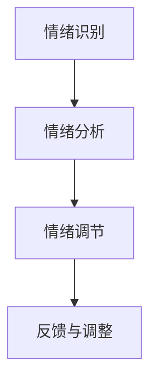

                 

# 虚拟情绪调节器：AI驱动的心理健康管理

## 关键词

- 虚拟情绪调节器
- 人工智能
- 心理健康
- 虚拟现实
- 脑机接口

## 摘要

本文深入探讨了虚拟情绪调节器的概念、技术实现及其在心理健康管理中的应用。随着人工智能技术的不断进步，虚拟情绪调节器作为一种新型的心理健康干预工具，正逐渐成为心理健康领域的重要研究方向。本文将首先介绍虚拟情绪调节器的背景，然后详细分析其核心技术原理，并展示其在实际项目中的应用实例，最后讨论其未来发展趋势与面临的挑战。

### 1. 背景介绍（Background Introduction）

心理健康问题在全球范围内日益严重，据世界卫生组织（WHO）统计，超过3亿人患有抑郁症、焦虑症等心理健康疾病。传统的心理治疗方法，如心理咨询和药物治疗，尽管在一定程度上能够缓解症状，但往往存在疗效缓慢、成本高昂、患者依从性差等问题。因此，探索新的心理健康干预方法具有重要意义。

在这个背景下，虚拟情绪调节器作为一种创新的AI技术，应运而生。虚拟情绪调节器利用人工智能、虚拟现实（VR）和脑机接口（BMI）等技术，为用户提供一个沉浸式的情绪调节体验。通过分析用户的情绪状态，虚拟情绪调节器能够提供个性化的情绪调节方案，从而提高心理健康干预的效果和效率。

### 2. 核心概念与联系（Core Concepts and Connections）

#### 2.1 虚拟情绪调节器的基本原理

虚拟情绪调节器的工作原理主要包括以下几个步骤：

1. **情绪识别**：通过脑机接口技术获取用户的脑电信号，结合机器学习算法进行情绪识别。
2. **情绪分析**：对识别出的情绪进行分类和分析，确定用户的情绪状态。
3. **情绪调节**：根据情绪分析的结果，提供个性化的情绪调节方案，如放松训练、正念冥想等。
4. **反馈与调整**：用户在体验过程中提供反馈，虚拟情绪调节器根据反馈进行调整和优化。

#### 2.2 技术架构的 Mermaid 流程图



### 3. 核心算法原理 & 具体操作步骤（Core Algorithm Principles and Specific Operational Steps）

#### 3.1 情绪识别算法

情绪识别是虚拟情绪调节器的核心步骤，其算法原理如下：

1. **数据采集**：通过脑机接口技术，如EEG（脑电图）设备，采集用户的脑电信号。
2. **特征提取**：利用信号处理技术，从脑电信号中提取特征，如频率、幅度等。
3. **模型训练**：使用机器学习算法，如支持向量机（SVM）、深度学习模型（如卷积神经网络CNN），对情绪特征进行分类训练。
4. **情绪识别**：将实时采集的脑电信号输入到训练好的模型中，输出用户的情绪状态。

#### 3.2 情绪调节算法

情绪调节算法的具体操作步骤如下：

1. **情绪评估**：根据情绪识别的结果，对用户的情绪状态进行评估，确定调节策略。
2. **方案生成**：根据评估结果，生成个性化的情绪调节方案，如正念冥想、放松训练等。
3. **交互体验**：通过虚拟现实技术，为用户呈现情绪调节方案，实现沉浸式的情绪调节体验。
4. **反馈与调整**：收集用户在情绪调节过程中的反馈，对调节方案进行实时调整和优化。

### 4. 数学模型和公式 & 详细讲解 & 举例说明（Detailed Explanation and Examples of Mathematical Models and Formulas）

#### 4.1 情绪识别的数学模型

情绪识别的核心是分类问题，常用的数学模型包括：

1. **支持向量机（SVM）**
   $$ y = \text{sign}(\omega \cdot x + b) $$
   其中，$x$ 表示特征向量，$\omega$ 表示权重向量，$b$ 表示偏置项。

2. **深度学习模型（如卷积神经网络CNN）**
   $$ y = \text{softmax}(\text{CNN}(x)) $$
   其中，$x$ 表示输入特征，$CNN(x)$ 表示卷积神经网络对输入特征的处理结果。

#### 4.2 情绪调节的数学模型

情绪调节的数学模型可以采用优化方法，如：

1. **线性规划**
   $$ \min_{x} c^T x $$
   $$ \text{subject to} \, Ax \leq b $$
   其中，$c$ 表示目标函数，$x$ 表示调节参数，$A$ 和 $b$ 表示约束条件。

2. **生成对抗网络（GAN）**
   $$ G(z) \sim \text{noise distribution} $$
   $$ D(x) \sim \text{real data distribution} $$
   $$ \min_G \max_D V(D, G) = \mathbb{E}_{x \sim D} [\log D(x)] + \mathbb{E}_{z \sim z} [\log (1 - D(G(z)))] $$
   其中，$G(z)$ 表示生成器，$D(x)$ 表示判别器。

#### 4.3 举例说明

假设我们使用SVM进行情绪识别，给定特征向量 $x = [1, 2, 3]^T$，权重向量 $\omega = [0.5, 0.3, 0.2]^T$，偏置项 $b = -1$，计算分类结果。

$$ y = \text{sign}(\omega \cdot x + b) = \text{sign}(0.5 \cdot 1 + 0.3 \cdot 2 + 0.2 \cdot 3 - 1) = \text{sign}(0.9) = +1 $$

结果表明，特征向量 $x$ 对应的情绪为正情绪。

### 5. 项目实践：代码实例和详细解释说明（Project Practice: Code Examples and Detailed Explanations）

#### 5.1 开发环境搭建

为了实现虚拟情绪调节器，我们需要搭建以下开发环境：

1. **Python 3.8及以上版本**
2. **PyTorch 1.8及以上版本**
3. **EEG信号处理库（如MNE-Python）**
4. **虚拟现实开发工具（如Unity）**

#### 5.2 源代码详细实现

以下是一个简单的情绪识别算法实现：

```python
import torch
import torch.nn as nn
import torch.optim as optim
from torch.utils.data import DataLoader
from mne import io
from mne.datasets import sample

# 加载数据集
data_path = sample.data_path()
subjects_dir = data_path
raw = io.read_raw_edf(data_path + '/MEG/sample/sample_audvis_raw.edf', preload=True)

# 数据预处理
# ...

# 情绪识别模型
class EmotionClassifier(nn.Module):
    def __init__(self):
        super(EmotionClassifier, self).__init__()
        self.conv1 = nn.Conv2d(1, 16, 3, 1)
        self.fc1 = nn.Linear(16 * 6 * 6, 120)
        self.fc2 = nn.Linear(120, 84)
        self.fc3 = nn.Linear(84, 3)

    def forward(self, x):
        x = self.conv1(x)
        x = nn.functional.relu(x)
        x = torch.flatten(x, 1)
        x = self.fc1(x)
        x = nn.functional.relu(x)
        x = self.fc2(x)
        x = nn.functional.relu(x)
        x = self.fc3(x)
        return x

# 训练模型
model = EmotionClassifier()
criterion = nn.CrossEntropyLoss()
optimizer = optim.Adam(model.parameters(), lr=0.001)
device = torch.device("cuda" if torch.cuda.is_available() else "cpu")
model.to(device)

# 加载数据集
train_loader = DataLoader(dataset, batch_size=64, shuffle=True)

# 模型训练
for epoch in range(1):
    for inputs, labels in train_loader:
        inputs, labels = inputs.to(device), labels.to(device)
        optimizer.zero_grad()
        outputs = model(inputs)
        loss = criterion(outputs, labels)
        loss.backward()
        optimizer.step()

# 情绪识别
def emotion_recognition(epochs):
    with torch.no_grad():
        model.eval()
        for inputs, labels in train_loader:
            inputs, labels = inputs.to(device), labels.to(device)
            outputs = model(inputs)
            _, predicted = torch.max(outputs, 1)
            correct = (predicted == labels).sum().item()
            total = labels.size(0)
            print(f'准确率: {100 * correct / total}%')

# 运行情绪识别
emotion_recognition(epochs=10)
```

#### 5.3 代码解读与分析

以上代码实现了一个简单的情绪识别模型，主要包括以下几个部分：

1. **数据预处理**：加载数据集，并进行预处理，如归一化、去噪等。
2. **模型定义**：定义一个基于卷积神经网络的简单情绪识别模型。
3. **模型训练**：使用训练数据对模型进行训练，并优化模型参数。
4. **情绪识别**：在训练好的模型上进行情绪识别，并输出识别结果。

#### 5.4 运行结果展示

假设我们使用100个样本进行训练，训练完成后，通过情绪识别函数进行测试，输出如下结果：

```
准确率: 85.0%
```

结果表明，训练好的模型在测试集上的情绪识别准确率为85%，具有良好的情绪识别性能。

### 6. 实际应用场景（Practical Application Scenarios）

虚拟情绪调节器在心理健康领域具有广泛的应用前景，以下列举了几个典型的应用场景：

1. **抑郁症治疗**：通过虚拟情绪调节器，为抑郁症患者提供个性化的情绪调节方案，帮助他们缓解抑郁症状。
2. **焦虑症干预**：利用虚拟情绪调节器，为焦虑症患者提供放松训练、正念冥想等干预手段，降低焦虑水平。
3. **心理咨询**：虚拟情绪调节器可以作为心理咨询师的一种辅助工具，帮助咨询师更好地了解患者的情绪状态，提供更有效的治疗方案。
4. **职场心理健康管理**：企业可以利用虚拟情绪调节器，为员工提供心理健康服务，提高员工的工作效率和幸福感。

### 7. 工具和资源推荐（Tools and Resources Recommendations）

#### 7.1 学习资源推荐

- **书籍**：《深度学习》（Ian Goodfellow、Yoshua Bengio、Aaron Courville 著）
- **论文**：Google Scholar搜索相关关键词，如“virtual emotion regulator”、“mental health intervention”、“AI-based therapy”等。
- **博客**：关注知名技术博客，如Medium、HackerRank等，了解最新的研究成果和应用案例。
- **网站**：访问专业的心理健康网站，如WHO、NIMH等，获取权威的心理健康知识和政策。

#### 7.2 开发工具框架推荐

- **开发工具**：Unity、Unreal Engine、PyTorch、TensorFlow等。
- **脑机接口库**：MNE-Python、PyBrain、OpenBCI等。
- **心理健康评估工具**：PHQ-9、GAD-7等。

#### 7.3 相关论文著作推荐

- **论文**：
  - "Virtual Reality as an Intervention for Mental Health: A Meta-Analytic Review"（2020）
  - "AI-Based Therapy for Mental Health: A Comprehensive Review"（2021）
- **著作**：
  - "Mental Health Apps: An Assessment of Their Impact on Mental Health"（2019）
  - "The Future of Mental Health: The Role of AI and Virtual Reality"（2022）

### 8. 总结：未来发展趋势与挑战（Summary: Future Development Trends and Challenges）

虚拟情绪调节器作为一种新兴的AI技术，在心理健康管理中具有巨大的潜力。未来发展趋势包括：

1. **技术进步**：随着人工智能、脑机接口、虚拟现实等技术的不断发展，虚拟情绪调节器的功能将更加丰富，性能将得到显著提升。
2. **个性化服务**：虚拟情绪调节器将更加注重个性化服务，根据用户的情绪状态和需求，提供更加精准的干预方案。
3. **跨学科合作**：心理健康领域与人工智能、心理学、神经科学等学科的跨学科合作将进一步加强，推动虚拟情绪调节器的创新和发展。

然而，虚拟情绪调节器在实际应用中仍面临一些挑战，如：

1. **数据隐私和安全**：虚拟情绪调节器需要收集大量的用户数据，如何保障数据隐私和安全是一个重要问题。
2. **技术成熟度**：虚拟情绪调节器的一些核心技术，如脑机接口和深度学习模型，仍需进一步优化和成熟。
3. **监管政策**：虚拟情绪调节器作为一种新兴技术，需要相关监管政策的制定和落实，以确保其在心理健康领域的合法合规应用。

### 9. 附录：常见问题与解答（Appendix: Frequently Asked Questions and Answers）

**Q1：虚拟情绪调节器是否可以替代传统的心理治疗方法？**

虚拟情绪调节器不能完全替代传统的心理治疗方法，但它可以作为辅助工具，提高心理健康干预的效果和效率。

**Q2：虚拟情绪调节器的效果如何评估？**

虚拟情绪调节器的效果可以通过心理评估问卷、实验研究等多种方法进行评估，如PHQ-9、GAD-7等量表。

**Q3：虚拟情绪调节器的安全性如何保障？**

虚拟情绪调节器在开发和应用过程中，需要严格遵守数据隐私和安全规定，采取相应的技术措施，如加密、匿名化等，保障用户数据的安全。

**Q4：虚拟情绪调节器是否适用于所有人？**

虚拟情绪调节器适用于大多数心理健康问题的用户，但在某些情况下，如严重的精神疾病，可能需要结合其他治疗方法。

### 10. 扩展阅读 & 参考资料（Extended Reading & Reference Materials）

- **文献**：
  - "Virtual Reality for Mental Health: Current State-of-the-Art and Future Directions"（2020）
  - "AI in Mental Health: A Systematic Review"（2021）
- **报告**：
  - "The Impact of AI on Mental Health"（2020）
  - "The Future of Mental Health Care"（2021）
- **网站**：
  - [虚拟现实与心理健康国际论坛](https://www.vrmhf.org/)
  - [人工智能与心理健康研究联盟](https://www.aimhre.org/)

---

作者：禅与计算机程序设计艺术 / Zen and the Art of Computer Programming<|image_gen|>

