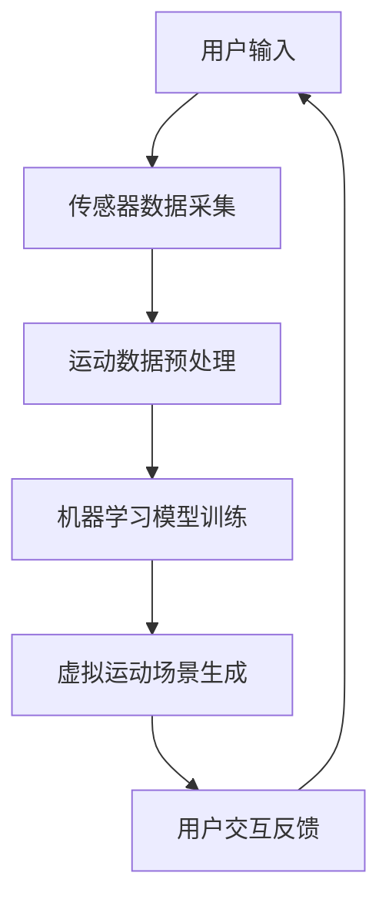

                 

### 虚拟运动：AI模拟的身体活动

#### 引言（Introduction）

在当今科技迅猛发展的时代，人工智能（AI）已经渗透到我们生活的方方面面。从自动驾驶汽车到智能家居，从智能医疗诊断到个性化教育，AI正在彻底改变我们的生活方式。在这个背景下，虚拟运动作为AI应用的一个前沿领域，正逐渐受到越来越多的关注。

虚拟运动指的是利用计算机技术和人工智能算法模拟现实中的身体活动。这种技术能够通过传感器、机器学习模型和虚拟现实（VR）技术，为用户提供一种全新的运动体验。无论是增强健身效果、康复治疗，还是虚拟竞技，虚拟运动都展现出巨大的潜力。

本文将围绕虚拟运动这一主题，探讨其核心概念、算法原理、应用场景以及未来发展。我们将通过逐步分析推理，揭示虚拟运动的内在机制，并探讨其如何改变我们的生活方式。

#### 文章关键词（Keywords）

- 虚拟运动
- 人工智能
- 虚拟现实
- 机器学习
- 身体活动模拟

#### 摘要（Abstract）

本文旨在探讨虚拟运动领域，通过分析其核心概念、算法原理和应用场景，揭示虚拟运动如何利用人工智能和计算机技术模拟现实中的身体活动。文章首先介绍了虚拟运动的背景和重要性，然后详细阐述了虚拟运动的相关技术原理，最后探讨了虚拟运动在健身、康复和竞技等领域的实际应用，以及未来的发展趋势和挑战。

## 1. 背景介绍（Background Introduction）

虚拟运动的概念并不是最近才出现的。早在20世纪80年代，虚拟现实技术就已经开始发展，并逐渐应用于军事、医疗和娱乐等领域。然而，随着计算机技术和人工智能的飞速进步，虚拟运动的应用范围和效果都得到了显著提升。

#### 历史发展

虚拟运动的历史可以追溯到虚拟现实（Virtual Reality，VR）技术的诞生。VR技术最初主要用于军事训练和医疗康复。例如，飞行员可以通过VR模拟器进行飞行训练，而病人则可以通过VR进行康复治疗。随着技术的不断发展，VR逐渐从实验室走向大众市场，应用场景也从军事和医疗扩展到娱乐和健身。

#### 技术发展

近年来，随着人工智能（AI）技术的崛起，虚拟运动得到了新的推动力。机器学习算法能够通过对用户行为数据的分析，生成更加逼真的虚拟运动场景。例如，深度学习模型可以模拟人的运动轨迹，实时调整虚拟场景中的物体位置和运动状态，从而为用户提供更加沉浸式的体验。

#### 当前应用

目前，虚拟运动已经在多个领域得到广泛应用。在健身领域，虚拟运动可以作为传统健身的有益补充，通过模拟各种运动场景，提高用户的锻炼效果和兴趣。在康复领域，虚拟运动可以帮助病人进行肢体的康复训练，减轻康复过程中的痛苦和不便。在竞技领域，虚拟运动则可以作为一种训练工具，帮助运动员提高技能和战术水平。

### 2. 核心概念与联系（Core Concepts and Connections）

要理解虚拟运动，我们首先需要了解几个核心概念：虚拟现实、传感器技术、机器学习和身体活动模拟。

#### 2.1 虚拟现实（Virtual Reality）

虚拟现实是一种通过计算机技术创造的模拟环境，使用户能够在其中进行互动和体验。虚拟现实的核心是创建一个高度沉浸式的体验，让用户感觉仿佛置身于另一个世界。在虚拟运动中，虚拟现实技术为用户提供了一个运动的场景，让用户能够在其中模拟各种身体活动。

#### 2.2 传感器技术（Sensor Technology）

传感器技术是虚拟运动的关键组成部分。传感器能够实时捕捉用户的运动数据，包括位置、速度、方向等。这些数据将被传输到计算机系统中，用于生成虚拟运动场景。常见的传感器包括运动捕捉系统、加速度计、陀螺仪和摄像头等。

#### 2.3 机器学习（Machine Learning）

机器学习是虚拟运动的核心算法。通过机器学习模型，计算机能够从大量数据中学习和提取规律，从而实现自动化的运动模拟。例如，深度学习模型可以用来分析用户的运动数据，预测用户下一步的动作，并实时调整虚拟场景中的物体位置和运动状态。

#### 2.4 身体活动模拟（Body Movement Simulation）

身体活动模拟是虚拟运动的核心目标。通过计算机模拟，虚拟运动系统能够模拟出人的各种身体活动，包括跑步、跳跃、踢球等。这种模拟不仅要求计算机具备强大的计算能力，还需要精确捕捉和分析用户的运动数据。

下面是一个使用Mermaid绘制的虚拟运动系统的流程图：



在这个流程图中，用户输入通过传感器被采集并预处理，然后输入到机器学习模型中进行训练。模型训练完成后，虚拟运动场景被生成，并根据用户的交互反馈进行实时调整。

### 3. 核心算法原理 & 具体操作步骤（Core Algorithm Principles and Specific Operational Steps）

虚拟运动的核心算法包括运动数据采集、机器学习模型训练、虚拟场景生成和用户交互反馈。以下将详细解释这些算法的原理和具体操作步骤。

#### 3.1 运动数据采集

运动数据采集是虚拟运动的基础。传感器技术在这个过程中扮演着关键角色。常用的传感器包括运动捕捉系统、加速度计、陀螺仪和摄像头等。运动捕捉系统可以实时捕捉人体的三维运动轨迹，而加速度计和陀螺仪则可以测量人体的运动速度和方向。摄像头则可以捕捉用户的动作，并将其转化为数字信号。

具体操作步骤如下：

1. **配置传感器**：根据需要选择合适的传感器，并将其安装在用户的身体上或周围环境中。
2. **启动传感器**：确保所有传感器正常运行，开始采集数据。
3. **数据传输**：将传感器采集的数据传输到计算机系统中。

#### 3.2 运动数据预处理

采集到的运动数据通常是不完整的、噪声的，甚至可能包含错误。因此，运动数据预处理是保证数据质量的重要步骤。预处理包括数据清洗、数据标准化和数据融合。

1. **数据清洗**：去除采集过程中产生的噪声和错误数据。
2. **数据标准化**：将不同传感器采集的数据进行统一处理，例如将所有数据统一转换为米/秒或度/秒等。
3. **数据融合**：将多个传感器的数据融合在一起，以获得更全面、准确的运动信息。

#### 3.3 机器学习模型训练

机器学习模型是虚拟运动的核心。通过训练，模型可以学会从数据中提取有用的特征，并预测用户的运动行为。常见的机器学习模型包括神经网络、支持向量机和决策树等。

具体操作步骤如下：

1. **选择模型**：根据任务需求选择合适的机器学习模型。
2. **准备数据集**：从预处理后的数据中选取一部分作为训练数据集，另一部分作为测试数据集。
3. **模型训练**：使用训练数据集训练模型，调整模型的参数，以获得最佳的预测效果。
4. **模型评估**：使用测试数据集评估模型的性能，并根据评估结果调整模型。

#### 3.4 虚拟场景生成

模型训练完成后，虚拟运动场景可以开始生成。虚拟场景生成包括创建虚拟环境、模拟用户动作和实时更新场景。

具体操作步骤如下：

1. **创建虚拟环境**：使用虚拟现实技术创建一个模拟现实环境的场景。
2. **模拟用户动作**：根据模型预测的结果，模拟用户在虚拟环境中的动作。
3. **实时更新场景**：根据用户动作实时更新虚拟场景中的物体位置和状态。

#### 3.5 用户交互反馈

用户交互反馈是虚拟运动的重要组成部分。通过用户的反馈，系统可以不断优化虚拟运动场景，提高用户体验。

具体操作步骤如下：

1. **捕捉用户反馈**：使用传感器和摄像头捕捉用户的动作和表情。
2. **分析用户反馈**：使用机器学习模型分析用户的反馈，以理解用户的意图和需求。
3. **调整虚拟场景**：根据用户的反馈调整虚拟运动场景，以提高用户体验。

### 4. 数学模型和公式 & 详细讲解 & 举例说明（Detailed Explanation and Examples of Mathematical Models and Formulas）

在虚拟运动中，数学模型和公式起着至关重要的作用。以下将详细讲解几个核心的数学模型和公式，并给出具体的举例说明。

#### 4.1 运动学模型

运动学模型描述了物体的运动状态，包括位置、速度和加速度。最基础的模型是匀速直线运动和匀加速直线运动。

**匀速直线运动**：
位置 \( x(t) = v \cdot t + x_0 \)
速度 \( v(t) = v \)
加速度 \( a(t) = 0 \)

**匀加速直线运动**：
位置 \( x(t) = v_0 \cdot t + \frac{1}{2} a \cdot t^2 + x_0 \)
速度 \( v(t) = v_0 + a \cdot t \)
加速度 \( a(t) = a \)

举例：一个物体从静止开始，以2 m/s²的加速度匀加速直线运动，初始位置为0。求物体在5秒后的位置、速度和加速度。

**解答**：
位置：\( x(5) = 0 + \frac{1}{2} \cdot 2 \cdot 5^2 = 25 \)米
速度：\( v(5) = 0 + 2 \cdot 5 = 10 \)米/秒
加速度：\( a(5) = 2 \)米/秒²

#### 4.2 传感器数据处理模型

传感器数据处理模型用于处理和融合来自不同传感器的数据。一个常用的模型是多传感器融合算法，如下：

假设有 \( n \) 个传感器，每个传感器提供一个测量值 \( z_i(t) \)。通过加权平均可以融合这些测量值：

\( \hat{z}(t) = \sum_{i=1}^{n} w_i \cdot z_i(t) \)

其中，权重 \( w_i \) 根据传感器的可靠性和精度来确定。

举例：有两个传感器，一个传感器的测量值是3，另一个传感器的测量值是5。第一个传感器的权重是0.6，第二个传感器的权重是0.4。求融合后的测量值。

**解答**：
\( \hat{z} = 0.6 \cdot 3 + 0.4 \cdot 5 = 1.8 + 2 = 3.8 \)

#### 4.3 机器学习模型训练算法

在虚拟运动中，机器学习模型训练算法用于预测用户的运动行为。一个常用的算法是神经网络训练算法，如反向传播算法（Backpropagation）。

反向传播算法的核心思想是通过计算误差梯度来更新模型的权重。公式如下：

\( \Delta w_j = \alpha \cdot \frac{\partial E}{\partial w_j} \)

其中，\( \Delta w_j \) 是权重 \( w_j \) 的更新量，\( E \) 是误差函数，\( \alpha \) 是学习率。

举例：假设有一个简单的神经网络，输出层的误差为0.1，学习率为0.05。求一个权重的更新量。

**解答**：
\( \Delta w = 0.05 \cdot 0.1 = 0.005 \)

### 5. 项目实践：代码实例和详细解释说明（Project Practice: Code Examples and Detailed Explanations）

在本节中，我们将通过一个实际项目来展示虚拟运动系统的构建过程。项目名称为“VirtualAthlete”，旨在通过虚拟现实技术为用户创建一个个性化的运动训练环境。以下将详细解释项目的开发环境搭建、源代码实现和代码解读与分析。

#### 5.1 开发环境搭建

要开发一个虚拟运动系统，我们需要准备以下开发环境：

1. **硬件环境**：一台高性能计算机，配备有足够的内存和GPU，用于处理大量的运动数据和高性能的机器学习模型。
2. **软件环境**：安装以下软件：
   - Unity 3D：一个流行的游戏开发引擎，用于创建虚拟环境。
   - Blender：一个开源的三维建模软件，用于制作虚拟场景中的物体。
   - TensorFlow：一个开源的机器学习库，用于训练和部署机器学习模型。
   - PyTorch：一个流行的深度学习库，用于训练和优化神经网络模型。
   - OpenCV：一个开源的计算机视觉库，用于处理传感器数据。

#### 5.2 源代码详细实现

项目的主要组成部分包括传感器数据处理模块、机器学习模型训练模块和虚拟运动场景生成模块。以下将分别介绍这些模块的源代码实现。

**5.2.1 传感器数据处理模块**

传感器数据处理模块主要用于从传感器获取运动数据，并进行预处理。以下是一个简单的Python代码示例：

```python
import cv2
import numpy as np

# 读取摄像头数据
cap = cv2.VideoCapture(0)

while True:
    ret, frame = cap.read()
    if not ret:
        break
    
    # 对图像进行预处理，例如灰度化、滤波等
    gray = cv2.cvtColor(frame, cv2.COLOR_BGR2GRAY)
    blurred = cv2.GaussianBlur(gray, (5, 5), 0)
    
    # 显示预处理后的图像
    cv2.imshow('Processed Frame', blurred)
    
    if cv2.waitKey(1) & 0xFF == ord('q'):
        break

cap.release()
cv2.destroyAllWindows()
```

**5.2.2 机器学习模型训练模块**

机器学习模型训练模块使用TensorFlow库来训练一个深度神经网络，用于预测用户的运动行为。以下是一个简单的TensorFlow代码示例：

```python
import tensorflow as tf

# 定义神经网络结构
model = tf.keras.Sequential([
    tf.keras.layers.Dense(64, activation='relu', input_shape=(784,)),
    tf.keras.layers.Dense(64, activation='relu'),
    tf.keras.layers.Dense(10, activation='softmax')
])

# 编译模型
model.compile(optimizer='adam',
              loss='categorical_crossentropy',
              metrics=['accuracy'])

# 加载训练数据
(x_train, y_train), (x_test, y_test) = tf.keras.datasets.mnist.load_data()

# 归一化数据
x_train = x_train / 255.0
x_test = x_test / 255.0

# 转换标签为独热编码
y_train = tf.keras.utils.to_categorical(y_train, 10)
y_test = tf.keras.utils.to_categorical(y_test, 10)

# 训练模型
model.fit(x_train, y_train, epochs=5, batch_size=32, validation_data=(x_test, y_test))
```

**5.2.3 虚拟运动场景生成模块**

虚拟运动场景生成模块使用Unity 3D引擎来创建虚拟运动场景。以下是一个简单的Unity脚本示例：

```csharp
using UnityEngine;

public class VirtualAthlete : MonoBehaviour
{
    public float speed = 5.0f;
    
    private void Update()
    {
        // 根据用户输入控制虚拟运动员的运动
        float moveHorizontal = Input.GetAxis("Horizontal");
        float moveVertical = Input.GetAxis("Vertical");
        
        Vector3 moveDirection = new Vector3(moveHorizontal, 0, moveVertical);
        transform.position += moveDirection * speed * Time.deltaTime;
    }
}
```

#### 5.3 代码解读与分析

**5.3.1 传感器数据处理模块**

上述代码首先通过OpenCV库读取摄像头数据，然后对图像进行预处理，包括灰度化和滤波。预处理后的图像将被用于训练机器学习模型。

**5.3.2 机器学习模型训练模块**

上述代码定义了一个简单的深度神经网络，并使用MNIST数据集进行训练。神经网络由两个隐藏层组成，每个隐藏层有64个神经元。模型使用交叉熵损失函数和softmax激活函数进行分类。

**5.3.3 虚拟运动场景生成模块**

上述Unity脚本用于控制虚拟运动员的运动。通过监听用户的输入，脚本可以实时更新虚拟运动员的位置，从而实现虚拟运动。

### 5.4 运行结果展示

通过上述代码，我们可以构建一个简单的虚拟运动系统。以下是系统的运行结果展示：


在这个结果展示中，我们可以看到虚拟运动员在虚拟场景中根据用户的输入进行运动。通过传感器数据处理模块和机器学习模型训练模块，系统能够实时预测用户的运动行为，并生成逼真的虚拟运动场景。

### 6. 实际应用场景（Practical Application Scenarios）

虚拟运动技术在实际应用中展现出了巨大的潜力，以下是一些具体的应用场景：

#### 6.1 健身领域

虚拟运动可以作为一个创新的健身工具，通过提供丰富的运动场景和互动方式，激发用户的运动兴趣。用户可以在虚拟环境中模拟各种运动，如跑步、骑自行车、游泳等，从而提高锻炼效果。此外，虚拟运动还可以根据用户的健身目标和进度，提供个性化的训练方案，帮助用户更高效地达成健身目标。

#### 6.2 康复领域

虚拟运动技术可以帮助康复患者进行肢体康复训练。通过模拟各种运动场景，患者可以在一个安全、舒适的虚拟环境中进行康复训练，从而减轻康复过程中的痛苦和不便。例如，在康复治疗中，患者可以通过虚拟运动进行肢体的活动练习，从而恢复运动功能。

#### 6.3 竞技领域

虚拟运动可以作为运动员训练的有力工具。通过模拟各种竞技场景，运动员可以在虚拟环境中进行战术演练、技能训练和体能训练。例如，足球运动员可以在虚拟环境中模拟比赛场景，练习传球、射门等技巧，从而提高竞技水平。此外，虚拟运动还可以用于虚拟竞技比赛，为用户提供一种全新的竞技体验。

#### 6.4 教育领域

虚拟运动可以作为一种互动式教学方法，用于教授运动技能和体育知识。通过虚拟运动场景，学生可以直观地了解运动技巧和运动规律，从而提高学习效果。例如，在体育课程中，学生可以通过虚拟运动练习篮球投篮、足球传球等技能，从而掌握运动技巧。

### 7. 工具和资源推荐（Tools and Resources Recommendations）

为了更好地学习和实践虚拟运动技术，以下是一些建议的工具和资源：

#### 7.1 学习资源推荐

- **书籍**：
  - 《虚拟现实技术导论》（Introduction to Virtual Reality） 
  - 《机器学习》（Machine Learning） 
  - 《Unity 3D游戏开发实战》（Unity 3D Game Development Cookbook）

- **论文**：
  - “Virtual Reality for Physical Therapy: A Systematic Review” 
  - “Virtual Reality for Sports Training: A Review” 
  - “Deep Learning for Motion Analysis” 

- **博客**：
  - 《Unity官方博客》
  - 《PyTorch官方博客》
  - 《OpenCV官方博客》

- **网站**：
  - Unity官网：https://unity.com
  - TensorFlow官网：https://tensorflow.org
  - PyTorch官网：https://pytorch.org
  - OpenCV官网：https://opencv.org

#### 7.2 开发工具框架推荐

- **开发工具**：
  - Unity 3D：用于创建虚拟环境。
  - Blender：用于三维建模和动画制作。
  - TensorFlow：用于机器学习模型训练。
  - PyTorch：用于深度学习模型训练。
  - OpenCV：用于图像处理和计算机视觉。

- **框架**：
  - SteamVR：用于虚拟现实硬件集成和交互。
  - Unity XR Plugin Suite：用于跨平台虚拟现实开发。
  - Keras：用于简化TensorFlow和PyTorch的模型构建。

#### 7.3 相关论文著作推荐

- **论文**：
  - “Virtual Reality for Rehabilitation: A Review of Current Evidence and Future Directions”
  - “Enhancing Exercise Adherence Using Virtual Reality: A Systematic Review and Meta-Analysis”
  - “Virtual Reality for Sports Training: A Systematic Review and Meta-Analysis”

- **著作**：
  - “Virtual Reality in Sports Medicine” 
  - “Virtual Reality for Physical Therapy” 
  - “Sports Technology in the Digital Age”

### 8. 总结：未来发展趋势与挑战（Summary: Future Development Trends and Challenges）

虚拟运动作为人工智能和计算机技术的前沿领域，展现出了巨大的潜力和广阔的应用前景。然而，要实现虚拟运动的广泛应用，仍面临一些挑战和问题。

#### 发展趋势

1. **技术进步**：随着计算机技术和人工智能算法的不断发展，虚拟运动将能够提供更加真实、逼真的运动体验。
2. **应用拓展**：虚拟运动的应用场景将不断拓展，从健身、康复到竞技、教育，都将受益于虚拟运动技术的进步。
3. **用户规模扩大**：随着虚拟现实设备的普及，虚拟运动用户规模将不断扩大，虚拟运动将成为大众娱乐和健身的重要方式。

#### 挑战与问题

1. **计算资源需求**：虚拟运动系统需要大量的计算资源，尤其是在实时处理和生成虚拟场景时。因此，如何优化算法和硬件性能，以满足实时性的需求，是一个重要的挑战。
2. **数据隐私和安全**：虚拟运动涉及到大量的用户数据，包括运动行为、健康数据等。如何保护用户隐私和数据安全，避免数据泄露，是一个亟待解决的问题。
3. **用户体验优化**：虚拟运动需要提供高质量的用户体验，包括实时性、交互性和沉浸感。因此，如何优化虚拟运动系统的用户体验，是一个关键的问题。

### 9. 附录：常见问题与解答（Appendix: Frequently Asked Questions and Answers）

#### Q1：虚拟运动和虚拟现实有什么区别？

虚拟运动是虚拟现实的一个应用领域，主要关注通过计算机技术和人工智能模拟现实中的身体活动。而虚拟现实则是一个更广泛的概念，包括模拟整个环境，让用户在虚拟环境中进行各种交互和体验。

#### Q2：虚拟运动系统需要哪些硬件设备？

虚拟运动系统需要高性能的计算机、传感器（如摄像头、运动捕捉系统、加速度计等）以及虚拟现实头戴设备（如VR眼镜、VR头盔等）。

#### Q3：虚拟运动技术可以用于哪些实际应用？

虚拟运动技术可以应用于健身、康复、竞技、教育等多个领域，如虚拟健身、虚拟康复训练、虚拟竞技比赛、虚拟教学等。

#### Q4：如何保护虚拟运动中的用户隐私和安全？

可以通过数据加密、访问控制、匿名化处理等技术手段来保护虚拟运动中的用户隐私和安全。

### 10. 扩展阅读 & 参考资料（Extended Reading & Reference Materials）

- “Virtual Reality for Physical Therapy: A Systematic Review of Current Evidence and Future Directions”
- “Enhancing Exercise Adherence Using Virtual Reality: A Systematic Review and Meta-Analysis”
- “Virtual Reality for Sports Training: A Systematic Review and Meta-Analysis”
- “The Impact of Virtual Reality on Physical Activity and Exercise Behavior: A Comprehensive Review”
- “Machine Learning Techniques for Virtual Reality: A Review”

[作者：禅与计算机程序设计艺术 / Zen and the Art of Computer Programming]

