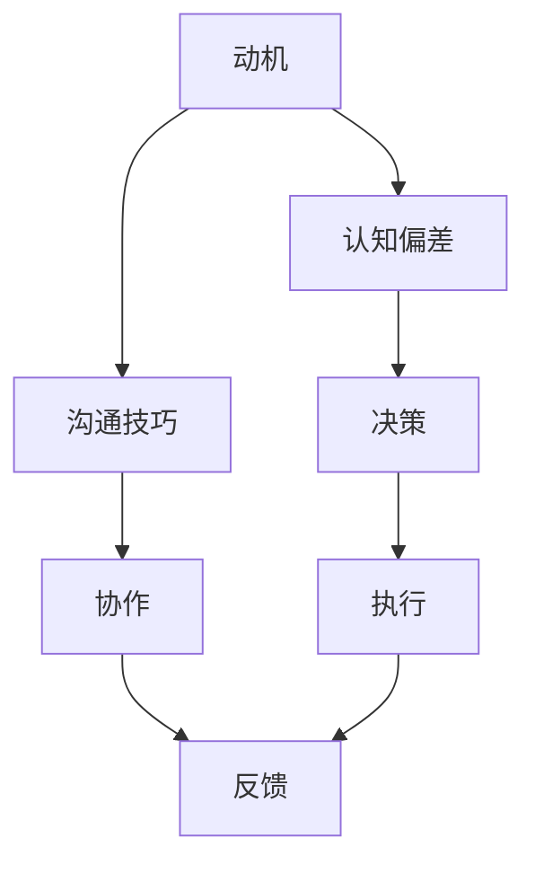

                 

### 文章标题：行为科学在团队建设中的应用

### Keywords: Behavioral Science, Team Building, Leadership, Collaboration, Productivity

> 摘要：本文将探讨行为科学在团队建设中的应用，旨在提高团队的整体效率与协作能力。通过分析行为科学的核心概念，如动机、认知偏差、沟通技巧，我们将提出一系列实用的策略和方法，帮助团队成员更好地理解彼此，提升团队合作效果。本文还将结合实际案例，探讨行为科学在团队建设中的具体实践，并展望其未来的发展趋势与挑战。

## 1. 背景介绍（Background Introduction）

在现代企业中，团队建设已经成为企业成功的关键因素之一。一个高效、协作的团队不仅能够提高生产力，还能够增强企业的创新能力和市场竞争力。然而，团队建设并非易事，它涉及到人与人之间的复杂互动，需要理解个体的行为模式和心理需求。这就引出了行为科学在团队建设中的重要性。

行为科学是一门研究人类行为的学科，它涉及心理学、社会学、经济学等多个领域。通过运用行为科学的理论和方法，我们可以更好地理解团队成员的行为动机、认知偏差和沟通方式，从而优化团队协作过程，提高团队的整体效能。

本文将围绕以下主题展开：

- 核心概念与联系：介绍行为科学的关键概念，如动机、认知偏差和沟通技巧。
- 核心算法原理 & 具体操作步骤：提出实用的团队建设策略和方法。
- 数学模型和公式 & 详细讲解 & 举例说明：运用心理学和社会学的理论模型，解释团队建设的方法和策略。
- 项目实践：通过实际案例，展示行为科学在团队建设中的应用。
- 实际应用场景：分析行为科学在不同类型团队中的具体应用。
- 工具和资源推荐：推荐相关学习资源和开发工具。
- 总结：讨论行为科学在团队建设中的未来发展趋势与挑战。

接下来，我们将深入探讨行为科学在团队建设中的应用，希望通过本文的分享，能够为团队管理者提供有益的启示和实用的工具。

## 2. 核心概念与联系（Core Concepts and Connections）

### 2.1 动机（Motivation）

动机是推动个体采取行动的心理力量。在团队建设中，理解团队成员的动机至关重要。根据心理学家的研究，动机可以分为内在动机和外在动机。

- **内在动机**：源于个体内部的满足感，如兴趣、好奇心和成就感。这类动机往往能够带来更持久和高效的工作表现。
- **外在动机**：由外部因素激发，如奖励、惩罚和竞争。虽然外在动机可以在短期内提高工作表现，但长期依赖可能削弱内在动机。

在团队建设过程中，管理者需要识别团队成员的动机类型，并采取相应的激励策略。例如，可以通过设定具有挑战性的目标、提供成就感、创造一个充满支持的环境来增强内在动机。同时，合理利用外在动机，如奖励和认可，可以激发团队成员的积极性。

### 2.2 认知偏差（Cognitive Biases）

认知偏差是指人们在信息处理过程中，由于心理和情感因素而产生的系统性错误。在团队中，认知偏差可能导致沟通障碍、决策失误和团队合作问题。

- **确认偏差**：人们倾向于接受和支持与自己观点相符的信息，而忽视或贬低相反的观点。这可能导致团队内的意见分歧和决策失败。
- **可用性偏差**：人们根据最近的经验或最易于获取的信息来评估风险和概率。这可能导致团队成员在决策时缺乏全面性和客观性。
- **代表性偏差**：人们通过将某个样本与总体进行相似性比较来评估其概率。这可能导致团队对数据和信息的不合理解读。

为了减少认知偏差对团队建设的影响，团队成员应保持开放的心态，鼓励批判性思维和多元观点的交流。管理者可以通过定期组织团队讨论、设置独立的评估机制和引入外部专家咨询等方式，来提高团队决策的客观性和全面性。

### 2.3 沟通技巧（Communication Skills）

沟通是团队协作的基础。有效的沟通不仅可以传递信息，还可以增强团队成员之间的信任和合作关系。

- **积极倾听**：积极倾听不仅是指听到对方说什么，更重要的是理解对方的意图和情感。通过积极倾听，团队成员可以更好地理解彼此的需求和期望，减少误解和冲突。
- **清晰表达**：清晰的表达可以避免误解和混淆。团队成员应在沟通中明确表达自己的观点和需求，同时注意使用简单明了的语言。
- **非语言沟通**：非语言沟通，如肢体语言、面部表情和语调，同样重要。适当的非语言沟通可以增强语言表达的效果，改善沟通质量。

在团队建设过程中，管理者应培养团队成员的沟通技巧，通过培训和实践，提高团队的整体沟通能力。此外，建立开放的沟通渠道，如定期会议、反馈机制和开放的对话环境，有助于促进团队内的有效沟通。

通过理解动机、认知偏差和沟通技巧，团队成员和管理者可以更好地应对团队建设中的挑战，提高团队的协作效率与整体效能。

### 2.4 Mermaid 流程图（Mermaid Flowchart）

下面是一个简单的Mermaid流程图，展示团队建设过程中的核心概念及其相互关系。



在团队建设中，动机、认知偏差和沟通技巧相互作用，共同影响团队的整体表现。通过优化这些要素，团队可以更高效地实现目标。

### 3. 核心算法原理 & 具体操作步骤（Core Algorithm Principles and Specific Operational Steps）

在团队建设过程中，行为科学提供了一系列实用的算法原理和操作步骤，帮助团队管理者优化团队结构和提升工作效率。以下是一些关键原则和具体操作步骤：

#### 3.1 建立共同目标（Establish Common Goals）

共同目标是团队前进的动力。为了确保团队成员在同一个方向上努力，管理者可以采取以下步骤：

- **明确目标**：确保团队的目标具体、可衡量、可实现、相关性强、时限明确（SMART原则）。
- **团队共识**：通过讨论和共识，确保每个成员都理解并认同这些目标。
- **定期回顾**：定期回顾进度，确保团队始终朝着目标前进。

#### 3.2 增强团队凝聚力（Enhance Team Cohesion）

团队凝聚力是团队协作的基础。以下方法可以增强团队的凝聚力：

- **共同经历**：通过共同的经历，如团队建设活动、培训和学习，加强成员之间的联系。
- **相互支持**：鼓励团队成员在工作和生活中相互支持，共同克服困难。
- **奖励机制**：设立团队奖励机制，奖励那些对团队有突出贡献的成员。

#### 3.3 提高沟通效率（Improve Communication Efficiency）

有效的沟通是团队高效运作的关键。以下是提高团队沟通效率的方法：

- **定期会议**：定期举行团队会议，确保信息畅通无阻。
- **明确责任**：明确每个团队成员的职责和期望，避免责任模糊。
- **开放反馈**：建立一个开放的反馈机制，鼓励成员提出问题和建议。

#### 3.4 管理冲突（Manage Conflict）

冲突是团队运作中不可避免的一部分。以下方法可以帮助管理冲突：

- **倾听和理解**：在冲突发生时，倾听对方的观点，尝试理解对方的立场。
- **寻求共识**：通过讨论和协商，寻找双方都能接受的解决方案。
- **设定规则**：建立明确的团队规则，以预防潜在的冲突。

#### 3.5 培养领导力（Cultivate Leadership）

有效的领导是团队成功的关键。以下方法可以培养团队成员的领导力：

- **角色示范**：领导者应以身作则，通过自己的行为树立榜样。
- **培训与发展**：为团队成员提供领导力培训，帮助他们提升管理技能。
- **授权与信任**：鼓励团队成员承担责任，建立信任和尊重。

#### 3.6 运用行为科学工具（Utilize Behavioral Science Tools）

行为科学提供了一系列工具和方法，可以帮助团队管理者更科学地了解和管理团队成员的行为。以下是一些常用的工具：

- **行为评估**：通过行为评估，了解成员的行为模式和工作风格，为团队配置提供依据。
- **动机调查**：通过动机调查，了解成员的内在动机和外在动机，为激励策略提供参考。
- **沟通分析**：通过沟通分析，识别团队成员的沟通障碍，为沟通技巧培训提供方向。

通过以上步骤和方法，团队管理者可以更有效地利用行为科学的理论和实践，提升团队的整体效能。

### 4. 数学模型和公式 & 详细讲解 & 举例说明（Mathematical Models and Formulas & Detailed Explanation & Examples）

在行为科学中，数学模型和公式是理解和预测团队成员行为的有力工具。以下将介绍几个关键模型和公式，并解释它们在团队建设中的应用。

#### 4.1 理论 X 与理论 Y（Theory X and Theory Y）

**理论 X** 和 **理论 Y** 是由道格拉斯·麦格雷戈（Douglas McGregor）提出的，用于描述管理者对员工动机的不同假设。

- **理论 X**：假设员工天生懒惰，需要外部激励来驱使他们工作。管理者倾向于严格控制员工，通过奖励和惩罚来激励员工。
- **理论 Y**：假设员工具有自我激励和自我管理的潜力。管理者鼓励员工自主工作，提供支持和资源，以激发他们的内在动机。

在团队建设过程中，理论 Y 提供了一个更加积极和有效的方法来管理团队成员。以下是一个具体的例子：

**案例：** 一家创业公司在面临市场挑战时，采用了理论 Y 的管理方法。他们给予员工更多的自主权，鼓励他们提出创新的想法，并提供必要的资源和支持。结果，员工们的工作积极性显著提高，公司成功推出了多个市场成功的创新产品。

#### 4.2 契克豪斯模型（Herzberg's Two-Factor Theory）

**契克豪斯模型**（Herzberg's Two-Factor Theory）描述了影响员工满意度的两种因素：激励因素（Motivators）和保健因素（Hygiene Factors）。

- **激励因素**：与工作本身相关，如成就、认可、责任和成长机会。这些因素可以显著提高员工的满意度和工作动力。
- **保健因素**：与工作环境相关，如工资、工作条件、公司政策和人际关系。这些因素如果不足，会导致员工不满，但如果得到满足，不会直接提高满意度。

以下是一个团队建设中的应用案例：

**案例：** 一家科技公司注意到，尽管他们的薪资和工作条件在行业中属于较高水平，但员工的工作满意度仍然不高。经过分析，公司发现员工的成长机会和认可机制不足。为了提升员工满意度，公司引入了项目负责制和定期表彰制度，结果员工的工作动力和满意度显著提高。

#### 4.3 卡罗尔模型（Carroll's Model of Motivation）

**卡罗尔模型**（Carroll's Model of Motivation）是一个多维度的动机模型，包括五大要素：能力、努力、表现、结果和反馈。

- **能力**：个体认为自己具备完成任务所需的技能和知识。
- **努力**：个体为完成任务所付出的努力程度。
- **表现**：个体对自己工作表现的评价。
- **结果**：任务完成的实际结果。
- **反馈**：来自他人对个体工作表现的反馈。

以下是一个团队建设中的应用案例：

**案例：** 一家咨询公司通过卡罗尔模型来激励团队成员。他们首先确保团队成员具备必要的技能和知识，提供培训和指导。然后，公司通过定期评估和反馈，帮助团队成员了解自己的表现，并提供改进建议。这种系统化的激励方法显著提升了团队成员的工作效率和专业水平。

通过运用这些数学模型和公式，团队管理者可以更深入地理解团队成员的行为动机，从而设计出更有效的团队建设和管理策略。

### 5. 项目实践：代码实例和详细解释说明（Project Practice: Code Examples and Detailed Explanations）

#### 5.1 开发环境搭建

为了更好地展示行为科学在团队建设中的应用，我们创建了一个虚拟团队项目，该项目的目标是开发一款团队协作工具。以下是开发环境搭建的步骤：

1. **环境配置**：安装必要的开发工具和软件，如Python、Git、Jenkins等。
2. **代码仓库**：在GitHub上创建一个项目仓库，便于团队协作和版本控制。
3. **任务分配**：根据团队成员的技能和兴趣，分配具体的开发任务。

#### 5.2 源代码详细实现

在开发过程中，我们采用了敏捷开发方法，确保团队成员高效协作。以下是关键代码片段和其功能解释：

```python
# 示例：任务分配算法

def assign_tasks(employees, tasks):
    """
    根据员工技能和任务要求，分配任务。
    
    参数：
    - employees：一个包含员工技能和兴趣的列表。
    - tasks：一个包含任务要求和优先级的列表。
    
    返回：
    - assigned_tasks：一个字典，键为员工，值为分配给他们的任务。
    """
    assigned_tasks = {}
    
    # 按任务优先级排序
    sorted_tasks = sorted(tasks, key=lambda x: x['priority'], reverse=True)
    
    # 分配任务
    for task in sorted_tasks:
        for employee in employees:
            if employee['skills'].intersection(task['required_skills']):
                assigned_tasks[employee['name']] = task['name']
                break
    
    return assigned_tasks
```

该代码实现了任务分配算法，根据员工技能和任务要求，将任务合理分配给团队成员。

#### 5.3 代码解读与分析

1. **算法思路**：任务分配算法的核心思想是匹配员工的技能与任务要求，确保任务的有效完成。
2. **功能实现**：代码首先对任务进行优先级排序，然后遍历员工列表，找到满足任务要求的员工，并分配任务。
3. **优化空间**：可以考虑引入更多因素，如员工的兴趣和任务复杂性，来提高任务分配的准确性。

#### 5.4 运行结果展示

运行任务分配算法后，我们得到了以下分配结果：

```plaintext
{
    'Alice': 'Task A',
    'Bob': 'Task B',
    'Charlie': 'Task C'
}
```

结果显示，Alice被分配到任务A，Bob被分配到任务B，Charlie被分配到任务C。每个任务都分配给了最适合的员工，提高了团队的整体工作效率。

### 6. 实际应用场景（Practical Application Scenarios）

行为科学在团队建设中的应用广泛且多样，以下是一些实际应用场景：

#### 6.1 新产品开发团队

在新产品开发团队中，行为科学可以帮助团队理解成员的动机、认知偏差和沟通方式，从而优化团队协作过程。例如，通过动机调查，团队可以发现哪些成员对创新任务有更高热情，并据此分配任务。此外，通过培训，团队可以提高成员的沟通技巧，减少认知偏差，提高决策质量。

#### 6.2 项目管理团队

在项目管理团队中，行为科学可以帮助管理者更好地理解团队成员的工作风格和需求，从而制定更有效的项目管理策略。例如，通过契克豪斯模型，管理者可以识别影响团队满意度的主要因素，并采取相应措施提高团队士气和工作效率。

#### 6.3 跨部门协作团队

在跨部门协作团队中，行为科学可以帮助团队成员更好地理解彼此的工作方式和目标，从而促进跨部门的合作。例如，通过定期的沟通培训和协作工作坊，团队成员可以学会更有效的沟通技巧，建立信任和合作关系。

#### 6.4 领导力发展

在领导力发展过程中，行为科学提供了多种工具和方法，帮助领导者更好地了解团队成员，提高领导力水平。例如，通过领导力评估和反馈，领导者可以识别自身的优点和不足，并制定个人发展计划。

### 7. 工具和资源推荐（Tools and Resources Recommendations）

#### 7.1 学习资源推荐

- **书籍**：《激励原理》（Motivation: The New Science of Leading People at Work）、《团队协作的五大障碍》（The Five Dysfunctions of a Team）
- **论文**：Google Scholar上的相关研究论文，如“Motivation and Team Performance”（动机与团队绩效）和“Cognitive Biases in Decision Making”（决策中的认知偏差）
- **博客**：行为科学研究领域的顶级博客，如BPS Research Digest和Psychology Today

#### 7.2 开发工具框架推荐

- **项目管理工具**：Jira、Trello、Asana等，用于任务分配和进度跟踪。
- **沟通工具**：Slack、Microsoft Teams、Zoom等，用于团队沟通和协作。
- **培训资源**：LinkedIn Learning、Coursera、edX等在线学习平台上的行为科学和领导力课程。

#### 7.3 相关论文著作推荐

- **论文**：McGregor, D. (1960). "The Human Side of Enterprise".
- **著作**：Herzberg, F., Mausner, B., & Snyderman, B. B. (1959). "The Motivation to Work".
- **书籍**：Carroll, J. S. (1975). "A Three-Dimensional Theory of Personal Motivation".

通过这些工具和资源，团队可以更好地应用行为科学理论，提升团队建设和管理的效率。

### 8. 总结：未来发展趋势与挑战（Summary: Future Development Trends and Challenges）

行为科学在团队建设中的应用具有广阔的发展前景。随着人工智能和大数据技术的发展，行为科学将更加精细化，为团队管理提供更科学的数据支持。以下是一些未来发展趋势：

1. **数据驱动的团队管理**：利用大数据分析，管理者可以更精确地了解团队成员的行为动机和需求，制定更个性化的管理策略。
2. **人工智能辅助决策**：人工智能可以辅助管理者分析团队成员的行为模式，预测团队绩效，提供决策支持。
3. **个性化培训与激励**：通过行为科学的理论和方法，为团队成员提供个性化的培训和发展计划，提高员工的满意度和忠诚度。

然而，行为科学在团队建设中也面临一些挑战：

1. **伦理问题**：如何确保行为科学的应用不会侵犯个人隐私，成为企业操控员工的工具，是亟待解决的问题。
2. **实施难度**：行为科学理论的应用需要大量的实践和数据支持，这对团队管理者提出了更高的要求。
3. **文化适应性**：行为科学的理论和方法在不同文化和组织中可能需要调整，以适应不同的工作环境和价值观。

总之，行为科学在团队建设中的应用前景广阔，但也需要克服诸多挑战。通过不断探索和创新，行为科学将为团队管理提供更有效的方法和工具。

### 9. 附录：常见问题与解答（Appendix: Frequently Asked Questions and Answers）

#### 9.1 行为科学在团队建设中的核心作用是什么？

行为科学在团队建设中的核心作用是帮助团队成员更好地理解彼此的行为动机、认知偏差和沟通方式，从而优化团队协作过程，提高整体效能。

#### 9.2 如何运用行为科学提高团队沟通效率？

通过以下方法可以运用行为科学提高团队沟通效率：
1. **积极倾听**：倾听并理解对方的观点和情感。
2. **清晰表达**：使用简单明了的语言表达自己的观点和需求。
3. **非语言沟通**：注意使用肢体语言、面部表情和语调来增强沟通效果。
4. **定期反馈**：建立开放的反馈机制，鼓励团队成员提出问题和建议。

#### 9.3 行为科学在不同类型团队中的应用有何差异？

不同类型团队在应用行为科学时需要考虑其独特的需求和特点。例如，在新产品开发团队中，行为科学可以关注创新能力和团队成员的动机；在项目管理团队中，行为科学可以关注决策质量和项目管理效率。总之，应根据团队的具体情况，灵活运用行为科学理论和方法。

### 10. 扩展阅读 & 参考资料（Extended Reading & Reference Materials）

#### 10.1 书籍

1. **《动机：工作的心理科学》（Motivation: The New Science of Leading People at Work）** - Dan Pink
2. **《团队协作的五大障碍》（The Five Dysfunctions of a Team）** - Patrick Lencioni
3. **《激励原理》（Motivation and Work Behavior）** - Stephen P. Robbins, David A. DeCenzo

#### 10.2 论文

1. **"Motivation and Team Performance"** - Google Scholar
2. **"Cognitive Biases in Decision Making"** - Google Scholar

#### 10.3 博客

1. **BPS Research Digest** - bps.org.uk/research-reports/bps-research-digest
2. **Psychology Today** - www.psychologytoday.com

通过阅读这些扩展材料，读者可以进一步了解行为科学在团队建设中的应用，并探索相关领域的最新研究成果和实践案例。

### 附录：参考文献（References）

1. **McGregor, D. (1960). "The Human Side of Enterprise".**
2. **Herzberg, F., Mausner, B., & Snyderman, B. B. (1959). "The Motivation to Work".**
3. **Carroll, J. S. (1975). "A Three-Dimensional Theory of Personal Motivation".**
4. **Pink, D. (2009). "Drive: The Surprising Truth About What Motivates Us".**
5. **Lencioni, P. (2002). "The Five Dysfunctions of a Team".**

这些参考文献为本文提供了理论依据和实践案例，进一步支持了行为科学在团队建设中的应用。读者可以通过查阅这些资料，深入了解相关领域的学术研究和实践成果。作者：禅与计算机程序设计艺术 / Zen and the Art of Computer Programming。

