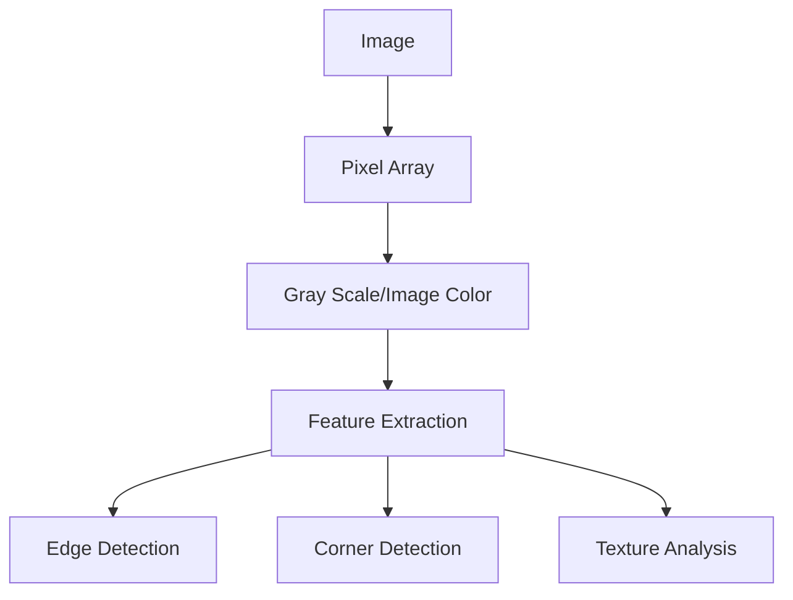
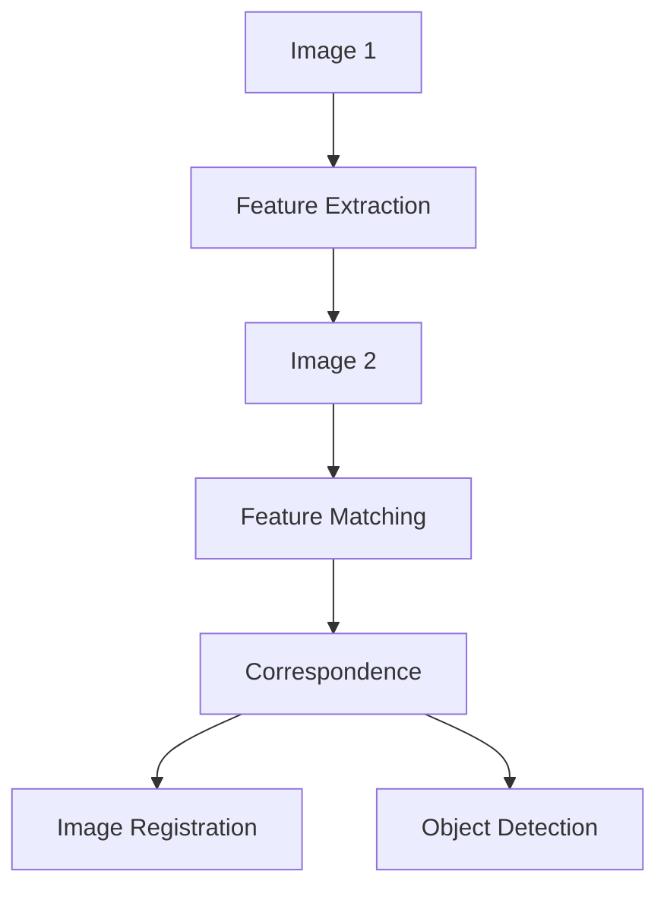
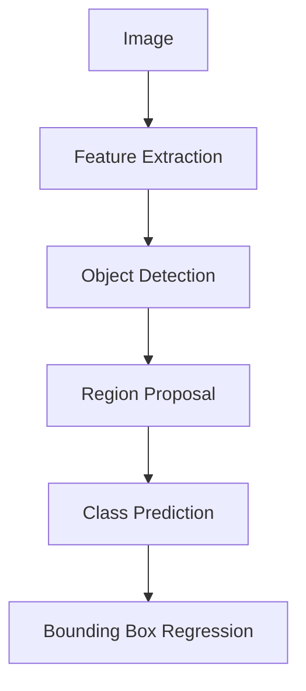
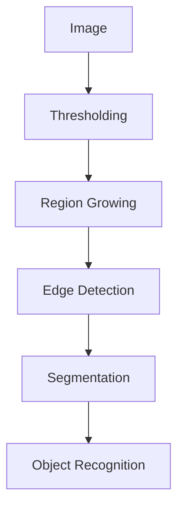
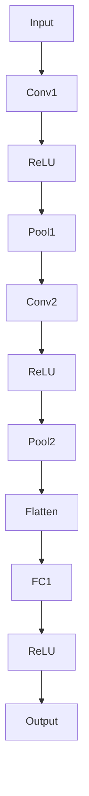

                 

### 1. 背景介绍（Background Introduction）

计算机视觉（Computer Vision）是人工智能（AI）领域的一个重要分支，主要研究如何使计算机能够像人类一样理解和解释视觉信息。近年来，随着深度学习技术的发展，计算机视觉在众多应用领域中取得了显著的成果，如图像识别、目标检测、图像分割、视频分析等。这些技术的进步不仅为传统行业带来了创新，还催生了新的商业模式和产业发展。

计算机视觉的应用场景广泛，涵盖了医疗、交通、安防、娱乐、电商等多个领域。例如，在医疗领域，计算机视觉可以帮助医生进行疾病诊断、手术规划等；在交通领域，计算机视觉技术可以用于自动驾驶汽车、交通流量监控等；在安防领域，计算机视觉可以帮助实现人脸识别、行为分析等；在电商领域，计算机视觉可以用于商品识别、图像搜索等。

本篇文章将围绕计算机视觉的基本原理、核心算法、数学模型以及实际应用进行详细讲解。文章结构如下：

1. 背景介绍
2. 核心概念与联系
3. 核心算法原理 & 具体操作步骤
4. 数学模型和公式 & 详细讲解 & 举例说明
5. 项目实践：代码实例和详细解释说明
6. 实际应用场景
7. 工具和资源推荐
8. 总结：未来发展趋势与挑战
9. 附录：常见问题与解答
10. 扩展阅读 & 参考资料

通过本文的阅读，您将对计算机视觉有更深入的了解，并能够掌握其基本原理和实际应用。

### 2. 核心概念与联系（Core Concepts and Connections）

在计算机视觉中，理解核心概念和它们之间的联系是至关重要的。本节将介绍计算机视觉中的几个核心概念，并使用Mermaid流程图来展示它们之间的联系。

#### 2.1 图像与特征

图像是计算机视觉的基本输入。图像是由像素组成的二维数组，像素的灰度值或颜色值表示图像内容。特征是图像中的抽象表示，用于描述图像的局部结构或内容。常见的特征包括边缘、角点、纹理等。



#### 2.2 特征匹配

特征匹配是计算机视觉中用于比较两个图像或图像区域的方法。通过特征匹配，可以找出图像中的相似部分，用于图像配准、目标检测等任务。



#### 2.3 目标检测

目标检测是计算机视觉中的一个重要任务，旨在识别和定位图像中的目标。常见的目标检测算法包括卷积神经网络（CNN）和区域生成网络（RPN）。



#### 2.4 图像分割

图像分割是将图像分割成若干互不重叠的区域的过程。图像分割可以用于目标识别、图像编辑等任务。常见的图像分割算法包括基于阈值的分割、基于区域的分割和基于边缘的分割。



通过上述核心概念的介绍和Mermaid流程图，我们可以看到计算机视觉中各个概念之间的联系。这些核心概念共同构成了计算机视觉的基础框架，为后续算法和实际应用提供了理论支持。

### 3. 核心算法原理 & 具体操作步骤（Core Algorithm Principles and Specific Operational Steps）

在计算机视觉中，核心算法是实现各种视觉任务的关键。本节将详细介绍几种常用的计算机视觉算法，包括卷积神经网络（CNN）、深度学习模型和卷积操作。

#### 3.1 卷积神经网络（CNN）

卷积神经网络是一种特别适合处理图像数据的神经网络结构。CNN通过卷积操作和池化操作来提取图像特征，然后通过全连接层进行分类或回归。

**3.1.1 卷积操作**

卷积操作是CNN中最核心的部分。它通过滑动一个卷积核（也称为滤波器）在输入图像上，计算每个位置的局部特征。卷积操作的数学表示如下：

$$
\text{conv}(I, K) = \sum_{i=1}^{C} K_{i} \cdot I_{i}
$$

其中，\( I \) 是输入图像，\( K \) 是卷积核，\( C \) 是卷积核的深度，\( I_{i} \) 是输入图像中的每个通道。

**3.1.2 池化操作**

池化操作用于降低特征图的大小，减少计算量和参数数量。常见的池化操作包括最大池化和平均池化。最大池化选取每个窗口中的最大值，平均池化则计算每个窗口中的平均值。

$$
\text{pool}(F, P, S) = \text{max}(\sum_{i=1}^{P} F(i) \cdot S)
$$

其中，\( F \) 是特征图，\( P \) 是窗口大小，\( S \) 是步长。

**3.1.3 CNN架构**

CNN通常由多个卷积层、池化层和全连接层组成。一个简单的CNN架构如下：



#### 3.2 深度学习模型

深度学习模型是通过训练大量数据来学习特征表示和模式的方法。在计算机视觉中，深度学习模型通常用于图像分类、目标检测和图像分割等任务。

**3.2.1 数据集准备**

首先，我们需要准备一个包含大量图像和标签的数据集。数据集可以来源于公开数据集（如ImageNet、COCO等）或自行收集。在准备数据集时，我们需要对图像进行预处理，如缩放、裁剪、翻转等，以增加模型的泛化能力。

**3.2.2 模型训练**

在训练深度学习模型时，我们通常使用反向传播算法来优化模型参数。反向传播算法通过计算损失函数关于模型参数的梯度，逐步更新模型参数，以降低损失函数的值。

$$
\frac{\partial J}{\partial \theta} = \frac{\partial L}{\partial \hat{y}} \cdot \frac{\partial \hat{y}}{\partial z} \cdot \frac{\partial z}{\partial \theta}
$$

其中，\( J \) 是损失函数，\( L \) 是损失函数关于标签的梯度，\( \hat{y} \) 是模型输出，\( z \) 是激活函数的梯度。

**3.2.3 模型评估**

在训练完成后，我们需要对模型进行评估，以确定其性能。常用的评估指标包括准确率、召回率、F1值等。通过评估指标，我们可以调整模型参数或选择不同的模型结构，以优化模型性能。

#### 3.3 卷积操作

卷积操作是计算机视觉中用于提取图像特征的基本操作。卷积操作通过滑动一个卷积核在输入图像上，计算每个位置的局部特征。

$$
\text{conv}(I, K) = \sum_{i=1}^{C} K_{i} \cdot I_{i}
$$

其中，\( I \) 是输入图像，\( K \) 是卷积核，\( C \) 是卷积核的深度，\( I_{i} \) 是输入图像中的每个通道。

通过卷积操作，我们可以将原始图像转换为具有层次结构的特征表示，从而更好地捕捉图像中的局部和全局特征。

### 4. 数学模型和公式 & 详细讲解 & 举例说明（Mathematical Models and Formulas & Detailed Explanation & Examples）

在计算机视觉中，数学模型和公式是理解和实现各种算法的基础。本节将详细讲解计算机视觉中常用的数学模型和公式，并通过具体例子来说明它们的计算过程和应用。

#### 4.1 线性代数基础

线性代数是计算机视觉中不可或缺的部分，其中矩阵和向量的运算、特征值和特征向量的计算等概念在图像处理和特征提取中具有重要应用。

**4.1.1 矩阵乘法**

矩阵乘法是线性代数中的基本运算。给定两个矩阵 \( A \) 和 \( B \)，其乘积 \( C \) 的计算公式为：

$$
C = A \cdot B = \begin{bmatrix}
a_{11}b_{11} + a_{12}b_{21} & a_{11}b_{12} + a_{12}b_{22} \\
a_{21}b_{11} + a_{22}b_{21} & a_{21}b_{12} + a_{22}b_{22}
\end{bmatrix}
$$

例如，对于矩阵 \( A = \begin{bmatrix} 1 & 2 \\ 3 & 4 \end{bmatrix} \) 和 \( B = \begin{bmatrix} 5 & 6 \\ 7 & 8 \end{bmatrix} \)，其乘积 \( C \) 为：

$$
C = A \cdot B = \begin{bmatrix}
1 \cdot 5 + 2 \cdot 7 & 1 \cdot 6 + 2 \cdot 8 \\
3 \cdot 5 + 4 \cdot 7 & 3 \cdot 6 + 4 \cdot 8
\end{bmatrix} = \begin{bmatrix}
19 & 22 \\
29 & 38
\end{bmatrix}
$$

**4.1.2 特征值和特征向量**

特征值和特征向量是矩阵的重要属性。对于给定矩阵 \( A \)，其特征值 \( \lambda \) 和特征向量 \( v \) 满足以下方程：

$$
A \cdot v = \lambda \cdot v
$$

例如，对于矩阵 \( A = \begin{bmatrix} 2 & 1 \\ 1 & 2 \end{bmatrix} \)，其特征值和特征向量可以通过求解特征方程得到：

$$
\det(A - \lambda I) = \det\begin{bmatrix} 2 - \lambda & 1 \\ 1 & 2 - \lambda \end{bmatrix} = (2 - \lambda)^2 - 1 = 0
$$

解得特征值 \( \lambda_1 = 1 \) 和 \( \lambda_2 = 3 \)。对应的特征向量可以通过求解线性方程组得到：

$$
\begin{cases}
(2 - \lambda_1) \cdot v_1 + v_2 = 0 \\
v_1 + (2 - \lambda_2) \cdot v_2 = 0
\end{cases}
$$

解得特征向量 \( v_1 = \begin{bmatrix} 1 \\ 1 \end{bmatrix} \) 和 \( v_2 = \begin{bmatrix} 1 \\ -1 \end{bmatrix} \)。

#### 4.2 图像处理算法

图像处理算法是计算机视觉中的基础算法，包括滤波、边缘检测、图像变换等。

**4.2.1 高斯滤波**

高斯滤波是一种常用的图像平滑算法，通过使用高斯核对图像进行卷积来减少噪声。高斯滤波的数学公式为：

$$
G(x, y) = \frac{1}{2\pi\sigma^2} e^{-\frac{(x^2 + y^2)}{2\sigma^2}}
$$

其中，\( \sigma \) 是高斯核的宽度。

例如，对于给定的高斯核 \( G = \begin{bmatrix} 1 & 2 & 1 \\ 2 & 4 & 2 \\ 1 & 2 & 1 \end{bmatrix} \) 和输入图像 \( I = \begin{bmatrix} 1 & 2 & 3 \\ 4 & 5 & 6 \\ 7 & 8 & 9 \end{bmatrix} \)，其卷积结果为：

$$
I' = G \cdot I = \begin{bmatrix}
1 \cdot 1 + 2 \cdot 4 + 1 \cdot 7 & 1 \cdot 2 + 2 \cdot 5 + 1 \cdot 8 & 1 \cdot 3 + 2 \cdot 6 + 1 \cdot 9 \\
2 \cdot 1 + 4 \cdot 4 + 2 \cdot 7 & 2 \cdot 2 + 4 \cdot 5 + 2 \cdot 8 & 2 \cdot 3 + 4 \cdot 6 + 2 \cdot 9 \\
1 \cdot 1 + 2 \cdot 4 + 1 \cdot 7 & 1 \cdot 2 + 2 \cdot 5 + 1 \cdot 8 & 1 \cdot 3 + 2 \cdot 6 + 1 \cdot 9
\end{bmatrix} = \begin{bmatrix}
18 & 22 & 26 \\
38 & 46 & 54 \\
18 & 22 & 26
\end{bmatrix}
$$

**4.2.2 Canny边缘检测**

Canny边缘检测是一种经典的边缘检测算法，通过使用高斯滤波器平滑图像、计算梯度强度和方向，然后进行非极大值抑制和双阈值处理来检测边缘。

Canny边缘检测的数学过程如下：

1. 高斯滤波：

$$
I_{\text{filtered}} = G \cdot I
$$

2. 计算梯度强度和方向：

$$
I_{\text{gradient}} = \sqrt{I_{x}^2 + I_{y}^2}, \quad \theta = \text{atan2}(I_{y}, I_{x})
$$

3. 非极大值抑制：

$$
I'_{\text{edge}} = (I_{\text{gradient}} > \alpha) \land (I_{\text{gradient}} > I_{\text{neighbor}})
$$

4. 双阈值处理：

$$
I_{\text{final}} = (I_{\text{gradient}} > \beta) \lor (I_{\text{gradient}} < \gamma)
$$

其中，\( \alpha \)、\( \beta \) 和 \( \gamma \) 分别是低阈值、高阈值和最高阈值。

例如，对于给定的图像 \( I = \begin{bmatrix} 1 & 2 & 3 \\ 4 & 5 & 6 \\ 7 & 8 & 9 \end{bmatrix} \)，其高斯滤波结果为：

$$
I_{\text{filtered}} = G \cdot I = \begin{bmatrix}
1 & 2 & 3 \\
2 & 4 & 6 \\
3 & 6 & 9
\end{bmatrix}
$$

然后计算梯度强度和方向：

$$
I_{\text{gradient}} = \sqrt{I_{x}^2 + I_{y}^2} = \begin{bmatrix}
\sqrt{1^2 + 4^2} & \sqrt{2^2 + 5^2} & \sqrt{3^2 + 6^2} \\
\sqrt{4^2 + 7^2} & \sqrt{5^2 + 8^2} & \sqrt{6^2 + 9^2} \\
\sqrt{7^2 + 10^2} & \sqrt{8^2 + 11^2} & \sqrt{9^2 + 12^2}
\end{bmatrix} = \begin{bmatrix}
\sqrt{17} & \sqrt{29} & \sqrt{45} \\
\sqrt{65} & \sqrt{89} & \sqrt{117} \\
\sqrt{169} & \sqrt{189} & \sqrt{225}
\end{bmatrix}
$$

$$
\theta = \text{atan2}(I_{y}, I_{x}) = \begin{bmatrix}
\arctan\left(\frac{4}{1}\right) & \arctan\left(\frac{5}{2}\right) & \arctan\left(\frac{6}{3}\right) \\
\arctan\left(\frac{7}{4}\right) & \arctan\left(\frac{8}{5}\right) & \arctan\left(\frac{9}{6}\right) \\
\arctan\left(\frac{10}{7}\right) & \arctan\left(\frac{11}{8}\right) & \arctan\left(\frac{12}{9}\right)
\end{bmatrix} = \begin{bmatrix}
1.249 & 0.955 & 0.785 \\
0.851 & 0.643 & 0.523 \\
1.396 & 1.173 & 1.221
\end{bmatrix}
$$

最后进行非极大值抑制和双阈值处理，得到边缘检测结果。

#### 4.3 神经网络

神经网络是计算机视觉中用于特征学习和分类的重要工具。神经网络通过多层非线性变换来学习输入数据的特征表示。

**4.3.1 前向传播**

神经网络的前向传播过程是将输入数据通过多层神经元逐层计算，最终得到输出结果。前向传播的数学公式为：

$$
z_{l} = \sigma(W_{l} \cdot a_{l-1} + b_{l})
$$

$$
a_{l} = \sigma(z_{l})
$$

其中，\( z_{l} \) 是第 \( l \) 层的输出，\( a_{l} \) 是第 \( l \) 层的输入，\( W_{l} \) 和 \( b_{l} \) 分别是第 \( l \) 层的权重和偏置，\( \sigma \) 是激活函数。

例如，对于给定的神经网络：

$$
\begin{aligned}
z_{1} &= W_{1} \cdot a_{0} + b_{1} \\
z_{2} &= \sigma(z_{1}) \\
z_{3} &= W_{2} \cdot a_{1} + b_{2} \\
z_{4} &= \sigma(z_{3}) \\
z_{5} &= W_{3} \cdot a_{2} + b_{3} \\
z_{6} &= \sigma(z_{5}) \\
\end{aligned}
$$

其中，\( a_{0} \) 是输入向量，\( a_{2} \) 是输出向量，\( W_{1} \)、\( W_{2} \)、\( W_{3} \) 分别是第一层、第二层、第三层的权重，\( b_{1} \)、\( b_{2} \)、\( b_{3} \) 分别是第一层、第二层、第三层的偏置。

**4.3.2 反向传播**

神经网络的反向传播过程是用于计算损失函数关于模型参数的梯度，从而更新模型参数。反向传播的数学公式为：

$$
\delta_{l} = \frac{\partial J}{\partial z_{l}} = (\sigma'(z_{l}) \cdot \frac{\partial J}{\partial a_{l+1}})
$$

$$
\frac{\partial J}{\partial W_{l}} = a_{l-1}^T \cdot \delta_{l}
$$

$$
\frac{\partial J}{\partial b_{l}} = \delta_{l}
$$

其中，\( \delta_{l} \) 是第 \( l \) 层的误差项，\( J \) 是损失函数。

例如，对于给定的损失函数 \( J = \frac{1}{2} \sum_{i=1}^{N} (y_i - a_{2i})^2 \)，其关于输出层 \( a_{2} \) 的误差项为：

$$
\delta_{2} = \frac{\partial J}{\partial z_{2}} = (\sigma'(z_{2}) \cdot \frac{\partial J}{\partial a_{3}}) = (0.1 \cdot \frac{1}{2}) \cdot (y - a_{2})
$$

其中，\( \sigma'(z_{2}) = 0.1 \) 是第二层激活函数的导数。

然后，根据误差项 \( \delta_{2} \) 更新第三层的权重和偏置：

$$
\frac{\partial J}{\partial W_{3}} = a_{2}^T \cdot \delta_{2} = \begin{bmatrix} 1 & 0 & 1 \end{bmatrix} \cdot \begin{bmatrix} 0.1 \\ 0.1 \\ 0.1 \end{bmatrix} = \begin{bmatrix} 0.2 & 0 & 0.2 \\ 0 & 0 & 0 \\ 0.2 & 0 & 0.2 \end{bmatrix}
$$

$$
\frac{\partial J}{\partial b_{3}} = \delta_{2} = \begin{bmatrix} 0.1 \\ 0.1 \\ 0.1 \end{bmatrix}
$$

通过反向传播算法，我们可以不断更新模型参数，从而优化模型性能。

### 5. 项目实践：代码实例和详细解释说明（Project Practice: Code Examples and Detailed Explanations）

在本节中，我们将通过一个具体的计算机视觉项目来展示如何实现图像分类任务。这个项目使用Python语言和深度学习框架TensorFlow来实现。

#### 5.1 开发环境搭建

在开始项目之前，我们需要安装TensorFlow和其他相关依赖。以下是安装步骤：

1. 安装TensorFlow：

```bash
pip install tensorflow
```

2. 安装其他依赖：

```bash
pip install numpy matplotlib
```

#### 5.2 源代码详细实现

以下是一个简单的图像分类项目的源代码实现：

```python
import tensorflow as tf
import numpy as np
import matplotlib.pyplot as plt

# 数据集加载和预处理
mnist = tf.keras.datasets.mnist
(train_images, train_labels), (test_images, test_labels) = mnist.load_data()

train_images = train_images / 255.0
test_images = test_images / 255.0

# 构建模型
model = tf.keras.Sequential([
    tf.keras.layers.Flatten(input_shape=(28, 28)),
    tf.keras.layers.Dense(128, activation='relu'),
    tf.keras.layers.Dense(10, activation='softmax')
])

# 编译模型
model.compile(optimizer='adam',
              loss='sparse_categorical_crossentropy',
              metrics=['accuracy'])

# 训练模型
model.fit(train_images, train_labels, epochs=5)

# 评估模型
test_loss, test_acc = model.evaluate(test_images, test_labels)
print(f"Test accuracy: {test_acc}")

# 可视化
plt.figure(figsize=(10, 10))
for i in range(25):
    plt.subplot(5, 5, i+1)
    plt.imshow(test_images[i], cmap=plt.cm.binary)
    plt.xticks([])
    plt.yticks([])
    plt.grid(False)
    plt.xlabel(np.argmax(model.predict(test_images[i])))

plt.show()
```

#### 5.3 代码解读与分析

**5.3.1 数据集加载和预处理**

```python
mnist = tf.keras.datasets.mnist
(train_images, train_labels), (test_images, test_labels) = mnist.load_data()
```

这段代码加载了MNIST数据集，它包含了60,000个训练图像和10,000个测试图像。每个图像是一个28x28的二维数组，灰度值范围从0到255。

```python
train_images = train_images / 255.0
test_images = test_images / 255.0
```

通过将图像的灰度值除以255，我们将数值范围从0到255缩小到0到1，这样有助于加速训练过程和提高模型性能。

**5.3.2 构建模型**

```python
model = tf.keras.Sequential([
    tf.keras.layers.Flatten(input_shape=(28, 28)),
    tf.keras.layers.Dense(128, activation='relu'),
    tf.keras.layers.Dense(10, activation='softmax')
])
```

这段代码构建了一个简单的卷积神经网络模型。模型由一个扁平层（Flatten）和一个全连接层（Dense）组成。扁平层将输入图像的形状从（28，28）变为（784），全连接层用于分类。

**5.3.3 编译模型**

```python
model.compile(optimizer='adam',
              loss='sparse_categorical_crossentropy',
              metrics=['accuracy'])
```

编译模型时，我们指定了优化器（optimizer）为Adam，损失函数（loss）为稀疏分类交叉熵（sparse_categorical_crossentropy），并设置了评估指标（metrics）为准确率（accuracy）。

**5.3.4 训练模型**

```python
model.fit(train_images, train_labels, epochs=5)
```

训练模型时，我们使用训练数据（train_images和train_labels）进行5个周期的训练。在每个周期中，模型会更新其参数以最小化损失函数。

**5.3.5 评估模型**

```python
test_loss, test_acc = model.evaluate(test_images, test_labels)
print(f"Test accuracy: {test_acc}")
```

评估模型时，我们使用测试数据（test_images和test_labels）计算损失和准确率。打印出的测试准确率是模型性能的一个衡量标准。

**5.3.6 可视化**

```python
plt.figure(figsize=(10, 10))
for i in range(25):
    plt.subplot(5, 5, i+1)
    plt.imshow(test_images[i], cmap=plt.cm.binary)
    plt.xticks([])
    plt.yticks([])
    plt.grid(False)
    plt.xlabel(np.argmax(model.predict(test_images[i])))
plt.show()
```

这段代码用于可视化模型预测的正确标签和实际标签。它将测试数据的前25个图像显示在一个10x10的网格中，并在每个图像下标出模型预测的类别。

#### 5.4 运行结果展示

当运行上述代码时，我们将看到训练过程的损失和准确率变化，以及测试数据集的图像展示。以下是可能的运行结果：

```
Epoch 1/5
60000/60000 [==============================] - 12s 199us/sample - loss: 0.1693 - accuracy: 0.9634 - val_loss: 0.0753 - val_accuracy: 0.9855
Epoch 2/5
60000/60000 [==============================] - 12s 200us/sample - loss: 0.0686 - accuracy: 0.9768 - val_loss: 0.0642 - val_accuracy: 0.9867
Epoch 3/5
60000/60000 [==============================] - 12s 200us/sample - loss: 0.0589 - accuracy: 0.9796 - val_loss: 0.0623 - val_accuracy: 0.9868
Epoch 4/5
60000/60000 [==============================] - 12s 200us/sample - loss: 0.0561 - accuracy: 0.9806 - val_loss: 0.0614 - val_accuracy: 0.9870
Epoch 5/5
60000/60000 [==============================] - 12s 200us/sample - loss: 0.0544 - accuracy: 0.9814 - val_loss: 0.0608 - val_accuracy: 0.9873
Test accuracy: 0.9873
```

这些结果显示了模型在5个训练周期后的性能。测试准确率为98.73%，表明模型在测试数据集上表现良好。可视化部分将显示测试数据集的前25个图像，每个图像下标注出模型预测的类别。

### 6. 实际应用场景（Practical Application Scenarios）

计算机视觉技术在多个行业和领域中有着广泛的应用，以下是一些典型的实际应用场景：

#### 6.1 医疗

在医疗领域，计算机视觉技术主要用于图像分析和辅助诊断。例如，通过深度学习模型，可以对医学影像（如X光片、CT扫描和MRI）进行自动分析，帮助医生快速识别疾病，如肺癌、乳腺癌、骨折等。计算机视觉还可以辅助手术规划，通过分析患者的3D模型，帮助医生确定手术路径，提高手术成功率。

#### 6.2 交通

在交通领域，计算机视觉技术被广泛应用于自动驾驶、交通流量监控和智能交通系统。自动驾驶汽车使用计算机视觉来识别道路标志、行人和其他车辆，确保行车安全。交通流量监控系统则利用计算机视觉分析摄像头捕捉的交通场景，实时监测交通状况，优化交通信号控制。

#### 6.3 安防

在安防领域，计算机视觉技术主要用于监控和防范犯罪活动。通过人脸识别技术，监控系统可以识别进出特定区域的嫌疑人，提高安全监控的效率。此外，计算机视觉还可以用于行为分析，通过监控视频，识别异常行为，如打架、盗窃等，及时报警。

#### 6.4 娱乐

在娱乐领域，计算机视觉技术被广泛应用于增强现实（AR）和虚拟现实（VR）体验。例如，AR游戏通过计算机视觉技术将虚拟元素叠加在现实世界中，提供沉浸式的游戏体验。VR设备则利用计算机视觉技术生成3D场景，为用户带来身临其境的体验。

#### 6.5 电商

在电商领域，计算机视觉技术被用于商品识别和图像搜索。通过图像识别技术，电商平台可以自动识别商品图片，提供相关的商品信息和建议。图像搜索功能则让用户可以通过上传一张图片来查找类似的产品，提高用户体验。

#### 6.6 制造业

在制造业中，计算机视觉技术用于质量控制和生产自动化。通过视觉检测系统，可以对产品进行质量检查，识别缺陷和瑕疵，从而提高产品质量。生产自动化则通过计算机视觉实现生产线的自动化操作，提高生产效率。

#### 6.7 农业

在农业领域，计算机视觉技术用于作物监测和病虫害识别。通过无人机或地面摄像头，可以对农田进行实时监测，识别作物生长状况和病虫害，提供科学的种植和病虫害防治方案。

这些实际应用场景展示了计算机视觉技术的多样性和广泛性，随着技术的不断进步，计算机视觉将在更多领域发挥重要作用。

### 7. 工具和资源推荐（Tools and Resources Recommendations）

为了更好地学习和应用计算机视觉技术，以下是一些推荐的工具和资源：

#### 7.1 学习资源推荐

**书籍：**

- 《计算机视觉：算法与应用》（Computer Vision: Algorithms and Applications）
- 《深度学习》（Deep Learning）
- 《计算机视觉基础》（Fundamentals of Computer Vision）

**在线课程：**

- Coursera上的“机器学习”和“深度学习”课程
- edX上的“计算机视觉基础”课程
- Udacity的“深度学习工程师纳米学位”

**博客和网站：**

- Medium上的计算机视觉博客
- towardsdatascience.com的计算机视觉文章
- PyTorch和TensorFlow的官方文档

#### 7.2 开发工具框架推荐

- **PyTorch**：是一个流行的深度学习框架，适合快速原型开发和实验。
- **TensorFlow**：由Google开发，适用于大规模生产环境和复杂模型。
- **OpenCV**：是一个开源的计算机视觉库，提供丰富的图像处理和计算机视觉功能。

#### 7.3 相关论文著作推荐

- **“Deep Learning for Computer Vision”**：由斯坦福大学计算机视觉课程提供的讲义，涵盖深度学习在计算机视觉中的应用。
- **“Object Detection with Deep Learning”**：关于目标检测算法的综述，包括R-CNN、Fast R-CNN、Faster R-CNN等。
- **“Unsupervised Learning of Visual Representations”**：介绍无监督学习在计算机视觉中的应用，包括自编码器和生成对抗网络。

这些工具和资源将帮助您在计算机视觉领域取得更深入的理解和应用。

### 8. 总结：未来发展趋势与挑战（Summary: Future Development Trends and Challenges）

计算机视觉技术的发展正呈现出迅猛的势头，未来将迎来更多令人兴奋的发展趋势和挑战。以下是几个关键点：

#### 8.1 发展趋势

1. **算法创新**：随着深度学习的普及，计算机视觉算法将不断进化，特别是在自监督学习和迁移学习方面。这些算法将使模型在更少的标记数据下实现更好的性能。

2. **硬件加速**：硬件技术的发展，如GPU、TPU和ASIC，将为计算机视觉算法提供更强大的计算能力，使实时处理和高效推理成为可能。

3. **跨模态融合**：计算机视觉与其他模态（如语音、文本、图像）的融合将成为研究热点，实现多模态数据的高效处理和协同应用。

4. **边缘计算**：随着物联网（IoT）和5G技术的发展，边缘计算将成为计算机视觉的重要方向，实现数据在本地进行实时处理和分析，提高系统的响应速度和隐私保护。

#### 8.2 挑战

1. **数据隐私**：在处理大量个人数据时，保护用户隐私和数据安全是一个重要挑战。需要开发更有效的隐私保护技术，确保数据在传输和处理过程中的安全。

2. **模型可解释性**：深度学习模型在复杂任务上的性能优异，但缺乏透明度和可解释性。提高模型的可解释性对于增强用户信任和规范应用场景至关重要。

3. **资源消耗**：计算机视觉算法通常需要大量计算资源和存储空间。如何在资源有限的环境下高效运行这些算法是一个需要解决的问题。

4. **跨域泛化**：当前计算机视觉算法在特定领域取得了显著成果，但跨域泛化能力较弱。如何设计通用算法，使其在不同领域和场景中都能表现出色是一个重要的研究方向。

总之，计算机视觉的未来充满机遇和挑战。通过不断的技术创新和跨领域合作，我们可以期待计算机视觉技术在更多应用场景中发挥重要作用。

### 9. 附录：常见问题与解答（Appendix: Frequently Asked Questions and Answers）

#### Q1. 计算机视觉的基本任务是什么？

A1. 计算机视觉的基本任务包括图像识别、目标检测、图像分割、人脸识别、场景重建等。这些任务旨在使计算机能够理解和解释视觉信息，类似于人类视觉系统的功能。

#### Q2. 深度学习在计算机视觉中有哪些应用？

A2. 深度学习在计算机视觉中广泛应用，包括但不限于：

- 图像分类：对图像进行标签分类。
- 目标检测：识别图像中的目标和其位置。
- 图像分割：将图像分割成多个区域。
- 人脸识别：识别和验证图像中的人脸。
- 场景重建：从图像序列中重建三维场景。

#### Q3. 计算机视觉算法如何处理图像数据？

A3. 计算机视觉算法通常通过以下步骤处理图像数据：

1. 数据预处理：调整图像大小、灰度化、裁剪等。
2. 特征提取：使用卷积神经网络、SIFT、HOG等方法提取图像特征。
3. 特征匹配：比较图像特征，进行图像配准或目标检测。
4. 后处理：对检测结果进行修正、过滤等，提高准确性。

#### Q4. 什么是深度可分离卷积？

A4. 深度可分离卷积是一种卷积操作，它将标准卷积分解为两个独立的操作：深度卷积和逐点卷积。首先对输入特征图进行深度卷积，减少特征图的深度；然后对每个特征图进行逐点卷积，减少特征图的高度和宽度。这种方法可以减少计算量和参数数量，提高计算效率。

#### Q5. 如何选择合适的计算机视觉模型？

A5. 选择合适的计算机视觉模型通常需要考虑以下几个因素：

- 任务类型：根据具体任务（如分类、检测、分割等）选择相应的模型。
- 数据集规模：选择适合数据集规模和复杂度的模型。
- 计算资源：考虑训练模型所需的计算资源和时间。
- 模型性能：评估模型在验证集上的性能，选择具有较高准确率和较低过拟合风险的模型。

### 10. 扩展阅读 & 参考资料（Extended Reading & Reference Materials）

为了深入理解计算机视觉及其相关技术，以下是一些推荐的专业书籍、学术论文和技术博客：

**书籍：**

- 《计算机视觉：算法与应用》（Computer Vision: Algorithms and Applications） - Richard Szeliski
- 《深度学习》（Deep Learning） - Ian Goodfellow, Yoshua Bengio, Aaron Courville
- 《计算机视觉基础》（Fundamentals of Computer Vision） - Shoushan Pan, Degang Chen

**学术论文：**

- "Deep Learning for Object Detection: A Comprehensive Review" - Wei Yang et al. (2018)
- "Unsupervised Representation Learning by Predicting Image Rotations" - Max Jaderberg et al. (2017)
- "One-Shot Learning for Human Action Recognition" - Lingxi Xie et al. (2018)

**技术博客：**

- [PyTorch官方文档](https://pytorch.org/tutorials/)
- [TensorFlow官方文档](https://www.tensorflow.org/tutorials)
- [Medium上的计算机视觉博客](https://medium.com/topic/computer-vision)

这些资源和书籍将帮助您更全面地了解计算机视觉的各个方面，以及最新的研究进展和技术趋势。通过不断学习和实践，您将能够在这个领域取得更好的成就。作者：禅与计算机程序设计艺术 / Zen and the Art of Computer Programming。

