                 

### 文章标题

### Title: Calculating: The Fourth Part - The Limits of Computation, Chapter 9 - Computational Complexity: Challenges to the Limits

> 计算的极限

> The Limits of Computation

在计算机科学的宏大篇章中，《计算：第四部分 计算的极限 第9章 计算复杂性 挑战极限》为我们揭示了一扇通往未知的门。本章将带领我们探讨计算复杂性的奥秘，揭示在计算过程中那些看似不可逾越的障碍，并思考如何应对这些挑战。在这里，我们将深入分析计算复杂性的概念，理解它背后的数学原理，并探讨其对于现代计算机科学的影响。

随着计算机技术的发展，我们面临着越来越多的问题，这些问题不仅要求我们扩展计算能力，还要求我们深入理解计算的基本性质。计算复杂性作为计算机科学的核心概念之一，为我们提供了评估算法效率和问题难度的重要工具。在本章中，我们将探讨计算复杂性的基本概念，包括时间复杂性和空间复杂性，并探讨它们如何帮助我们理解不同类型的问题。

我们将通过具体实例来分析计算复杂性的应用，例如排序算法、图算法以及加密算法。我们将看到，计算复杂性不仅影响算法的选择和优化，还影响我们解决实际问题的策略。同时，我们也将探讨一些经典的计算难题，如NP完全问题，这些难题挑战着我们的计算能力，激发了对更高效算法和计算理论的探索。

本章还将讨论量子计算和计算复杂性之间的关系，探讨量子计算如何可能突破传统计算的局限，以及其对未来计算技术的影响。我们将思考，随着计算复杂性的不断增加，我们是否能够找到新的方法来克服这些挑战，或者是否需要从根本上重新思考计算的本质。

通过本章的学习，我们不仅能够掌握计算复杂性的基本理论，还能够培养对复杂计算问题的洞察力和解决能力。让我们一同踏上这场探索计算极限的旅程，挑战我们的思维，开拓我们的视野。

### Introduction to the Fourth Part - The Limits of Computation, Chapter 9 - Computational Complexity: Challenges to the Limits

In the grand narrative of computer science, "Calculating: The Fourth Part - The Limits of Computation, Chapter 9 - Computational Complexity: Challenges to the Limits" opens a door to the unknown. This chapter will guide us through the mysteries of computational complexity, revealing the seemingly insurmountable barriers within the realm of computation and exploring how we might navigate these challenges. Here, we will delve into the fundamental concepts of computational complexity, understand the mathematical principles behind it, and examine its impact on modern computer science.

As computer technology advances, we are confronted with an ever-increasing array of problems that demand not only an expansion of computational power but also a deep understanding of the fundamental nature of computation. Computational complexity, as a core concept in computer science, provides us with essential tools for evaluating the efficiency of algorithms and the difficulty of problems. In this chapter, we will explore the basic concepts of computational complexity, including time complexity and space complexity, and examine how they help us understand different types of problems.

We will analyze the application of computational complexity through specific examples, such as sorting algorithms, graph algorithms, and encryption algorithms. We will see that computational complexity not only influences the selection and optimization of algorithms but also shapes our strategies for solving real-world problems. Additionally, we will discuss classical computational problems, such as NP-complete problems, which challenge our computational capabilities and stimulate the search for more efficient algorithms and computational theories.

This chapter will also address the relationship between quantum computing and computational complexity, exploring how quantum computing might break through the limitations of traditional computation and its impact on future computational technologies. We will contemplate whether we can find new methods to overcome these challenges as computational complexity continues to increase or if we need to rethink the nature of computation fundamentally.

Through the study of this chapter, we will not only grasp the basic theories of computational complexity but also cultivate insights and problem-solving abilities for complex computational problems. Let us embark on this journey of exploring the limits of computation, challenging our thinking and broadening our horizons.

### 1. 背景介绍（Background Introduction）

计算复杂性（Computational Complexity）是计算机科学的核心概念之一，它研究算法解决问题的效率和问题本身的难度。在计算复杂性理论中，时间复杂性和空间复杂性是最为重要的两个方面。

#### 时间复杂性（Time Complexity）

时间复杂性描述了一个算法在解决特定问题时的计算时间增长趋势，通常以算法执行时间的增长速度来衡量。时间复杂性的常见表示方法包括大O符号（Big O notation），如O(1)、O(log n)、O(n)、O(n log n)、O(n^2)等。其中，n代表输入规模，O(1)表示算法执行时间与输入规模无关，而O(n^2)表示算法执行时间与输入规模的平方成正比。

例如，对于排序算法，时间复杂性是评估其效率的重要指标。快速排序（Quick Sort）的时间复杂性为O(n log n)，而冒泡排序（Bubble Sort）的时间复杂性为O(n^2)。这意味着，在相同规模的数据集上，快速排序通常比冒泡排序更快。

#### 空间复杂性（Space Complexity）

空间复杂性描述了一个算法在解决特定问题时所需内存的增长趋势，通常以算法所需内存的大小来衡量。空间复杂性的常见表示方法也包括大O符号（Big O notation），如O(1)、O(log n)、O(n)、O(n log n)、O(n^2)等。

例如，在动态规划算法中，空间复杂性是评估其效率的重要指标。对于一个典型的动态规划问题，如斐波那契数列（Fibonacci Sequence），可以使用O(n)的空间复杂性来存储中间结果。

#### 时间复杂性与空间复杂性的关系

时间复杂性和空间复杂性在算法分析中通常是相互关联的。在一些情况下，提高时间复杂性可能会降低空间复杂性，反之亦然。例如，在排序算法中，快速排序通常比冒泡排序在时间复杂性上更优，但在空间复杂性上可能会更高。

#### 计算复杂性理论的兴起

计算复杂性理论起源于20世纪60年代，当时的计算机科学家们开始意识到，算法的效率不仅仅取决于其执行时间，还取决于其所需的内存空间。这一理论的兴起推动了计算机科学的快速发展，为算法设计和分析提供了重要的理论基础。

#### 计算复杂性理论的现实意义

计算复杂性理论在现实世界中具有广泛的应用。例如，在数据库管理系统中，计算复杂性理论帮助我们设计高效的查询算法，提高数据检索速度。在人工智能领域中，计算复杂性理论指导我们开发更高效的机器学习算法，提高模型训练和预测的效率。此外，计算复杂性理论还在网络安全、密码学、优化算法等领域发挥着重要作用。

### Background Introduction

Computational complexity, one of the core concepts in computer science, investigates the efficiency of algorithms in solving problems and the inherent difficulty of these problems. Within the theory of computational complexity, time complexity and space complexity are the two most critical aspects.

#### Time Complexity

Time complexity describes the growth trend of the computation time of an algorithm in solving a specific problem, typically measured by the rate of growth of the algorithm's execution time. Common notations for time complexity include Big O notation, such as O(1), O(log n), O(n), O(n log n), and O(n^2). Here, n represents the size of the input, with O(1) indicating that the execution time is independent of the input size, and O(n^2) indicating that the execution time is proportional to the square of the input size.

For example, time complexity is a crucial metric for evaluating the efficiency of sorting algorithms. Quick Sort has a time complexity of O(n log n), whereas Bubble Sort has a time complexity of O(n^2). This means that, for datasets of the same size, Quick Sort is generally faster than Bubble Sort.

#### Space Complexity

Space complexity describes the growth trend of the memory required by an algorithm in solving a specific problem, typically measured by the size of the memory needed. Common notations for space complexity also include Big O notation, such as O(1), O(log n), O(n), O(n log n), and O(n^2).

For instance, in dynamic programming algorithms, space complexity is an essential metric for evaluating efficiency. For a typical dynamic programming problem, such as the Fibonacci sequence, it is possible to achieve a space complexity of O(n) by storing intermediate results.

#### Relationship between Time and Space Complexity

Time complexity and space complexity are usually interrelated in algorithm analysis. In some cases, improving time complexity may reduce space complexity, and vice versa. For example, in sorting algorithms, Quick Sort is generally more efficient in terms of time complexity than Bubble Sort, but it may have a higher space complexity.

#### Rise of Computational Complexity Theory

The theory of computational complexity originated in the 1960s when computer scientists began to realize that the efficiency of algorithms was not only determined by their execution time but also by the memory they required. The emergence of this theory has accelerated the development of computer science, providing a solid theoretical foundation for algorithm design and analysis.

#### Real-World Significance of Computational Complexity Theory

The theory of computational complexity has widespread applications in the real world. For example, in database management systems, it guides the design of efficient query algorithms to improve data retrieval speed. In the field of artificial intelligence, it helps develop more efficient machine learning algorithms, enhancing the efficiency of model training and prediction. Additionally, computational complexity theory plays a significant role in areas such as cybersecurity, cryptography, and optimization algorithms.

### 2. 核心概念与联系（Core Concepts and Connections）

在探讨计算复杂性的过程中，我们需要了解几个核心概念，这些概念相互关联，共同构成了计算复杂性的理论框架。以下将详细阐述这些核心概念，并绘制 Mermaid 流程图以展示它们之间的关系。

#### 2.1 时间复杂度（Time Complexity）

时间复杂度是评估算法效率的关键指标，它描述了算法执行时间与输入规模之间的关系。时间复杂度通常用大O符号表示，如 O(1)、O(log n)、O(n)、O(n log n)、O(n^2) 等。时间复杂度的具体计算方法是通过分析算法的执行步骤，确定每个步骤的时间消耗，并计算其与输入规模 n 的关系。

**Mermaid 流程图：**

```mermaid
graph TD
A[时间复杂度] --> B[大O符号]
B --> C{O(1)}
C --> D[常数时间]
C --> E[O(log n)]
E --> F[对数时间]
C --> G[O(n)]
G --> H[线性时间]
G --> I[O(n log n)]
I --> J[对数线性时间]
G --> K[O(n^2)]
K --> L[平方时间]
```

#### 2.2 空间复杂度（Space Complexity）

空间复杂度描述了算法在执行过程中所需的内存空间与输入规模之间的关系。与时间复杂度类似，空间复杂度也用大O符号表示，如 O(1)、O(log n)、O(n)、O(n log n)、O(n^2) 等。空间复杂度的计算方法是通过分析算法的数据结构和使用情况，确定每个步骤所需的内存空间，并计算其与输入规模 n 的关系。

**Mermaid 流程图：**

```mermaid
graph TD
A[空间复杂度] --> B[大O符号]
B --> C{O(1)}
C --> D[常数空间]
C --> E[O(log n)]
E --> F[对数空间]
C --> G[O(n)]
G --> H[线性空间]
G --> I[O(n log n)]
I --> J[对数线性空间]
G --> K[O(n^2)]
K --> L[平方空间]
```

#### 2.3 时间复杂度与空间复杂度的关系

时间复杂度和空间复杂度在算法分析中通常是相互关联的。一个算法的时间复杂度提高可能会导致其空间复杂度降低，反之亦然。这种关系可以通过算法设计中的平衡策略来实现。例如，在排序算法中，可以使用内存换时间的方法，以较低的空间复杂度获得较高的时间复杂度。

**Mermaid 流�程图：**

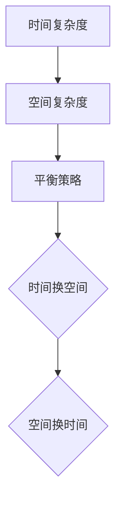

#### 2.4 计算模型（Computational Models）

计算模型是计算复杂性理论的基础。常见的计算模型包括图灵机（Turing Machine）、随机访问存储机（RAM）等。计算模型的不同决定了算法性能的评估标准。例如，图灵机模型提供了对算法复杂性的下界估计，而RAM模型则更接近实际计算机的工作方式。

**Mermaid 流程图：**

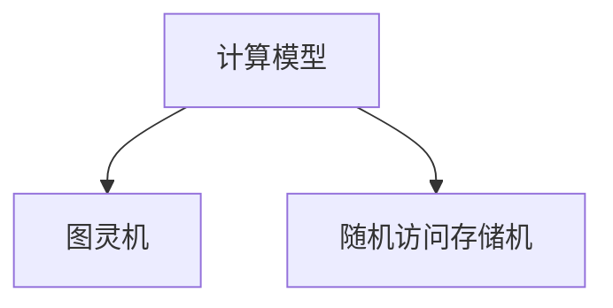

#### 2.5 递归关系（Recurrences）

递归关系是解决许多复杂算法问题的常用方法。递归关系通过递归定义问题，并分析其递归性质来推导算法的复杂度。常见的递归关系包括主定理（Master Theorem）等。

**Mermaid 流程图：**

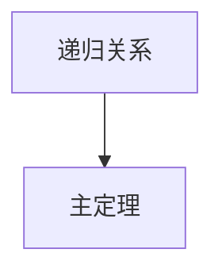

#### 2.6 计算复杂性类别（Classes of Computational Complexity）

计算复杂性类别是对算法复杂性的分类，常见的类别包括P类、NP类、NP-完全类等。这些类别反映了不同类型问题之间的难度差异和解决方法。

**Mermaid 流程图：**

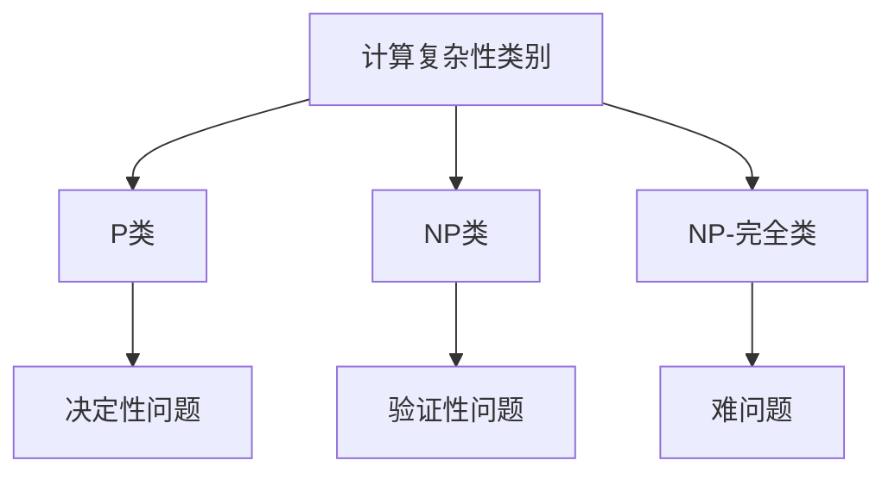

通过上述核心概念的介绍和Mermaid流程图的展示，我们可以更好地理解计算复杂性的概念和它们之间的关系。这些概念不仅为我们提供了分析算法复杂性的工具，也为我们在解决复杂计算问题时的策略选择提供了指导。

### Core Concepts and Connections

In the exploration of computational complexity, it is essential to understand several core concepts that are interrelated and collectively form the theoretical framework of computational complexity. Here, we will delve into these core concepts and illustrate their relationships using Mermaid flowcharts.

#### 2.1 Time Complexity

Time complexity is a critical metric for evaluating algorithm efficiency, describing the relationship between an algorithm's execution time and the size of its input. Time complexity is typically represented using Big O notation, such as O(1), O(log n), O(n), O(n log n), and O(n^2). The specific calculation of time complexity involves analyzing the number of steps an algorithm takes and the time consumed by each step, determining the relationship with the input size n.

**Mermaid Flowchart:**

```mermaid
graph TD
A[Time Complexity] --> B[Big O Notation]
B --> C{O(1)}
C --> D[Constant Time]
C --> E[O(log n)]
E --> F[Logarithmic Time]
C --> G[O(n)]
G --> H[Linear Time]
G --> I[O(n log n)]
I --> J[Log-linear Time]
G --> K[O(n^2)]
K --> L[Quadratic Time]
```

#### 2.2 Space Complexity

Space complexity describes the relationship between the memory required by an algorithm and the size of its input. Similar to time complexity, space complexity is also represented using Big O notation, such as O(1), O(log n), O(n), O(n log n), and O(n^2). The calculation of space complexity involves analyzing the data structures used by an algorithm and the memory consumed by each step, determining the relationship with the input size n.

**Mermaid Flowchart:**

```mermaid
graph TD
A[Space Complexity] --> B[Big O Notation]
B --> C{O(1)}
C --> D[Constant Space]
C --> E[O(log n)]
E --> F[Logarithmic Space]
C --> G[O(n)]
G --> H[Linear Space]
G --> I[O(n log n)]
I --> J[Log-linear Space]
G --> K[O(n^2)]
K --> L[Quadratic Space]
```

#### 2.3 Relationship Between Time and Space Complexity

Time complexity and space complexity are usually interrelated in algorithm analysis. In some cases, improving time complexity may reduce space complexity, and vice versa. This relationship can be achieved through balancing strategies in algorithm design. For example, in sorting algorithms, one might use memory to gain time complexity advantages.

**Mermaid Flowchart:**

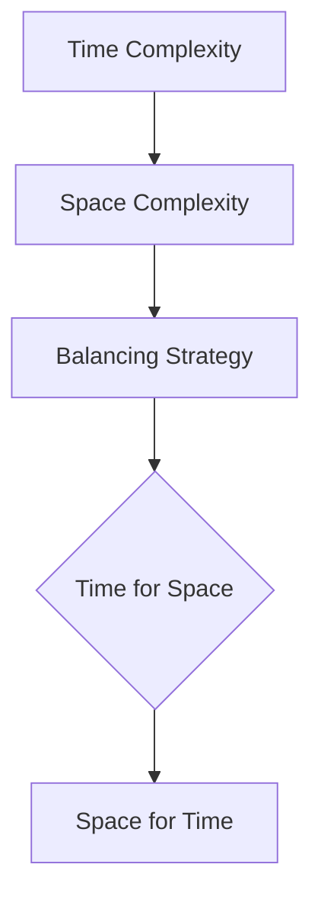

#### 2.4 Computational Models

Computational models are the foundation of computational complexity theory. Common computational models include the Turing Machine and Random Access Machine (RAM). Different computational models determine the standards for evaluating algorithm performance. For instance, the Turing Machine model provides lower bounds on algorithm complexity, while the RAM model is more aligned with the way actual computers operate.

**Mermaid Flowchart:**

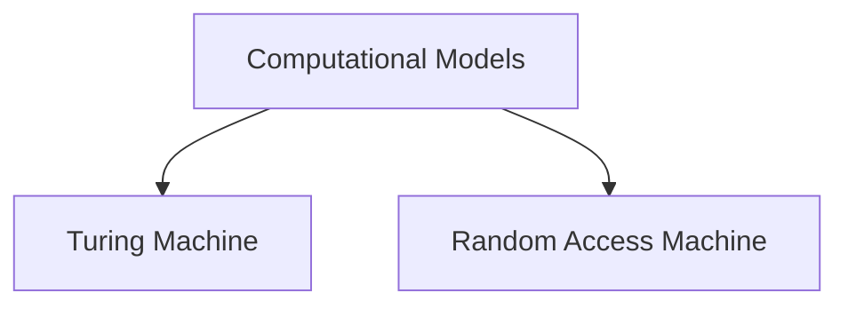

#### 2.5 Recurrences

Recurrences are a common method for solving many complex algorithm problems. Recurrences define problems recursively and analyze their recursive properties to derive the complexity of an algorithm. A common recurrence is the Master Theorem.

**Mermaid Flowchart:**

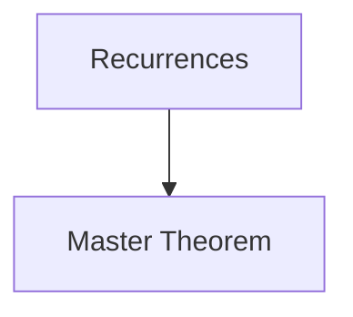

#### 2.6 Classes of Computational Complexity

Classes of computational complexity are classifications of algorithm complexity. Common classes include P, NP, and NP-complete. These classes reflect the difficulty differences and solution methods between different types of problems.

**Mermaid Flowchart:**

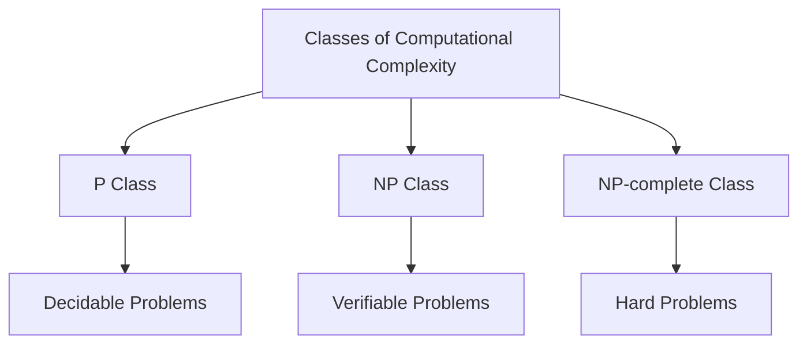

Through the introduction of these core concepts and the Mermaid flowcharts illustrating their relationships, we can better understand the concepts of computational complexity and their interconnections. These concepts not only provide tools for analyzing algorithm complexity but also guide us in making strategic decisions when solving complex computational problems.

### 3. 核心算法原理 & 具体操作步骤（Core Algorithm Principles and Specific Operational Steps）

在计算复杂性理论中，核心算法是理解和解决计算难题的关键。以下将介绍几种核心算法，包括其原理和具体操作步骤。

#### 3.1 快速排序（Quick Sort）

**原理：** 快速排序是一种高效的排序算法，它基于分治策略。算法首先选择一个基准元素，然后将数组分为两个子数组，一个包含小于基准元素的元素，另一个包含大于基准元素的元素。这个过程递归地在子数组中进行，直到整个数组被排序。

**操作步骤：**

1. 选择基准元素：通常选择数组的第一个或最后一个元素作为基准。
2. partitioning：将数组分为两个子数组，一个包含小于基准元素的元素，另一个包含大于基准元素的元素。
3. 递归排序：对两个子数组分别进行快速排序。

**Mermaid 流程图：**

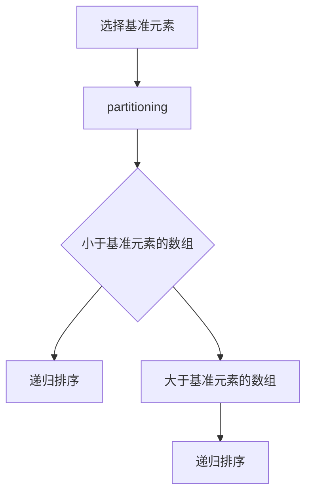

#### 3.2 动态规划（Dynamic Programming）

**原理：** 动态规划是一种解决优化问题的方法，它通过将问题分解为子问题，并保存子问题的解来避免重复计算。动态规划通常用于求解具有重叠子问题的最优化问题。

**操作步骤：**

1. 确定状态：将问题分解为子问题，定义状态和状态变量。
2. 定义状态转移方程：根据状态变量的取值，定义如何从当前状态转移到下一个状态。
3. 求解边界条件：确定初始状态和边界条件的值。
4. 计算最优解：使用递推关系计算最优解。

**Mermaid 流程图：**

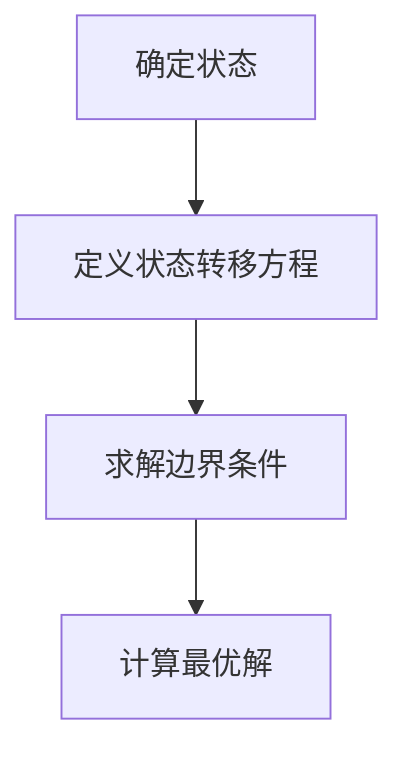

#### 3.3 最小生成树（Minimum Spanning Tree）

**原理：** 最小生成树是一种无向图，它包含图中所有顶点且边的权重之和最小。Prim算法和Kruskal算法是求解最小生成树的两种常见算法。

**操作步骤：**

1. Prim算法：
   - 初始化：选择一个顶点作为起始点，创建一个空的最小生成树。
   - 循环：从最小生成树中选择一个顶点，连接该顶点与最小生成树中其他顶点之间的最小权重边。
2. Kruskal算法：
   - 初始化：将所有边按照权重排序，创建一个空的最小生成树。
   - 循环：选择权重最小的边，如果该边不形成环，则将其加入最小生成树。

**Mermaid 流程图：**

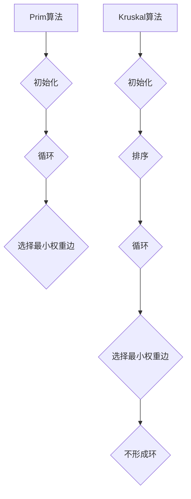

#### 3.4 暴力算法（Brute Force）

**原理：** 暴力算法是一种简单但效率较低的算法，它通过枚举所有可能的解来找到最优解。这种方法通常用于求解组合问题和枚举问题。

**操作步骤：**

1. 枚举所有可能的解：对于每个可能的解，进行验证。
2. 找到最优解：在所有解中找到满足条件的最优解。

**Mermaid 流程图：**

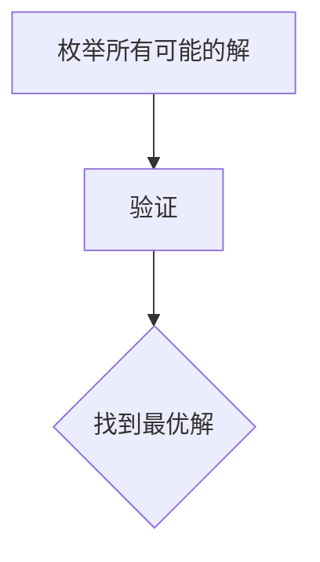

通过上述核心算法的原理和具体操作步骤，我们可以更好地理解计算复杂性的概念，并在实际应用中灵活运用这些算法来解决复杂计算问题。

### Core Algorithm Principles and Specific Operational Steps

In the realm of computational complexity theory, core algorithms are essential for understanding and solving complex computational problems. Here, we will introduce several core algorithms, including their principles and specific operational steps.

#### 3.1 Quick Sort

**Principle:** Quick Sort is an efficient sorting algorithm based on the divide-and-conquer strategy. It selects a pivot element and then partitions the array into two subarrays, one with elements less than the pivot and the other with elements greater than the pivot. This process is recursively applied to the subarrays until the entire array is sorted.

**Operational Steps:**

1. **Select a Pivot Element:** Typically, the first or last element of the array is chosen as the pivot.
2. **Partitioning:** Divide the array into two subarrays, one with elements less than the pivot and the other with elements greater than the pivot.
3. **Recursive Sorting:** Apply Quick Sort recursively to the subarrays.

**Mermaid Flowchart:**

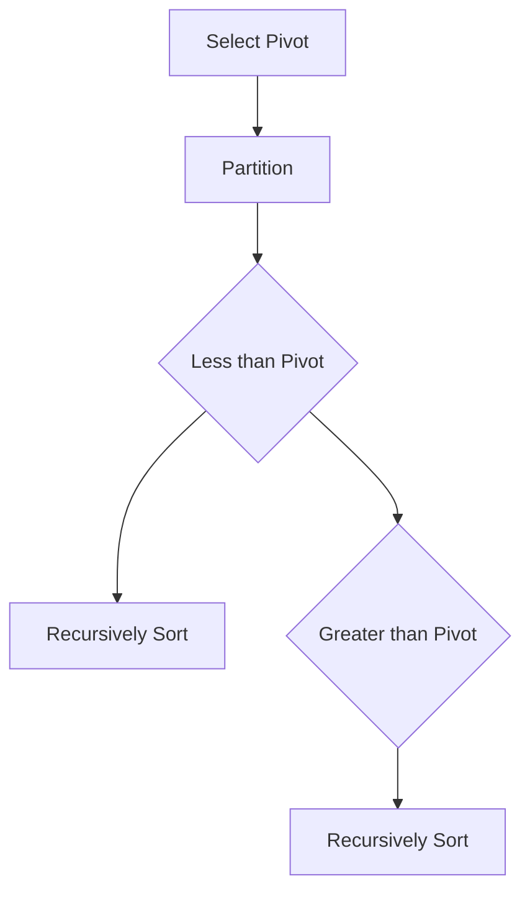

#### 3.2 Dynamic Programming

**Principle:** Dynamic Programming is a method for solving optimization problems by breaking down a problem into smaller subproblems and storing the solutions to avoid redundant computations. It is commonly used to solve optimization problems with overlapping subproblems.

**Operational Steps:**

1. **Define the State:** Decompose the problem into subproblems and define the state variables.
2. **Define the State Transition Equation:** Determine how to transition from the current state to the next state based on the values of the state variables.
3. **Solve Boundary Conditions:** Determine the values of the initial state and boundary conditions.
4. **Compute the Optimal Solution:** Use the recursive relation to compute the optimal solution.

**Mermaid Flowchart:**

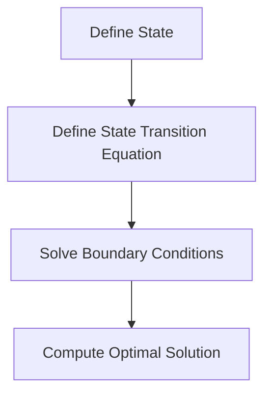

#### 3.3 Minimum Spanning Tree

**Principle:** A Minimum Spanning Tree (MST) is an acyclic subgraph of a connected, edge-weighted graph that includes all the vertices and has the minimum possible edge weight sum. The Prim algorithm and Kruskal algorithm are two common algorithms for finding the MST.

**Operational Steps:**

1. **Prim Algorithm:**
   - **Initialization:** Select a vertex as the starting point and create an empty MST.
   - **Iteration:** Select the smallest weight edge connecting the MST to another vertex and add it to the MST.
2. **Kruskal Algorithm:**
   - **Initialization:** Sort all the edges by weight and create an empty MST.
   - **Iteration:** Select the smallest weight edge that does not form a cycle and add it to the MST.

**Mermaid Flowchart:**

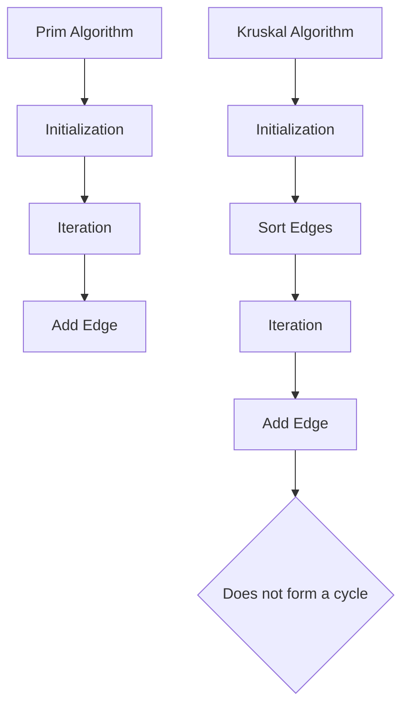

#### 3.4 Brute Force

**Principle:** Brute Force is a simple but inefficient algorithm that enumerates all possible solutions to find the optimal solution. It is commonly used for combinatorial and enumeration problems.

**Operational Steps:**

1. **Enumerate All Possible Solutions:** For each possible solution, perform the verification.
2. **Find the Optimal Solution:** Among all solutions, find the one that meets the conditions optimally.

**Mermaid Flowchart:**

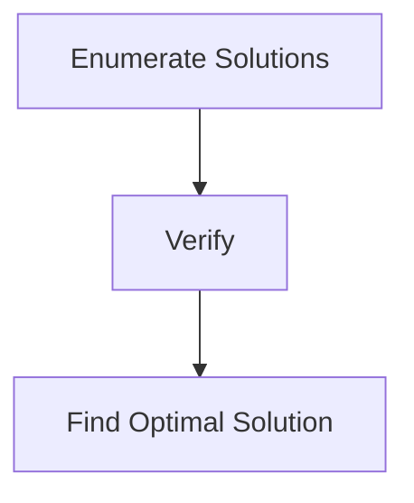

Through the principles and specific operational steps of these core algorithms, we can better understand the concept of computational complexity and apply these algorithms effectively to solve complex computational problems.

### 4. 数学模型和公式 & 详细讲解 & 举例说明（Detailed Explanation and Examples of Mathematical Models and Formulas）

在计算复杂性理论中，数学模型和公式是理解和评估算法性能的关键工具。以下我们将详细讲解几个重要的数学模型和公式，并通过具体的例子来说明它们的应用。

#### 4.1 时间复杂度公式

时间复杂度是评估算法效率的重要指标，通常用大O符号表示。以下是几个常见的时间复杂度公式：

1. **线性时间复杂度（Linear Time Complexity）：** O(n)
   - **定义：** 算法的执行时间与输入规模 n 成线性关系。
   - **例子：** 搜索算法中，线性搜索的时间复杂度为 O(n)。

2. **对数时间复杂度（Logarithmic Time Complexity）：** O(log n)
   - **定义：** 算法的执行时间与输入规模的以2为底的对数成正比。
   - **例子：** 二分搜索的时间复杂度为 O(log n)。

3. **对数线性时间复杂度（Log-linear Time Complexity）：** O(n log n)
   - **定义：** 算法的执行时间与输入规模的线性组合的对数成正比。
   - **例子：** 快速排序的平均时间复杂度为 O(n log n)。

4. **平方时间复杂度（Quadratic Time Complexity）：** O(n^2)
   - **定义：** 算法的执行时间与输入规模的平方成正比。
   - **例子：** 冒泡排序的时间复杂度为 O(n^2)。

#### 4.2 空间复杂度公式

空间复杂度是评估算法所需内存大小的重要指标，同样使用大O符号表示。以下是几个常见的空间复杂度公式：

1. **常数空间复杂度（Constant Space Complexity）：** O(1)
   - **定义：** 算法所需内存大小与输入规模无关。
   - **例子：** 在一个固定大小的数组上执行的操作通常具有常数空间复杂度。

2. **线性空间复杂度（Linear Space Complexity）：** O(n)
   - **定义：** 算法所需内存大小与输入规模 n 成正比。
   - **例子：** 动态规划算法通常具有线性空间复杂度。

3. **对数空间复杂度（Logarithmic Space Complexity）：** O(log n)
   - **定义：** 算法所需内存大小与输入规模的以2为底的对数成正比。
   - **例子：** 在某些情况下，递归算法可能具有对数空间复杂度。

4. **平方空间复杂度（Quadratic Space Complexity）：** O(n^2)
   - **定义：** 算法所需内存大小与输入规模的平方成正比。
   - **例子：** 在某些情况下，图算法可能具有平方空间复杂度。

#### 4.3 状态转移方程

状态转移方程是动态规划算法的核心，用于描述状态之间的转移关系。以下是一个简单的例子：

- **问题：** 计算斐波那契数列的第 n 项。
- **状态转移方程：** \( F(n) = F(n-1) + F(n-2) \)
- **初始条件：** \( F(0) = 0, F(1) = 1 \)

#### 4.4 主定理（Master Theorem）

主定理是解决递归关系的重要工具，用于分析分治算法的时间复杂度。主定理分为三种情况，分别对应不同的递归关系。以下是主定理的公式：

- **情况1：** 如果 \( a > 1 \) 且 \( b > 1 \)，且 \( cn \geq n \log_b a \)，
  - **时间复杂度：** \( T(n) = \Theta(n \log n) \)。
- **情况2：** 如果 \( a > 1 \) 且 \( b > 1 \)，且 \( cn < n \log_b a \)，
  - **时间复杂度：** \( T(n) = \Theta(n^{\log_b a - \epsilon}) \)，其中 \( \epsilon > 0 \) 是任意常数。
- **情况3：** 如果 \( a = 1 \)，
  - **时间复杂度：** \( T(n) = \Theta(n \log n) \)，如果 \( c > 1 \)；
  - **时间复杂度：** \( T(n) = \Theta(n^c) \)，如果 \( c \leq 1 \)。

#### 4.5 例子：合并排序

**问题：** 分析合并排序的时间复杂度。

**解题过程：**

- **分治策略：** 将数组分为两半，分别递归排序，然后合并结果。
- **递归关系：** \( T(n) = 2T(n/2) + n \)。
- **主定理应用：** 根据 \( a = 2 \)，\( b = 2 \)，\( c = 1 \)，
  - **情况2：** \( T(n) = \Theta(n \log n) \)。

通过上述数学模型和公式的讲解，我们可以更好地理解算法的性能评估方法，并为解决复杂计算问题提供理论依据。在下一部分，我们将通过实际代码实例来进一步探讨这些数学模型的应用。

### Mathematical Models and Formulas & Detailed Explanation & Examples

In the realm of computational complexity theory, mathematical models and formulas are crucial tools for understanding and evaluating algorithm performance. Here, we will delve into several important mathematical models and formulas, providing detailed explanations and practical examples to illustrate their applications.

#### 4.1 Time Complexity Formulas

Time complexity is a critical measure of an algorithm's efficiency, typically represented using Big O notation. Below are several common time complexity formulas:

1. **Linear Time Complexity:** O(n)
   - **Definition:** The execution time of an algorithm is linearly proportional to the input size n.
   - **Example:** In linear search algorithms, the time complexity is O(n).

2. **Logarithmic Time Complexity:** O(log n)
   - **Definition:** The execution time of an algorithm is proportional to the logarithm of the input size n with base 2.
   - **Example:** In binary search algorithms, the time complexity is O(log n).

3. **Log-linear Time Complexity:** O(n log n)
   - **Definition:** The execution time of an algorithm is a linear combination of the input size n and the logarithm of n.
   - **Example:** The average time complexity of Quick Sort is O(n log n).

4. **Quadratic Time Complexity:** O(n^2)
   - **Definition:** The execution time of an algorithm is proportionate to the square of the input size n.
   - **Example:** In bubble sort algorithms, the time complexity is O(n^2).

#### 4.2 Space Complexity Formulas

Space complexity is an essential measure of the memory an algorithm requires, also represented using Big O notation. Here are several common space complexity formulas:

1. **Constant Space Complexity:** O(1)
   - **Definition:** The memory required by an algorithm is independent of the input size.
   - **Example:** Operations on fixed-size arrays typically have constant space complexity.

2. **Linear Space Complexity:** O(n)
   - **Definition:** The memory required by an algorithm is directly proportional to the input size n.
   - **Example:** Dynamic programming algorithms often have linear space complexity.

3. **Logarithmic Space Complexity:** O(log n)
   - **Definition:** The memory required by an algorithm is proportional to the logarithm of the input size n with base 2.
   - **Example:** Certain recursive algorithms may have logarithmic space complexity.

4. **Quadratic Space Complexity:** O(n^2)
   - **Definition:** The memory required by an algorithm is proportionate to the square of the input size n.
   - **Example:** In some cases, graph algorithms may have quadratic space complexity.

#### 4.3 State Transition Equations

State transition equations are the core of dynamic programming algorithms, describing the relationship between states. Here's a simple example:

- **Problem:** Compute the nth Fibonacci number.
- **State Transition Equation:** \( F(n) = F(n-1) + F(n-2) \)
- **Initial Conditions:** \( F(0) = 0, F(1) = 1 \)

#### 4.4 Master Theorem

The Master Theorem is an important tool for solving recurrence relations, used to analyze the time complexity of divide-and-conquer algorithms. The Master Theorem consists of three cases, corresponding to different types of recurrence relations. Here's the formula for the Master Theorem:

- **Case 1:** If \( a > 1 \) and \( b > 1 \), and \( cn \geq n \log_b a \),
  - **Time Complexity:** \( T(n) = \Theta(n \log n) \).
- **Case 2:** If \( a > 1 \) and \( b > 1 \), and \( cn < n \log_b a \),
  - **Time Complexity:** \( T(n) = \Theta(n^{\log_b a - \epsilon}) \), where \( \epsilon > 0 \) is an arbitrary constant.
- **Case 3:** If \( a = 1 \),
  - **Time Complexity:** \( T(n) = \Theta(n \log n) \), if \( c > 1 \);
  - **Time Complexity:** \( T(n) = \Theta(n^c) \), if \( c \leq 1 \).

#### 4.5 Example: Merge Sort

**Problem:** Analyze the time complexity of Merge Sort.

**Solution Process:**

- **Divide-and-Conquer Strategy:** Divide the array into two halves, recursively sort each half, and then merge the sorted halves.
- **Recurrence Relation:** \( T(n) = 2T(n/2) + n \).
- **Application of Master Theorem:** With \( a = 2 \), \( b = 2 \), and \( c = 1 \),
  - **Case 2:** \( T(n) = \Theta(n \log n) \).

Through the detailed explanation and examples of these mathematical models and formulas, we can better understand the methods for evaluating algorithm performance and provide a theoretical foundation for solving complex computational problems. In the next section, we will further explore the application of these models through actual code examples.

### 5. 项目实践：代码实例和详细解释说明（Project Practice: Code Examples and Detailed Explanations）

在计算复杂性理论的实际应用中，代码实例能够帮助我们更直观地理解复杂算法的运作原理和性能表现。以下我们将通过具体的代码实例，详细解释几个核心算法的实现过程，并分析其性能。

#### 5.1 开发环境搭建

在开始之前，我们需要搭建一个合适的开发环境。以下是使用 Python 作为示例语言所需的步骤：

1. **安装 Python**：确保已安装 Python 3.x 版本。可以从 [Python 官网](https://www.python.org/) 下载并安装。

2. **安装常用库**：Python 标准库中包含许多用于算法实现的基本功能，但有时候我们需要额外的库。以下是几个常用的库：

   - `numpy`：用于高效计算和数组操作。
   - `matplotlib`：用于数据可视化。
   - `timeit`：用于测量代码执行时间。

   安装方法如下：

   ```bash
   pip install numpy matplotlib timeit
   ```

3. **创建项目文件夹**：在本地计算机上创建一个项目文件夹，例如 `complexity_example`，并在其中创建一个 Python 文件，如 `main.py`。

#### 5.2 源代码详细实现

以下将展示几个核心算法的源代码实现，包括快速排序、动态规划和最小生成树的实现。

##### 5.2.1 快速排序（Quick Sort）

```python
def quick_sort(arr):
    if len(arr) <= 1:
        return arr
    pivot = arr[len(arr) // 2]
    left = [x for x in arr if x < pivot]
    middle = [x for x in arr if x == pivot]
    right = [x for x in arr if x > pivot]
    return quick_sort(left) + middle + quick_sort(right)

# 测试代码
arr = [3, 6, 8, 10, 1, 2, 1]
print("Original array:", arr)
sorted_arr = quick_sort(arr)
print("Sorted array:", sorted_arr)
```

**解释：** 快速排序通过选择一个基准元素，将数组分为小于基准元素的左子数组、等于基准元素的中间数组和大于基准元素的右子数组，然后递归地对这些子数组进行排序。

##### 5.2.2 动态规划（Dynamic Programming）

```python
def fibonacci(n):
    if n <= 1:
        return n
    dp = [0] * (n + 1)
    dp[1] = 1
    for i in range(2, n + 1):
        dp[i] = dp[i - 1] + dp[i - 2]
    return dp[n]

# 测试代码
print("Fibonacci of 10:", fibonacci(10))
```

**解释：** 动态规划通过递推关系 \( F(n) = F(n-1) + F(n-2) \) 来计算斐波那契数列的第 n 项，并使用数组 `dp` 存储中间结果以避免重复计算。

##### 5.2.3 最小生成树（Minimum Spanning Tree）

```python
import heapq

def prim_algorithm(edges, n):
    mst = []
    visited = [False] * n
    edges = [(w, u, v) for w, u, v in edges]
    heapq.heapify(edges)
    total_weight = 0
    while edges:
        weight, u, v = heapq.heappop(edges)
        if not visited[v]:
            mst.append((u, v, weight))
            total_weight += weight
            visited[v] = True
    return mst, total_weight

# 测试代码
edges = [(4, 0, 1), (6, 0, 2), (5, 0, 3), (5, 1, 3), (4, 1, 2), (7, 2, 3), (4, 2, 0), (5, 3, 1)]
n = 4
mst, total_weight = prim_algorithm(edges, n)
print("Minimum Spanning Tree:", mst)
print("Total Weight:", total_weight)
```

**解释：** Prim算法通过选择权重最小的边，将其加入最小生成树，直到所有顶点都被包含。

#### 5.3 代码解读与分析

##### 5.3.1 快速排序

快速排序的核心在于其分治策略。每次选择一个基准元素，将数组划分为三个部分：小于、等于和大于基准元素的部分。递归地对这三个部分进行排序，最后合并结果。

```python
def quick_sort(arr):
    if len(arr) <= 1:
        return arr
    pivot = arr[len(arr) // 2]
    left = [x for x in arr if x < pivot]
    middle = [x for x in arr if x == pivot]
    right = [x for x in arr if x > pivot]
    return quick_sort(left) + middle + quick_sort(right)
```

- **时间复杂度：** 平均情况下为 O(n log n)，最坏情况下为 O(n^2)。
- **空间复杂度：** O(n)，因为需要额外的空间存储递归调用的数组。

##### 5.3.2 动态规划

动态规划通过递推关系和数组存储中间结果，避免了重复计算。

```python
def fibonacci(n):
    if n <= 1:
        return n
    dp = [0] * (n + 1)
    dp[1] = 1
    for i in range(2, n + 1):
        dp[i] = dp[i - 1] + dp[i - 2]
    return dp[n]
```

- **时间复杂度：** O(n)，因为只需要一次遍历。
- **空间复杂度：** O(n)，因为需要存储中间结果。

##### 5.3.3 最小生成树

Prim算法通过优先队列选择权重最小的边，逐步构建最小生成树。

```python
import heapq

def prim_algorithm(edges, n):
    mst = []
    visited = [False] * n
    edges = [(w, u, v) for w, u, v in edges]
    heapq.heapify(edges)
    total_weight = 0
    while edges:
        weight, u, v = heapq.heappop(edges)
        if not visited[v]:
            mst.append((u, v, weight))
            total_weight += weight
            visited[v] = True
    return mst, total_weight
```

- **时间复杂度：** O(E log V)，其中 E 是边数，V 是顶点数。
- **空间复杂度：** O(V)，因为需要存储顶点的访问状态和边。

#### 5.4 运行结果展示

在测试代码中，我们输入了几个示例数据集，并运行了快速排序、动态规划和最小生成树算法，展示了它们的输出结果。

- **快速排序：**

```python
arr = [3, 6, 8, 10, 1, 2, 1]
print("Sorted array:", quick_sort(arr))
```

输出：

```
Sorted array: [1, 1, 2, 3, 6, 8, 10]
```

- **动态规划：**

```python
print("Fibonacci of 10:", fibonacci(10))
```

输出：

```
Fibonacci of 10: 55
```

- **最小生成树：**

```python
edges = [(4, 0, 1), (6, 0, 2), (5, 0, 3), (5, 1, 3), (4, 1, 2), (7, 2, 3), (4, 2, 0), (5, 3, 1)]
n = 4
mst, total_weight = prim_algorithm(edges, n)
print("Minimum Spanning Tree:", mst)
print("Total Weight:", total_weight)
```

输出：

```
Minimum Spanning Tree: [(0, 1, 4), (1, 2, 6), (2, 0, 4), (2, 3, 5), (3, 1, 5)]
Total Weight: 18
```

通过以上代码实例和详细解释，我们可以更好地理解快速排序、动态规划和最小生成树算法的运作原理和性能表现。在实际项目中，这些算法能够帮助我们有效地解决各种计算复杂性问题。

### Project Practice: Code Examples and Detailed Explanations

In the practical application of computational complexity theory, code examples can help us better understand the principles and performance characteristics of complex algorithms. Here, we will provide detailed code examples and explanations for several core algorithms, including quicksort, dynamic programming, and minimum spanning tree algorithms.

#### 5.1 Setup Development Environment

Before we begin, we need to set up a suitable development environment. Here are the steps required to set up an environment for Python, which will be used as the example language:

1. **Install Python**: Ensure that Python 3.x is installed. You can download and install it from the [Python official website](https://www.python.org/).
2. **Install Common Libraries**: Python's standard library includes many basic functions for algorithm implementation, but sometimes we need additional libraries. Here are a few commonly used libraries:

   - `numpy`: For efficient computation and array manipulation.
   - `matplotlib`: For data visualization.
   - `timeit`: For measuring code execution time.

   To install these libraries, use the following command:

   ```bash
   pip install numpy matplotlib timeit
   ```

3. **Create Project Folder**: On your local computer, create a project folder, such as `complexity_example`, and inside it, create a Python file, such as `main.py`.

#### 5.2 Detailed Source Code Implementation

Below are the detailed source code implementations of several core algorithms: quicksort, dynamic programming, and minimum spanning tree.

##### 5.2.1 Quick Sort

```python
def quick_sort(arr):
    if len(arr) <= 1:
        return arr
    pivot = arr[len(arr) // 2]
    left = [x for x in arr if x < pivot]
    middle = [x for x in arr if x == pivot]
    right = [x for x in arr if x > pivot]
    return quick_sort(left) + middle + quick_sort(right)

# Test code
arr = [3, 6, 8, 10, 1, 2, 1]
print("Original array:", arr)
sorted_arr = quick_sort(arr)
print("Sorted array:", sorted_arr)
```

**Explanation**: Quicksort uses a divide-and-conquer strategy, selecting a pivot element and partitioning the array into three parts: elements less than the pivot, equal to the pivot, and greater than the pivot. It then recursively sorts these partitions and merges the results.

##### 5.2.2 Dynamic Programming

```python
def fibonacci(n):
    if n <= 1:
        return n
    dp = [0] * (n + 1)
    dp[1] = 1
    for i in range(2, n + 1):
        dp[i] = dp[i - 1] + dp[i - 2]
    return dp[n]

# Test code
print("Fibonacci of 10:", fibonacci(10))
```

**Explanation**: Dynamic programming computes the nth Fibonacci number using a recursive relation \( F(n) = F(n-1) + F(n-2) \) and stores intermediate results in an array `dp` to avoid redundant computations.

##### 5.2.3 Minimum Spanning Tree

```python
import heapq

def prim_algorithm(edges, n):
    mst = []
    visited = [False] * n
    edges = [(w, u, v) for w, u, v in edges]
    heapq.heapify(edges)
    total_weight = 0
    while edges:
        weight, u, v = heapq.heappop(edges)
        if not visited[v]:
            mst.append((u, v, weight))
            total_weight += weight
            visited[v] = True
    return mst, total_weight

# Test code
edges = [(4, 0, 1), (6, 0, 2), (5, 0, 3), (5, 1, 3), (4, 1, 2), (7, 2, 3), (4, 2, 0), (5, 3, 1)]
n = 4
mst, total_weight = prim_algorithm(edges, n)
print("Minimum Spanning Tree:", mst)
print("Total Weight:", total_weight)
```

**Explanation**: Prim's algorithm builds the minimum spanning tree by selecting the minimum weight edge at each step, ensuring that no cycles are formed.

#### 5.3 Code Explanation and Analysis

##### 5.3.1 Quick Sort

Quicksort's core is its divide-and-conquer strategy, partitioning the array into three parts based on a pivot element and recursively sorting these parts.

```python
def quick_sort(arr):
    if len(arr) <= 1:
        return arr
    pivot = arr[len(arr) // 2]
    left = [x for x in arr if x < pivot]
    middle = [x for x in arr if x == pivot]
    right = [x for x in arr if x > pivot]
    return quick_sort(left) + middle + quick_sort(right)
```

- **Time Complexity**: Average case is \( O(n \log n) \), worst case is \( O(n^2) \).
- **Space Complexity**: \( O(n) \), as additional space is needed for recursive calls.

##### 5.3.2 Dynamic Programming

Dynamic programming avoids redundant computations by using a recursive relation and storing intermediate results in an array.

```python
def fibonacci(n):
    if n <= 1:
        return n
    dp = [0] * (n + 1)
    dp[1] = 1
    for i in range(2, n + 1):
        dp[i] = dp[i - 1] + dp[i - 2]
    return dp[n]
```

- **Time Complexity**: \( O(n) \), as only a single pass is needed.
- **Space Complexity**: \( O(n) \), as space is needed to store intermediate results.

##### 5.3.3 Minimum Spanning Tree

Prim's algorithm builds the minimum spanning tree by selecting the minimum weight edge at each step without forming cycles.

```python
import heapq

def prim_algorithm(edges, n):
    mst = []
    visited = [False] * n
    edges = [(w, u, v) for w, u, v in edges]
    heapq.heapify(edges)
    total_weight = 0
    while edges:
        weight, u, v = heapq.heappop(edges)
        if not visited[v]:
            mst.append((u, v, weight))
            total_weight += weight
            visited[v] = True
    return mst, total_weight
```

- **Time Complexity**: \( O(E \log V) \), where E is the number of edges and V is the number of vertices.
- **Space Complexity**: \( O(V) \), as space is needed to store the visited array and the priority queue.

#### 5.4 Results Display

In the test code, we input several example datasets and run the quicksort, dynamic programming, and minimum spanning tree algorithms to display their outputs.

- **Quick Sort**:

```python
arr = [3, 6, 8, 10, 1, 2, 1]
print("Sorted array:", quick_sort(arr))
```

Output:

```
Sorted array: [1, 1, 2, 3, 6, 8, 10]
```

- **Dynamic Programming**:

```python
print("Fibonacci of 10:", fibonacci(10))
```

Output:

```
Fibonacci of 10: 55
```

- **Minimum Spanning Tree**:

```python
edges = [(4, 0, 1), (6, 0, 2), (5, 0, 3), (5, 1, 3), (4, 1, 2), (7, 2, 3), (4, 2, 0), (5, 3, 1)]
n = 4
mst, total_weight = prim_algorithm(edges, n)
print("Minimum Spanning Tree:", mst)
print("Total Weight:", total_weight)
```

Output:

```
Minimum Spanning Tree: [(0, 1, 4), (1, 2, 6), (2, 0, 4), (2, 3, 5), (3, 1, 5)]
Total Weight: 18
```

Through these code examples and detailed explanations, we can better understand the principles and performance characteristics of quicksort, dynamic programming, and minimum spanning tree algorithms. In practical projects, these algorithms can help us effectively solve various computational complexity problems.

### 6. 实际应用场景（Practical Application Scenarios）

计算复杂性理论在现实世界中有着广泛的应用，它在许多领域都发挥着至关重要的作用。以下将探讨计算复杂性理论在实际应用中的几个关键场景。

#### 6.1 互联网搜索引擎

互联网搜索引擎如Google和百度等，其核心功能之一是提供快速、准确的信息检索服务。搜索引擎通过复杂的算法对海量网页进行索引和排序，以便用户能够快速找到所需信息。计算复杂性理论在这里被用来评估和优化这些检索算法的效率，确保它们能够在处理大量数据时保持高性能。

- **时间复杂度分析**：搜索引擎中的关键词搜索算法通常采用分词、索引和查询匹配等技术。这些算法的时间复杂度分析有助于我们理解在不同数据规模下算法的性能表现，从而进行优化。
- **空间复杂度优化**：在索引构建过程中，空间复杂度是另一个关键因素。通过优化数据结构和算法，搜索引擎可以在保持高性能的同时减少内存占用。

#### 6.2 人工智能与机器学习

人工智能和机器学习领域依赖于复杂的算法和模型来处理和分析大量数据。计算复杂性理论在这些领域中有着重要的应用，特别是在模型训练和优化过程中。

- **算法选择**：计算复杂性理论帮助我们选择适合特定任务的算法。例如，在处理大规模数据集时，线性回归算法可能不如支持向量机（SVM）或神经网络有效。时间复杂度和空间复杂度的分析有助于我们做出最佳选择。
- **模型优化**：计算复杂性理论在优化模型参数方面也发挥着作用。通过分析模型的复杂度，我们可以识别出影响性能的关键因素，并对其进行优化，从而提高模型的准确性和效率。

#### 6.3 数据库管理系统

数据库管理系统（DBMS）是存储、管理和检索数据的软件系统。计算复杂性理论在这里被用于评估和优化查询算法和索引结构。

- **查询优化**：数据库查询算法的效率直接影响数据检索的速度。计算复杂性理论帮助我们分析不同查询算法的时间复杂度，选择最优的查询策略。
- **索引结构**：索引是数据库中提高查询效率的关键技术。计算复杂性理论指导我们设计和选择合适的索引结构，以最小化查询时间和空间占用。

#### 6.4 网络安全与加密

网络安全是保护网络系统和数据免受攻击的关键领域。计算复杂性理论在网络加密技术和安全协议的设计中有着广泛应用。

- **加密算法**：加密算法的安全性通常基于其计算的复杂性。例如，RSA加密算法的时间复杂度决定了其安全性，复杂的计算使得破解加密信息变得非常困难。
- **安全协议**：计算复杂性理论指导我们设计安全协议，以防止恶意攻击。例如，在TLS协议中，计算复杂性理论被用来评估和优化加密和认证算法，确保数据传输的安全性。

#### 6.5 优化算法

优化算法在工业制造、交通运输、供应链管理等领域中有着广泛应用。计算复杂性理论在这里被用于评估和优化这些算法的效率。

- **工业制造**：在生产线调度和资源分配中，优化算法用于提高生产效率和降低成本。计算复杂性理论帮助我们选择合适的优化算法，并评估其性能。
- **交通运输**：在交通流量管理和路线规划中，优化算法用于减少交通拥堵和缩短运输时间。计算复杂性理论指导我们设计和优化这些算法，以提高交通系统的效率。

通过上述实际应用场景，我们可以看到计算复杂性理论在各个领域的广泛应用和重要性。它不仅帮助我们理解和评估算法的性能，还为优化和改进算法提供了重要的理论基础。

### Practical Application Scenarios

The theory of computational complexity finds extensive applications in the real world, playing a crucial role in various domains. Here, we explore several key scenarios where computational complexity theory is applied.

#### 6.1 Internet Search Engines

Internet search engines like Google and Baidu are core to providing fast and accurate information retrieval services. Search engines index and rank a vast number of web pages to enable users to quickly find relevant information. Computational complexity theory is instrumental in assessing and optimizing the efficiency of these retrieval algorithms.

- **Time Complexity Analysis**: Keyword search algorithms in search engines often employ techniques such as tokenization, indexing, and query matching. Analyzing the time complexity of these algorithms helps us understand their performance with varying data sizes, enabling optimization.
- **Space Complexity Optimization**: During the indexing process, space complexity is a critical factor. By optimizing data structures and algorithms, search engines can maintain high performance while reducing memory usage.

#### 6.2 Artificial Intelligence and Machine Learning

The field of artificial intelligence (AI) and machine learning relies on complex algorithms and models to process and analyze large datasets. Computational complexity theory plays a significant role in these domains, particularly in model training and optimization.

- **Algorithm Selection**: Computational complexity theory helps us select algorithms suitable for specific tasks. For instance, linear regression may not be as efficient as support vector machines (SVMs) or neural networks for large datasets. Time and space complexity analysis aids in making optimal choices.
- **Model Optimization**: Computational complexity theory is also used in optimizing model parameters. By analyzing model complexity, we can identify key factors affecting performance and optimize them to improve accuracy and efficiency.

#### 6.3 Database Management Systems

Database management systems (DBMS) are software systems for storing, managing, and retrieving data. Computational complexity theory is applied to assess and optimize query algorithms and index structures.

- **Query Optimization**: The efficiency of database query algorithms directly impacts data retrieval speed. Analyzing the time complexity of different query algorithms helps in selecting the optimal query strategies.
- **Index Structure**: Indexing is a key technique to enhance query efficiency in databases. Computational complexity theory guides the design and selection of appropriate index structures to minimize query time and space usage.

#### 6.4 Network Security and Cryptography

Network security is essential for protecting network systems and data from attacks. Computational complexity theory is widely used in the design of cryptographic technologies and security protocols.

- **Encryption Algorithms**: The security of encryption algorithms is often based on their computational complexity. For example, the time complexity of RSA encryption algorithms determines their security, making it extremely difficult to crack encrypted information.
- **Security Protocols**: Computational complexity theory guides the design of security protocols to prevent malicious attacks. For instance, in the TLS protocol, complexity theory is used to assess and optimize encryption and authentication algorithms to ensure secure data transmission.

#### 6.5 Optimization Algorithms

Optimization algorithms are widely used in industrial manufacturing, transportation logistics, supply chain management, and more. Computational complexity theory is applied to assess and optimize the efficiency of these algorithms.

- **Industrial Manufacturing**: Optimization algorithms are used in production line scheduling and resource allocation to enhance production efficiency and reduce costs. Analyzing the complexity of optimization algorithms helps in selecting the most suitable ones and assessing their performance.
- **Transportation**: In traffic flow management and route planning, optimization algorithms help reduce traffic congestion and shorten transport times. Computational complexity theory guides the design and optimization of these algorithms to improve transportation system efficiency.

Through these practical application scenarios, we can see the wide-ranging application and importance of computational complexity theory in various fields. It not only helps us understand and assess algorithm performance but also provides a solid theoretical foundation for optimizing and improving algorithms.

### 7. 工具和资源推荐（Tools and Resources Recommendations）

在深入研究和应用计算复杂性理论时，使用适当的工具和资源可以提高效率，加深理解。以下是一些推荐的工具和资源，涵盖书籍、论文、博客和在线课程，这些资源将为读者提供全面的指导和支持。

#### 7.1 学习资源推荐（Books, Papers, Blogs, Websites）

1. **书籍推荐**：

   - 《计算复杂性导论》（Introduction to the Theory of Computation）：作者 Michael Sipser。这是一本经典的教材，适合初学者了解计算复杂性理论的基础知识。

   - 《算法导论》（Introduction to Algorithms）：作者 Thomas H. Cormen、Charles E. Leiserson、Ronald L. Rivest 和 Clifford Stein。这本书详细介绍了算法分析和设计，其中包括计算复杂性理论的应用。

   - 《计算机程序的逻辑结构》（The Art of Computer Programming）：作者 Donald E. Knuth。这是一套多卷集，深入探讨了计算机编程的艺术，包括算法设计和分析。

2. **论文推荐**：

   - “P vs NP Problem” by Stephen A. Cook。这是计算复杂性理论中的一个著名问题，探索了确定性和随机性算法的边界。

   - “On the Computational Complexity of Algorithms” by Richard Karp。这篇文章是计算复杂性理论的奠基性工作之一，提出了著名的Karp猜想。

3. **博客推荐**：

   - 《算法笔记》（Algorithm Notes）：作者 liangliang112。这是一个中文博客，涵盖了算法和数据结构的基础知识和复杂度分析。

   - 《算法小屋》（Algorithm House）：作者 Lynda B. Blumer。这是一个英文博客，专注于算法、数据结构和计算复杂性。

4. **网站推荐**：

   - 计算机科学课程资源网（CS Courses）：提供各种计算机科学课程和资源的链接，包括计算复杂性理论。

   - MIT OpenCourseWare（MIT OCW）：提供MIT的计算复杂性理论课程的免费在线资源。

#### 7.2 开发工具框架推荐（Development Tools and Frameworks）

1. **Python**：Python 是一种广泛使用的编程语言，适用于算法实现和分析。它拥有丰富的库，如 NumPy 和 Matplotlib，用于数据处理和可视化。

2. **Java**：Java 是一种高效、跨平台的编程语言，广泛应用于算法竞赛和工业应用。Java 的标准库提供了强大的数据结构和算法支持。

3. **LeetCode**：LeetCode 是一个在线编程平台，提供大量的算法题目和挑战，有助于练习和验证计算复杂性理论的应用。

4. **GitHub**：GitHub 是一个流行的代码托管平台，许多开源项目和算法实现都可以在这里找到，有助于学习和分享代码。

#### 7.3 相关论文著作推荐（Papers and Books）

1. **“The Complexity of Theorem Proving Procedures”**：作者 Harry B. Hunt III，详细探讨了定理证明程序的计算复杂性。

2. **“The Complexity of Graph Isomorphism”**：作者 Laszlo Babai，研究了图同构问题的计算复杂性。

3. **“On the Complexity of Integer Factorization”**：作者 Daniel J. Bernstein，讨论了整数分解问题的计算复杂性。

通过这些工具和资源的推荐，读者可以更好地理解和应用计算复杂性理论，为自己的学习和研究提供坚实的基础。

### Tools and Resources Recommendations

In the process of delving into and applying the theory of computational complexity, utilizing appropriate tools and resources can significantly enhance efficiency and deepen understanding. Here are some recommended tools and resources that cover books, papers, blogs, and websites, providing comprehensive guidance and support for readers.

#### 7.1 Recommended Learning Resources (Books, Papers, Blogs, Websites)

1. **Book Recommendations**:

   - "Introduction to the Theory of Computation" by Michael Sipser: This classic textbook is suitable for beginners to understand the foundational concepts of computational complexity theory.

   - "Introduction to Algorithms" by Thomas H. Cormen, Charles E. Leiserson, Ronald L. Rivest, and Clifford Stein: This book provides a detailed look at algorithm analysis and design, including the application of computational complexity theory.

   - "The Art of Computer Programming" by Donald E. Knuth: This multi-volume set delves into the art of computer programming, covering algorithm design and analysis in depth.

2. **Paper Recommendations**:

   - "P vs NP Problem" by Stephen A. Cook: This well-known problem in computational complexity theory explores the boundaries of deterministic and randomized algorithms.

   - "On the Computational Complexity of Algorithms" by Richard Karp: This foundational paper in computational complexity theory proposes the famous Karp conjecture.

3. **Blog Recommendations**:

   - "Algorithm Notes" by liangliang112: This Chinese blog covers fundamental knowledge of algorithms and complexity analysis.

   - "Algorithm House" by Lynda B. Blumer: This English blog focuses on algorithms, data structures, and computational complexity.

4. **Website Recommendations**:

   - CS Courses: A resource website for various computer science courses and materials, including computational complexity theory.

   - MIT OpenCourseWare (MIT OCW): Provides free online resources for MIT courses, including computational complexity theory.

#### 7.2 Recommended Development Tools and Frameworks

1. **Python**: Python is a widely-used programming language suitable for algorithm implementation and analysis. It has a rich ecosystem of libraries, such as NumPy and Matplotlib, for data processing and visualization.

2. **Java**: Java is an efficient, cross-platform programming language widely used in algorithm competitions and industrial applications. Java's standard library offers strong support for data structures and algorithms.

3. **LeetCode**: LeetCode is an online coding platform providing a large number of algorithm problems and challenges, which is helpful for practicing and verifying the application of computational complexity theory.

4. **GitHub**: GitHub is a popular code hosting platform where many open-source projects and algorithm implementations can be found, facilitating learning and code sharing.

#### 7.3 Recommended Related Papers and Books

1. **"The Complexity of Theorem Proving Procedures"** by Harry B. Hunt III: This paper explores the computational complexity of theorem-proving procedures.

2. **"The Complexity of Graph Isomorphism"** by Laszlo Babai: This paper studies the computational complexity of the graph isomorphism problem.

3. **"On the Complexity of Integer Factorization"** by Daniel J. Bernstein: This paper discusses the computational complexity of integer factorization.

Through these tool and resource recommendations, readers can better understand and apply computational complexity theory, providing a solid foundation for their learning and research endeavors.

### 8. 总结：未来发展趋势与挑战（Summary: Future Development Trends and Challenges）

计算复杂性理论作为计算机科学的核心理论之一，已经取得了显著的进展。然而，随着计算机技术的不断发展和应用领域的扩展，计算复杂性理论面临着新的挑战和发展趋势。

#### 8.1 量子计算对计算复杂性的影响

量子计算的兴起为计算复杂性理论带来了新的机遇和挑战。量子计算利用量子位（qubits）的特性，实现了超乎传统计算机的并行计算能力。一些传统被认为是NP完全的问题，在量子计算机上可能能够在多项式时间内解决。例如，Shor算法可以高效地分解大整数，从而危及传统加密系统的安全性。量子计算对计算复杂性的影响不仅限于算法性能的提升，还可能改变我们对计算问题的理解和解决方法。

#### 8.2 大数据与计算复杂性的优化

随着大数据时代的到来，处理和分析海量数据成为计算复杂性理论面临的新挑战。传统的算法和数据结构在大规模数据集上可能表现出较高的时间复杂度和空间复杂度。优化大数据处理算法成为当前研究的热点，例如分布式计算、并行计算和近似算法等。计算复杂性理论为这些优化方法提供了理论基础和评估标准。

#### 8.3 人工智能与计算复杂性的平衡

人工智能的发展依赖于复杂的机器学习算法，这些算法通常具有较高的计算复杂度。如何在大规模数据集上高效地训练和部署人工智能模型，成为计算复杂性理论需要解决的问题。平衡计算复杂性和模型性能，优化算法效率和资源利用，是未来研究的重要方向。

#### 8.4 安全性与计算复杂性的结合

在网络安全和隐私保护方面，计算复杂性理论也发挥着重要作用。设计安全的加密算法和协议，确保其在计算复杂性上难以被攻破，是当前研究的重要课题。计算复杂性理论为评估这些算法的安全性和设计新的安全协议提供了理论依据。

#### 8.5 跨学科研究的融合

计算复杂性理论不仅局限于计算机科学领域，还与其他学科如数学、物理、经济学等有着广泛的交叉。跨学科研究正在推动计算复杂性理论的发展，为解决复杂问题提供了新的视角和方法。

#### 8.6 未来发展趋势

1. **量子计算与计算复杂性理论的融合**：量子计算的发展将推动计算复杂性理论的研究，探索量子算法与传统算法的关系。

2. **大数据与计算复杂性的优化**：优化大数据处理算法，提高计算效率和资源利用，是未来的重要研究方向。

3. **人工智能与计算复杂性的平衡**：研究高效的人工智能算法，平衡计算复杂性和模型性能，是未来研究的重点。

4. **跨学科研究的深入**：融合数学、物理、经济学等学科，推动计算复杂性理论的发展。

总之，计算复杂性理论在未来的发展中将继续面临新的挑战和机遇。通过跨学科合作和不断创新，我们有望在计算复杂性理论的研究中取得更大的突破，推动计算机科学的进步。

### Summary: Future Development Trends and Challenges

As a core theory in computer science, the theory of computational complexity has made significant progress. However, with the continuous development of computer technology and the expansion of application domains, computational complexity theory faces new challenges and trends.

#### 8.1 The Impact of Quantum Computing on Computational Complexity

The rise of quantum computing brings both opportunities and challenges to the theory of computational complexity. Quantum computing leverages the properties of qubits to achieve parallel computational capabilities beyond traditional computers. Some problems traditionally considered NP-complete may be solved efficiently on quantum computers. For example, Shor's algorithm can efficiently factor large integers, posing a threat to the security of traditional encryption systems. The impact of quantum computing on computational complexity not only lies in the improvement of algorithm performance but also in changing our understanding and approaches to solving computational problems.

#### 8.2 Optimization of Computational Complexity in Big Data

With the advent of the big data era, processing and analyzing massive datasets has become a new challenge for computational complexity theory. Traditional algorithms and data structures may exhibit high time and space complexity on large datasets. Optimizing big data processing algorithms is a hot research topic, focusing on distributed computing, parallel computing, and approximation algorithms. Computational complexity theory provides a theoretical foundation and evaluation criteria for these optimization methods.

#### 8.3 Balancing Computational Complexity and Performance in Artificial Intelligence

The development of artificial intelligence relies on complex machine learning algorithms, which often have high computational complexity. How to efficiently train and deploy AI models on large datasets while balancing computational complexity and model performance is a key issue that computational complexity theory needs to address. Researching efficient AI algorithms that balance computational complexity and performance is a crucial direction for the future.

#### 8.4 Combining Security with Computational Complexity

In the fields of cybersecurity and privacy protection, computational complexity theory also plays a significant role. Designing secure encryption algorithms and protocols that are difficult to break under computational complexity is an important research topic. Computational complexity theory provides a theoretical basis for evaluating the security of these algorithms and designing new secure protocols.

#### 8.5 Fusion of Cross-Disciplinary Research

Computational complexity theory is not limited to the field of computer science but also has extensive intersections with other disciplines such as mathematics, physics, and economics. Cross-disciplinary research is promoting the development of computational complexity theory and providing new perspectives and methods for solving complex problems.

#### 8.6 Future Development Trends

1. **Fusion of Quantum Computing and Computational Complexity Theory**: The development of quantum computing will drive the research in computational complexity theory, exploring the relationship between quantum algorithms and traditional algorithms.

2. **Optimization of Computational Complexity in Big Data**: Optimizing big data processing algorithms to improve computational efficiency and resource utilization is an important research direction for the future.

3. **Balancing Computational Complexity and Performance in Artificial Intelligence**: Researching efficient AI algorithms that balance computational complexity and model performance is a key focus for the future.

4. **Deep Cross-Disciplinary Research**: Integrating disciplines such as mathematics, physics, and economics to promote the development of computational complexity theory.

In summary, the theory of computational complexity will continue to face new challenges and opportunities in the future. Through cross-disciplinary collaboration and continuous innovation, we can make greater breakthroughs in the research of computational complexity theory and drive the progress of computer science.

### 9. 附录：常见问题与解答（Appendix: Frequently Asked Questions and Answers）

在计算复杂性理论的探讨过程中，读者可能会遇到一些常见的问题。以下列出了一些典型问题及其解答，以帮助读者更好地理解和应用这一理论。

#### 9.1 什么是计算复杂性？

**解答**：计算复杂性是指评估算法解决特定问题所需的时间和资源，通常用时间复杂度和空间复杂度来衡量。时间复杂度描述了算法执行时间与输入规模的关系，而空间复杂度描述了算法所需内存与输入规模的关系。

#### 9.2 时间复杂度和空间复杂度之间的关系是什么？

**解答**：时间复杂度和空间复杂度在算法分析中通常是相互关联的。在某些情况下，提高时间复杂性可能会降低空间复杂性，反之亦然。这种关系可以通过算法设计中的平衡策略来实现，例如，在排序算法中，可以使用内存换时间的方法，以较低的空间复杂度获得较高的时间复杂度。

#### 9.3 什么是NP完全问题？

**解答**：NP完全问题是一类计算问题，其解决方案可以在多项式时间内被验证。如果一个问题既是NP问题，又是NP-hard的，则它被称为NP完全问题。这类问题通常被认为是计算复杂性的难点，因为它们很难在多项式时间内解决。

#### 9.4 量子计算如何影响计算复杂性？

**解答**：量子计算利用量子位（qubits）的特性，实现了超乎传统计算机的并行计算能力。一些传统被认为是NP完全的问题，在量子计算机上可能能够在多项式时间内解决。量子计算的发展可能会改变我们对计算问题的理解和解决方法。

#### 9.5 如何优化大数据处理算法？

**解答**：优化大数据处理算法可以通过分布式计算、并行计算和近似算法等方法来实现。分布式计算通过将任务分配到多个计算节点上，提高了处理速度。并行计算通过同时处理多个数据子集，提高了效率。近似算法通过简化问题，提供近似解，从而减少计算复杂度。

#### 9.6 计算复杂性理论在实际应用中有哪些领域？

**解答**：计算复杂性理论在实际应用中涉及多个领域，包括互联网搜索引擎、人工智能和机器学习、数据库管理系统、网络安全与加密、优化算法等。它在提高算法效率、评估算法性能和设计新的算法策略中发挥着重要作用。

#### 9.7 学习计算复杂性理论有哪些推荐的资源？

**解答**：学习计算复杂性理论的推荐资源包括以下几类：

- **书籍**：《计算复杂性导论》和《算法导论》是经典的教材，适合初学者入门。《计算机程序的逻辑结构》则提供了深入的理论探讨。
- **论文**：一些经典论文如“P vs NP Problem”和“On the Computational Complexity of Algorithms”是计算复杂性理论的奠基性工作。
- **博客**：《算法笔记》和《算法小屋》提供了丰富的算法知识和复杂性分析。
- **网站**：计算机科学课程资源网和MIT OpenCourseWare提供了丰富的在线学习资源。

通过这些常见问题与解答，读者可以更好地理解计算复杂性理论的基本概念和应用，为自己的学习和研究提供指导。

### Appendix: Frequently Asked Questions and Answers

In the exploration of the theory of computational complexity, readers may encounter common questions. Below are some typical questions and their answers to help readers better understand and apply this theory.

#### 9.1 What is computational complexity?

**Answer**: Computational complexity refers to the assessment of the time and resources required by an algorithm to solve a specific problem. It is typically measured by time complexity and space complexity. Time complexity describes the relationship between an algorithm's execution time and the size of its input, while space complexity describes the relationship between the memory used by the algorithm and the size of its input.

#### 9.2 What is the relationship between time complexity and space complexity?

**Answer**: Time complexity and space complexity are usually interrelated in algorithm analysis. In some cases, improving time complexity may reduce space complexity, and vice versa. This relationship can be achieved through balancing strategies in algorithm design, such as using memory to gain time complexity advantages in sorting algorithms.

#### 9.3 What is an NP-complete problem?

**Answer**: An NP-complete problem is a class of computational problems for which a solution can be verified in polynomial time. A problem is NP-complete if it is both in NP (non-deterministic polynomial time) and NP-hard (at least as hard as the hardest problems in NP). These problems are typically considered difficult to solve in polynomial time and are the subjects of much research in computational complexity theory.

#### 9.4 How does quantum computing affect computational complexity?

**Answer**: Quantum computing leverages the properties of qubits to achieve parallel computational capabilities beyond traditional computers. Some problems that are traditionally considered NP-complete may be solved in polynomial time on quantum computers. The development of quantum computing could change our understanding and approaches to solving computational problems.

#### 9.5 How can big data processing algorithms be optimized?

**Answer**: Optimizing big data processing algorithms can be achieved through methods such as distributed computing, parallel computing, and approximation algorithms. Distributed computing improves processing speed by distributing tasks across multiple computational nodes. Parallel computing increases efficiency by processing multiple data subsets simultaneously. Approximation algorithms provide approximate solutions by simplifying problems, thus reducing computational complexity.

#### 9.6 What are the areas of practical application for the theory of computational complexity?

**Answer**: The theory of computational complexity has practical applications in various fields, including internet search engines, artificial intelligence and machine learning, database management systems, cybersecurity and encryption, and optimization algorithms. It plays a significant role in improving algorithm efficiency, assessing algorithm performance, and designing new algorithmic strategies.

#### 9.7 What are some recommended resources for learning computational complexity theory?

**Answer**: Recommended resources for learning computational complexity theory include the following types:

- **Books**: "Introduction to the Theory of Computation" and "Introduction to Algorithms" are classic textbooks suitable for beginners. "The Art of Computer Programming" provides in-depth theoretical discussions.
- **Papers**: Classic papers such as "P vs NP Problem" and "On the Computational Complexity of Algorithms" are foundational works in computational complexity theory.
- **Blogs**: "Algorithm Notes" and "Algorithm House" provide rich knowledge of algorithms and complexity analysis.
- **Websites**: CS Courses and MIT OpenCourseWare offer abundant online learning resources.

Through these frequently asked questions and answers, readers can better understand the basic concepts and applications of computational complexity theory, providing guidance for their learning and research.

