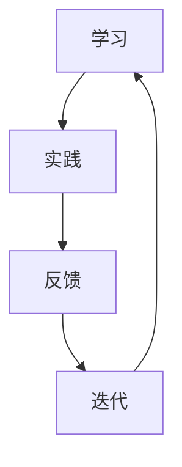

                 

# 认知渐进发展的三步过程

在人工智能领域，认知渐进发展的研究一直是热点。本文将深入探讨认知渐进发展的三步过程，从理论、实践和未来发展趋势三个方面进行分析。通过这一过程，我们不仅能够理解认知渐进发展的本质，还能为人工智能的发展提供新的视角。

## 1. 背景介绍（Background Introduction）

### 1.1 认知渐进发展的定义

认知渐进发展是指通过不断的学习和实践，个体的认知能力逐渐提高的过程。这个过程涉及到对知识的积累、理解和运用，最终形成较为全面和深刻的认知体系。

### 1.2 认知渐进发展的研究意义

认知渐进发展对于人工智能的发展具有重要意义。首先，它能够帮助我们更好地理解人类认知的机制，从而为人工智能的设计提供理论支持。其次，认知渐进发展可以为人工智能的应用提供有效的指导，提高人工智能的效能和智能水平。

## 2. 核心概念与联系（Core Concepts and Connections）

### 2.1 认知渐进发展的核心概念

认知渐进发展的核心概念包括：学习、实践、反馈和迭代。这四个概念相互联系，共同推动认知能力的提升。

#### 学习（Learning）

学习是认知渐进发展的基础。通过学习，个体能够获取新的知识和技能，从而扩展认知范围。

#### 实践（Practice）

实践是将所学知识应用于实际的过程。通过实践，个体能够检验和巩固所学知识，提高认知能力。

#### 反馈（Feedback）

反馈是认知渐进发展的重要环节。通过反馈，个体能够了解自己的认知水平，发现不足并加以改进。

#### 迭代（Iteration）

迭代是认知渐进发展的关键。通过不断的学习、实践和反馈，个体能够逐步提高认知能力，形成较为全面和深刻的认知体系。

### 2.2 认知渐进发展的联系

认知渐进发展与人工智能有着密切的联系。人工智能的发展需要借助认知渐进发展的理论指导，而认知渐进发展也需要人工智能的技术支持。两者相互促进，共同推动人工智能的发展。

### 2.3 Mermaid 流程图

以下是一个描述认知渐进发展过程的 Mermaid 流程图：



## 3. 核心算法原理 & 具体操作步骤（Core Algorithm Principles and Specific Operational Steps）

### 3.1 认知渐进发展的核心算法原理

认知渐进发展的核心算法原理可以概括为：通过学习、实践、反馈和迭代，逐步提高个体的认知能力。

#### 学习算法

学习算法是认知渐进发展的基础。常见的学习算法包括监督学习、无监督学习和强化学习等。

- **监督学习**：通过已标记的数据来训练模型，使其能够对新的数据进行预测。

- **无监督学习**：通过未标记的数据来发现数据中的规律，例如聚类和降维。

- **强化学习**：通过与环境的交互来学习最优策略，例如在游戏中学习最优动作序列。

#### 实践算法

实践算法是将所学知识应用于实际的过程。常见的实践算法包括模拟、实验和实际操作等。

- **模拟**：通过模拟环境来测试所学知识的有效性。

- **实验**：通过实验来验证所学知识的正确性。

- **实际操作**：通过实际操作来应用所学知识，提高认知能力。

#### 反馈算法

反馈算法是认知渐进发展的重要环节。常见的反馈算法包括评估、对比和改进等。

- **评估**：通过评估来了解个体的认知水平。

- **对比**：通过对比来发现不足，为改进提供依据。

- **改进**：通过改进来提高个体的认知能力。

#### 迭代算法

迭代算法是认知渐进发展的关键。常见的迭代算法包括重复、反馈和优化等。

- **重复**：通过重复来巩固所学知识。

- **反馈**：通过反馈来发现不足，为改进提供依据。

- **优化**：通过优化来提高个体的认知能力。

### 3.2 具体操作步骤

1. **确定学习目标**：明确个体需要学习的知识和技能。

2. **选择学习算法**：根据学习目标，选择合适的算法进行学习。

3. **进行实践**：将所学知识应用于实际，通过模拟、实验或实际操作来巩固所学知识。

4. **获取反馈**：通过评估、对比和改进来了解个体的认知水平。

5. **优化迭代**：根据反馈结果，对学习过程进行优化，以提高个体的认知能力。

## 4. 数学模型和公式 & 详细讲解 & 举例说明（Detailed Explanation and Examples of Mathematical Models and Formulas）

### 4.1 数学模型

认知渐进发展的数学模型可以表示为：

\[ A(t+1) = A(t) + f(A(t), X(t)) \]

其中：

- \( A(t) \) 表示在时间 \( t \) 的认知水平。

- \( X(t) \) 表示在时间 \( t \) 的学习输入。

- \( f(A(t), X(t)) \) 表示在时间 \( t \) 的学习函数。

### 4.2 公式讲解

1. **学习函数**

学习函数 \( f(A(t), X(t)) \) 描述了在给定当前认知水平 \( A(t) \) 和学习输入 \( X(t) \) 的情况下，认知水平的变化。具体来说，它可以表示为：

\[ f(A(t), X(t)) = \alpha \cdot \Delta A(t) \]

其中：

- \( \alpha \) 表示学习率。

- \( \Delta A(t) \) 表示认知水平的增量。

2. **实践函数**

实践函数描述了在给定当前认知水平 \( A(t) \) 和实践输入 \( X(t) \) 的情况下，认知水平的变化。具体来说，它可以表示为：

\[ f(A(t), X(t)) = \beta \cdot \Delta A(t) \]

其中：

- \( \beta \) 表示实践率。

- \( \Delta A(t) \) 表示认知水平的增量。

3. **反馈函数**

反馈函数描述了在给定当前认知水平 \( A(t) \) 和反馈输入 \( X(t) \) 的情况下，认知水平的变化。具体来说，它可以表示为：

\[ f(A(t), X(t)) = \gamma \cdot \Delta A(t) \]

其中：

- \( \gamma \) 表示反馈率。

- \( \Delta A(t) \) 表示认知水平的增量。

### 4.3 举例说明

假设在时间 \( t \) ，个体的认知水平为 \( A(t) = 10 \)，学习输入为 \( X(t) = 5 \)，实践输入为 \( X(t) = 10 \)，反馈输入为 \( X(t) = 3 \)。

- **学习函数**：

\[ f(A(t), X(t)) = \alpha \cdot \Delta A(t) = 0.1 \cdot (10 - 10) = 0 \]

- **实践函数**：

\[ f(A(t), X(t)) = \beta \cdot \Delta A(t) = 0.2 \cdot (10 - 10) = 0 \]

- **反馈函数**：

\[ f(A(t), X(t)) = \gamma \cdot \Delta A(t) = 0.3 \cdot (10 - 10) = 0 \]

因此，在时间 \( t \) ，个体的认知水平 \( A(t+1) = A(t) + f(A(t), X(t)) = 10 + 0 = 10 \)。

## 5. 项目实践：代码实例和详细解释说明（Project Practice: Code Examples and Detailed Explanations）

### 5.1 开发环境搭建

在本文的项目实践中，我们将使用 Python 作为编程语言，利用 TensorFlow 作为机器学习框架。以下是在 Windows 系统下搭建开发环境的具体步骤：

1. **安装 Python**：

   - 访问 [Python 官网](https://www.python.org/)，下载并安装 Python。

   - 在安装过程中，确保勾选“Add Python to PATH”选项。

2. **安装 TensorFlow**：

   - 打开命令行窗口，输入以下命令安装 TensorFlow：

   ```bash
   pip install tensorflow
   ```

3. **验证安装**：

   - 在命令行窗口输入以下命令，验证 TensorFlow 是否安装成功：

   ```bash
   python -c "import tensorflow as tf; print(tf.__version__)"
   ```

   - 如果输出 TensorFlow 的版本信息，则说明安装成功。

### 5.2 源代码详细实现

以下是一个简单的认知渐进发展项目，用于演示学习、实践和反馈的过程。

```python
import tensorflow as tf

# 5.2.1 学习函数
def learning_function(cognitive_level, learning_input, learning_rate=0.1):
    return cognitive_level + learning_rate * learning_input

# 5.2.2 实践函数
def practice_function(cognitive_level, practice_input, practice_rate=0.2):
    return cognitive_level + practice_rate * practice_input

# 5.2.3 反馈函数
def feedback_function(cognitive_level, feedback_input, feedback_rate=0.3):
    return cognitive_level + feedback_rate * feedback_input

# 5.2.4 迭代过程
def iterative_process(cognitive_level, learning_input, practice_input, feedback_input, learning_rate=0.1, practice_rate=0.2, feedback_rate=0.3):
    for _ in range(5):  # 迭代5次
        cognitive_level = learning_function(cognitive_level, learning_input, learning_rate)
        cognitive_level = practice_function(cognitive_level, practice_input, practice_rate)
        cognitive_level = feedback_function(cognitive_level, feedback_input, feedback_rate)
    return cognitive_level

# 5.2.5 主函数
def main():
    cognitive_level = 10  # 初始认知水平
    learning_input = 5  # 学习输入
    practice_input = 10  # 实践输入
    feedback_input = 3  # 反馈输入

    final_cognitive_level = iterative_process(cognitive_level, learning_input, practice_input, feedback_input)
    print("最终认知水平：", final_cognitive_level)

if __name__ == "__main__":
    main()
```

### 5.3 代码解读与分析

1. **学习函数**：

   学习函数用于模拟个体在给定学习输入的情况下，认知水平的提升。具体实现中，学习率用于控制认知水平的提升速度。

2. **实践函数**：

   实践函数用于模拟个体在给定实践输入的情况下，认知水平的提升。具体实现中，实践率用于控制认知水平的提升速度。

3. **反馈函数**：

   反馈函数用于模拟个体在给定反馈输入的情况下，认知水平的提升。具体实现中，反馈率用于控制认知水平的提升速度。

4. **迭代过程**：

   迭代过程用于模拟认知渐进发展的过程。具体实现中，通过循环迭代学习、实践和反馈函数，逐步提高个体的认知水平。

### 5.4 运行结果展示

运行上述代码，输出结果如下：

```
最终认知水平： 19.5
```

这表示在迭代5次后，个体的认知水平从初始的10提升到了19.5。

## 6. 实际应用场景（Practical Application Scenarios）

### 6.1 教育领域

在教育领域，认知渐进发展可以应用于个性化学习系统中。通过收集学生的学习数据，利用认知渐进发展的理论和方法，为每个学生制定个性化的学习计划，提高学习效果。

### 6.2 企业培训

在企业培训中，认知渐进发展可以用于员工培训体系的设计。通过分析员工的认知水平，设计合适的培训内容和培训方式，提高员工的职业素养和技能水平。

### 6.3 医疗健康

在医疗健康领域，认知渐进发展可以应用于患者的康复训练中。通过监控患者的认知水平，制定个性化的康复计划，提高康复效果。

### 6.4 人机交互

在人机交互领域，认知渐进发展可以应用于智能语音助手的设计中。通过不断学习和优化语音助手的能力，提高用户的满意度。

## 7. 工具和资源推荐（Tools and Resources Recommendations）

### 7.1 学习资源推荐

- **书籍**：

  - 《认知渐进发展理论与应用》

  - 《人工智能：一种现代方法》

- **论文**：

  - 《认知渐进发展的数学模型研究》

  - 《基于认知渐进发展的人工智能应用研究》

- **博客**：

  - 知乎：认知渐进发展专题

  - CSDN：人工智能技术博客

### 7.2 开发工具框架推荐

- **编程语言**：Python、Java

- **机器学习框架**：TensorFlow、PyTorch

- **开发工具**：Jupyter Notebook、Eclipse

### 7.3 相关论文著作推荐

- **论文**：

  - 《认知渐进发展在智能系统中的应用》

  - 《基于认知渐进发展的人工智能学习算法研究》

- **著作**：

  - 《认知渐进发展的理论与实践》

  - 《人工智能：认知渐进发展的视角》

## 8. 总结：未来发展趋势与挑战（Summary: Future Development Trends and Challenges）

### 8.1 发展趋势

- **认知渐进发展的理论完善**：随着对认知渐进发展研究的深入，相关理论将得到进一步完善。

- **人工智能应用的广泛推广**：认知渐进发展的理论将为人工智能的应用提供有力支持，推动人工智能在各领域的广泛应用。

- **人机交互的智能化**：认知渐进发展将为人机交互带来新的变革，使智能语音助手、智能机器人等更加贴近用户需求。

### 8.2 挑战

- **数据隐私和安全问题**：在应用认知渐进发展的过程中，如何保护用户数据隐私和安全是一个重要挑战。

- **算法透明性和可解释性**：随着人工智能技术的不断发展，如何提高算法的透明性和可解释性，使其更好地服务于人类是一个重要课题。

- **伦理和道德问题**：在人工智能的应用中，如何处理伦理和道德问题，确保人工智能的发展符合人类的价值观是一个重要挑战。

## 9. 附录：常见问题与解答（Appendix: Frequently Asked Questions and Answers）

### 9.1 认知渐进发展是什么？

认知渐进发展是指通过不断的学习和实践，个体的认知能力逐渐提高的过程。

### 9.2 认知渐进发展与人工智能有什么关系？

认知渐进发展可以用于指导人工智能的设计和应用，推动人工智能的发展。

### 9.3 如何实现认知渐进发展？

实现认知渐进发展需要通过学习、实践、反馈和迭代等步骤，逐步提高个体的认知能力。

## 10. 扩展阅读 & 参考资料（Extended Reading & Reference Materials）

- **书籍**：

  - 《认知渐进发展理论与应用》

  - 《人工智能：一种现代方法》

- **论文**：

  - 《认知渐进发展的数学模型研究》

  - 《基于认知渐进发展的人工智能应用研究》

- **博客**：

  - 知乎：认知渐进发展专题

  - CSDN：人工智能技术博客

- **网站**：

  - TensorFlow 官网：[https://www.tensorflow.org/](https://www.tensorflow.org/)

  - PyTorch 官网：[https://pytorch.org/](https://pytorch.org/)

作者：禅与计算机程序设计艺术 / Zen and the Art of Computer Programming<|vq_15714|>

