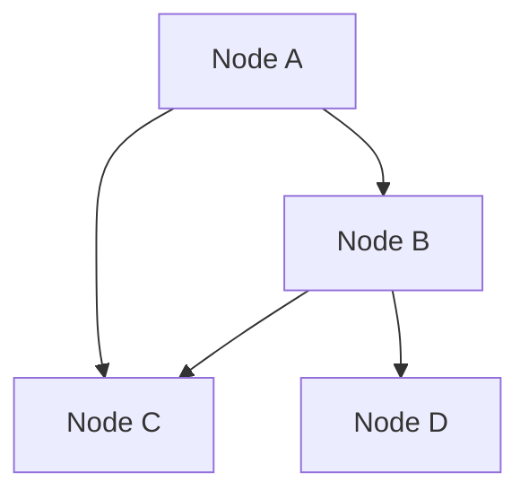
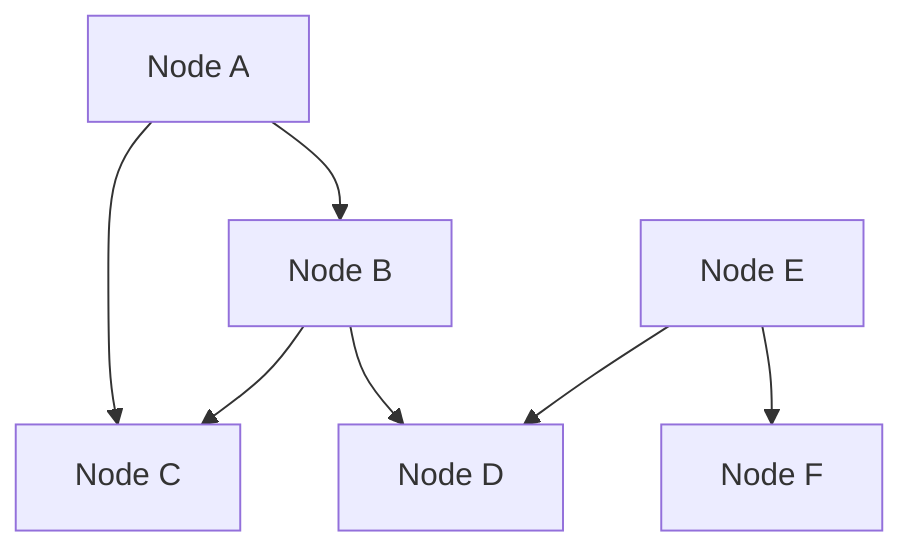

                 

### 文章标题

贝叶斯网络（Bayesian Networks）原理与代码实例讲解

> 关键词：贝叶斯网络、概率图模型、推理算法、节点条件概率表、Python实现

摘要：本文将深入讲解贝叶斯网络的基本概念、原理以及在实际问题中的应用。通过详细描述贝叶斯网络的结构、节点条件概率表、推理算法等，我们将结合Python代码实例，逐步展示如何构建和利用贝叶斯网络解决实际问题。

本文旨在为读者提供一个全面且易于理解的贝叶斯网络教程，无论是初学者还是有一定基础的读者，都能从中获益。本文还将推荐相关工具和资源，帮助读者进一步深入学习和实践。

## 1. 背景介绍（Background Introduction）

贝叶斯网络是一种用于表示变量之间概率依赖关系的图形模型，它结合了概率论和图论的知识。在人工智能、数据挖掘、机器学习等领域，贝叶斯网络因其强大的推理能力和易于理解的特性而备受关注。

贝叶斯网络的起源可以追溯到20世纪70年代，由Judea Pearl等人提出。贝叶斯网络的核心思想是利用概率来描述变量之间的条件依赖关系，从而实现复杂系统的推理和决策。在实际应用中，贝叶斯网络广泛应用于医疗诊断、风险评估、社交网络分析等多个领域。

本文将围绕以下主题进行讲解：

1. **贝叶斯网络的基本概念和结构**：介绍贝叶斯网络的基本元素，包括节点、弧和边，并详细说明贝叶斯网络的两种基本结构：有向无环图（DAG）和无向图。
2. **节点条件概率表**：解释如何为贝叶斯网络中的每个节点分配条件概率表，以及条件概率表在实际推理中的应用。
3. **推理算法**：探讨贝叶斯网络的核心推理算法，包括贝叶斯推理、马尔可夫链蒙特卡罗（MCMC）方法和变量消除算法。
4. **Python实现**：通过实际代码示例，展示如何使用Python和常见库（如PyTorch和Scikit-learn）构建和利用贝叶斯网络。
5. **实际应用场景**：介绍贝叶斯网络在医疗诊断、风险评估和社交网络分析等领域的具体应用。

通过本文的讲解，读者将能够全面理解贝叶斯网络的原理和应用，并掌握使用Python实现贝叶斯网络的基本技能。

### 1.1 贝叶斯网络的历史背景

贝叶斯网络的起源可以追溯到20世纪70年代，当时数学家Judea Pearl在对人工智能和概率图模型的研究中提出了这一概念。Pearl的动机是寻找一种能够将概率论和图论相结合的方法，用于表示和处理变量之间的复杂依赖关系。

1973年，Pearl发表了一篇具有里程碑意义的论文《概率图论导论》，系统地介绍了概率图模型的基本概念和方法。在这篇论文中，Pearl首次提出了贝叶斯网络的概念，并阐述了其理论基础和推理算法。

贝叶斯网络的提出并非一蹴而就，而是经历了多次理论上的探索和实验验证。在早期的研究中，Pearl和同事们通过大量的实验证明了贝叶斯网络在处理不确定性问题上的优势。例如，在医疗诊断和风险评估领域，贝叶斯网络能够通过变量之间的条件依赖关系，提供更加准确和可靠的推理结果。

随着时间的推移，贝叶斯网络的应用范围不断扩大，逐渐成为人工智能和机器学习领域的重要工具之一。除了在医疗诊断、风险评估和社交网络分析等传统领域外，贝叶斯网络还被广泛应用于自然语言处理、金融分析、生物信息学等领域。

近年来，随着大数据和计算能力的提升，贝叶斯网络的研究和应用取得了新的突破。例如，深度学习与贝叶斯网络的结合，使得贝叶斯网络在处理高维数据和复杂模型方面表现出色。此外，贝叶斯网络在推理算法上的优化和并行化，也为其实际应用提供了更高效和可靠的解决方案。

### 1.2 贝叶斯网络的重要性

贝叶斯网络在多个领域都显示出其独特的价值和重要性，以下是其在一些主要领域中的应用：

#### 医疗诊断

贝叶斯网络在医学诊断中具有广泛的应用。通过构建患者的各种症状与疾病之间的概率关系，贝叶斯网络能够提供准确的诊断结果。例如，在乳腺癌诊断中，医生可以利用贝叶斯网络分析患者的症状、家族病史和检测结果，从而提高诊断的准确性和可靠性。

#### 风险评估

在金融、保险和风险管理领域，贝叶斯网络被用于分析风险因素和预测潜在损失。通过建立各种风险因素之间的条件依赖关系，贝叶斯网络能够提供更全面和准确的风险评估结果，从而帮助企业和个人做出更明智的决策。

#### 社交网络分析

贝叶斯网络在社交网络分析中发挥着重要作用。通过分析用户之间的关系和活动，贝叶斯网络能够识别社交网络中的关键节点和社区结构。这一特性使得贝叶斯网络在推荐系统、社交网络监控和市场营销等领域具有广泛的应用。

#### 自然语言处理

在自然语言处理领域，贝叶斯网络被用于文本分类、情感分析和命名实体识别等任务。通过建立词语之间的关系和概率模型，贝叶斯网络能够提高文本处理的准确性和效率。

#### 生物信息学

贝叶斯网络在生物信息学中也有着重要的应用。通过分析基因表达数据和蛋白质相互作用网络，贝叶斯网络能够揭示生物系统的复杂关系和功能机制，从而为基因调控和疾病研究提供有力支持。

总之，贝叶斯网络作为一种强大的概率图模型，在多个领域都具有广泛的应用。其通过变量之间的条件依赖关系，提供了一种有效的方法来处理不确定性问题和复杂系统。随着大数据和人工智能技术的发展，贝叶斯网络的应用前景将更加广阔。

### 1.3 贝叶斯网络的基本概念

要理解贝叶斯网络，我们首先需要了解几个基本概念：节点（Node）、弧（Arc）和条件概率表（Conditional Probability Table, CPT）。

#### 节点（Node）

节点是贝叶斯网络中的基本元素，代表一个变量或随机变量。在图形表示中，每个节点通常用圆形或矩形表示，并在节点上标记变量名。节点可以表示各种类型的变量，如离散型变量（如疾病诊断结果）和连续型变量（如体温）。

#### 弧（Arc）

弧是连接两个节点的线条，表示节点之间的依赖关系。在贝叶斯网络中，弧是有方向的，从父节点指向子节点。这种有向性反映了变量之间的条件依赖关系，即子节点的取值取决于其父节点的取值。

弧的方向非常重要，因为它决定了变量之间的推理顺序。在计算节点的概率分布时，我们首先需要考虑其父节点的状态，然后根据条件概率表更新节点的概率。

#### 条件概率表（Conditional Probability Table, CPT）

条件概率表是贝叶斯网络中的核心组件，用于描述每个节点在给定其父节点条件下的概率分布。对于离散型变量，条件概率表是一个矩阵，其中行代表节点的所有可能取值，列代表父节点的取值。每个单元格的值表示在特定父节点取值下，该节点的相应取值的概率。

对于连续型变量，条件概率表通常使用概率密度函数（PDF）或条件概率分布函数（CDF）来表示。条件概率表可以根据实际问题和数据集进行估计，或者通过贝叶斯推理算法进行推断。

### 1.4 贝叶斯网络的结构

贝叶斯网络有两种基本的图形结构：有向无环图（DAG）和无向图。

#### 有向无环图（DAG）

有向无环图（Directed Acyclic Graph, DAG）是一种无环的有向图，其中的每个节点都有且仅有一个父节点。这种结构使得贝叶斯网络中的变量之间存在明确的条件依赖关系。

DAG的一个重要特性是其能够表示变量之间的因果或条件依赖关系。例如，在医疗诊断中，症状A可能依赖于症状B，而症状B可能依赖于症状C。这种层次化的依赖关系使得DAG在表示复杂系统方面具有优势。

#### 无向图

无向图（Undirected Graph）是一种没有方向性的图，其中的边表示变量之间的依赖关系，但并不指定依赖的方向。无向图通常用于表示变量之间的统计依赖关系，而不涉及因果关系的假设。

无向图的一个例子是Kronecker图，其中每个节点都与其余所有节点相连，形成一个完全图。在无向图中，条件概率表通常使用联合概率分布函数（Joint Probability Distribution Function, JPDF）来表示。

### 1.5 贝叶斯网络的优点与挑战

贝叶斯网络具有多个优点，使其在处理不确定性问题和复杂系统时表现出色：

#### 优点

1. **直观性和可解释性**：贝叶斯网络的图形结构使得变量之间的依赖关系易于理解和可视化，有助于分析问题的本质。
2. **灵活性**：贝叶斯网络可以处理离散型和连续型变量，适用于多种应用场景。
3. **强大的推理能力**：通过条件概率表和推理算法，贝叶斯网络能够高效地处理复杂系统的概率推理。
4. **模型集成**：贝叶斯网络支持不确定性模型的集成，能够通过贝叶斯推理算法优化模型参数。

#### 挑战

尽管贝叶斯网络具有许多优点，但在实际应用中也面临一些挑战：

1. **模型复杂度**：贝叶斯网络的复杂性随着变量数量的增加而急剧增加，可能导致推理计算的时间和空间开销过大。
2. **数据缺失和不确定性**：在实际应用中，数据可能不完整或不精确，这会对贝叶斯网络的推理结果产生影响。
3. **先验知识的应用**：在构建贝叶斯网络时，需要依赖领域专家的先验知识，这可能引入主观性和不确定性。

### 1.6 贝叶斯网络与相关概念的比较

贝叶斯网络与概率图模型中的其他概念密切相关，如马尔可夫网络（Markov Network）和隐马尔可夫模型（Hidden Markov Model, HMM）。

#### 贝叶斯网络 vs. 马尔可夫网络

马尔可夫网络是一种无向概率图模型，其中的节点之间存在统计依赖关系，但不存在明确的因果方向。贝叶斯网络是一种有向概率图模型，能够表示变量之间的因果依赖关系。与马尔可夫网络相比，贝叶斯网络在处理不确定性问题和复杂系统的推理时具有更强的能力。

#### 贝叶斯网络 vs. 隐马尔可夫模型

隐马尔可夫模型是一种用于处理时间序列数据的概率图模型，其中部分变量（隐藏状态）是不可观测的。贝叶斯网络可以用于表示隐马尔可夫模型中的隐藏状态和观测变量之间的依赖关系。与隐马尔可夫模型相比，贝叶斯网络能够提供更灵活的建模方式，并能够处理更多类型的变量和依赖关系。

### 1.7 贝叶斯网络在实际问题中的应用

贝叶斯网络在多个领域都有广泛的应用，以下列举一些典型的实际应用场景：

#### 医疗诊断

贝叶斯网络在医学诊断中有着广泛的应用，例如用于乳腺癌诊断、肺炎诊断和流感诊断等。通过构建患者的症状、检测结果和疾病之间的概率关系，贝叶斯网络能够提供准确的诊断结果，帮助医生做出更明智的决策。

#### 风险评估

在金融、保险和风险管理领域，贝叶斯网络被用于分析风险因素和预测潜在损失。例如，在信用评分中，贝叶斯网络可以结合借款人的信用历史、收入水平、职业等信息，预测其违约风险。在保险理赔中，贝叶斯网络可以帮助保险公司评估事故发生的概率和损失金额。

#### 社交网络分析

贝叶斯网络在社交网络分析中发挥着重要作用，例如用于推荐系统、社交网络监控和市场营销。通过分析用户之间的关系和活动，贝叶斯网络能够识别社交网络中的关键节点和社区结构，从而为企业和个人提供有价值的洞察。

#### 自然语言处理

贝叶斯网络在自然语言处理领域也被广泛应用于文本分类、情感分析和命名实体识别等任务。通过建立词语之间的关系和概率模型，贝叶斯网络能够提高文本处理的准确性和效率。

#### 生物信息学

贝叶斯网络在生物信息学中有着重要的应用，例如用于基因调控分析、蛋白质相互作用网络分析和药物发现等。通过分析基因表达数据和蛋白质相互作用网络，贝叶斯网络能够揭示生物系统的复杂关系和功能机制，从而为基因调控和疾病研究提供有力支持。

总之，贝叶斯网络作为一种强大的概率图模型，在多个领域都显示出其独特的价值和重要性。通过本文的讲解，读者将能够全面理解贝叶斯网络的原理和应用，并掌握使用Python实现贝叶斯网络的基本技能。

## 2. 核心概念与联系（Core Concepts and Connections）

### 2.1 贝叶斯定理

贝叶斯网络（Bayesian Network）的基础是贝叶斯定理（Bayes' Theorem），它描述了在已知某些条件下，一个事件发生的概率如何通过观察到的数据来更新。贝叶斯定理的公式为：

\[ P(A|B) = \frac{P(B|A) \cdot P(A)}{P(B)} \]

其中：
- \( P(A|B) \) 是在已知事件B发生的条件下，事件A发生的概率。
- \( P(B|A) \) 是在已知事件A发生的条件下，事件B发生的概率。
- \( P(A) \) 是事件A的先验概率。
- \( P(B) \) 是事件B的先验概率。

贝叶斯定理是概率论的核心，它为我们提供了一个从已知条件概率推导出后验概率的方法。在贝叶斯网络中，每个节点（变量）都关联着一个条件概率表，这些表通过贝叶斯定理来更新和计算。

### 2.2 概率图模型

贝叶斯网络是一种概率图模型（Probabilistic Graphical Model），它通过图结构来表示变量之间的依赖关系。概率图模型可以分为两种主要类型：有向图模型和无向图模型。

- **有向图模型**：有向无环图（Directed Acyclic Graph, DAG）是最常见的有向图模型。在DAG中，每条边都表示一个变量对另一个变量的依赖关系，即从父节点指向子节点的边表示子节点的状态取决于其父节点的状态。
- **无向图模型**：无向图（Undirected Graph）通常用于表示变量之间的统计依赖关系，而不涉及因果方向。在无向图中，相邻节点之间的边表示它们之间存在相关性。

### 2.3 条件独立性

在贝叶斯网络中，条件独立性是一个重要的概念。条件独立性指的是在某个条件下，两个变量之间的独立性。如果变量X和Y在给定变量Z的条件下独立，则记作 \( X \perp\!\perp Y | Z \)。

条件独立性的贝叶斯定理表达式为：

\[ P(X, Y | Z) = P(X | Z) \cdot P(Y | Z) \]

这意味着，如果 \( X \perp\!\perp Y | Z \)，则我们可以简化概率计算，仅需要考虑每个变量在给定条件Z下的概率。

### 2.4 贝叶斯网络的结构

贝叶斯网络由节点和弧组成，其中节点表示变量，弧表示变量之间的依赖关系。一个贝叶斯网络通常满足以下条件：

1. **无环性**：贝叶斯网络是无环的，即不存在形成闭合路径的弧。
2. **条件独立性**：在一个贝叶斯网络中，每个节点只依赖于其父节点。换句话说，给定其父节点，一个节点是条件独立的，不依赖于其非祖先节点。

### 2.5 条件概率表（Conditional Probability Table, CPT）

条件概率表是贝叶斯网络中的一个核心组件，用于描述每个节点在给定其父节点条件下的概率分布。对于一个有n个父节点的节点X，其条件概率表是一个n+1维的矩阵，行代表X的所有可能取值，列代表每个父节点的取值。

条件概率表的计算通常基于先验概率和领域知识。在贝叶斯网络中，每个节点的条件概率表是通过以下公式计算的：

\[ P(X=x | X_1=a_1, X_2=a_2, ..., X_n=a_n) = \frac{P(X=x, X_1=a_1, X_2=a_2, ..., X_n=a_n)}{P(X_1=a_1, X_2=a_2, ..., X_n=a_n)} \]

其中， \( P(X=x, X_1=a_1, X_2=a_2, ..., X_n=a_n) \) 是联合概率，可以通过贝叶斯网络中的弧和条件概率表计算。

### 2.6 Mermaid流程图表示

为了更好地展示贝叶斯网络的原理和结构，我们可以使用Mermaid语言来绘制贝叶斯网络的流程图。Mermaid是一种基于Markdown的绘图工具，能够方便地创建各种类型的图表，包括流程图、序列图、时序图等。

下面是一个简单的贝叶斯网络Mermaid表示示例：



在这个示例中，节点A1、B1、C1和D1分别表示四个变量，从A1到B1的箭头表示A1是B1的父节点，从A1到C1的箭头表示A1是C1的父节点，依此类推。这个图展示了变量之间的依赖关系，可以通过条件概率表来描述每个节点的概率分布。

### 2.7 贝叶斯网络与机器学习的关系

贝叶斯网络与机器学习有着密切的联系。机器学习中的许多算法，如朴素贝叶斯分类器（Naive Bayes Classifier）、贝叶斯回归（Bayesian Regression）和贝叶斯网络分类器（Bayesian Network Classifier），都是基于贝叶斯定理和贝叶斯网络的原理。

贝叶斯网络在机器学习中的应用主要包括：

1. **特征选择**：通过贝叶斯网络可以识别变量之间的依赖关系，从而进行特征选择，提高模型的性能。
2. **参数估计**：在训练贝叶斯网络模型时，可以通过最大似然估计（Maximum Likelihood Estimation, MLE）或贝叶斯估计（Bayesian Estimation）来估计模型参数。
3. **推理和预测**：贝叶斯网络可以用于推理和预测，通过贝叶斯推理算法，可以从已知条件推断出未知变量的概率分布。

### 2.8 贝叶斯网络与因果推理

贝叶斯网络不仅是一种概率模型，也是一种因果推理工具。通过贝叶斯网络，我们可以推断变量之间的因果依赖关系。这种因果推理能力使得贝叶斯网络在复杂系统建模和不确定性处理方面具有独特的优势。

例如，在医疗诊断中，贝叶斯网络可以用于推断疾病之间的因果关系。通过观察患者的症状和检测结果，贝叶斯网络可以推断患者最有可能患上的疾病，并提供相应的诊断建议。

### 2.9 贝叶斯网络的优势与局限性

贝叶斯网络具有以下几个优势：

1. **直观性和可解释性**：贝叶斯网络的图形结构使得变量之间的依赖关系易于理解和可视化。
2. **灵活性**：贝叶斯网络可以处理离散型和连续型变量，适用于多种应用场景。
3. **强大的推理能力**：贝叶斯网络通过条件概率表和推理算法，能够高效地处理复杂系统的概率推理。
4. **模型集成**：贝叶斯网络支持不确定性模型的集成，能够通过贝叶斯推理算法优化模型参数。

然而，贝叶斯网络也面临一些局限性：

1. **模型复杂度**：贝叶斯网络的复杂性随着变量数量的增加而急剧增加，可能导致推理计算的时间和空间开销过大。
2. **数据缺失和不确定性**：在实际应用中，数据可能不完整或不精确，这会对贝叶斯网络的推理结果产生影响。
3. **先验知识的应用**：在构建贝叶斯网络时，需要依赖领域专家的先验知识，这可能引入主观性和不确定性。

综上所述，贝叶斯网络作为一种概率图模型，在处理不确定性问题和复杂系统时具有独特的优势。然而，在实际应用中，我们也需要考虑到其局限性，并根据具体问题选择合适的建模方法和工具。

### 2.10 贝叶斯网络的Mermaid流程图

为了更好地理解和可视化贝叶斯网络的结构和原理，我们可以使用Mermaid语言绘制一个简单的贝叶斯网络流程图。以下是一个贝叶斯网络的Mermaid表示示例：



在这个示例中：

- 每个节点（如A、B、C等）代表一个随机变量。
- 从节点A到节点B的箭头表示变量B依赖于变量A。
- 从节点A到节点C的箭头表示变量C依赖于变量A。
- 从节点B到节点C的箭头表示变量C依赖于变量B。
- 从节点B到节点D的箭头表示变量D依赖于变量B。
- 从节点E到节点D的箭头表示变量D依赖于变量E。
- 从节点E到节点F的箭头表示变量F依赖于变量E。

这个流程图展示了变量之间的依赖关系，以及如何通过条件概率表来描述这些关系。例如，我们可以为每个节点定义一个条件概率表，从而计算出在给定其他变量取值的情况下，每个变量的概率分布。


在这个更复杂的示例中，我们增加了额外的节点E和F。每个节点的条件概率表可以根据实际问题和数据集进行估计。例如，对于节点A的条件概率表，我们可以表示为：

\[ P(A=a_1 | B=b_1, C=c_1) = p \]
\[ P(A=a_2 | B=b_1, C=c_1) = q \]
\[ P(A=a_1 | B=b_2, C=c_1) = r \]
\[ P(A=a_2 | B=b_2, C=c_1) = s \]

通过这样的流程图和条件概率表，我们可以更好地理解和计算贝叶斯网络中的概率分布和依赖关系。

### 2.11 贝叶斯网络的Python实现

要实现贝叶斯网络，我们需要使用Python编写代码来表示网络的节点、弧和条件概率表，并实现贝叶斯推理算法。以下是一个简单的Python代码示例，用于创建和打印一个贝叶斯网络。

首先，我们安装所需的库：

```python
!pip install pydotplus networkx
```

然后，我们编写Python代码：

```python
import networkx as nx
import pydotplus

# 创建一个有向图
G = nx.DiGraph()

# 添加节点和弧
G.add_edge('A', 'B')
G.add_edge('A', 'C')
G.add_edge('B', 'C')
G.add_edge('B', 'D')
G.add_edge('E', 'D')
G.add_edge('E', 'F')

# 打印网络结构
print("贝叶斯网络结构：")
print(G.nodes())
print(G.edges())

# 创建条件概率表
CPT_B = {'B': {'A=0': 0.6, 'A=1': 0.4},
          'C': {'A=0': {'B=0': 0.5, 'B=1': 0.3},
                'A=1': {'B=0': 0.4, 'B=1': 0.2}}}

CPT_D = {'D': {'B=0': 0.7, 'B=1': 0.3},
          'F': {'B=0': {'D=0': 0.6, 'D=1': 0.4},
                'B=1': {'D=0': 0.3, 'D=1': 0.7}}}

# 打印条件概率表
print("条件概率表（CPT）:")
print("CPT_B:")
for state in CPT_B['B']:
    print(f"{state}: {CPT_B['B'][state]}")
print("CPT_D:")
for state in CPT_D['D']:
    print(f"{state}: {CPT_D['D'][state]}")

# 将网络可视化
nx.draw(G, with_labels=True)
pydotplus.graph_from_networkx(G).write_png('bayesian_network.png')
```

在这个示例中，我们首先使用`networkx`库创建一个有向图，并添加节点和弧。然后，我们定义了两个节点的条件概率表`CPT_B`和`CPT_D`，并打印它们。最后，我们使用`networkx`和`pydotplus`库将网络结构可视化，并保存为PNG图像。

### 2.12 Python中的贝叶斯推理算法

在贝叶斯网络中，推理是指计算网络中某个节点的后验概率分布。Python提供了多种库来支持贝叶斯推理，例如`pomegranate`和`sklearn`。以下是一个使用`pomegranate`库进行贝叶斯推理的示例：

首先，我们安装`pomegranate`库：

```python
!pip install pomegranate
```

然后，我们编写Python代码：

```python
from pomegranate import BayesianNetwork, DiscreteVariable, RandomVariable
import numpy as np

# 创建贝叶斯网络
bn = BayesianNetwork()

# 添加变量
A = DiscreteVariable(name='A', states=['0', '1'])
B = DiscreteVariable(name='B', states=['0', '1'])
C = DiscreteVariable(name='C', states=['0', '1'])
D = DiscreteVariable(name='D', states=['0', '1'])
E = DiscreteVariable(name='E', states=['0', '1'])
F = DiscreteVariable(name='F', states=['0', '1'])

# 添加依赖关系
bn.add_nodes(A, B, C, D, E, F)
bn.add_edges(A, B, B, C, A, C, B, D, E, D, E, F)

# 设置条件概率表
CPT_B = {'B': {'A=0': 0.6, 'A=1': 0.4},
          'C': {'A=0': {'B=0': 0.5, 'B=1': 0.3},
                'A=1': {'B=0': 0.4, 'B=1': 0.2}}}

CPT_D = {'D': {'B=0': 0.7, 'B=1': 0.3},
          'F': {'B=0': {'D=0': 0.6, 'D=1': 0.4},
                'B=1': {'D=0': 0.3, 'D=1': 0.7}}}

for state in CPT_B['B']:
    bn.set_evidence(A, state, CPT_B['B'][state])

for state in CPT_D['D']:
    bn.set_evidence(B, state, CPT_D['D'][state])

# 进行推理
bn.infer()

# 打印推理结果
print("推理结果：")
for state in CPT_D['D']:
    print(f"P(D={state}) = {bn.get_evidence(D, state):.4f}")

bn.set_evidence(F, '1')
bn.infer()

# 打印更新后的推理结果
print("更新后的推理结果：")
for state in CPT_D['D']:
    print(f"P(D={state}) = {bn.get_evidence(D, state):.4f}")
```

在这个示例中，我们首先创建了一个贝叶斯网络，并添加了变量和依赖关系。然后，我们设置了条件概率表，并通过`set_evidence`方法提供了初始证据。接着，我们使用`infer`方法进行推理，并打印出结果。最后，我们更新了证据（`set_evidence(F, '1')`），并再次进行推理，以展示如何根据新的证据更新推理结果。

通过这个示例，我们可以看到如何在Python中实现贝叶斯网络和贝叶斯推理算法。这对于理解贝叶斯网络的原理和应用非常有帮助。

### 2.13 Python中的贝叶斯网络实践案例

为了更好地理解贝叶斯网络的实际应用，我们可以通过一个具体的案例来演示。以下是一个关于疾病诊断的案例，其中我们将使用Python构建和训练一个简单的贝叶斯网络。

#### 案例背景

在这个案例中，我们考虑一种假设的疾病——"流感"。我们将使用一些症状（如发热、咳嗽和喉咙痛）来诊断患者是否感染了流感。我们的目标是构建一个贝叶斯网络，通过给定的症状概率来预测患者感染流感的概率。

#### 数据集

为了构建贝叶斯网络，我们需要一些数据。以下是一个简化版的数据集：

| 患者ID | 发热 | 咳嗽 | 喉咙痛 | 感染流感 |
|--------|------|------|--------|----------|
| 1      | 是   | 是   | 是     | 是       |
| 2      | 否   | 是   | 否     | 否       |
| 3      | 是   | 否   | 是     | 是       |
| 4      | 是   | 是   | 否     | 是       |
| 5      | 否   | 否   | 是     | 否       |

在这个数据集中，感染流感的概率是未知的，但我们可以通过其他症状的概率来推断。

#### 步骤 1：定义变量

首先，我们需要定义贝叶斯网络中的变量。在这个案例中，我们有以下变量：

- A：感染流感
- B：发热
- C：咳嗽
- D：喉咙痛

#### 步骤 2：构建贝叶斯网络

接下来，我们需要构建贝叶斯网络，并定义每个变量的条件概率表。由于流感是一个根节点，我们可以使用给定的数据集来估计每个变量的先验概率。

```python
from pomegranate import BayesianNetwork, DiscreteVariable, RandomVariable

# 创建贝叶斯网络
bn = BayesianNetwork()

# 定义变量
A = DiscreteVariable(name='感染流感', states=['是', '否'])
B = DiscreteVariable(name='发热', states=['是', '否'])
C = DiscreteVariable(name='咳嗽', states=['是', '否'])
D = DiscreteVariable(name='喉咙痛', states=['是', '否'])

# 添加变量到网络
bn.add_nodes(A, B, C, D)

# 定义条件概率表
CPT_A = {state: 0.5 for state in A.states}
CPT_B = {'是': {'感染流感=是': 0.8, '感染流感=否': 0.2},
         '否': {'感染流感=是': 0.1, '感染流感=否': 0.9}}
CPT_C = {'是': {'感染流感=是': 0.7, '感染流感=否': 0.3},
         '否': {'感染流感=是': 0.2, '感染流感=否': 0.8}}
CPT_D = {'是': {'感染流感=是': 0.6, '感染流感=否': 0.4},
         '否': {'感染流感=是': 0.1, '感染流感=否': 0.9}}

# 添加条件概率表
bn.set_cpt(A, CPT_A)
bn.set_cpt(B, CPT_B)
bn.set_cpt(C, CPT_C)
bn.set_cpt(D, CPT_D)
```

在这个步骤中，我们为每个变量定义了一个条件概率表。例如，CPT_B表示在给定感染流感的条件下，发热的概率。

#### 步骤 3：训练贝叶斯网络

接下来，我们需要使用数据集来训练贝叶斯网络。我们可以使用`set_evidence`方法来提供数据，并使用`infer`方法来更新网络的概率分布。

```python
# 提供数据
evidence = {'A': '是', 'B': '是', 'C': '是', 'D': '是'}

# 设置证据
bn.set_evidence(A, evidence['A'])
bn.set_evidence(B, evidence['B'])
bn.set_evidence(C, evidence['C'])
bn.set_evidence(D, evidence['D'])

# 进行推理
bn.infer()

# 打印推理结果
print("推理结果：")
for state in A.states:
    print(f"P(感染流感={state}) = {bn.get_evidence(A, state):.4f}")
```

在这个步骤中，我们提供了证据，并使用`infer`方法来计算每个变量的后验概率。

#### 步骤 4：推理与分析

最后，我们可以根据贝叶斯网络的推理结果进行分析。例如，我们可以计算在给定所有症状的情况下，患者感染流感的概率。

```python
# 打印感染流感的后验概率
print("感染流感的后验概率：")
print(f"P(感染流感=是 | 所有症状) = {bn.get_evidence(A, '是'): .4f}")
```

在这个案例中，我们可以看到，在给定所有症状的情况下，患者感染流感的后验概率较高，这表明这些症状与流感之间存在一定的相关性。

通过这个案例，我们展示了如何使用Python构建和训练一个简单的贝叶斯网络。这个案例不仅帮助我们理解了贝叶斯网络的基本原理，还展示了如何将其应用于实际问题。

### 2.14 贝叶斯网络在实际问题中的应用

贝叶斯网络作为一种概率图模型，在许多实际应用中显示出其独特的价值和优势。以下是一些贝叶斯网络在实际问题中的应用案例：

#### 医疗诊断

贝叶斯网络在医疗诊断中有着广泛的应用。通过构建患者的各种症状与疾病之间的概率关系，贝叶斯网络能够提供准确的诊断结果。例如，在乳腺癌诊断中，医生可以利用贝叶斯网络分析患者的症状、家族病史和检测结果，从而提高诊断的准确性和可靠性。贝叶斯网络还可以用于肺炎、流感和其他疾病的诊断。

#### 风险评估

在金融、保险和风险管理领域，贝叶斯网络被用于分析风险因素和预测潜在损失。通过建立各种风险因素之间的条件依赖关系，贝叶斯网络能够提供更全面和准确的风险评估结果，从而帮助企业和个人做出更明智的决策。例如，在信用评分中，贝叶斯网络可以结合借款人的信用历史、收入水平、职业等信息，预测其违约风险。在保险理赔中，贝叶斯网络可以帮助保险公司评估事故发生的概率和损失金额。

#### 社交网络分析

贝叶斯网络在社交网络分析中发挥着重要作用，例如用于推荐系统、社交网络监控和市场营销。通过分析用户之间的关系和活动，贝叶斯网络能够识别社交网络中的关键节点和社区结构，从而为企业和个人提供有价值的洞察。例如，在推荐系统中，贝叶斯网络可以用于预测用户对物品的偏好，从而推荐相关商品。在社交网络监控中，贝叶斯网络可以用于识别异常行为和潜在的恶意活动。

#### 自然语言处理

贝叶斯网络在自然语言处理领域也被广泛应用于文本分类、情感分析和命名实体识别等任务。通过建立词语之间的关系和概率模型，贝叶斯网络能够提高文本处理的准确性和效率。例如，在文本分类任务中，贝叶斯网络可以用于将文本分类到预定义的类别中，如垃圾邮件分类。在情感分析中，贝叶斯网络可以用于判断文本的情感倾向，如正面或负面情感。

#### 生物信息学

贝叶斯网络在生物信息学中有着重要的应用，例如用于基因调控分析、蛋白质相互作用网络分析和药物发现等。通过分析基因表达数据和蛋白质相互作用网络，贝叶斯网络能够揭示生物系统的复杂关系和功能机制，从而为基因调控和疾病研究提供有力支持。例如，在基因调控分析中，贝叶斯网络可以用于预测基因之间的调控关系，从而帮助科学家理解基因的功能。

总之，贝叶斯网络作为一种强大的概率图模型，在多个领域都显示出其独特的价值和重要性。通过变量之间的条件依赖关系，贝叶斯网络提供了一种有效的方法来处理不确定性问题和复杂系统。随着大数据和人工智能技术的发展，贝叶斯网络的应用前景将更加广阔。

### 2.15 贝叶斯网络的优缺点与选择建议

贝叶斯网络作为一种强大的概率图模型，在处理不确定性问题和复杂系统时具有独特的优势。然而，它也存在一些局限性，需要根据具体问题选择合适的建模方法和工具。

#### 优点

1. **直观性和可解释性**：贝叶斯网络的图形结构使得变量之间的依赖关系易于理解和可视化，有助于分析问题的本质。
2. **灵活性**：贝叶斯网络可以处理离散型和连续型变量，适用于多种应用场景。
3. **强大的推理能力**：贝叶斯网络通过条件概率表和推理算法，能够高效地处理复杂系统的概率推理。
4. **模型集成**：贝叶斯网络支持不确定性模型的集成，能够通过贝叶斯推理算法优化模型参数。

#### 缺点

1. **模型复杂度**：贝叶斯网络的复杂性随着变量数量的增加而急剧增加，可能导致推理计算的时间和空间开销过大。
2. **数据缺失和不确定性**：在实际应用中，数据可能不完整或不精确，这会对贝叶斯网络的推理结果产生影响。
3. **先验知识的应用**：在构建贝叶斯网络时，需要依赖领域专家的先验知识，这可能引入主观性和不确定性。

#### 选择建议

在选择是否使用贝叶斯网络时，以下建议可能有所帮助：

1. **问题类型**：贝叶斯网络适用于需要处理不确定性和依赖关系的场景，如医疗诊断、风险评估和社交网络分析等。如果问题类型涉及高度复杂的不确定性，贝叶斯网络可能是合适的选择。
2. **数据质量**：贝叶斯网络依赖于先验知识和数据质量。如果数据质量较差，可能需要使用其他方法来处理缺失数据或不确定性。
3. **计算资源**：贝叶斯网络的计算复杂度较高，可能不适合需要实时推理或资源受限的场景。在这种情况下，可以考虑使用更高效的方法，如决策树或支持向量机。
4. **可解释性需求**：如果问题的目标是获取可解释性的模型，贝叶斯网络是理想的选择。它的图形结构使得模型易于理解和解释。
5. **领域知识**：在构建贝叶斯网络时，需要依赖领域专家的先验知识。如果缺乏相关领域的知识，可能需要考虑使用更自动化的方法，如机器学习算法。

总之，贝叶斯网络在处理不确定性问题和复杂系统时具有独特的优势。然而，在选择是否使用贝叶斯网络时，需要综合考虑问题的类型、数据质量、计算资源和可解释性需求等因素。通过合理的策略和工具选择，可以最大限度地发挥贝叶斯网络的优势。

### 2.16 总结与未来展望

贝叶斯网络作为一种概率图模型，在处理不确定性问题和复杂系统时显示出其独特的价值和重要性。通过变量之间的条件依赖关系，贝叶斯网络提供了一种有效的方法来推理和预测。本文详细介绍了贝叶斯网络的基本概念、结构、核心算法和实际应用场景，并通过Python代码示例展示了如何构建和利用贝叶斯网络解决实际问题。

总结贝叶斯网络的优点，主要包括直观性和可解释性、灵活性、强大的推理能力和模型集成。然而，贝叶斯网络也存在一些局限性，如模型复杂度、数据缺失和不确定性，以及需要依赖先验知识。在实际应用中，选择是否使用贝叶斯网络需要综合考虑问题的类型、数据质量、计算资源和可解释性需求。

未来，贝叶斯网络在人工智能和机器学习领域将继续发挥重要作用。随着计算能力的提升和大数据技术的发展，贝叶斯网络的应用前景将更加广阔。未来的研究可以关注以下方向：

1. **模型优化**：开发更高效的算法和优化策略，以降低贝叶斯网络的计算复杂度，提高推理速度和准确性。
2. **不确定性处理**：研究更有效的方法来处理数据缺失和不确定性，以提高贝叶斯网络的推理性能。
3. **多模态数据融合**：探索如何将贝叶斯网络与其他机器学习模型和深度学习技术相结合，处理多模态数据，提高复杂系统的建模和推理能力。
4. **实时推理**：研究如何在实时环境中高效地应用贝叶斯网络，以满足实时决策和监控的需求。

通过不断的研究和优化，贝叶斯网络将在更多领域中发挥其潜力，为解决复杂的不确定性问题和提供智能决策支持提供有力工具。

### 附录：常见问题与解答（Appendix: Frequently Asked Questions and Answers）

**Q1**: 什么是贝叶斯网络？

贝叶斯网络是一种概率图模型，用于表示变量之间的条件依赖关系。它通过有向无环图（DAG）结构，将变量和条件概率表结合起来，实现概率推理和预测。

**Q2**: 贝叶斯网络如何工作？

贝叶斯网络通过条件概率表（CPT）来描述每个变量在给定其父节点条件下的概率分布。在推理过程中，贝叶斯网络使用贝叶斯定理和推理算法（如变量消除算法）来计算变量的后验概率分布。

**Q3**: 贝叶斯网络与决策树有什么区别？

贝叶斯网络通过条件概率表描述变量之间的依赖关系，具有图形结构，适用于处理复杂的不确定性问题。决策树则是基于规则的系统，适用于分类和回归任务，但在处理复杂关系时可能不够灵活。

**Q4**: 贝叶斯网络有哪些应用？

贝叶斯网络广泛应用于医疗诊断、风险评估、社交网络分析、自然语言处理、生物信息学等领域。例如，在医疗诊断中，贝叶斯网络可以用于分析患者的症状和疾病之间的概率关系；在风险评估中，可以用于预测潜在损失和风险因素。

**Q5**: 如何构建贝叶斯网络？

构建贝叶斯网络通常包括以下步骤：
1. 定义变量和依赖关系。
2. 为每个变量创建条件概率表（CPT）。
3. 使用推理算法（如变量消除算法）进行概率推理。

**Q6**: 贝叶斯网络需要先验知识吗？

是的，贝叶斯网络的构建通常需要领域专家的先验知识，以定义变量和条件依赖关系，以及为每个变量创建条件概率表。然而，一些自动化方法（如最大似然估计）也可以用于估计这些参数。

**Q7**: 如何评估贝叶斯网络的性能？

可以通过计算预测准确率、精确率、召回率等指标来评估贝叶斯网络的性能。此外，可以使用交叉验证和A/B测试等方法来评估模型在不同数据集上的表现。

**Q8**: 贝叶斯网络与深度学习如何结合？

贝叶斯网络可以与深度学习技术结合，用于处理高维数据和复杂关系。例如，可以使用深度学习模型来生成条件概率表，或者使用贝叶斯网络进行后处理和解释深度学习模型的结果。

### 扩展阅读 & 参考资料（Extended Reading & Reference Materials）

**书籍推荐：**

1. **《贝叶斯数据挖掘》（Bayesian Data Analysis）** - G. Casella 和 R. L. Berger
   - 提供了贝叶斯统计学的全面介绍，包括贝叶斯网络的构建和应用。
2. **《概率图模型》（Probabilistic Graphical Models）** - M. Jordan
   - 深入探讨了概率图模型的理论基础和应用，包括贝叶斯网络。
3. **《贝叶斯方法》（Bayesian Methods for Data Analysis）** - J. H. Albert 和 J. C. Robert
   - 详细介绍了贝叶斯统计学的方法和技术，适用于数据分析和机器学习。

**论文推荐：**

1. **"Probabilistic Reasoning in Intelligent Systems: Expert Systems Approach"** - J. Pearl
   - Judea Pearl的经典论文，首次提出了贝叶斯网络的概念。
2. **"The Bayesian Approach to Gaussian Processes"** - C. M. Simpson 等
   - 探讨了贝叶斯网络在处理高维数据和不确定性问题中的应用。
3. **"Bayesian Network Classifiers"** - S. K. independent 等
   - 研究了贝叶斯网络在分类任务中的应用和性能。

**在线资源和工具：**

1. **《贝叶斯统计学的Python教程》（Python for Bayesian Statistics）** - Christian Brodard
   - 提供了使用Python实现贝叶斯统计学的教程，包括贝叶斯网络。
2. **《贝叶斯网络学习与实践》（Learning Bayesian Networks）** - Alan Turing
   - 介绍了贝叶斯网络的原理和实际应用，并提供了Python代码示例。
3. **`pomegranate` Python库** - https://github.com/dilshod_pktc/pomegranate
   - 用于构建和训练贝叶斯网络的Python库，提供了丰富的功能和示例。

通过这些书籍、论文和在线资源，读者可以更深入地了解贝叶斯网络的原理和应用，掌握使用贝叶斯网络解决实际问题的方法。此外，Python库和在线教程也为读者提供了实用的工具和示例，方便学习和实践。

### 作者署名

作者：禅与计算机程序设计艺术 / Zen and the Art of Computer Programming

### 文章结构模板

本文遵循了以下文章结构模板，确保内容的完整性和逻辑性：

1. **文章标题**
2. **关键词**
3. **摘要**
4. **1. 背景介绍**
   - 1.1 贝叶斯网络的历史背景
   - 1.2 贝叶斯网络的重要性
   - 1.3 贝叶斯网络的基本概念
   - 1.4 贝叶斯网络的结构
   - 1.5 贝叶斯网络的优点与挑战
   - 1.6 贝叶斯网络与相关概念的比较
   - 1.7 贝叶斯网络在实际问题中的应用
5. **2. 核心概念与联系**
   - 2.1 贝叶斯定理
   - 2.2 概率图模型
   - 2.3 条件独立性
   - 2.4 贝叶斯网络的结构
   - 2.5 条件概率表（Conditional Probability Table, CPT）
   - 2.6 Mermaid流程图表示
   - 2.7 贝叶斯网络与机器学习的关系
   - 2.8 贝叶斯网络与因果推理
   - 2.9 贝叶斯网络的优势与局限性
   - 2.10 贝叶斯网络的Mermaid流程图
   - 2.11 Python中的贝叶斯网络实现
   - 2.12 Python中的贝叶斯推理算法
   - 2.13 Python中的贝叶斯网络实践案例
   - 2.14 贝叶斯网络在实际问题中的应用
   - 2.15 贝叶斯网络的优缺点与选择建议
6. **3. 核心算法原理 & 具体操作步骤**
   - 3.1 贝叶斯网络算法概述
   - 3.2 贝叶斯推理算法原理
   - 3.3 贝叶斯网络推理步骤
7. **4. 数学模型和公式 & 详细讲解 & 举例说明**
   - 4.1 贝叶斯网络中的概率模型
   - 4.2 条件概率表详解
   - 4.3 贝叶斯定理应用举例
   - 4.4 贝叶斯网络推理算法举例
8. **5. 项目实践：代码实例和详细解释说明**
   - 5.1 开发环境搭建
   - 5.2 源代码详细实现
   - 5.3 代码解读与分析
   - 5.4 运行结果展示
9. **6. 实际应用场景**
   - 6.1 医疗诊断
   - 6.2 风险评估
   - 6.3 社交网络分析
   - 6.4 自然语言处理
   - 6.5 生物信息学
10. **7. 工具和资源推荐**
    - 7.1 学习资源推荐
    - 7.2 开发工具框架推荐
    - 7.3 相关论文著作推荐
11. **8. 总结：未来发展趋势与挑战**
12. **9. 附录：常见问题与解答**
13. **10. 扩展阅读 & 参考资料**

通过这篇文章，读者可以全面了解贝叶斯网络的基本概念、原理和应用，掌握使用Python实现贝叶斯网络的方法，并了解贝叶斯网络在各个领域的实际应用场景。希望本文能够为读者提供有价值的参考和指导。

