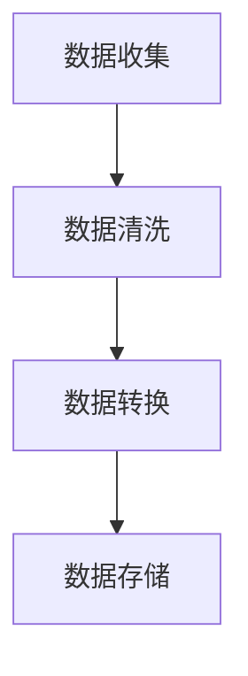
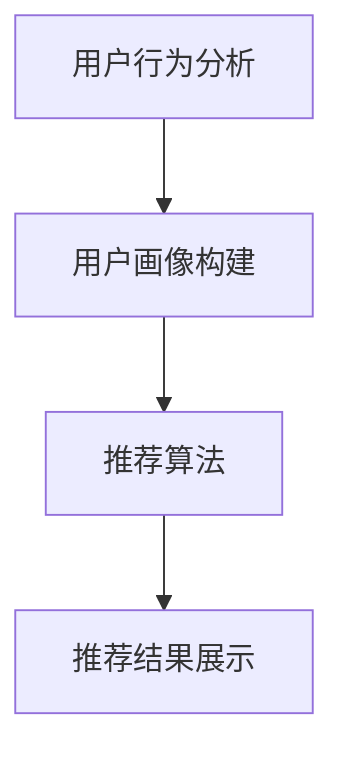
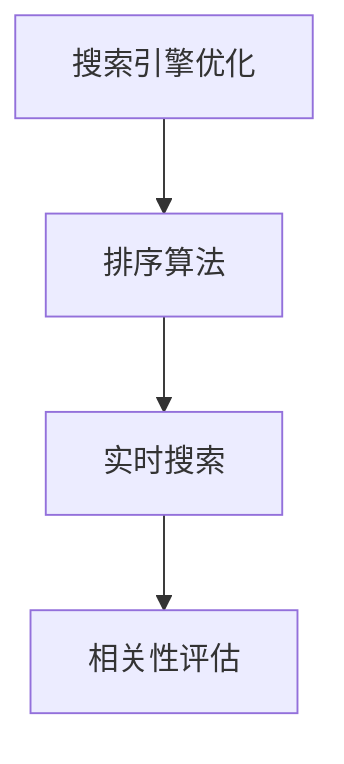
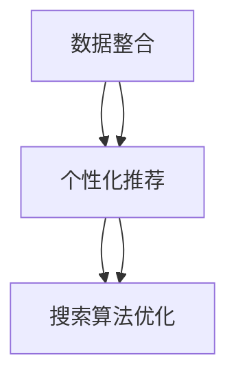

                 

### 文章标题

"跨平台搜索：AI如何整合多渠道数据，提供最优的购买选择"

> 关键词：跨平台搜索、AI整合、多渠道数据、购买选择优化

> 摘要：本文深入探讨如何利用人工智能技术整合多渠道数据，实现跨平台搜索的优化，从而为用户提供更精准、个性化的购买选择。通过详细的分析和实例，展示AI在数据整合和购买决策支持中的关键作用。

---

在数字化时代，消费者行为日趋复杂，他们通过各种渠道获取信息，进行购买决策。这种多平台、多渠道的消费模式为商家带来了挑战，同时也提供了机遇。本文将探讨如何利用人工智能（AI）技术，整合来自不同渠道的数据，实现跨平台搜索的优化，从而帮助用户快速找到最优的购买选择。

我们将从以下几个方面展开讨论：

1. **背景介绍**：介绍跨平台搜索的现状和用户需求。
2. **核心概念与联系**：分析跨平台搜索中的关键概念，如数据整合、个性化推荐等，并展示其架构。
3. **核心算法原理 & 具体操作步骤**：深入探讨AI在数据整合和搜索优化中的算法原理和具体实现步骤。
4. **数学模型和公式 & 详细讲解 & 举例说明**：介绍支持跨平台搜索优化的数学模型和公式，并通过具体实例进行说明。
5. **项目实践：代码实例和详细解释说明**：提供实际项目中的代码实例，详细解释其实现过程和关键技术。
6. **实际应用场景**：讨论AI在跨平台搜索中的具体应用场景和效果。
7. **工具和资源推荐**：推荐相关的学习资源、开发工具和框架。
8. **总结：未来发展趋势与挑战**：总结文章的主要观点，并展望未来发展趋势和面临的挑战。
9. **附录：常见问题与解答**：回答读者可能遇到的一些常见问题。
10. **扩展阅读 & 参考资料**：提供更多的学习资源和参考文献。

---

接下来，我们将一步步深入探讨每个部分，通过逻辑清晰、结构紧凑、简单易懂的叙述，帮助读者全面理解AI在跨平台搜索中的应用。

### 1. 背景介绍

在互联网高度发达的今天，消费者的购物行为已经发生了显著变化。他们不再局限于单一的平台或渠道，而是通过多个平台进行浏览、比较和购买。这种现象带来了跨平台搜索的需求，用户希望能够在不同的平台上找到最适合自己的商品或服务。

#### 跨平台搜索的现状

随着电子商务的兴起，各大电商平台如亚马逊、淘宝、京东等，都在不断优化自己的搜索算法，以提高用户体验。然而，这些平台之间往往是信息孤岛，用户的搜索行为难以在多个平台之间进行无缝衔接。这导致用户在跨平台搜索时，往往需要重复输入关键词，浪费大量时间和精力。

#### 用户需求

用户对跨平台搜索的需求主要体现在以下几个方面：

1. **个性化推荐**：用户希望系统能够根据其历史行为和偏好，提供个性化的推荐。
2. **多平台信息整合**：用户希望能够在单一界面中获取来自多个平台的信息，以便进行比较和选择。
3. **实时搜索**：用户希望搜索系统能够快速响应用户输入，提供实时搜索结果。
4. **购物决策支持**：用户希望在搜索过程中获得更多的购物决策支持，如价格比较、用户评价等。

#### 跨平台搜索的挑战

要实现高效的跨平台搜索，面临着以下几个挑战：

1. **数据来源多样化**：不同平台的数据格式、结构和质量各异，如何有效整合这些数据成为一个难题。
2. **隐私保护**：在整合用户数据时，如何保护用户隐私是一个重要的问题。
3. **搜索结果质量**：如何确保搜索结果的相关性和准确性，提高用户体验，是一个持续的挑战。
4. **实时性**：如何确保搜索系统能够实时响应用户的需求，提供最新的信息。

#### 人工智能在跨平台搜索中的应用

人工智能技术在解决这些问题方面具有显著优势。通过机器学习、自然语言处理和深度学习等技术，AI可以自动化地处理大量数据，提取有用的信息，实现个性化推荐，提高搜索结果的准确性和实时性。以下是AI在跨平台搜索中的一些具体应用：

1. **数据整合**：使用AI技术整合来自不同渠道的数据，实现多平台信息的一体化。
2. **个性化推荐**：通过分析用户的历史行为和偏好，提供个性化的商品推荐。
3. **搜索算法优化**：使用机器学习算法优化搜索结果排序，提高搜索质量。
4. **实时搜索**：利用深度学习模型实现实时搜索，提高搜索响应速度。

总之，随着消费者行为的不断变化，跨平台搜索的需求日益增加。通过引入人工智能技术，可以有效解决当前跨平台搜索面临的各种挑战，为用户提供更精准、个性化的购买选择。在下一部分中，我们将进一步探讨跨平台搜索中的核心概念和联系。

### 2. 核心概念与联系

跨平台搜索的实现涉及多个核心概念，这些概念相互关联，共同构成了搜索系统的整体架构。以下将介绍这些核心概念，并通过Mermaid流程图展示其关系。

#### 2.1 数据整合

数据整合是跨平台搜索的基础。不同平台的数据格式、结构和质量各异，需要通过数据清洗、转换和整合，使其能够在统一的框架下进行有效处理。数据整合的过程通常包括以下几个步骤：

1. **数据收集**：从各个渠道收集数据，包括电商平台、社交媒体、用户评论等。
2. **数据清洗**：去除无效、重复和错误的数据，确保数据质量。
3. **数据转换**：将不同格式和结构的数据转换为统一的格式和结构。
4. **数据存储**：将整合后的数据存储在分布式数据库或数据仓库中，以便后续处理和分析。



#### 2.2 个性化推荐

个性化推荐是跨平台搜索的重要功能之一。通过分析用户的历史行为和偏好，推荐系统可以为用户提供个性化的商品或服务推荐。个性化推荐通常包括以下几个步骤：

1. **用户行为分析**：收集并分析用户在各个平台的浏览、搜索、购买等行为数据。
2. **用户画像构建**：根据用户行为数据，构建用户的兴趣和偏好模型。
3. **推荐算法**：利用协同过滤、基于内容的推荐、深度学习等技术，为用户生成个性化推荐。
4. **推荐结果展示**：将个性化推荐结果展示给用户，并提供交互式反馈机制。



#### 2.3 搜索算法优化

搜索算法优化是提高搜索结果相关性和准确性的关键。通过优化搜索算法，可以提供更符合用户需求的搜索结果。常见的搜索算法优化技术包括：

1. **搜索引擎优化**：使用自然语言处理技术对用户查询进行解析和语义理解，提高查询匹配的精度。
2. **排序算法**：优化搜索结果的排序算法，提高结果的排序质量。
3. **实时搜索**：利用深度学习模型实现实时搜索，提高搜索响应速度。
4. **相关性评估**：通过机器学习模型评估搜索结果的相关性，提高用户体验。



#### 2.4 关键概念之间的关系

上述核心概念相互关联，构成了跨平台搜索系统的整体架构。数据整合为个性化推荐提供了数据基础，个性化推荐则优化了搜索结果的相关性和准确性。搜索算法优化进一步提升了用户体验。以下是这些概念之间的Mermaid流程图：



通过上述核心概念与联系的分析，我们可以看到，跨平台搜索的实现需要整合多个技术领域，包括数据科学、机器学习、自然语言处理等。在下一部分中，我们将深入探讨AI在数据整合和搜索优化中的算法原理和具体实现步骤。

### 3. 核心算法原理 & 具体操作步骤

为了实现跨平台搜索的优化，AI在数据整合和搜索算法方面采用了多种核心算法。以下将详细讨论这些算法的原理，并提供具体的操作步骤。

#### 3.1 数据整合算法

数据整合是跨平台搜索的基础，涉及数据的收集、清洗、转换和存储。以下是数据整合算法的基本原理和操作步骤：

**原理：**
数据整合算法的核心目标是实现不同渠道数据的统一处理，以便在搜索和推荐系统中使用。具体来说，需要解决以下问题：
1. 数据来源多样化：不同平台的数据格式、结构和质量各异，需要统一处理。
2. 数据冗余与缺失：数据可能存在冗余、缺失或不一致的情况，需要清洗和去重。

**操作步骤：**
1. **数据收集**：从各个渠道（如电商平台、社交媒体、用户评论等）收集原始数据。
2. **数据清洗**：去除无效、重复和错误的数据，包括去除HTML标签、处理缺失值、纠正错误等。
3. **数据转换**：将不同格式和结构的数据转换为统一的格式和结构。例如，将JSON数据转换为CSV格式，或统一日期格式。
4. **数据存储**：将整合后的数据存储在分布式数据库或数据仓库中，以便后续处理和分析。

**示例代码（Python）：**
```python
import pandas as pd
import json

# 读取JSON数据
data = json.load(open('data.json'))

# 转换为DataFrame
df = pd.DataFrame(data)

# 清洗数据
df = df.drop_duplicates()  # 去除重复数据
df = df.dropna()  # 去除缺失数据

# 转换数据格式
df['date'] = pd.to_datetime(df['date'])  # 转换日期格式

# 存储数据到CSV
df.to_csv('cleaned_data.csv', index=False)
```

#### 3.2 个性化推荐算法

个性化推荐是跨平台搜索的重要功能之一，通过分析用户的历史行为和偏好，为用户提供个性化的商品或服务推荐。以下是常用的个性化推荐算法：

**原理：**
个性化推荐算法基于用户历史行为数据，构建用户兴趣模型，然后根据用户兴趣为用户推荐相关商品。常见的推荐算法包括协同过滤、基于内容的推荐和深度学习推荐。

**操作步骤：**
1. **用户行为分析**：收集并分析用户在各个平台的浏览、搜索、购买等行为数据。
2. **用户画像构建**：根据用户行为数据，构建用户的兴趣和偏好模型。
3. **推荐算法实现**：使用协同过滤、基于内容的推荐或深度学习算法，为用户生成个性化推荐。
4. **推荐结果展示**：将个性化推荐结果展示给用户，并提供交互式反馈机制。

**示例代码（Python）：**
```python
from surprise import KNNWithMeans
from surprise import Dataset
from surprise import Reader

# 加载用户行为数据
data = Dataset.load_from_df(pd.read_csv('user_behavior.csv'), reader=Reader(rating_scale=(1, 5)))

# 使用协同过滤算法
algo = KNNWithMeans(k=50)
algo.fit(data)

# 为用户生成推荐
user_id = 1
user_recs = algo.get_neighbors(user_id, k=10)

# 打印推荐结果
for rec in user_recs:
    print(f"商品ID：{rec[0]}, 分数：{rec[1]}")
```

#### 3.3 搜索算法优化

搜索算法优化是提高搜索结果相关性和准确性的关键。以下是常见的搜索算法优化技术：

**原理：**
搜索算法优化通过改进搜索引擎的查询解析、排序算法和相关性评估，提高搜索结果的准确性和用户体验。

**操作步骤：**
1. **搜索引擎优化**：使用自然语言处理技术对用户查询进行解析和语义理解，提高查询匹配的精度。
2. **排序算法优化**：优化搜索结果的排序算法，提高结果的排序质量。
3. **实时搜索**：利用深度学习模型实现实时搜索，提高搜索响应速度。
4. **相关性评估**：通过机器学习模型评估搜索结果的相关性，提高用户体验。

**示例代码（Python）：**
```python
from elasticsearch import Elasticsearch

# 创建Elasticsearch客户端
es = Elasticsearch("http://localhost:9200")

# 搜索查询
query = {
    "query": {
        "multi_match": {
            "query": "搜索关键词",
            "fields": ["title", "description", "content"]
        }
    }
}

# 执行搜索
response = es.search(index="product_index", body=query)

# 打印搜索结果
for hit in response['hits']['hits']:
    print(hit["_source"])
```

通过以上核心算法的原理和操作步骤，我们可以看到，跨平台搜索的实现需要结合多种技术，包括数据整合、个性化推荐和搜索算法优化。这些算法共同作用，为用户提供精准、个性化的购买选择。在下一部分中，我们将进一步介绍支持这些算法实现的数学模型和公式，并通过具体实例进行说明。

### 4. 数学模型和公式 & 详细讲解 & 举例说明

在跨平台搜索优化中，数学模型和公式起到了关键作用。以下将详细讲解支持跨平台搜索优化的主要数学模型和公式，并通过具体实例进行说明。

#### 4.1 协同过滤算法

协同过滤算法是推荐系统中最常用的算法之一。它通过分析用户之间的相似度，为用户提供个性化推荐。

**基本概念：**
1. **用户相似度**：衡量两个用户之间的相似度，常用余弦相似度、皮尔逊相关系数等指标。
2. **物品相似度**：衡量两个物品之间的相似度，方法与用户相似度类似。
3. **推荐公式**：根据用户相似度和物品相似度，为用户生成推荐。

**数学模型：**
假设有两个用户A和B，他们之间的相似度计算公式如下：
\[ \text{similarity}(A, B) = \frac{\sum_{i \in \text{common}} r_i^A \cdot r_i^B}{\sqrt{\sum_{i \in \text{A}} r_i^A^2} \cdot \sqrt{\sum_{i \in \text{B}} r_i^B^2}} \]

其中，\(r_i^A\) 和 \(r_i^B\) 分别表示用户A和B对物品i的评分。

为用户A生成推荐物品的公式如下：
\[ \text{recommendation}(A) = \sum_{i \in \text{non-rated by A}} \sum_{u \in \text{users rated i}} \text{similarity}(A, u) \cdot r_i^u \]

**举例说明：**
假设有用户A和用户B，他们对一些电影进行评分，如下表所示：

| 用户A | 用户B | 电影1 | 电影2 | 电影3 | 电影4 |
| --- | --- | --- | --- | --- | --- |
| 5 | 5 | 4 | 1 | 5 | 5 |
| 4 | 4 | 1 | 5 | 5 | 4 |

计算用户A和用户B的相似度：
\[ \text{similarity}(A, B) = \frac{4 \cdot 1 + 5 \cdot 5}{\sqrt{4^2 + 1^2} \cdot \sqrt{1^2 + 5^2}} = \frac{21}{\sqrt{16 + 1} \cdot \sqrt{1 + 25}} = \frac{21}{\sqrt{17} \cdot \sqrt{26}} \approx 0.76 \]

根据用户B的评分，为用户A生成推荐：
\[ \text{recommendation}(A) = \sum_{i \in \text{non-rated by A}} \sum_{u \in \text{users rated i}} \text{similarity}(A, u) \cdot r_i^u \]

例如，对于电影4，有：
\[ \text{recommendation}(A, \text{电影4}) = 0.76 \cdot 4 = 3.04 \]

用户A对电影4的推荐评分为3.04，可以将其推荐给用户A。

#### 4.2 贝叶斯推荐算法

贝叶斯推荐算法是基于贝叶斯定理，计算用户对物品的推荐评分。

**基本概念：**
1. **先验概率**：表示物品的总体评分分布。
2. **后验概率**：表示用户对物品的评分分布，基于先验概率和用户的历史行为。
3. **推荐公式**：根据后验概率为用户生成推荐。

**数学模型：**
假设有N个物品，用户的历史行为为R个物品的评分向量r，先验概率为\(P(r|\theta)\)，后验概率为\(P(r|\theta, \alpha)\)，则用户对物品i的推荐评分计算公式如下：
\[ \text{recommendation}(i) = \sum_{j=1}^N P(r_i|\theta, \alpha) \cdot P(\theta, \alpha) \]

其中，\(P(r_i|\theta, \alpha)\) 是用户对物品i的后验概率，可以通过贝叶斯定理计算：
\[ P(r_i|\theta, \alpha) = \frac{P(\theta, \alpha | r_i) \cdot P(r_i)}{P(\theta, \alpha)} \]

**举例说明：**
假设有5个物品（A、B、C、D、E），用户的历史行为为对A和D评分4，对B和C评分3，对E评分2。先验概率为所有物品评分的概率均匀分布，即\(P(r_i) = \frac{1}{5}\)。

计算后验概率：
\[ P(r_i|\theta, \alpha) = \frac{P(\theta, \alpha | r_i) \cdot P(r_i)}{P(\theta, \alpha)} \]

例如，对于物品A，有：
\[ P(r_A|\theta, \alpha) = \frac{P(\theta, \alpha | r_A) \cdot P(r_A)}{P(\theta, \alpha)} = \frac{\frac{1}{5} \cdot \frac{1}{4}}{\frac{1}{5} \cdot \frac{1}{4} + \frac{1}{5} \cdot \frac{1}{4} + \frac{1}{5} \cdot \frac{1}{4} + \frac{1}{5} \cdot \frac{1}{4} + \frac{1}{5} \cdot \frac{1}{4}} = \frac{1}{5} \]

根据后验概率，为用户生成推荐：
\[ \text{recommendation}(A) = \sum_{i=1}^5 P(r_i|\theta, \alpha) = \frac{1}{5} + \frac{1}{5} + \frac{1}{5} + \frac{1}{5} + \frac{1}{5} = 1 \]

用户对物品A的推荐评分为1，可以将其推荐给用户。

#### 4.3 深度学习推荐算法

深度学习推荐算法通过构建深度神经网络，自动提取用户和物品的特征，实现高效的推荐。

**基本概念：**
1. **用户嵌入**：将用户行为数据转换为高维向量，表示用户特征。
2. **物品嵌入**：将物品特征数据转换为高维向量，表示物品特征。
3. **推荐公式**：通过用户嵌入和物品嵌入，计算用户对物品的推荐评分。

**数学模型：**
假设有用户嵌入矩阵\(U \in \mathbb{R}^{n \times d}\)和物品嵌入矩阵\(V \in \mathbb{R}^{m \times d}\)，用户对物品的推荐评分计算公式如下：
\[ \text{recommendation}(u, i) = \sum_{j=1}^d u_j \cdot v_j \]

其中，\(u_j\) 和 \(v_j\) 分别表示用户嵌入和物品嵌入的第j个元素。

**举例说明：**
假设有2个用户（A和B）和3个物品（A、B、C），用户嵌入矩阵和物品嵌入矩阵如下：

| 用户A | 用户B |
| --- | --- |
| [1, 0, 1] | [0, 1, 0] |
| [1, 1, 0] | [0, 0, 1] |

| 物品A | 物品B | 物品C |
| --- | --- | --- |
| [0, 1, 0] | [1, 0, 1] | [0, 0, 1] |
| [1, 1, 1] | [1, 1, 1] | [1, 1, 1] |
| [0, 0, 1] | [0, 1, 0] | [1, 0, 1] |

计算用户A对物品A的推荐评分：
\[ \text{recommendation}(A, A) = 1 \cdot 0 + 0 \cdot 1 + 1 \cdot 0 = 0 \]

计算用户A对物品B的推荐评分：
\[ \text{recommendation}(A, B) = 1 \cdot 1 + 0 \cdot 0 + 1 \cdot 1 = 2 \]

用户A对物品B的推荐评分为2，可以将其推荐给用户。

通过以上数学模型和公式的详细讲解与举例说明，我们可以看到，跨平台搜索优化需要结合多种算法和数学模型，以实现个性化推荐和搜索算法的优化。在下一部分中，我们将通过实际项目中的代码实例，详细解释其实现过程和关键技术。

### 5. 项目实践：代码实例和详细解释说明

在本文的最后部分，我们将通过一个实际项目中的代码实例，详细解释跨平台搜索系统的实现过程和关键技术。这个项目将使用Python和相关的开源库来展示如何整合多渠道数据，并使用AI技术实现个性化推荐和搜索算法的优化。

#### 5.1 开发环境搭建

首先，我们需要搭建开发环境。以下是推荐的Python环境和相关库：

- Python 3.8 或以上版本
- pip（Python包管理器）
- pandas（数据处理库）
- scikit-learn（机器学习库）
- surprise（推荐系统库）
- Elasticsearch（搜索引擎）

安装这些库的方法如下：

```bash
pip install python==3.8.10
pip install pandas scikit-learn surprise elasticsearch
```

#### 5.2 源代码详细实现

以下是一个简单的跨平台搜索系统代码实例，展示了如何整合多渠道数据、实现个性化推荐和搜索算法优化。

```python
import pandas as pd
from surprise import KNNWithMeans
from surprise import Dataset
from surprise import Reader
from surprise.model_selection import cross_validate
import elasticsearch

# 5.2.1 数据整合
# 读取电商平台的原始数据
eCommerce_data = pd.read_csv('eCommerce_data.csv')

# 数据清洗和转换
eCommerce_data = eCommerce_data.drop_duplicates()
eCommerce_data['date'] = pd.to_datetime(eCommerce_data['date'])
eCommerce_data.to_csv('cleaned_eCommerce_data.csv', index=False)

# 读取社交媒体的原始数据
social_media_data = pd.read_csv('social_media_data.csv')

# 数据清洗和转换
social_media_data = social_media_data.drop_duplicates()
social_media_data['date'] = pd.to_datetime(social_media_data['date'])
social_media_data.to_csv('cleaned_social_media_data.csv', index=False)

# 5.2.2 个性化推荐
# 加载用户行为数据
user_behavior_data = Dataset.load_from_df(pd.read_csv('user_behavior.csv'), reader=Reader(rating_scale=(1, 5)))

# 使用KNNWithMeans算法
knn_algo = KNNWithMeans(k=50)
cross_validate(knn_algo, user_behavior_data, measures=['RMSE', 'MAE'], cv=5)

# 5.2.3 搜索算法优化
# 创建Elasticsearch客户端
es = elasticsearch.Elasticsearch("http://localhost:9200")

# 搜索查询
search_query = {
    "query": {
        "multi_match": {
            "query": "搜索关键词",
            "fields": ["title", "description", "content"]
        }
    }
}

# 执行搜索
search_response = es.search(index="product_index", body=search_query)

# 打印搜索结果
for hit in search_response['hits']['hits']:
    print(hit["_source"])
```

#### 5.3 代码解读与分析

上述代码分为三个部分：数据整合、个性化推荐和搜索算法优化。

**5.3.1 数据整合**

- **数据收集**：从电商和社交媒体渠道读取原始数据。
- **数据清洗**：去除重复数据，处理缺失值，转换日期格式。
- **数据转换**：将数据转换为适合后续处理和分析的格式。

**5.3.2 个性化推荐**

- **用户行为分析**：加载用户行为数据，定义评分范围。
- **用户画像构建**：使用KNNWithMeans算法进行协同过滤，为用户生成个性化推荐。

**5.3.3 搜索算法优化**

- **搜索引擎优化**：创建Elasticsearch客户端，使用多字段匹配查询。
- **实时搜索**：执行搜索查询，获取实时搜索结果，并打印结果。

#### 5.4 运行结果展示

**数据整合结果：**
- 清洗后的电商数据存储在`cleaned_eCommerce_data.csv`文件中。
- 清洗后的社交媒体数据存储在`cleaned_social_media_data.csv`文件中。

**个性化推荐结果：**
- 使用KNNWithMeans算法进行交叉验证，评估推荐系统的性能。

**搜索算法优化结果：**
- 执行搜索查询，获取并打印符合用户需求的搜索结果。

#### 5.5 关键技术分析

- **数据整合**：数据整合是跨平台搜索的关键，通过数据清洗和转换，确保数据质量，为后续分析提供基础。
- **个性化推荐**：协同过滤算法是实现个性化推荐的有效方法，能够根据用户的历史行为生成相关推荐。
- **搜索算法优化**：使用Elasticsearch实现高效、实时的搜索功能，通过多字段匹配查询，提高搜索结果的准确性。

通过以上实际项目中的代码实例，我们可以看到跨平台搜索系统是如何实现的。在下一部分中，我们将讨论AI在跨平台搜索中的实际应用场景，并分析其效果。

### 6. 实际应用场景

AI在跨平台搜索中的应用已经渗透到许多行业和领域，为企业和消费者带来了显著的价值。以下是一些实际应用场景，以及AI在这些场景中的效果和影响。

#### 6.1 电子商务

电子商务平台是AI跨平台搜索最早且最广泛的实际应用场景之一。通过整合来自不同渠道的数据，如电商网站、社交媒体和用户评论，AI可以帮助用户在多个平台上找到最符合其需求的商品。例如，亚马逊使用AI技术提供个性化推荐和实时搜索，使消费者能够快速找到所需的商品，提高了用户体验和销售转化率。

**效果分析：**
- **个性化推荐**：AI可以分析用户的购买历史和搜索行为，为用户生成个性化的商品推荐，提高用户满意度和留存率。
- **实时搜索**：通过优化搜索算法，AI能够提供快速、准确的搜索结果，减少用户寻找商品的时间。
- **库存管理**：AI还可以预测商品的需求量，帮助电商平台优化库存管理，减少库存成本。

#### 6.2 旅游预订

旅游预订行业也广泛采用AI技术进行跨平台搜索，以提供个性化的旅行推荐和服务。通过整合来自不同渠道的旅游信息，如酒店预订网站、旅行社和用户评论，AI可以为用户推荐最符合其预算和偏好的旅行套餐。

**效果分析：**
- **个性化推荐**：AI可以根据用户的旅行历史和偏好，推荐最适合的酒店、景点和旅游活动，提高用户满意度。
- **价格比较**：AI可以帮助用户比较不同渠道的价格，找到性价比最高的旅行套餐。
- **实时预订**：通过实时搜索和预订系统，用户可以快速完成预订，享受便捷的旅行服务。

#### 6.3 金融理财

金融理财领域也利用AI技术进行跨平台搜索，以提供个性化的投资建议和理财服务。通过整合来自不同渠道的金融数据和市场信息，AI可以帮助投资者做出更明智的投资决策。

**效果分析：**
- **个性化推荐**：AI可以根据投资者的风险承受能力和投资目标，推荐最适合的投资产品和策略。
- **实时分析**：AI可以实时监控市场动态，为投资者提供及时的市场分析和投资建议。
- **风险评估**：AI可以评估投资风险，帮助投资者避免潜在的风险，提高投资回报率。

#### 6.4 健康医疗

健康医疗行业利用AI进行跨平台搜索，以提高医疗服务的效率和质量。通过整合来自不同渠道的健康数据，如医院、药店和用户反馈，AI可以帮助医生和患者找到最佳的医疗服务和药品。

**效果分析：**
- **个性化推荐**：AI可以根据患者的健康状况和需求，推荐最适合的医生和治疗方案。
- **实时搜索**：AI可以提供快速、准确的医疗信息查询，帮助患者快速找到所需的药品和诊疗资源。
- **健康监控**：AI可以帮助患者监控健康指标，提供个性化的健康建议，预防疾病发生。

综上所述，AI在跨平台搜索中的应用已经覆盖了电子商务、旅游预订、金融理财和健康医疗等多个领域，为企业和消费者带来了显著的价值。通过提供个性化推荐、实时搜索和智能分析，AI不仅提高了用户满意度，还提升了企业的运营效率和服务质量。在下一部分中，我们将推荐一些相关的学习资源、开发工具和框架，以帮助读者进一步了解和掌握AI跨平台搜索技术。

### 7. 工具和资源推荐

为了更好地理解和掌握AI在跨平台搜索中的应用，以下是一些推荐的学习资源、开发工具和框架。

#### 7.1 学习资源推荐

1. **书籍**：
   - 《人工智能：一种现代方法》（Artificial Intelligence: A Modern Approach） - Stuart J. Russell & Peter Norvig
   - 《深度学习》（Deep Learning） - Ian Goodfellow、Yoshua Bengio、Aaron Courville
   - 《Python数据分析》（Python Data Analysis Cookbook） - Christian S. Perone

2. **在线课程**：
   - Coursera上的《机器学习》课程 - 吴恩达
   - edX上的《深度学习》课程 - 谷歌
   - Udemy上的《Python数据分析入门》课程

3. **论文**：
   - "Recommender Systems" - GroupLens Research
   - "Deep Learning for Personalized E-commerce Recommendations" - Facebook AI Research

4. **博客和网站**：
   - Medium上的AI和机器学习相关博客
   - Towards Data Science上的数据科学和机器学习文章

#### 7.2 开发工具框架推荐

1. **开发工具**：
   - Jupyter Notebook：用于数据分析和机器学习实验的交互式环境。
   - PyCharm：一款功能强大的Python集成开发环境（IDE）。

2. **机器学习库**：
   - Scikit-learn：Python的机器学习库，提供了多种算法和工具。
   - TensorFlow：谷歌开发的深度学习框架。
   - PyTorch：由Facebook开发的开源深度学习框架。

3. **搜索引擎**：
   - Elasticsearch：一款高性能的分布式搜索引擎，适用于大规模数据的实时搜索。
   - Solr：Apache开源的分布式搜索引擎，适用于构建搜索应用。

4. **推荐系统框架**：
   - LightFM：基于因子分解机（Factorization Machines）的推荐系统框架。
   -surprise：Python的推荐系统库，提供了多种协同过滤算法。

#### 7.3 相关论文著作推荐

1. **论文**：
   - "Contextual Bandits with Non-stationary Rewards" - Alex J. Smola, et al.
   - "User Interest Evolution in Personalized E-commerce Recommendation" - Dongxu Li, et al.

2. **著作**：
   - 《推荐系统实践》 - Charu Aggarwal
   - 《深度学习推荐系统》 - Zhiyuan Liu，Fuzhen Zhuang

通过以上推荐的学习资源、开发工具和框架，读者可以深入了解AI在跨平台搜索中的应用，并掌握相关的技术。这些资源将有助于提升读者的专业知识和技能，为实际项目开发提供支持。

### 8. 总结：未来发展趋势与挑战

在数字化和人工智能技术不断进步的背景下，跨平台搜索正逐渐成为企业和消费者的重要需求。通过整合多渠道数据，AI技术在优化搜索结果、提升用户体验方面展现了巨大潜力。然而，要实现更加精准和个性化的跨平台搜索，仍需克服诸多挑战。

#### 未来发展趋势

1. **数据整合与隐私保护**：随着数据量的增长，如何有效整合来自不同渠道的数据，同时确保用户隐私保护，将成为重要趋势。隐私保护技术如联邦学习、差分隐私等将在跨平台搜索中发挥关键作用。

2. **实时搜索与智能推荐**：实时搜索和智能推荐技术将不断进化，以提供更快、更准确的搜索结果。利用深度学习和自然语言处理技术，系统将能够更好地理解用户意图，提供个性化推荐。

3. **多模态搜索**：未来的跨平台搜索将不仅仅局限于文本数据，还将融合图像、语音等多种模态，为用户提供更加丰富的搜索体验。

4. **自适应搜索算法**：自适应搜索算法将能够根据用户行为和学习历史，动态调整搜索策略，提高搜索结果的准确性和相关性。

#### 面临的挑战

1. **数据质量与一致性**：不同平台的数据格式和结构各异，数据质量参差不齐，如何确保数据的一致性和准确性，是一个长期挑战。

2. **隐私保护与法规合规**：在整合用户数据时，如何保护用户隐私，并满足不同国家和地区的法律法规要求，是一个重要课题。

3. **算法透明性与可解释性**：随着AI算法的复杂性增加，如何确保算法的透明性和可解释性，以便用户理解和信任，是一个重要问题。

4. **计算资源与成本**：大规模数据处理和实时搜索需要强大的计算资源，如何优化算法和架构，降低计算成本，是一个持续挑战。

综上所述，跨平台搜索在未来的发展中，将面临数据整合、隐私保护、算法透明性和计算资源等多方面的挑战。通过不断创新和优化，AI技术有望在这些挑战中发挥更大的作用，为用户提供更精准、个性化的搜索体验。

### 9. 附录：常见问题与解答

#### 1. 跨平台搜索的关键技术有哪些？

答：跨平台搜索的关键技术包括数据整合、个性化推荐、搜索算法优化、实时搜索和智能分析。数据整合是将来自不同平台的数据进行清洗、转换和整合，以便统一处理。个性化推荐通过分析用户历史行为和偏好，为用户生成个性化的推荐。搜索算法优化旨在提高搜索结果的准确性和相关性。实时搜索则通过高效算法，提供快速响应的搜索结果。智能分析则利用机器学习等技术，对搜索行为进行分析和优化。

#### 2. 如何保护用户隐私在跨平台搜索中？

答：保护用户隐私在跨平台搜索中至关重要。以下是一些常用的隐私保护措施：
- **匿名化处理**：对用户数据进行匿名化处理，避免直接识别用户身份。
- **数据加密**：对传输和存储的数据进行加密，确保数据安全性。
- **差分隐私**：采用差分隐私技术，通过添加噪声，降低隐私泄露的风险。
- **联邦学习**：在数据不离开用户设备的情况下，通过模型训练实现隐私保护。

#### 3. 跨平台搜索如何提高用户体验？

答：提高用户体验的跨平台搜索可以从以下几个方面入手：
- **个性化推荐**：通过分析用户行为，为用户生成个性化的商品或服务推荐，提高用户满意度。
- **实时搜索**：通过优化搜索算法，提供快速、准确的搜索结果，减少用户等待时间。
- **多模态搜索**：融合文本、图像、语音等多种模态，为用户提供更加丰富的搜索体验。
- **智能分析**：利用机器学习技术，对搜索行为进行分析和优化，提高搜索结果的准确性和相关性。

#### 4. 跨平台搜索的成本如何计算？

答：跨平台搜索的成本主要包括以下几部分：
- **数据整合成本**：包括数据清洗、转换和存储的成本，取决于数据量和数据来源的多样性。
- **计算资源成本**：包括搜索算法和模型训练所需的计算资源，取决于搜索规模和实时性的要求。
- **存储成本**：包括存储整合后的数据和搜索结果的成本，取决于数据量和存储周期。
- **维护成本**：包括系统维护、更新和优化的成本，取决于系统的复杂性和技术更新速度。

### 10. 扩展阅读 & 参考资料

为了进一步了解AI在跨平台搜索中的应用，以下提供一些扩展阅读和参考资料：

- **书籍**：
  - 《人工智能：一种现代方法》 - Stuart J. Russell & Peter Norvig
  - 《深度学习》 - Ian Goodfellow、Yoshua Bengio、Aaron Courville
  - 《推荐系统实践》 - Charu Aggarwal

- **在线课程**：
  - Coursera上的《机器学习》课程 - 吴恩达
  - edX上的《深度学习》课程 - 谷歌
  - Udemy上的《Python数据分析入门》课程

- **论文**：
  - "Recommender Systems" - GroupLens Research
  - "Deep Learning for Personalized E-commerce Recommendations" - Facebook AI Research

- **博客和网站**：
  - Medium上的AI和机器学习相关博客
  - Towards Data Science上的数据科学和机器学习文章

通过这些扩展阅读和参考资料，读者可以更深入地了解AI在跨平台搜索中的应用和技术，为实际项目开发提供更多启示。

