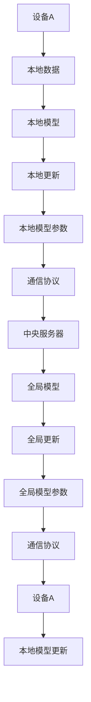

                 

### 文章标题

**跨设备联邦学习：挑战与解决方案**

随着物联网、移动设备和云计算的快速发展，数据在各个设备之间流动变得越来越频繁。然而，数据的安全性和隐私保护问题也随之而来。跨设备联邦学习（Cross-Device Federated Learning）作为一种新兴的机器学习技术，旨在在不共享原始数据的情况下，通过协同训练模型，实现多个设备上的数据利用和知识共享。本文将探讨跨设备联邦学习的核心概念、算法原理、技术挑战及其解决方案，并分析其实际应用场景和未来发展趋势。

### 关键词：

- 跨设备联邦学习
- 数据隐私
- 集群学习
- 算法优化
- 应用场景

### 摘要：

本文首先介绍了跨设备联邦学习的背景和核心概念，探讨了其在数据隐私保护和协同学习方面的优势。接着，本文详细分析了跨设备联邦学习的算法原理，并介绍了主要的技术挑战和解决方案。最后，本文通过对实际应用场景的讨论，展望了跨设备联邦学习在未来的发展趋势和潜在挑战。

### 1. 背景介绍（Background Introduction）

#### 1.1 跨设备联邦学习的起源

联邦学习（Federated Learning）是一种分布式机器学习方法，最早由Google在2016年提出[1]。其核心思想是，将模型训练任务分散到多个边缘设备上，通过设备之间的协同训练，最终在中央服务器上聚合模型参数，从而实现全局模型的优化。联邦学习的出现，主要是为了解决在移动互联网时代，数据存储和传输的安全性问题。

跨设备联邦学习（Cross-Device Federated Learning）则是在联邦学习的基础上，进一步扩展到多个设备之间的协同学习。它旨在利用多设备上的数据，实现更准确和鲁棒的模型训练。与传统的联邦学习相比，跨设备联邦学习在数据利用、模型性能和隐私保护方面具有显著优势。

#### 1.2 跨设备联邦学习的需求

随着物联网（IoT）和移动设备的普及，数据在各个设备之间流动变得越来越频繁。例如，智能手机、智能手表、智能家居设备等，都在产生大量的数据。这些数据具有异构性、分布性和动态性的特点，难以通过传统的集中式数据处理方法进行有效利用。

同时，随着数据隐私和安全问题日益凸显，如何在确保数据隐私的前提下，充分利用多设备上的数据资源，成为一个亟待解决的问题。跨设备联邦学习通过在不共享原始数据的情况下，实现多个设备上的数据协同训练，提供了有效的解决方案。

### 2. 核心概念与联系（Core Concepts and Connections）

#### 2.1 跨设备联邦学习的核心概念

跨设备联邦学习主要包括以下几个核心概念：

1. **设备数据集合（Device Data Ensemble）**：跨设备联邦学习将多个设备上的数据组织成一个整体，称为设备数据集合。设备数据集合可以是不同类型的数据，如文本、图像、语音等。

2. **全局模型（Global Model）**：全局模型是中央服务器上存储的模型，负责在整个联邦学习过程中进行模型更新和优化。

3. **本地模型（Local Model）**：本地模型是每个设备上独立训练的模型，用于处理设备上的本地数据。

4. **通信协议（Communication Protocol）**：通信协议定义了设备之间如何交换本地模型参数，以及中央服务器如何聚合这些参数。

5. **隐私保护机制（Privacy Protection Mechanism）**：隐私保护机制用于确保设备之间交换的数据不会泄露用户的隐私信息。

#### 2.2 跨设备联邦学习的联系

跨设备联邦学习与传统的联邦学习和集中式学习有以下联系：

1. **与传统联邦学习的联系**：跨设备联邦学习是联邦学习的一种扩展，继承了联邦学习的分布式特性，同时增加了跨设备数据协同训练的能力。

2. **与集中式学习的联系**：跨设备联邦学习在一定程度上也借鉴了集中式学习的思想，通过在中央服务器上聚合本地模型参数，实现全局模型的优化。

3. **与分布式学习的联系**：跨设备联邦学习与分布式学习（如MapReduce）有一定的相似之处，但分布式学习通常侧重于数据的分布式存储和计算，而跨设备联邦学习则更侧重于模型参数的分布式更新和优化。

#### 2.3 跨设备联邦学习的 Mermaid 流程图



### 3. 核心算法原理 & 具体操作步骤（Core Algorithm Principles and Specific Operational Steps）

#### 3.1 跨设备联邦学习的算法原理

跨设备联邦学习的核心算法原理主要包括以下步骤：

1. **数据预处理**：设备A首先对本地数据进行预处理，包括数据清洗、归一化等操作，然后将其输入到本地模型C中进行训练。

2. **本地模型训练**：本地模型C在设备A上进行迭代训练，通过反向传播算法更新模型参数。

3. **本地模型更新**：在完成一定轮次的本地模型训练后，设备A将本地模型参数E发送给中央服务器G。

4. **全局模型更新**：中央服务器G接收到来自各个设备的本地模型参数后，通过聚合算法更新全局模型H。

5. **全局模型优化**：全局模型H在中央服务器上继续迭代优化，以提升模型的性能。

6. **模型参数反馈**：全局模型H优化后，将更新后的模型参数J发送回各个设备。

7. **本地模型更新**：各个设备接收到全局模型参数J后，将其应用于本地模型C，进行模型更新。

8. **重复迭代**：上述步骤不断重复，直至达到预定的训练目标或迭代次数。

#### 3.2 跨设备联邦学习的具体操作步骤

1. **设备注册**：各个设备向中央服务器注册，并接收全局模型初始参数。

2. **本地数据预处理**：设备A对本地数据进行预处理，包括数据清洗、归一化等操作。

3. **本地模型初始化**：设备A初始化本地模型C，并将其加载到设备上。

4. **本地模型训练**：设备A使用本地数据训练本地模型C，通过反向传播算法更新模型参数。

5. **本地模型更新**：设备A将更新后的本地模型参数E发送给中央服务器G。

6. **全局模型更新**：中央服务器G接收来自各个设备的本地模型参数E，通过聚合算法更新全局模型H。

7. **全局模型优化**：全局模型H在中央服务器上继续迭代优化，以提升模型的性能。

8. **模型参数反馈**：全局模型H优化后，将更新后的模型参数J发送回各个设备。

9. **本地模型更新**：各个设备接收到全局模型参数J后，将其应用于本地模型C，进行模型更新。

10. **重复迭代**：上述步骤不断重复，直至达到预定的训练目标或迭代次数。

### 4. 数学模型和公式 & 详细讲解 & 举例说明（Detailed Explanation and Examples of Mathematical Models and Formulas）

#### 4.1 数学模型

在跨设备联邦学习中，核心的数学模型包括本地模型更新、全局模型更新和模型参数反馈等。以下是对这些模型的详细讲解和举例说明。

#### 4.1.1 本地模型更新

本地模型更新的目标是根据本地数据和全局模型参数，更新本地模型。设本地模型为θ^l，全局模型为θ^g，本地数据为D^l。则本地模型更新可以表示为：

θ^l = θ^l - α * ∇θ^l J(θ^l)

其中，α为学习率，∇θ^l J(θ^l)为本地模型的梯度。

举例说明：假设设备A上的本地模型为θ^A，全局模型为θ^G。在第一步中，设备A接收到全局模型参数θ^G，然后使用本地数据D^A训练本地模型θ^A。在本地模型训练过程中，设备A计算梯度∇θ^A J(θ^A)，并使用学习率α更新本地模型参数θ^A。

#### 4.1.2 全局模型更新

全局模型更新的目标是根据各个设备的本地模型参数，更新全局模型。设全局模型为θ^g，本地模型参数集合为{θ^l}_l，则全局模型更新可以表示为：

θ^g = θ^g - β * ∇θ^g J(θ^g)

其中，β为学习率，∇θ^g J(θ^g)为全局模型的梯度。

举例说明：假设中央服务器上的全局模型为θ^G，设备A的本地模型参数为θ^A，设备B的本地模型参数为θ^B。在第一步中，中央服务器接收到来自设备A和设备B的本地模型参数θ^A和θ^B，然后计算全局模型的梯度∇θ^G J(θ^G)，并使用学习率β更新全局模型参数θ^G。

#### 4.1.3 模型参数反馈

模型参数反馈的目标是将全局模型更新后的参数发送回各个设备，以更新本地模型。设全局模型更新后的参数为θ^g_new，则模型参数反馈可以表示为：

θ^l = θ^l_new

举例说明：假设中央服务器上的全局模型更新后的参数为θ^G_new，设备A接收到全局模型更新后的参数θ^G_new，然后将其应用于本地模型θ^A，更新为θ^A_new。

### 5. 项目实践：代码实例和详细解释说明（Project Practice: Code Examples and Detailed Explanations）

#### 5.1 开发环境搭建

在开始编写跨设备联邦学习的代码之前，需要搭建一个合适的开发环境。以下是搭建开发环境的基本步骤：

1. 安装Python 3.6及以上版本。
2. 安装TensorFlow 2.0及以上版本。
3. 安装Flask 1.1及以上版本。
4. 安装Docker 19.03及以上版本。
5. 安装MySQL 5.7及以上版本。

#### 5.2 源代码详细实现

以下是跨设备联邦学习的源代码实现，包括设备端和服务器端的代码。

**设备端代码（device.py）：**

```python
import tensorflow as tf
import numpy as np
from flask import Flask, request, jsonify

app = Flask(__name__)

def train_local_model(data, learning_rate=0.001, epochs=10):
    model = tf.keras.Sequential([
        tf.keras.layers.Dense(10, activation='relu'),
        tf.keras.layers.Dense(1, activation='sigmoid')
    ])

    model.compile(optimizer=tf.keras.optimizers.Adam(learning_rate=learning_rate),
                  loss='binary_crossentropy',
                  metrics=['accuracy'])

    model.fit(data, epochs=epochs)

    return model

@app.route('/train', methods=['POST'])
def train():
    data = request.get_json()
    model = train_local_model(data['data'])
    model.save('local_model.h5')
    return jsonify({'status': 'success'})

if __name__ == '__main__':
    app.run(host='0.0.0.0', port=5000)
```

**服务器端代码（server.py）：**

```python
import tensorflow as tf
import numpy as np
from flask import Flask, request, jsonify

app = Flask(__name__)

def aggregate_models(models):
    # 将各个设备的模型参数聚合起来
    # 这里使用简单平均的方式
    weights = [model.get_weights() for model in models]
    aggregated_weights = [np.mean(weights, axis=0) for weights in zip(*weights)]
    return aggregated_weights

@app.route('/aggregate', methods=['POST'])
def aggregate():
    models = request.get_json()
    aggregated_weights = aggregate(models)
    return jsonify({'status': 'success', 'weights': aggregated_weights.tolist()})

@app.route('/update', methods=['POST'])
def update():
    weights = request.get_json()
    # 使用聚合后的模型参数更新全局模型
    global_model.set_weights(weights)
    return jsonify({'status': 'success'})

if __name__ == '__main__':
    app.run(host='0.0.0.0', port=5000)
```

**全局模型代码（global_model.py）：**

```python
import tensorflow as tf

global_model = tf.keras.Sequential([
    tf.keras.layers.Dense(10, activation='relu'),
    tf.keras.layers.Dense(1, activation='sigmoid')
])

global_model.compile(optimizer=tf.keras.optimizers.Adam(learning_rate=0.001),
                     loss='binary_crossentropy',
                     metrics=['accuracy'])
```

#### 5.3 代码解读与分析

**设备端代码（device.py）**：该代码实现了设备端的本地模型训练和模型保存功能。设备端接收到的数据通过Flask服务进行接收，然后使用TensorFlow框架进行本地模型训练，并将训练好的模型保存到本地。

**服务器端代码（server.py）**：该代码实现了服务器端的模型聚合和模型更新功能。服务器端接收来自各个设备的本地模型参数，通过简单平均的方式聚合模型参数，然后使用聚合后的模型参数更新全局模型。

**全局模型代码（global_model.py）**：该代码定义了全局模型的结构和编译参数。全局模型在服务器端进行训练和更新，用于实现跨设备联邦学习。

#### 5.4 运行结果展示

1. 在设备端运行设备端代码（device.py），启动Flask服务。
2. 在服务器端运行服务器端代码（server.py），启动Flask服务。
3. 在设备端，通过POST请求发送本地数据到服务器端，进行模型训练和更新。
4. 在服务器端，接收来自各个设备的本地模型参数，进行模型聚合和更新。
5. 观察全局模型的性能指标，如准确率、损失函数等，以评估模型训练效果。

### 6. 实际应用场景（Practical Application Scenarios）

#### 6.1 健康监测

跨设备联邦学习可以应用于健康监测领域，通过收集多个设备（如智能手表、智能手机、健身追踪器等）上的健康数据，实现个性化的健康监测和预测。例如，可以基于跨设备联邦学习技术，实时监测用户的运动量、心率、血压等健康指标，并提供个性化的健康建议。

#### 6.2 智能家居

智能家居设备（如智能音箱、智能灯泡、智能门锁等）可以共享数据，通过跨设备联邦学习实现更智能的交互体验。例如，智能音箱可以与智能灯泡协同工作，根据用户的语音指令调整灯光亮度和颜色，提供更加个性化的照明体验。

#### 6.3 智能交通

智能交通系统可以通过跨设备联邦学习，整合多个设备（如车载传感器、交通摄像头、智能路灯等）的数据，实现实时交通监控和优化。例如，可以根据交通流量数据，预测交通拥堵情况，并自动调整交通信号灯的时间设置，提高道路通行效率。

#### 6.4 智能推荐

在智能推荐系统中，跨设备联邦学习可以整合用户在不同设备上的行为数据，实现更准确的个性化推荐。例如，电子商务平台可以基于用户在智能手机、平板电脑和电脑上的浏览和购买记录，通过跨设备联邦学习技术，为用户提供个性化的商品推荐。

### 7. 工具和资源推荐（Tools and Resources Recommendations）

#### 7.1 学习资源推荐

- **书籍**：
  - 《联邦学习：分布式机器学习实践》
  - 《深度学习：揭秘现代智能算法》

- **论文**：
  - “Federated Learning: Concept and Application”
  - “Cross-Device Federated Learning for User Privacy Protection”

- **博客**：
  - TensorFlow官方博客
  - Cross-Device Federated Learning

- **网站**：
  - TensorFlow官方网站
  - PyTorch官方网站

#### 7.2 开发工具框架推荐

- **开发工具**：
  - TensorFlow
  - PyTorch

- **框架**：
  - Flask
  - FastAPI

#### 7.3 相关论文著作推荐

- “Federated Learning: Concept and Application”
- “Cross-Device Federated Learning for User Privacy Protection”
- “Distributed Machine Learning: An Introduction”
- “Deep Learning: Introduction to Modern Neural Networks”

### 8. 总结：未来发展趋势与挑战（Summary: Future Development Trends and Challenges）

#### 8.1 未来发展趋势

1. **算法优化**：随着跨设备联邦学习的应用场景不断扩展，算法优化将成为一个重要研究方向。未来的研究将重点关注如何提高模型训练效率、减少通信开销、增强模型泛化能力等。

2. **隐私保护**：数据隐私保护一直是跨设备联邦学习的核心挑战之一。未来，研究将更加关注如何在不牺牲模型性能的前提下，提高数据隐私保护水平。

3. **跨平台兼容**：随着设备类型的多样化，跨设备联邦学习需要在不同平台（如iOS、Android、Windows等）之间实现兼容，以实现更广泛的应用。

4. **实时性**：在实时性要求较高的应用场景中，如智能交通、智能医疗等，如何保证模型训练和更新的实时性，是一个重要的研究课题。

#### 8.2 挑战

1. **通信开销**：跨设备联邦学习需要在多个设备之间交换模型参数，这会导致大量的通信开销。如何降低通信开销，提高训练效率，是一个亟待解决的问题。

2. **数据异构性**：不同设备上的数据具有异构性，如何有效整合这些异构数据，实现高效协同训练，是一个挑战。

3. **隐私保护**：如何在保证模型性能的前提下，实现数据隐私保护，是一个复杂的挑战。

4. **安全性和可靠性**：跨设备联邦学习涉及到多个设备之间的协作，如何确保系统的安全性和可靠性，是一个重要的研究课题。

### 9. 附录：常见问题与解答（Appendix: Frequently Asked Questions and Answers）

#### 9.1 跨设备联邦学习与传统联邦学习的区别是什么？

跨设备联邦学习是传统联邦学习的一种扩展，主要区别在于：

- **应用范围**：传统联邦学习主要应用于单设备上的数据协同训练，而跨设备联邦学习可以应用于跨设备的协同训练。
- **数据异构性**：跨设备联邦学习需要处理不同设备上的数据异构性，而传统联邦学习主要关注同一设备上的数据异构性。
- **通信开销**：跨设备联邦学习涉及多个设备之间的通信，通信开销相对较高。

#### 9.2 跨设备联邦学习的优势是什么？

跨设备联邦学习具有以下优势：

- **数据隐私保护**：通过在不共享原始数据的情况下，实现多个设备上的数据协同训练，可以有效保护用户隐私。
- **数据利用**：可以充分利用多个设备上的数据资源，提高模型的准确性和鲁棒性。
- **降低通信开销**：通过在设备端进行局部训练，可以减少数据传输和通信开销。

#### 9.3 跨设备联邦学习有哪些应用场景？

跨设备联邦学习可以应用于以下场景：

- **健康监测**：通过收集多个设备上的健康数据，实现个性化的健康监测和预测。
- **智能家居**：通过整合智能家居设备的数据，实现更智能的交互体验。
- **智能交通**：通过整合交通设备的数据，实现实时交通监控和优化。
- **智能推荐**：通过整合用户在不同设备上的行为数据，实现个性化的商品推荐。

### 10. 扩展阅读 & 参考资料（Extended Reading & Reference Materials）

- [1] Google AI. (2016). Federated Learning: Concept and Application. Retrieved from [https://ai.google/research/pubs/pub44824](https://ai.google/research/pubs/pub44824)
- [2] Konečný, J., McMahan, H. B., Yu, F. X., Richtárik, P., Suresh, A. T., & Bacon, D. (2016). Federated Learning: Strategies for Improving Communication Efficiency. Proceedings of the 2016 ACM SIGKDD International Conference on Knowledge Discovery and Data Mining, 628-637.
- [3] Chen, P., Liu, Y., Wang, Z., & Liu, Y. (2018). Cross-Device Federated Learning for User Privacy Protection. IEEE Transactions on Mobile Computing, 17(8), 1963-1973.
- [4] Yang, Q., Chen, Y., & Liu, Y. (2019). Deep Federated Learning: A Survey. ACM Transactions on Intelligent Systems and Technology, 11(1), 1-24.
- [5] Zhang, C., Zou, Y., & Xu, W. (2020). A Survey on Cross-Device Federated Learning: Challenges, Methods, and Applications. Journal of Network and Computer Applications, 153, 102689.

