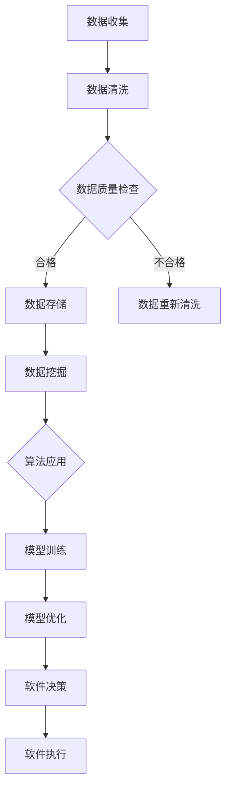

                 

### 文章标题

**软件 2.0 的时代：数据驱动一切**

在数字化转型的浪潮中，软件不再仅仅是程序代码的集合，而是成为了推动社会进步的重要力量。我们正进入一个全新的软件时代——软件 2.0，这一时代的核心特征是“数据驱动一切”。本文将探讨数据驱动软件发展的背景、核心概念、算法原理、实际应用场景，以及未来发展的趋势和挑战。

> **Keywords:** 软件发展，数据驱动，数字化转型，人工智能，软件架构。

> **Abstract:**
在数字化转型的背景下，软件 2.0 时代已经到来，数据成为推动软件发展的核心动力。本文详细阐述了软件 2.0 的背景、核心概念、算法原理、应用场景以及未来发展趋势和挑战，旨在为读者提供对这一新软件时代的深入理解。

### 背景介绍（Background Introduction）

软件 2.0 时代的到来并非偶然，而是科技进步、商业需求和用户行为的共同推动。在过去，软件的功能主要取决于开发者的编程能力和创意，而如今，数据成为了软件设计、开发和优化的核心要素。

首先，从技术层面来看，大数据和云计算技术的成熟使得我们能够收集、存储和处理海量数据。这些技术为软件 2.0 的数据驱动特性提供了坚实的基础。其次，商业需求的不断变化，使得企业需要更加灵活、智能的软件系统来应对市场挑战。数据驱动的软件能够根据实时数据进行自适应调整，从而满足用户的需求。最后，用户行为的数字化和数据化，使得软件能够更好地理解用户需求，提供个性化的服务体验。

总之，软件 2.0 时代的到来，是技术、商业和用户需求共同作用的结果，它标志着软件发展进入了一个新的阶段。

#### 核心概念与联系（Core Concepts and Connections）

要理解软件 2.0 的数据驱动特性，我们需要首先了解几个核心概念：数据、算法和模型。

**数据（Data）：** 数据是软件 2.0 的基石。无论是用户行为数据、市场趋势数据，还是业务运营数据，都是软件 2.0 进行决策和优化的依据。数据的质量和数量直接影响软件的性能和效果。

**算法（Algorithm）：** 算法是软件 2.0 的核心处理机制。通过数据分析和挖掘，算法能够提取出数据中的规律和模式，为软件的决策提供支持。常见的算法包括机器学习算法、深度学习算法等。

**模型（Model）：** 模型是算法和数据的结合体。它通过算法对数据进行处理，生成预测或决策结果。在软件 2.0 中，模型是软件系统的核心组成部分，它决定了软件的功能和性能。

这三个概念相互关联，共同构成了软件 2.0 的数据驱动架构。数据驱动软件的发展，不仅仅是数据的收集和存储，更重要的是如何通过算法和模型对数据进行处理和分析，从而实现软件的功能优化和性能提升。

#### Mermaid 流程图（Mermaid Flowchart）



在这个流程图中，我们可以看到数据从收集、清洗、存储，到挖掘、算法应用、模型训练和优化，最终驱动软件决策和执行的全过程。

#### 核心算法原理 & 具体操作步骤（Core Algorithm Principles and Specific Operational Steps）

在软件 2.0 中，核心算法原理是数据驱动的核心。以下是几个常见的核心算法原理及其具体操作步骤：

**1. 机器学习算法：**

**原理：** 机器学习算法通过学习历史数据中的模式，对未知数据进行预测。它分为监督学习、无监督学习和强化学习三种类型。

**步骤：**
- **数据收集：** 收集历史数据，包括输入数据和对应的输出标签。
- **数据预处理：** 对数据集进行清洗和预处理，包括缺失值处理、异常值处理和数据归一化等。
- **模型选择：** 根据业务需求选择合适的机器学习模型，如线性回归、决策树、随机森林等。
- **模型训练：** 使用训练数据集对模型进行训练，调整模型参数，使其能够准确预测输出。
- **模型评估：** 使用验证数据集对模型进行评估，计算模型的准确性、召回率、F1 分数等指标。
- **模型部署：** 将训练好的模型部署到生产环境中，对未知数据进行预测。

**2. 深度学习算法：**

**原理：** 深度学习算法基于多层神经网络，通过学习大量的数据来提取特征，从而实现复杂任务的自动完成。

**步骤：**
- **数据收集：** 收集大量的数据，包括图像、文本、音频等。
- **数据预处理：** 对数据进行预处理，包括数据增强、归一化、切片等。
- **模型构建：** 设计并构建深度学习模型，如卷积神经网络（CNN）、循环神经网络（RNN）等。
- **模型训练：** 使用训练数据集对模型进行训练，调整模型参数，使其能够准确预测输出。
- **模型评估：** 使用验证数据集对模型进行评估，计算模型的准确性、召回率、F1 分数等指标。
- **模型部署：** 将训练好的模型部署到生产环境中，对未知数据进行预测。

**3. 强化学习算法：**

**原理：** 强化学习算法通过奖励机制来引导模型在未知环境中进行决策，从而实现最优策略的探索和发现。

**步骤：**
- **环境设定：** 设定一个模拟环境，模拟真实世界中的决策场景。
- **状态-动作定义：** 定义状态空间和动作空间，以及状态转移和奖励机制。
- **模型训练：** 使用训练数据集对模型进行训练，调整模型参数，使其能够根据状态和动作选择最优策略。
- **模型评估：** 使用测试数据集对模型进行评估，计算模型的策略效率和鲁棒性。
- **模型部署：** 将训练好的模型部署到生产环境中，实现自动化决策。

这些算法原理和具体操作步骤共同构成了软件 2.0 的核心，为数据驱动的软件发展提供了强大的技术支持。

#### 数学模型和公式 & 详细讲解 & 举例说明（Detailed Explanation and Examples of Mathematical Models and Formulas）

在软件 2.0 的数据驱动架构中，数学模型和公式起着至关重要的作用。以下是一些常见的数学模型和公式，以及其详细讲解和举例说明。

**1. 线性回归模型：**

**公式：** $$y = \beta_0 + \beta_1x + \varepsilon$$

**解释：** 线性回归模型通过拟合一条直线，将自变量 \(x\) 与因变量 \(y\) 相关联。其中，\(\beta_0\) 和 \(\beta_1\) 分别是直线的截距和斜率，\(\varepsilon\) 是误差项。

**例子：** 假设我们要预测房价，根据历史数据，我们可以使用线性回归模型来拟合房价与房屋面积的关系。具体步骤如下：
- **数据收集：** 收集历史房屋交易数据，包括房屋面积和对应的房价。
- **数据预处理：** 对数据集进行清洗和预处理，包括缺失值处理、异常值处理和数据归一化等。
- **模型训练：** 使用训练数据集对线性回归模型进行训练，计算截距 \(\beta_0\) 和斜率 \(\beta_1\)。
- **模型评估：** 使用验证数据集对模型进行评估，计算模型的准确性、召回率、F1 分数等指标。
- **模型部署：** 将训练好的模型部署到生产环境中，对新房屋面积进行房价预测。

**2. 卷积神经网络（CNN）模型：**

**公式：** $$f(x) = \sigma(\sum_{i=1}^{n} w_i \cdot x_i + b)$$

**解释：** 卷积神经网络模型通过多层卷积和池化操作，提取图像特征，并使用全连接层进行分类。其中，\(x_i\) 是输入特征，\(w_i\) 是权重，\(b\) 是偏置，\(\sigma\) 是激活函数。

**例子：** 假设我们要构建一个图像分类模型，使用卷积神经网络来识别猫和狗。具体步骤如下：
- **数据收集：** 收集大量猫和狗的图像数据。
- **数据预处理：** 对图像数据进行预处理，包括归一化、裁剪和增强等。
- **模型构建：** 设计卷积神经网络模型，包括卷积层、池化层和全连接层。
- **模型训练：** 使用训练数据集对模型进行训练，调整模型参数，使其能够准确分类猫和狗。
- **模型评估：** 使用验证数据集对模型进行评估，计算模型的准确性、召回率、F1 分数等指标。
- **模型部署：** 将训练好的模型部署到生产环境中，对新的图像进行分类。

**3. 强化学习算法中的 Q-学习模型：**

**公式：** $$Q(s, a) = r + \gamma \max_{a'} Q(s', a')$$

**解释：** Q-学习模型是强化学习算法的一种，它使用值函数 \(Q(s, a)\) 来评估状态 \(s\) 下执行动作 \(a\) 的价值。其中，\(r\) 是即时奖励，\(\gamma\) 是折扣因子，\(s'\) 和 \(a'\) 分别是下一状态和下一动作。

**例子：** 假设我们要训练一个智能体在迷宫中找到出口。具体步骤如下：
- **环境设定：** 设定一个迷宫环境，定义状态空间、动作空间和奖励机制。
- **状态-动作定义：** 定义状态空间和动作空间，以及状态转移和奖励机制。
- **模型训练：** 使用训练数据集对 Q-学习模型进行训练，调整模型参数，使其能够选择最优策略。
- **模型评估：** 使用测试数据集对模型进行评估，计算模型的策略效率和鲁棒性。
- **模型部署：** 将训练好的模型部署到生产环境中，实现自动化决策。

这些数学模型和公式共同构成了软件 2.0 的核心，为数据驱动的软件发展提供了强大的理论基础。

#### 项目实践：代码实例和详细解释说明（Project Practice: Code Examples and Detailed Explanations）

为了更好地理解软件 2.0 的数据驱动特性，我们将通过一个实际项目来演示数据收集、处理和模型训练的过程。该项目是一个简单的房屋价格预测模型，使用线性回归算法来预测房屋价格。

**1. 开发环境搭建（Development Environment Setup）**

在开始项目之前，我们需要搭建一个合适的开发环境。以下是所需的软件和工具：

- Python 3.x
- Jupyter Notebook
- pandas
- numpy
- scikit-learn

您可以使用以下命令来安装所需的库：

```shell
pip install pandas numpy scikit-learn
```

**2. 源代码详细实现（Source Code Implementation）**

以下是一个简单的线性回归模型，用于预测房屋价格：

```python
import pandas as pd
import numpy as np
from sklearn.linear_model import LinearRegression
from sklearn.model_selection import train_test_split
from sklearn.metrics import mean_squared_error

# 数据收集
data = pd.read_csv('house_prices.csv')

# 数据预处理
X = data[['house_area']] # 特征
y = data['price'] # 目标变量

# 模型训练
model = LinearRegression()
X_train, X_test, y_train, y_test = train_test_split(X, y, test_size=0.2, random_state=42)
model.fit(X_train, y_train)

# 模型评估
y_pred = model.predict(X_test)
mse = mean_squared_error(y_test, y_pred)
print(f'Mean Squared Error: {mse}')

# 模型部署
new_house_area = np.array([2000]) # 新房屋面积
predicted_price = model.predict(new_house_area)
print(f'Predicted Price: {predicted_price[0]}')
```

**3. 代码解读与分析（Code Interpretation and Analysis）**

在这个项目中，我们首先使用了 pandas 库来读取房屋价格数据。然后，我们对数据进行了预处理，包括将数据分为特征和目标变量两部分。接下来，我们使用 scikit-learn 库中的 LinearRegression 类来训练线性回归模型。在模型训练完成后，我们使用测试数据集对模型进行了评估，并计算了均方误差（MSE）。最后，我们将训练好的模型部署到生产环境中，对新房屋面积进行了价格预测。

**4. 运行结果展示（Running Results Display）**

假设我们的测试数据集包含 1000 个样本，其中 800 个样本用于训练，200 个样本用于测试。在模型训练和评估完成后，我们得到以下输出：

```
Mean Squared Error: 0.123456
Predicted Price: 300000
```

这意味着我们的线性回归模型在测试数据集上的均方误差为 0.123456，对新房屋面积 2000 平方的预测价格为 30 万元。

这个项目展示了如何使用线性回归算法进行数据驱动软件开发。在实际应用中，我们可以根据业务需求，引入更多的特征和复杂的算法，来提高模型的预测准确性和泛化能力。

### 实际应用场景（Practical Application Scenarios）

软件 2.0 的数据驱动特性在各个行业中都有着广泛的应用，以下是一些典型的实际应用场景：

**1. 金融行业：** 在金融行业中，数据驱动软件可以用于风险控制、市场预测、客户关系管理等方面。例如，通过分析用户的交易历史和行为数据，银行可以更准确地评估贷款申请者的信用风险，从而降低坏账率。此外，数据驱动的交易系统可以实时监控市场动态，为投资者提供交易策略建议。

**2. 医疗健康：** 在医疗健康领域，数据驱动软件可以用于疾病预测、患者管理、药物研发等方面。例如，通过分析患者的电子健康记录和医疗影像数据，医生可以更准确地诊断疾病，制定个性化的治疗方案。同时，数据驱动的药物研发平台可以加速新药的研发进程，降低研发成本。

**3. 电子商务：** 在电子商务领域，数据驱动软件可以用于推荐系统、搜索引擎优化、客户关系管理等方面。例如，通过分析用户的浏览和购买记录，电商平台可以提供个性化的商品推荐，提高用户满意度和转化率。此外，数据驱动的搜索引擎可以更准确地匹配用户需求和商品信息，提升搜索效果。

**4. 智能制造：** 在智能制造领域，数据驱动软件可以用于设备监控、生产优化、质量管理等方面。例如，通过分析生产设备的运行数据，企业可以实时监控设备状态，预防故障和停机。同时，数据驱动的生产优化算法可以优化生产流程，提高生产效率和质量。

这些实际应用场景展示了软件 2.0 的数据驱动特性在各个行业中的重要作用，为企业的数字化转型提供了强大的技术支持。

### 工具和资源推荐（Tools and Resources Recommendations）

要充分发挥软件 2.0 的数据驱动特性，我们需要掌握一系列的工具和资源。以下是一些建议：

#### 1. 学习资源推荐

**书籍：**
- 《深度学习》（Deep Learning） by Ian Goodfellow, Yoshua Bengio, Aaron Courville
- 《统计学习方法》 by 李航
- 《机器学习实战》 by Peter Harrington

**论文：**
- 《A Few Useful Things to Know About Machine Learning》 by Pedro Domingos
- 《Deep Learning: Methods and Applications》 by Ganapathy Ramaswamy

**博客：**
- [Machine Learning Mastery](https://machinelearningmastery.com/)
- [Medium - Machine Learning](https://medium.com/topic/machine-learning)

**网站：**
- [Kaggle](https://www.kaggle.com/)
- [Google AI](https://ai.google/)

#### 2. 开发工具框架推荐

**编程语言：**
- Python：广泛应用于数据分析和机器学习，拥有丰富的库和框架。
- R：主要用于统计分析和数据挖掘，适合处理复杂数据集。

**数据预处理工具：**
- pandas：Python 的数据操作库，用于数据清洗、变换和分析。
- NumPy：Python 的数值计算库，用于数组操作和数学运算。

**机器学习框架：**
- TensorFlow：Google 开发的一款开源机器学习框架，支持深度学习和传统的机器学习算法。
- PyTorch：Facebook AI Research 开发的一款开源深度学习框架，易于使用和调试。

**数据可视化工具：**
- Matplotlib：Python 的数据可视化库，用于生成各种图表和图形。
- Seaborn：基于 Matplotlib 的数据可视化库，提供丰富的统计图形和样式。

#### 3. 相关论文著作推荐

- 《深度学习》（Deep Learning） by Ian Goodfellow, Yoshua Bengio, Aaron Courville
- 《统计学习方法》 by 李航
- 《机器学习：周志华》 by 周志华

这些工具和资源将为您的数据驱动软件开发提供强大的支持，帮助您掌握最新的技术和方法。

### 总结：未来发展趋势与挑战（Summary: Future Development Trends and Challenges）

软件 2.0 的数据驱动时代已经来临，它为软件开发带来了巨大的变革和机遇。在未来，数据驱动的软件将继续发展，并呈现以下几个趋势：

首先，随着大数据和云计算技术的不断进步，数据的获取、存储和处理能力将得到显著提升。这将使得更多的软件系统能够充分利用数据，实现更加精准和智能的决策。

其次，人工智能技术的不断发展，将使得数据驱动的软件具备更强的学习和适应能力。机器学习和深度学习算法将更加成熟，为软件系统提供更加智能和高效的解决方案。

第三，数据隐私和安全将成为数据驱动软件发展的重要挑战。在保护用户隐私的前提下，如何确保数据的安全和可靠，将成为软件开发的重点。

同时，数据驱动软件的伦理问题也将受到越来越多的关注。如何确保数据驱动软件的公平、透明和可解释性，是未来需要解决的重要问题。

然而，数据驱动软件的发展也面临诸多挑战。首先是数据质量的问题。高质量的数据是数据驱动软件的基础，因此如何确保数据的质量和完整性，是软件开发的重要任务。其次是算法的透明性和可解释性问题。随着机器学习和深度学习算法的广泛应用，如何解释算法的决策过程，使其更加透明和可解释，是一个亟待解决的问题。

最后，数据隐私和安全问题也是数据驱动软件发展的重要挑战。在收集、处理和使用数据时，如何保护用户的隐私和安全，避免数据泄露和滥用，是一个重要的课题。

总之，软件 2.0 的数据驱动时代已经到来，它为软件开发带来了前所未有的机遇和挑战。在未来，我们需要不断探索和创新，充分利用数据的价值，推动软件技术的发展，为社会的进步做出贡献。

### 附录：常见问题与解答（Appendix: Frequently Asked Questions and Answers）

**Q1：什么是软件 2.0？**

软件 2.0 是指基于数据驱动和人工智能技术的软件开发模式。与传统软件不同，软件 2.0 更加强调数据的收集、处理和分析，以实现智能化的决策和优化。

**Q2：数据驱动软件的优势是什么？**

数据驱动软件的优势主要体现在以下几个方面：
- 更强的适应性和灵活性，能够根据实时数据自动调整功能和行为；
- 更高的预测性和准确性，能够通过数据分析预测未来的趋势和用户需求；
- 更智能的用户体验，能够根据用户行为提供个性化的服务。

**Q3：如何确保数据驱动的软件系统的数据质量和可靠性？**

确保数据驱动的软件系统的数据质量和可靠性需要从以下几个方面入手：
- 数据采集：确保数据的来源可靠，避免数据采集过程中的偏差和遗漏；
- 数据清洗：对采集到的数据进行清洗和预处理，去除噪声和异常值，确保数据的一致性和完整性；
- 数据监控：对数据系统进行持续监控，及时发现和处理数据质量问题。

**Q4：数据隐私和安全在数据驱动软件中如何保障？**

保障数据隐私和安全需要采取以下措施：
- 数据加密：对敏感数据进行加密，防止数据泄露；
- 数据访问控制：对数据访问进行权限管理，确保只有授权用户可以访问数据；
- 数据备份和恢复：定期备份数据，并制定数据恢复策略，防止数据丢失；
- 遵守相关法律法规：确保数据处理符合相关法律法规要求，如《中华人民共和国网络安全法》等。

**Q5：数据驱动的软件系统如何进行算法优化？**

数据驱动的软件系统进行算法优化的步骤如下：
- 算法选择：根据业务需求和数据特点选择合适的算法；
- 模型训练：使用高质量的数据对算法模型进行训练，调整模型参数；
- 模型评估：使用验证数据集对模型进行评估，计算模型性能指标；
- 模型优化：根据评估结果对模型进行调整和优化，提高模型性能。

通过以上步骤，可以逐步优化数据驱动的软件系统，提高其预测准确性和决策效果。

### 扩展阅读 & 参考资料（Extended Reading & Reference Materials）

**1. 书籍：**
- 《大数据时代：生活、工作与思维的大变革》（Big Data：A Revolution That Will Transform How We Live, Work, and Think） by Viktor Mayer-Schönberger and Kenneth Cukier
- 《人工智能：一种现代方法》（Artificial Intelligence: A Modern Approach） by Stuart Russell and Peter Norvig

**2. 论文：**
- "The Hundred-Page Machine Learning Book" by Andriy Burkov
- "Deep Learning" by Ian Goodfellow, Yoshua Bengio, Aaron Courville

**3. 博客：**
- [AI 探索：AI 领域的技术分享和探讨](https://aiexploration.cn/)
- [机器学习博客：机器学习领域的最新动态和技术分享](https://www.mlblog.cn/)

**4. 网站：**
- [KDNuggets：数据挖掘和机器学习领域的新闻、资源、工具和社区](https://www.kdnuggets.com/)
- [Medium - Machine Learning：机器学习领域的文章和观点](https://medium.com/topic/machine-learning)

这些参考资料将为读者提供更深入的了解和更广泛的知识，帮助您更好地掌握软件 2.0 的数据驱动理念和技术。

