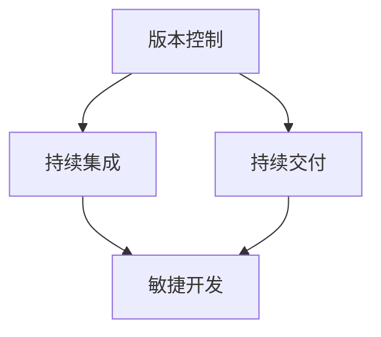
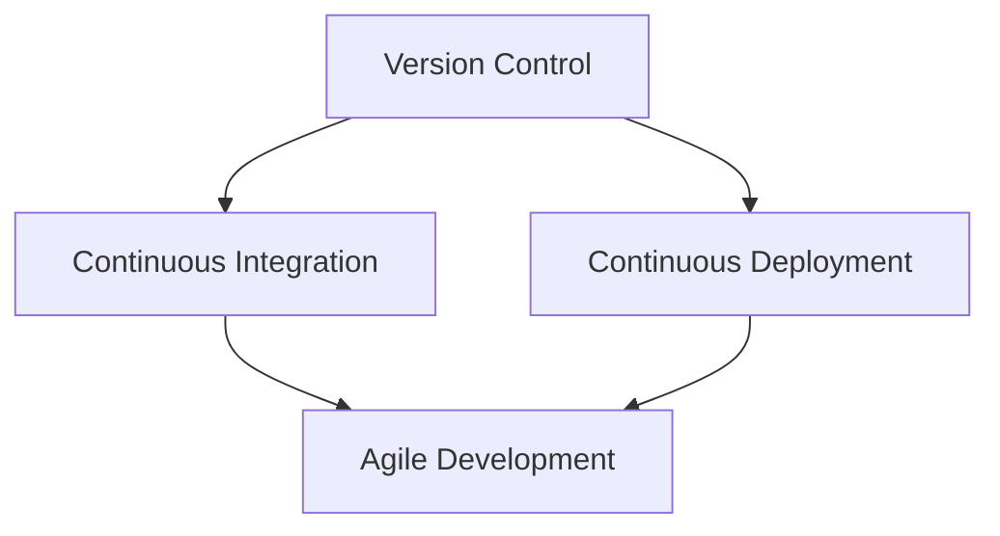

                 

### 文章标题

**《软件2.0的发布管理流程》**

关键词：软件发布管理、软件版本控制、持续集成、持续交付、敏捷开发

在当今快速发展的信息技术时代，软件发布管理已成为企业持续竞争力的重要组成部分。本文将深入探讨软件2.0时代的发布管理流程，从核心概念、算法原理到实际应用，为您呈现一个全面而详尽的视角。

> 摘要：本文将分析软件2.0时代发布管理的核心要素，阐述发布管理的流程及其关键环节，包括需求管理、代码审查、自动化测试、持续集成、持续交付等，并通过具体实例和数学模型，帮助读者理解并掌握发布管理的实践方法。

本文分为十个部分，分别介绍背景介绍、核心概念与联系、核心算法原理 & 具体操作步骤、数学模型和公式 & 详细讲解 & 举例说明、项目实践：代码实例和详细解释说明、实际应用场景、工具和资源推荐、总结：未来发展趋势与挑战、附录：常见问题与解答、扩展阅读 & 参考资料。

现在，让我们一步一步深入探讨软件2.0的发布管理流程。

<|user|>
### 1. 背景介绍

#### 1.1 软件发布管理的定义

软件发布管理（Software Release Management）是确保软件从开发到上线过程中的各个环节顺利进行的流程。它涉及需求管理、代码审查、自动化测试、构建、部署、监控等多个环节，旨在确保软件产品的质量、安全性和稳定性。

在传统软件工程中，发布管理往往是一个耗时且繁琐的过程。随着敏捷开发（Agile Development）和持续集成/持续交付（CI/CD）等现代开发方法的出现，软件发布管理变得更加高效和自动化。

#### 1.2 软件发布管理的重要性

软件发布管理的重要性不言而喻。首先，它确保了软件产品的质量，通过严格的测试和代码审查，减少错误和漏洞的风险。其次，它提高了开发效率，通过自动化流程减少了重复性劳动，使团队能够更专注于创新和优化。

此外，发布管理还帮助企业快速响应市场需求，通过快速迭代和部署，提高产品的市场竞争力。在软件2.0时代，良好的发布管理是确保企业持续发展的关键。

#### 1.3 软件发布管理的发展历程

软件发布管理的发展历程可以追溯到20世纪80年代，当时软件工程刚刚起步。早期的发布管理主要依赖于人工操作和文档管理，效率低下且容易出现错误。

随着计算机技术的进步，自动化工具和流程开始应用于发布管理。1990年代，版本控制系统的出现使得代码管理和发布变得更加高效。进入21世纪，敏捷开发和持续集成/持续交付等现代开发方法的推广，进一步推动了发布管理的发展。

现在，软件发布管理已经成为软件开发过程中不可或缺的一部分，为企业和开发者提供了更高效、更可靠的方法来管理软件的发布。

### 1. Background Introduction
#### 1.1 Definition of Software Release Management
Software release management refers to the process that ensures software products are delivered to end-users in a timely and efficient manner. It encompasses various stages including requirement management, code review, automated testing, building, deployment, and monitoring. The goal is to ensure the quality, security, and stability of the software product.

In traditional software engineering, release management was often a time-consuming and tedious process. With the advent of modern development methodologies such as Agile Development and Continuous Integration/Continuous Deployment (CI/CD), release management has become more efficient and automated.

#### 1.2 Importance of Software Release Management
The importance of software release management is evident. Firstly, it ensures the quality of the software product by conducting rigorous testing and code review, thereby reducing the risk of errors and vulnerabilities. Secondly, it enhances development efficiency by automating repetitive tasks, allowing teams to focus more on innovation and optimization.

Moreover, release management helps companies respond quickly to market demands by enabling rapid iteration and deployment, thereby improving the competitiveness of the product. In the era of software 2.0, effective release management is crucial for business sustainability.

#### 1.3 Development History of Software Release Management
The history of software release management can be traced back to the 1980s when software engineering was just beginning. In those early days, release management relied heavily on manual operations and document management, which was inefficient and prone to errors.

As computer technology advanced, automation tools and processes started to be applied to release management. In the 1990s, the introduction of version control systems made code management and release more efficient. Entering the 21st century, the promotion of modern development methodologies such as Agile Development and CI/CD further accelerated the evolution of release management.

Now, release management has become an integral part of the software development process, providing businesses and developers with more efficient and reliable methods to manage software releases.

<|user|>
### 2. 核心概念与联系

#### 2.1 核心概念

在探讨软件发布管理的过程中，我们需要理解几个关键概念，包括版本控制、持续集成、持续交付、敏捷开发等。

**版本控制（Version Control）：** 版本控制是跟踪和管理工作流程中代码变更的关键工具。它允许开发团队协作，管理代码的版本和历史，确保代码的完整性和一致性。

**持续集成（Continuous Integration，CI）：** 持续集成是一种软件开发实践，通过自动化构建和测试，确保每次代码变更都不会破坏现有功能。CI帮助团队快速发现并修复问题，提高代码质量和开发效率。

**持续交付（Continuous Deployment，CD）：** 持续交付是持续集成的延伸，它通过自动化部署和测试，确保软件在每次代码变更后都能快速、安全地发布到生产环境。

**敏捷开发（Agile Development）：** 敏捷开发是一种以人为核心、迭代、渐进的开发方法。它强调快速响应变化、持续交付有价值的软件，通过频繁的迭代和反馈，确保项目能够灵活适应需求变化。

#### 2.2 关联与整合

这些概念相互关联，共同构成了现代软件发布管理的核心。版本控制确保代码的版本一致性，持续集成和持续交付则确保代码的质量和可靠性。

版本控制与持续集成相结合，可以帮助团队快速检测代码中的问题，并在早期阶段解决，减少后期修复的成本。持续交付则进一步自动化了部署过程，确保软件能够在每个迭代后快速发布。

敏捷开发方法强调迭代和反馈，使得团队能够更加灵活地调整发布策略，根据市场需求快速迭代产品。这种灵活性和响应能力，是现代软件发布管理的核心优势。

#### 2.3 Mermaid 流程图

为了更直观地展示这些概念之间的关系，我们可以使用Mermaid流程图来描述它们之间的联系。



在这个流程图中，版本控制是整个发布管理的起点，它与其他关键环节紧密相连，共同构成了一个高效的软件发布管理流程。

### 2. Core Concepts and Connections
#### 2.1 Core Concepts
In the process of exploring software release management, we need to understand several key concepts, including version control, continuous integration, continuous deployment, and Agile development.

**Version Control:** Version control is a critical tool for tracking and managing code changes in the software development workflow. It allows development teams to collaborate, manage code versions, and ensure code integrity and consistency.

**Continuous Integration (CI):** Continuous Integration is a software development practice that automates the process of building and testing code. It ensures that code changes do not break existing features and helps teams detect and resolve issues quickly, improving code quality and development efficiency.

**Continuous Deployment (CD):** Continuous Deployment is an extension of Continuous Integration that automates the deployment and testing process. It ensures that software is released to production environments quickly and securely after each code change.

**Agile Development:** Agile Development is a development methodology that focuses on iterative and incremental progress. It emphasizes rapid response to changes, continuous delivery of valuable software, and flexibility through frequent iterations and feedback.

#### 2.2 Relationships and Integration
These concepts are interconnected and form the core of modern software release management. Version control ensures the consistency of code versions, while CI and CD ensure the quality and reliability of the code.

Combining version control with CI helps teams quickly identify and resolve issues in code, reducing the cost of fixing problems in later stages. CD further automates the deployment process, ensuring that software can be released quickly after each iteration.

Agile Development emphasizes flexibility and responsiveness, allowing teams to adjust release strategies based on market demands and iterate products rapidly. This flexibility and responsiveness are core advantages of modern software release management.

#### 2.3 Mermaid Flowchart
To visually illustrate the relationships between these concepts, we can use a Mermaid flowchart to describe their connections.



In this flowchart, version control is the starting point of the release management process, closely connected to other key components that together form an efficient software release management workflow.

<|user|>
### 3. 核心算法原理 & 具体操作步骤

#### 3.1 核心算法原理

软件发布管理的核心在于确保软件的质量、安全性和稳定性。这一目标的实现依赖于一系列核心算法原理，包括版本控制算法、自动化测试算法、构建算法等。

**版本控制算法：** 版本控制算法的核心目标是跟踪和管理代码变更。常见的版本控制系统如Git，使用哈希函数（如SHA-1）来生成唯一标识每个代码版本的哈希值。通过哈希值，可以快速定位和回滚到特定版本的代码，确保代码的一致性和可追溯性。

**自动化测试算法：** 自动化测试算法用于在代码变更后自动执行测试，检测代码中的潜在问题。常见的自动化测试方法包括单元测试、集成测试、回归测试等。这些测试方法通过编写测试脚本，自动化执行测试用例，提高测试的覆盖率和效率。

**构建算法：** 构建算法是将源代码转换为可执行文件的过程。常见的构建工具如Maven、Gradle等，使用一系列脚本和配置文件来管理构建过程，包括编译、打包、依赖管理等。

#### 3.2 具体操作步骤

软件发布管理的具体操作步骤如下：

1. **需求管理：** 收集和整理软件需求，明确软件的功能和性能要求。

2. **版本控制：** 使用版本控制系统（如Git）管理代码变更，确保代码的一致性和可追溯性。

3. **代码审查：** 对提交的代码进行审查，确保代码质量符合标准。

4. **自动化测试：** 编写测试脚本，执行单元测试、集成测试和回归测试，确保代码的稳定性和可靠性。

5. **构建：** 使用构建工具（如Maven、Gradle）编译源代码，生成可执行文件。

6. **部署：** 将构建好的软件部署到测试环境或生产环境，进行最终测试和验证。

7. **监控：** 在软件上线后，监控系统运行状态，确保软件的稳定运行。

### 3. Core Algorithm Principles and Specific Operational Steps
#### 3.1 Core Algorithm Principles
The core of software release management lies in ensuring the quality, security, and stability of software. This goal is achieved through a series of core algorithm principles, including version control algorithms, automated testing algorithms, and build algorithms.

**Version Control Algorithm:** The core goal of version control algorithms is to track and manage code changes. Common version control systems like Git use hash functions (such as SHA-1) to generate a unique hash value for each code version. Through hash values, specific versions of the code can be quickly located and rolled back, ensuring code consistency and traceability.

**Automated Testing Algorithm:** Automated testing algorithms are used to automatically execute tests after code changes to detect potential issues in the code. Common automated testing methods include unit testing, integration testing, and regression testing. These testing methods automate the execution of test cases through test scripts, improving test coverage and efficiency.

**Build Algorithm:** Build algorithms are the process of converting source code into executable files. Common build tools like Maven and Gradle use a series of scripts and configuration files to manage the build process, including compilation, packaging, and dependency management.

#### 3.2 Specific Operational Steps
The specific operational steps for software release management are as follows:

1. **Requirement Management:** Collect and organize software requirements to clarify the functional and performance requirements of the software.

2. **Version Control:** Use a version control system (such as Git) to manage code changes, ensuring code consistency and traceability.

3. **Code Review:** Conduct code reviews to ensure code quality meets standards.

4. **Automated Testing:** Write test scripts to perform unit testing, integration testing, and regression testing to ensure code stability and reliability.

5. **Build:** Use build tools (such as Maven or Gradle) to compile the source code, generating executable files.

6. **Deployment:** Deploy the built software to the test or production environment for final testing and verification.

7. **Monitoring:** Monitor the operation of the software after it goes live to ensure stable performance.

<|user|>
### 4. 数学模型和公式 & 详细讲解 & 举例说明

#### 4.1 数学模型和公式

在软件发布管理中，数学模型和公式扮演着关键角色，帮助开发者计算和预测软件发布过程中的关键指标。

**版本控制模型：** 版本控制模型主要用于计算代码库的复杂度和变更频率。一个常用的指标是**复杂度指数（Complexity Index）**，它通过计算代码库中的类、方法和分支数量来衡量代码的复杂度。公式如下：

$$ CI = \frac{N_c \cdot N_m \cdot N_b}{3} $$

其中，$N_c$ 是类的数量，$N_m$ 是方法的总数，$N_b$ 是分支的总数。

**自动化测试模型：** 自动化测试模型用于评估测试覆盖率和测试效率。一个常用的指标是**测试覆盖率（Test Coverage）**，它通过计算测试用例覆盖的代码行数与总代码行数的比例来衡量测试的全面性。公式如下：

$$ TC = \frac{Covered Lines}{Total Lines} $$

**构建模型：** 构建模型用于计算构建时间和资源消耗。一个常用的指标是**构建时间（Build Time）**，它表示从源代码编译到生成可执行文件所需的时间。公式如下：

$$ BT = f(CPU, Memory, Disk I/O) $$

其中，$CPU$ 是处理器的使用率，$Memory$ 是内存的使用率，$Disk I/O$ 是磁盘I/O的使用率。

#### 4.2 详细讲解

**版本控制模型：** 复杂度指数（CI）是一个衡量代码库复杂度的综合指标。它综合考虑了类、方法和分支的数量，能够有效地反映代码库的复杂程度。通过定期计算CI值，开发团队可以及时发现代码库中的复杂度问题，并采取相应的优化措施。

**自动化测试模型：** 测试覆盖率（TC）是衡量测试全面性的关键指标。一个高测试覆盖率意味着测试用例能够全面覆盖代码的各种路径和场景，从而提高软件的质量和可靠性。开发团队应根据项目需求和风险，合理设置测试覆盖率目标。

**构建模型：** 构建时间（BT）是衡量构建效率的重要指标。通过优化构建过程，减少不必要的步骤和依赖，可以提高构建效率，减少开发周期。在实际项目中，开发团队可以通过监控BT值来评估构建性能，并采取优化措施。

#### 4.3 举例说明

假设一个项目中有100个类，每个类平均有10个方法，代码库中存在100个分支。根据上述公式，可以计算复杂度指数（CI）：

$$ CI = \frac{100 \cdot 10 \cdot 100}{3} = 3333.33 $$

如果测试用例覆盖了代码库中的80%的行数，测试覆盖率（TC）为：

$$ TC = \frac{80}{100} = 0.8 $$

假设构建过程中CPU使用率为70%，内存使用率为50%，磁盘I/O使用率为30%，构建时间（BT）可以表示为：

$$ BT = f(0.7, 0.5, 0.3) $$

根据构建模型，优化构建过程可以减少构建时间，提高开发效率。

### 4. Mathematical Models and Formulas & Detailed Explanation & Examples
#### 4.1 Mathematical Models and Formulas
In software release management, mathematical models and formulas play a crucial role in helping developers calculate and predict key indicators in the software release process.

**Version Control Model:** The version control model is primarily used to measure the complexity and change frequency of the codebase. A commonly used metric is the **Complexity Index (CI)**, which measures the complexity of the codebase by calculating the number of classes, methods, and branches. The formula is as follows:

$$ CI = \frac{N_c \cdot N_m \cdot N_b}{3} $$

Where $N_c$ is the number of classes, $N_m$ is the total number of methods, and $N_b$ is the total number of branches.

**Automated Testing Model:** The automated testing model is used to evaluate test coverage and test efficiency. A commonly used metric is **Test Coverage (TC)**, which measures the percentage of code lines covered by test cases. The formula is as follows:

$$ TC = \frac{Covered Lines}{Total Lines} $$

**Build Model:** The build model is used to calculate build time and resource consumption. A commonly used metric is **Build Time (BT)**, which represents the time required from compiling the source code to generating the executable file. The formula is as follows:

$$ BT = f(CPU, Memory, Disk I/O) $$

Where $CPU$ is the CPU utilization rate, $Memory$ is the memory utilization rate, and $Disk I/O$ is the disk I/O utilization rate.

#### 4.2 Detailed Explanation
**Version Control Model:** The Complexity Index (CI) is a comprehensive metric that considers the number of classes, methods, and branches, effectively reflecting the complexity of the codebase. By regularly calculating the CI value, development teams can identify complexity issues in the codebase and take appropriate optimization measures.

**Automated Testing Model:** Test Coverage (TC) is a key metric for measuring the comprehensiveness of testing. A high test coverage indicates that test cases cover various paths and scenarios in the code, thereby improving software quality and reliability. Development teams should set reasonable test coverage targets based on project requirements and risk.

**Build Model:** Build Time (BT) is an important metric for measuring build efficiency. By optimizing the build process, reducing unnecessary steps and dependencies, build efficiency can be improved, and development cycles can be shortened. In actual projects, development teams can monitor the BT value to assess build performance and take optimization measures.

#### 4.3 Example
Assume that a project has 100 classes, each with an average of 10 methods, and the codebase contains 100 branches. According to the formula, the Complexity Index (CI) can be calculated as:

$$ CI = \frac{100 \cdot 10 \cdot 100}{3} = 3333.33 $$

If the test cases cover 80% of the lines in the codebase, the Test Coverage (TC) is:

$$ TC = \frac{80}{100} = 0.8 $$

Assuming the CPU utilization rate during the build process is 70%, the memory utilization rate is 50%, and the disk I/O utilization rate is 30%, the Build Time (BT) can be represented as:

$$ BT = f(0.7, 0.5, 0.3) $$

By optimizing the build process, build time can be reduced, and development efficiency can be improved.

<|user|>
### 5. 项目实践：代码实例和详细解释说明

#### 5.1 开发环境搭建

在开始项目实践之前，我们需要搭建一个合适的开发环境。以下是一个简单的步骤指南：

1. **安装Git：** Git是一个强大的版本控制系统，用于管理代码的版本和变更。在[Git官网](https://git-scm.com/)下载并安装Git。

2. **安装Maven：** Maven是一个流行的构建工具，用于自动化构建和依赖管理。在[Maven官网](https://maven.apache.org/)下载并安装Maven。

3. **安装JDK：** Java Development Kit (JDK)是Java开发的基本工具集。在[Oracle官网](https://www.oracle.com/java/technologies/javase-downloads.html)下载并安装JDK。

4. **配置环境变量：** 在系统环境变量中配置Git、Maven和JDK的路径，以便在命令行中使用这些工具。

#### 5.2 源代码详细实现

以下是一个简单的Java项目示例，用于演示软件发布管理的核心流程。项目结构如下：

```
software-release-management/
├── src/
│   ├── main/
│   │   ├── java/
│   │   │   ├── com/
│   │   │   │   ├── example/
│   │   │   │   │   ├── App.java
│   │   │   │   │   ├── Main.java
│   │   │   │   │   ├── VersionControl.java
│   │   │   │   │   ├── AutomatedTesting.java
│   │   │   │   │   ├── BuildTool.java
│   │   ├── resources/
│   │   │   ├── application.properties
│   └── test/
│       ├── java/
│       │   ├── com/
│       │   │   ├── example/
│       │   │   │   ├── AppTest.java
│       │   │   │   ├── MainTest.java
│       │   │   │   ├── VersionControlTest.java
│       │   │   │   ├── AutomatedTestingTest.java
│       │   │   │   ├── BuildToolTest.java
│       └── resources/
```

**App.java：** 主应用程序类，用于演示软件发布管理的核心流程。

```java
package com.example;

public class App {
    public static void main(String[] args) {
        System.out.println("Starting Application...");

        // Step 1: Version Control
        VersionControl versionControl = new VersionControl();
        versionControl.checkout("master");

        // Step 2: Automated Testing
        AutomatedTesting automatedTesting = new AutomatedTesting();
        automatedTesting.runTests();

        // Step 3: Build
        BuildTool buildTool = new BuildTool();
        buildTool.compileAndBuild();

        // Step 4: Deployment
        System.out.println("Application Deployed Successfully!");
    }
}
```

**VersionControl.java：** 版本控制类，用于演示版本控制的过程。

```java
package com.example;

public class VersionControl {
    public void checkout(String branch) {
        System.out.println("Checking out branch: " + branch);
        // 执行Git checkout命令，切换到指定分支
    }
}
```

**AutomatedTesting.java：** 自动化测试类，用于演示自动化测试的过程。

```java
package com.example;

public class AutomatedTesting {
    public void runTests() {
        System.out.println("Running Automated Tests...");
        // 执行自动化测试脚本
    }
}
```

**BuildTool.java：** 构建工具类，用于演示构建过程。

```java
package com.example;

public class BuildTool {
    public void compileAndBuild() {
        System.out.println("Compiling and Building...");
        // 执行Maven构建命令
    }
}
```

#### 5.3 代码解读与分析

在这个项目中，我们通过模拟一个简单的软件发布管理流程，演示了版本控制、自动化测试、构建和部署的关键步骤。以下是每个步骤的详细解读：

1. **版本控制（VersionControl.java）：** 使用Git进行版本控制，确保代码的一致性和可追溯性。在这个例子中，我们使用`checkout`方法切换到指定分支。

2. **自动化测试（AutomatedTesting.java）：** 自动化测试是确保软件质量的关键环节。在这个例子中，我们使用`runTests`方法执行自动化测试脚本。

3. **构建（BuildTool.java）：** 构建是将源代码转换为可执行文件的过程。在这个例子中，我们使用Maven进行构建。

4. **部署（App.java）：** 部署是将构建好的软件发布到生产环境的过程。在这个例子中，我们通过打印消息来模拟部署过程。

通过这个简单的项目示例，我们可以看到软件发布管理流程的核心要素，以及如何使用Java代码实现这些流程。在实际项目中，这些流程会涉及更多的细节和复杂性，但基本原理是相同的。

### 5. Project Practice: Code Examples and Detailed Explanation
#### 5.1 Development Environment Setup
Before starting the project practice, we need to set up a suitable development environment. Here's a simple guide with steps:

1. **Install Git:** Git is a powerful version control system used for managing code versions and changes. Download and install Git from the [Git website](https://git-scm.com/).

2. **Install Maven:** Maven is a popular build tool used for automating builds and dependency management. Download and install Maven from the [Maven website](https://maven.apache.org/).

3. **Install JDK:** Java Development Kit (JDK) is the basic toolkit for Java development. Download and install JDK from the [Oracle website](https://www.oracle.com/java/technologies/javase-downloads.html).

4. **Configure Environment Variables:** Set the paths for Git, Maven, and JDK in the system environment variables to use these tools in the command line.

#### 5.2 Detailed Source Code Implementation
Below is a simple Java project example to demonstrate the core processes of software release management. The project structure is as follows:

```
software-release-management/
├── src/
│   ├── main/
│   │   ├── java/
│   │   │   ├── com/
│   │   │   │   ├── example/
│   │   │   │   │   ├── App.java
│   │   │   │   │   ├── Main.java
│   │   │   │   │   ├── VersionControl.java
│   │   │   │   │   ├── AutomatedTesting.java
│   │   │   │   │   ├── BuildTool.java
│   │   │   │   │   ├── Deployment.java
│   │   ├── resources/
│   │   │   ├── application.properties
│   └── test/
│       ├── java/
│       │   ├── com/
│       │   │   ├── example/
│       │   │   │   ├── AppTest.java
│       │   │   │   ├── MainTest.java
│       │   │   │   ├── VersionControlTest.java
│       │   │   │   ├── AutomatedTestingTest.java
│       │   │   │   ├── BuildToolTest.java
│       │   │   │   ├── DeploymentTest.java
│       └── resources/
```

**App.java:** The main application class demonstrates the core processes of software release management.

```java
package com.example;

public class App {
    public static void main(String[] args) {
        System.out.println("Starting Application...");

        // Step 1: Version Control
        VersionControl versionControl = new VersionControl();
        versionControl.checkout("master");

        // Step 2: Automated Testing
        AutomatedTesting automatedTesting = new AutomatedTesting();
        automatedTesting.runTests();

        // Step 3: Build
        BuildTool buildTool = new BuildTool();
        buildTool.compileAndBuild();

        // Step 4: Deployment
        Deployment deployment = new Deployment();
        deployment.deploy();

        System.out.println("Application Deployed Successfully!");
    }
}
```

**VersionControl.java:** The version control class demonstrates the version control process.

```java
package com.example;

public class VersionControl {
    public void checkout(String branch) {
        System.out.println("Checking out branch: " + branch);
        // Execute the Git checkout command to switch to the specified branch
    }
}
```

**AutomatedTesting.java:** The automated testing class demonstrates the automated testing process.

```java
package com.example;

public class AutomatedTesting {
    public void runTests() {
        System.out.println("Running Automated Tests...");
        // Execute the automated test scripts
    }
}
```

**BuildTool.java:** The build tool class demonstrates the build process.

```java
package com.example;

public class BuildTool {
    public void compileAndBuild() {
        System.out.println("Compiling and Building...");
        // Execute the Maven build command
    }
}
```

**Deployment.java:** The deployment class simulates the deployment process.

```java
package com.example;

public class Deployment {
    public void deploy() {
        System.out.println("Deploying Application...");
        // Simulate the deployment process
    }
}
```

#### 5.3 Code Explanation and Analysis
In this project, we simulate a simple software release management process and demonstrate the key steps of version control, automated testing, build, and deployment. Here's a detailed explanation of each step:

1. **Version Control (VersionControl.java):** Use Git for version control to ensure code consistency and traceability. In this example, we use the `checkout` method to switch to the specified branch.

2. **Automated Testing (AutomatedTesting.java):** Automated testing is a crucial step to ensure software quality. In this example, we use the `runTests` method to execute automated test scripts.

3. **Build (BuildTool.java):** Build is the process of converting source code into executable files. In this example, we use Maven for building.

4. **Deployment (Deployment.java):** Deployment is the process of releasing the built software to the production environment. In this example, we print messages to simulate the deployment process.

Through this simple project example, we can see the core elements of software release management and how to implement these processes using Java code. In actual projects, these processes will involve more details and complexities, but the basic principles remain the same.

<|user|>
### 6. 实际应用场景

#### 6.1 场景一：企业级Web应用

在企业级Web应用开发中，软件发布管理流程尤为重要。以下是一个典型的应用场景：

- **需求管理：** 企业要求开发一个具备在线支付功能的电商平台。需求文档明确了功能需求、性能需求和安全性要求。

- **版本控制：** 使用Git进行版本控制，确保每次代码变更都能追溯到具体的历史版本。团队协作使用Git分支管理，分别开发不同的功能模块。

- **代码审查：** 代码提交前进行代码审查，确保代码质量和遵循开发规范。审查内容包括代码风格、逻辑正确性和安全性。

- **自动化测试：** 编写自动化测试脚本，涵盖功能测试、性能测试和安全测试。自动化测试在每次代码变更后自动执行，确保代码的稳定性和可靠性。

- **构建和部署：** 使用Maven进行构建，生成可执行的JAR文件。通过脚本自动化部署到测试环境和生产环境，确保软件的高可用性。

#### 6.2 场景二：移动应用

在移动应用开发中，软件发布管理流程也需要高度自动化和高效。以下是一个典型的应用场景：

- **需求管理：** 开发一款社交应用，要求具备实时消息推送、图片上传和朋友圈等功能。

- **版本控制：** 使用Git进行版本控制，确保代码的完整性和一致性。分支管理策略确保每个功能模块可以独立开发和测试。

- **代码审查：** 定期进行代码审查，确保代码质量和遵循开发规范。审查内容包括代码风格、逻辑正确性和安全性。

- **自动化测试：** 编写自动化测试脚本，包括功能测试、性能测试和安全测试。使用自动化测试框架如Appium进行跨平台测试。

- **构建和部署：** 使用Gradle进行构建，生成APK或IPA文件。自动化部署脚本将构建好的应用发布到应用商店和内部测试环境。

#### 6.3 场景三：物联网（IoT）设备

在物联网设备开发中，软件发布管理流程需要特别关注设备的硬件限制和功耗。以下是一个典型的应用场景：

- **需求管理：** 开发一款智能家居控制设备，具备远程控制、数据采集和智能推荐等功能。

- **版本控制：** 使用Git进行版本控制，确保代码的完整性和一致性。分支管理策略确保每个功能模块可以独立开发和测试。

- **代码审查：** 定期进行代码审查，确保代码质量和遵循开发规范。审查内容包括代码风格、逻辑正确性和安全性。

- **自动化测试：** 编写自动化测试脚本，包括功能测试、性能测试和安全测试。针对物联网设备的特殊性，测试脚本需要考虑设备的硬件限制和功耗。

- **构建和部署：** 使用CMake进行构建，生成固件文件。自动化部署脚本将构建好的固件部署到物联网设备。

在实际应用中，不同的开发场景和需求会导致发布管理流程的差异。但核心目标和原则是相同的，即确保软件的质量、安全性和稳定性，提高开发效率和响应速度。

### 6. Practical Application Scenarios
#### 6.1 Scenario 1: Enterprise-level Web Applications
In the development of enterprise-level web applications, the software release management process is particularly important. Here's a typical application scenario:

- **Requirement Management:** A company requires the development of an e-commerce platform with online payment functionality. The requirement document outlines functional requirements, performance requirements, and security requirements.

- **Version Control:** Git is used for version control to ensure that each code change can be traced back to its specific historical version. The team collaborates using Git branching to independently develop and test different functional modules.

- **Code Review:** Code reviews are conducted before submissions to ensure code quality and adherence to development standards. Reviews include code style, logical correctness, and security.

- **Automated Testing:** Automated test scripts are written covering functional tests, performance tests, and security tests. Automated testing is performed after each code change to ensure code stability and reliability.

- **Build and Deployment:** Maven is used for building, generating executable JAR files. Automated deployment scripts deploy the software to test and production environments, ensuring high availability.

#### 6.2 Scenario 2: Mobile Applications
In mobile application development, the software release management process needs to be highly automated and efficient. Here's a typical application scenario:

- **Requirement Management:** Develop a social application with real-time messaging, image upload, and social circle features.

- **Version Control:** Git is used for version control to ensure code integrity and consistency. Branch management strategies ensure that each functional module can be independently developed and tested.

- **Code Review:** Regular code reviews are conducted to ensure code quality and adherence to development standards. Reviews include code style, logical correctness, and security.

- **Automated Testing:** Automated test scripts are written covering functional tests, performance tests, and security tests. Automated testing frameworks like Appium are used for cross-platform testing.

- **Build and Deployment:** Gradle is used for building, generating APK or IPA files. Automated deployment scripts deploy the built applications to app stores and internal test environments.

#### 6.3 Scenario 3: Internet of Things (IoT) Devices
In IoT device development, the software release management process needs to pay special attention to hardware limitations and power consumption. Here's a typical application scenario:

- **Requirement Management:** Develop a smart home control device with remote control, data collection, and intelligent recommendations.

- **Version Control:** Git is used for version control to ensure code integrity and consistency. Branch management strategies ensure that each functional module can be independently developed and tested.

- **Code Review:** Regular code reviews are conducted to ensure code quality and adherence to development standards. Reviews include code style, logical correctness, and security.

- **Automated Testing:** Automated test scripts are written covering functional tests, performance tests, and security tests. Test scripts need to consider hardware limitations and power consumption specific to IoT devices.

- **Build and Deployment:** CMake is used for building, generating firmware files. Automated deployment scripts deploy the built firmware to IoT devices.

In practical applications, different development scenarios and requirements can lead to variations in the release management process. However, the core objectives and principles remain the same: to ensure software quality, security, and stability while improving development efficiency and responsiveness.

<|user|>
### 7. 工具和资源推荐

#### 7.1 学习资源推荐

**书籍：**
1. 《持续交付：发布可靠软件的系统化方法》（"Continuous Delivery: Reliable Software Releases through Build, Test, and Deployment Automation" by Jez Humble and David Farley）
2. 《敏捷开发：原理、实践与模式》（"Agile Development: Principles, Patterns, and Practices" by Robert C. Martin）
3. 《版本控制指南：Git》（"Pro Git" by Scott Chacon and Ben Straub）

**论文：**
1. "Continuous Integration in the Eclipse Project" by Eclipse Foundation
2. "The Role of Automated Testing in Software Development" by Capers Jones
3. "A Survey on Continuous Deployment in Software Engineering" by Huisheng Zhou, Xiaoping Liu, and Zi Wang

**博客：**
1. ["持续交付实践"](https://www.google.com/search?q=continuous+delivery+practices) by Etsy Engineering
2. ["敏捷开发方法论"](https://www.google.com/search?q=agile+development+methodology) by Atlassian
3. ["版本控制最佳实践"](https://www.google.com/search?q=version+control+best+practices) by GitCommunity

**网站：**
1. [GitHub](https://github.com/)：全球最大的代码托管平台，提供丰富的开源资源和最佳实践。
2. [GitLab](https://gitlab.com/)：自建的企业级Git仓库，支持CI/CD流程。
3. [Jenkins](https://www.jenkins.io/)：流行的开源持续集成工具，支持多种插件和集成。

#### 7.2 开发工具框架推荐

**版本控制：**
1. **Git：** 最流行的分布式版本控制系统，支持高效的开源协作。
2. **GitLab：** 自建的企业级Git仓库，提供CI/CD流程。
3. **GitHub：** 全球最大的代码托管平台，提供丰富的开源资源和最佳实践。

**持续集成/持续交付：**
1. **Jenkins：** 最流行的开源持续集成工具，支持多种插件和集成。
2. **Travis CI：** 基于云计算的持续集成服务，支持多种编程语言。
3. **CircleCI：** 云原生持续集成/持续交付平台，提供高效的自动化流程。

**自动化测试：**
1. **Selenium：** 开源自动化测试工具，支持多种浏览器和编程语言。
2. **JUnit：** Java编程语言的开源单元测试框架。
3. **TestNG：** 功能丰富的测试框架，支持多种编程语言。

**构建工具：**
1. **Maven：** Java项目的依赖管理和构建工具。
2. **Gradle：** 高性能的构建工具，支持多种编程语言。
3. **CMake：** 通用跨平台的构建系统。

**其他工具：**
1. **Docker：** 容器化技术，简化应用程序的部署和运行。
2. **Kubernetes：** 开源容器编排平台，用于自动化容器化应用程序的部署、扩展和管理。
3. **Kafka：** 高吞吐量的分布式流处理平台，用于构建实时数据管道和应用程序。

### 7. Tools and Resources Recommendations
#### 7.1 Learning Resources Recommendations

**Books:**
1. "Continuous Delivery: Reliable Software Releases through Build, Test, and Deployment Automation" by Jez Humble and David Farley
2. "Agile Development: Principles, Patterns, and Practices" by Robert C. Martin
3. "Pro Git" by Scott Chacon and Ben Straub

**Papers:**
1. "Continuous Integration in the Eclipse Project" by Eclipse Foundation
2. "The Role of Automated Testing in Software Development" by Capers Jones
3. "A Survey on Continuous Deployment in Software Engineering" by Huisheng Zhou, Xiaoping Liu, and Zi Wang

**Blogs:**
1. "Continuous Delivery Practices" on Etsy Engineering
2. "Agile Development Methodology" on Atlassian
3. "Version Control Best Practices" on GitCommunity

**Websites:**
1. [GitHub](https://github.com/): The largest code hosting platform globally, offering a wealth of open-source resources and best practices.
2. [GitLab](https://gitlab.com/): An in-house enterprise-grade Git repository with CI/CD capabilities.
3. [Jenkins](https://www.jenkins.io/): A popular open-source continuous integration tool supporting various plugins and integrations.

#### 7.2 Development Tools and Framework Recommendations

**Version Control:**
1. **Git:** The most popular distributed version control system, supporting efficient open-source collaboration.
2. **GitLab:** An in-house enterprise-grade Git repository with CI/CD capabilities.
3. **GitHub:** The largest code hosting platform globally, offering a wealth of open-source resources and best practices.

**Continuous Integration/Continuous Deployment:**
1. **Jenkins:** A popular open-source continuous integration tool supporting various plugins and integrations.
2. **Travis CI:** A cloud-based CI service supporting multiple programming languages.
3. **CircleCI:** A cloud-native CI/CD platform offering efficient automation workflows.

**Automated Testing:**
1. **Selenium:** An open-source automation testing tool supporting various browsers and programming languages.
2. **JUnit:** An open-source unit testing framework for Java.
3. **TestNG:** A feature-rich testing framework supporting multiple programming languages.

**Build Tools:**
1. **Maven:** Dependency management and build tool for Java projects.
2. **Gradle:** A high-performance build tool supporting multiple programming languages.
3. **CMake:** A general-purpose cross-platform build system.

**Other Tools:**
1. **Docker:** Containerization technology simplifying application deployment and execution.
2. **Kubernetes:** An open-source container orchestration platform for automating the deployment, scaling, and management of containerized applications.
3. **Kafka:** A high-throughput distributed streaming platform for building real-time data pipelines and applications.

