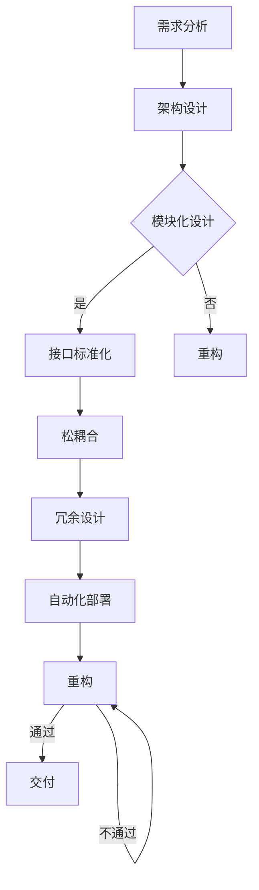

                 

# 软件2.0的可扩展性设计

> **关键词：** 软件架构、可扩展性、设计模式、微服务、云计算、分布式系统。

> **摘要：** 本文将深入探讨软件2.0时代下可扩展性设计的重要性，以及如何通过不同的设计模式和架构策略来实现软件系统的可扩展性。我们将从核心概念出发，逐步分析设计原则、实现方法以及实际案例，帮助读者更好地理解和应用可扩展性设计，以应对日益复杂的软件需求。

## 1. 背景介绍

在当今快速发展的数字时代，软件系统的规模和复杂性不断增加，用户需求也在不断演变。为了满足这些需求，软件开发者必须确保系统能够灵活地扩展和适应未来的变化。可扩展性设计成为了软件工程中至关重要的一个方面。

### 1.1 可扩展性的重要性

可扩展性设计旨在确保软件系统能够轻松地应对用户量的增加、数据量的增长以及功能的扩展。以下是可扩展性设计的几个关键点：

- **弹性（Elasticity）：** 系统可以根据需求自动扩展和缩小资源。
- **可伸缩性（Scalability）：** 系统在性能和容量上的增长能力。
- **高可用性（High Availability）：** 系统在出现故障时能够快速恢复。

### 1.2 软件2.0的概念

软件2.0是相对于传统软件1.0的一个概念，它强调软件作为服务（Software as a Service，SaaS）以及云计算、分布式系统和微服务架构的应用。软件2.0时代的软件系统通常需要具备更高的可扩展性和灵活性，以满足动态变化的业务需求。

## 2. 核心概念与联系

### 2.1 可扩展性设计原则

可扩展性设计原则是构建可扩展软件系统的基石。以下是一些关键原则：

- **模块化（Modularity）：** 将系统划分为独立的模块，便于独立开发和扩展。
- **松耦合（Loosely Coupled）：** 各模块之间通过标准化的接口进行通信，降低模块之间的依赖。
- **冗余（Redundancy）：** 通过冗余设计提高系统的可靠性和容错能力。
- **自动化（Automation）：** 利用自动化工具和流程简化扩展和部署过程。

### 2.2 Mermaid 流程图

以下是一个简化的Mermaid流程图，展示了可扩展性设计的基本流程：



### 2.3 可扩展性设计模式

常见的可扩展性设计模式包括：

- **微服务架构（Microservices Architecture）：** 将大型单体应用拆分为小型、自治的服务。
- **分布式系统（Distributed Systems）：** 通过分布式架构实现系统的扩展和高可用性。
- **云计算（Cloud Computing）：** 利用云计算资源实现弹性扩展。

## 3. 核心算法原理 & 具体操作步骤

### 3.1 微服务架构

微服务架构是将应用程序划分为一组小型、自治的服务，每个服务都有自己的数据存储和业务逻辑。以下是微服务架构的具体操作步骤：

1. **需求分析：** 确定业务需求并识别独立的业务功能。
2. **服务拆分：** 将应用程序拆分为多个微服务。
3. **服务接口设计：** 设计服务之间的接口，使用RESTful API或其他通信协议。
4. **服务部署：** 将每个微服务部署到独立的容器或虚拟机中。
5. **服务监控：** 监控服务性能和健康状况，确保系统稳定性。

### 3.2 分布式系统

分布式系统是通过在网络中分布多个节点来实现应用的扩展和高可用性。以下是分布式系统的具体操作步骤：

1. **需求分析：** 确定系统规模和性能需求。
2. **节点部署：** 在网络中部署多个节点，分配不同的任务和负载。
3. **数据一致性：** 确保分布式系统中数据的一致性。
4. **故障转移：** 实现节点故障时的自动切换和恢复。
5. **负载均衡：** 利用负载均衡器均衡节点间的负载。

### 3.3 云计算

云计算是利用云计算平台（如AWS、Azure、Google Cloud等）提供的资源来实现软件系统的弹性扩展。以下是云计算的具体操作步骤：

1. **需求分析：** 确定系统的扩展需求和资源消耗。
2. **选择云平台：** 根据需求和预算选择合适的云平台。
3. **部署应用：** 将应用部署到云平台上的虚拟机或容器中。
4. **配置自动扩展：** 设置自动扩展策略，根据负载自动增加或减少资源。
5. **监控和优化：** 监控系统性能，优化资源配置。

## 4. 数学模型和公式 & 详细讲解 & 举例说明

### 4.1 扩展性数学模型

扩展性通常可以通过以下数学模型来衡量：

\[ E = k \cdot P \]

其中，\( E \) 是扩展性，\( k \) 是常数，\( P \) 是系统性能。

### 4.2 详细讲解

- \( E \)（扩展性）：表示系统在资源增加时的性能提升。
- \( k \)（常数）：取决于系统的设计和架构，用于调整扩展性。
- \( P \)（性能）：系统的处理能力或吞吐量。

### 4.3 举例说明

假设一个系统在增加两倍资源时，性能提升了三倍。那么，扩展性系数 \( k \) 可以计算为：

\[ k = \frac{E}{P} = \frac{3}{2} = 1.5 \]

这意味着系统的扩展性系数为1.5，即每增加一倍资源，系统性能提升1.5倍。

## 5. 项目实践：代码实例和详细解释说明

### 5.1 开发环境搭建

为了演示微服务架构的可扩展性设计，我们将使用Docker和Kubernetes来搭建一个简单的电商系统。

1. **安装Docker：** 在所有节点上安装Docker。
2. **编写Dockerfile：** 编写用于构建服务镜像的Dockerfile。
3. **构建镜像：** 使用Dockerfile构建服务镜像。
4. **部署Kubernetes集群：** 部署Kubernetes集群。

### 5.2 源代码详细实现

我们将使用以下服务构建电商系统：

- **商品服务（Product Service）：** 负责管理商品信息。
- **订单服务（Order Service）：** 负责处理订单逻辑。
- **库存服务（Inventory Service）：** 负责管理库存信息。

### 5.3 代码解读与分析

在商品服务中，我们使用RESTful API接收和处理商品信息的增删改查操作。以下是商品服务的部分代码：

```go
// 商品服务的RESTful API接口
func (s *ProductService) GetProductByID(id string) (*models.Product, error) {
    product, err := s.repo.GetProductByID(id)
    if err != nil {
        return nil, err
    }
    return product, nil
}

// 商品服务的业务逻辑
func (s *ProductService) CreateProduct(product *models.Product) error {
    return s.repo.CreateProduct(product)
}

// 商品服务的错误处理
func (s *ProductService) handleError(err error) {
    log.Printf("Error occurred: %v", err)
    http.Error(w, "Internal Server Error", http.StatusInternalServerError)
}
```

### 5.4 运行结果展示

在Kubernetes集群中部署商品服务后，我们可以通过以下命令访问服务：

```bash
kubectl get pods
kubectl exec -it <商品服务Pod名称> -- /bin/bash
```

然后，我们可以使用curl命令模拟API请求：

```bash
curl -X GET "http://localhost:8080/products/1" -H "Content-Type: application/json"
```

返回的结果将是商品服务中ID为1的商品详细信息。

## 6. 实际应用场景

可扩展性设计在以下实际应用场景中尤为重要：

- **电子商务平台：** 需要处理大量用户和交易，确保系统在高并发情况下依然稳定运行。
- **社交媒体平台：** 需要支持海量用户和内容的快速访问和发布。
- **金融交易系统：** 需要保证交易数据的安全性和一致性，同时支持高并发交易处理。

## 7. 工具和资源推荐

### 7.1 学习资源推荐

- **《微服务设计》**（"Microservices Design Patterns"）by Sam Newman
- **《分布式系统原理与范型》**（"Designing Data-Intensive Applications"）by Martin Kleppmann
- **《云原生应用架构》**（"Cloud Native Applications"）by Kief Morris

### 7.2 开发工具框架推荐

- **Kubernetes：** 用于部署和管理微服务和分布式系统。
- **Docker：** 用于构建和部署容器化应用。
- **Elastic Stack：** 用于实时分析大规模数据。

### 7.3 相关论文著作推荐

- **《微服务架构设计》**（"Microservices: A Comprehensive Approach"）by Roland Kuhn, et al.
- **《分布式系统的设计》**（"Distributed Systems: Concepts and Design"）by George Coulouris, et al.

## 8. 总结：未来发展趋势与挑战

随着软件系统的规模和复杂性的不断增加，可扩展性设计将继续成为软件开发中的重要议题。未来的发展趋势包括：

- **云原生技术的普及：** 利用云原生技术实现更高效的资源利用和部署。
- **服务网格（Service Mesh）的兴起：** 用于简化分布式系统的服务管理和通信。
- **自动扩展和智能优化：** 利用机器学习算法实现自动化扩展和性能优化。

然而，可扩展性设计也面临着以下挑战：

- **复杂性管理：** 随着系统的扩展，复杂性也会增加，需要有效的方法来管理。
- **数据一致性：** 在分布式系统中保持数据的一致性是一个挑战。
- **性能优化：** 在扩展过程中，需要持续优化系统性能，以确保高效的运行。

## 9. 附录：常见问题与解答

### 9.1 什么是可扩展性设计？

可扩展性设计是指通过模块化、松耦合、冗余设计和自动化等原则，构建能够灵活应对资源变化和功能扩展的软件系统。

### 9.2 什么是微服务架构？

微服务架构是将大型单体应用拆分为小型、自治的服务，每个服务都有自己的数据存储和业务逻辑。这种架构使得系统更容易扩展和维护。

### 9.3 什么是分布式系统？

分布式系统是通过在网络中分布多个节点来实现应用的扩展和高可用性。分布式系统中的节点可以独立部署、管理和扩展。

## 10. 扩展阅读 & 参考资料

- **《软件架构：实践者的研究与经验》**（"Software Architecture: Perspectives in Practice"）by Michael keeling
- **《云计算基础教程》**（"Fundamentals of Cloud Computing"）by Thomas A. Pendarvis
- **《Kubernetes实战：从入门到自动化部署》**（"Kubernetes Up & Running"）by Kelsey Hightower

---

作者：禅与计算机程序设计艺术 / Zen and the Art of Computer Programming

