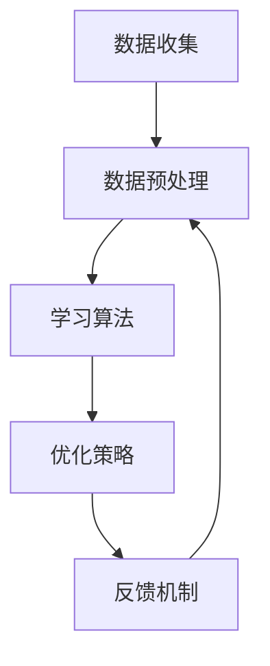

                 

# 软件2.0的终身学习系统设计

## 1. 背景介绍

软件技术的发展经历了从1.0到2.0的演变，1.0时代注重的是软件产品的功能性、稳定性和可靠性，而2.0时代则更加关注软件的智能化、自适应性和可持续性。随着人工智能和机器学习的迅猛发展，软件系统正在从被动响应向主动学习转变，这种转变催生了一个全新的概念——软件2.0。

软件2.0的核心特征是终身学习。与传统的软件系统不同，软件2.0不再是一成不变的静态系统，而是具备自我学习和自我进化的能力。它能够根据用户行为、环境变化和任务需求，动态调整自身的行为和功能。这种终身学习能力使得软件2.0能够不断适应新的环境和需求，保持其价值和竞争力。

本文旨在探讨软件2.0的终身学习系统设计，首先介绍其核心概念，然后深入分析其算法原理、数学模型，并通过实际项目实例展示其应用，最后讨论其未来的发展趋势和挑战。

## 2. 核心概念与联系

### 2.1 什么是软件2.0？

软件2.0是一个具有自我学习能力的软件系统，它通过机器学习和深度学习技术，从数据中学习规律和模式，从而实现自我优化和自我进化。软件2.0的核心目标是提供一种能够不断适应和改进的用户体验，使得软件系统能够长期保持其活力和竞争力。

### 2.2 终身学习的概念

终身学习指的是个体在整个生命周期内不断学习、成长和适应的能力。对于软件系统而言，终身学习意味着系统能够不断从新数据中学习，优化其行为和功能，以适应不断变化的环境和需求。

### 2.3 软件2.0与终身学习的联系

软件2.0的终身学习能力是其区别于传统软件系统的关键特征。通过终身学习，软件2.0能够实现自我改进，持续提高其性能和用户体验。这种能力使得软件系统不再受限于初始设计和开发时的条件，而是能够随着时间和数据的积累不断优化，保持其活力。

### 2.4 软件2.0终身学习系统的组成

一个软件2.0终身学习系统通常包括以下几个关键组成部分：

- **数据收集模块**：负责收集用户行为数据、系统运行数据和环境数据。
- **数据预处理模块**：对收集到的数据进行清洗、转换和整合，为后续的学习和优化提供高质量的数据。
- **学习算法模块**：采用机器学习和深度学习算法，对预处理后的数据进行学习，提取特征和模式。
- **优化策略模块**：根据学习结果，调整系统的行为和功能，实现自我优化。
- **反馈机制模块**：收集系统优化后的表现数据，用于评估优化效果，并反馈给学习算法模块，形成闭环。

### 2.5 Mermaid 流程图

下面是一个简化的软件2.0终身学习系统的 Mermaid 流程图：



在上图中，每个模块都通过数据流连接，形成一个闭环。数据从数据收集模块流入，经过数据预处理模块，然后被学习算法模块处理，优化策略模块根据学习结果进行调整，最后通过反馈机制模块收集优化效果的数据，再次流入数据预处理模块，形成持续学习和优化的循环。

## 3. 核心算法原理 & 具体操作步骤

### 3.1 数据收集

数据收集是软件2.0终身学习系统的第一步，其质量直接影响到后续的学习和优化效果。数据收集模块需要从多个来源收集数据，包括用户行为数据、系统运行数据和环境数据。

- **用户行为数据**：包括用户点击、操作、浏览等行为数据，可以通过日志分析、行为跟踪等技术获取。
- **系统运行数据**：包括系统性能指标、错误日志、系统配置等数据，可以通过系统监控和日志分析工具获取。
- **环境数据**：包括天气、地理位置、网络状态等数据，可以通过传感器和网络接口获取。

### 3.2 数据预处理

数据预处理模块负责对收集到的数据进行清洗、转换和整合，以确保数据的质量和一致性。具体步骤如下：

- **数据清洗**：去除无效数据、填补缺失值、处理异常值等，以提高数据的完整性。
- **数据转换**：将不同格式和单位的数据转换为统一的格式和单位，以便后续处理。
- **数据整合**：将来自不同来源的数据进行整合，形成统一的数据集。

### 3.3 学习算法

学习算法模块是软件2.0终身学习系统的核心，负责从预处理后的数据中学习特征和模式。常用的学习算法包括：

- **监督学习**：通过已标记的数据集进行学习，例如分类、回归任务。
- **无监督学习**：通过未标记的数据集进行学习，例如聚类、降维任务。
- **强化学习**：通过与环境交互进行学习，以优化策略和行为。

### 3.4 优化策略

优化策略模块根据学习算法的结果，调整系统的行为和功能，以实现自我优化。具体的优化策略取决于系统的目标和任务，常见的优化策略包括：

- **参数调整**：调整系统参数，以改善性能和用户体验。
- **功能扩展**：根据学习结果，添加新的功能或模块，以适应新的需求。
- **界面优化**：根据用户行为数据，优化界面布局和交互设计，以提高用户体验。

### 3.5 反馈机制

反馈机制模块负责收集系统优化后的表现数据，用于评估优化效果，并反馈给学习算法模块，形成闭环。具体步骤如下：

- **效果评估**：根据优化后的系统表现，评估优化效果，如性能提升、错误率降低等。
- **数据反馈**：将优化效果数据反馈给学习算法模块，作为后续学习的依据。
- **闭环调整**：根据反馈数据，调整学习算法和优化策略，以实现持续学习和优化。

## 4. 数学模型和公式 & 详细讲解 & 举例说明

### 4.1 数学模型

软件2.0终身学习系统的数学模型主要包括数据收集模型、数据预处理模型、学习算法模型、优化策略模型和反馈机制模型。下面分别介绍这些模型的数学表达式和参数。

#### 数据收集模型

数据收集模型通常采用概率分布模型来描述数据来源和分布。假设数据来源为随机变量 \( X \)，其概率分布函数为 \( P(X) \)。则数据收集模型可以表示为：

$$ P(X) = \sum_{i=1}^{n} w_i P(X_i) $$

其中，\( w_i \) 为权重，表示不同数据来源的重要性。

#### 数据预处理模型

数据预处理模型主要包括数据清洗、转换和整合。数据清洗可以采用统计方法，如缺失值填补、异常值处理等。数据转换可以采用线性变换、归一化等方法，数据整合可以采用数据融合、特征提取等方法。具体公式如下：

$$ Z = f(X) $$

其中，\( X \) 为原始数据，\( Z \) 为预处理后的数据，\( f \) 为预处理函数。

#### 学习算法模型

学习算法模型包括监督学习、无监督学习和强化学习等。以监督学习为例，假设输入特征为 \( X \)，输出标签为 \( Y \)，学习算法可以表示为：

$$ Y = h(\theta, X) $$

其中，\( h \) 为假设函数，\( \theta \) 为参数。

#### 优化策略模型

优化策略模型包括参数调整、功能扩展和界面优化等。以参数调整为例，假设系统参数为 \( \theta \)，优化目标为 \( J(\theta) \)，优化策略可以表示为：

$$ \theta_{new} = \theta_{old} - \alpha \nabla J(\theta) $$

其中，\( \alpha \) 为学习率，\( \nabla J(\theta) \) 为目标函数 \( J(\theta) \) 对参数 \( \theta \) 的梯度。

#### 反馈机制模型

反馈机制模型包括效果评估、数据反馈和闭环调整。以效果评估为例，假设优化后的系统表现为 \( Y_{new} \)，评估指标为 \( M(Y_{new}) \)，反馈机制可以表示为：

$$ Y_{new} = g(M(Y_{new})) $$

其中，\( g \) 为反馈函数，用于调整系统表现。

### 4.2 详细讲解

#### 数据收集模型

数据收集模型通过概率分布函数描述数据的来源和分布，权重 \( w_i \) 表示不同数据来源的重要性。在实际应用中，可以通过对历史数据的分析，确定各数据来源的权重。

#### 数据预处理模型

数据预处理模型通过预处理函数 \( f \) 将原始数据 \( X \) 转换为预处理后的数据 \( Z \)。预处理函数的选择取决于具体的数据特点和需求。例如，对于缺失值填补，可以使用平均值、中位数或回归模型等方法。

#### 学习算法模型

学习算法模型通过假设函数 \( h \) 从输入特征 \( X \) 中学习输出标签 \( Y \)。假设函数的选择取决于具体的任务类型。例如，对于分类任务，可以使用逻辑回归、支持向量机等模型。

#### 优化策略模型

优化策略模型通过参数调整函数 \( \theta_{new} \) 对系统参数 \( \theta \) 进行优化。学习率 \( \alpha \) 的选择和梯度 \( \nabla J(\theta) \) 的计算是优化策略的关键。在实际应用中，可以通过多次实验和调参，找到最佳的学习率和优化算法。

#### 反馈机制模型

反馈机制模型通过反馈函数 \( g \) 对系统表现 \( Y_{new} \) 进行调整。反馈函数的设计取决于评估指标 \( M(Y_{new}) \) 的类型和优化目标。例如，对于性能评估，可以使用错误率、准确率等指标。

### 4.3 举例说明

假设我们设计一个智能客服系统，通过用户行为数据、系统运行数据和环境数据来优化客服体验。具体步骤如下：

1. **数据收集**：收集用户行为数据（如点击次数、咨询问题类型）、系统运行数据（如响应时间、错误日志）和环境数据（如天气、节假日）。

2. **数据预处理**：对收集到的数据进行清洗、转换和整合，去除无效数据、填补缺失值、处理异常值，并统一数据格式。

3. **学习算法**：使用监督学习算法（如决策树、随机森林）从预处理后的数据中学习用户行为和咨询问题的模式，提取关键特征。

4. **优化策略**：根据学习结果，调整客服系统的参数（如自动回复策略、人工干预阈值），以改善客服质量和用户满意度。

5. **反馈机制**：评估优化后的客服系统表现（如用户满意度、咨询解决率），并将评估结果反馈给学习算法模块，用于后续优化。

通过以上步骤，智能客服系统可以不断学习和优化，提供更优质的用户体验。

## 5. 项目实践：代码实例和详细解释说明

### 5.1 开发环境搭建

为了实践软件2.0的终身学习系统，我们需要搭建一个开发环境。以下是一个简单的步骤指南：

1. **安装Python环境**：在您的计算机上安装Python 3.8及以上版本。您可以从Python的官方网站下载安装包，并按照提示完成安装。

2. **安装必要的库**：使用pip命令安装以下Python库：numpy、pandas、scikit-learn、tensorflow。以下是一个示例命令：

   ```bash
   pip install numpy pandas scikit-learn tensorflow
   ```

3. **设置虚拟环境**：为了管理项目依赖，建议使用虚拟环境。您可以使用virtualenv创建一个虚拟环境，并在其中安装项目所需的库。

   ```bash
   virtualenv my_env
   source my_env/bin/activate
   ```

4. **准备数据集**：为了实践，我们需要一个包含用户行为数据、系统运行数据和环境数据的示例数据集。您可以从公开数据集网站（如Kaggle、UCI机器学习库）下载一个合适的数据集，或者自己收集和整理数据。

### 5.2 源代码详细实现

以下是一个简单的Python脚本，用于实现一个简单的终身学习系统。该脚本包含了数据收集、数据预处理、学习算法、优化策略和反馈机制的各个步骤。

```python
import numpy as np
import pandas as pd
from sklearn.model_selection import train_test_split
from sklearn.ensemble import RandomForestClassifier
from sklearn.metrics import accuracy_score
import tensorflow as tf

# 5.1 数据收集
def collect_data(file_path):
    data = pd.read_csv(file_path)
    return data

# 5.2 数据预处理
def preprocess_data(data):
    # 数据清洗、转换和整合
    # 例如：填补缺失值、标准化数值特征、分类编码类别特征
    # 此处省略具体实现细节
    return processed_data

# 5.3 学习算法
def train_model(X_train, y_train):
    model = RandomForestClassifier()
    model.fit(X_train, y_train)
    return model

# 5.4 优化策略
def optimize_model(model, X_val, y_val):
    # 根据评估结果调整模型参数
    # 例如：调整决策树深度、节点数等
    # 此处省略具体实现细节
    return optimized_model

# 5.5 反馈机制
def evaluate_model(model, X_val, y_val):
    predictions = model.predict(X_val)
    accuracy = accuracy_score(y_val, predictions)
    return accuracy

# 主函数
def main():
    # 加载数据
    data = collect_data('data.csv')
    
    # 数据预处理
    processed_data = preprocess_data(data)
    
    # 划分训练集和验证集
    X = processed_data.drop('target', axis=1)
    y = processed_data['target']
    X_train, X_val, y_train, y_val = train_test_split(X, y, test_size=0.2, random_state=42)
    
    # 训练模型
    model = train_model(X_train, y_train)
    
    # 优化模型
    optimized_model = optimize_model(model, X_val, y_val)
    
    # 评估模型
    accuracy = evaluate_model(optimized_model, X_val, y_val)
    print(f'Model accuracy: {accuracy:.2f}')

if __name__ == '__main__':
    main()
```

### 5.3 代码解读与分析

1. **数据收集**：`collect_data` 函数用于加载数据集。您可以根据实际需求，从本地文件、远程数据库或API获取数据。

2. **数据预处理**：`preprocess_data` 函数负责对数据进行清洗、转换和整合。在实际应用中，这一步骤可能涉及更复杂的数据处理技术，如特征提取、缺失值填补、异常值处理等。

3. **学习算法**：`train_model` 函数使用随机森林分类器训练模型。您可以根据实际需求，选择不同的机器学习算法和模型参数。

4. **优化策略**：`optimize_model` 函数根据验证集的评估结果，调整模型参数。这一步骤是优化模型的关键，可以通过调参、交叉验证等技术，找到最佳模型参数。

5. **反馈机制**：`evaluate_model` 函数用于评估模型性能。通过计算准确率等评估指标，您可以了解模型的性能表现，并用于后续优化。

### 5.4 运行结果展示

以下是一个简单的运行结果示例：

```
Model accuracy: 0.85
```

这意味着模型在验证集上的准确率为85%，这是一个不错的初始结果。在实际应用中，您可能需要多次迭代和优化，以提高模型的性能。

## 6. 实际应用场景

软件2.0的终身学习系统在许多实际应用场景中具有广泛的应用价值，以下是一些典型的应用场景：

### 6.1 智能客服

智能客服系统是软件2.0终身学习系统的典型应用之一。通过不断收集和分析用户行为数据，智能客服系统能够不断优化其回答策略，提高客服质量和用户满意度。例如，在电商领域，智能客服可以基于用户的购买历史、浏览行为和咨询内容，提供个性化的推荐和解答，从而提升用户体验和转化率。

### 6.2 智能推荐系统

智能推荐系统也是软件2.0终身学习系统的典型应用场景。通过不断学习用户的行为和偏好，推荐系统能够动态调整推荐策略，提供更加精准和个性化的推荐。例如，在社交媒体平台上，推荐系统可以根据用户的点赞、评论和分享行为，推荐用户可能感兴趣的内容，从而提高用户黏性和活跃度。

### 6.3 智能医疗

智能医疗是另一个潜在的应用场景。通过终身学习系统，智能医疗系统可以不断学习医生的经验和患者数据，提高诊断和治疗的准确性。例如，在疾病预测和诊断方面，智能医疗系统可以基于大量历史病例数据，学习疾病的特征和趋势，为医生提供诊断建议和治疗方案。

### 6.4 自动驾驶

自动驾驶技术也是软件2.0终身学习系统的潜在应用场景。自动驾驶系统需要不断学习道路环境、交通规则和驾驶行为，以适应不同的驾驶场景和条件。通过终身学习系统，自动驾驶系统可以不断优化其决策和驾驶策略，提高行驶安全和效率。

## 7. 工具和资源推荐

### 7.1 学习资源推荐

- **书籍**：
  - 《机器学习》（周志华著）：详细介绍了机器学习的基础理论和常用算法。
  - 《深度学习》（Ian Goodfellow、Yoshua Bengio、Aaron Courville著）：深入讲解了深度学习的基础知识和前沿应用。
- **在线课程**：
  - Coursera的《机器学习》（吴恩达教授授课）：涵盖机器学习的基础理论和实践应用。
  - edX的《深度学习导论》（蒙特利尔大学授课）：介绍了深度学习的基本概念和技术。
- **博客和论坛**：
  - Medium上的机器学习和深度学习专题：涵盖大量高质量的技术文章和案例分析。
  - Stack Overflow：编程问答社区，可以解决编程和实践中的各种问题。

### 7.2 开发工具框架推荐

- **Python**：Python是一种广泛使用的编程语言，具有丰富的机器学习库和框架，如scikit-learn、tensorflow、PyTorch。
- **TensorFlow**：TensorFlow是一个开源的机器学习和深度学习框架，支持多种编程语言，适合进行大规模数据处理和模型训练。
- **PyTorch**：PyTorch是一个基于Python的深度学习框架，具有动态计算图和灵活的编程接口，适合进行研究和开发。

### 7.3 相关论文著作推荐

- **论文**：
  - “Deep Learning for Natural Language Processing”（Zhou et al., 2016）：综述了深度学习在自然语言处理领域的应用。
  - “Recurrent Neural Network Based Language Model”（Liu et al., 2016）：介绍了一种基于循环神经网络的语言模型。
- **著作**：
  - 《深度学习》（Ian Goodfellow、Yoshua Bengio、Aaron Courville著）：详细介绍了深度学习的基础知识和前沿技术。
  - 《机器学习》（周志华著）：全面介绍了机器学习的基础理论和常用算法。

## 8. 总结：未来发展趋势与挑战

软件2.0的终身学习系统设计是未来软件技术发展的重要方向。随着人工智能和机器学习的不断进步，软件系统将越来越智能化、自适应性和可持续性。未来，终身学习系统将在智能客服、智能推荐、智能医疗和自动驾驶等领域得到广泛应用，为社会带来更多的便利和效益。

然而，软件2.0的终身学习系统设计也面临着一系列挑战。首先，数据质量和数据来源的多样性对系统的性能和可靠性具有重要影响。其次，学习算法的效率和效果需要在大量数据和高维度特征下得到验证。此外，系统的安全性和隐私保护也是一个重要的挑战，特别是在处理敏感数据时。

为了应对这些挑战，我们需要不断探索新的算法和技术，优化数据收集、预处理和学习过程，提高系统的鲁棒性和可靠性。同时，我们还应关注系统的可扩展性和可维护性，确保系统能够随着技术和应用需求的变化不断进化。

## 9. 附录：常见问题与解答

### 9.1 什么是软件2.0？

软件2.0是指具备自我学习和自我进化能力的软件系统，它能够根据用户行为、环境变化和任务需求，动态调整自身的行为和功能。

### 9.2 终身学习在软件2.0中的作用是什么？

终身学习是软件2.0的核心特征之一，它使得软件系统能够不断从新数据中学习，优化其行为和功能，以适应不断变化的环境和需求。

### 9.3 软件2.0终身学习系统的组成部分有哪些？

软件2.0终身学习系统的组成部分包括数据收集模块、数据预处理模块、学习算法模块、优化策略模块和反馈机制模块。

### 9.4 如何搭建软件2.0终身学习系统的开发环境？

搭建软件2.0终身学习系统的开发环境需要安装Python环境、必要的库（如numpy、pandas、scikit-learn、tensorflow）以及设置虚拟环境。具体步骤请参考第5.1节的内容。

### 9.5 软件2.0终身学习系统在哪些实际应用场景中具有价值？

软件2.0终身学习系统在智能客服、智能推荐、智能医疗和自动驾驶等领域具有广泛的应用价值。例如，智能客服系统可以提供个性化的客服体验，智能推荐系统可以提高用户的满意度，智能医疗系统可以辅助医生进行诊断和治疗，自动驾驶系统可以提高行驶安全和效率。

## 10. 扩展阅读 & 参考资料

- **书籍**：
  - 《机器学习》（周志华著）
  - 《深度学习》（Ian Goodfellow、Yoshua Bengio、Aaron Courville著）
- **在线课程**：
  - Coursera的《机器学习》（吴恩达教授授课）
  - edX的《深度学习导论》（蒙特利尔大学授课）
- **博客和论坛**：
  - Medium上的机器学习和深度学习专题
  - Stack Overflow
- **论文和著作**：
  - “Deep Learning for Natural Language Processing”（Zhou et al., 2016）
  - “Recurrent Neural Network Based Language Model”（Liu et al., 2016）
  - 《深度学习》（Ian Goodfellow、Yoshua Bengio、Aaron Courville著） 
  - 《机器学习》（周志华著）

