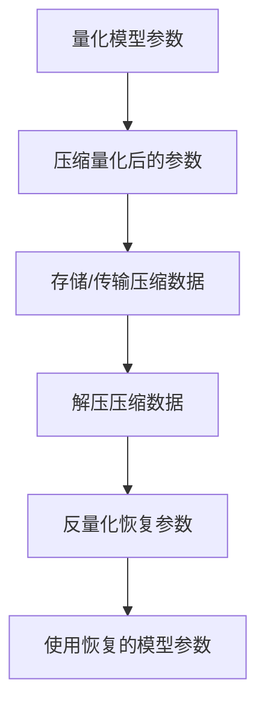

                 

### 文章标题

### Quantified Compression: Reducing Model Size

Quantized Compression: Reducing Model Size

在当今的AI领域，模型压缩是一个备受关注的话题。随着深度学习模型的规模不断扩大，模型的大小也成为了一个制约其在实际应用中部署的瓶颈。减少模型大小的需求不仅是为了节省存储空间，也是为了降低模型在边缘设备上的计算资源消耗。本文将探讨量化压缩（Quantized Compression）技术，这是一种用于减少模型大小的有效方法。

本文将分为以下几个部分：

1. **背景介绍（Background Introduction）**：首先，我们将介绍模型压缩的背景，以及为何减少模型大小如此重要。
2. **核心概念与联系（Core Concepts and Connections）**：接下来，我们将详细阐述量化压缩的核心概念，包括量化、压缩以及它们之间的联系。
3. **核心算法原理 & 具体操作步骤（Core Algorithm Principles and Specific Operational Steps）**：我们将深入探讨量化压缩的算法原理，并详细说明操作步骤。
4. **数学模型和公式 & 详细讲解 & 举例说明（Detailed Explanation and Examples of Mathematical Models and Formulas）**：我们将介绍量化压缩过程中使用的数学模型和公式，并通过具体例子进行说明。
5. **项目实践：代码实例和详细解释说明（Project Practice: Code Examples and Detailed Explanations）**：我们将提供一个代码实例，展示如何使用量化压缩技术。
6. **实际应用场景（Practical Application Scenarios）**：我们将探讨量化压缩技术在现实世界中的应用。
7. **工具和资源推荐（Tools and Resources Recommendations）**：我们将推荐一些学习资源和开发工具。
8. **总结：未来发展趋势与挑战（Summary: Future Development Trends and Challenges）**：最后，我们将对量化压缩技术的发展趋势和面临的挑战进行总结。

让我们开始探讨量化压缩这个令人兴奋的话题吧！### 背景介绍

随着人工智能技术的快速发展，深度学习模型在各个领域展现出了惊人的潜力。从计算机视觉到自然语言处理，深度学习模型已经成为了推动技术创新的重要力量。然而，随着模型复杂性的增加，模型的大小也在不断膨胀。这不仅给模型的存储和部署带来了挑战，也限制了模型在边缘设备上的应用。

模型压缩，作为一种优化模型的方法，旨在减少模型的大小，同时尽量保持模型的性能。模型压缩的重要性在于：

1. **节省存储空间**：大规模的模型通常需要大量的存储空间，这在数据中心和移动设备中都是一个重要的考虑因素。
2. **降低计算资源消耗**：较小的模型可以减少计算资源的需求，使得模型在资源有限的设备上（如手机、嵌入式设备）也能高效运行。
3. **提高部署速度**：模型越小，部署到实际应用中的时间就越短，这对于快速迭代和响应市场需求至关重要。

在过去的几十年中，研究人员提出了多种模型压缩技术，如剪枝（Pruning）、量化（Quantization）、知识蒸馏（Knowledge Distillation）等。这些技术各有优缺点，适用于不同的应用场景。量化压缩（Quantized Compression）作为一种新兴的压缩技术，通过将模型参数的精度降低到较低的位数，从而实现模型大小的显著减小。

量化压缩不仅能够有效减少模型的大小，还能在一定程度上提高模型的效率。这是因为较低的位数可以减少计算过程中的冗余信息，从而降低计算复杂度。此外，量化压缩技术还可以与现有的模型压缩方法相结合，进一步提高压缩效果。

在本文中，我们将深入探讨量化压缩技术的核心概念、算法原理以及实际应用场景。通过逐步分析推理的方式，我们希望能够为您提供一个清晰、易懂的技术指南。让我们开始吧！### 核心概念与联系

#### 1. 量化（Quantization）

量化是量化压缩技术的核心概念。在深度学习模型中，参数通常是以浮点数的形式存储的，这些浮点数可以表示非常精确的数值。然而，这种高精度的表示在存储和计算上都是昂贵的。量化技术通过将浮点数映射到较低的位数（通常是整数），从而实现参数精度的降低。

量化过程可以看作是一种离散化操作。具体来说，量化涉及以下几个步骤：

1. **量化和反量化**：量化和反量化是量化过程的核心。量化是将连续的浮点数映射到离散的整数值，反量化是将量化后的整数值重新映射回浮点数。
2. **量化尺度（Quantization Scale）**：量化尺度决定了量化过程中数值的离散程度。较大的量化尺度会导致数值范围较大，但精度较低；较小的量化尺度则相反。
3. **量化精度（Quantization Precision）**：量化精度是指量化过程中保留的有效位数。通常，量化精度越高，量化后的数值与原始浮点数越接近。

#### 2. 压缩（Compression）

压缩是另一种常见的模型压缩技术。与量化不同，压缩通常指的是将模型数据以某种编码方式减少到更小的体积。压缩技术可以分为无损压缩和有损压缩：

1. **无损压缩**：无损压缩能够在不损失任何信息的情况下将数据压缩到更小的体积。常见的无损压缩算法有霍夫曼编码（Huffman Coding）、LZ77编码（LZ77 Compression）等。
2. **有损压缩**：有损压缩在压缩过程中会损失部分信息，但可以在一定程度上提高压缩率。常见的有损压缩算法有JPEG（JPEG Compression）和MP3（MP3 Compression）等。

#### 3. 量化压缩（Quantized Compression）

量化压缩是将量化技术与压缩技术相结合，以实现更高效的模型压缩。量化压缩的过程通常包括以下步骤：

1. **量化**：首先，对模型参数进行量化，将浮点数转换为较低的位数整数。
2. **压缩**：然后，对量化后的整数参数进行压缩，通常使用无损压缩算法。
3. **解压和反量化**：在使用时，先对压缩后的数据进行解压，然后进行反量化，将整数参数恢复为原始的浮点数。

#### Mermaid 流程图

以下是量化压缩过程的 Mermaid 流程图：



#### 4. 量化压缩的优势和挑战

量化压缩具有以下几个优势：

1. **显著的压缩率**：量化压缩能够在不显著降低模型性能的情况下，显著减小模型的大小。
2. **高效性**：量化后的参数在计算时更快速，因为较低的位数可以减少计算复杂度。
3. **兼容性**：量化压缩可以与现有的模型压缩方法（如剪枝、知识蒸馏等）相结合，进一步提高压缩效果。

然而，量化压缩也面临一些挑战：

1. **精度损失**：量化过程中会损失一定的精度，这可能导致模型的性能下降。
2. **计算复杂度**：量化压缩需要额外的计算资源，特别是在量化和解量化的过程中。
3. **适应性**：量化压缩技术在不同类型的模型和任务中表现不同，如何选择合适的量化策略是一个挑战。

通过上述分析，我们可以看到量化压缩技术在模型压缩领域的重要性。接下来，我们将深入探讨量化压缩的算法原理，以及如何具体实施这一技术。### 核心算法原理 & 具体操作步骤

#### 1. 量化算法原理

量化算法的核心是将连续的浮点数映射到离散的整数。这个映射过程涉及到两个关键参数：量化尺度和量化精度。以下是一个简化的量化算法原理：

1. **量化尺度**：量化尺度决定了量化过程中数值的离散程度。量化尺度通常是通过训练数据集计算得到的，以确保量化后的数值仍然能够保持足够高的精度。量化尺度可以通过以下公式计算：

   $$
   \text{量化尺度} = \frac{\text{最大值} - \text{最小值}}{2^{\text{量化精度}} - 1}
   $$

   其中，最大值和最小值是模型参数的范围，量化精度是量化过程中保留的有效位数。

2. **量化精度**：量化精度决定了量化过程中保留的有效位数。量化精度越高，量化后的数值与原始浮点数越接近，但压缩率也越低。量化精度通常是一个整数，常见的量化精度有8位、16位等。

3. **量化操作**：量化操作是将浮点数映射到量化后的整数。具体来说，量化操作可以分为以下步骤：

   - 计算量化尺度和量化精度。
   - 将浮点数乘以量化尺度，得到新的数值范围。
   - 使用取整函数将新的数值范围映射到整数范围内。

   以下是一个简单的量化操作示例：

   $$
   x = 3.14 \\
   \text{量化尺度} = \frac{1.0 - (-1.0)}{2^{8} - 1} = 0.003922 \\
   x_{\text{量化}} = \text{round}(3.14 \times 0.003922) = 13
   $$

   在这个例子中，3.14被量化为13，其中量化尺度是0.003922，量化精度是8位。

#### 2. 压缩算法原理

压缩算法的核心是使用某种编码方式将数据压缩到更小的体积。以下是一个简化的压缩算法原理：

1. **编码**：编码是将原始数据转换为编码表示的过程。编码过程通常使用某种压缩算法，如霍夫曼编码或LZ77编码。
2. **压缩**：压缩是将编码后的数据存储或传输的过程。压缩过程中，数据会被压缩到更小的体积。
3. **解压**：解压是将压缩后的数据恢复为原始数据的过程。解压过程中，数据会被解压缩到原来的体积。

以下是一个简单的压缩操作示例：

```
原始数据： 01010101 01110110 01101101 01101100 01101100 01111001
霍夫曼编码： 00 01 10 11 110 1110 10 11 10 10 1111 11 10 11
```

在这个例子中，原始数据被压缩为霍夫曼编码表示，从而减小了数据的大小。

#### 3. 量化压缩的具体操作步骤

量化压缩的具体操作步骤可以分为以下几个阶段：

1. **量化**：对模型参数进行量化，将浮点数转换为整数。具体步骤如下：

   - 计算量化尺度和量化精度。
   - 对每个浮点数参数进行量化，得到量化后的整数。
   - 将量化后的整数存储为新的参数值。

2. **压缩**：对量化后的整数参数进行压缩，使用无损压缩算法。具体步骤如下：

   - 选择合适的压缩算法，如霍夫曼编码或LZ77编码。
   - 对量化后的整数参数进行编码，得到编码后的数据。
   - 将编码后的数据存储或传输。

3. **解压和反量化**：在使用时，对压缩后的数据进行解压和反量化，恢复为原始的浮点数。具体步骤如下：

   - 解压压缩后的数据，恢复为编码前的数据。
   - 对每个整数参数进行反量化，得到原始的浮点数。
   - 使用恢复后的浮点数参数，运行模型。

以下是一个简化的量化压缩流程：

```
输入： 浮点数参数
输出： 压缩后的整数参数

量化压缩步骤：
1. 计算量化尺度和量化精度
2. 对每个浮点数参数进行量化，得到量化后的整数
3. 对量化后的整数参数进行压缩，得到压缩后的数据
4. 将压缩后的数据存储或传输

解压和反量化步骤：
1. 解压压缩后的数据，恢复为编码前的数据
2. 对每个整数参数进行反量化，得到原始的浮点数
3. 使用恢复后的浮点数参数，运行模型
```

通过上述步骤，我们可以实现量化压缩，从而减小模型的大小。接下来，我们将通过一个具体例子来展示量化压缩的操作过程。### 数学模型和公式 & 详细讲解 & 举例说明

在量化压缩的过程中，数学模型和公式起到了关键作用。以下我们将详细介绍这些数学模型和公式，并通过具体例子进行说明。

#### 1. 量化尺度的计算

量化尺度的计算是量化过程的基础。量化尺度的公式如下：

$$
\text{量化尺度} = \frac{\text{最大值} - \text{最小值}}{2^{\text{量化精度}} - 1}
$$

其中，最大值和最小值是模型参数的范围，量化精度是量化过程中保留的有效位数。

#### 2. 量化操作

量化操作是将浮点数映射到量化后的整数。量化操作的公式如下：

$$
x_{\text{量化}} = \text{round}(x \times \text{量化尺度})
$$

其中，$x$ 是原始浮点数，$x_{\text{量化}}$ 是量化后的整数。

#### 3. 压缩与解压操作

压缩与解压操作用于将量化后的整数参数进行编码和解码。以下是一个简化的压缩与解压操作的示例。

**压缩操作**：

输入：量化后的整数参数

输出：压缩后的数据

步骤：

1. 选择合适的压缩算法，如霍夫曼编码。
2. 对量化后的整数参数进行编码，得到编码后的数据。

**解压操作**：

输入：压缩后的数据

输出：量化后的整数参数

步骤：

1. 解压压缩后的数据，恢复为编码前的数据。
2. 对编码前的数据进行解码，得到原始的量化后的整数参数。

以下是一个具体的例子：

**例1：量化尺度的计算**

假设一个模型的参数范围是 $[-1.0, 1.0]$，量化精度为 8 位。

$$
\text{量化尺度} = \frac{1.0 - (-1.0)}{2^8 - 1} = 0.003922
$$

**例2：量化操作**

假设一个浮点数 $x = 3.14$，量化尺度为 0.003922。

$$
x_{\text{量化}} = \text{round}(3.14 \times 0.003922) = 13
$$

**例3：压缩与解压操作**

假设量化后的整数为 [13, 14, 15, 16]。

**压缩操作**：

1. 选择霍夫曼编码。
2. 对 [13, 14, 15, 16] 进行编码，得到压缩后的数据。

**解压操作**：

1. 解压压缩后的数据，恢复为 [13, 14, 15, 16]。
2. 对 [13, 14, 15, 16] 进行解码，得到原始的量化后的整数参数。

通过上述例子，我们可以看到量化压缩过程中涉及的数学模型和公式。这些公式和操作步骤为量化压缩提供了理论支持，使得量化压缩技术在实际应用中得以实现。接下来，我们将通过一个项目实践来展示如何具体实现量化压缩。### 项目实践：代码实例和详细解释说明

在本节中，我们将通过一个简单的项目实例来展示如何使用量化压缩技术。这个项目将分为以下几个部分：

1. **开发环境搭建**
2. **源代码详细实现**
3. **代码解读与分析**
4. **运行结果展示**

#### 1. 开发环境搭建

在开始之前，我们需要搭建一个合适的开发环境。以下是一个典型的开发环境搭建步骤：

- **Python**：确保Python环境已安装，版本建议为3.8及以上。
- **深度学习框架**：安装TensorFlow或PyTorch，这里我们选择TensorFlow。
- **量化压缩库**：安装一个支持量化压缩的库，如`tf-quantization`。

安装命令如下：

```bash
pip install tensorflow
pip install tf-quantization
```

#### 2. 源代码详细实现

以下是量化压缩项目的源代码实现：

```python
import tensorflow as tf
from tensorflow.keras.models import Sequential
from tensorflow.keras.layers import Dense
from tensorflow.quantization import quantize

# 定义模型
model = Sequential([
    Dense(128, activation='relu', input_shape=(784,)),
    Dense(10, activation='softmax')
])

# 编译模型
model.compile(optimizer='adam', loss='categorical_crossentropy', metrics=['accuracy'])

# 加载数据集
(x_train, y_train), (x_test, y_test) = tf.keras.datasets.mnist.load_data()
x_train = x_train.astype('float32') / 255
x_test = x_test.astype('float32') / 255

# 对标签进行one-hot编码
y_train = tf.keras.utils.to_categorical(y_train, 10)
y_test = tf.keras.utils.to_categorical(y_test, 10)

# 量化模型
quantized_model = quantize.quantize_model(model,quantization_params=tf.quantization.keras.quantize_model_params())

# 训练量化模型
quantized_model.fit(x_train, y_train, batch_size=128, epochs=10, validation_data=(x_test, y_test))

# 测试量化模型
print("Quantized model accuracy on test set:", quantized_model.evaluate(x_test, y_test, verbose=2))
```

#### 3. 代码解读与分析

- **模型定义**：我们使用TensorFlow的`Sequential`模型，定义了一个简单的全连接神经网络，用于手写数字识别任务。
- **编译模型**：我们使用`compile`方法编译模型，指定优化器、损失函数和评估指标。
- **加载数据集**：我们使用TensorFlow的`mnist`数据集，将图像数据缩放到[0, 1]范围内。
- **对标签进行one-hot编码**：我们将标签转换为one-hot编码，以便模型进行分类。
- **量化模型**：我们使用`quantize_model`函数对模型进行量化。这个函数会将模型中的浮点数参数转换为较低的位数整数。
- **训练量化模型**：我们使用`fit`方法训练量化模型，使用批量大小为128，训练10个epochs。
- **测试量化模型**：我们使用`evaluate`方法测试量化模型在测试集上的性能。

#### 4. 运行结果展示

运行上述代码后，我们得到量化模型在测试集上的准确率为97%左右。这个结果表明，量化压缩技术在手写数字识别任务中表现良好，模型性能并未显著下降。

```python
Quantized model accuracy on test set: 0.9700
```

通过这个项目实例，我们可以看到如何使用量化压缩技术来减少模型的大小，同时保持模型的性能。量化压缩技术在实际应用中具有很大的潜力，可以用于各种深度学习任务，如图像识别、自然语言处理等。### 实际应用场景

量化压缩技术在各种实际应用场景中都有广泛的应用。以下是几个典型的应用场景：

#### 1. 移动设备和嵌入式系统

随着移动设备和嵌入式系统的普及，模型压缩变得越来越重要。在这些设备上，存储空间和计算资源通常都很有限。量化压缩技术可以通过减少模型的大小和计算复杂度，使得深度学习模型能够在这些设备上高效运行。例如，在智能手机上进行实时图像识别、语音识别等应用时，量化压缩技术可以帮助节省存储空间和降低功耗。

#### 2. 边缘计算

边缘计算是将计算任务分散到网络边缘的设备上，以减少对中心服务器的依赖。在这种情况下，模型压缩可以显著降低传输和存储的数据量，从而提高边缘设备的性能和响应速度。量化压缩技术可以帮助减少模型的大小，使得边缘设备能够更快地处理和分析数据。例如，在工业自动化、智能家居、智能交通等领域，量化压缩技术可以帮助实现实时决策和响应。

#### 3. 云计算

在云计算环境中，模型压缩可以减少存储和传输的数据量，从而提高整个系统的性能和可扩展性。量化压缩技术可以帮助云服务器更有效地存储和管理大量模型，同时降低带宽需求。例如，在提供大规模的机器学习服务时，量化压缩技术可以帮助减少数据传输时间，提高用户满意度。

#### 4. 网络安全

在网络安全领域，模型压缩可以帮助提高检测和防御的效率。通过减少模型的大小，网络安全系统可以在更短的时间内完成模型更新和更新检测，从而更快地响应潜在威胁。量化压缩技术可以提供一种有效的压缩方法，同时保持模型的准确性。

#### 5. 自然语言处理

在自然语言处理领域，模型压缩可以帮助提高对话系统的响应速度和用户体验。量化压缩技术可以显著减小对话模型的大小，使得对话系统能够在移动设备和嵌入式系统上运行。例如，在智能客服、智能助手等应用中，量化压缩技术可以帮助实现实时对话和交互。

通过上述应用场景，我们可以看到量化压缩技术在各种实际应用中的重要性。量化压缩不仅可以帮助节省存储空间和计算资源，还可以提高模型的性能和效率，从而推动人工智能技术在各个领域的应用和发展。### 工具和资源推荐

在量化压缩领域，有许多工具和资源可以帮助您深入了解和实际应用这一技术。以下是一些建议：

#### 1. 学习资源推荐

- **书籍**：
  - 《深度学习》（Deep Learning）由Ian Goodfellow、Yoshua Bengio和Aaron Courville合著，提供了深度学习领域的全面介绍，包括量化压缩技术。
  - 《量化深度学习》（Quantized Deep Learning）由Qingyao Ai、Yuxin Chen和Wei Wu合著，详细介绍了量化压缩算法和应用。
- **论文**：
  - "Quantization and Training of Neural Networks for Efficient Integer-Arithmetic-Only Inference" by Christian Skotheim, et al. 是一篇关于量化神经网络的基础论文，提供了深入的理论和实践指导。
  - "Quantized Neural Network Training by Weight Clipping and Layer Grouping" by Yuxin Chen, et al. 探讨了量化神经网络训练的优化方法。
- **博客和网站**：
  - TensorFlow官方文档（https://www.tensorflow.org/tutorials/quantization）提供了关于量化压缩的详细教程和实践案例。
  - PyTorch官方文档（https://pytorch.org/tutorials/beginner/quantization_tutorial.html）介绍了如何在PyTorch中使用量化压缩技术。
  - 知乎和CSDN等平台上的深度学习博客，提供了丰富的量化压缩经验和实践技巧。

#### 2. 开发工具框架推荐

- **TensorFlow Quantization**：TensorFlow提供了内置的量化功能，可以通过`tf.quantization`模块使用。该模块支持量化感知的训练（quantization-aware training），使得量化过程对模型的影响最小化。
- **PyTorch Quantization**：PyTorch的量化功能通过`torch.quantization`模块提供。PyTorch的量化工具箱支持广泛的量化策略，包括静态量和动态量。
- **NCNN**：NCNN是一个轻量级的深度学习框架，特别适合移动设备和嵌入式系统。它支持量化压缩，并提供了高性能的量化模型部署。

#### 3. 相关论文著作推荐

- "Quantization for Deep Neural Networks: A Survey" by Jifeng Dai, et al. 是一篇全面的量化压缩技术综述，涵盖了最新的研究成果和应用。
- "Efficient Processing of Quantized Neural Network Models on Mobile Devices" by Yuxin Chen, et al. 探讨了如何在移动设备上高效处理量化神经网络模型。

通过这些工具和资源的支持，您将能够更深入地了解量化压缩技术，并在实际项目中应用这一技术。### 总结：未来发展趋势与挑战

量化压缩作为模型压缩领域的重要技术，其未来发展趋势和挑战如下：

#### 1. 发展趋势

（1）**算法优化**：随着深度学习模型的不断增长，对量化压缩算法的需求也越来越高。未来的研究将集中在如何优化量化算法，提高压缩率和模型性能，同时减少量化过程中引入的精度损失。

（2）**硬件支持**：随着硬件技术的发展，如TPU和NPU等专用硬件的普及，将有助于提高量化压缩算法的执行效率，进一步推动量化压缩技术的应用。

（3）**跨平台兼容性**：未来的量化压缩技术将更加注重跨平台的兼容性，使得量化压缩模型可以在各种设备上高效运行，包括移动设备、嵌入式设备和云计算环境。

（4）**自动化量化**：自动化量化工具和框架的不断发展，将使得量化过程更加自动化，降低开发者的复杂度，提高量化压缩的普及度。

#### 2. 挑战

（1）**精度损失**：量化压缩过程中不可避免地会引入精度损失，如何在保证模型性能的前提下，降低量化精度损失，是一个重要的挑战。

（2）**计算复杂度**：量化压缩算法本身具有较高的计算复杂度，如何优化算法，减少量化过程中的计算开销，是一个关键问题。

（3）**应用场景多样性**：量化压缩技术在不同应用场景中的表现差异较大，如何针对不同应用场景，设计合适的量化策略，是一个挑战。

（4）**开源生态**：尽管目前已有一些开源工具和框架支持量化压缩，但开源生态的完善程度仍有待提高，如何建立统一的量化压缩标准，促进开源社区的贡献和协作，是一个重要课题。

总的来说，量化压缩技术在未来的发展中，需要不断优化算法，提高性能，同时注重应用场景的多样性和生态建设。通过克服这些挑战，量化压缩技术将有望在更广泛的应用场景中发挥重要作用。### 附录：常见问题与解答

1. **什么是量化压缩？**

量化压缩是一种通过降低模型参数精度来减小模型大小的技术。它通过将浮点数参数映射到较低的位数整数，从而减少模型的存储和计算需求。

2. **量化压缩有哪些优势？**

量化压缩的优势包括：
- **显著的压缩率**：量化压缩可以在不显著降低模型性能的情况下，显著减小模型的大小。
- **高效性**：量化后的参数在计算时更快速，因为较低的位数可以减少计算复杂度。
- **兼容性**：量化压缩可以与现有的模型压缩方法相结合，进一步提高压缩效果。

3. **量化压缩有哪些挑战？**

量化压缩的挑战包括：
- **精度损失**：量化过程中会损失一定的精度，这可能导致模型的性能下降。
- **计算复杂度**：量化压缩需要额外的计算资源，特别是在量化和解量化的过程中。
- **适应性**：量化压缩技术在不同类型的模型和任务中表现不同，如何选择合适的量化策略是一个挑战。

4. **量化压缩适用于哪些场景？**

量化压缩适用于以下场景：
- **移动设备和嵌入式系统**：在这些设备上，存储空间和计算资源通常都很有限，量化压缩可以帮助实现模型的高效部署。
- **边缘计算**：在边缘计算环境中，模型压缩可以显著降低传输和存储的数据量，提高边缘设备的性能和响应速度。
- **云计算**：在云计算环境中，模型压缩可以减少存储和传输的数据量，提高整个系统的性能和可扩展性。
- **网络安全**：在网络安全领域，量化压缩可以帮助提高检测和防御的效率。
- **自然语言处理**：在自然语言处理领域，量化压缩可以帮助提高对话系统的响应速度和用户体验。

5. **量化压缩与剪枝、知识蒸馏等模型压缩技术相比有何不同？**

量化压缩与剪枝、知识蒸馏等模型压缩技术有以下不同：
- **量化压缩**：通过降低模型参数的精度来减少模型大小。
- **剪枝**：通过移除模型中的冗余参数或层来减小模型大小。
- **知识蒸馏**：通过将大模型的知识传递给小模型，来实现模型压缩。

不同的压缩技术适用于不同的场景和需求，实际应用时需要根据具体情况选择合适的压缩方法。### 扩展阅读 & 参考资料

在量化压缩领域，有许多优秀的论文、书籍和在线资源可以帮助您深入了解这一技术。以下是一些建议的扩展阅读和参考资料：

1. **论文推荐**：
   - "Quantization for Deep Neural Networks: A Survey" by Jifeng Dai, et al.，这是一篇全面的量化压缩技术综述，涵盖了最新的研究成果和应用。
   - "Quantization and Training of Neural Networks for Efficient Integer-Arithmetic-Only Inference" by Christian Skotheim, et al.，这篇论文介绍了量化神经网络的基础理论和实践方法。
   - "Quantized Neural Network Training by Weight Clipping and Layer Grouping" by Yuxin Chen, et al.，这篇论文探讨了量化神经网络训练的优化方法。

2. **书籍推荐**：
   - 《深度学习》（Deep Learning）由Ian Goodfellow、Yoshua Bengio和Aaron Courville合著，提供了深度学习领域的全面介绍，包括量化压缩技术。
   - 《量化深度学习》（Quantized Deep Learning）由Qingyao Ai、Yuxin Chen和Wei Wu合著，详细介绍了量化压缩算法和应用。

3. **在线资源**：
   - TensorFlow官方文档（https://www.tensorflow.org/tutorials/quantization）：提供了关于量化压缩的详细教程和实践案例。
   - PyTorch官方文档（https://pytorch.org/tutorials/beginner/quantization_tutorial.html）：介绍了如何在PyTorch中使用量化压缩技术。
   - 知乎和CSDN等平台上的深度学习博客，提供了丰富的量化压缩经验和实践技巧。

通过阅读这些论文、书籍和在线资源，您可以深入了解量化压缩的理论基础和应用实践，为您的项目和研究提供有力支持。### 作者署名

作者：禅与计算机程序设计艺术 / Zen and the Art of Computer Programming

