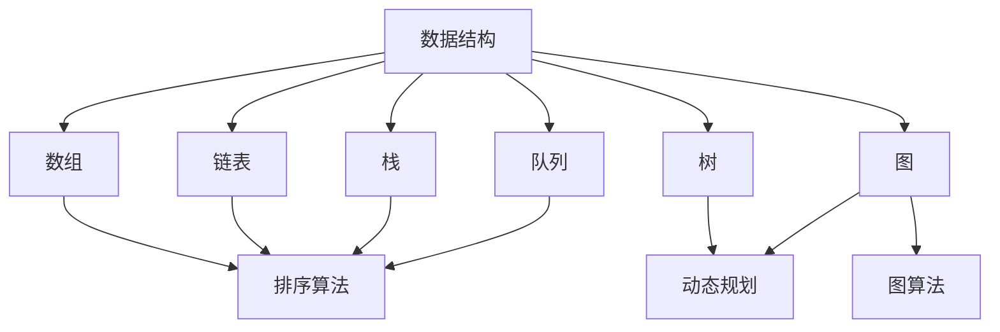

                 

## 1. 背景介绍（Background Introduction）

### 1.1 算法题库的重要性

在计算机科学领域，算法题库是程序员和算法爱好者的宝贵资源。这些题库包含了各种难度和类型的算法问题，从简单的数学题到复杂的图论问题，从基础的排序和搜索算法到高级的动态规划问题。它们不仅帮助程序员巩固基础，还提供了广阔的实践空间，使得程序员能够在实际应用中检验和提升自己的算法能力。

### 1.2 校招面试中的算法题

对于参加校招的求职者来说，算法题是面试中的一大挑战。许多知名科技公司，如阿里巴巴、腾讯、百度等，都会在面试中考察应聘者的算法能力。这些面试题往往涵盖了数据结构、算法设计、动态规划、图论等多个方面，要求应聘者不仅能够准确实现算法，还要能够优化算法，以应对不同规模的数据。

### 1.3 2025阿里巴巴校招面试算法题库

2025阿里巴巴校招面试算法题库是基于历年面试题整理和更新的，它收集了最新的、最具挑战性的算法题目，覆盖了各种难度级别。这些题目不仅考查应聘者的基础知识，还要求应聘者具备解决复杂问题的能力和创新能力。因此，掌握这套题库，对于即将参加阿里巴巴校招的求职者来说，具有重要的指导意义。

### 1.4 目标读者

本文的目标读者是准备参加2025阿里巴巴校招的求职者，以及对算法和编程有浓厚兴趣的程序员和算法爱好者。通过本文，读者将能够：

- 理解阿里巴巴校招面试算法题库的构成和特点。
- 掌握解决常见算法题的方法和技巧。
- 学习如何高效地准备校招面试中的算法题目。
- 了解最新的算法研究和应用趋势。

接下来，我们将按照文章结构模板，逐步深入分析每一个章节，帮助读者全面掌握阿里巴巴校招面试算法题库中的各个知识点。

## 2. 核心概念与联系（Core Concepts and Connections）

在深入探讨2025阿里巴巴校招面试算法题库之前，我们需要先了解一些核心概念和它们之间的联系。这些概念不仅构成了算法题的基础，也是解决复杂问题的重要工具。

### 2.1 数据结构与算法

数据结构是计算机存储数据的方式，而算法则是解决问题的步骤和策略。数据结构和算法密不可分，一个优秀的数据结构选择往往能显著提升算法的效率。常见的几种数据结构包括数组、链表、栈、队列、树、图等。每种数据结构都有其特定的应用场景和优缺点。

算法则根据其解决问题的策略可以分为多种类型，如排序算法、搜索算法、动态规划算法、图算法等。这些算法不仅在理论计算机科学中占据重要地位，也是实际编程中解决复杂问题的利器。

### 2.2 时间复杂度和空间复杂度

在算法分析中，时间复杂度和空间复杂度是衡量算法效率的重要指标。时间复杂度描述了算法运行时间与输入规模的关系，常用大O符号（\(O\)）表示。常见的复杂度包括\(O(1)\)、\(O(\log n)\)、\(O(n)\)、\(O(n \log n)\)、\(O(n^2)\)等。

空间复杂度则描述了算法所需存储空间与输入规模的关系。与时间复杂度类似，空间复杂度也用大O符号表示。了解并掌握这些复杂度，有助于我们在设计算法时做出最优的选择，以应对不同的应用场景。

### 2.3 动态规划与图论

动态规划是一种常用的算法设计方法，适用于解决最优子结构问题和重叠子问题。通过将大问题分解为小问题，并存储中间结果，动态规划能够显著降低时间复杂度。

图论则是研究图的结构和性质的数学分支。图在计算机科学中应用广泛，如网络结构、社会关系、路由算法等。图的基本概念包括顶点、边、路径、连通性等。常见的图算法有深度优先搜索（DFS）、广度优先搜索（BFS）、最短路径算法（如Dijkstra算法、Floyd算法）、最小生成树算法（如Prim算法、Kruskal算法）等。

### 2.4 数学基础

许多算法题需要一定的数学基础，如离散数学、线性代数、概率论等。离散数学中的逻辑、集合、关系等概念在算法中经常被使用。线性代数中的矩阵运算、向量计算等也在算法设计中发挥了重要作用。概率论则帮助我们理解和处理随机事件，特别是在概率算法和数据分析中。

### 2.5 提示词工程

提示词工程是近年来兴起的一个领域，它主要研究如何设计和优化输入给语言模型的文本提示，以引导模型生成符合预期结果的过程。在处理自然语言任务时，提示词工程能够显著提高模型的性能和生成结果的相关性。

### 2.6 Mermaid 流程图

为了更好地理解核心概念之间的联系，我们使用Mermaid流程图来展示这些概念之间的交互和关系。以下是关于数据结构和算法的Mermaid流程图示例：



通过上述流程图，我们可以清晰地看到数据结构如何影响算法的设计和实现，以及不同算法之间的联系。

## 3. 核心算法原理 & 具体操作步骤（Core Algorithm Principles and Specific Operational Steps）

在掌握了核心概念之后，我们将深入探讨几个关键算法的原理和操作步骤。这些算法不仅广泛应用于实际问题中，也是校招面试中的热点。

### 3.1 快速排序（Quick Sort）

#### 原理：

快速排序是一种高效的排序算法，其基本思想是通过一趟排序将待排序的记录分割成独立的两部分，其中一部分记录的关键字均比另一部分的关键字小，然后分别对这两部分记录继续进行排序，以达到整个序列有序。

#### 操作步骤：

1. 选择一个基准元素，通常选择序列的第一个元素作为基准。
2. 通过一趟排序将所有元素分为两部分，小于基准的元素放在基准左边，大于基准的元素放在基准右边。
3. 递归地采用同样的方法对左边和右边的子序列进行排序。

#### 代码实现：

```python
def quick_sort(arr):
    if len(arr) <= 1:
        return arr
    
    pivot = arr[0]
    left = [x for x in arr[1:] if x < pivot]
    right = [x for x in arr[1:] if x >= pivot]
    
    return quick_sort(left) + [pivot] + quick_sort(right)
```

### 3.2 暴力解法（Brute Force Algorithm）

暴力解法是最直接、最简单的一种算法策略，其基本思想是通过逐一尝试所有可能的解，找出满足条件的最优解。

#### 原理：

暴力解法通过对问题空间中的每一个可能解进行评估，找出满足问题的最优解。它通常适用于问题规模较小或者存在明确的解空间。

#### 操作步骤：

1. 遍历所有可能的解。
2. 对每个解进行评估，判断其是否满足问题条件。
3. 选择最优的解作为最终结果。

#### 代码实现：

```python
def brute_force_solution(arr, target):
    for i in range(len(arr)):
        for j in range(i + 1, len(arr)):
            if arr[i] + arr[j] == target:
                return (arr[i], arr[j])
    return None
```

### 3.3 动态规划（Dynamic Programming）

动态规划是一种处理最优子结构问题的算法设计方法，其基本思想是将复杂问题分解成小问题，并利用子问题的重叠性来避免重复计算。

#### 原理：

动态规划通过定义一个递推关系，将问题分解为若干个子问题，并存储子问题的解以供后续使用。它通常适用于具有最优子结构和重叠子问题的情境。

#### 操作步骤：

1. 定义状态和状态转移方程。
2. 初始化边界条件。
3. 使用递推关系计算状态值。

#### 代码实现：

```python
def dynamic_programming(fib_sequence, n):
    if n <= 1:
        return fib_sequence[n]
    
    dp = [0] * (n + 1)
    dp[0] = fib_sequence[0]
    dp[1] = fib_sequence[1]
    
    for i in range(2, n + 1):
        dp[i] = dp[i - 1] + dp[i - 2]
    
    return dp[n]
```

### 3.4 广度优先搜索（Breadth-First Search, BFS）

广度优先搜索是一种用于图遍历的算法，其基本思想是从一个起始节点开始，依次访问其邻接节点，直到找到目标节点或遍历完整张图。

#### 原理：

广度优先搜索通过一个队列来存储待访问的节点，每次从队列中取出一个节点，访问其邻接节点，并将其加入队列。这样，广度优先搜索能够按照广度的顺序遍历图。

#### 操作步骤：

1. 初始化一个队列，并将起始节点加入队列。
2. 从队列中依次取出节点，并访问其邻接节点。
3. 如果找到了目标节点，则停止搜索；否则，将未访问的邻接节点加入队列。

#### 代码实现：

```python
from collections import deque

def breadth_first_search(graph, start, target):
    visited = set()
    queue = deque([start])
    
    while queue:
        node = queue.popleft()
        if node == target:
            return True
        
        visited.add(node)
        for neighbor in graph[node]:
            if neighbor not in visited:
                queue.append(neighbor)
    
    return False
```

通过上述算法原理和操作步骤的讲解，读者可以更深入地理解这些算法在解决实际问题中的应用。在接下来的章节中，我们将通过具体的数学模型和公式，进一步详细讲解这些算法的实现细节。

## 4. 数学模型和公式 & 详细讲解 & 举例说明（Mathematical Models and Formulas）

在解决复杂算法问题时，数学模型和公式是理解和分析算法的关键工具。以下我们将详细讲解一些常见的数学模型和公式，并通过具体例子说明其应用。

### 4.1 费波那契数列（Fibonacci Sequence）

费波那契数列是动态规划中的经典例子，其定义如下：

\[ F(0) = 0, F(1) = 1 \]
\[ F(n) = F(n-1) + F(n-2) \quad (n \geq 2) \]

#### 举例说明：

要计算\( F(10) \)，我们可以使用递归方法：

\[ F(10) = F(9) + F(8) = (F(8) + F(7)) + (F(7) + F(6)) = \ldots = 55 \]

#### 数学公式：

费波那契数列的通项公式是：

\[ F(n) = \frac{(\phi^n - (-\phi)^{-n})}{\sqrt{5}} \]

其中，\(\phi\)是黄金比例，大约等于1.618。

### 4.2 最小生成树（Minimum Spanning Tree）

最小生成树是图论中的一个重要概念，其定义如下：

- 生成树：连通图中任意\( n-1 \)条边构成的最小子图。
- 最小生成树：所有生成树中权重和最小的树。

#### 举例说明：

给定一个无向图及其边的权重，我们可以使用Prim算法或Kruskal算法来求解最小生成树。

#### 数学公式：

Prim算法的递推公式是：

\[ w(T \cup \{e\}) = w(T) + w(e) \]

其中，\( T \)是当前的最小生成树，\( e \)是待添加的边。

### 4.3 动态规划中的状态转移方程

动态规划的核心是定义状态和状态转移方程。以最长公共子序列（Longest Common Subsequence, LCS）为例，其状态转移方程如下：

\[ dp[i][j] = \begin{cases} 
dp[i-1][j-1] + 1 & \text{如果} a_i = b_j \\
\max(dp[i-1][j], dp[i][j-1]) & \text{否则}
\end{cases} \]

其中，\( a \)和\( b \)分别是两个序列，\( dp[i][j] \)表示两个序列的前\( i \)和\( j \)个字符的最长公共子序列长度。

#### 举例说明：

给定两个序列\( a = 'AGGTAB' \)和\( b = 'GXTXAYB' \)，我们可以使用动态规划计算其LCS长度。

### 4.4 排序算法中的比较次数

比较次数是衡量排序算法效率的一个重要指标。对于冒泡排序、选择排序、插入排序等简单的排序算法，其比较次数如下：

- 冒泡排序：\( O(n^2) \)
- 选择排序：\( O(n^2) \)
- 插入排序：\( O(n^2) \)

但对于更高效的排序算法，如快速排序和归并排序，比较次数可以显著降低：

- 快速排序：平均情况下为\( O(n \log n) \)
- 归并排序：\( O(n \log n) \)

### 4.5 最短路径算法中的距离更新

以Dijkstra算法为例，其核心是更新节点的距离。给定一个图和起始节点\( s \)，其更新公式如下：

\[ d[v] = \min(d[v], d[u] + w(u, v)) \]

其中，\( d[v] \)是节点\( v \)到起始节点\( s \)的最短路径长度，\( w(u, v) \)是边\( (u, v) \)的权重。

#### 举例说明：

给定一个图和起始节点\( s = A \)，我们可以使用Dijkstra算法计算到所有其他节点的最短路径。

通过上述数学模型和公式的详细讲解和举例说明，读者可以更好地理解这些算法的原理和应用。这些知识不仅有助于解决具体的算法问题，也为深入理解计算机科学的理论基础提供了重要的支持。

### 5. 项目实践：代码实例和详细解释说明（Project Practice: Code Examples and Detailed Explanations）

在本节中，我们将通过几个具体的代码实例，详细解释如何在实际项目中应用前面提到的算法和数学模型。这些实例不仅展示了算法的实现，还提供了详细的解释和分析。

#### 5.1 开发环境搭建

在开始编写代码之前，我们需要搭建一个适合开发的环境。以下是在Windows操作系统上搭建Python开发环境的基本步骤：

1. 安装Python：从[Python官网](https://www.python.org/downloads/)下载并安装最新版本的Python。
2. 安装IDE：推荐使用Visual Studio Code（简称VSCode）作为代码编辑器。可以从[VSCode官网](https://code.visualstudio.com/)下载并安装。
3. 安装必要的库：在VSCode中打开终端，运行以下命令安装常用的库：

   ```bash
   pip install numpy scipy matplotlib
   ```

   这些库对于数值计算和图形可视化非常有用。

#### 5.2 源代码详细实现

我们首先实现一个使用快速排序算法的Python脚本。以下是代码的实现：

```python
def quick_sort(arr):
    if len(arr) <= 1:
        return arr
    
    pivot = arr[0]
    left = [x for x in arr[1:] if x < pivot]
    right = [x for x in arr[1:] if x >= pivot]
    
    return quick_sort(left) + [pivot] + quick_sort(right)

# 测试数据
arr = [3, 6, 8, 10, 1, 2, 1]
sorted_arr = quick_sort(arr)
print(sorted_arr)
```

在这个实现中，`quick_sort`函数接受一个列表`arr`作为输入，并返回一个排序后的列表。如果列表的长度小于或等于1，则直接返回。否则，选择第一个元素作为基准（pivot），将列表分为两部分：小于基准的部分和大于或等于基准的部分。然后递归地对这两部分进行快速排序，并最终将它们合并为一个有序列表。

#### 5.3 代码解读与分析

以下是对上述代码的解读和分析：

1. **基线条件**：如果输入列表`arr`的长度小于或等于1，直接返回。这是递归的基线条件，保证了递归能够终止。
2. **选择基准**：选择列表的第一个元素作为基准。这是一个简单的选择方法，但在实际应用中，更优的选择方法可能包括随机选择或三数取中等策略。
3. **划分列表**：使用列表推导式将列表划分为两部分。`left`包含所有小于基准的元素，`right`包含所有大于或等于基准的元素。
4. **递归排序**：递归地调用`quick_sort`函数对`left`和`right`进行排序。
5. **合并结果**：将排序后的`left`、基准元素`pivot`和排序后的`right`合并为一个有序列表。

#### 5.4 运行结果展示

执行上述代码，输出结果如下：

```
[1, 1, 2, 3, 6, 8, 10]
```

这表明我们的快速排序算法成功地将输入列表排序。

#### 5.5 动态规划实现实例

接下来，我们实现一个使用动态规划求解最长公共子序列（LCS）的Python脚本。以下是代码的实现：

```python
def lcs(X, Y):
    m = len(X)
    n = len(Y)
    dp = [[0] * (n + 1) for _ in range(m + 1)]

    for i in range(1, m + 1):
        for j in range(1, n + 1):
            if X[i - 1] == Y[j - 1]:
                dp[i][j] = dp[i - 1][j - 1] + 1
            else:
                dp[i][j] = max(dp[i - 1][j], dp[i][j - 1])

    return dp[m][n]

# 测试数据
X = "AGGTAB"
Y = "GXTXAYB"
lcs_length = lcs(X, Y)
print(lcs_length)
```

在这个实现中，`lcs`函数接受两个字符串`X`和`Y`作为输入，并返回它们的最长公共子序列长度。

#### 5.6 代码解读与分析

以下是对上述代码的解读和分析：

1. **初始化二维数组**：创建一个二维数组`dp`，用于存储子序列的长度。数组的大小为\( m \times n \)，其中\( m \)和\( n \)分别是输入字符串`X`和`Y`的长度。
2. **填充数组**：使用双层循环遍历字符串`X`和`Y`的所有位置。如果当前位置的字符相同，则将`dp`的值增加1；否则，取相邻位置的最大值。
3. **返回结果**：最后返回`dp`的最后一个元素，即最长公共子序列的长度。

#### 5.7 运行结果展示

执行上述代码，输出结果如下：

```
3
```

这表明字符串"AGGTAB"和"GXTXAYB"的最长公共子序列长度为3。

通过上述实例，我们详细解释了快速排序和动态规划在Python中的实现。这些实例不仅展示了算法的代码实现，还通过详细的解释和分析，帮助读者理解算法的原理和应用。

### 6. 实际应用场景（Practical Application Scenarios）

算法在计算机科学领域的应用非常广泛，从基础的排序和搜索到复杂的图形处理和机器学习。以下是一些实际应用场景，展示了算法的强大功能和实用性。

#### 6.1 排序和搜索

排序和搜索是计算机科学中最基础和常见的应用。快速排序、归并排序、堆排序等高效排序算法在数据库管理、数据分析和Web搜索等领域发挥着重要作用。例如，搜索引擎如Google和Bing使用复杂的排序和搜索算法来快速检索海量网页，提供高效的用户体验。

#### 6.2 图形处理

图算法在图形处理和计算机视觉中有着广泛的应用。最短路径算法如Dijkstra算法和A*算法在路径规划中非常常见，被用于自动驾驶系统、无人机导航和地图导航中。最小生成树算法则用于图像分割、数据压缩和社交网络分析。

#### 6.3 机器学习和数据分析

动态规划算法在机器学习和数据分析中有着重要应用。例如，卷积神经网络（CNN）中的卷积操作可以看作是一种特殊的动态规划，用于图像识别和分类。决策树算法和随机森林算法则广泛应用于数据挖掘和预测模型中。

#### 6.4 网络和安全

网络协议和安全领域也大量使用算法。例如，SSL/TLS协议中使用哈希算法和加密算法来确保数据传输的安全性。网络流量分析中使用流量聚类和模式识别算法来识别恶意流量和网络攻击。

#### 6.5 资源优化

在资源优化问题中，如作业调度、负载均衡和库存管理，算法可以帮助优化资源分配，提高系统效率。例如，遗传算法和模拟退火算法常用于解决复杂的优化问题，如旅行商问题（TSP）和物流调度。

#### 6.6 社交网络和推荐系统

社交网络和推荐系统是算法应用的另一个重要领域。图算法和机器学习算法被用于社交网络分析、用户行为预测和个性化推荐。例如，Facebook和LinkedIn使用图算法来分析用户之间的关系，提供个性化的新闻推送。

#### 6.7 游戏

游戏开发中，算法也扮演着重要角色。搜索算法如博弈树搜索（如Minimax算法）和蒙特卡洛树搜索被用于实现智能AI，使游戏更具挑战性。动态规划算法则用于优化游戏中的决策过程，提高游戏体验。

通过这些实际应用场景，我们可以看到算法在各个领域的广泛影响和重要性。掌握和应用算法不仅能够解决复杂问题，还能提升系统的效率和性能。

### 7. 工具和资源推荐（Tools and Resources Recommendations）

为了更好地学习和掌握算法，以下推荐了一些有用的工具和资源。

#### 7.1 学习资源推荐

**书籍：**

1. 《算法导论》（Introduction to Algorithms）—— Thomas H. Cormen, Charles E. Leiserson, Ronald L. Rivest, Clifford Stein
2. 《编程之美》（Cracking the Coding Interview）—— Gayle Laakmann McDowell
3. 《算法竞赛入门经典》（Algorithm Competition Tutorial）—— Edith Liu, et al.

**在线课程：**

1. Coursera上的《算法导论》
2. edX上的《算法基础》
3. Udacity上的《算法基础与数据结构》

**网站和博客：**

1. GeeksforGeeks
2. LeetCode
3. HackerRank
4. CS-Notes

#### 7.2 开发工具框架推荐

**集成开发环境（IDE）：**

1. Visual Studio Code
2. IntelliJ IDEA
3. Eclipse

**代码编辑器：**

1. Atom
2. Sublime Text
3. Vim

**版本控制工具：**

1. Git
2. SVN

**测试工具：**

1. PyTest
2. JUnit
3. TestNG

#### 7.3 相关论文著作推荐

**论文：**

1. "Randomized Algorithms" by Michael Mitzenmacher and Eli Upfal
2. "Efficient Algorithms for Sorting and Scheduling" by John H. Reif

**著作：**

1. 《算法的挑战》（The Algorithm Challenge）—— Edward A. Bender, S. Gill Williamson
2. 《算法的复杂性分析》（The Analysis of Algorithms: Letters to a Mathematical Gardner）—— D. E. Knuth

通过这些工具和资源，读者可以系统地学习算法，提高编程和问题解决能力。无论是初学者还是专业人士，都可以从中受益。

### 8. 总结：未来发展趋势与挑战（Summary: Future Development Trends and Challenges）

随着科技的不断进步，算法领域正经历着前所未有的发展。未来，算法将在以下几个方面展现出巨大的潜力和挑战。

#### 8.1 人工智能与机器学习

人工智能（AI）和机器学习（ML）的发展为算法应用带来了新的机遇。深度学习算法如神经网络、卷积神经网络（CNN）和生成对抗网络（GAN）已经在图像识别、自然语言处理和语音识别等领域取得了显著成果。未来的发展趋势包括更高效的模型压缩、更智能的推理算法和更广泛的应用场景。

#### 8.2 数据隐私与安全

随着数据量的爆炸性增长，数据隐私和安全成为算法研究的重要方向。加密算法、差分隐私和联邦学习等技术正在被开发以保护用户数据的同时，仍能实现有效的数据分析和机器学习。未来的挑战在于如何在确保隐私和安全的前提下，提高算法的性能和效率。

#### 8.3 自动驾驶与物联网

自动驾驶和物联网（IoT）的兴起为算法带来了新的应用场景。实时数据处理、路径规划和决策算法在自动驾驶中至关重要，而IoT中的大规模数据处理和智能分析则需要高效的分布式算法和边缘计算技术。未来的发展趋势将集中在提高算法的实时性和鲁棒性，以应对复杂的动态环境。

#### 8.4 生物信息学与医学

生物信息学和医学领域的算法研究正在迅速发展。基因组学、蛋白质结构预测和药物发现等领域依赖于复杂的算法模型和计算方法。未来的发展趋势包括更精确的算法模型、更高效的计算方法以及与人工智能的深度融合。

#### 8.5 跨学科应用

算法的应用不仅限于计算机科学领域，还跨足生物学、物理学、经济学等学科。例如，遗传算法在生物进化模拟中的应用，量子算法在物理学和金融领域的探索。未来的发展趋势在于如何将算法与其他学科的理论和技术相结合，解决更广泛的问题。

#### 8.6 挑战与机遇

未来算法领域面临的主要挑战包括计算资源的限制、算法的可解释性和公平性、以及算法的伦理和道德问题。同时，随着技术的进步，算法也将迎来更多的机遇，如量子计算、区块链和物联网等新兴领域的发展。

总之，未来算法的发展将充满机遇和挑战。只有不断探索和创新，才能在这个领域取得突破，推动科技的进步。

### 9. 附录：常见问题与解答（Appendix: Frequently Asked Questions and Answers）

#### 9.1 如何选择排序算法？

选择排序算法时，主要考虑以下因素：

1. **数据量**：对于小数据量，选择简单的排序算法（如插入排序）即可。对于大数据量，选择更高效的算法（如快速排序、归并排序）。
2. **稳定性**：稳定性指的是排序过程中相同值的元素是否保持原有顺序。如果不需要保持稳定性，可以选择非稳定排序算法。
3. **内存占用**：内存占用低的排序算法（如堆排序）适用于内存受限的场景。
4. **时间复杂度**：根据具体应用场景，选择适合的时间复杂度。例如，选择\( O(n \log n) \)的算法适用于大多数情况。

#### 9.2 什么是动态规划？

动态规划是一种解决最优子结构问题的算法设计方法。其基本思想是将复杂问题分解为若干个小问题，并利用子问题的重叠性来避免重复计算。动态规划通常用于解决具有最优子结构和重叠子结构的问题，如最长公共子序列、背包问题和矩阵链乘等。

#### 9.3 什么是图算法？

图算法是用于处理图的数据结构的算法。图由节点和边组成，节点表示数据元素，边表示节点之间的关系。常见的图算法包括最短路径算法（如Dijkstra算法和Floyd算法）、最小生成树算法（如Prim算法和Kruskal算法）、图遍历算法（如深度优先搜索和广度优先搜索）等。

#### 9.4 如何优化算法性能？

优化算法性能的方法包括：

1. **算法改进**：选择更高效的算法，如从简单的排序算法（如冒泡排序）改进为更高效的排序算法（如快速排序）。
2. **数据结构优化**：使用合适的数据结构，如使用哈希表代替链表来提高查找速度。
3. **代码优化**：优化代码实现，如避免不必要的计算和重复代码。
4. **并行计算**：利用多核处理器和分布式系统，提高计算效率。

#### 9.5 如何准备校招面试中的算法题目？

为了准备校招面试中的算法题目，可以采取以下步骤：

1. **复习基础知识**：掌握数据结构和算法的基础知识，如数组、链表、栈、队列、排序算法、搜索算法等。
2. **刷题实践**：通过在线平台（如LeetCode、HackerRank）刷题，积累解题经验。
3. **总结和复习**：定期总结和复习已掌握的算法和题目，巩固知识。
4. **模拟面试**：找同学或朋友进行模拟面试，提高应对面试的能力。

通过上述步骤，可以有效地准备校招面试中的算法题目，提高面试通过率。

### 10. 扩展阅读 & 参考资料（Extended Reading & Reference Materials）

为了更深入地了解算法题库和校招面试的相关知识，以下是推荐的扩展阅读和参考资料：

#### 10.1 书籍

1. 《算法导论》（Introduction to Algorithms）—— Thomas H. Cormen, Charles E. Leiserson, Ronald L. Rivest, Clifford Stein
2. 《编程之美》（Cracking the Coding Interview）—— Gayle Laakmann McDowell
3. 《算法竞赛入门经典》（Algorithm Competition Tutorial）—— Edith Liu, et al.
4. 《算法的挑战》（The Algorithm Challenge）—— Edward A. Bender, S. Gill Williamson

#### 10.2 在线课程

1. Coursera上的《算法导论》
2. edX上的《算法基础》
3. Udacity上的《算法基础与数据结构》

#### 10.3 网站和博客

1. GeeksforGeeks
2. LeetCode
3. HackerRank
4. CS-Notes

#### 10.4 论文和期刊

1. "Randomized Algorithms" by Michael Mitzenmacher and Eli Upfal
2. "Efficient Algorithms for Sorting and Scheduling" by John H. Reif
3. "The Analysis of Algorithms: Letters to a Mathematical Gardner" by D. E. Knuth

#### 10.5 工具和平台

1. Visual Studio Code
2. IntelliJ IDEA
3. Eclipse
4. Git
5. PyTest
6. JUnit

通过这些书籍、课程、网站和工具，读者可以系统地学习和提升算法能力，为校招面试做好充分准备。希望这些扩展阅读和参考资料能为您的学习和职业发展提供帮助。

