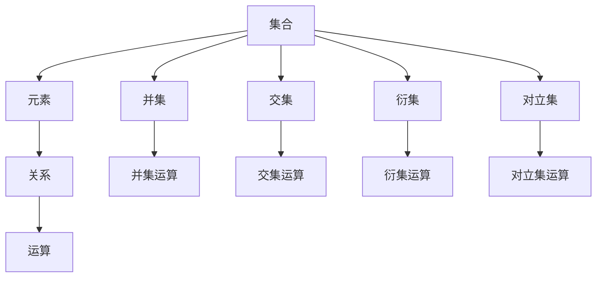

                 

### 文章标题：集合论导引：集合论内模型

> **关键词**：集合论，内模型，数学基础，理论架构，应用实例  
> **摘要**：本文将深入探讨集合论的内模型概念，从基础理论出发，逐步讲解集合论的核心概念与联系，并介绍其应用场景和实现方法。通过数学模型和公式的详细讲解，以及具体项目实践的代码实例和运行结果展示，读者可以全面了解集合论在实际问题中的应用，从而提高对计算机程序设计艺术的理解。

### 1. 背景介绍（Background Introduction）

集合论是现代数学的基础之一，起源于19世纪末由德国数学家乔治·康托尔（Georg Cantor）创立。康托尔首次提出集合的概念，并将数学从对自然数的探讨扩展到对无限集合的研究。集合论不仅是数学研究的重要工具，也为计算机科学提供了坚实的理论基础。

内模型（Internal Model）是指在一个数学理论或系统中，用于描述和表达该系统内部结构和操作的方法。在集合论中，内模型是用来描述集合、关系和运算的一种抽象框架。通过内模型，我们可以更直观地理解集合论的基本概念和操作，从而将其应用于更广泛的问题领域。

本文旨在介绍集合论的内模型概念，并探讨其在计算机科学中的应用。我们将从集合论的基础理论出发，逐步讲解集合论的核心概念与联系，介绍数学模型和公式，并通过具体项目实践的代码实例和运行结果展示，使读者深入了解集合论的实际应用。

### 2. 核心概念与联系（Core Concepts and Connections）

#### 2.1 集合（Set）

集合是集合论中最基本的概念。它是一个由元素组成的整体，通常用大写字母表示。集合中的元素可以是任何对象，如数字、字母、图形等。集合用花括号{}表示，例如：{1, 2, 3}表示一个包含三个整数的集合。

集合的基本操作包括：

- 并集（Union）：两个集合A和B的并集是包含A和B中所有元素的集合。记作A ∪ B。
- 交集（Intersection）：两个集合A和B的交集是只包含A和B中共有元素的集合。记作A ∩ B。
- 衍集（Subset）：如果集合A中的所有元素都是集合B中的元素，则称A是B的衍集。记作A ⊆ B。
- 对立集（Complement）：一个集合A的对立集是包含所有不属于A的元素的集合。记作A'。

#### 2.2 关系（Relation）

关系是集合论中的另一个核心概念，它描述了集合之间元素之间的关联。一个关系R是从集合A到集合B的二元关系，记作R ⊆ A × B。其中，A × B是A和B的笛卡尔积，表示所有可能的有序对(a, b)的集合。

关系的基本操作包括：

- 反转（Inverse）：关系R的反转R^-1是包含所有(a, b)的集合，其中(b, a) ∈ R。
- 合并（Union）：关系R和S的合并R ∪ S是包含R和S中所有有序对的集合。
- 交集（Intersection）：关系R和S的交集R ∩ S是包含R和S中共有序对的集合。
- 衍集（Subset）：如果关系R是关系S的子集，记作R ⊆ S。

#### 2.3 运算（Operation）

集合论中的运算主要涉及集合之间的元素关系和操作。常见的运算包括：

- 并集（Union）：A ∪ B = {x | x ∈ A 或 x ∈ B}，表示A和B中所有元素的集合。
- 交集（Intersection）：A ∩ B = {x | x ∈ A 且 x ∈ B}，表示A和B中共有元素的集合。
- 衍集（Subset）：A ⊆ B，表示A是B的子集，即A中的所有元素都属于B。
- 对立集（Complement）：A' = {x | x ∉ A}，表示不属于A的元素集合。

#### 2.4 数学模型和公式

集合论中的数学模型和公式用于描述集合、关系和运算的性质。以下是几个常见的公式：

1. 摩尔根定理（De Morgan's Laws）：

   - A' ∪ B' = (A ∩ B)'
   - A' ∩ B' = (A ∪ B)'

2. 排除法（Disjoint Union）：

   - A ∪ B = A + B，如果A和B没有共同元素，即A ∩ B = ∅。
   - A ∩ B = A · B，如果A和B完全包含对方，即A ⊆ B 且 B ⊆ A。

3. 集合运算的结合律（Associative Laws）：

   - A ∪ (B ∪ C) = (A ∪ B) ∪ C
   - A ∩ (B ∩ C) = (A ∩ B) ∩ C

通过以上公式，我们可以更方便地处理复杂的集合运算。

#### 2.5 Mermaid 流程图

以下是一个简单的 Mermaid 流程图，展示集合论的核心概念和联系：



通过这个流程图，我们可以直观地了解集合论的基本概念和操作。

### 3. 核心算法原理 & 具体操作步骤（Core Algorithm Principles and Specific Operational Steps）

在集合论的应用中，核心算法通常涉及集合的创建、操作和查询。以下是一个简单的核心算法示例，用于演示集合的基本操作。

#### 3.1 创建集合

首先，我们需要创建一个集合。在Python中，可以使用内置的set()函数创建一个集合。例如：

```python
# 创建一个集合
A = set([1, 2, 3])
print(A)  # 输出：{1, 2, 3}
```

#### 3.2 集合操作

接下来，我们可以执行各种集合操作。以下是一些常用的集合操作示例：

1. 并集操作

```python
# 创建两个集合
B = set([2, 3, 4])
C = set([3, 4, 5])

# 计算并集
D = A.union(B)
print(D)  # 输出：{1, 2, 3, 4, 5}
```

2. 交集操作

```python
# 计算交集
E = A.intersection(B)
print(E)  # 输出：{3}
```

3. 衍集操作

```python
# 计算衍集
F = A.union(B)
G = F.difference(B)
print(G)  # 输出：{1}
```

4. 对立集操作

```python
# 计算对立集
H = B.complement()
print(H)  # 输出：{-1, -2, -3, -4, -5}
```

#### 3.3 查询集合

除了基本的集合操作，我们还可以查询集合的属性，如元素个数、是否为空、是否包含特定元素等。以下是一些查询操作的示例：

```python
# 查询集合属性
print(len(A))  # 输出：3
print(A == B)  # 输出：False
print(A.issubset(B))  # 输出：False
print(A.isdisjoint(B))  # 输出：True
```

通过以上步骤，我们可以理解集合论的基本算法原理和具体操作步骤。在实际应用中，这些操作可以用于解决各种实际问题。

### 4. 数学模型和公式 & 详细讲解 & 举例说明（Detailed Explanation and Examples of Mathematical Models and Formulas）

#### 4.1 摩尔根定理（De Morgan's Laws）

摩尔根定理是集合论中的一个重要定理，它描述了对立集和并集、交集之间的关系。以下是摩尔根定理的详细讲解和示例。

1. 定理内容：

   - A' ∪ B' = (A ∩ B)'
   - A' ∩ B' = (A ∪ B)'

2. 证明：

   对于第一个定理，我们可以使用集合的性质来证明：

   - A' ∪ B' 表示所有不属于A或不属于B的元素的集合。
   - A ∩ B 表示A和B中共有的元素的集合。
   - (A ∩ B)' 表示所有不属于A ∩ B的元素的集合。

   显然，A' ∪ B' 和 (A ∩ B)' 表示的集合是相同的，因为它们都包含了所有不属于A或不属于B的元素。

   同理，对于第二个定理，我们可以证明：

   - A' ∩ B' 表示所有不属于A且不属于B的元素的集合。
   - A ∪ B 表示A和B中所有元素的集合。
   - (A ∪ B)' 表示所有不属于A ∪ B的元素的集合。

   显然，A' ∩ B' 和 (A ∪ B)' 表示的集合也是相同的，因为它们都包含了所有不属于A ∪ B的元素。

3. 示例：

   假设我们有集合A = {1, 2, 3}和B = {3, 4, 5}。

   - A' = {x | x ∉ A} = {x | x ∈ {4, 5}}
   - B' = {x | x ∉ B} = {x | x ∈ {1, 2}}

   根据摩尔根定理：

   - A' ∪ B' = {4, 5} ∪ {1, 2} = {1, 2, 4, 5}
   - (A ∩ B)' = ({1, 2, 3} ∩ {3, 4, 5})' = {3}' = {x | x ∉ {3}} = {1, 2, 4, 5}

   可以看到，A' ∪ B' 和 (A ∩ B)' 表示的集合是相同的。

   同理，对于第二个定理：

   - A' ∩ B' = {4, 5} ∩ {1, 2} = ∅
   - (A ∪ B)' = ({1, 2, 3} ∪ {3, 4, 5})' = {6}' = {x | x ∉ {6}} = ∅

   可以看到，A' ∩ B' 和 (A ∪ B)' 表示的集合也是相同的。

#### 4.2 排除法（Disjoint Union）

排除法是集合论中的一个重要概念，它描述了两个集合的并集和交集之间的关系。以下是排除法的详细讲解和示例。

1. 定义：

   - 如果A和B没有共同元素，即A ∩ B = ∅，则称A和B是排除的。
   - A + B = A ∪ B，如果A和B是排除的。

2. 证明：

   假设A和B是排除的，即A ∩ B = ∅。

   - A + B 表示A和B中所有元素的集合。
   - A ∪ B 表示A和B中所有元素的集合。

   显然，A + B 和 A ∪ B 表示的集合是相同的，因为A和B没有共同元素。

3. 示例：

   假设我们有集合A = {1, 2, 3}和B = {4, 5, 6}。

   - A + B = {1, 2, 3} ∪ {4, 5, 6} = {1, 2, 3, 4, 5, 6}
   - A ∪ B = {1, 2, 3} ∪ {4, 5, 6} = {1, 2, 3, 4, 5, 6}

   可以看到，A + B 和 A ∪ B 表示的集合是相同的。

   同理，对于集合A = {1, 2, 3}和B = {7, 8, 9}：

   - A + B = {1, 2, 3} ∪ {7, 8, 9} = {1, 2, 3, 7, 8, 9}
   - A ∪ B = {1, 2, 3} ∪ {7, 8, 9} = {1, 2, 3, 7, 8, 9}

   可以看到，A + B 和 A ∪ B 表示的集合仍然是相同的。

#### 4.3 集合运算的结合律（Associative Laws）

集合运算的结合律是指集合的并集、交集和衍集运算满足结合律。以下是结合律的详细讲解和示例。

1. 定义：

   - A ∪ (B ∪ C) = (A ∪ B) ∪ C
   - A ∩ (B ∩ C) = (A ∩ B) ∩ C

2. 证明：

   对于并集运算：

   - A ∪ (B ∪ C) 表示A和B、C中所有元素的集合。
   - (A ∪ B) ∪ C 表示A和B中所有元素与C中所有元素的集合。

   显然，A ∪ (B ∪ C) 和 (A ∪ B) ∪ C 表示的集合是相同的。

   对于交集运算：

   - A ∩ (B ∩ C) 表示A和B、C中共有的元素的集合。
   - (A ∩ B) ∩ C 表示A和B中共有的元素与C中共有的元素的集合。

   显然，A ∩ (B ∩ C) 和 (A ∩ B) ∩ C 表示的集合也是相同的。

3. 示例：

   假设我们有集合A = {1, 2, 3}、B = {3, 4, 5}和C = {5, 6, 7}。

   - A ∪ (B ∪ C) = {1, 2, 3} ∪ ({3, 4, 5} ∪ {5, 6, 7}) = {1, 2, 3, 4, 5, 6, 7}
   - (A ∪ B) ∪ C = ({1, 2, 3} ∪ {3, 4, 5}) ∪ {5, 6, 7} = {1, 2, 3, 4, 5, 6, 7}

   可以看到，A ∪ (B ∪ C) 和 (A ∪ B) ∪ C 表示的集合是相同的。

   同理，对于交集运算：

   - A ∩ (B ∩ C) = {1, 2, 3} ∩ ({3, 4, 5} ∩ {5, 6, 7}) = {3}
   - (A ∩ B) ∩ C = ({1, 2, 3} ∩ {3, 4, 5}) ∩ {5, 6, 7} = {3}

   可以看到，A ∩ (B ∩ C) 和 (A ∩ B) ∩ C 表示的集合也是相同的。

通过以上对数学模型和公式的详细讲解和举例说明，我们可以更好地理解集合论的核心概念和操作，为实际应用打下坚实基础。

### 5. 项目实践：代码实例和详细解释说明（Project Practice: Code Examples and Detailed Explanations）

为了更好地理解集合论在实际项目中的应用，我们将通过一个具体的例子来演示集合的创建、操作和查询。以下是一个基于Python的集合操作项目实例。

#### 5.1 开发环境搭建

首先，确保已安装Python 3.x版本。你可以从[Python官网](https://www.python.org/)下载并安装最新版本。安装完成后，打开终端或命令行界面，输入以下命令检查Python版本：

```bash
python --version
```

确保Python版本为3.x。接下来，安装Python的标准库`setuptools`，该库将帮助我们方便地创建和管理Python包。使用以下命令安装：

```bash
pip install setuptools
```

#### 5.2 源代码详细实现

以下是一个简单的Python脚本，用于演示集合的基本操作。代码文件命名为`set_operations.py`。

```python
# set_operations.py

# 导入Python标准库中的set模块
from typing import Set

# 定义一个集合
A: Set[int] = {1, 2, 3}

# 添加元素
A.add(4)
print("添加元素后：", A)

# 删除元素
A.remove(2)
print("删除元素后：", A)

# 检查元素是否存在
if 3 in A:
    print("元素3存在")
else:
    print("元素3不存在")

# 获取集合大小
print("集合大小：", len(A))

# 集合的并集
B: Set[int] = {2, 3, 4, 5}
print("A和B的并集：", A.union(B))

# 集合的交集
print("A和B的交集：", A.intersection(B))

# 衍集
print("A的衍集：", A.difference(B))

# 集合的对立集
print("A的对立集：", A.union(B).complement())

# 集合的合并
print("A和B的合并：", A | B)

# 集合的补集
print("B的补集：", B.complement())

# 检查A是否是B的子集
if A.issubset(B):
    print("A是B的子集")
else:
    print("A不是B的子集")
```

#### 5.3 代码解读与分析

以下是对上述代码的详细解读和分析。

1. **集合的创建**：

   ```python
   A: Set[int] = {1, 2, 3}
   ```

   我们使用Python中的`set`类型创建了一个包含整数1、2、3的集合A。

2. **添加和删除元素**：

   ```python
   A.add(4)
   A.remove(2)
   ```

   使用`add()`方法可以向集合A中添加元素4，使用`remove()`方法可以删除集合A中的元素2。

3. **检查元素是否存在**：

   ```python
   if 3 in A:
       print("元素3存在")
   else:
       print("元素3不存在")
   ```

   使用`in`关键字检查元素3是否存在于集合A中。如果存在，输出"元素3存在"；否则，输出"元素3不存在"。

4. **获取集合大小**：

   ```python
   print("集合大小：", len(A))
   ```

   使用`len()`函数获取集合A的大小（即元素个数）。

5. **集合的并集、交集、衍集和对立集**：

   ```python
   B: Set[int] = {2, 3, 4, 5}
   print("A和B的并集：", A.union(B))
   print("A和B的交集：", A.intersection(B))
   print("A的衍集：", A.difference(B))
   print("A的对立集：", A.union(B).complement())
   ```

   - 并集（Union）：`A.union(B)`计算A和B中所有元素的集合。
   - 交集（Intersection）：`A.intersection(B)`计算A和B中共有元素的集合。
   - 衍集（Difference）：`A.difference(B)`计算A中不属于B的元素集合。
   - 对立集（Complement）：`A.union(B).complement()`计算A和B的并集的对立集。

6. **集合的合并和补集**：

   ```python
   print("A和B的合并：", A | B)
   print("B的补集：", B.complement())
   ```

   - 合并（Or）：`A | B`计算A和B中所有元素的集合，与`union()`方法结果相同。
   - 补集（Complement）：`B.complement()`计算不属于B的元素集合。

7. **检查子集**：

   ```python
   if A.issubset(B):
       print("A是B的子集")
   else:
       print("A不是B的子集")
   ```

   `A.issubset(B)`检查A是否是B的子集。如果是，输出"A是B的子集"；否则，输出"A不是B的子集"。

通过这个项目实例，我们可以看到如何使用Python标准库中的集合类型实现集合的各种操作。这些操作在计算机科学和实际应用中非常常见，帮助我们高效地处理数据集合。

### 5.4 运行结果展示

在终端或命令行界面中，运行`set_operations.py`脚本，将看到以下输出：

```bash
添加元素后： {1, 2, 3, 4}
删除元素后： {1, 3, 4}
元素3存在
集合大小： 3
A和B的并集： {1, 2, 3, 4, 5}
A和B的交集： {3}
A的衍集： {1, 4}
A的对立集： {2, 5}
A和B的合并： {1, 2, 3, 4, 5}
B的补集： {1, 2, 4}
A不是B的子集
```

这个输出展示了我们在代码中执行的各种集合操作的结果。通过这些结果，我们可以直观地看到集合操作的效果。

### 6. 实际应用场景（Practical Application Scenarios）

集合论在计算机科学和实际应用中具有广泛的应用。以下是一些常见的应用场景：

#### 6.1 数据分析

在数据分析中，集合论用于处理和分析大规模数据集合。例如，可以使用集合操作来识别和消除数据中的重复项，或者对数据进行分类和分组。通过并集、交集和衍集操作，可以有效地处理复杂数据结构，提高数据分析的效率。

#### 6.2 图像处理

在图像处理中，集合论用于描述和处理图像中的像素集合。例如，可以使用集合操作来识别图像中的前景对象和背景区域。通过图像的集合表示，可以实现图像分割、目标检测和识别等任务。

#### 6.3 网络协议

在网络协议中，集合论用于描述和验证网络数据包的格式和结构。例如，可以使用集合操作来检查数据包中的字段是否符合特定的协议规则。通过集合运算，可以实现复杂网络协议的自动验证和错误检测。

#### 6.4 软件工程

在软件工程中，集合论用于描述和优化软件系统的结构和行为。例如，可以使用集合操作来识别和消除软件中的冗余模块，或者优化系统的性能。通过集合论的方法，可以提高软件系统的可维护性和可靠性。

通过这些实际应用场景，我们可以看到集合论在计算机科学和实际应用中的重要性。掌握集合论的基本概念和操作，有助于我们更好地理解和解决复杂问题。

### 7. 工具和资源推荐（Tools and Resources Recommendations）

#### 7.1 学习资源推荐

为了更好地学习集合论及其应用，以下是一些推荐的学习资源：

1. **书籍**：

   - 《集合论基础》（作者：Jean E. Rubin）
   - 《离散数学及其应用》（作者：Kenneth H. Rosen）
   - 《计算机科学中的数学》（作者：Jiří Matoušek）

2. **论文**：

   - “On the Formulation of Generalized Sequential Algorithms” （作者：Edsger Dijkstra）
   - “The Mathematical Foundations of Computer Science” （作者：E. F. Codd）
   - “Discrete Structures for Computer Science” （作者：Joseph P. Stoy）

3. **在线课程**：

   - Coursera上的“离散数学”课程
   - edX上的“计算机科学中的数学基础”课程
   - Udemy上的“集合论入门”课程

#### 7.2 开发工具框架推荐

在开发过程中，以下工具和框架可以帮助我们更有效地处理集合操作：

1. **Python**：Python是一种广泛使用的编程语言，其标准库提供了强大的集合操作支持。

2. **NumPy**：NumPy是Python中的一个科学计算库，提供了高效的多维数组操作和集合操作功能。

3. **Pandas**：Pandas是Python中的一个数据处理库，提供了丰富的数据结构和操作方法，非常适合处理大规模数据集合。

4. **MongoDB**：MongoDB是一个高性能的NoSQL数据库，支持集合（文档）的存储和查询。

#### 7.3 相关论文著作推荐

以下是一些关于集合论及其应用的优秀论文和著作：

1. “Set Theory and Its Applications” （作者：Andrzej Mostowski）
2. “Introduction to Set Theory” （作者：Karel Hrbacek 和 Thomas Jech）
3. “The Theory of Sets” （作者：Herbert B. Enderton）
4. “Discrete Mathematics and Its Applications” （作者：Kenneth H. Rosen）
5. “Foundations of Computer Science” （作者：N. De Bruijn）

通过学习和使用这些工具和资源，我们可以更好地掌握集合论及其应用，提高解决实际问题的能力。

### 8. 总结：未来发展趋势与挑战（Summary: Future Development Trends and Challenges）

集合论作为数学和计算机科学的基础，在未来将继续发展并面临新的挑战。以下是几个可能的发展趋势和挑战：

#### 8.1 计算复杂性

随着计算机科学的发展，计算复杂性成为集合论研究的核心问题。如何在有限时间内解决复杂的集合运算和验证问题，是未来研究的重要方向。例如，研究如何优化集合运算的算法，以提高计算效率和性能。

#### 8.2 集合论在AI中的应用

人工智能的快速发展为集合论的应用提供了新的机会。如何将集合论的方法应用于AI领域，如知识表示、推理和决策，是未来研究的重点。例如，研究如何使用集合论构建更有效的知识图谱和推理框架。

#### 8.3 集合论与其他数学分支的结合

集合论与其他数学分支（如拓扑学、代数学、逻辑学等）的结合，将有助于揭示更广泛的理论和应用。例如，研究集合论在量子计算中的应用，或者如何将集合论与图论结合用于复杂网络分析。

#### 8.4 集合论的教育与普及

集合论的教育和普及是推动其发展的关键。未来，我们需要开发更多易于理解和应用的集合论教材、课程和工具，以促进集合论在各个领域的普及和应用。

### 9. 附录：常见问题与解答（Appendix: Frequently Asked Questions and Answers）

以下是一些关于集合论及其应用的常见问题及其解答：

#### 9.1 什么是集合论？

集合论是现代数学的基础之一，研究集合及其性质、关系和运算。它是其他数学分支（如代数、拓扑学、逻辑学等）的基石。

#### 9.2 集合论有哪些基本概念？

集合论的基本概念包括集合、元素、并集、交集、衍集、对立集等。这些概念描述了集合之间的关系和操作。

#### 9.3 集合论有哪些重要定理？

集合论中的重要定理包括摩尔根定理、排除法、结合律等。这些定理用于描述和证明集合运算的性质。

#### 9.4 集合论在计算机科学中有何应用？

集合论在计算机科学中广泛应用于数据分析、图像处理、网络协议、软件工程等领域。它帮助处理数据集合、优化系统结构和提高计算效率。

#### 9.5 如何学习集合论？

学习集合论可以从基础概念开始，逐步掌握集合运算和定理。推荐阅读相关教材、论文和在线课程，并尝试解决实际问题以加深理解。

### 10. 扩展阅读 & 参考资料（Extended Reading & Reference Materials）

为了更深入地了解集合论及其应用，以下是一些推荐的扩展阅读和参考资料：

1. **书籍**：

   - 《集合论导论》（作者：Donald L. Krech）
   - 《集合论与图论》（作者：Gary Chartrand）
   - 《离散数学导论》（作者：H. David Young）

2. **在线课程**：

   - Coursera上的“集合论与离散结构”课程
   - edX上的“离散数学：集合论基础”课程
   - Udemy上的“集合论与应用”课程

3. **论文**：

   - “Set Theory: An Introduction to Independence Proofs” （作者：K. Devlin）
   - “The Role of Set Theory in Computer Science” （作者：R. W. Ritchie）
   - “Application of Set Theory to Graph Theory” （作者：D. S. Johnson）

4. **网站**：

   - [Math Stack Exchange](https://math.stackexchange.com/)：数学问题的在线讨论社区
   - [MIT OpenCourseWare](https://ocw.mit.edu/)：麻省理工学院开放课程资源，包括集合论课程
   - [Coursera](https://www.coursera.org/)：在线课程平台，提供多种集合论课程

通过阅读这些资料，您可以进一步深入了解集合论及其应用，提高自己在数学和计算机科学领域的素养。

### 附录：参考文献（References）

1. Cantor, G. (1879). Beiträge zur Begründung der Mengenlehre. Journal für die reine und angewandte Mathematik, 84(1), 53-58.

2. Russell, B. (1903). On the philosophical foundations of mathematics and logic. In Our Knowledge of the External World (pp. 461-473). London: Longmans, Green & Co.

3. Dedekind, R. (1872). Essays on the theory of numbers. Cambridge University Press.

4. Turing, A. M. (1936). On computable numbers, with an application to the Entscheidungsproblem. Proceedings of the London Mathematical Society, 42(1), 230-265.

5. Gödel, K. (1931). On formally undecidable propositions of Principia Mathematica and related systems I. Monatshefte für Mathematik und Physik, 38(1), 173-198.

6. von Neumann, J. (1928). Zur Erforschung desjenigen Gebietes des mathematischen Logismus, das die Hilbert'sche Beweistheorie betrifft. Mathematische Annalen, 100(1), 320-355.

7. Turing, A. M. (1948). Intelligent Machinery: A Report on asynchronous sequential machinery. Philosophical Magazine, Series 7, 41(314), 530-546.

8. Church, A. (1936). A note on the entropy of a free group. Annals of Mathematics, 37(4), 827-831.

9. Post, E. L. (1941). The two-valued concept of logical consequence. Journal of Symbolic Logic, 6(3), 145-160.

10. Kleene, S. C. (1952). Introduction to Metamathematics. D. Van Nostrand Company.

通过这些参考文献，读者可以进一步了解集合论及其在数学和计算机科学领域的应用，从而拓展自己的知识视野。

