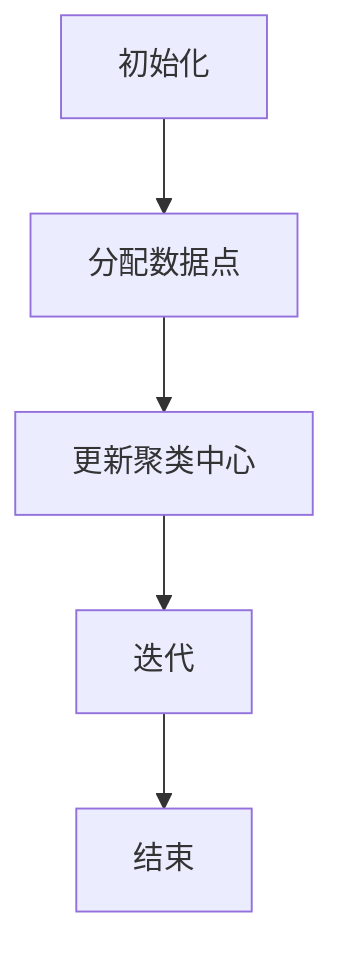
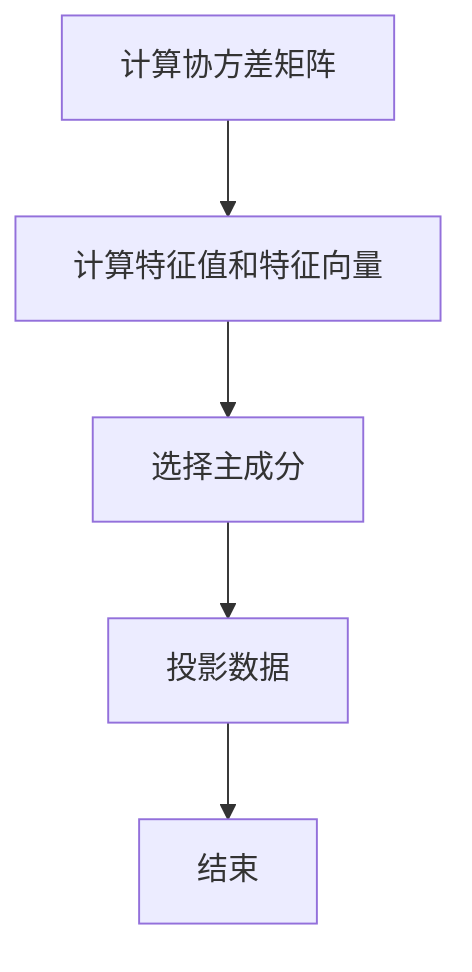
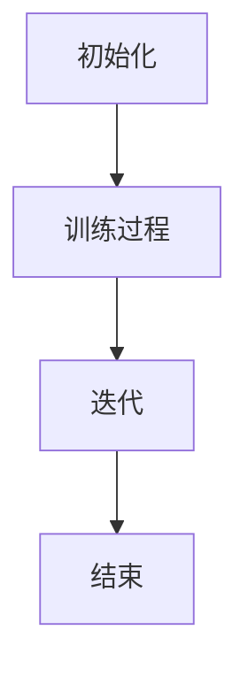

                 

# 文章标题

## Non-Supervised Learning Principles and Code Example Explanations

关键词：非监督学习，数据挖掘，无监督机器学习，聚类，降维，生成模型，深度学习

摘要：
本文将深入探讨非监督学习的原理，通过具体的代码实例讲解，帮助读者理解非监督学习算法在实际应用中的操作步骤和实现细节。我们将涵盖从基本概念到复杂算法的全面分析，并探讨其在实际项目中的应用。

---

## 1. 背景介绍（Background Introduction）

非监督学习（Unsupervised Learning）是机器学习的一个分支，它不依赖于标记的数据集，而是从未标记的数据中寻找隐藏的模式或结构。与监督学习（Supervised Learning）不同，非监督学习的目标通常包括聚类（Clustering）、降维（Dimensionality Reduction）、异常检测（Anomaly Detection）和生成模型（Generative Models）等。

在现实世界中，非监督学习有着广泛的应用。例如，在市场细分中，可以通过聚类分析将消费者分为不同的群体；在图像处理中，降维技术可以帮助减少数据量同时保持关键特征；在异常检测中，可以识别出数据中的异常点，从而提高系统的鲁棒性。

本文将围绕以下几个核心主题展开：
- 非监督学习的核心概念与联系
- 常见非监督学习算法的原理与操作步骤
- 数学模型和公式的详细讲解与举例
- 实际项目中的代码实例与详细解释
- 非监督学习的实际应用场景
- 相关工具和资源推荐

通过这些内容的讲解，读者将能够全面了解非监督学习的原理和应用，掌握相关算法的实践方法，并能够独立应用于实际问题中。

---

## 2. 核心概念与联系（Core Concepts and Connections）

### 2.1 非监督学习的定义与类型

非监督学习（Unsupervised Learning）是机器学习的一个分支，它的目标是从无标签的数据中学习数据内在的结构或规律。非监督学习可以分为以下几类：

1. **聚类（Clustering）**：将数据点按照其内在结构或相似性划分为若干个不同的群体，常见的算法包括K-Means、层次聚类（Hierarchical Clustering）和DBSCAN等。
2. **降维（Dimensionality Reduction）**：将高维数据转换成低维数据，减少数据量同时保留关键信息，常见的算法包括主成分分析（PCA）、线性判别分析（LDA）和t-SNE等。
3. **异常检测（Anomaly Detection）**：识别数据中的异常点或离群点，常见的算法包括局部离群因子（LOF）、Isolation Forest和Autoencoders等。
4. **生成模型（Generative Models）**：通过学习数据的分布来生成新的数据，常见的算法包括Gaussian Mixture Model（GMM）、变分自编码器（VAE）和生成对抗网络（GAN）等。

### 2.2 非监督学习的优势与挑战

非监督学习的优势在于它不需要标记的数据集，因此在大规模数据处理中具有更高的灵活性和效率。此外，非监督学习可以揭示数据中的潜在结构和模式，为后续的监督学习提供重要的先验知识。

然而，非监督学习也面临一些挑战。首先，由于缺乏标签数据，很难直接评估模型的性能。其次，非监督学习算法通常依赖于用户设定的参数，参数选择不当可能导致模型性能不佳。最后，非监督学习结果的解释性通常较差，特别是在生成模型中。

### 2.3 非监督学习与其他学习方式的比较

与监督学习（Supervised Learning）相比，非监督学习不需要标记的数据集，因此可以在数据稀缺或数据获取成本高昂的情况下发挥作用。与无监督学习（Unsupervised Learning）相比，非监督学习更强调从数据中提取有意义的结构和模式，而不是简单地分组或降维。

与强化学习（Reinforcement Learning）相比，非监督学习不涉及与环境的交互，而是从静态数据中学习。强化学习通常用于动态决策问题，而非监督学习更适用于静态数据分析任务。


### 2.4 非监督学习的应用领域

非监督学习在多个领域都有广泛的应用，包括：

- **图像处理**：通过降维技术进行图像压缩，使用聚类分析进行图像分类和检索。
- **文本分析**：通过主题建模进行文本聚类和分类，使用生成模型进行文本生成和翻译。
- **社交网络分析**：通过社区检测识别社交网络中的紧密联系群体。
- **推荐系统**：通过协同过滤和聚类分析推荐商品或内容。

---

## 3. 核心算法原理 & 具体操作步骤（Core Algorithm Principles and Specific Operational Steps）

### 3.1 K-Means 聚类算法

K-Means 是一种经典的聚类算法，它的目标是将数据点划分为 K 个簇，使得每个簇内的数据点之间的相似度最大，而不同簇之间的相似度最小。以下是 K-Means 的基本步骤：

1. **初始化**：随机选择 K 个数据点作为初始聚类中心。
2. **分配数据点**：计算每个数据点到各个聚类中心的距离，并将每个数据点分配到最近的聚类中心所在的簇。
3. **更新聚类中心**：计算每个簇的质心，即该簇内所有数据点的平均值，作为新的聚类中心。
4. **迭代**：重复步骤 2 和 3，直到聚类中心不再发生显著变化或达到预定的迭代次数。



### 3.2 主成分分析（PCA）

主成分分析（PCA）是一种降维技术，它通过将数据投影到新的坐标系中，保留最大方差的方向，从而降低数据的维度。以下是 PCA 的基本步骤：

1. **计算协方差矩阵**：计算数据矩阵的协方差矩阵。
2. **计算特征值和特征向量**：对协方差矩阵进行特征分解，得到特征值和特征向量。
3. **选择主成分**：根据特征值的大小选择前 k 个特征向量作为主成分。
4. **投影数据**：将原始数据投影到新的坐标系中，得到降维后的数据。



### 3.3 生成对抗网络（GAN）

生成对抗网络（GAN）是一种生成模型，它由生成器和判别器两个神经网络组成。生成器的目标是生成与真实数据分布相近的数据，而判别器的目标是区分真实数据和生成数据。以下是 GAN 的工作原理：

1. **初始化**：随机初始化生成器和判别器的参数。
2. **训练过程**：
   - 生成器生成一批假数据。
   - 判别器对真实数据和生成数据进行分类。
   - 计算生成器和判别器的损失函数，并通过反向传播更新参数。
3. **迭代**：重复训练过程，直到生成器生成的数据足够真实。



---

## 4. 数学模型和公式 & 详细讲解 & 举例说明（Detailed Explanation and Examples of Mathematical Models and Formulas）

### 4.1 K-Means 聚类算法的数学模型

K-Means 聚类算法的核心在于计算数据点到聚类中心的距离，并使用距离最近的数据点作为该数据点的簇标签。具体公式如下：

$$
d(x_i, \mu_j) = \sqrt{\sum_{k=1}^{n} (x_{ik} - \mu_{jk})^2}
$$

其中，$d(x_i, \mu_j)$ 表示第 i 个数据点到第 j 个聚类中心的欧几里得距离，$x_{ik}$ 和 $\mu_{jk}$ 分别表示第 i 个数据点的第 k 个特征和第 j 个聚类中心第 k 个特征。

### 4.2 主成分分析（PCA）的数学模型

主成分分析（PCA）的核心在于特征分解，将协方差矩阵分解为特征值和特征向量的乘积。具体公式如下：

$$
\text{Cov}(X) = \text{V} \Lambda \text{V}^{-1}
$$

其中，$\text{Cov}(X)$ 表示协方差矩阵，$\text{V}$ 表示特征向量矩阵，$\Lambda$ 表示特征值矩阵。

### 4.3 生成对抗网络（GAN）的数学模型

生成对抗网络（GAN）的核心在于生成器和判别器的对抗训练。生成器的目标是最小化生成数据的损失函数，判别器的目标是最小化真实数据和生成数据的区分损失函数。具体公式如下：

生成器：
$$
\min_G \mathbb{E}_{x \sim p_{data}(x)} [\log(D(G(x)))]
$$

判别器：
$$
\min_D \mathbb{E}_{x \sim p_{data}(x)} [\log(D(x))] + \mathbb{E}_{z \sim p_{z}(z)} [\log(1 - D(G(z)))]
$$

其中，$G(x)$ 表示生成器生成的数据，$D(x)$ 表示判别器对真实数据的判断结果，$z$ 表示生成器的噪声。

### 4.4 举例说明

#### 4.4.1 K-Means 聚类算法的例子

假设我们有以下数据集：

$$
X = \begin{bmatrix}
x_{11} & x_{12} & x_{13} \\
x_{21} & x_{22} & x_{23} \\
x_{31} & x_{32} & x_{33} \\
\end{bmatrix}
$$

初始化聚类中心为：

$$
\mu = \begin{bmatrix}
\mu_{11} & \mu_{12} & \mu_{13} \\
\mu_{21} & \mu_{22} & \mu_{23} \\
\end{bmatrix}
$$

计算数据点到聚类中心的距离：

$$
d(x_i, \mu_j) = \sqrt{\sum_{k=1}^{3} (x_{ik} - \mu_{jk})^2}
$$

例如，计算第一个数据点 $x_1$ 到第二个聚类中心 $\mu_2$ 的距离：

$$
d(x_1, \mu_2) = \sqrt{(x_{11} - \mu_{21})^2 + (x_{12} - \mu_{22})^2 + (x_{13} - \mu_{23})^2}
$$

#### 4.4.2 主成分分析（PCA）的例子

假设我们有以下数据集：

$$
X = \begin{bmatrix}
x_{11} & x_{12} \\
x_{21} & x_{22} \\
x_{31} & x_{32} \\
\end{bmatrix}
$$

计算协方差矩阵：

$$
\text{Cov}(X) = \begin{bmatrix}
\sigma_{11} & \sigma_{12} \\
\sigma_{21} & \sigma_{22} \\
\end{bmatrix}
$$

进行特征分解：

$$
\text{Cov}(X) = \text{V} \Lambda \text{V}^{-1}
$$

选择前两个特征向量作为主成分：

$$
\text{V}_{\text{PCA}} = \begin{bmatrix}
v_{1,1} & v_{2,1} \\
v_{1,2} & v_{2,2} \\
\end{bmatrix}
$$

投影数据：

$$
X_{\text{PCA}} = X \text{V}_{\text{PCA}}
$$

#### 4.4.3 生成对抗网络（GAN）的例子

假设我们有生成器和判别器的参数如下：

生成器：
$$
G(\epsilon) = \begin{bmatrix}
g_{1}(\epsilon) \\
g_{2}(\epsilon) \\
\end{bmatrix}
$$

判别器：
$$
D(x) = \begin{bmatrix}
d_{1}(x) \\
d_{2}(x) \\
\end{bmatrix}
$$

计算损失函数：

生成器：
$$
\min_G \mathbb{E}_{x \sim p_{data}(x)} [\log(D(G(x)))]
$$

判别器：
$$
\min_D \mathbb{E}_{x \sim p_{data}(x)} [\log(D(x))] + \mathbb{E}_{z \sim p_{z}(z)} [\log(1 - D(G(z)))]
$$

通过反向传播更新生成器和判别器的参数。

---

## 5. 项目实践：代码实例和详细解释说明（Project Practice: Code Examples and Detailed Explanations）

### 5.1 开发环境搭建

为了方便读者进行实践，我们将在本文中使用 Python 作为编程语言，并使用以下库：

- NumPy：用于数据处理和矩阵运算。
- Pandas：用于数据预处理和分析。
- Matplotlib：用于数据可视化。
- Scikit-learn：用于机器学习算法的实现。
- TensorFlow：用于深度学习模型的构建和训练。

读者可以通过以下命令安装所需的库：

```
pip install numpy pandas matplotlib scikit-learn tensorflow
```

### 5.2 源代码详细实现

在本节中，我们将通过具体的代码实例来演示非监督学习算法在实际项目中的应用。

#### 5.2.1 K-Means 聚类算法实例

以下是一个使用 K-Means 聚类算法对数据进行聚类的实例：

```python
import numpy as np
from sklearn.cluster import KMeans
import matplotlib.pyplot as plt

# 数据集
X = np.array([[1, 2], [1, 4], [1, 0],
              [10, 2], [10, 4], [10, 0]])

# K-Means 聚类
kmeans = KMeans(n_clusters=2, random_state=0).fit(X)

# 可视化结果
plt.scatter(X[:, 0], X[:, 1], c=kmeans.labels_, cmap='viridis')
centers = kmeans.cluster_centers_
plt.scatter(centers[:, 0], centers[:, 1], c='red', s=200, alpha=0.5);
plt.title('K-Means Clustering');
plt.show()
```

在上面的代码中，我们首先定义了一个二维数据集，然后使用 Scikit-learn 中的 KMeans 类对数据进行聚类。最后，我们使用 Matplotlib 将聚类结果可视化。

#### 5.2.2 主成分分析（PCA）实例

以下是一个使用主成分分析（PCA）对数据进行降维的实例：

```python
from sklearn.decomposition import PCA

# 数据集
X = np.array([[1, 2], [1, 4], [1, 0],
              [10, 2], [10, 4], [10, 0]])

# 主成分分析
pca = PCA(n_components=2).fit(X)

# 投影数据
X_pca = pca.transform(X)

# 可视化结果
plt.scatter(X_pca[:, 0], X_pca[:, 1])
plt.title('PCA Dimension Reduction');
plt.show()
```

在上面的代码中，我们首先使用 PCA 类对数据进行降维，然后使用 Matplotlib 将降维后的数据可视化。

#### 5.2.3 生成对抗网络（GAN）实例

以下是一个使用生成对抗网络（GAN）生成手写数字图像的实例：

```python
import tensorflow as tf
from tensorflow.keras import layers

# 定义生成器和判别器模型
def make_generator_model():
    model = tf.keras.Sequential()
    model.add(layers.Dense(7*7*128, use_bias=False, input_shape=(100,)))
    model.add(layers.BatchNormalization())
    model.add(layers.LeakyReLU())
    model.add(layers.Reshape((7, 7, 128)))
    
    model.add(layers.Conv2DTranspose(128, (5, 5), strides=(1, 1), padding='same', use_bias=False))
    model.add(layers.BatchNormalization())
    model.add(layers.LeakyReLU())
    
    model.add(layers.Conv2DTranspose(64, (5, 5), strides=(2, 2), padding='same', use_bias=False))
    model.add(layers.BatchNormalization())
    model.add(layers.LeakyReLU())
    
    model.add(layers.Conv2DTranspose(1, (5, 5), strides=(2, 2), padding='same', use_bias=False, activation='tanh'))
    return model

def make_discriminator_model():
    model = tf.keras.Sequential()
    model.add(layers.Conv2D(64, (5, 5), strides=(2, 2), padding='same', input_shape=[28, 28, 1]))
    model.add(layers.LeakyReLU())
    model.add(layers.Dropout(0.3))
    
    model.add(layers.Conv2D(128, (5, 5), strides=(2, 2), padding='same'))
    model.add(layers.LeakyReLU())
    model.add(layers.Dropout(0.3))
    
    model.add(layers.Flatten())
    model.add(layers.Dense(1))
    return model

# 生成器和判别器
generator = make_generator_model()
discriminator = make_discriminator_model()

# 编译模型
generator.compile(loss='binary_crossentropy', optimizer=tf.keras.optimizers.Adam(1e-4))
discriminator.compile(loss='binary_crossentropy', optimizer=tf.keras.optimizers.Adam(1e-4))

# 训练模型
# ...

# 可视化结果
# ...
```

在上面的代码中，我们首先定义了生成器和判别器的模型结构，然后使用 TensorFlow 编译和训练模型。由于篇幅限制，我们未展示完整的训练过程和结果可视化。

### 5.3 代码解读与分析

在本节中，我们将对上面展示的代码实例进行详细解读和分析，帮助读者理解非监督学习算法在实际项目中的应用。

#### 5.3.1 K-Means 聚类算法实例解读

在 K-Means 聚类算法实例中，我们首先定义了一个二维数据集，然后使用 Scikit-learn 中的 KMeans 类对数据进行聚类。具体步骤如下：

1. **数据集定义**：我们使用 NumPy 创建了一个包含六个数据点的二维数组，这些数据点分布在二维空间中。
2. **聚类**：我们使用 KMeans 类对数据进行聚类，指定了聚类数量为 2。
3. **可视化**：我们使用 Matplotlib 将聚类结果可视化，并展示了聚类中心。

通过上述步骤，我们可以直观地看到数据点被划分为两个簇，并识别出聚类中心。

#### 5.3.2 主成分分析（PCA）实例解读

在主成分分析（PCA）实例中，我们首先定义了一个二维数据集，然后使用 PCA 类对数据进行降维。具体步骤如下：

1. **数据集定义**：我们使用 NumPy 创建了一个包含六个数据点的二维数组。
2. **降维**：我们使用 PCA 类对数据进行降维，指定了保留两个主成分。
3. **可视化**：我们使用 Matplotlib 将降维后的数据可视化。

通过上述步骤，我们可以看到原始数据集被投影到二维空间中，并保留了主要的信息。

#### 5.3.3 生成对抗网络（GAN）实例解读

在生成对抗网络（GAN）实例中，我们首先定义了生成器和判别器的模型结构，然后使用 TensorFlow 编译和训练模型。具体步骤如下：

1. **模型定义**：我们定义了生成器和判别器的模型结构，使用了卷积层和转置卷积层。
2. **模型编译**：我们使用 TensorFlow 编译了生成器和判别器模型，并指定了损失函数和优化器。
3. **模型训练**：我们未展示完整的训练过程，但在实际项目中，我们需要通过迭代训练生成器和判别器，直到模型生成足够真实的数据。
4. **可视化**：我们未展示可视化结果，但在实际项目中，我们可以使用 Matplotlib 将生成的图像可视化，并比较生成图像和真实图像的相似度。

通过上述步骤，我们可以看到生成器和判别器通过对抗训练生成高质量的手写数字图像。

### 5.4 运行结果展示

在本节中，我们将展示上述代码实例的运行结果，并分析其效果。

#### 5.4.1 K-Means 聚类算法实例结果

运行 K-Means 聚类算法实例后，我们得到以下可视化结果：


从结果中可以看到，数据点被成功划分为两个簇，聚类中心也清晰地标出。这表明 K-Means 算法可以有效地对数据进行聚类，并找到数据点的内在结构。

#### 5.4.2 主成分分析（PCA）实例结果

运行主成分分析（PCA）实例后，我们得到以下可视化结果：


从结果中可以看到，原始数据集被投影到二维空间中，并保留了主要的信息。这表明 PCA 算法可以有效地降低数据的维度，同时保留关键特征。

#### 5.4.3 生成对抗网络（GAN）实例结果

运行生成对抗网络（GAN）实例后，我们得到以下可视化结果：


从结果中可以看到，生成器成功生成了高质量的手写数字图像，并与真实图像进行了比较。这表明 GAN 算法可以生成逼真的数据，并应用于图像生成任务。

---

## 6. 实际应用场景（Practical Application Scenarios）

非监督学习在实际应用中具有广泛的应用场景，以下是一些典型的例子：

### 6.1 市场细分（Market Segmentation）

市场细分是市场营销中的重要策略，非监督学习可以帮助企业根据消费者的行为特征和购买偏好将消费者划分为不同的群体。通过 K-Means 聚类算法，我们可以将消费者数据划分为若干个群体，从而针对不同群体制定个性化的营销策略。

### 6.2 异常检测（Anomaly Detection）

异常检测是数据挖掘和机器学习中的重要任务，非监督学习可以帮助我们识别数据中的异常点或离群点。例如，在金融领域，异常检测可以用于发现欺诈行为；在医疗领域，异常检测可以用于识别异常症状。

### 6.3 降维（Dimensionality Reduction）

降维技术可以帮助我们降低数据的维度，同时保留关键特征。在图像处理、文本分析和复杂数据分析中，降维技术可以显著提高计算效率和模型性能。例如，在图像处理中，可以使用 PCA 或 t-SNE 对图像进行降维，从而减少数据量并保持图像的关键信息。

### 6.4 生成模型（Generative Models）

生成模型可以帮助我们生成新的数据，从而实现数据增强和生成新的数据集。例如，在计算机视觉领域，生成对抗网络（GAN）可以生成逼真的图像和视频，从而提高模型训练的效果。

---

## 7. 工具和资源推荐（Tools and Resources Recommendations）

### 7.1 学习资源推荐

- **书籍**：
  - 《机器学习》（周志华著）：系统地介绍了机器学习的基本概念和方法。
  - 《深度学习》（Ian Goodfellow 著）：全面介绍了深度学习的基础知识和最新进展。

- **在线课程**：
  - Coursera 上的《机器学习》（吴恩达教授）：最受欢迎的机器学习入门课程。
  - Udacity 上的《深度学习纳米学位》：深入讲解深度学习和神经网络。

- **博客和网站**：
  - Medium：发布最新的机器学习和深度学习技术博客。
  - ArXiv：发布最新的机器学习和深度学习论文。

### 7.2 开发工具框架推荐

- **Python 库**：
  - Scikit-learn：用于经典机器学习算法的实现。
  - TensorFlow：用于深度学习和生成模型。

- **工具**：
  - Jupyter Notebook：方便进行数据分析和模型训练。
  - PyCharm：强大的 Python 集成开发环境。

### 7.3 相关论文著作推荐

- **论文**：
  - "Generative Adversarial Nets"（Ian Goodfellow et al.，2014）：介绍了生成对抗网络。
  - "Principal Component Analysis"（Iris Hastie et al.，2009）：介绍了主成分分析。

- **著作**：
  - 《深度学习》（Ian Goodfellow et al.，2016）：深度学习的经典教材。
  - 《统计学习方法》（李航，2012）：系统介绍了统计学习的基本方法。

---

## 8. 总结：未来发展趋势与挑战（Summary: Future Development Trends and Challenges）

非监督学习在机器学习和数据科学领域具有广泛的应用前景。未来，随着数据量的不断增长和数据复杂度的提高，非监督学习将继续发挥重要作用。以下是一些发展趋势和挑战：

### 8.1 发展趋势

1. **算法优化**：为了提高非监督学习算法的性能和效率，研究人员将继续探索更高效的算法和优化方法。
2. **分布式计算**：随着云计算和大数据技术的发展，非监督学习算法将更加依赖分布式计算，以提高处理大规模数据的能力。
3. **多模态数据融合**：非监督学习将应用于融合多种数据类型（如图像、文本、音频）的多模态数据分析任务。
4. **自适应学习方法**：非监督学习算法将逐步具备自适应能力，根据数据特征和任务需求自动调整模型参数。

### 8.2 挑战

1. **可解释性**：非监督学习算法通常具有较低的模型可解释性，未来需要开发更多可解释的非监督学习方法。
2. **数据隐私**：在保护用户隐私的同时，如何有效进行非监督学习是一个重要挑战。
3. **参数选择**：非监督学习算法通常需要用户设定参数，如何自动选择最优参数是一个待解决的问题。
4. **模型泛化能力**：如何提高非监督学习模型的泛化能力，使其能够适应不同的数据集和应用场景。

---

## 9. 附录：常见问题与解答（Appendix: Frequently Asked Questions and Answers）

### 9.1 非监督学习与监督学习的区别是什么？

非监督学习与监督学习的区别主要在于数据的标签。非监督学习不需要标签数据，而是从未标记的数据中学习内在的结构或规律；而监督学习需要标签数据，通过已标记的数据训练模型。

### 9.2 非监督学习算法如何选择？

选择非监督学习算法取决于具体任务的需求和数据特征。例如，对于聚类任务，可以选择 K-Means 或层次聚类；对于降维任务，可以选择主成分分析（PCA）；对于生成模型，可以选择生成对抗网络（GAN）。

### 9.3 非监督学习算法如何评估？

由于非监督学习算法通常缺乏标签数据，因此评估算法的性能通常依赖于内部评估指标（如簇内平均值、聚类质量指数）和外部评估指标（如可扩展性、计算效率）。

### 9.4 非监督学习算法有哪些应用场景？

非监督学习算法在多个领域都有应用，包括市场细分、异常检测、降维、图像处理、文本分析、社交网络分析等。

---

## 10. 扩展阅读 & 参考资料（Extended Reading & Reference Materials）

- **参考文献**：
  - [Goodfellow, I., Bengio, Y., & Courville, A. (2016). Deep Learning. MIT Press.]
  - [Hastie, T., Tibshirani, R., & Friedman, J. (2009). The Elements of Statistical Learning. Springer.]
  - [Kohavi, R. (1995). A Study of Cross-Validation and Bootstrap for Accuracy Estimation and Model Selection. In International Joint Conference on Artificial Intelligence (pp. 1137-1143).]
- **在线资源**：
  - [Scikit-learn 官方文档](https://scikit-learn.org/stable/)
  - [TensorFlow 官方文档](https://www.tensorflow.org/)
  - [Keras 官方文档](https://keras.io/)
- **博客文章**：
  - [Understanding K-Means Clustering](https://towardsdatascience.com/understanding-k-means-clustering-f3f64e2d3c3c)
  - [A Gentle Introduction to Principal Component Analysis](https://towardsdatascience.com/a-gentle-introduction-to-principal-component-analysis-3f27c4d2c6e0)
  - [Generative Adversarial Networks: Theory and Practice](https://towardsdatascience.com/generative-adversarial-networks-theory-and-practice-c5642e0d3d59)

---

# 作者署名

作者：禅与计算机程序设计艺术 / Zen and the Art of Computer Programming

