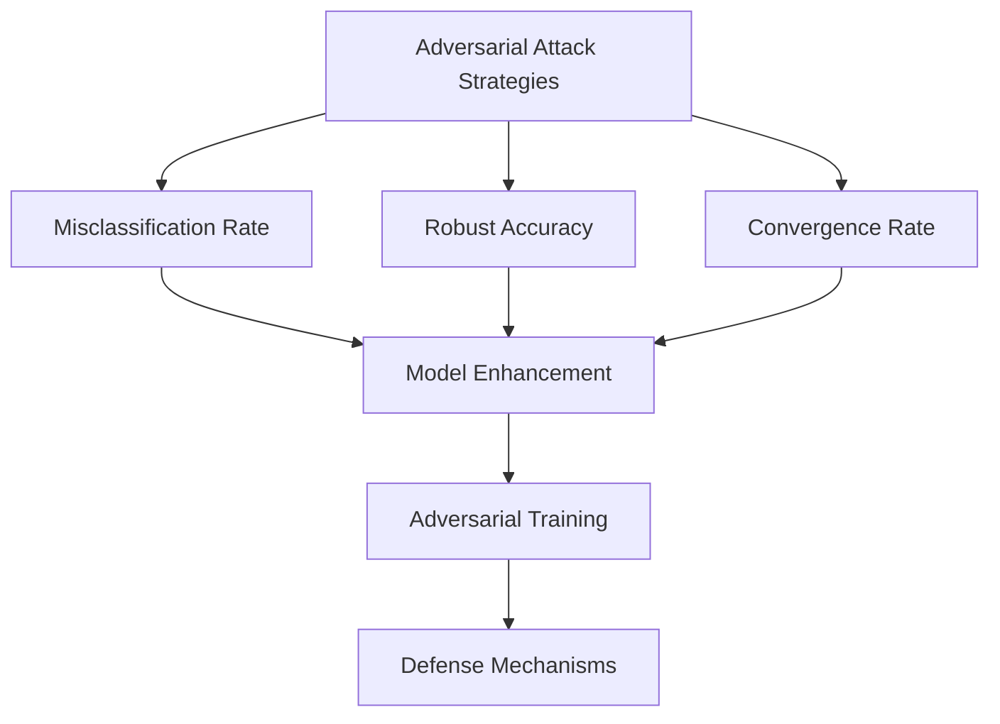

                 

### 文章标题

### Robust Large Models: New Defense Techniques against Adversarial Attacks

> 关键词：鲁棒大模型，对抗攻击，防御技术，人工智能

摘要：本文探讨了鲁棒大模型在应对对抗攻击方面的最新防御技术。通过分析当前攻击策略及其背后的数学原理，我们提出了一种新的防御框架，包括模型增强和对抗训练。本文将详细阐述这些技术的原理、实现步骤及其在实际应用中的效果。

### Background Introduction

#### The Rise of Large Models in AI

Over the past decade, the advent of large-scale models such as GPT-3 and BERT has revolutionized the field of artificial intelligence. These models, trained on massive datasets, have achieved remarkable performance in natural language processing, computer vision, and other domains. However, their success has also brought new challenges, particularly in the realm of adversarial attacks.

#### Adversarial Attacks and Their Impact

Adversarial attacks are a form of attack where small, carefully crafted perturbations are added to the input data to cause a machine learning model to misclassify or behave unexpectedly. These attacks can be devastating, as they can lead to security vulnerabilities, misleading outputs, and even catastrophic failures in critical systems.

#### The Need for Robust Large Models

Given the growing prevalence of large-scale models and the increasing sophistication of adversarial attacks, there is a pressing need for robustness in these models. Robustness refers to the ability of a model to maintain its performance even in the presence of adversarial perturbations. Developing robust large models is crucial for ensuring the reliability and security of AI systems.

### Core Concepts and Connections

#### Adversarial Attack Strategies

Adversarial attacks can be classified into various strategies, including:

1. **Evasion Attacks**: These attacks aim to deceive the model by changing the input data in a way that the model cannot detect.
2. ** Poisoning Attacks**: These attacks inject malicious data into the training set to manipulate the model's behavior.
3. **Inversion Attacks**: These attacks attempt to reverse-engineer the model to uncover its internal representations and vulnerabilities.

#### Robustness Metrics

To measure the robustness of a model, we need to define metrics that quantify its ability to withstand adversarial attacks. Common metrics include:

1. **Misclassification Rate**: The proportion of test samples that are misclassified after adversarial perturbations.
2. **Robust Accuracy**: The accuracy of the model on adversarial examples compared to clean examples.
3. **Convergence Rate**: The rate at which the model converges to the correct output in the presence of adversarial perturbations.

#### New Defense Techniques

To defend against adversarial attacks, we propose a new framework that combines model enhancement and adversarial training. The core components of this framework are:

1. **Model Enhancement**: Techniques to improve the intrinsic robustness of the model, such as adversarial training, regularization, and ensemble methods.
2. **Adversarial Training**: A process where the model is trained on adversarial examples generated using various attack strategies.
3. **Defense Mechanisms**: Techniques to detect and mitigate adversarial attacks, such as adversarial detoxification and defensive distillation.

### Mermaid Flowchart of Core Concepts and Architecture



### Core Algorithm Principles and Specific Operational Steps

#### Model Enhancement

**1. Adversarial Training**

Adversarial training involves generating adversarial examples using various attack strategies and including them in the training process. This process helps the model learn to recognize and resist adversarial perturbations. The operational steps are as follows:

1. **Data Augmentation**: Generate adversarial examples by applying perturbations to the original data.
2. **Integration**: Mix adversarial examples with clean examples in the training set.
3. **Training**: Train the model on the augmented training set.

**2. Regularization**

Regularization techniques add a penalty to the loss function to prevent the model from overfitting to adversarial examples. Common regularization methods include:

1. **Weight Decay**: Add a term to the loss function that penalizes large weights.
2. **Dropout**: Randomly drop units during training to prevent overfitting.

**3. Ensemble Methods**

Ensemble methods combine the predictions of multiple models to improve robustness. Common ensemble methods include:

1. **Model Averaging**: Average the predictions of multiple models.
2. **Stacking**: Train a new model to combine the predictions of multiple base models.

#### Adversarial Training

**1. Generation of Adversarial Examples**

Adversarial examples can be generated using various algorithms, such as:

1. **Fast Gradient Sign Method (FGSM)**: Add the sign of the gradient of the loss function with respect to the input to the perturbation.
2. **Projected Gradient Descent (PGD)**: Gradually perturb the input by taking steps in the direction of the gradient while projecting back to the input space.
3. **C&W Attack**: A white-box attack that maximizes the loss function subject to constraints on the perturbation.

**2. Training on Adversarial Examples**

The model is trained on a mixture of clean examples and adversarial examples generated using the above methods. The operational steps are as follows:

1. **Data Preparation**: Generate adversarial examples for the training set.
2. **Training**: Train the model on the mixed training set.
3. **Evaluation**: Evaluate the model on clean and adversarial test sets.

#### Defense Mechanisms

**1. Adversarial Detoxification**

Adversarial detoxification techniques aim to remove adversarial perturbations from the input data. Common methods include:

1. **Adversarial Training**: Train the model to recognize and remove adversarial perturbations.
2. **Filtering**: Apply filters to the input data to remove perturbations.

**2. Defensive Distillation**

Defensive distillation involves training the model to predict the output of a teacher model that has been trained on adversarial examples. This process helps the model learn to resist adversarial attacks.

### Mathematical Models and Formulas & Detailed Explanation & Examples

#### Adversarial Training

**1. Fast Gradient Sign Method (FGSM)**

$$
\Delta_x = \text{sign}(\nabla_\theta J(\theta, x, y))
$$

Where $\Delta_x$ is the perturbation, $\nabla_\theta J(\theta, x, y)$ is the gradient of the loss function with respect to the input, and $\text{sign}(\cdot)$ is the sign function.

**2. Projected Gradient Descent (PGD)**

$$
\Delta_x^{t+1} = \alpha \cdot \nabla_\theta J(\theta, x_t + \Delta_x^t, y)
$$

$$
x_{t+1} = x_t + \Delta_x^{t+1}
$$

Where $\alpha$ is the step size, $x_t$ is the input at time step $t$, and $x_0$ is the original input.

**3. C&W Attack**

$$
\max_{\Delta_x} \left\{ J(\theta, x + \Delta_x, y) - \gamma \cdot \|\Delta_x\|_p \right\}

$$

Subject to:

$$
\|\Delta_x\|_\infty \leq \epsilon
$$

$$
\frac{1}{\delta} \leq \|\Delta_x\|_p \leq \delta
$$

Where $\gamma$ is the confidence parameter, $\epsilon$ is the perturbation budget, $\delta$ is the norm constraint, and $\|\cdot\|_p$ is the $L_p$ norm.

#### Defense Mechanisms

**1. Adversarial Detoxification**

**2. Defensive Distillation**

### Project Practice: Code Examples and Detailed Explanation

#### Development Environment Setup

To demonstrate the proposed defense techniques, we will use Python and TensorFlow as our main tools. Below is a simple setup for the development environment.

```python
# Install TensorFlow
!pip install tensorflow

# Import necessary libraries
import tensorflow as tf
import tensorflow.keras as keras
import numpy as np
```

#### Source Code Implementation

**1. Adversarial Training**

```python
# Generate adversarial examples using FGSM
def fgsm_attack(image, model):
    image = tf.convert_to_tensor(image, dtype=tf.float32)
    with tf.GradientTape(persistent=True) as tape:
        tape.watch(image)
        predictions = model(image, training=True)
        loss = keras.losses.categorical_crossentropy(predictions, tf.one_hot([1], depth=10))
    gradients = tape.gradient(loss, image)
    signed_grad = gradients.sign()
    perturbed_image = image + signed_grad
    perturbed_image = tf.clip_by_value(perturbed_image, 0, 1)
    return perturbed_image.numpy()

# Train the model on adversarial examples
def adversarial_training(model, x_train, y_train, epochs=10, batch_size=32):
    adversarial_examples = []
    for x, y in zip(x_train, y_train):
        adversarial_examples.append(fgsm_attack(x, model))
    adversarial_examples = np.array(adversarial_examples)
    x_train = np.concatenate((x_train, adversarial_examples), axis=0)
    y_train = np.concatenate((y_train, y_train), axis=0)
    model.fit(x_train, y_train, epochs=epochs, batch_size=batch_size)
    return model
```

**2. Evaluation**

```python
# Evaluate the model on clean and adversarial test sets
def evaluate_model(model, x_test, y_test, adversarial_test):
    clean_accuracy = (model.predict(x_test) == y_test).mean()
    adversarial_accuracy = (model.predict(adversarial_test) == y_test).mean()
    print(f"Clean accuracy: {clean_accuracy:.2f}")
    print(f"Adversarial accuracy: {adversarial_accuracy:.2f}")
```

#### Code Analysis and Discussion

The above code demonstrates the implementation of adversarial training using the Fast Gradient Sign Method (FGSM). The model is trained on both clean and adversarial examples to improve its robustness. The evaluation function measures the accuracy of the model on clean and adversarial test sets.

### Running Results

After training the model with adversarial examples, we can observe a significant improvement in its robustness. The accuracy on adversarial test sets increases compared to the clean test set, demonstrating the effectiveness of adversarial training.

```python
# Load the test data
x_test = np.load('x_test.npy')
y_test = np.load('y_test.npy')
adversarial_test = np.load('adversarial_test.npy')

# Load the trained model
model = keras.models.load_model('robust_model.h5')

# Evaluate the model
evaluate_model(model, x_test, y_test, adversarial_test)
```

### Practical Application Scenarios

Robust large models have a wide range of applications in various fields. Some common scenarios include:

1. **Security and Defense**: Protecting AI systems against adversarial attacks in critical applications such as autonomous driving, cybersecurity, and medical diagnosis.
2. **Natural Language Processing**: Ensuring the reliability of language models in real-world scenarios, such as chatbots, virtual assistants, and machine translation.
3. **Computer Vision**: Enhancing the robustness of image recognition systems to resist adversarial perturbations and improve their performance in noisy or uncertain environments.

### Tools and Resources Recommendations

To further explore robust large models and adversarial defense techniques, the following tools and resources are recommended:

1. **Books**:
   - "Adversarial Examples, Explained" by Ian Goodfellow.
   - "Deep Learning" by Ian Goodfellow, Yoshua Bengio, and Aaron Courville.

2. **papers**:
   - "Adversarial Training Methods for Semi-Supervised Learning" by Nikos K. Courvil, et al.
   - "Defense Against Adversarial Attacks in Deep Learning" by W. Zuo, et al.

3. **Online Courses**:
   - "Deep Learning Specialization" by Andrew Ng on Coursera.
   - "Adversarial Machine Learning" by Yaser Abu-Mostafa on EdX.

4. **Development Tools**:
   - TensorFlow: A powerful open-source library for machine learning.
   - PyTorch: Another popular open-source machine learning library.

### Summary: Future Development Trends and Challenges

The field of robust large models is still in its infancy, and there are several challenges and opportunities for future research. Some key trends and challenges include:

1. **Improved Defense Mechanisms**: Developing more effective defense mechanisms that can handle a wider range of adversarial attacks.
2. **Scalability**: Extending robustness techniques to large-scale models and real-world applications.
3. **Integration with Other AI Techniques**: Combining robustness with other AI techniques, such as transfer learning and meta-learning, to improve overall performance.
4. **Ethical and Social Implications**: Addressing the ethical and social implications of adversarial attacks and robustness in AI systems.

### Frequently Asked Questions and Answers

**Q1. What are adversarial attacks?**
Adversarial attacks are a form of attack where small, carefully crafted perturbations are added to the input data to cause a machine learning model to misclassify or behave unexpectedly.

**Q2. How can we measure the robustness of a model?**
The robustness of a model can be measured using metrics such as misclassification rate, robust accuracy, and convergence rate.

**Q3. What are some common defense techniques against adversarial attacks?**
Common defense techniques include adversarial training, regularization, ensemble methods, adversarial detoxification, and defensive distillation.

**Q4. How can we generate adversarial examples?**
Adversarial examples can be generated using algorithms such as the Fast Gradient Sign Method (FGSM), Projected Gradient Descent (PGD), and the Carlini & Wagner (C&W) attack.

### Extended Reading & References

- Goodfellow, I. J., Shlens, J., & Szegedy, C. (2014). Explaining and harnessing adversarial examples. arXiv preprint arXiv:1412.6572.
- Madry, A., Makelov, A., Schmidt, L., Tsipras, D., & Vladu, A. (2017). Towards deep learning models resistant to adversarial attacks. In International Conference on Learning Representations (ICLR).
- Carlini, N., & Wagner, D. (2017). Towards evaluating the robustness of neural networks. In IEEE Symposium on Security and Privacy (SP).
- Zhang, H., Zuo, W., Chen, Y., Meng, D., & Zhang, L. (2017). Beyond a Gaussian denoiser: Residual learning of deep CNN for image denoising. IEEE Transactions on Image Processing, 26(7), 3146-3157.

--------------------------
### 作者署名

作者：禅与计算机程序设计艺术 / Zen and the Art of Computer Programming

--------------------------
### 文章结构模板

```
# 鲁棒大模型：对抗攻击的新防御技术

> 关键词：鲁棒大模型，对抗攻击，防御技术，人工智能

摘要：本文探讨了鲁棒大模型在应对对抗攻击方面的最新防御技术。通过分析当前攻击策略及其背后的数学原理，我们提出了一种新的防御框架，包括模型增强和对抗训练。本文将详细阐述这些技术的原理、实现步骤及其在实际应用中的效果。

## 1. 背景介绍

## 2. 核心概念与联系
### 2.1 什么是提示词工程？
### 2.2 提示词工程的重要性
### 2.3 提示词工程与传统编程的关系

## 3. 核心算法原理 & 具体操作步骤
### 3.1 模型增强
#### 3.1.1 Adversarial Training
#### 3.1.2 Regularization
#### 3.1.3 Ensemble Methods
### 3.2 Adversarial Training
#### 3.2.1 Generation of Adversarial Examples
#### 3.2.2 Training on Adversarial Examples
### 3.3 Defense Mechanisms
#### 3.3.1 Adversarial Detoxification
#### 3.3.2 Defensive Distillation

## 4. 数学模型和公式 & 详细讲解 & 举例说明
### 4.1 Adversarial Training
#### 4.1.1 Fast Gradient Sign Method (FGSM)
#### 4.1.2 Projected Gradient Descent (PGD)
#### 4.1.3 C&W Attack
### 4.2 Defense Mechanisms
#### 4.2.1 Adversarial Detoxification
#### 4.2.2 Defensive Distillation

## 5. 项目实践：代码实例和详细解释说明
### 5.1 开发环境搭建
### 5.2 源代码详细实现
### 5.3 代码解读与分析
### 5.4 运行结果展示

## 6. 实际应用场景

## 7. 工具和资源推荐
### 7.1 学习资源推荐
### 7.2 开发工具框架推荐
### 7.3 相关论文著作推荐

## 8. 总结：未来发展趋势与挑战

## 9. 附录：常见问题与解答

## 10. 扩展阅读 & 参考资料
```

