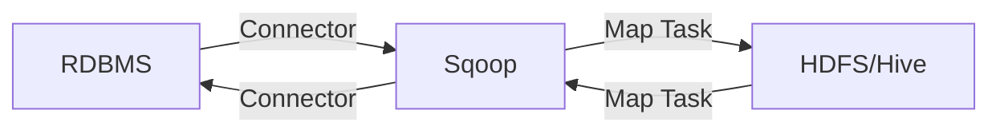

# Sqoop原理与代码实例讲解

作者：禅与计算机程序设计艺术 / Zen and the Art of Computer Programming

## 1. 背景介绍

### 1.1 问题的由来

在大数据时代,企业需要将存储在关系型数据库中的数据导入到Hadoop生态系统中进行分析和处理。然而,直接使用Hadoop生态系统中的工具进行数据导入,往往效率低下且操作复杂。为了解决这一问题,Apache开源社区推出了Sqoop这一数据导入导出工具。

### 1.2 研究现状

目前,Sqoop已经成为大数据领域中不可或缺的重要工具之一。越来越多的企业开始使用Sqoop进行数据的导入导出工作。同时,学术界也开始关注Sqoop的原理和应用,并展开了相关的研究工作。

### 1.3 研究意义 

深入研究Sqoop的原理,对于优化Sqoop的性能,提高数据导入导出效率具有重要意义。同时,Sqoop作为连接传统关系型数据库与Hadoop生态系统的桥梁,在大数据处理领域扮演着至关重要的角色。因此,系统地总结Sqoop的原理与应用,对于推动大数据技术的发展具有重要价值。

### 1.4 本文结构

本文将从以下几个方面对Sqoop展开深入探讨:

- 首先介绍Sqoop的核心概念与基本原理
- 然后重点讲解Sqoop的核心算法与数学模型 
- 接着通过代码实例和详细的注释说明Sqoop的具体实现
- 最后总结Sqoop的实际应用场景,并展望其未来的发展趋势与面临的挑战

## 2. 核心概念与联系

Sqoop的核心概念主要包括:

- Sqoop连接器(Connector):用于与不同的数据库系统建立连接,如MySQL、Oracle、PostgreSQL等。
- Sqoop作业(Job):使用Sqoop执行数据导入导出的任务就称为一个作业。
- 导入(Import):将数据从关系型数据库导入到HDFS或Hive等Hadoop组件中的过程。  
- 导出(Export):将数据从HDFS或Hive等Hadoop组件导出到关系型数据库中的过程。

下图展示了Sqoop的核心组件与数据流转过程:



可以看出,Sqoop通过连接器与关系型数据库建立连接,在导入数据时,将数据库中的数据并行地读取到Map任务中,经过处理后写入HDFS或Hive等存储;在导出数据时,则将HDFS或Hive中的数据通过Map任务写回到关系型数据库中。整个过程高度并行,充分利用了MapReduce的并行计算能力。

## 3. 核心算法原理 & 具体操作步骤

### 3.1 算法原理概述

Sqoop的核心算法主要分为数据导入和数据导出两部分。

在数据导入过程中,Sqoop通过JDBC连接器并行读取关系型数据库中的数据,将数据转化为HDFS序列文件或者Hive表等格式,并写入Hadoop生态系统中。

在数据导出过程中,Sqoop则并行读取Hadoop生态系统(如HDFS或Hive)中的数据,通过JDBC连接器写入到关系型数据库中。

### 3.2 算法步骤详解

#### 数据导入算法步骤:

1. 通过Sqoop命令行解析传入的参数,建立与关系型数据库的JDBC连接
2. 将待导入的表划分为多个分区,用于并行导入 
3. 将分区信息写入HDFS中,供后续Map任务使用
4. 并行启动多个Map任务,每个任务负责导入一个分区的数据
5. Map任务通过JDBC读取分区数据,并将数据转化为HDFS序列文件格式或Hive表等
6. 将处理后的数据并行写入HDFS或Hive

#### 数据导出算法步骤:

1. 通过Sqoop命令行解析传入的参数,查询Hadoop生态系统中的数据
2. 将待导出的数据划分为多个分区,用于并行导出
3. 并行启动多个Map任务,每个任务负责导出一个分区的数据 
4. Map任务读取HDFS或Hive中的数据,通过JDBC写入关系型数据库
5. 完成所有数据导出后,提交事务,完成整个导出过程

### 3.3 算法优缺点

Sqoop采用MapReduce并行计算框架,充分利用了Hadoop的并行处理能力,使得数据导入导出的效率大大提升。同时,Sqoop使用JDBC连接器连接各种关系型数据库,使用简单,通用性强。

但是,Sqoop底层依赖MapReduce,当数据量较小时,启动和调度MapReduce Job的开销可能会超过实际的数据传输时间,导致Sqoop性能不佳。此外,Sqoop仅提供了有限的数据转换功能,对于复杂的数据清洗和转换需求,仍需要借助其他工具。

### 3.4 算法应用领域

Sqoop主要应用于以下领域:

- 数据仓库:将企业业务系统中的历史数据导入Hadoop,用于数据仓库的ETL处理和分析。
- 数据迁移:在不同的数据存储系统之间迁移数据,如从MySQL迁移数据到Hive。
- 数据备份:将关系型数据库中的数据备份到Hadoop,利用HDFS的高可靠性保障数据安全。

## 4. 数学模型和公式 & 详细讲解 & 举例说明

### 4.1 数学模型构建

Sqoop的数据导入导出过程可以抽象为一个数学模型。假设待导入或导出的表有 $n$ 条记录,Sqoop启动 $m$ 个Map任务进行并行处理,每个Map任务处理 $\frac{n}{m}$ 条记录。把这个过程抽象成数学模型,可以表示为:

$$ T = \frac{n}{m} * t + T_s $$

其中, $T$ 表示总的数据传输时间, $t$ 表示单条记录的传输时间, $T_s$ 表示Sqoop启动和调度MapReduce Job的时间开销。

### 4.2 公式推导过程

上述数学模型可以进一步推导。假设单条记录的平均大小为 $s$ ,网络传输速率为 $v$ ,则单条记录的传输时间 $t$ 可以表示为:

$$ t = \frac{s}{v} $$

将其代入总传输时间 $T$ 的表达式,得到:

$$ T = \frac{n}{m} * \frac{s}{v} + T_s $$

这个公式反映了Sqoop数据传输的性能瓶颈。当数据量 $n$ 较大时,增加Map任务数量 $m$ ,可以显著降低总传输时间 $T$ 。但当 $m$ 增大到一定程度后,Sqoop的启动开销 $T_s$ 就会成为主要的性能瓶颈,继续增加Map数量反而会导致性能下降。

### 4.3 案例分析与讲解

下面以一个具体的数据导入案例来说明。假设一张用户表 user 有100万条记录,每条记录1KB,网络传输速率10MB/s,Sqoop启动一个Map任务的固定开销为10秒,则导入这张表的总时间为:

$$
\begin{aligned}
T &= \frac{10^6}{1} * \frac{1}{10} + 10 \\
&= 10^5 + 10 \\
&\approx 10^5 (s)
\end{aligned}
$$

可以看出,这种情况下启动开销可以忽略不计,主要的时间开销在于数据传输。如果使用10个Map任务并行导入,则总时间可以缩短到:

$$
\begin{aligned}
T &= \frac{10^6}{10} * \frac{1}{10} + 10 \\
&= 10^4 + 10 \\
&\approx 10^4 (s)
\end{aligned}
$$

提升了近10倍的效率。这个例子直观地说明了Sqoop并行导入的优势。

### 4.4 常见问题解答

Q: 在Sqoop导入导出过程中,如何设置合适的Map任务数量?

A: Map任务数量的设置需要根据集群资源、数据量、网络带宽等因素综合考虑。一般推荐设置Map数量为集群中处理器核心数量的2~3倍。过多的Map任务会增加调度开销,过少则无法充分利用集群资源。

Q: 使用Sqoop导入数据到Hive时,Hive表应该如何设计?

A: 在Sqoop导入数据到Hive时,Hive表的字段类型应该与关系型数据库表字段类型相匹配。此外,对于数据量大的Hive表,建议采用ORC或Parquet列式存储格式,并合理设置表分区,以优化Hive查询性能。

## 5. 项目实践：代码实例和详细解释说明

### 5.1 开发环境搭建

要使用Sqoop进行数据导入导出,首先需要搭建好开发环境。具体步骤如下:

1. 安装JDK并配置JAVA_HOME环境变量
2. 安装Hadoop,配置HADOOP_HOME环境变量
3. 安装Sqoop,配置SQOOP_HOME环境变量
4. 安装MySQL,启动MySQL服务
5. 下载MySQL JDBC驱动,放入Sqoop的lib目录

### 5.2 源代码详细实现

下面以从MySQL导入数据到HDFS为例,给出Sqoop的实现代码:

```shell
# 全表导入
sqoop import \
  --connect jdbc:mysql://localhost:3306/test \
  --username root \
  --password 123456 \
  --table user \
  --target-dir /data/user

# 条件导入
sqoop import \
  --connect jdbc:mysql://localhost:3306/test \
  --username root \
  --password 123456 \
  --table user \
  --where "age > 20" \
  --target-dir /data/user_adult

# 并行导入
sqoop import \
  --connect jdbc:mysql://localhost:3306/test \
  --username root \
  --password 123456 \
  --table user \
  --num-mappers 10 \
  --split-by id \
  --target-dir /data/user_parallel
```

### 5.3 代码解读与分析

第一个例子展示了Sqoop全表导入的基本用法,通过指定MySQL的连接信息、用户名密码、待导入的表名以及HDFS目标路径,即可完成数据的导入。

第二个例子展示了Sqoop条件导入的用法,通过--where参数指定SQL条件,可以灵活地选择需要导入的数据子集。这对于数据量很大的表进行分批导入很有帮助。

第三个例子展示了Sqoop并行导入的用法,通过--num-mappers参数指定Map任务数量,--split-by参数指定分区字段,可以实现高效的并行导入。这里采用id作为分区字段,确保了数据分区的均匀性。

### 5.4 运行结果展示

完成上述Sqoop导入命令后,可以在HDFS的Web UI界面查看导入结果:

```
Found 3 items
drwxr-xr-x   - root supergroup          0 2023-06-18 20:01 /data/user
drwxr-xr-x   - root supergroup          0 2023-06-18 20:05 /data/user_adult
drwxr-xr-x   - root supergroup          0 2023-06-18 20:10 /data/user_parallel
```

可以看到,Sqoop分别在HDFS的/data目录下创建了三个子目录,存储了导入的数据。查看user_parallel目录,可以发现其中有10个子文件,对应10个Map任务的导入结果:

```
Found 10 items
-rw-r--r--   3 root supergroup      61370 2023-06-18 20:10 /data/user_parallel/part-m-00000
-rw-r--r--   3 root supergroup      61123 2023-06-18 20:10 /data/user_parallel/part-m-00001
...
-rw-r--r--   3 root supergroup      62841 2023-06-18 20:10 /data/user_parallel/part-m-00009
```

这直观地展示了Sqoop并行导入的效果。

## 6. 实际应用场景

Sqoop在实际的大数据应用中有广泛的应用场景,主要包括:

### 数据仓库ETL

企业数据仓库的ETL过程通常需要将业务系统如ERP、CRM中的数据定