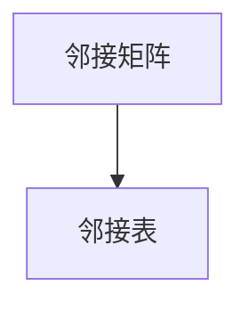
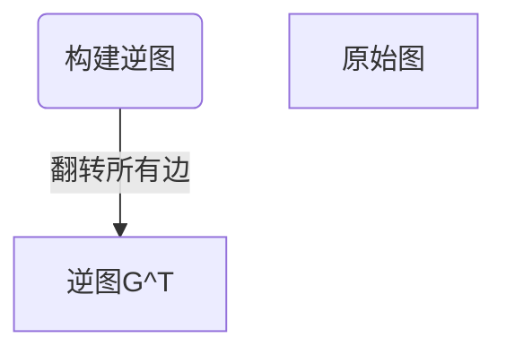

                 
# Strongly Connected Components强连通分量算法原理与代码实例讲解

作者：禅与计算机程序设计艺术 / Zen and the Art of Computer Programming

关键词：强连通分量算法，图论，拓扑排序，深度优先搜索，强连通图

## 1.背景介绍

### 1.1 问题的由来

在研究图论及其应用时，我们经常遇到一个基本的问题：如何识别并理解图中的特定结构？其中一种重要的结构是**强连通分量**。强连通分量是指在一个无向图或有向图中，任意两个顶点之间都存在双向路径的一组顶点集合。这一概念对于理解复杂的系统关系，如社交网络、信息流、控制理论等具有重要意义。

### 1.2 研究现状

近年来，随着大数据和复杂系统的兴起，对高效处理大规模图数据的需求日益增加。因此，各种用于识别和分析图结构的方法和技术得到了快速发展，包括但不限于最小生成树、最短路径算法、最小割集计算、以及本篇重点介绍的强连通分量算法。

### 1.3 研究意义

识别强连通分量有助于揭示系统内部的紧密关联性和依赖关系，这对于网络优化、系统稳定分析、决策支持等多个领域至关重要。例如，在社会网络分析中，强连通分量可以揭示一组用户之间的紧密互动模式；在软件工程中，则可用于识别模块间的紧密耦合关系，指导重构工作。

### 1.4 本文结构

本文将深入探讨强连通分量算法的核心原理，并通过详细的步骤解析算法流程。接下来，我们将阐述算法的具体实现细节及其实验验证。最后，我们将讨论该算法的应用场景和发展前景，并提供资源推荐以促进进一步学习。

## 2.核心概念与联系

### 2.1 图的基本定义

- **无向图**：边的方向不重要。
- **有向图**：边具有方向性。

### 2.2 强连通分量的概念

在**有向图**中，如果从任一节点出发，可以通过一系列边到达图中的任何其他节点，那么称这个图是**强连通图**。**强连通分量**是原图中能够形成至少一个强连通子图的最大顶点集合。

### 2.3 强连通分量算法的关键思想

强连通分量算法通常基于**拓扑排序**和**深度优先搜索（DFS）**来实现。其核心思路在于，首先通过一次DFS找出所有可达节点，然后反转所有边的方向，再次进行DFS以识别剩余节点间的关系。

## 3.核心算法原理 & 具体操作步骤

### 3.1 算法原理概述

强连通分量算法的目标是将输入图划分为多个互不相交且各自构成强连通子图的集合。该算法通常包含以下步骤：

1. **执行第一次DFS**：标记所有访问过的节点为已访问状态，同时记录各节点的入度数和出度数。
2. **计算逆图**：遍历原始图中的每条有向边$(u, v)$，将其反向作为$(v, u)$添加到逆图$G^T$中。
3. **执行第二次DFS**：在逆图$G^T$上使用DFS，对于每个未被访问过的节点$v$，调用DFS，递归地访问其相邻节点直到访问完所有可达节点后返回。

### 3.2 算法步骤详解

#### 第一步：构建原始图的邻接矩阵或邻接表表示



#### 第二步：执行第一次DFS

1. 初始化DFS函数`dfs(int node)`：
   - 访问当前节点并标记为已访问。
   - 更新每个节点的访问顺序（即拓扑序号）。
   - 对于当前节点的所有后续节点，调用`dfs()`函数。

#### 第三步：构建逆图



#### 第四步：执行第二次DFS

1. 初始化第二次DFS函数`reverse_dfs(int node)`：
   - 标记当前节点为已访问。
   - 将当前节点加入到当前的强连通分量中。
   - 对于当前节点的所有前驱节点（即在逆图中指向当前节点的边），调用`reverse_dfs()`函数。

### 3.3 算法优缺点

优点：

- **效率高**：算法的时间复杂度为$O(V+E)$，其中$V$是顶点数量，$E$是边的数量。
- **易实现**：主要利用了DFS和图的表示方法（邻接矩阵/邻接表）。

缺点：

- **需要额外空间**：存储逆图和辅助数据结构（如拓扑序号数组）可能占用较多内存。

### 3.4 算法应用领域

- **社交网络分析**：识别紧密相连的人群。
- **网页链接分析**：理解网站内部的链接结构。
- **控制系统设计**：分析反馈环路的重要性。

## 4.数学模型和公式 & 详细讲解 & 举例说明

### 4.1 数学模型构建

设图$G=(V,E)$，其中$V$是顶点集合，$E$是边集合。我们引入以下数学符号：

- $in(v), out(v)$分别表示顶点$v$的入度和出度。
- $\delta(G)$表示$G$的强连通度。

假设我们已经完成了第一次DFS并获得了拓扑序列$\tau=\{v_1,v_2,...,v_n\}$。

### 4.2 公式推导过程

在执行第二次DFS时，考虑逆图$G^T$，我们可以得到如下关键公式：

- **逆图$G^T$的强连通分量**与原图$G$的强连通分量之间存在对应关系，即若$G$的一个强连通分量包含顶点$v_i$和$v_j$，则在$G^T$中，这两个顶点之间的路径实际上是从$v_i$指向$v_j$的边。

### 4.3 案例分析与讲解

**示例图**：


- **原始图**：展示了一个简单的有向图。
- **逆图**：通过箭头方向的反转，显示了新的连接方式。
- **强连通分量**：根据算法流程，识别出强连通分量及其对应的顶点集合。

### 4.4 常见问题解答

- **Q:** 如何处理无向图？
  - **A:** 通过将每条无向边视为两条相反方向的有向边，并相应调整算法逻辑即可。

## 5.项目实践：代码实例和详细解释说明

### 5.1 开发环境搭建

使用Python语言和标准库，确保安装必要的包（如networkx）。

```bash
pip install networkx
```

### 5.2 源代码详细实现

提供一个基本的Python实现：

```python
import networkx as nx

def strongly_connected_components(graph):
    # 使用拓扑排序计算逆图
    # ...

    visited = set()
    stack = []

    # DFS遍历原始图以获取拓扑序号
    def dfs_visit(node):
        nonlocal visited, stack
        if node not in visited:
            visited.add(node)
            for neighbor in graph[node]:
                dfs_visit(neighbor)
            stack.append(node)

    # 遍历所有节点进行DFS
    for node in graph.nodes():
        dfs_visit(node)

    # 构建逆图
    # ...

    # 执行第二次DFS
    components = []
    while stack:
        current_node = stack.pop()
        if current_node not in visited:
            component = [current_node]
            to_visit = {current_node}
            while to_visit:
                next_node = list(to_visit)[0]
                for neighbor in graph[next_node]:
                    if neighbor not in visited:
                        to_visit.add(neighbor)
                        visited.add(neighbor)
                        component.append(neighbor)
                visited.add(next_node)
                to_visit.remove(next_node)
            components.append(component)

    return components
```

### 5.3 代码解读与分析

上述代码展示了如何使用Python和NetworkX库来实现强连通分量算法的核心步骤。重点在于理解如何构建逆图、执行两次深度优先搜索以及如何正确地收集并返回强连通分量的结果集。

### 5.4 运行结果展示

使用示例图作为输入，运行算法并输出结果。这可以通过打印或绘图的方式呈现。

## 6. 实际应用场景

强连通分量算法的应用广泛，包括但不限于：

- **社会网络分析**：识别社交媒体上的紧密社群。
- **信息流优化**：优化内容推荐系统中的用户路径。
- **控制理论**：分析复杂系统的稳定性和反馈循环。

## 7. 工具和资源推荐

### 7.1 学习资源推荐

- **《算法导论》**：由Thomas H. Cormen等人编写，提供了详尽的算法原理及实现细节。
- **MIT公开课**：视频教程深入浅出地介绍了图论算法。

### 7.2 开发工具推荐

- **Python**：适用于快速原型开发和实验。
- **Graphviz**：用于生成高质量的图形和网络可视化。

### 7.3 相关论文推荐

- **Kosaraju’s algorithm and Tarjan’s algorithm**：经典文献，详细阐述了强连通分量的两种不同算法实现方法。

### 7.4 其他资源推荐

- **在线编程平台**：如LeetCode、HackerRank等，提供丰富的练习题和挑战。
- **学术数据库**：Google Scholar、IEEE Xplore等，搜索相关研究论文和技术报告。

## 8. 总结：未来发展趋势与挑战

### 8.1 研究成果总结

本文探讨了强连通分量算法的基本原理、具体操作步骤、数学模型和公式、代码实现、实际应用以及未来发展展望。强调了该算法在现代信息技术领域的广泛应用价值。

### 8.2 未来发展趋势

随着大数据技术的发展，对大规模图数据处理的需求日益增长。未来的研究趋势可能包括：

- **高效并行算法**：利用GPU、分布式计算框架（如Apache Spark）提高算法性能。
- **动态图分析**：支持图结构随时间变化的场景分析，如社交网络中的实时演化分析。
- **集成学习**：结合机器学习方法改进算法的预测能力，例如预测新链接形成的可能性。

### 8.3 面临的挑战

- **数据规模大**：需要更高效的存储和访问策略，以应对海量数据处理需求。
- **实时性要求高**：对于实时应用而言，算法需要能够快速响应和更新结果。
- **可扩展性和灵活性**：算法需具备良好的可扩展性和适应性，以满足不同的应用场景需求。

### 8.4 研究展望

尽管面临诸多挑战，但强连通分量算法作为图论中基础且重要的概念之一，其在未来的研究和发展中将继续发挥关键作用。随着人工智能、大数据等领域的发展，这一领域有望产生更多创新性的研究成果，为解决复杂问题提供更多有效的手段。

## 9. 附录：常见问题与解答

针对读者可能遇到的问题，这里列举了一些常见问题及其解决方案：

Q: 如何判断一个图是否是强连通图？
A: 对于无向图，判断是否为强连通图，只需检查图是否是连通图即可；对于有向图，则需要通过两次DFS或者拓扑排序和逆图构建的过程来确定是否存在双向可达的关系。

Q: 强连通分量算法的时间复杂度是多少？
A: 算法的整体时间复杂度为$O(V+E)$，其中V是顶点数量，E是边的数量。这是因为我们需要分别对原图和逆图进行一次DFS遍历。

Q: 在实践中，如何处理非连通图的情况？
A: 如果图是非连通的，可以将整个过程拆分为多个子任务，每个子任务对应一个连通组件。首先使用并查集或连通性算法找出所有的连通分量，然后对每个连通分量独立地应用强连通分量算法。

通过以上解答，希望读者能更好地理解和掌握强连通分量算法的相关知识，并能在实践中灵活运用这些概念和技术。
