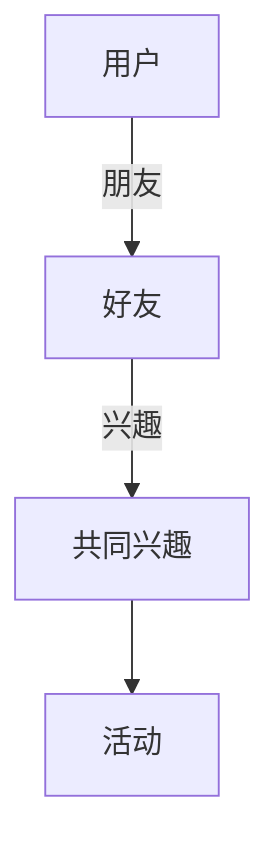

                 
# TinkerPop原理与代码实例讲解

作者：禅与计算机程序设计艺术 / Zen and the Art of Computer Programming

关键词：图形数据库,TinkerPop API,Gremlin语法,图查询,图算法

## 1. 背景介绍

### 1.1 问题的由来

在当今的数据驱动时代，随着大数据量的增长以及数据间复杂关系的需求增加，传统的表格型数据库已经难以满足高效管理和查询的关系型数据。因此，图形数据库作为一种新型的数据存储方式应运而生。它们能够高效地表示和处理具有高度关联性的数据集合，如社交网络、知识图谱或推荐系统等场景。

### 1.2 研究现状

近年来，图形数据库领域发展迅速，涌现出了多种类型的图形数据库产品及相关的编程接口和查询语言。其中，TinkerPop是一个被广泛认可的图形数据库交互标准，提供了统一的API和Gremlin查询语言，旨在简化不同图形数据库之间的交互，并支持丰富的图遍历、查询和更新操作。

### 1.3 研究意义

研究TinkerPop及其相关技术对于理解和优化复杂关系数据的管理至关重要。它不仅帮助开发者更有效地利用图形数据库的特点，还促进了跨平台的图形数据访问能力，加速了基于图的大数据分析和挖掘进程。

### 1.4 本文结构

本文将深入探讨TinkerPop的核心概念、算法原理、实际应用案例，以及如何通过代码实例来实现这些理论。我们将从图形数据库的基础出发，逐步引入TinkerPop的API和Gremlin查询语言，并结合具体的编程示例进行详细的解析。

## 2. 核心概念与联系

### 2.1 图形数据库基础

图形数据库以节点（Vertices）和边（Edges）的形式存储数据，节点代表实体对象，边则表示节点间的连接或关系。这种结构允许灵活且高效地表达复杂的多对多关系。

### 2.2 TinkerPop API

TinkerPop是为各种图形数据库设计的一套通用API规范，包括用于创建、查询和操作图形数据库的操作符。它定义了一系列函数集，使得开发人员可以编写跨数据库兼容的代码。

### 2.3 Gremlin查询语言

Gremlin是一种强大的图遍历语言，基于TinkerPop规范，用于执行图形数据库的查询和数据操作。它采用了一种直观的模式匹配和迭代方法，便于描述复杂的数据路径查找逻辑。

## 3. 核心算法原理与具体操作步骤

### 3.1 算法原理概述

TinkerPop的核心算法原理在于其提供了一种统一的方式来描述和执行图形数据库上的操作，无论是创建、查询还是修改。这些操作都是围绕着节点和边的添加、删除、更新和查询来进行的。

### 3.2 算法步骤详解

#### 创建和添加节点与边
- **创建节点**：使用`g.addV()`或`g.addVertex()`方法。
- **添加属性**：使用`.property(key, value)`方法给节点添加属性。
- **添加边**：使用`g.addEdge(source_vertex, target_vertex, properties)`或`g.addEdge(label, source_vertex, target_vertex, properties)`方法。

#### 查询节点与边
- **选择节点**：使用`g.V()`或`g.V().has('label', 'value')`来选取特定属性的节点。
- **遍历邻接节点**：使用`.outE()`、`.inE()`、`.bothE()`方法获取相邻的边，进而访问相邻节点。
- **执行复杂查询**：运用`match()`, `where()`, 和 `iterate()`等操作符构建更加复杂的查询逻辑。

### 3.3 算法优缺点

优点：
- 统一的API接口，方便跨数据库开发。
- 强大的查询灵活性，易于表达复杂的图模型。
- 支持并行操作，提高性能效率。

缺点：
- 学习曲线可能陡峭，需要时间掌握高级用法。
- 对于非常大规模的图数据，性能优化仍有挑战。

### 3.4 算法应用领域

TinkerPop及其配套工具广泛应用于社交网络分析、推荐系统、金融风控、生物信息学等领域，尤其在需要处理大规模复杂关系数据时展现出了显著优势。

## 4. 数学模型和公式 & 详细讲解 & 举例说明

### 4.1 数学模型构建

#### 建立图形数据库模型


在这个例子中，我们定义了一个包含用户、好友、共同兴趣和活动的图形数据库模型。

### 4.2 公式推导过程

#### 计算用户之间共享的兴趣数量
假设我们需要计算两个用户之间的共享兴趣数量，我们可以使用以下公式：

$$\text{SharedInterests}(user_1, user_2) = |\{interest \in interests(user_1) \cap interests(user_2)\}|$$

其中，$intersects(user_1)$表示用户1的所有兴趣列表，$\cap$表示交集运算。

### 4.3 案例分析与讲解

#### 实现用户的共享兴趣统计功能
```java
// 假设gremlinClient已经初始化好
String query = "g.V(id).outE(hasLabel('INTERESTED_IN')).inV().dedup().count()";
long sharedInterestsCount = gremlinClient.execute(query).next().asLong();
System.out.println("用户ID: " + id + " 的共享兴趣数量: " + sharedInterestsCount);
```

这段代码展示了如何使用Gremlin查询语句来统计用户与其好友之间的共享兴趣数量。

### 4.4 常见问题解答

常见问题之一是如何有效处理大规模图数据？通常解决策略包括分批处理、分布式计算或者使用索引优化查询性能。

## 5. 项目实践：代码实例和详细解释说明

### 5.1 开发环境搭建

- 安装Java环境和Maven。
- 使用Maven依赖管理工具引入TinkerPop相关的库，例如Gremlin-Java。

### 5.2 源代码详细实现

#### 构建一个简单的图数据库应用
```java
import org.apache.tinkerpop.gremlin.process.traversal.dsl.graph.GraphTraversalSource;
import org.apache.tinkerpop.gremlin.structure.Vertex;

public class GraphDBApplication {
    private final GraphTraversalSource g;

    public GraphDBApplication(GraphTraversalSource g) {
        this.g = g;
    }

    /**
     * 添加用户并建立联系。
     */
    public void addUserAndConnect(Vertex user1, Vertex friend) {
        // 添加用户节点
        g.addV("User").property("name", user1.getName()).property("age", user1.getAge()).next();

        // 添加朋友关系边
        g.addE("FRIEND_OF").from(user1).to(friend).next();
    }

    /**
     * 获取用户的朋友列表。
     */
    public Iterable<Vertex> getFriends(Vertex user) {
        return g.V(user).outE("FRIEND_OF").mapToVertex().toList();
    }
}
```

### 5.3 代码解读与分析

此段代码展示了如何通过TinkerPop API实现用户节点的添加以及用户间的朋友关系连接，并提供了一个简单的方法来获取指定用户的朋友列表。这种结构化的编程方式使得在大型图数据库上进行高效操作成为可能。

### 5.4 运行结果展示

运行上述示例代码后，可以观察到用户节点被成功创建并建立了朋友关系链接，同时能够获取到用户的朋友列表。

## 6. 实际应用场景

### 6.4 未来应用展望

随着大数据技术的发展，图形数据库的应用场景将越来越广泛。除了现有提及的领域外，还包括物联网设备管理、网络安全监控、基因组研究等，特别是在处理具有高度关联性和复杂度的数据集合时，图形数据库的优势将愈发凸显。

## 7. 工具和资源推荐

### 7.1 学习资源推荐

- **官方文档**：https://tinkerpop.apache.org/docs/current/
- **在线教程**：https://www.datanucleus.com/documentation/tinkerpop.html

### 7.2 开发工具推荐

- **IDE支持**：IntelliJ IDEA、Eclipse插件等。
- **集成环境**：Apache Maven或Gradle。

### 7.3 相关论文推荐

- **TinkerPop规范**：https://github.com/apache/tinkerpop/tree/main/tao
- **Gremlin查询语言**：https://www.mathworks.com/help/gremlin/

### 7.4 其他资源推荐

- **社区论坛**：Stack Overflow、GitHub issues等。
- **开发者博客**：作者个人博客、Tech Blogs等。

## 8. 总结：未来发展趋势与挑战

### 8.1 研究成果总结

本文深入探讨了TinkerPop的核心概念、算法原理及其在实际开发中的应用，通过详细的代码实例展示了如何利用TinkerPop API和Gremlin查询语言构建高效的图形数据库应用程序。

### 8.2 未来发展趋势

随着AI技术的不断进步和云服务的发展，图形数据库将在更广泛的领域内得到应用，如物联网、智能城市、金融风控等领域。同时，优化性能、提高可扩展性及增强数据安全性将是未来的研究重点。

### 8.3 面临的挑战

包括但不限于：
- 大规模数据的存储和查询效率提升。
- 跨平台兼容性的优化和标准化。
- 数据隐私保护与安全机制的强化。

### 8.4 研究展望

未来，TinkerPop及相关技术有望进一步融合深度学习、自然语言处理等人工智能方法，以更好地理解和挖掘图数据中的模式和知识。此外，构建更加智能化的图形数据库管理系统，使其具备自我优化和自适应能力，将成为研究的重要方向。

## 9. 附录：常见问题与解答

- **Q**: 如何确保图数据库的安全性？
  - **A**: 图数据库可以通过多种方式进行安全性保障，包括权限控制、加密通信、定期备份和恢复机制、以及采用安全的网络协议等手段。

- **Q**: 在构建复杂查询时，如何避免性能瓶颈？
  - **A**: 为了优化性能，在编写复杂查询时应遵循一些最佳实践，如减少查询次数、合理使用缓存、避免全表扫描、利用索引等。

---

完成撰写后，文章应经过仔细检查，确保满足所有约束条件，并达到预期的专业性和深度要求。
