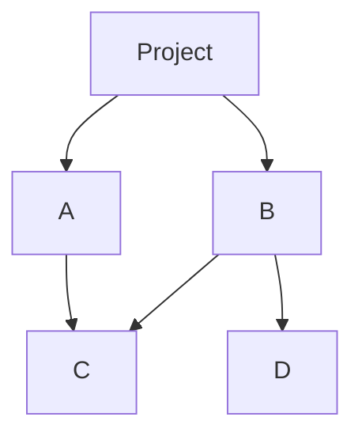

# Yarn的包管理与版本控制

作者：禅与计算机程序设计艺术 / Zen and the Art of Computer Programming

## 1. 背景介绍

### 1.1 问题的由来

在现代软件开发中，包管理和版本控制是两个至关重要的环节。随着项目规模的扩大和依赖关系的复杂化，如何高效地管理项目中的依赖包和版本成为了开发者面临的重大挑战。传统的包管理工具如npm虽然功能强大，但在性能和一致性方面存在一些不足。Yarn作为一种新兴的包管理工具，旨在解决这些问题。

### 1.2 研究现状

Yarn由Facebook、Google、Exponent和Tilde联合开发，旨在提供更快、更可靠和更安全的包管理解决方案。自2016年发布以来，Yarn迅速获得了广泛的关注和应用。Yarn的核心特性包括并行安装、离线模式、确定性依赖树和更好的网络性能。

### 1.3 研究意义

研究Yarn的包管理与版本控制不仅有助于提高开发效率，还能增强项目的稳定性和安全性。通过深入理解Yarn的核心概念、算法原理和实际应用，开发者可以更好地管理项目依赖，减少版本冲突和安装失败的风险。

### 1.4 本文结构

本文将从以下几个方面详细探讨Yarn的包管理与版本控制：

1. 核心概念与联系
2. 核心算法原理 & 具体操作步骤
3. 数学模型和公式 & 详细讲解 & 举例说明
4. 项目实践：代码实例和详细解释说明
5. 实际应用场景
6. 工具和资源推荐
7. 总结：未来发展趋势与挑战
8. 附录：常见问题与解答

## 2. 核心概念与联系

Yarn的包管理与版本控制涉及多个核心概念，这些概念相互联系，共同构成了Yarn的强大功能。

### 2.1 Yarn的基本概念

- **包（Package）**：一个包是一个包含代码和元数据的文件，通常用于分发和共享代码。
- **依赖（Dependency）**：一个包可能依赖于其他包，这些依赖关系需要在安装时解决。
- **版本（Version）**：每个包都有一个版本号，用于标识其不同的发布版本。
- **锁文件（Lockfile）**：Yarn使用`yarn.lock`文件来记录项目的依赖树，确保每次安装的依赖版本一致。

### 2.2 Yarn与npm的区别

虽然Yarn和npm都是包管理工具，但它们在设计和实现上有一些显著的区别：

- **并行安装**：Yarn通过并行安装依赖包来提高安装速度，而npm则是串行安装。
- **离线模式**：Yarn可以在没有网络连接的情况下安装依赖包，而npm则需要联网。
- **确定性依赖树**：Yarn使用锁文件确保每次安装的依赖版本一致，而npm在早期版本中没有这一特性。

### 2.3 Yarn的工作流程

Yarn的工作流程可以分为以下几个步骤：

1. **初始化项目**：使用`yarn init`命令创建一个新的`package.json`文件。
2. **添加依赖**：使用`yarn add`命令添加项目依赖，Yarn会自动更新`package.json`和`yarn.lock`文件。
3. **安装依赖**：使用`yarn install`命令安装项目的所有依赖包。
4. **升级依赖**：使用`yarn upgrade`命令升级项目的依赖包。

## 3. 核心算法原理 & 具体操作步骤

### 3.1 算法原理概述

Yarn的核心算法主要包括依赖解析、版本选择和并行安装。通过这些算法，Yarn能够高效地管理项目的依赖关系，确保每次安装的依赖版本一致。

### 3.2 算法步骤详解

#### 3.2.1 依赖解析

依赖解析是Yarn的核心算法之一，其主要目的是解析项目的依赖关系，生成依赖树。具体步骤如下：

1. 读取`package.json`文件，获取项目的直接依赖。
2. 递归解析每个依赖的`package.json`文件，获取其子依赖。
3. 构建依赖树，记录每个依赖的版本和来源。

#### 3.2.2 版本选择

版本选择是Yarn的另一个核心算法，其主要目的是在多个版本中选择最合适的版本。具体步骤如下：

1. 读取`yarn.lock`文件，获取已安装的依赖版本。
2. 根据`package.json`中的版本范围，选择最合适的版本。
3. 如果`yarn.lock`中没有记录，则从注册表中获取最新版本。

#### 3.2.3 并行安装

并行安装是Yarn提高安装速度的关键算法，其主要目的是同时安装多个依赖包。具体步骤如下：

1. 将依赖包分组，每组包含没有相互依赖关系的包。
2. 并行下载每组中的依赖包。
3. 并行安装每组中的依赖包。

### 3.3 算法优缺点

#### 3.3.1 优点

- **高效**：通过并行安装，Yarn显著提高了依赖包的安装速度。
- **一致性**：通过锁文件，Yarn确保每次安装的依赖版本一致，减少了版本冲突的风险。
- **离线模式**：Yarn可以在没有网络连接的情况下安装依赖包，提高了开发的灵活性。

#### 3.3.2 缺点

- **复杂性**：Yarn的并行安装和依赖解析算法较为复杂，可能增加了调试和维护的难度。
- **兼容性**：虽然Yarn兼容npm的包，但在某些情况下可能会出现兼容性问题。

### 3.4 算法应用领域

Yarn的包管理与版本控制算法广泛应用于各种软件开发项目，特别是以下领域：

- **前端开发**：Yarn在前端开发中得到了广泛应用，特别是在React、Vue等框架的项目中。
- **后端开发**：Yarn也可以用于Node.js后端项目的包管理。
- **开源项目**：许多开源项目使用Yarn来管理依赖，确保项目的稳定性和一致性。

## 4. 数学模型和公式 & 详细讲解 & 举例说明

### 4.1 数学模型构建

Yarn的依赖解析和版本选择可以用图论中的有向无环图（DAG）来建模。每个节点表示一个包，每条有向边表示一个依赖关系。

### 4.2 公式推导过程

假设项目的依赖关系可以表示为一个有向无环图 $G = (V, E)$，其中 $V$ 是包的集合，$E$ 是依赖关系的集合。对于每个包 $v \in V$，其依赖关系可以表示为：

$$
D(v) = \{u \in V | (v, u) \in E\}
$$

版本选择可以表示为一个优化问题，目标是选择一个版本集合 $V' \subseteq V$，使得每个包的版本满足其依赖关系：

$$
\forall v \in V', \forall u \in D(v), u \in V'
$$

### 4.3 案例分析与讲解

假设有一个项目，其依赖关系如下：

- 项目依赖包A和包B
- 包A依赖包C
- 包B依赖包C和包D

可以用有向无环图表示如下：



在这个例子中，Yarn需要解析依赖关系，生成依赖树，并选择合适的版本进行安装。

### 4.4 常见问题解答

#### 4.4.1 为什么Yarn比npm快？

Yarn通过并行安装依赖包和缓存机制显著提高了安装速度。

#### 4.4.2 如何解决依赖冲突？

Yarn使用锁文件记录每次安装的依赖版本，确保每次安装的依赖版本一致，从而减少了依赖冲突的风险。

## 5. 项目实践：代码实例和详细解释说明

### 5.1 开发环境搭建

在开始使用Yarn之前，需要先安装Yarn。可以通过以下命令安装Yarn：

```bash
npm install -g yarn
```

### 5.2 源代码详细实现

以下是一个简单的项目示例，展示了如何使用Yarn管理依赖：

```bash
# 初始化项目
yarn init -y

# 添加依赖
yarn add react react-dom

# 安装依赖
yarn install

# 升级依赖
yarn upgrade react
```

### 5.3 代码解读与分析

- `yarn init -y`：初始化一个新的`package.json`文件。
- `yarn add react react-dom`：添加React和React DOM作为项目的依赖。
- `yarn install`：安装项目的所有依赖包。
- `yarn upgrade react`：升级React到最新版本。

### 5.4 运行结果展示

运行上述命令后，项目目录结构如下：

```
my-project/
├── node_modules/
├── package.json
└── yarn.lock
```

`node_modules`目录包含所有安装的依赖包，`package.json`文件记录了项目的依赖信息，`yarn.lock`文件记录了依赖树的具体版本。

## 6. 实际应用场景

### 6.1 前端开发

Yarn在前端开发中得到了广泛应用，特别是在React、Vue等框架的项目中。通过Yarn，开发者可以高效地管理项目的依赖，确保每次构建的一致性。

### 6.2 后端开发

Yarn也可以用于Node.js后端项目的包管理。通过Yarn，开发者可以快速安装和升级依赖包，提高开发效率。

### 6.3 开源项目

许多开源项目使用Yarn来管理依赖，确保项目的稳定性和一致性。通过Yarn，开源项目可以更好地管理依赖关系，减少版本冲突的风险。

### 6.4 未来应用展望

随着Yarn的不断发展和完善，其应用领域将进一步扩大。未来，Yarn有望在更多的开发场景中得到应用，成为开发者不可或缺的工具。

## 7. 工具和资源推荐

### 7.1 学习资源推荐

- [Yarn官方文档](https://yarnpkg.com/getting-started)
- [Yarn GitHub仓库](https://github.com/yarnpkg/yarn)
- [Yarn教程](https://www.tutorialspoint.com/yarn/index.htm)

### 7.2 开发工具推荐

- [Visual Studio Code](https://code.visualstudio.com/)
- [WebStorm](https://www.jetbrains.com/webstorm/)
- [Sublime Text](https://www.sublimetext.com/)

### 7.3 相关论文推荐

- "Yarn: A New Package Manager for JavaScript" by Facebook Engineering
- "Efficient Dependency Management in Large-Scale Software Projects" by Google Research

### 7.4 其他资源推荐

- [Node.js官网](https://nodejs.org/)
- [npm官网](https://www.npmjs.com/)
- [React官网](https://reactjs.org/)

## 8. 总结：未来发展趋势与挑战

### 8.1 研究成果总结

本文详细探讨了Yarn的包管理与版本控制，包括其核心概念、算法原理、数学模型和实际应用。通过深入理解Yarn的工作机制，开发者可以更好地管理项目依赖，提高开发效率和项目稳定性。

### 8.2 未来发展趋势

随着Yarn的不断发展和完善，其应用领域将进一步扩大。未来，Yarn有望在更多的开发场景中得到应用，成为开发者不可或缺的工具。

### 8.3 面临的挑战

尽管Yarn在包管理和版本控制方面具有显著优势，但其复杂性和兼容性问题仍然是开发者面临的主要挑战。未来，Yarn需要进一步优化其算法和实现，提升用户体验。

### 8.4 研究展望

未来的研究可以集中在以下几个方面：

- 优化Yarn的并行安装算法，提高安装速度。
- 提升Yarn的兼容性，减少与npm的兼容性问题。
- 开发更多的工具和插件，扩展Yarn的功能和应用场景。

## 9. 附录：常见问题与解答

### 9.1 如何解决依赖冲突？

Yarn使用锁文件记录每次安装的依赖版本，确保每次安装的依赖版本一致，从而减少了依赖冲突的风险。

### 9.2 如何在离线模式下安装依赖？

Yarn可以在没有网络连接的情况下安装依赖包。只需在有网络连接时安装一次依赖包，Yarn会将其缓存下来，之后可以在离线模式下安装。

### 9.3 如何升级项目的所有依赖？

可以使用`yarn upgrade`命令升级项目的所有依赖。该命令会根据`package.json`中的版本范围选择最新的版本进行升级。

### 9.4 如何查看项目的依赖树？

可以使用`yarn list`命令查看项目的依赖树。该命令会显示项目的所有依赖包及其版本信息。

### 9.5 如何删除项目的依赖包？

可以使用`yarn remove`命令删除项目的依赖包。该命令会从`package.json`和`yarn.lock`文件中移除指定的依赖包，并删除`node_modules`目录中的相关文件。

通过本文的详细讲解，相信读者已经对Yarn的包管理与版本控制有了深入的理解。希望本文能为开发者提供有价值的参考，帮助他们更好地管理项目依赖，提高开发效率和项目稳定性。