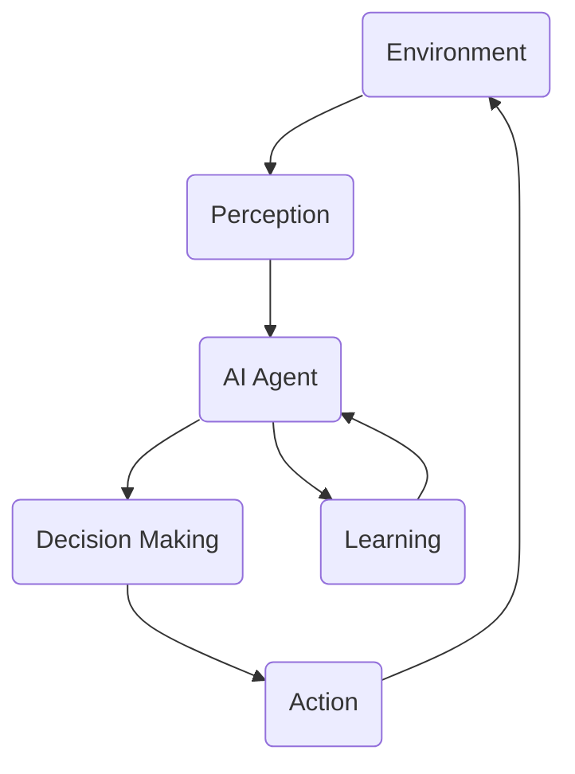

# AI Agent: AI的下一个风口 当前的研究难点与挑战

## 1. 背景介绍
### 1.1 人工智能的发展历程
#### 1.1.1 早期人工智能
#### 1.1.2 专家系统时代  
#### 1.1.3 机器学习时代
### 1.2 AI Agent的定义与特点
#### 1.2.1 AI Agent的定义
#### 1.2.2 AI Agent的关键特点
### 1.3 AI Agent的研究意义
#### 1.3.1 推动人工智能技术进步
#### 1.3.2 解决实际应用难题
#### 1.3.3 探索通用人工智能

## 2. 核心概念与联系
### 2.1 Agent的概念
#### 2.1.1 Agent的定义
Agent是一个能够感知环境并根据感知结果采取行动,从而实现预定目标的实体。它具有自主性、社会性、反应性和主动性等特点。
#### 2.1.2 Agent的分类
根据智能程度和应用领域,Agent可分为反应型Agent、认知型Agent、社会型Agent等类型。
### 2.2 AI Agent的核心要素  
#### 2.2.1 感知能力
AI Agent需要通过传感器等方式获取环境信息,理解当前所处的状态。
#### 2.2.2 决策能力
AI Agent需要根据感知信息和知识,通过推理、规划等方式做出合理决策。
#### 2.2.3 执行能力
AI Agent需要控制执行器,将决策结果付诸行动,对环境产生影响。
#### 2.2.4 学习能力
AI Agent需要从经验中学习,不断完善自身的知识和策略,提升适应能力。
### 2.3 AI Agent与其他AI技术的关系
#### 2.3.1 与机器学习的关系
机器学习为AI Agent提供了知识学习和策略优化的重要技术手段。
#### 2.3.2 与知识图谱的关系
知识图谱可以为AI Agent提供丰富的领域知识,增强其认知和推理能力。  
#### 2.3.3 与自然语言处理的关系
NLP技术使AI Agent能够理解和生成自然语言,拥有更自然的人机交互方式。



## 3. 核心算法原理具体操作步骤
### 3.1 基于搜索的智能体
#### 3.1.1 状态空间搜索
将问题表示为初始状态、目标状态和操作集合,通过搜索找到从初始状态到目标状态的路径。
#### 3.1.2 启发式搜索
利用问题的领域知识,设计估值函数来指导搜索,提高搜索效率,如A*算法。
### 3.2 基于规划的智能体
#### 3.2.1 经典规划
将问题描述为初始状态、目标状态和行动规则,通过推理生成达到目标的行动序列,代表算法有STRIPS等。
#### 3.2.2 马尔可夫决策过程
使用MDP对存在不确定性的规划问题建模,通过值迭代或策略迭代等方法求解最优策略。
### 3.3 基于学习的智能体
#### 3.3.1 有监督学习
智能体根据环境提供的标注数据,学习状态到行动的映射函数,代表算法有神经网络、决策树等。
#### 3.3.2 强化学习  
通过试错与环境交互,根据反馈的奖励信号不断优化行动策略,代表算法有Q-learning、策略梯度等。
### 3.4 多Agent系统
#### 3.4.1 博弈论方法
利用博弈论分析多个Agent之间的策略互动,寻求纳什均衡等稳定的策略组合。
#### 3.4.2 协同学习
多个Agent通过分享经验、知识等方式相互学习,共同提升整体性能,如Federated Learning等。

## 4. 数学模型和公式详细讲解举例说明
### 4.1 马尔可夫决策过程
MDP由状态集合$S$、行动集合$A$、转移概率$P$、奖励函数$R$和折扣因子$\gamma$组成。Agent的目标是寻找一个最优策略$\pi^*$使得期望总奖励最大化:

$$
\pi^* = \arg\max_{\pi} \mathbb{E} \left[ \sum_{t=0}^{\infty} \gamma^t R(s_t, a_t) | \pi \right]
$$

其中$s_t$和$a_t$分别表示t时刻的状态和行动。求解最优策略的经典算法有值迭代:

$$
V_{k+1}(s) = \max_a \left[ R(s,a) + \gamma \sum_{s'} P(s'|s,a) V_k(s') \right] 
$$

和策略迭代:

$$
\begin{aligned}
\pi_{k+1}(s) & = \arg\max_a \left[ R(s,a) + \gamma \sum_{s'} P(s'|s,a) V_{\pi_k}(s') \right] \\
V_{\pi_{k+1}}(s) & = R(s, \pi_{k+1}(s)) + \gamma \sum_{s'} P(s'|s,\pi_{k+1}(s)) V_{\pi_{k+1}}(s')
\end{aligned}
$$

### 4.2 Q-learning
Q-learning是一种无模型的强化学习算法,通过更新状态-行动值函数$Q(s,a)$来逼近最优策略。其更新公式为:

$$
Q(s_t, a_t) \leftarrow Q(s_t, a_t) + \alpha \left[ r_t + \gamma \max_a Q(s_{t+1}, a) - Q(s_t, a_t) \right]
$$

其中$\alpha$是学习率,$r_t$是t时刻获得的奖励。在学习过程中,Agent以$\epsilon$-greedy的方式选择行动:以$\epsilon$的概率随机选择行动,否则选择Q值最大的行动。

## 5. 项目实践：代码实例和详细解释说明
下面是使用Python实现一个简单的Q-learning智能体的示例代码:

```python
import numpy as np

class QLearningAgent:
    def __init__(self, state_size, action_size, learning_rate=0.1, discount_factor=0.9, epsilon=0.1):
        self.state_size = state_size
        self.action_size = action_size
        self.learning_rate = learning_rate
        self.discount_factor = discount_factor
        self.epsilon = epsilon
        self.q_table = np.zeros((state_size, action_size))

    def select_action(self, state):
        if np.random.uniform() < self.epsilon:
            return np.random.randint(self.action_size)
        else:
            return np.argmax(self.q_table[state])

    def update(self, state, action, reward, next_state):
        old_value = self.q_table[state, action]
        next_max = np.max(self.q_table[next_state])
        new_value = old_value + self.learning_rate * (reward + self.discount_factor * next_max - old_value)
        self.q_table[state, action] = new_value
```

这个智能体类包含以下主要部分:

1. 初始化方法`__init__`：设置状态空间大小、行动空间大小、学习率、折扣因子和探索概率,并初始化Q值表。

2. 行动选择方法`select_action`：根据当前状态,以$\epsilon$-greedy的方式选择行动。

3. 值更新方法`update`：根据当前状态、行动、奖励和下一状态,利用Q-learning的更新公式更新Q值表中对应的项。

在实际使用时,我们可以通过不断与环境交互并调用`select_action`和`update`方法来训练智能体。随着训练的进行,智能体会逐渐学习到一个接近最优的策略。

## 6. 实际应用场景
### 6.1 智能客服
AI Agent可以作为智能客服系统的核心,通过自然语言理解和生成技术与用户进行交互,解答问题和提供服务。
### 6.2 自动驾驶
自动驾驶汽车可以看作一种AI Agent,它通过传感器感知道路环境,根据知识和策略做出驾驶决策并控制车辆。
### 6.3 智能推荐
推荐系统中的AI Agent可以根据用户的历史行为和偏好,主动向用户推荐可能感兴趣的内容或商品。
### 6.4 智能家居
家居环境中的AI Agent可以感知用户的需求和意图,自主控制各种家电设备,提供个性化的服务。
### 6.5 智能投顾
AI Agent可以分析市场环境和用户特点,为用户提供量身定制的投资组合和策略建议。

## 7. 工具和资源推荐
### 7.1 开发平台
- OpenAI Gym：强化学习智能体训练环境
- DeepMind Lab：3D视觉类智能体环境
- Unity ML-Agents：游戏引擎集成的智能体开发工具
### 7.2 算法库  
- TensorFlow Agents：基于TensorFlow的强化学习算法库
- RLlib：基于Ray的分布式强化学习库
- Stable Baselines：基于OpenAI Gym接口的强化学习算法集合
### 7.3 学习资源
- 《人工智能：一种现代的方法》：经典的AI教材,系统介绍了各类AI Agent的原理和实现
- 《强化学习导论》：深入浅出地讲解强化学习原理,适合作为入门读物
- CS234: Reinforcement Learning：斯坦福大学开设的强化学习课程,覆盖了智能体构建的核心技术

## 8. 总结：未来发展趋势与挑战
### 8.1 AI Agent的发展趋势 
- 多模态感知与交互：集成视觉、语音等能力,实现更自然的人机协作
- 知识与推理能力增强：融合先验知识和因果推理,具备更强的常识和领域智能
- 持续学习与适应：根据反馈不断优化策略,快速适应环境变化
- 安全与伦理：加入伦理道德约束,避免产生有害行为
### 8.2 面临的挑战
- 样本效率：减少智能体学习所需的数据和交互量
- 泛化能力：提升智能体对未知环境和任务的适应能力
- 可解释性：让智能体的决策过程更加透明,增强人类对其行为的理解和信任
- 多智能体协同：解决多个智能体在共享环境中的协调与博弈问题

## 9. 附录：常见问题与解答
### Q1: AI Agent与一般软件系统的区别是什么?
A1: AI Agent具有自主性和适应性。它能根据环境做出决策,通过学习不断优化,而不是按照预先设定的流程执行任务。
### Q2: 构建AI Agent需要哪些关键技术?
A2: 构建AI Agent通常需要运用机器学习、知识表示、自然语言处理、计算机视觉等多种人工智能技术,并且根据具体任务可能还需要融合特定领域知识。
### Q3: 如何评估一个AI Agent的性能表现?  
A3: 可以从任务完成质量、学习效率、泛化能力、安全性等方面来评估AI Agent。需要在真实或仿真环境中进行全面的测试,并设置合理的评估指标。
### Q4: 开发AI Agent的一般流程是怎样的?
A4: 开发AI Agent通常包括以下步骤:1)明确任务需求;2)收集和处理相关数据;3)选择合适的算法模型;4)搭建Agent架构并训练优化;5)在实际环境中测试和迭代改进。
### Q5: 如何保障AI Agent的安全性和伦理性?
A5: 需要在Agent的训练目标和决策机制中引入安全和伦理约束,避免其产生危害。同时,要加强对Agent行为的监管,及时发现和纠正违规行为。还可引入人类反馈,塑造Agent行为。

作者：禅与计算机程序设计艺术 / Zen and the Art of Computer Programming