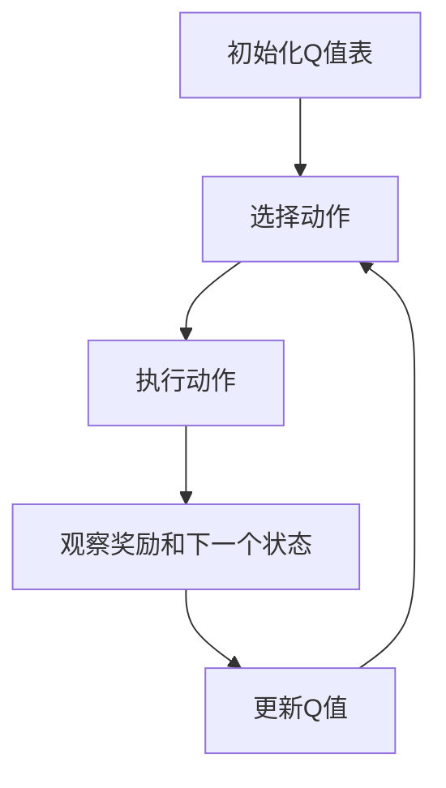

# AI人工智能 Agent：基于Q-learning的决策优化

## 1.背景介绍

在人工智能领域，强化学习（Reinforcement Learning, RL）是一种通过与环境交互来学习策略的技术。Q-learning 是一种无模型的强化学习算法，广泛应用于各种决策优化问题中。它通过学习状态-动作对的价值来指导智能体（Agent）选择最优策略。本文将深入探讨 Q-learning 的核心概念、算法原理、数学模型、实际应用及未来发展趋势。

## 2.核心概念与联系

### 2.1 强化学习

强化学习是一种通过试错法来学习最优策略的机器学习方法。智能体通过与环境交互，接收奖励或惩罚，从而调整其行为策略。强化学习的核心要素包括状态（State）、动作（Action）、奖励（Reward）和策略（Policy）。

### 2.2 Q-learning

Q-learning 是一种无模型的强化学习算法，它通过学习 Q 值（状态-动作对的价值）来指导智能体选择最优动作。Q-learning 的目标是找到一个策略，使得在给定状态下选择的动作能够最大化累积奖励。

### 2.3 状态-动作值函数

状态-动作值函数 Q(s, a) 表示在状态 s 下执行动作 a 所能获得的期望累积奖励。Q-learning 通过更新 Q 值来逼近最优状态-动作值函数。

### 2.4 贝尔曼方程

贝尔曼方程是 Q-learning 的核心，它描述了当前状态-动作值与下一状态-动作值之间的关系。通过迭代更新 Q 值，智能体逐步逼近最优策略。

## 3.核心算法原理具体操作步骤

### 3.1 初始化

初始化 Q 值表，通常将所有 Q 值设为零或随机小值。

### 3.2 选择动作

在当前状态 s 下，根据 ε-贪婪策略选择动作 a。ε-贪婪策略是指以 ε 的概率选择随机动作，以 1-ε 的概率选择当前 Q 值最大的动作。

### 3.3 执行动作

执行选择的动作 a，观察环境反馈的奖励 r 和下一个状态 s'。

### 3.4 更新 Q 值

根据贝尔曼方程更新 Q 值：
$$
Q(s, a) \leftarrow Q(s, a) + \alpha [r + \gamma \max_{a'} Q(s', a') - Q(s, a)]
$$
其中，$\alpha$ 是学习率，$\gamma$ 是折扣因子。

### 3.5 重复

重复步骤 2-4，直到满足终止条件（如达到最大迭代次数或收敛）。



## 4.数学模型和公式详细讲解举例说明

### 4.1 贝尔曼方程

贝尔曼方程是 Q-learning 的核心公式，用于更新 Q 值：
$$
Q(s, a) \leftarrow Q(s, a) + \alpha [r + \gamma \max_{a'} Q(s', a') - Q(s, a)]
$$
其中：
- $Q(s, a)$ 是当前状态 s 下执行动作 a 的 Q 值。
- $\alpha$ 是学习率，控制 Q 值更新的步长。
- $r$ 是执行动作 a 后获得的即时奖励。
- $\gamma$ 是折扣因子，衡量未来奖励的重要性。
- $\max_{a'} Q(s', a')$ 是下一状态 s' 下所有可能动作的最大 Q 值。

### 4.2 举例说明

假设一个简单的迷宫问题，智能体需要从起点到达终点。迷宫的状态空间为 S，动作空间为 A。智能体在每个状态 s 下可以选择上下左右四个动作。每次移动都会获得一个即时奖励 r，达到终点时获得较大的奖励。

初始化 Q 值表：
$$
Q(s, a) = 0, \forall s \in S, a \in A
$$

在状态 s 下，选择动作 a，执行后观察到奖励 r 和下一个状态 s'。根据贝尔曼方程更新 Q 值：
$$
Q(s, a) \leftarrow Q(s, a) + \alpha [r + \gamma \max_{a'} Q(s', a') - Q(s, a)]
$$

通过多次迭代，Q 值逐渐逼近最优状态-动作值函数，智能体最终学会最优策略。

## 5.项目实践：代码实例和详细解释说明

### 5.1 环境设置

首先，我们需要设置一个简单的环境，例如 OpenAI Gym 提供的 FrozenLake 环境。

```python
import gym
import numpy as np

env = gym.make('FrozenLake-v0')
```

### 5.2 初始化 Q 值表

初始化 Q 值表，设为零矩阵。

```python
Q = np.zeros([env.observation_space.n, env.action_space.n])
```

### 5.3 参数设置

设置学习率、折扣因子和 ε-贪婪策略的参数。

```python
alpha = 0.8
gamma = 0.95
epsilon = 0.1
```

### 5.4 Q-learning 算法实现

实现 Q-learning 算法的核心部分。

```python
for episode in range(1000):
    state = env.reset()
    done = False
    
    while not done:
        if np.random.rand() < epsilon:
            action = env.action_space.sample()
        else:
            action = np.argmax(Q[state, :])
        
        next_state, reward, done, _ = env.step(action)
        
        Q[state, action] = Q[state, action] + alpha * (reward + gamma * np.max(Q[next_state, :]) - Q[state, action])
        
        state = next_state
```

### 5.5 结果评估

评估智能体在训练后的表现。

```python
total_rewards = 0

for episode in range(100):
    state = env.reset()
    done = False
    episode_rewards = 0
    
    while not done:
        action = np.argmax(Q[state, :])
        next_state, reward, done, _ = env.step(action)
        episode_rewards += reward
        state = next_state
    
    total_rewards += episode_rewards

print(f'Average reward over 100 episodes: {total_rewards / 100}')
```

## 6.实际应用场景

### 6.1 游戏AI

Q-learning 广泛应用于游戏 AI 中，例如经典的 Atari 游戏和棋类游戏。通过学习最优策略，智能体可以在复杂的游戏环境中表现出色。

### 6.2 机器人控制

在机器人控制领域，Q-learning 可以用于路径规划和动作选择，使机器人能够自主完成任务。例如，机器人可以通过 Q-learning 学习在未知环境中导航。

### 6.3 金融交易

在金融交易中，Q-learning 可以用于优化交易策略。智能体通过学习市场状态和交易动作之间的关系，选择最优交易策略以最大化收益。

### 6.4 资源分配

Q-learning 还可以应用于资源分配问题，例如网络带宽分配和计算资源调度。通过学习不同资源分配策略的效果，智能体可以优化资源利用率。

## 7.工具和资源推荐

### 7.1 开源库

- **OpenAI Gym**：一个用于开发和比较强化学习算法的工具包，提供了多种环境。
- **TensorFlow** 和 **PyTorch**：两个流行的深度学习框架，支持强化学习算法的实现。

### 7.2 在线课程

- **Coursera**：提供多门关于强化学习的在线课程，例如 Andrew Ng 的《机器学习》课程。
- **edX**：提供 MIT 和其他顶尖大学的强化学习课程。

### 7.3 书籍推荐

- **《强化学习：原理与实践》**：一本详细介绍强化学习理论和实践的书籍。
- **《深度强化学习》**：介绍深度学习与强化学习结合的前沿技术。

## 8.总结：未来发展趋势与挑战

### 8.1 未来发展趋势

随着计算能力的提升和数据量的增加，强化学习将继续在各个领域取得突破。深度强化学习（Deep Reinforcement Learning, DRL）结合了深度学习和强化学习的优势，已经在游戏、机器人和自动驾驶等领域取得显著成果。

### 8.2 挑战

尽管 Q-learning 及其变种在许多应用中表现出色，但仍面临一些挑战。例如，Q-learning 在高维状态空间中的表现不佳，容易陷入局部最优解。此外，Q-learning 需要大量的训练数据和计算资源，这在实际应用中可能受到限制。

## 9.附录：常见问题与解答

### 9.1 Q-learning 与深度 Q-learning 有何区别？

Q-learning 使用表格存储 Q 值，适用于小规模状态空间。深度 Q-learning 使用神经网络逼近 Q 值，适用于高维状态空间。

### 9.2 如何选择学习率和折扣因子？

学习率 $\alpha$ 和折扣因子 $\gamma$ 的选择需要根据具体问题进行调优。通常，$\alpha$ 取值在 0.1 到 0.9 之间，$\gamma$ 取值在 0.9 到 0.99 之间。

### 9.3 Q-learning 是否适用于连续动作空间？

Q-learning 主要适用于离散动作空间。对于连续动作空间，可以使用 DDPG（Deep Deterministic Policy Gradient）等算法。

### 9.4 如何处理 Q-learning 中的探索与利用问题？

可以使用 ε-贪婪策略或 UCB（Upper Confidence Bound）等方法平衡探索与利用。

### 9.5 Q-learning 是否需要模型？

Q-learning 是一种无模型的强化学习算法，不需要环境模型。它通过与环境交互直接学习最优策略。

---

作者：禅与计算机程序设计艺术 / Zen and the Art of Computer Programming