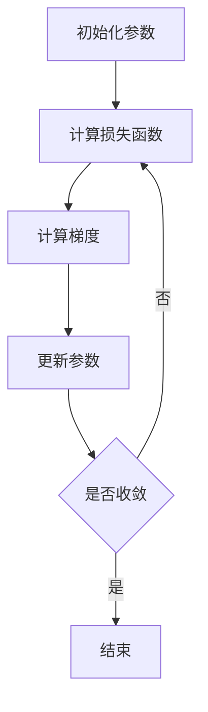
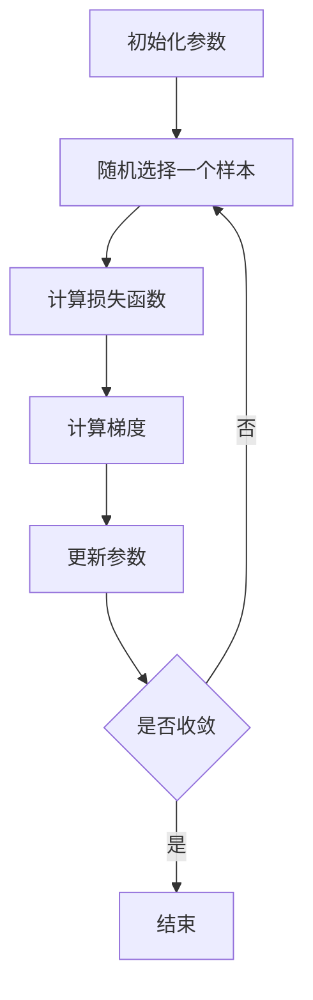

# AI人工智能深度学习算法：模型优化与参数调整

## 1.背景介绍

在过去的十年中，人工智能（AI）和深度学习（Deep Learning）技术取得了显著的进展，广泛应用于图像识别、自然语言处理、自动驾驶等领域。深度学习模型的性能在很大程度上依赖于模型的优化和参数调整。优化和调整不仅可以提高模型的准确性，还能显著减少训练时间和资源消耗。

## 2.核心概念与联系

### 2.1 模型优化

模型优化是指通过调整模型的参数，使其在给定任务上的性能达到最优。优化过程通常涉及损失函数的最小化，常用的优化算法包括梯度下降（Gradient Descent）、随机梯度下降（Stochastic Gradient Descent, SGD）等。

### 2.2 参数调整

参数调整（Hyperparameter Tuning）是指在模型训练之前或训练过程中，对模型的超参数进行选择和调整。超参数包括学习率（Learning Rate）、批量大小（Batch Size）、网络层数等。

### 2.3 优化与参数调整的联系

优化和参数调整是深度学习模型训练中不可分割的两个部分。优化算法通过调整模型参数来最小化损失函数，而参数调整则通过选择合适的超参数来提高优化算法的效率和效果。

## 3.核心算法原理具体操作步骤

### 3.1 梯度下降算法

梯度下降算法是最常用的优化算法之一，其基本思想是通过计算损失函数相对于模型参数的梯度，沿梯度的反方向更新参数。



### 3.2 随机梯度下降算法

随机梯度下降算法（SGD）是梯度下降算法的一种变体，每次迭代只使用一个样本来计算梯度，从而加快了训练速度。



### 3.3 超参数调整方法

#### 3.3.1 网格搜索（Grid Search）

网格搜索是一种穷举搜索方法，通过在预定义的超参数空间中进行遍历，找到最优的超参数组合。

#### 3.3.2 随机搜索（Random Search）

随机搜索通过在超参数空间中随机选择超参数组合，进行多次实验，找到性能最优的超参数。

## 4.数学模型和公式详细讲解举例说明

### 4.1 损失函数

损失函数是衡量模型预测值与真实值之间差异的函数。常用的损失函数包括均方误差（MSE）和交叉熵损失（Cross-Entropy Loss）。

$$
\text{MSE} = \frac{1}{n} \sum_{i=1}^{n} (y_i - \hat{y}_i)^2
$$

$$
\text{Cross-Entropy Loss} = -\sum_{i=1}^{n} y_i \log(\hat{y}_i)
$$

### 4.2 梯度计算

梯度是损失函数相对于模型参数的导数，用于指导参数更新。以均方误差为例，其梯度计算公式为：

$$
\frac{\partial \text{MSE}}{\partial \theta} = \frac{2}{n} \sum_{i=1}^{n} (y_i - \hat{y}_i) \cdot \frac{\partial \hat{y}_i}{\partial \theta}
$$

### 4.3 参数更新

参数更新公式为：

$$
\theta_{t+1} = \theta_t - \eta \cdot \nabla_\theta L(\theta)
$$

其中，$\eta$ 为学习率，$\nabla_\theta L(\theta)$ 为损失函数的梯度。

## 5.项目实践：代码实例和详细解释说明

### 5.1 梯度下降算法实现

以下是一个简单的梯度下降算法实现示例：

```python
import numpy as np

# 损失函数
def loss_function(y_true, y_pred):
    return np.mean((y_true - y_pred) ** 2)

# 梯度计算
def compute_gradient(X, y, theta):
    y_pred = X.dot(theta)
    error = y_pred - y
    gradient = X.T.dot(error) / len(y)
    return gradient

# 梯度下降算法
def gradient_descent(X, y, theta, learning_rate, iterations):
    for i in range(iterations):
        gradient = compute_gradient(X, y, theta)
        theta -= learning_rate * gradient
        if i % 100 == 0:
            loss = loss_function(y, X.dot(theta))
            print(f"Iteration {i}, Loss: {loss}")
    return theta

# 数据准备
X = np.array([[1, 1], [1, 2], [2, 2], [2, 3]])
y = np.dot(X, np.array([1, 2])) + 3
theta = np.zeros(2)

# 参数设置
learning_rate = 0.01
iterations = 1000

# 模型训练
theta = gradient_descent(X, y, theta, learning_rate, iterations)
print(f"Trained parameters: {theta}")
```

### 5.2 超参数调整示例

以下是一个使用网格搜索进行超参数调整的示例：

```python
from sklearn.model_selection import GridSearchCV
from sklearn.ensemble import RandomForestClassifier

# 数据准备
X_train, X_test, y_train, y_test = ...  # 数据集

# 模型和参数网格
model = RandomForestClassifier()
param_grid = {
    'n_estimators': [10, 50, 100],
    'max_depth': [None, 10, 20, 30],
    'min_samples_split': [2, 5, 10]
}

# 网格搜索
grid_search = GridSearchCV(estimator=model, param_grid=param_grid, cv=5)
grid_search.fit(X_train, y_train)

# 最优参数
best_params = grid_search.best_params_
print(f"Best parameters: {best_params}")
```

## 6.实际应用场景

### 6.1 图像识别

在图像识别任务中，深度学习模型（如卷积神经网络，CNN）通过优化和参数调整，可以显著提高图像分类的准确性。

### 6.2 自然语言处理

在自然语言处理任务中，优化和参数调整可以提高模型在文本分类、情感分析、机器翻译等任务上的性能。

### 6.3 自动驾驶

在自动驾驶领域，深度学习模型通过优化和参数调整，可以提高车辆的感知和决策能力，从而提高驾驶安全性。

## 7.工具和资源推荐

### 7.1 优化工具

- TensorFlow：一个开源的深度学习框架，提供了多种优化算法和工具。
- PyTorch：另一个流行的深度学习框架，支持动态计算图和多种优化算法。

### 7.2 参数调整工具

- Scikit-learn：一个机器学习库，提供了网格搜索和随机搜索等参数调整工具。
- Optuna：一个自动化超参数优化工具，支持多种优化算法。

## 8.总结：未来发展趋势与挑战

### 8.1 未来发展趋势

随着计算能力的提升和数据量的增加，深度学习模型的规模和复杂度将继续增长。未来，自动化优化和参数调整技术将成为提高模型性能的重要手段。

### 8.2 挑战

尽管优化和参数调整技术已经取得了显著进展，但在处理大规模数据和复杂模型时，仍然面临计算资源消耗大、训练时间长等挑战。如何在有限的资源下高效地进行优化和参数调整，将是未来研究的重要方向。

## 9.附录：常见问题与解答

### 9.1 如何选择合适的优化算法？

选择优化算法时，应考虑模型的复杂度、数据规模和计算资源。对于大规模数据，随机梯度下降（SGD）通常比批量梯度下降（Batch Gradient Descent）更高效。

### 9.2 如何确定学习率？

学习率是一个关键的超参数，通常通过实验确定。可以从较小的学习率开始，逐步增大，观察模型的收敛情况。

### 9.3 如何处理过拟合问题？

过拟合是指模型在训练集上表现良好，但在测试集上表现较差。可以通过正则化、增加训练数据、使用交叉验证等方法来缓解过拟合问题。

---

作者：禅与计算机程序设计艺术 / Zen and the Art of Computer Programming