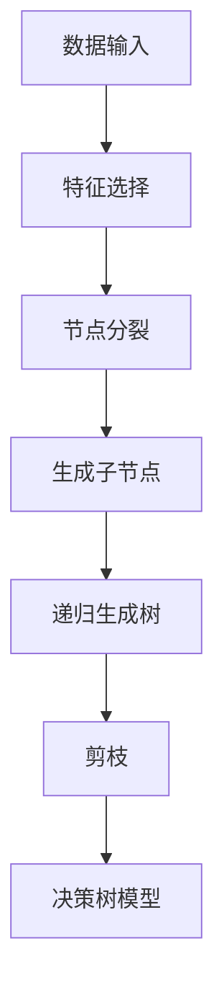

# 决策树算法在人工智能硬件加速中的应用

## 1.背景介绍

在人工智能和机器学习领域，决策树算法因其直观性和易于解释的特点，广泛应用于分类和回归任务。然而，随着数据规模的不断扩大和模型复杂度的增加，传统的基于CPU的计算方式在处理大规模数据时显得力不从心。硬件加速技术，如GPU和FPGA，为解决这一问题提供了新的思路。本文将探讨决策树算法在人工智能硬件加速中的应用，分析其核心概念、算法原理、数学模型，并通过实际项目实践展示其在不同应用场景中的优势。

## 2.核心概念与联系

### 2.1 决策树算法简介

决策树是一种树状结构的模型，用于决策和分类。每个内部节点表示一个特征，节点之间的分支表示特征的取值，叶节点表示决策结果。决策树的构建过程包括特征选择、树的生成和剪枝等步骤。

### 2.2 硬件加速简介

硬件加速是指利用专用硬件（如GPU、FPGA）来加速计算任务。GPU擅长并行计算，适用于大规模数据处理；FPGA则具有高度可编程性和低延迟的特点，适用于特定任务的加速。

### 2.3 决策树与硬件加速的联系

决策树算法的计算过程可以通过并行化和流水线化来加速。硬件加速技术能够显著提高决策树算法的计算效率，特别是在处理大规模数据和复杂模型时。

## 3.核心算法原理具体操作步骤

### 3.1 特征选择

特征选择是决策树构建的第一步，常用的方法包括信息增益、基尼指数等。特征选择的目的是找到最优的特征进行分裂，从而最大化分类效果。

### 3.2 树的生成

树的生成过程是递归的，从根节点开始，根据特征选择的结果不断分裂节点，直到满足停止条件（如节点纯度、树的深度等）。

### 3.3 剪枝

剪枝是为了防止过拟合，通过去除一些不必要的分支来简化模型。常用的剪枝方法包括预剪枝和后剪枝。

### 3.4 并行化与流水线化

在硬件加速中，决策树的生成和预测过程可以通过并行化和流水线化来提高效率。例如，GPU可以并行处理多个节点的分裂，FPGA可以通过流水线化实现高效的特征选择和节点分裂。



## 4.数学模型和公式详细讲解举例说明

### 4.1 信息增益

信息增益是特征选择的常用方法，定义为：

$$
IG(D, A) = H(D) - \sum_{v \in Values(A)} \frac{|D_v|}{|D|} H(D_v)
$$

其中，$H(D)$ 是数据集 $D$ 的熵，$D_v$ 是特征 $A$ 取值为 $v$ 的子集。

### 4.2 基尼指数

基尼指数是另一种特征选择方法，定义为：

$$
Gini(D) = 1 - \sum_{k=1}^{m} p_k^2
$$

其中，$p_k$ 是数据集中第 $k$ 类的概率。

### 4.3 剪枝的代价复杂度

剪枝的代价复杂度可以通过以下公式计算：

$$
C_\alpha(T) = C(T) + \alpha |T|
$$

其中，$C(T)$ 是树 $T$ 的误差，$|T|$ 是树的叶节点数，$\alpha$ 是剪枝参数。

## 5.项目实践：代码实例和详细解释说明

### 5.1 数据预处理

```python
import pandas as pd
from sklearn.model_selection import train_test_split

# 加载数据集
data = pd.read_csv('data.csv')
X = data.drop('target', axis=1)
y = data['target']

# 划分训练集和测试集
X_train, X_test, y_train, y_test = train_test_split(X, y, test_size=0.2, random_state=42)
```

### 5.2 构建决策树模型

```python
from sklearn.tree import DecisionTreeClassifier

# 初始化决策树分类器
clf = DecisionTreeClassifier(criterion='gini', max_depth=5)

# 训练模型
clf.fit(X_train, y_train)
```

### 5.3 模型评估

```python
from sklearn.metrics import accuracy_score

# 预测测试集
y_pred = clf.predict(X_test)

# 计算准确率
accuracy = accuracy_score(y_test, y_pred)
print(f'模型准确率: {accuracy:.2f}')
```

### 5.4 硬件加速实现

```python
import cupy as cp
from cuml import DecisionTreeClassifier as cuDecisionTreeClassifier

# 将数据转移到GPU
X_train_gpu = cp.asarray(X_train)
y_train_gpu = cp.asarray(y_train)

# 初始化GPU决策树分类器
clf_gpu = cuDecisionTreeClassifier(max_depth=5)

# 训练模型
clf_gpu.fit(X_train_gpu, y_train_gpu)
```

## 6.实际应用场景

### 6.1 医疗诊断

决策树算法在医疗诊断中广泛应用，通过分析患者的症状和体征，生成诊断决策树，辅助医生进行诊断。硬件加速技术可以显著提高诊断速度，特别是在处理大规模医疗数据时。

### 6.2 金融风控

在金融风控中，决策树算法用于信用评分、欺诈检测等任务。通过硬件加速，可以快速处理大量交易数据，提高风险评估的实时性和准确性。

### 6.3 图像分类

决策树算法在图像分类中也有应用，通过分析图像的特征，生成分类决策树。硬件加速技术可以显著提高图像分类的速度和精度。

## 7.工具和资源推荐

### 7.1 软件工具

- **Scikit-learn**：Python机器学习库，提供决策树算法的实现。
- **CuML**：NVIDIA提供的GPU加速机器学习库，支持决策树算法。
- **XGBoost**：高效的梯度提升决策树库，支持GPU加速。

### 7.2 硬件资源

- **NVIDIA GPU**：适用于大规模并行计算任务。
- **Xilinx FPGA**：适用于低延迟、高性能的特定任务加速。

### 7.3 在线资源

- **Kaggle**：数据科学竞赛平台，提供丰富的数据集和决策树算法的实践案例。
- **GitHub**：开源代码托管平台，提供大量决策树算法的实现和硬件加速的示例。

## 8.总结：未来发展趋势与挑战

### 8.1 未来发展趋势

随着数据规模的不断扩大和计算需求的增加，硬件加速技术将在决策树算法中发挥越来越重要的作用。未来，基于硬件加速的决策树算法将更加高效、智能，应用范围也将更加广泛。

### 8.2 挑战

尽管硬件加速技术具有显著的优势，但在实际应用中仍面临一些挑战，如硬件成本高、编程复杂度大等。此外，不同硬件平台的兼容性和可移植性也是需要解决的问题。

## 9.附录：常见问题与解答

### 9.1 决策树算法的优缺点是什么？

**优点**：
- 直观易懂，易于解释。
- 适用于分类和回归任务。
- 对数据的预处理要求较低。

**缺点**：
- 容易过拟合，特别是在数据噪声较大的情况下。
- 对于连续特征，需要进行离散化处理。
- 对于高维数据，决策树的构建效率较低。

### 9.2 如何选择合适的硬件加速平台？

选择硬件加速平台需要考虑以下因素：
- 计算任务的类型和规模。
- 硬件的性能和成本。
- 开发和维护的复杂度。
- 平台的兼容性和可移植性。

### 9.3 如何防止决策树过拟合？

防止决策树过拟合的方法包括：
- 使用剪枝技术，如预剪枝和后剪枝。
- 限制树的深度，设置最小样本分裂数等参数。
- 使用集成学习方法，如随机森林和梯度提升树。

---

作者：禅与计算机程序设计艺术 / Zen and the Art of Computer Programming