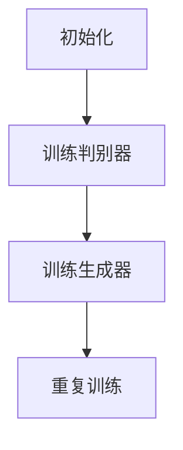

# 反向传播算法与生成对抗网络：GAN的训练之道

## 1.背景介绍

生成对抗网络（Generative Adversarial Networks，简称GAN）自2014年由Ian Goodfellow等人提出以来，迅速成为机器学习和深度学习领域的热门研究方向。GAN的核心思想是通过两个神经网络——生成器（Generator）和判别器（Discriminator）之间的对抗训练，生成逼真的数据样本。反向传播算法（Backpropagation）作为深度学习的基石，在GAN的训练过程中起到了至关重要的作用。

## 2.核心概念与联系

### 2.1 生成对抗网络（GAN）

GAN由两个主要部分组成：生成器和判别器。生成器的目标是生成逼真的数据样本，而判别器的目标是区分真实数据和生成数据。两者通过对抗训练不断提升各自的能力。

### 2.2 反向传播算法

反向传播算法是一种用于训练神经网络的优化算法。它通过计算损失函数的梯度，并将梯度反向传播到每一层神经元，从而更新网络的权重。

### 2.3 GAN与反向传播的联系

在GAN的训练过程中，反向传播算法用于更新生成器和判别器的权重。生成器和判别器的损失函数通过反向传播算法计算梯度，并根据梯度更新权重，从而不断提升生成数据的质量和判别数据的准确性。

## 3.核心算法原理具体操作步骤

### 3.1 初始化

1. 初始化生成器和判别器的权重。
2. 设定学习率和优化算法（如Adam）。

### 3.2 训练判别器

1. 从真实数据集中随机抽取一个批次的数据样本。
2. 从生成器中生成一个批次的假数据样本。
3. 将真实数据和假数据输入判别器，计算判别器的损失函数。
4. 使用反向传播算法更新判别器的权重。

### 3.3 训练生成器

1. 从生成器中生成一个批次的假数据样本。
2. 将假数据输入判别器，计算生成器的损失函数。
3. 使用反向传播算法更新生成器的权重。

### 3.4 重复训练

重复步骤3.2和3.3，直到生成器生成的数据样本足够逼真，判别器无法区分真实数据和假数据。



## 4.数学模型和公式详细讲解举例说明

### 4.1 判别器的损失函数

判别器的目标是最大化区分真实数据和生成数据的能力。其损失函数为：

$$
L_D = -\mathbb{E}_{x \sim p_{data}(x)}[\log D(x)] - \mathbb{E}_{z \sim p_z(z)}[\log(1 - D(G(z)))]
$$

其中，$D(x)$ 表示判别器对真实数据 $x$ 的判别结果，$G(z)$ 表示生成器对随机噪声 $z$ 的生成结果。

### 4.2 生成器的损失函数

生成器的目标是最小化判别器对生成数据的判别能力。其损失函数为：

$$
L_G = -\mathbb{E}_{z \sim p_z(z)}[\log D(G(z))]
$$

### 4.3 反向传播算法

反向传播算法通过链式法则计算损失函数对每一层权重的梯度，并更新权重。具体步骤如下：

1. 前向传播：计算每一层的输出。
2. 计算损失：根据输出和目标值计算损失函数。
3. 反向传播：计算损失函数对每一层权重的梯度。
4. 更新权重：根据梯度和学习率更新权重。

## 5.项目实践：代码实例和详细解释说明

以下是一个简单的GAN实现示例，使用Python和TensorFlow框架。

### 5.1 环境准备

```python
import tensorflow as tf
from tensorflow.keras import layers
import numpy as np
import matplotlib.pyplot as plt

# 设置随机种子
np.random.seed(42)
tf.random.set_seed(42)
```

### 5.2 构建生成器

```python
def build_generator():
    model = tf.keras.Sequential()
    model.add(layers.Dense(128, activation='relu', input_dim=100))
    model.add(layers.Dense(784, activation='sigmoid'))
    model.add(layers.Reshape((28, 28, 1)))
    return model

generator = build_generator()
```

### 5.3 构建判别器

```python
def build_discriminator():
    model = tf.keras.Sequential()
    model.add(layers.Flatten(input_shape=(28, 28, 1)))
    model.add(layers.Dense(128, activation='relu'))
    model.add(layers.Dense(1, activation='sigmoid'))
    return model

discriminator = build_discriminator()
discriminator.compile(optimizer='adam', loss='binary_crossentropy')
```

### 5.4 构建GAN模型

```python
def build_gan(generator, discriminator):
    discriminator.trainable = False
    model = tf.keras.Sequential()
    model.add(generator)
    model.add(discriminator)
    return model

gan = build_gan(generator, discriminator)
gan.compile(optimizer='adam', loss='binary_crossentropy')
```

### 5.5 训练GAN

```python
def train_gan(gan, generator, discriminator, epochs=10000, batch_size=128):
    for epoch in range(epochs):
        # 训练判别器
        real_data = np.random.rand(batch_size, 28, 28, 1)
        fake_data = generator.predict(np.random.randn(batch_size, 100))
        X = np.concatenate([real_data, fake_data])
        y = np.concatenate([np.ones((batch_size, 1)), np.zeros((batch_size, 1))])
        discriminator.trainable = True
        discriminator.train_on_batch(X, y)

        # 训练生成器
        noise = np.random.randn(batch_size, 100)
        y_gen = np.ones((batch_size, 1))
        discriminator.trainable = False
        gan.train_on_batch(noise, y_gen)

        if epoch % 1000 == 0:
            print(f'Epoch {epoch}/{epochs}')
            plot_generated_images(generator)

def plot_generated_images(generator, examples=10, dim=(1, 10), figsize=(10, 1)):
    noise = np.random.randn(examples, 100)
    generated_images = generator.predict(noise)
    plt.figure(figsize=figsize)
    for i in range(examples):
        plt.subplot(dim[0], dim[1], i+1)
        plt.imshow(generated_images[i].reshape(28, 28), cmap='gray')
        plt.axis('off')
    plt.tight_layout()
    plt.show()

train_gan(gan, generator, discriminator)
```

## 6.实际应用场景

### 6.1 图像生成

GAN在图像生成领域表现出色，可以生成高质量的图像，如人脸、风景等。

### 6.2 数据增强

在数据不足的情况下，GAN可以用于生成额外的数据样本，增强数据集的多样性。

### 6.3 图像修复

GAN可以用于图像修复，如去噪、超分辨率等。

### 6.4 文本生成

GAN也可以用于生成文本，如诗歌、新闻等。

## 7.工具和资源推荐

### 7.1 开源框架

- TensorFlow
- PyTorch
- Keras

### 7.2 学习资源

- 《深度学习》 by Ian Goodfellow
- Coursera上的深度学习课程
- GitHub上的开源项目

## 8.总结：未来发展趋势与挑战

GAN作为一种强大的生成模型，在图像生成、数据增强等领域展现了巨大的潜力。然而，GAN的训练过程存在不稳定性，容易出现模式崩溃（Mode Collapse）等问题。未来的研究方向包括改进GAN的训练算法、探索新的生成模型等。

## 9.附录：常见问题与解答

### 9.1 GAN训练不稳定怎么办？

可以尝试调整学习率、使用不同的优化算法（如Adam）、增加训练数据等方法。

### 9.2 如何解决模式崩溃问题？

可以尝试使用WGAN（Wasserstein GAN）等改进的GAN模型。

### 9.3 GAN生成的图像质量不高怎么办？

可以尝试增加生成器和判别器的层数、使用更复杂的网络结构等方法。

---

作者：禅与计算机程序设计艺术 / Zen and the Art of Computer Programming