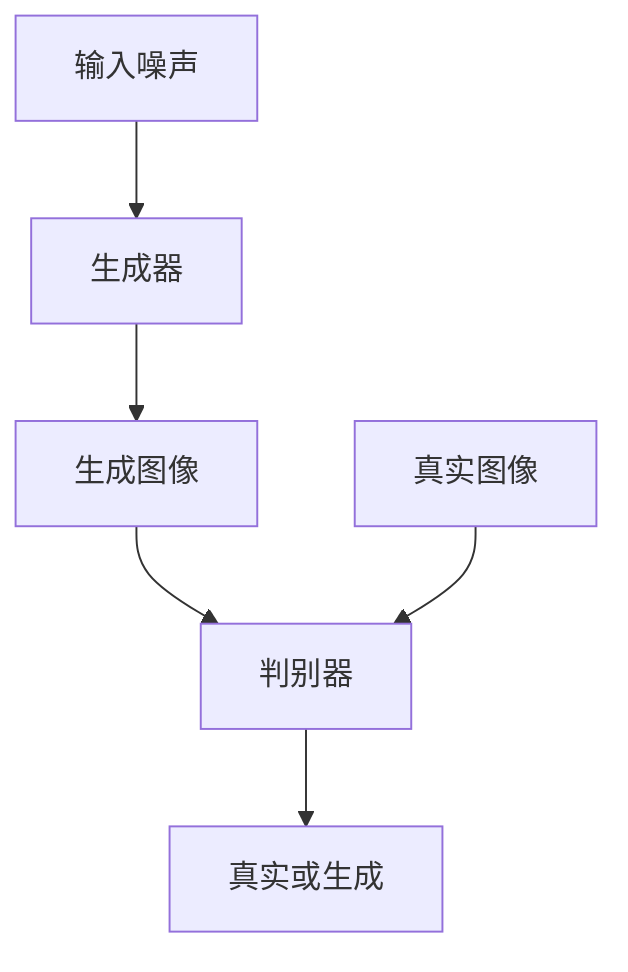

# 基于生成对抗网络的图像风格迁移在时尚设计中的应用

## 1.背景介绍

在时尚设计领域，图像风格迁移技术的应用正变得越来越普遍。图像风格迁移是一种将一种图像的风格应用到另一种图像上的技术，使得目标图像在保持其内容的同时，呈现出源图像的风格。生成对抗网络（GANs）作为一种强大的深度学习模型，已经在图像生成和转换任务中展示了其卓越的性能。本文将探讨基于生成对抗网络的图像风格迁移技术在时尚设计中的应用。

## 2.核心概念与联系

### 2.1 生成对抗网络（GANs）

生成对抗网络由两个主要部分组成：生成器（Generator）和判别器（Discriminator）。生成器的任务是生成逼真的图像，而判别器的任务是区分真实图像和生成图像。两者通过对抗训练不断提升各自的能力。

### 2.2 图像风格迁移

图像风格迁移是指将一种图像的风格应用到另一种图像上，使得目标图像在保持其内容的同时，呈现出源图像的风格。常见的方法包括基于卷积神经网络（CNN）的方法和基于生成对抗网络的方法。

### 2.3 GANs与图像风格迁移的联系

生成对抗网络在图像风格迁移中的应用主要体现在其生成器部分。生成器通过学习源图像的风格特征，并将其应用到目标图像上，从而实现风格迁移。

## 3.核心算法原理具体操作步骤

### 3.1 GANs的基本结构

生成对抗网络的基本结构如下图所示：



### 3.2 图像风格迁移的操作步骤

1. **数据准备**：收集源图像和目标图像。
2. **模型训练**：使用生成对抗网络进行训练，使生成器能够生成具有源图像风格的目标图像。
3. **风格迁移**：将训练好的生成器应用到目标图像上，实现风格迁移。

## 4.数学模型和公式详细讲解举例说明

### 4.1 生成对抗网络的损失函数

生成对抗网络的损失函数由生成器损失和判别器损失组成。生成器损失函数 $L_G$ 和判别器损失函数 $L_D$ 分别定义如下：

$$
L_G = -\mathbb{E}_{z \sim p_z(z)} [\log D(G(z))]
$$

$$
L_D = -\mathbb{E}_{x \sim p_{data}(x)} [\log D(x)] - \mathbb{E}_{z \sim p_z(z)} [\log (1 - D(G(z)))]
$$

其中，$G$ 表示生成器，$D$ 表示判别器，$z$ 表示输入噪声，$x$ 表示真实图像。

### 4.2 图像风格迁移的损失函数

图像风格迁移的损失函数通常包括内容损失和风格损失。内容损失 $L_{content}$ 和风格损失 $L_{style}$ 分别定义如下：

$$
L_{content} = \sum_{i} \| F_i^{target} - F_i^{generated} \|^2
$$

$$
L_{style} = \sum_{j} \| G_j^{target} - G_j^{generated} \|^2
$$

其中，$F_i$ 表示第 $i$ 层的特征图，$G_j$ 表示第 $j$ 层的Gram矩阵。

## 5.项目实践：代码实例和详细解释说明

### 5.1 环境准备

首先，确保安装了必要的Python库，如TensorFlow或PyTorch。

```python
import tensorflow as tf
from tensorflow.keras import layers
```

### 5.2 数据准备

加载源图像和目标图像。

```python
source_image = tf.io.read_file('source.jpg')
source_image = tf.image.decode_jpeg(source_image, channels=3)
target_image = tf.io.read_file('target.jpg')
target_image = tf.image.decode_jpeg(target_image, channels=3)
```

### 5.3 模型定义

定义生成器和判别器模型。

```python
def build_generator():
    model = tf.keras.Sequential()
    model.add(layers.Dense(256, input_dim=100))
    model.add(layers.LeakyReLU(alpha=0.2))
    model.add(layers.Dense(512))
    model.add(layers.LeakyReLU(alpha=0.2))
    model.add(layers.Dense(1024))
    model.add(layers.LeakyReLU(alpha=0.2))
    model.add(layers.Dense(28 * 28 * 1, activation='tanh'))
    model.add(layers.Reshape((28, 28, 1)))
    return model

def build_discriminator():
    model = tf.keras.Sequential()
    model.add(layers.Flatten(input_shape=(28, 28, 1)))
    model.add(layers.Dense(512))
    model.add(layers.LeakyReLU(alpha=0.2))
    model.add(layers.Dense(256))
    model.add(layers.LeakyReLU(alpha=0.2))
    model.add(layers.Dense(1, activation='sigmoid'))
    return model
```

### 5.4 模型训练

训练生成对抗网络。

```python
generator = build_generator()
discriminator = build_discriminator()

discriminator.compile(loss='binary_crossentropy', optimizer='adam', metrics=['accuracy'])

z = tf.random.normal([batch_size, noise_dim])
generated_images = generator(z, training=False)

real_output = discriminator(real_images, training=True)
fake_output = discriminator(generated_images, training=True)

gen_loss = generator_loss(fake_output)
disc_loss = discriminator_loss(real_output, fake_output)
```

### 5.5 风格迁移

使用训练好的生成器进行风格迁移。

```python
generated_image = generator(target_image)
```

## 6.实际应用场景

### 6.1 时尚设计

在时尚设计中，图像风格迁移可以用于将不同风格的设计元素应用到服装、配饰等产品上，从而实现独特的设计效果。

### 6.2 艺术创作

艺术家可以使用图像风格迁移技术，将自己的创作风格应用到不同的作品中，创造出具有独特风格的艺术品。

### 6.3 广告设计

广告设计师可以使用图像风格迁移技术，将品牌的风格应用到广告素材中，从而提高广告的视觉吸引力。

## 7.工具和资源推荐

### 7.1 开源框架

- TensorFlow
- PyTorch

### 7.2 数据集

- COCO Dataset
- ImageNet

### 7.3 在线资源

- GitHub上的开源项目
- 相关的技术博客和论文

## 8.总结：未来发展趋势与挑战

### 8.1 未来发展趋势

随着深度学习技术的不断发展，生成对抗网络在图像风格迁移中的应用将会越来越广泛。未来，可能会出现更加高效和稳定的模型，能够在更短的时间内实现更高质量的风格迁移。

### 8.2 挑战

尽管生成对抗网络在图像风格迁移中表现出色，但仍然存在一些挑战。例如，模型训练过程中的不稳定性、对大规模数据集的需求等问题，仍需进一步研究和解决。

## 9.附录：常见问题与解答

### 9.1 什么是生成对抗网络？

生成对抗网络是一种由生成器和判别器组成的深度学习模型，通过对抗训练生成逼真的图像。

### 9.2 图像风格迁移的应用场景有哪些？

图像风格迁移可以应用于时尚设计、艺术创作、广告设计等领域。

### 9.3 如何提高图像风格迁移的效果？

可以通过改进生成对抗网络的结构、增加训练数据量、使用更高效的优化算法等方法来提高图像风格迁移的效果。

---

作者：禅与计算机程序设计艺术 / Zen and the Art of Computer Programming