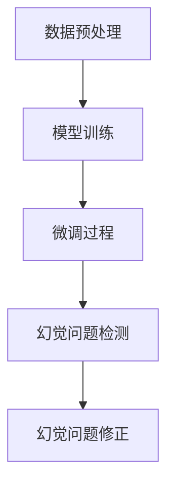

# 大语言模型原理与工程实践：大语言模型微调的幻觉问题

## 1.背景介绍

大语言模型（Large Language Models, LLMs）近年来在自然语言处理（NLP）领域取得了显著的进展。诸如GPT-3、BERT等模型在各种任务中表现出色。然而，随着这些模型的广泛应用，研究人员和工程师们也发现了一些问题，其中之一便是“幻觉问题”（Hallucination Problem）。幻觉问题指的是模型在生成文本时，输出了不真实或不准确的信息。这一问题在实际应用中可能导致严重的后果，因此需要深入研究和解决。

## 2.核心概念与联系

### 2.1 大语言模型简介

大语言模型是基于深度学习的模型，通常使用大量的文本数据进行训练，以捕捉语言的复杂模式和结构。它们能够生成高质量的文本，完成翻译、摘要、问答等任务。

### 2.2 幻觉问题定义

幻觉问题是指大语言模型在生成文本时，输出了与事实不符或完全虚构的信息。这种现象在生成式任务中尤为常见，如文本生成、对话系统等。

### 2.3 幻觉问题的影响

幻觉问题不仅影响模型的可信度，还可能在实际应用中带来严重的后果。例如，在医疗、法律等领域，错误的信息可能导致严重的后果。

## 3.核心算法原理具体操作步骤

### 3.1 数据预处理

数据预处理是训练大语言模型的第一步。包括数据清洗、去重、分词等步骤。高质量的数据是训练高性能模型的基础。

### 3.2 模型训练

模型训练是大语言模型构建的核心步骤。通常使用Transformer架构，通过大量的文本数据进行训练。训练过程中需要注意超参数的选择和调整。

### 3.3 微调过程

微调是指在预训练模型的基础上，使用特定领域的数据进行再训练，以提高模型在特定任务上的表现。微调过程中需要注意数据的选择和训练策略。

### 3.4 幻觉问题检测与修正

幻觉问题的检测与修正是解决该问题的关键步骤。可以使用多种方法进行检测，如人工评估、自动评估等。修正方法包括数据增强、模型改进等。



## 4.数学模型和公式详细讲解举例说明

### 4.1 Transformer架构

Transformer是大语言模型的基础架构。其核心组件包括自注意力机制（Self-Attention）和前馈神经网络（Feed-Forward Neural Network）。

$$
\text{Attention}(Q, K, V) = \text{softmax}\left(\frac{QK^T}{\sqrt{d_k}}\right)V
$$

其中，$Q$、$K$、$V$分别表示查询向量、键向量和值向量，$d_k$表示键向量的维度。

### 4.2 损失函数

大语言模型的训练通常使用交叉熵损失函数（Cross-Entropy Loss）：

$$
L = -\sum_{i=1}^{N} y_i \log(\hat{y}_i)
$$

其中，$y_i$表示真实标签，$\hat{y}_i$表示模型预测的概率。

### 4.3 微调过程中的损失函数

在微调过程中，损失函数可以根据具体任务进行调整。例如，对于文本分类任务，可以使用分类损失函数：

$$
L_{\text{classification}} = -\sum_{i=1}^{N} y_i \log(\hat{y}_i)
$$

对于生成任务，可以使用生成损失函数：

$$
L_{\text{generation}} = -\sum_{i=1}^{N} \sum_{t=1}^{T} y_{i,t} \log(\hat{y}_{i,t})
$$

## 5.项目实践：代码实例和详细解释说明

### 5.1 数据预处理代码示例

```python
import pandas as pd
from sklearn.model_selection import train_test_split

# 读取数据
data = pd.read_csv('data.csv')

# 数据清洗
data.dropna(inplace=True)

# 分词
data['text'] = data['text'].apply(lambda x: x.split())

# 划分训练集和测试集
train_data, test_data = train_test_split(data, test_size=0.2)
```

### 5.2 模型训练代码示例

```python
from transformers import GPT2LMHeadModel, GPT2Tokenizer, Trainer, TrainingArguments

# 加载预训练模型和分词器
model = GPT2LMHeadModel.from_pretrained('gpt2')
tokenizer = GPT2Tokenizer.from_pretrained('gpt2')

# 数据编码
train_encodings = tokenizer(train_data['text'].tolist(), truncation=True, padding=True)
test_encodings = tokenizer(test_data['text'].tolist(), truncation=True, padding=True)

# 定义训练参数
training_args = TrainingArguments(
    output_dir='./results',
    num_train_epochs=3,
    per_device_train_batch_size=4,
    per_device_eval_batch_size=4,
    warmup_steps=500,
    weight_decay=0.01,
    logging_dir='./logs',
)

# 定义Trainer
trainer = Trainer(
    model=model,
    args=training_args,
    train_dataset=train_encodings,
    eval_dataset=test_encodings,
)

# 开始训练
trainer.train()
```

### 5.3 微调代码示例

```python
# 加载特定领域数据
domain_data = pd.read_csv('domain_data.csv')

# 数据预处理
domain_data['text'] = domain_data['text'].apply(lambda x: x.split())

# 数据编码
domain_encodings = tokenizer(domain_data['text'].tolist(), truncation=True, padding=True)

# 微调模型
trainer.train_dataset = domain_encodings
trainer.train()
```

### 5.4 幻觉问题检测与修正代码示例

```python
# 幻觉问题检测
def detect_hallucination(text):
    # 简单的检测方法：检查生成文本中的特定关键词
    hallucination_keywords = ['fake', 'not real', 'incorrect']
    for keyword in hallucination_keywords:
        if keyword in text:
            return True
    return False

# 修正方法：数据增强
def augment_data(data):
    # 简单的数据增强方法：同义词替换
    augmented_data = []
    for text in data:
        augmented_text = text.replace('incorrect', 'wrong')
        augmented_data.append(augmented_text)
    return augmented_data

# 应用修正方法
augmented_train_data = augment_data(train_data['text'].tolist())
augmented_train_encodings = tokenizer(augmented_train_data, truncation=True, padding=True)

# 重新训练模型
trainer.train_dataset = augmented_train_encodings
trainer.train()
```

## 6.实际应用场景

### 6.1 医疗领域

在医疗领域，大语言模型可以用于生成医疗报告、辅助诊断等。然而，幻觉问题可能导致错误的诊断信息，因此需要特别注意模型的准确性和可靠性。

### 6.2 法律领域

在法律领域，大语言模型可以用于法律文书的生成和分析。然而，幻觉问题可能导致错误的法律建议，因此需要严格的验证和评估。

### 6.3 教育领域

在教育领域，大语言模型可以用于自动生成教学材料、辅助教学等。然而，幻觉问题可能导致错误的知识传递，因此需要加强模型的训练和评估。

## 7.工具和资源推荐

### 7.1 工具推荐

- **Hugging Face Transformers**：一个强大的NLP库，支持多种大语言模型的训练和微调。
- **TensorFlow**：一个广泛使用的深度学习框架，支持大语言模型的训练和部署。
- **PyTorch**：另一个流行的深度学习框架，支持大语言模型的训练和微调。

### 7.2 资源推荐

- **OpenAI GPT-3**：一个强大的大语言模型，支持多种NLP任务。
- **BERT**：一个预训练的语言模型，广泛应用于各种NLP任务。
- **Google Scholar**：一个学术搜索引擎，可以查找相关的研究论文和资源。

## 8.总结：未来发展趋势与挑战

大语言模型在NLP领域取得了显著的进展，但幻觉问题仍然是一个亟待解决的挑战。未来的发展趋势包括：

- **更高质量的数据**：高质量的数据是训练高性能模型的基础，未来需要更多高质量的数据集。
- **更强大的模型**：未来的大语言模型将更加复杂和强大，能够更好地捕捉语言的复杂模式。
- **更有效的幻觉问题检测与修正方法**：需要开发更有效的检测和修正方法，以解决幻觉问题。

## 9.附录：常见问题与解答

### 9.1 什么是大语言模型？

大语言模型是基于深度学习的模型，使用大量的文本数据进行训练，以捕捉语言的复杂模式和结构。

### 9.2 什么是幻觉问题？

幻觉问题是指大语言模型在生成文本时，输出了与事实不符或完全虚构的信息。

### 9.3 如何解决幻觉问题？

解决幻觉问题的方法包括数据增强、模型改进、幻觉问题检测与修正等。

### 9.4 大语言模型的实际应用有哪些？

大语言模型在医疗、法律、教育等领域有广泛的应用，如生成医疗报告、法律文书、教学材料等。

### 9.5 哪些工具和资源可以帮助训练大语言模型？

推荐的工具包括Hugging Face Transformers、TensorFlow、PyTorch等；推荐的资源包括OpenAI GPT-3、BERT、Google Scholar等。

---

作者：禅与计算机程序设计艺术 / Zen and the Art of Computer Programming