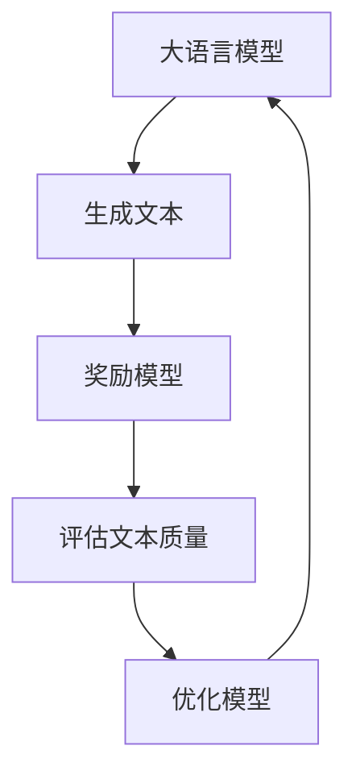

# 大语言模型原理与工程实践：奖励模型的训练

## 1.背景介绍

在人工智能领域，特别是自然语言处理（NLP）中，大语言模型（Large Language Models, LLMs）已经成为了研究和应用的热点。大语言模型如GPT-3、BERT等，通过大量的文本数据进行训练，能够生成高质量的自然语言文本。然而，如何进一步提升这些模型的性能，特别是如何通过奖励模型（Reward Model, RM）来优化生成的文本质量，成为了一个重要的研究方向。

奖励模型的训练是强化学习（Reinforcement Learning, RL）在大语言模型中的应用。通过设计合理的奖励函数，模型可以在生成文本时不断优化自身，生成更符合预期的高质量文本。本文将深入探讨奖励模型的原理、算法、数学模型、实际应用以及未来的发展趋势。

## 2.核心概念与联系

### 2.1 大语言模型

大语言模型是通过大量文本数据训练的深度学习模型，能够理解和生成自然语言文本。常见的大语言模型包括GPT-3、BERT、T5等。

### 2.2 强化学习

强化学习是一种机器学习方法，通过与环境的交互，学习如何采取行动以最大化累积奖励。强化学习的核心包括状态、动作、奖励和策略。

### 2.3 奖励模型

奖励模型是强化学习中的一个关键组件，用于评估模型生成的文本质量。通过设计合理的奖励函数，模型可以在生成文本时不断优化自身，生成更符合预期的高质量文本。

### 2.4 关系图



## 3.核心算法原理具体操作步骤

### 3.1 数据预处理

在训练奖励模型之前，需要对数据进行预处理。包括文本的清洗、分词、去停用词等操作。

### 3.2 模型初始化

初始化大语言模型和奖励模型。大语言模型可以使用预训练模型，如GPT-3，而奖励模型可以使用简单的线性模型或复杂的神经网络。

### 3.3 训练过程

#### 3.3.1 生成文本

使用大语言模型生成文本。生成的文本作为输入，传递给奖励模型。

#### 3.3.2 计算奖励

奖励模型对生成的文本进行评估，计算奖励值。奖励值可以基于文本的流畅性、语义一致性等多个指标。

#### 3.3.3 更新模型

根据奖励值，使用强化学习算法（如策略梯度、Q学习等）更新大语言模型的参数。

### 3.4 迭代优化

重复上述步骤，直到模型收敛，生成的文本质量达到预期。

## 4.数学模型和公式详细讲解举例说明

### 4.1 强化学习基本公式

在强化学习中，目标是最大化累积奖励。累积奖励的期望值可以表示为：

$$
G_t = \sum_{k=0}^{\infty} \gamma^k R_{t+k+1}
$$

其中，$G_t$ 是时间步 $t$ 的累积奖励，$\gamma$ 是折扣因子，$R_{t+k+1}$ 是时间步 $t+k+1$ 的即时奖励。

### 4.2 策略梯度算法

策略梯度算法通过优化策略 $\pi_\theta$ 来最大化累积奖励。策略梯度的更新公式为：

$$
\nabla_\theta J(\theta) = \mathbb{E}_{\pi_\theta} \left[ \nabla_\theta \log \pi_\theta(a|s) G_t \right]
$$

其中，$J(\theta)$ 是策略的期望累积奖励，$\pi_\theta(a|s)$ 是在状态 $s$ 下采取动作 $a$ 的概率。

### 4.3 奖励模型的设计

奖励模型的设计是关键。假设奖励模型为 $R_\phi$，其参数为 $\phi$，则奖励值可以表示为：

$$
R_\phi(s, a) = f_\phi(s, a)
$$

其中，$f_\phi$ 是一个函数，用于评估状态 $s$ 和动作 $a$ 的质量。

## 5.项目实践：代码实例和详细解释说明

### 5.1 数据预处理

```python
import nltk
from nltk.corpus import stopwords
from nltk.tokenize import word_tokenize

# 下载停用词
nltk.download('stopwords')
nltk.download('punkt')

# 文本预处理函数
def preprocess_text(text):
    # 分词
    words = word_tokenize(text)
    # 去停用词
    words = [word for word in words if word.lower() not in stopwords.words('english')]
    return ' '.join(words)

# 示例文本
text = "This is an example sentence for text preprocessing."
processed_text = preprocess_text(text)
print(processed_text)
```

### 5.2 模型初始化

```python
from transformers import GPT2LMHeadModel, GPT2Tokenizer

# 加载预训练的GPT-2模型和分词器
model_name = 'gpt2'
model = GPT2LMHeadModel.from_pretrained(model_name)
tokenizer = GPT2Tokenizer.from_pretrained(model_name)
```

### 5.3 训练过程

#### 5.3.1 生成文本

```python
# 生成文本函数
def generate_text(model, tokenizer, prompt, max_length=50):
    inputs = tokenizer.encode(prompt, return_tensors='pt')
    outputs = model.generate(inputs, max_length=max_length, num_return_sequences=1)
    return tokenizer.decode(outputs[0], skip_special_tokens=True)

# 示例生成
prompt = "Once upon a time"
generated_text = generate_text(model, tokenizer, prompt)
print(generated_text)
```

#### 5.3.2 计算奖励

```python
# 假设奖励模型为简单的线性模型
import numpy as np

# 奖励函数
def reward_function(text):
    # 示例：基于文本长度的奖励
    return len(text.split())

# 计算奖励
reward = reward_function(generated_text)
print(f"Reward: {reward}")
```

#### 5.3.3 更新模型

```python
# 示例：使用策略梯度算法更新模型
# 这里只是一个示例，实际更新过程需要更复杂的实现

# 假设我们有一个简单的策略梯度更新函数
def update_model(model, reward):
    # 示例：简单地调整模型参数
    for param in model.parameters():
        param.data += 0.01 * reward

# 更新模型
update_model(model, reward)
```

## 6.实际应用场景

### 6.1 文本生成

奖励模型可以用于优化文本生成任务，如新闻生成、故事生成等。通过设计合理的奖励函数，可以生成更符合预期的高质量文本。

### 6.2 对话系统

在对话系统中，奖励模型可以用于优化对话的流畅性和语义一致性。通过不断优化，系统可以生成更自然、更有意义的对话。

### 6.3 机器翻译

奖励模型可以用于优化机器翻译的质量。通过设计合理的奖励函数，可以生成更准确、更流畅的翻译文本。

## 7.工具和资源推荐

### 7.1 工具

- **Transformers**：Hugging Face 提供的预训练模型库，支持多种大语言模型。
- **NLTK**：自然语言处理工具包，提供丰富的文本预处理功能。
- **TensorFlow** 和 **PyTorch**：深度学习框架，支持大语言模型和奖励模型的训练。

### 7.2 资源

- **OpenAI GPT-3**：提供强大的文本生成能力。
- **BERT**：用于文本理解的预训练模型。
- **Reinforcement Learning: An Introduction**：强化学习的经典教材，详细介绍了强化学习的基本原理和算法。

## 8.总结：未来发展趋势与挑战

奖励模型在大语言模型中的应用具有广阔的前景。通过合理设计奖励函数，可以显著提升文本生成的质量。然而，奖励模型的设计和训练也面临诸多挑战，如奖励函数的设计、训练效率的提升等。未来，随着强化学习和大语言模型的不断发展，奖励模型的应用将更加广泛和深入。

## 9.附录：常见问题与解答

### 9.1 奖励模型的设计有哪些注意事项？

奖励模型的设计需要考虑多个因素，如文本的流畅性、语义一致性等。合理的奖励函数设计是提升模型性能的关键。

### 9.2 如何提高奖励模型的训练效率？

可以通过并行计算、分布式训练等方法提高奖励模型的训练效率。此外，使用预训练模型进行微调也是一种有效的方法。

### 9.3 奖励模型在实际应用中有哪些挑战？

奖励模型在实际应用中面临诸多挑战，如奖励函数的设计、训练数据的获取、模型的泛化能力等。需要不断探索和优化，才能在实际应用中取得良好的效果。

---

作者：禅与计算机程序设计艺术 / Zen and the Art of Computer Programming