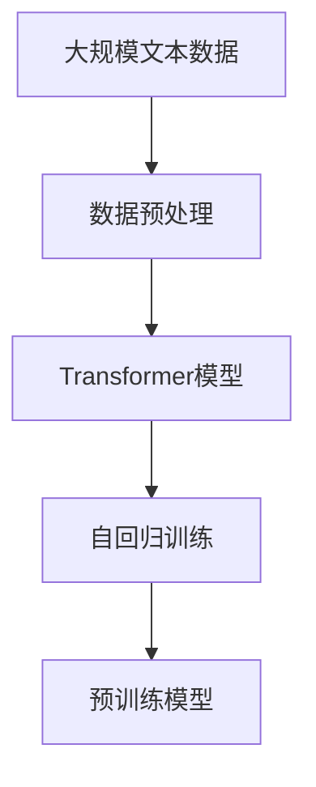
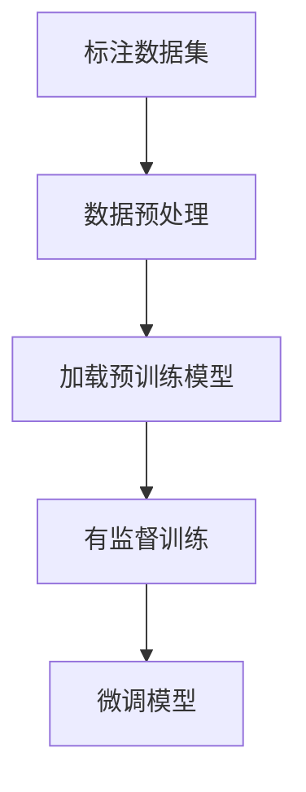

# 大语言模型原理与工程实践：有监督微调的应用场景

## 1.背景介绍

大语言模型（Large Language Models, LLMs）近年来在自然语言处理（NLP）领域取得了显著的进展。自从OpenAI发布了GPT系列模型以来，LLMs在文本生成、翻译、问答系统等多个应用场景中展现了强大的能力。然而，尽管这些模型在预训练阶段已经具备了广泛的语言理解能力，但在特定任务上的表现仍然需要进一步优化。这就引出了有监督微调（Supervised Fine-Tuning, SFT）的概念。

有监督微调是指在预训练模型的基础上，利用特定任务的数据进行进一步训练，以提升模型在该任务上的表现。本文将深入探讨大语言模型的原理、核心算法、数学模型，并通过实际项目实践展示有监督微调的应用场景。

## 2.核心概念与联系

### 2.1 大语言模型

大语言模型是基于深度学习的自然语言处理模型，通常采用Transformer架构。其核心思想是通过大规模的文本数据进行预训练，使模型能够捕捉语言的语法、语义和上下文信息。

### 2.2 有监督微调

有监督微调是在预训练模型的基础上，利用标注数据进行进一步训练。其目的是使模型在特定任务上表现更优。微调过程通常包括以下步骤：

1. 数据准备：收集并标注特定任务的数据集。
2. 模型初始化：加载预训练的大语言模型。
3. 微调训练：使用标注数据对模型进行训练。
4. 模型评估：评估微调后的模型在特定任务上的表现。

### 2.3 预训练与微调的关系

预训练和微调是大语言模型训练过程中的两个重要阶段。预训练阶段通过大规模无监督学习，使模型具备广泛的语言理解能力；微调阶段通过有监督学习，使模型在特定任务上表现更优。

## 3.核心算法原理具体操作步骤

### 3.1 预训练阶段

预训练阶段通常采用自回归或自编码的方式进行。以GPT为例，其预训练过程可以描述为：



### 3.2 微调阶段

微调阶段的操作步骤如下：



### 3.3 具体操作步骤

1. **数据准备**：收集并标注特定任务的数据集。
2. **模型初始化**：加载预训练的大语言模型。
3. **微调训练**：使用标注数据对模型进行训练。
4. **模型评估**：评估微调后的模型在特定任务上的表现。

## 4.数学模型和公式详细讲解举例说明

### 4.1 预训练目标

预训练阶段的目标是通过最大化似然估计来学习语言模型。以自回归模型为例，其目标函数可以表示为：

$$
L(\theta) = \sum_{t=1}^{T} \log P(x_t | x_{1:t-1}; \theta)
$$

其中，$x_t$ 表示第 $t$ 个词，$\theta$ 表示模型参数。

### 4.2 微调目标

微调阶段的目标是通过有监督学习来优化特定任务的损失函数。以分类任务为例，其目标函数可以表示为：

$$
L(\theta) = -\sum_{i=1}^{N} y_i \log P(y_i | x_i; \theta)
$$

其中，$y_i$ 表示第 $i$ 个样本的标签，$x_i$ 表示第 $i$ 个样本的输入。

### 4.3 举例说明

假设我们要进行文本分类任务，预训练阶段的目标是学习语言模型：

$$
L_{pretrain}(\theta) = \sum_{t=1}^{T} \log P(x_t | x_{1:t-1}; \theta)
$$

微调阶段的目标是优化分类任务的损失函数：

$$
L_{finetune}(\theta) = -\sum_{i=1}^{N} y_i \log P(y_i | x_i; \theta)
$$

通过微调，我们可以使模型在特定任务上的表现更优。

## 5.项目实践：代码实例和详细解释说明

### 5.1 数据准备

首先，我们需要准备一个标注数据集。以文本分类任务为例，我们可以使用以下代码进行数据预处理：

```python
import pandas as pd
from sklearn.model_selection import train_test_split

# 加载数据集
data = pd.read_csv('dataset.csv')

# 数据预处理
X = data['text']
y = data['label']

# 划分训练集和测试集
X_train, X_test, y_train, y_test = train_test_split(X, y, test_size=0.2, random_state=42)
```

### 5.2 模型初始化

接下来，我们需要加载预训练的大语言模型。以Hugging Face的Transformers库为例：

```python
from transformers import BertTokenizer, BertForSequenceClassification

# 加载预训练模型和分词器
tokenizer = BertTokenizer.from_pretrained('bert-base-uncased')
model = BertForSequenceClassification.from_pretrained('bert-base-uncased')
```

### 5.3 微调训练

使用标注数据对模型进行微调训练：

```python
from transformers import Trainer, TrainingArguments

# 数据编码
train_encodings = tokenizer(X_train.tolist(), truncation=True, padding=True)
test_encodings = tokenizer(X_test.tolist(), truncation=True, padding=True)

# 创建数据集
class TextDataset(torch.utils.data.Dataset):
    def __init__(self, encodings, labels):
        self.encodings = encodings
        self.labels = labels

    def __getitem__(self, idx):
        item = {key: torch.tensor(val[idx]) for key, val in self.encodings.items()}
        item['labels'] = torch.tensor(self.labels[idx])
        return item

    def __len__(self):
        return len(self.labels)

train_dataset = TextDataset(train_encodings, y_train.tolist())
test_dataset = TextDataset(test_encodings, y_test.tolist())

# 训练参数
training_args = TrainingArguments(
    output_dir='./results',
    num_train_epochs=3,
    per_device_train_batch_size=16,
    per_device_eval_batch_size=16,
    warmup_steps=500,
    weight_decay=0.01,
    logging_dir='./logs',
)

# 创建Trainer
trainer = Trainer(
    model=model,
    args=training_args,
    train_dataset=train_dataset,
    eval_dataset=test_dataset,
)

# 训练模型
trainer.train()
```

### 5.4 模型评估

评估微调后的模型在测试集上的表现：

```python
# 评估模型
results = trainer.evaluate()
print(results)
```

## 6.实际应用场景

### 6.1 文本分类

文本分类是有监督微调的一个典型应用场景。通过微调预训练的大语言模型，我们可以实现高精度的文本分类任务，如垃圾邮件检测、情感分析等。

### 6.2 问答系统

问答系统是另一个重要的应用场景。通过微调预训练模型，我们可以构建高效的问答系统，回答用户提出的问题。

### 6.3 机器翻译

机器翻译也是有监督微调的一个重要应用。通过微调预训练模型，我们可以实现高质量的机器翻译系统。

### 6.4 文本生成

文本生成任务包括自动写作、对话生成等。通过微调预训练模型，我们可以生成高质量的文本内容。

## 7.工具和资源推荐

### 7.1 编程工具

- **Python**：大多数大语言模型的实现和微调都使用Python编程语言。
- **Jupyter Notebook**：用于数据分析和模型训练的交互式编程环境。
- **PyTorch**：一个流行的深度学习框架，广泛用于大语言模型的实现和微调。

### 7.2 资源推荐

- **Hugging Face Transformers**：一个开源库，提供了大量预训练的大语言模型和微调工具。
- **Kaggle**：一个数据科学竞赛平台，提供了丰富的数据集和竞赛机会。
- **arXiv**：一个学术论文预印本平台，提供了大量关于大语言模型和有监督微调的最新研究成果。

## 8.总结：未来发展趋势与挑战

### 8.1 未来发展趋势

大语言模型和有监督微调在未来将继续发展，主要趋势包括：

- **模型规模的进一步扩大**：随着计算资源的增加，模型规模将继续扩大，提升语言理解和生成能力。
- **多模态学习**：结合文本、图像、音频等多种模态的数据，提升模型的综合理解能力。
- **自监督学习**：通过自监督学习方法，减少对标注数据的依赖，提升模型的泛化能力。

### 8.2 挑战

尽管大语言模型和有监督微调在多个应用场景中取得了显著进展，但仍面临一些挑战：

- **计算资源需求高**：大语言模型的训练和微调需要大量的计算资源，限制了其广泛应用。
- **数据隐私和安全**：在使用大规模数据进行训练时，需要注意数据隐私和安全问题。
- **模型解释性**：大语言模型的复杂性使得其内部机制难以解释，影响了其在某些领域的应用。

## 9.附录：常见问题与解答

### 9.1 什么是大语言模型？

大语言模型是基于深度学习的自然语言处理模型，通常采用Transformer架构，通过大规模的文本数据进行预训练，具备广泛的语言理解能力。

### 9.2 什么是有监督微调？

有监督微调是在预训练模型的基础上，利用标注数据进行进一步训练，以提升模型在特定任务上的表现。

### 9.3 如何进行有监督微调？

有监督微调的步骤包括数据准备、模型初始化、微调训练和模型评估。具体操作可以参考本文的项目实践部分。

### 9.4 有监督微调的应用场景有哪些？

有监督微调的应用场景包括文本分类、问答系统、机器翻译和文本生成等。

### 9.5 有监督微调面临哪些挑战？

有监督微调面临的挑战包括计算资源需求高、数据隐私和安全问题以及模型解释性等。

---

作者：禅与计算机程序设计艺术 / Zen and the Art of Computer Programming