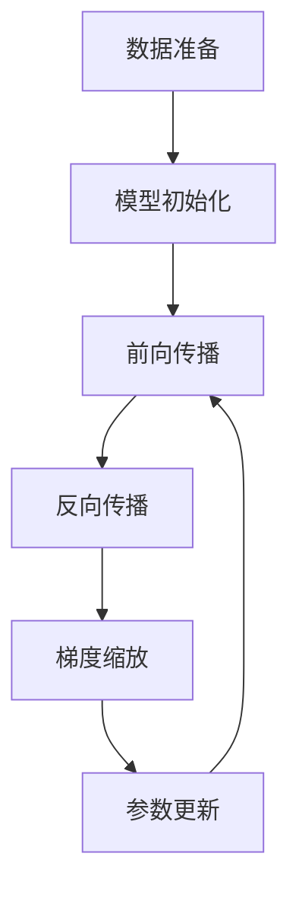

# 大语言模型原理基础与前沿 混合精度

## 1.背景介绍

大语言模型（Large Language Models, LLMs）近年来在自然语言处理（NLP）领域取得了显著的进展。诸如GPT-3、BERT等模型在各种任务中表现出色。然而，这些模型的训练和推理过程需要大量的计算资源和存储空间。混合精度训练（Mixed Precision Training）作为一种优化技术，能够在不显著降低模型性能的前提下，减少计算资源的消耗，提高训练速度。

## 2.核心概念与联系

### 2.1 大语言模型

大语言模型是基于深度学习的模型，通常包含数十亿甚至上千亿个参数。它们通过大量的文本数据进行训练，能够生成高质量的自然语言文本，完成翻译、问答等任务。

### 2.2 混合精度训练

混合精度训练是一种在训练过程中同时使用多种数值精度（如FP32和FP16）的技术。其核心思想是利用低精度（如FP16）进行大部分计算，以减少内存占用和提高计算速度，同时在关键步骤中使用高精度（如FP32）以保证数值稳定性。

### 2.3 两者的联系

混合精度训练在大语言模型的训练中尤为重要。由于大语言模型的参数量巨大，传统的FP32训练方式会导致显著的内存和计算资源消耗。通过混合精度训练，可以在保证模型性能的前提下，大幅度提高训练效率。

## 3.核心算法原理具体操作步骤

### 3.1 数据准备

在混合精度训练中，首先需要对数据进行预处理。数据的预处理包括文本的清洗、分词、编码等步骤。

### 3.2 模型初始化

初始化模型参数，通常使用FP32格式。此时，模型的权重和偏置参数都以高精度存储。

### 3.3 前向传播

在前向传播过程中，输入数据和模型参数会被转换为FP16格式进行计算。这样可以显著减少内存占用和计算时间。

### 3.4 反向传播

反向传播过程中，梯度计算也使用FP16格式。然而，为了保证数值稳定性，梯度累积和更新步骤会转换回FP32格式。

### 3.5 梯度缩放

为了避免数值下溢，混合精度训练中常使用梯度缩放技术。具体操作是将梯度乘以一个缩放因子，在更新参数前再除以该因子。

### 3.6 参数更新

使用优化器（如Adam、SGD）更新模型参数。此时，参数更新步骤使用FP32格式，以保证数值精度。

以下是混合精度训练的Mermaid流程图：



## 4.数学模型和公式详细讲解举例说明

### 4.1 前向传播公式

在前向传播过程中，输入数据 $X$ 和模型参数 $W$ 进行矩阵乘法：

$$
Z = XW
$$

其中，$X$ 和 $W$ 都是FP16格式。

### 4.2 反向传播公式

反向传播过程中，计算损失函数 $L$ 对参数 $W$ 的梯度：

$$
\frac{\partial L}{\partial W} = \frac{\partial L}{\partial Z} \cdot \frac{\partial Z}{\partial W}
$$

此时，梯度 $\frac{\partial L}{\partial W}$ 也是FP16格式。

### 4.3 梯度缩放公式

为了避免数值下溢，使用缩放因子 $S$ 对梯度进行缩放：

$$
\tilde{g} = S \cdot g
$$

其中，$g$ 是梯度，$\tilde{g}$ 是缩放后的梯度。

### 4.4 参数更新公式

使用优化器（如Adam）更新参数：

$$
W = W - \eta \cdot \frac{\tilde{g}}{S}
$$

其中，$\eta$ 是学习率。

## 5.项目实践：代码实例和详细解释说明

### 5.1 环境配置

首先，确保安装了支持混合精度训练的深度学习框架，如TensorFlow或PyTorch。

```bash
pip install torch torchvision
```

### 5.2 数据加载

使用PyTorch加载数据集：

```python
import torch
from torchvision import datasets, transforms

transform = transforms.Compose([
    transforms.ToTensor(),
    transforms.Normalize((0.5,), (0.5,))
])

trainset = datasets.MNIST(root='./data', train=True, download=True, transform=transform)
trainloader = torch.utils.data.DataLoader(trainset, batch_size=64, shuffle=True)
```

### 5.3 模型定义

定义一个简单的神经网络模型：

```python
import torch.nn as nn
import torch.nn.functional as F

class Net(nn.Module):
    def __init__(self):
        super(Net, self).__init__()
        self.fc1 = nn.Linear(28 * 28, 512)
        self.fc2 = nn.Linear(512, 10)

    def forward(self, x):
        x = x.view(-1, 28 * 28)
        x = F.relu(self.fc1(x))
        x = self.fc2(x)
        return x

model = Net()
```

### 5.4 混合精度训练

使用PyTorch的混合精度训练工具：

```python
from torch.cuda.amp import GradScaler, autocast

optimizer = torch.optim.Adam(model.parameters(), lr=0.001)
scaler = GradScaler()

for epoch in range(10):
    for data, target in trainloader:
        optimizer.zero_grad()
        
        with autocast():
            output = model(data)
            loss = F.cross_entropy(output, target)
        
        scaler.scale(loss).backward()
        scaler.step(optimizer)
        scaler.update()
```

### 5.5 结果评估

评估模型在测试集上的表现：

```python
testset = datasets.MNIST(root='./data', train=False, download=True, transform=transform)
testloader = torch.utils.data.DataLoader(testset, batch_size=64, shuffle=False)

correct = 0
total = 0

with torch.no_grad():
    for data, target in testloader:
        output = model(data)
        _, predicted = torch.max(output.data, 1)
        total += target.size(0)
        correct += (predicted == target).sum().item()

print(f'Accuracy: {100 * correct / total}%')
```

## 6.实际应用场景

### 6.1 自然语言处理

混合精度训练在大语言模型的训练中尤为重要。通过减少内存占用和提高计算速度，可以更高效地训练诸如GPT-3、BERT等模型。

### 6.2 计算机视觉

在计算机视觉任务中，混合精度训练同样能够显著提高训练效率。尤其是在大规模图像分类、目标检测等任务中，混合精度训练能够减少显存占用，提高训练速度。

### 6.3 语音识别

语音识别模型通常包含大量的参数，混合精度训练能够在保证模型性能的前提下，提高训练效率，减少计算资源的消耗。

## 7.工具和资源推荐

### 7.1 深度学习框架

- **TensorFlow**：支持混合精度训练的深度学习框架，提供了丰富的API和工具。
- **PyTorch**：另一款支持混合精度训练的深度学习框架，具有灵活的动态计算图和易用的API。

### 7.2 硬件资源

- **NVIDIA GPU**：NVIDIA的GPU硬件支持混合精度计算，能够显著提高训练速度。
- **TPU**：Google的TPU硬件同样支持混合精度计算，适用于大规模模型的训练。

### 7.3 相关文献

- **《Mixed Precision Training》**：详细介绍了混合精度训练的原理和应用。
- **《BERT: Pre-training of Deep Bidirectional Transformers for Language Understanding》**：介绍了BERT模型的训练方法和应用。

## 8.总结：未来发展趋势与挑战

混合精度训练作为一种优化技术，已经在大语言模型的训练中取得了显著的成果。未来，随着硬件技术的不断进步和算法的不断优化，混合精度训练将会在更多的应用场景中发挥重要作用。然而，混合精度训练也面临一些挑战，如数值稳定性问题、硬件兼容性问题等。解决这些问题将是未来研究的重点。

## 9.附录：常见问题与解答

### 9.1 混合精度训练会影响模型性能吗？

在大多数情况下，混合精度训练不会显著影响模型性能。通过合理的梯度缩放和参数更新策略，可以保证数值稳定性和模型性能。

### 9.2 如何选择合适的缩放因子？

缩放因子的选择需要根据具体的模型和任务进行调整。通常，可以通过实验确定一个合适的缩放因子。

### 9.3 混合精度训练适用于所有模型吗？

混合精度训练适用于大多数深度学习模型，尤其是参数量较大的模型。然而，对于一些特定的模型和任务，可能需要进行额外的调整和优化。

---

作者：禅与计算机程序设计艺术 / Zen and the Art of Computer Programming