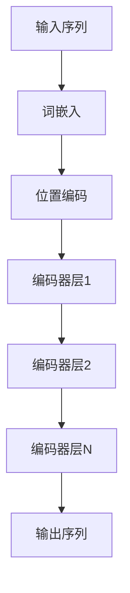
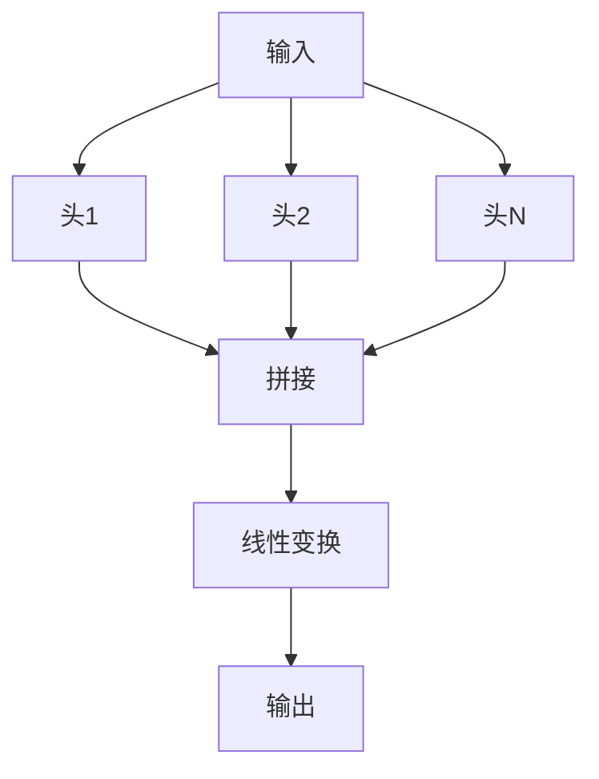

# 大语言模型进阶原理与代码实战案例讲解

## 1.背景介绍

大语言模型（Large Language Models, LLMs）是近年来人工智能领域的一个重要突破。它们通过大量的文本数据进行训练，能够生成高质量的自然语言文本，完成翻译、摘要、对话等多种任务。随着计算能力和数据量的增加，LLMs的性能不断提升，已经在多个领域展现出强大的应用潜力。

在这篇文章中，我们将深入探讨大语言模型的核心原理、算法、数学模型，并通过实际代码实例来帮助读者更好地理解和应用这些技术。

## 2.核心概念与联系

### 2.1 语言模型

语言模型是自然语言处理（NLP）中的一个基本概念。它通过学习文本数据中的词汇和句子结构，预测下一个词或生成新的句子。常见的语言模型包括n-gram模型、循环神经网络（RNN）、长短期记忆网络（LSTM）和变压器（Transformer）。

### 2.2 大语言模型

大语言模型是基于变压器架构的深度学习模型，具有数十亿甚至上千亿的参数。它们通过大规模的预训练和微调，能够在多种NLP任务中表现出色。代表性的大语言模型包括OpenAI的GPT系列、Google的BERT和T5等。

### 2.3 预训练与微调

预训练是指在大规模无监督数据上训练模型，使其学习语言的基本结构和语义。微调则是在特定任务的数据上进行有监督训练，使模型适应具体任务的需求。

## 3.核心算法原理具体操作步骤

### 3.1 变压器架构

变压器架构是大语言模型的核心。它通过自注意力机制（Self-Attention）和多头注意力机制（Multi-Head Attention）来捕捉文本中的长距离依赖关系。



### 3.2 自注意力机制

自注意力机制通过计算输入序列中每个词与其他词的相关性，生成加权和作为输出。其核心公式如下：

$$
\text{Attention}(Q, K, V) = \text{softmax}\left(\frac{QK^T}{\sqrt{d_k}}\right)V
$$

其中，$Q$、$K$、$V$分别表示查询、键和值矩阵，$d_k$是键的维度。

### 3.3 多头注意力机制

多头注意力机制通过并行计算多个自注意力，并将结果拼接后线性变换，增强模型的表达能力。



## 4.数学模型和公式详细讲解举例说明

### 4.1 词嵌入

词嵌入是将词汇映射到高维向量空间的过程。常用的词嵌入方法包括Word2Vec、GloVe和BERT的词嵌入。

$$
\text{Embedding}(w) = \mathbf{v}_w
$$

其中，$w$表示词汇，$\mathbf{v}_w$表示词汇的向量表示。

### 4.2 位置编码

位置编码用于表示词汇在序列中的位置。常用的正弦和余弦位置编码公式如下：

$$
PE_{(pos, 2i)} = \sin\left(\frac{pos}{10000^{2i/d_{model}}}\right)
$$

$$
PE_{(pos, 2i+1)} = \cos\left(\frac{pos}{10000^{2i/d_{model}}}\right)
$$

其中，$pos$表示位置，$i$表示维度索引，$d_{model}$表示模型的维度。

### 4.3 损失函数

大语言模型的训练目标是最小化预测词汇与真实词汇之间的差异。常用的损失函数是交叉熵损失：

$$
\mathcal{L} = -\sum_{i=1}^{N} y_i \log(\hat{y}_i)
$$

其中，$y_i$表示真实标签，$\hat{y}_i$表示预测概率，$N$表示样本数量。

## 5.项目实践：代码实例和详细解释说明

### 5.1 环境配置

首先，我们需要配置Python环境并安装必要的库：

```bash
pip install torch transformers
```

### 5.2 数据准备

我们使用Hugging Face的Transformers库加载预训练模型和数据集：

```python
from transformers import GPT2Tokenizer, GPT2LMHeadModel

tokenizer = GPT2Tokenizer.from_pretrained('gpt2')
model = GPT2LMHeadModel.from_pretrained('gpt2')
```

### 5.3 模型训练

我们定义训练函数，并使用自定义数据进行微调：

```python
import torch
from torch.utils.data import DataLoader, Dataset

class CustomDataset(Dataset):
    def __init__(self, texts, tokenizer, max_length):
        self.texts = texts
        self.tokenizer = tokenizer
        self.max_length = max_length

    def __len__(self):
        return len(self.texts)

    def __getitem__(self, idx):
        text = self.texts[idx]
        inputs = self.tokenizer.encode_plus(
            text,
            add_special_tokens=True,
            max_length=self.max_length,
            padding='max_length',
            return_tensors='pt'
        )
        return inputs['input_ids'].squeeze(), inputs['attention_mask'].squeeze()

def train(model, dataset, tokenizer, epochs=3, batch_size=8, lr=5e-5):
    dataloader = DataLoader(dataset, batch_size=batch_size, shuffle=True)
    optimizer = torch.optim.AdamW(model.parameters(), lr=lr)
    model.train()

    for epoch in range(epochs):
        for batch in dataloader:
            input_ids, attention_mask = batch
            outputs = model(input_ids, attention_mask=attention_mask, labels=input_ids)
            loss = outputs.loss
            loss.backward()
            optimizer.step()
            optimizer.zero_grad()
        print(f'Epoch {epoch+1}, Loss: {loss.item()}')

texts = ["示例文本1", "示例文本2", "示例文本3"]
dataset = CustomDataset(texts, tokenizer, max_length=128)
train(model, dataset, tokenizer)
```

### 5.4 模型推理

训练完成后，我们可以使用模型进行文本生成：

```python
def generate_text(model, tokenizer, prompt, max_length=50):
    inputs = tokenizer.encode(prompt, return_tensors='pt')
    outputs = model.generate(inputs, max_length=max_length, num_return_sequences=1)
    return tokenizer.decode(outputs[0], skip_special_tokens=True)

prompt = "从前有一个小村庄"
generated_text = generate_text(model, tokenizer, prompt)
print(generated_text)
```

## 6.实际应用场景

### 6.1 文本生成

大语言模型可以用于生成高质量的文本，例如新闻报道、小说创作和技术文档。

### 6.2 机器翻译

通过预训练和微调，大语言模型可以实现多语言之间的高质量翻译。

### 6.3 对话系统

大语言模型在对话系统中表现出色，可以用于客服、智能助手等应用。

### 6.4 文本摘要

大语言模型可以自动生成文本摘要，帮助用户快速获取关键信息。

## 7.工具和资源推荐

### 7.1 开源库

- [Hugging Face Transformers](https://github.com/huggingface/transformers): 提供了多种预训练模型和工具，方便进行大语言模型的训练和应用。
- [PyTorch](https://pytorch.org/): 强大的深度学习框架，支持大语言模型的训练和推理。

### 7.2 数据集

- [OpenAI GPT-3 Dataset](https://openai.com/research/gpt-3): 包含大量高质量的文本数据，用于训练GPT-3模型。
- [Google BERT Dataset](https://github.com/google-research/bert): 包含多种NLP任务的数据集，用于训练和评估BERT模型。

### 7.3 在线资源

- [Hugging Face Model Hub](https://huggingface.co/models): 提供了多种预训练模型和微调模型，方便用户下载和使用。
- [Kaggle](https://www.kaggle.com/): 提供了丰富的数据集和竞赛，帮助用户提升NLP技能。

## 8.总结：未来发展趋势与挑战

大语言模型在NLP领域展现了巨大的潜力，但也面临一些挑战和未来发展方向：

### 8.1 模型规模与计算资源

随着模型规模的增加，训练和推理所需的计算资源也大幅提升。未来需要探索更高效的模型架构和训练方法，以降低计算成本。

### 8.2 数据隐私与伦理

大语言模型的训练数据可能包含敏感信息，如何保护数据隐私和确保模型的伦理性是一个重要课题。

### 8.3 多模态学习

未来的大语言模型可能不仅限于文本数据，还会结合图像、音频等多种模态，提升模型的综合能力。

### 8.4 实时应用

如何将大语言模型应用于实时系统，如智能助手和对话系统，是一个重要的研究方向。

## 9.附录：常见问题与解答

### 9.1 大语言模型的训练时间有多长？

训练时间取决于模型规模和计算资源。以GPT-3为例，训练时间可能需要数周甚至数月。

### 9.2 如何选择合适的预训练模型？

选择预训练模型时，可以根据具体任务和数据集的特点，选择适合的模型。例如，BERT适用于句子级别的任务，GPT适用于生成任务。

### 9.3 如何评估大语言模型的性能？

常用的评估指标包括准确率、精确率、召回率和F1分数。对于生成任务，可以使用BLEU、ROUGE等指标。

### 9.4 大语言模型是否可以处理多语言任务？

是的，大语言模型可以通过多语言预训练和微调，处理多语言任务。

### 9.5 如何优化大语言模型的推理速度？

可以通过模型剪枝、量化和蒸馏等技术，优化大语言模型的推理速度。

---

作者：禅与计算机程序设计艺术 / Zen and the Art of Computer Programming