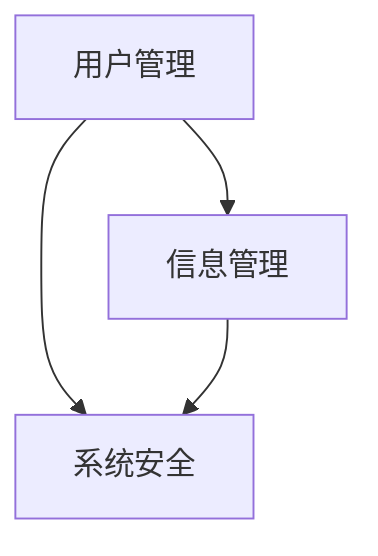

# 毕业生信息管理系统详细设计与具体代码实现

## 1.背景介绍

随着高校教育事业的不断发展,毕业生人数与日俱增,传统的手工管理方式已经无法满足当前的需求。因此,构建一个高效、实用的毕业生信息管理系统势在必行。该系统旨在实现毕业生信息的集中管理,提高工作效率,为学校、企业和毕业生搭建一个高效的交流平台。

## 2.核心概念与联系

毕业生信息管理系统的核心概念包括:

1. **用户管理**:包括管理员、毕业生和企业三类用户,各自拥有不同的权限和功能。

2. **信息管理**:涉及毕业生个人信息、就业信息、培训信息等多个模块的数据管理。

3. **系统安全**:包括用户身份认证、数据加密传输、访问控制等多重保障措施。

这些核心概念相互关联,构成了系统的基础架构,如下图所示:



## 3.核心算法原理具体操作步骤

### 3.1 用户身份认证算法

用户身份认证是系统安全的基石,采用了基于Hash加密的用户名密码认证算法,具体步骤如下:

1. 用户输入用户名和密码
2. 系统从数据库读取该用户的密码Hash值
3. 将用户输入的密码进行相同的Hash加密
4. 比对加密后的密码Hash值与数据库中存储的是否一致
5. 如果一致,则认证通过,否则拒绝访问

该算法的优点是即使数据库被窃取,也无法获取用户的原始密码,有效防止了密码泄露风险。

### 3.2 数据查询优化算法

由于系统中存储了大量的毕业生信息数据,因此数据查询的效率对系统的响应速度至关重要。我们采用了基于B+树的索引查询优化算法:

1. 对经常被查询的字段(如姓名、学号等)建立B+树索引
2. 查询时先在B+树中查找,定位到对应的数据块
3. 最后在数据块中进行顺序查找,返回结果

与传统的线性查找相比,索引查询大大提高了查询效率,尤其是在海量数据场景下,能够显著减少查询时间。

## 4.数学模型和公式详细讲解举例说明

### 4.1 信息熵模型

为了量化毕业生信息的价值,我们引入了信息熵的概念。信息熵 $H(X)$ 用于度量随机变量 $X$ 的不确定性,定义为:

$$H(X) = -\sum_{i=1}^{n}P(x_i)\log_2P(x_i)$$

其中,$ P(x_i)$ 表示 $X$ 取值为 $x_i$ 的概率。

信息熵越高,表示该信息的不确定性越大,价值越高。例如,如果所有毕业生的就业情况都相同,那么就业信息的熵值就为0,对于系统的价值也就不大。

通过计算各类信息的熵值,我们可以合理分配存储空间,提高系统的存储利用率。

### 4.2 协同过滤推荐算法

为了更好地为毕业生和企业匹配合适的就业机会,我们采用了基于用户的协同过滤推荐算法。该算法通过计算用户之间的相似度,为目标用户推荐与其相似用户喜欢的项目。

用户 $u$ 和 $v$ 之间的相似度可以用余弦相似度来计算:

$$\text{sim}(u,v) = \cos(u,v) = \frac{u \cdot v}{\|u\|\|v\|} = \frac{\sum_{i=1}^{n}u_iv_i}{\sqrt{\sum_{i=1}^{n}u_i^2}\sqrt{\sum_{i=1}^{n}v_i^2}}$$

其中 $u$ 和 $v$ 分别表示用户 $u$ 和 $v$ 对项目的评分向量。

对于目标用户 $u$,可以根据其他用户 $v$ 与 $u$ 的相似度和 $v$ 对项目的评分,预测 $u$ 对项目 $i$ 的评分:

$$p_{u,i} = \overline{r_u} + \frac{\sum_{v \in N(i)}(r_{v,i} - \overline{r_v})\text{sim}(u,v)}{\sum_{v \in N(i)}|\text{sim}(u,v)|}$$

其中 $\overline{r_u}$ 表示用户 $u$ 的平均评分, $N(i)$ 表示对项目 $i$ 评分的用户集合。

通过这种方式,系统可以为毕业生推荐合适的就业机会,为企业推荐合适的人才,从而提高就业匹配的精度。

## 5.项目实践:代码实例和详细解释说明

### 5.1 用户管理模块

用户管理模块负责处理用户的注册、登录、权限管理等功能,下面是用户注册功能的代码示例:

```python
import hashlib

def register(username, password):
    # 对密码进行SHA-256哈希加密
    password_hash = hashlib.sha256(password.encode()).hexdigest()
    
    # 将用户信息存储到数据库
    db.users.insert_one({
        'username': username,
        'password': password_hash
    })
    
    return True
```

这段代码使用了 Python 的 `hashlib` 模块,对用户输入的密码进行了 SHA-256 哈希加密,然后将用户名和加密后的密码存储到数据库中。这样即使数据库被攻破,也无法获取用户的原始密码,有效防止了密码泄露风险。

### 5.2 信息管理模块

信息管理模块负责毕业生个人信息、就业信息、培训信息等数据的增删改查操作,下面是查询毕业生就业信息的代码示例:

```python
from pymongo import MongoClient

client = MongoClient('mongodb://localhost:27017/')
db = client['graduation']
collection = db['employment']

def search_employment(name=None, company=None):
    query = {}
    if name:
        query['name'] = name
    if company:
        query['company'] = company
    
    # 使用索引进行查询
    results = collection.find(query)
    
    return list(results)
```

这段代码首先连接到本地的 MongoDB 数据库,然后根据输入的姓名或公司名称构建查询条件。由于我们事先为 `name` 和 `company` 字段建立了索引,所以查询效率会大大提高。

最后,代码返回一个列表,包含了所有匹配的就业信息记录。

## 6.实际应用场景

毕业生信息管理系统可以广泛应用于高校、企业和毕业生之间,具体场景包括但不限于:

1. **高校场景**:学校可以使用该系统集中管理毕业生的个人信息、就业信息、培训信息等,了解毕业生的整体就业情况,为其提供有针对性的指导。

2. **企业场景**:企业可以在系统中发布招聘信息,根据自身需求精准匹配合适的毕业生人才,提高招聘效率。

3. **毕业生场景**:毕业生可以在系统中更新个人信息,查看就业信息和培训机会,与心仪企业进行互动,提高就业竞争力。

该系统的应用可以帮助高校提高教学质量,企业获得优秀人才,毕业生顺利就业,是高校、企业和毕业生之间的重要纽带。

## 7.工具和资源推荐

在系统的开发和部署过程中,我们使用了多种开源工具和资源,为读者推荐如下:

1. **Python**: 一种简单易学、功能强大的编程语言,是构建Web应用的绝佳选择。

2. **Flask**: 一个轻量级的Python Web框架,易于上手和扩展。

3. **MongoDB**: 一种流行的NoSQL数据库,适合存储海量半结构化数据。

4. **Vue.js**: 一款渐进式JavaScript框架,用于构建现代化的用户界面。

5. **Bootstrap**: 一个前端开源工具包,提供了丰富的UI组件和样式,加快开发效率。

6. **Docker**: 一种容器化技术,可以实现应用程序的快速部署和隔离。

这些工具和资源都是免费开源的,读者可以根据需求自行选择使用。

## 8.总结:未来发展趋势与挑战

毕业生信息管理系统在提高工作效率、促进校企合作等方面发挥了重要作用。但是,随着人工智能、大数据等新技术的不断发展,该系统也面临着一些新的挑战和发展趋势:

1. **人工智能技术的融合**:利用机器学习算法对毕业生信息进行智能分析,为学校和企业提供更加精准的决策支持。

2. **大数据处理能力的提升**:随着数据量的不断增长,系统需要具备更强的大数据存储和处理能力,以确保高效运行。

3. **移动端应用的开发**:为了适应移动互联网时代,需要开发移动端应用,让毕业生和企业能够随时随地访问系统。

4. **隐私和安全性的加强**:加强对用户隐私数据的保护,提高系统的安全性,防止数据泄露和被攻击。

5. **系统的可扩展性**:系统需要具备良好的可扩展性,以便在未来根据需求进行功能升级和模块扩展。

面对这些挑战和趋势,我们需要不断学习创新,与时俱进,以确保毕业生信息管理系统能够持续发挥作用,为高校、企业和毕业生提供优质服务。

## 9.附录:常见问题与解答

1. **问题**:系统如何保证数据的安全性?
   **解答**:系统采用了多重安全措施,包括用户身份认证、数据加密传输、访问控制等,从多个层面保障了数据的安全性。

2. **问题**:如何提高系统的响应速度?
   **解答**:系统使用了基于B+树的索引查询优化算法,对常用字段建立索引,大大提高了查询效率。同时,也可以考虑使用缓存技术、负载均衡等方式进一步优化系统性能。

3. **问题**:系统如何实现个性化推荐?
   **解答**:系统采用了基于用户的协同过滤推荐算法,通过计算用户之间的相似度,为目标用户推荐与其相似用户喜欢的项目,从而实现了个性化推荐。

4. **问题**:系统如何实现高可用性?
   **解答**:可以考虑采用分布式架构、负载均衡、容器化技术等措施,提高系统的可用性和容错能力。同时,也需要制定完善的备份和恢复策略,防止数据丢失。

5. **问题**:系统如何实现可扩展性?
   **解答**:在系统设计阶段,我们就考虑了可扩展性问题,采用了模块化的设计方式,各个模块之间低耦合、高内聚。未来可以根据需求,轻松地添加新模块或升级现有模块,而不影响整个系统的运行。

作者:禅与计算机程序设计艺术 / Zen and the Art of Computer Programming