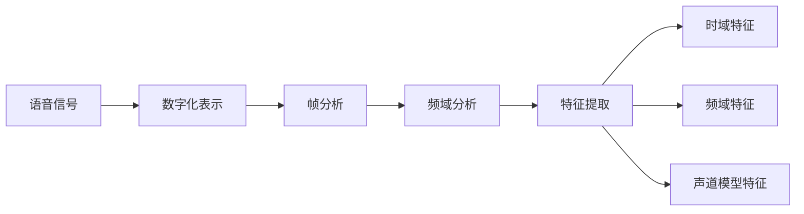

# 语音特征提取技术详解

## 1. 背景介绍
### 1.1 语音特征提取的重要性
语音特征提取是语音识别、说话人识别、情感识别等语音处理任务的基础。通过从原始语音信号中提取有效的特征表示，可以大大提高后续处理的效率和准确性。
### 1.2 语音特征提取的发展历程
语音特征提取技术经历了从传统手工设计特征到深度学习自动学习特征的发展过程。早期主要采用MFCC、LPCC等基于频谱分析的特征，近年来基于深度学习的特征学习方法如CNN、LSTM等取得了更好的效果。
### 1.3 语音特征提取面临的挑战  
语音信号的高度变异性给特征提取带来挑战，如说话人、语速、情感、噪声等因素的影响。此外，如何学习到与任务相关的判别性特征，并提高特征的鲁棒性也是需要解决的问题。

## 2. 核心概念与联系
### 2.1 语音信号的数字化表示
语音信号是一种连续的模拟信号，需要通过采样和量化转换为离散的数字信号才能在计算机中处理。常见的采样频率有8kHz、16kHz等。
### 2.2 语音的频域分析
语音信号在时域和频域都包含重要的信息。通过傅里叶变换可以将时域信号转换到频域，频谱图直观地展示了不同频率成分的能量分布。
### 2.3 语音的帧分析
为了提取短时平稳的特征，通常将语音信号划分为一帧一帧进行分析。帧长一般为20-40ms，帧移为10ms左右。每一帧可以提取一组特征参数。
### 2.4 语音特征的分类  
语音特征可以分为基于时域分析、频域分析以及基于声道模型等不同类别。常见的特征有时域的短时能量、过零率，频域的MFCC、LPCC，基于声道模型的LPC等。



## 3. 核心算法原理具体操作步骤
### 3.1 MFCC特征提取
- 对语音信号进行预加重，增强高频部分
- 分帧，每帧大小为20-40ms
- 对每帧加汉明窗，减少频谱泄露
- 对每帧进行FFT，得到频谱
- 将频谱通过Mel滤波器组，得到Mel频谱
- 对Mel频谱取对数，得到对数Mel频谱
- 对对数Mel频谱进行DCT，得到MFCC特征

### 3.2 LPCC特征提取
- 对语音信号分帧
- 对每帧进行线性预测分析，得到线性预测系数
- 对线性预测系数进行倒谱分析，得到LPCC特征

### 3.3 基于深度学习的特征学习
- 构建卷积神经网络(CNN)或循环神经网络(RNN)
- 将原始语音信号或频谱特征输入网络
- 网络通过端到端学习，自动提取判别性特征
- 将网络中间层输出作为学习到的深层特征

## 4. 数学模型和公式详细讲解举例说明
### 4.1 傅里叶变换
语音信号$x(t)$的傅里叶变换为：
$$X(f)=\int_{-\infty}^{\infty}x(t)e^{-j2\pi ft}dt$$
其中$f$为频率，$X(f)$为信号在频域的表示。
通过傅里叶变换可以将时域信号转换为频域信号，揭示语音的频率成分。

### 4.2 Mel频率尺度
Mel频率尺度是基于人耳听觉特性设计的非线性频率尺度，频率$f$与Mel频率$m$的关系为：
$$m=2595\log_{10}(1+\frac{f}{700})$$
通过Mel尺度可以模拟人耳对不同频率的感知能力，突出语音中的关键信息。

### 4.3 离散余弦变换（DCT）
离散余弦变换用于将Mel频谱转换为MFCC特征，公式为：
$$c(n)=\sqrt{\frac{2}{N}}\sum_{k=1}^N\log S(k)\cos[\frac{\pi n}{N}(k-\frac{1}{2})]$$
其中$S(k)$为Mel频谱，$N$为频谱维度，$n$为MFCC特征的维度。
DCT可以实现频谱的解相关和压缩，得到更紧凑的特征表示。

## 5. 项目实践：代码实例和详细解释说明
下面以Python和librosa库为例，展示MFCC特征提取的代码实现：

```python
import librosa

# 读取音频文件
y, sr = librosa.load('audio.wav', sr=None)

# 提取MFCC特征
mfcc = librosa.feature.mfcc(y=y, sr=sr, n_mfcc=13)

# 计算一阶差分
delta_mfcc = librosa.feature.delta(mfcc)

# 计算二阶差分
delta2_mfcc = librosa.feature.delta(mfcc, order=2)

# 拼接MFCC特征及其差分
features = np.concatenate((mfcc, delta_mfcc, delta2_mfcc), axis=0)
```

代码解释：
- 首先使用librosa.load读取音频文件，得到音频信号y和采样率sr
- 调用librosa.feature.mfcc提取MFCC特征，参数n_mfcc指定提取的MFCC阶数
- 通过librosa.feature.delta计算MFCC的一阶差分和二阶差分，捕捉特征的动态变化信息
- 最后将MFCC原始特征及其差分特征在第0维（特征维度）上拼接，得到完整的特征表示

提取得到的特征可以用于后续的声学模型训练和语音识别等任务。

## 6. 实际应用场景
语音特征提取技术在以下场景中有广泛应用：
### 6.1 语音识别
提取语音的声学特征，结合声学模型和语言模型进行语音到文本的转录识别，实现智能语音助手、语音输入等功能。
### 6.2 说话人识别
利用语音特征刻画说话人的个体特征，通过特征匹配或模式分类实现说话人身份识别，应用于安全认证、智能家居等。
### 6.3 语音情感识别
从语音特征中提取情感相关的特征表示，如基频、能量、谱特征等，通过情感分类模型识别说话人的情绪状态。
### 6.4 语音合成
语音特征不仅用于分析识别，还可以指导语音合成，通过调整特征参数控制合成语音的音色、情感等属性。
### 6.5 语音增强与降噪
利用语音的特征表示，通过特征域的滤波、转换等操作，实现语音增强和噪声抑制，提高语音质量。

## 7. 工具和资源推荐
以下是一些常用的语音特征提取工具和资源：
- Python库：librosa、python_speech_features、pyAudioAnalysis等
- MATLAB工具箱：VOICEBOX、SPTK等
- 开源工具包：Kaldi、HTK等
- 语音数据集：TIMIT、LibriSpeech、VoxCeleb等
- 论文与教程：《Fundamentals of Speech Recognition》、《Speech and Audio Signal Processing》等

这些工具和资源可以帮助研究人员和开发者快速上手语音特征提取，开展相关研究和应用开发。

## 8. 总结：未来发展趋势与挑战
语音特征提取技术经过长期发展已经相对成熟，但仍然存在一些挑战和改进空间：
### 8.1 基于深度学习的端到端特征学习
传统的特征提取方法依赖人工设计，而深度学习可以实现端到端的特征自学习。如何设计高效的网络结构，学习到更具判别性和鲁棒性的特征表示，是当前研究的热点。
### 8.2 特征的可解释性与可控性
目前的深度学习特征往往是黑盒表示，缺乏可解释性。如何理解特征表示与语音属性之间的关联，实现特征的可解释和可控修改，是亟待解决的问题。
### 8.3 特征提取的低资源适应性
现有的特征提取方法在低资源场景下性能下降明显。如何利用少量数据或无监督方法学习鲁棒的特征表示，提高特征的泛化能力，是未来的研究方向之一。
### 8.4 多模态特征融合
语音特征与视觉、文本等其他模态的特征融合，能够提供更全面的语义信息。如何设计高效的多模态特征融合框架，发挥不同模态特征的互补优势，是值得探索的问题。

语音特征提取作为语音处理的基础，其发展与语音识别、合成等任务的进步息息相关。未来，如何进一步挖掘语音特征的潜力，突破现有瓶颈，实现更智能、更自然的人机语音交互，仍然是语音社区的重要使命。

## 9. 附录：常见问题与解答
### 9.1 MFCC特征的维度如何选择？
MFCC特征的维度一般选择12-20。更高的维度可以提供更多的频谱细节，但也可能引入冗余和噪声。需要根据任务需求和数据情况进行权衡。

### 9.2 语音特征是否需要归一化处理？
语音特征通常需要进行归一化处理，如均值方差归一化(CMVN)、最小-最大值归一化等。归一化可以减少不同语音样本之间的差异，提高特征的可比性和鲁棒性。

### 9.3 语音特征提取过程中的参数如何调节？
语音特征提取涉及帧长、帧移、滤波器组数等参数。这些参数需要根据语音的采样率、频率范围等特性进行调节。一般可以参考经验值，如帧长25ms、帧移10ms、Mel滤波器组数26等。

### 9.4 深度学习特征与传统特征的优劣比较？
深度学习特征通过端到端学习，可以自适应地提取与任务相关的判别性特征，往往比传统手工设计的特征更加有效。但深度学习特征需要大量标注数据进行训练，而传统特征可以直接提取使用，在小数据场景下仍有优势。

### 9.5 不同的特征选择对最终性能的影响？
不同的特征选择会影响后续任务的性能。一般来说，频域特征如MFCC、LPCC等在语音识别任务中表现较好，而基频、能量等特征在情感识别中更为有效。需要根据具体任务和数据特点选择合适的特征组合。

以上是对语音特征提取技术的详细介绍和分析。语音特征提取是一个广泛而深入的领域，需要不断探索和创新。希望这篇文章能够为读者提供一个全面的视角，了解语音特征提取的基本概念、方法和应用，并启发更多的思考和实践。

作者：禅与计算机程序设计艺术 / Zen and the Art of Computer Programming