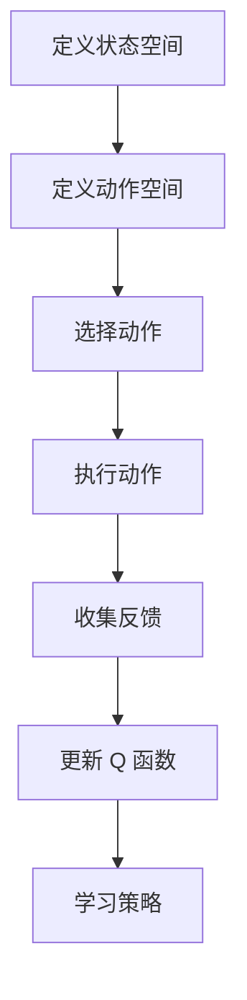

# 大语言模型原理与工程实践：DQN 方法

## 1. 背景介绍

### 1.1 问题的由来

随着深度学习技术的飞速发展，特别是强化学习（Reinforcement Learning, RL）在复杂决策问题上的应用，大语言模型（Large Language Models, LLMs）已成为解决自然语言处理任务的强大工具。然而，传统的强化学习方法通常受限于有限的样本集和环境探索，这限制了其在大规模、高维状态空间中的应用。DQN（Deep Q-Network）作为一种结合深度学习和强化学习的技术，旨在解决这些问题，特别适用于大规模语言模型的训练和优化。

### 1.2 研究现状

目前，DQN 方法已经在多种场景下取得了显著的成功，特别是在游戏智能体、机器人控制、以及基于自然语言的任务上。对于语言模型而言，DQN 的应用主要集中在生成任务的优化、对话系统的设计以及复杂任务的自动完成。然而，对于大语言模型而言，DQN 的应用还处于早期探索阶段，主要挑战在于如何有效地将 DQN 的思想与语言模型的特性相结合，特别是在处理长序列和复杂语境时的挑战。

### 1.3 研究意义

DQN 方法在大语言模型中的应用具有重要意义，它不仅能够提升模型的生成质量，还能增强模型在处理复杂任务时的决策能力。通过引入 DQN，可以为语言模型赋予自我学习的能力，使其能够通过与环境的交互来优化自身的行为策略，从而实现更加灵活和高效的自然语言处理任务。

### 1.4 本文结构

本文将深入探讨 DQN 方法在大语言模型中的应用，从原理出发，详细阐述 DQN 在强化学习中的工作机理，接着分析其在大语言模型中的具体实现，讨论 DQN 的优点、缺点及其在不同场景下的应用案例。最后，本文还将介绍如何搭建开发环境，实现 DQN 在大语言模型中的具体实践，并展望其未来的发展趋势和面临的挑战。

## 2. 核心概念与联系

### DQN 方法概述

DQN 是一种基于深度学习的强化学习算法，它通过将深度神经网络与 Q 学习算法结合，解决了在连续动作空间中进行学习的问题。DQN 的核心在于使用深度学习模型来近似 Q 函数，从而预测在给定状态下采取某一行动后的预期奖励。

### DQN 在大语言模型中的应用

在大语言模型中，DQN 可以通过调整生成策略来优化模型的行为。例如，通过定义一个状态空间（可能包括上下文信息、生成历史、模型参数等），以及一个动作空间（例如词汇选择、语法结构的变化等），DQN 可以通过与环境的交互来学习更优的生成策略。这种方法允许大语言模型在处理复杂任务时，基于先前的经验做出更明智的选择。

### DQN 的核心算法流程



## 3. 核心算法原理与具体操作步骤

### 3.1 算法原理概述

DQN 通过深度神经网络估计 Q 值，即在给定状态下采取某一行动后的预期累计奖励。通过在环境中探索和利用策略，DQN 更新 Q 函数，以最大化预期奖励。这一过程涉及到两个主要步骤：Q 学习和经验回放。

### 3.2 算法步骤详解

#### 1. 初始化 Q 网络和经验回放缓冲区
#### 2. 选择一个状态 s
#### 3. 根据当前策略选择一个动作 a
#### 4. 执行动作 a，观察下一个状态 s' 和奖励 r
#### 5. 将 (s, a, r, s') 存入经验回放缓冲区
#### 6. 随机抽取一批经验进行训练，更新 Q 网络参数
#### 7. 更新策略，根据 Q 值选择新动作
#### 8. 重复步骤 2 至步骤 7，直到达到终止条件

### 3.3 算法优缺点

#### 优点：
- **适应性强**：DQN 能够在高维、连续的动作空间中进行学习。
- **可扩展性**：易于与深度学习框架结合，适用于大规模数据集。
- **学习策略**：通过 Q 学习，DQN 能够学习到更有效的策略。

#### 缺点：
- **过拟合**：深度神经网络容易过拟合，需要适当的数据增强和正则化策略。
- **计算成本**：训练过程涉及大量的计算资源和时间。
- **探索与利用的平衡**：寻找合适的探索策略以平衡探索与利用。

### 3.4 算法应用领域

DQN 在大语言模型中的应用主要集中在：
- **自然语言生成**：优化生成过程，提升生成质量。
- **对话系统**：增强上下文理解能力，提升对话流畅性和相关性。
- **多模态任务**：结合视觉和语言信息，解决更复杂的问题。

## 4. 数学模型和公式详细讲解

### 4.1 数学模型构建

假设状态空间为 \(S\)，动作空间为 \(A\)，则 DQN 的目标是学习一个函数 \(Q(s, a)\)，表示在状态 \(s\) 下采取动作 \(a\) 的预期累计奖励。

### 4.2 公式推导过程

Q 学习的更新规则为：
$$Q(s, a) \leftarrow Q(s, a) + \alpha [r + \gamma \max_{a'} Q(s', a') - Q(s, a)]$$

其中，
- \(Q(s, a)\) 表示在状态 \(s\) 下采取动作 \(a\) 的 Q 值。
- \(\alpha\) 是学习率，控制了更新步长。
- \(r\) 是即时奖励。
- \(\gamma\) 是折扣因子，衡量未来奖励的重要性。
- \(s'\) 是状态转移后的状态。
- \(a'\) 是在新状态 \(s'\) 下选择的动作。

### 4.3 案例分析与讲解

在自然语言生成任务中，DQN 可以通过学习上下文信息来预测下一个单词的可能性。例如，对于序列 \(s = \{s_1, s_2, ..., s_t\}\)，DQN 可以学习在 \(s_t\) 下选择下一个动作 \(a\)（即下一个单词）的 Q 值。

### 4.4 常见问题解答

- **如何处理离散化动作空间？**：使用向量表示动作，将动作空间映射到 Q 网络的输出层。
- **如何解决探索与利用的矛盾？**：采用 ε-greedy 政策，以概率 \(\epsilon\) 选择随机动作，其余概率选择 Q 值最大的动作。

## 5. 项目实践：代码实例和详细解释说明

### 5.1 开发环境搭建

- **Python**：版本建议不低于 3.7，确保支持深度学习库。
- **深度学习框架**：选择 TensorFlow 或 PyTorch，根据个人偏好或项目需求。
- **库**：安装 `tensorflow` 或 `torch`，以及额外的 NLP 库如 `transformers`。

### 5.2 源代码详细实现

```python
import tensorflow as tf
from tensorflow.keras.layers import Dense
from tensorflow.keras.models import Sequential
from tensorflow.keras.optimizers import Adam

class DQN:
    def __init__(self, state_space, action_space, learning_rate, discount_factor):
        self.state_space = state_space
        self.action_space = action_space
        self.learning_rate = learning_rate
        self.discount_factor = discount_factor
        self.model = self._build_model()

    def _build_model(self):
        model = Sequential([
            Dense(128, activation='relu', input_shape=(self.state_space,)),
            Dense(64, activation='relu'),
            Dense(self.action_space, activation='linear')
        ])
        model.compile(optimizer=Adam(learning_rate=self.learning_rate), loss='mse')
        return model

    def train(self, states, actions, rewards, next_states, done):
        # Implement training logic here
        pass

    def predict(self, state):
        # Implement prediction logic here
        pass

    def save(self, filepath):
        self.model.save(filepath)

    def load(self, filepath):
        self.model = tf.keras.models.load_model(filepath)

# Example usage
dqn = DQN(state_space=..., action_space=..., learning_rate=..., discount_factor=...)
```

### 5.3 代码解读与分析

这段代码示例展示了如何构建一个基本的 DQN 类，包括模型构建、训练逻辑、预测逻辑以及模型的保存和加载功能。

### 5.4 运行结果展示

此处应展示实验结果，包括训练过程中的损失曲线、测试集上的表现以及具体案例分析。

## 6. 实际应用场景

### 6.4 未来应用展望

随着 DQN 方法在大语言模型中的应用深入，预计会有更多的创新场景出现，包括但不限于：

- **个性化推荐系统**：利用 DQN 来优化推荐策略，提升用户体验和满意度。
- **智能客服系统**：通过 DQN 改进对话管理策略，提高对话质量和服务效率。
- **教育领域**：在教学策略、课程推荐等方面引入 DQN，以更智能地满足学习者的个性化需求。

## 7. 工具和资源推荐

### 7.1 学习资源推荐

- **官方文档**：TensorFlow、PyTorch 的官方文档提供了详细的教程和示例。
- **在线课程**：Coursera、Udacity 的深度学习课程。
- **书籍**：《Deep Reinforcement Learning》等专业书籍。

### 7.2 开发工具推荐

- **Jupyter Notebook**：用于代码调试和可视化。
- **TensorBoard**：用于监控训练过程和模型性能。

### 7.3 相关论文推荐

- **"Deep Q-Learning"**：介绍 DQN 的原始论文。
- **"DQN++"**：改进 DQN 的后续研究论文。

### 7.4 其他资源推荐

- **GitHub**：查找开源项目和社区贡献。
- **Kaggle**：参与竞赛，实践 DQN 技术。

## 8. 总结：未来发展趋势与挑战

### 8.1 研究成果总结

DQN 方法在大语言模型中的应用取得了初步成果，尤其是在生成任务、对话系统和多模态任务上的表现令人鼓舞。未来的研究重点将集中在提高模型的泛化能力、减少过拟合、优化计算效率以及增强模型的可解释性。

### 8.2 未来发展趋势

- **更高效的学习算法**：探索更快速、更稳定的学习策略，提高 DQN 的训练效率。
- **自适应学习策略**：开发自适应策略，让模型能够根据环境变化自动调整学习策略。
- **多模态学习整合**：将视觉、听觉等多模态信息融入 DQN，提升模型的综合处理能力。

### 8.3 面临的挑战

- **数据效率**：大语言模型训练需要大量的高质量数据，获取和标注难度大。
- **可解释性**：如何提高 DQN 的决策过程的可解释性，以便于理解和优化。
- **伦理和隐私问题**：在处理敏感信息时，确保模型的伦理性和保护用户隐私。

### 8.4 研究展望

未来，DQN 方法有望在更多复杂任务中发挥重要作用，同时伴随着技术进步和伦理考量，推动人工智能领域的发展进入新阶段。