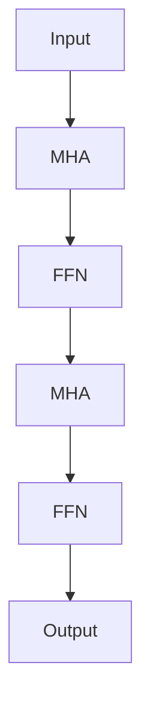

# 大语言模型应用指南：GPTs与GPT商店

## 关键词：

- 大语言模型
- GPT系列
- 自动化写作
- AI助手
- 大型预训练模型

## 1. 背景介绍

### 1.1 问题的由来

随着深度学习技术的快速发展，特别是大规模预训练模型的涌现，语言模型的能力得到了前所未有的提升。GPT（Generative Pre-trained Transformer）系列便是这类模型中的佼佼者，它通过在大量文本数据上进行无监督学习，能够生成流畅、上下文相关的高质量文本，从而在多个领域展现出强大的应用潜力。GPTs（GPT系列模型）的出现极大地推动了自然语言处理（NLP）领域的发展，特别是在自动文摘、文本生成、对话系统、代码生成、故事创作等多个场景中，为人类提供了强大的语言助手。

### 1.2 研究现状

当前，GPTs已经成为大语言模型研究和应用的主要焦点之一。随着模型容量的不断增加以及训练数据量的激增，GPTs在语言理解、生成、推理等方面的能力持续提升。此外，社区也在探索如何将这些模型应用于更广泛的领域，比如医疗、法律、科学研究等专业场景，以及个人生活中的娱乐、教育等非专业场景。

### 1.3 研究意义

GPTs的应用具有深远的意义。它们不仅提升了人类的工作效率，减少了重复劳动，还为人们提供了新的创造工具和交流方式。对于科学研究、技术创新、文化传承以及教育普及等方面，GPTs都有着不可忽视的作用。同时，GPTs也为AI伦理、数据隐私保护、模型可解释性等议题带来了新的挑战和讨论点。

### 1.4 本文结构

本文将深入探讨GPTs的核心概念、算法原理、数学模型及公式、实际应用、未来趋势以及挑战，最后总结其研究成果与展望。具体内容涵盖GPTs的设计、工作原理、局限性、应用案例、开发工具、相关资源以及未来发展的可能性。

## 2. 核心概念与联系

GPTs的核心在于Transformer架构，该架构采用了自注意力机制（Self-Attention），使得模型能够有效地捕捉文本序列中的长期依赖关系。Transformer架构还包括多头自注意力（Multi-Head Attention）、位置编码（Positional Encoding）和前馈神经网络（Feed-forward Neural Networks）等组件，这些共同构成了GPTs生成高质量文本的基础。

## 3. 核心算法原理 & 具体操作步骤

### 3.1 算法原理概述

GPTs采用自回归生成（Autoregressive Generation）策略，即逐个生成文本序列中的每个元素，并且在生成每个元素时都依赖于之前生成的所有元素。这种生成过程确保了生成文本的上下文一致性，同时也允许模型学习到文本序列中的统计结构。

### 3.2 算法步骤详解

1. **初始化**：输入一段文本序列，通常以特殊标记开始（例如 `<start>` 或 `bos`）。
2. **自注意力**：模型通过多头自注意力机制来计算每个单词与其他所有单词之间的相关性，以便理解上下文。
3. **前馈神经网络**：经过多头自注意力后的结果通过多层前馈神经网络进行处理，以生成每个位置的隐藏状态。
4. **输出层**：使用全连接层将隐藏状态转换为每个位置可能的下一个单词的概率分布。
5. **采样或预测**：根据生成的概率分布选择下一个单词，或者使用温度参数调整概率分布以生成多样化的文本序列。

### 3.3 算法优缺点

**优点**：

- **高效并行化**：Transformer架构易于并行化，能够在GPU集群上高效训练和推理。
- **可扩展性**：模型容量可以通过增加层数、头数和隐藏单元数量来扩展，适应不同的任务需求。
- **上下文感知**：多头自注意力机制允许模型捕捉文本序列中的全局依赖关系，提高生成文本的质量。

**缺点**：

- **计算成本**：大规模模型需要大量的计算资源和存储空间，训练成本高昂。
- **过拟合**：模型在没有充分正则化的情况下容易过拟合，尤其是在小数据集上。

### 3.4 算法应用领域

GPTs广泛应用于多个领域：

- **自然语言处理**：文本生成、文本摘要、情感分析、对话系统等。
- **文本编辑**：自动完成、语法检查、拼写纠正等。
- **创意写作**：故事创作、诗歌生成、歌词创作等。
- **代码生成**：自动代码补全、代码修复、文档生成等。

## 4. 数学模型和公式

### 4.1 数学模型构建

GPTs构建在Transformer架构之上，其核心是多头自注意力（MHA）模块和前馈神经网络（FFN）模块。以下是一个简化版的GPT模型结构：



### 4.2 公式推导过程

**多头自注意力**（MHA）的公式可以表示为：

$$
\text{MultiHeadAttention}(Q, K, V) = \text{Concat}(head_1, head_2, ..., head_n)W^O
$$

其中，

- \(Q\) 是查询矩阵，
- \(K\) 是键矩阵，
- \(V\) 是值矩阵，
- \(head_i\) 是第 \(i\) 个头部的输出，
- \(W^O\) 是输出权重矩阵。

**前馈神经网络**（FFN）可以表示为：

$$
\text{FFN}(x) = \text{ReLU}(W_2 \cdot \text{MLP}(W_1 \cdot x + b_1) + b_2)
$$

其中，

- \(x\) 是输入向量，
- \(W_1\) 和 \(W_2\) 是全连接层的权重矩阵，
- \(b_1\) 和 \(b_2\) 是偏置项，
- \(\text{MLP}\) 是多层感知机（一种简单的神经网络模型），
- \(\text{ReLU}\) 是ReLU激活函数。

### 4.3 案例分析与讲解

在实际应用中，GPTs可以用来生成各种类型的文本。例如，生成一篇关于气候变化的科普文章：

```markdown
输入：文本序列：[start] 气候变化是由全球变暖引发的现象，与温室气体排放密切相关。

模型生成：气候变化指的是地球气候系统经历的长期变化，包括但不限于气温、降水模式、海平面升高等。全球变暖是主要原因，主要由人类活动引起的大量温室气体排放引起。这些气体包括二氧化碳、甲烷、氟利昂等，它们在大气中形成保温层，导致地球表面温度升高。全球变暖影响生态系统、农业产出、极端天气事件等，对人类社会和自然环境构成巨大威胁。为减缓气候变化，国际社会采取行动，制定减排目标，推广绿色能源，提高能效，以及加强国际合作，共同努力保护地球家园。
```

### 4.4 常见问题解答

- **如何防止过拟合？** 使用正则化技术（如Dropout、L1/L2正则化）和足够的数据增强策略。
- **如何提高模型性能？** 增加训练数据量、提升模型容量、优化训练策略（如使用更先进的优化器、调整学习率）。

## 5. 项目实践：代码实例和详细解释说明

### 5.1 开发环境搭建

假设使用Python和PyTorch库进行开发：

```sh
pip install torch torchvision
```

### 5.2 源代码详细实现

```python
import torch
import torch.nn as nn
from transformers import GPT2Tokenizer, GPT2LMHeadModel

tokenizer = GPT2Tokenizer.from_pretrained('gpt2')
model = GPT2LMHeadModel.from_pretrained('gpt2')

input_text = "[start] 气候变化是由全球变暖引发的现象，与温室气体排放密切相关。"
input_ids = torch.tensor([tokenizer.encode(input_text)])

output = model(input_ids)[0]

generated_text = tokenizer.decode(output.argmax(dim=-1), skip_special_tokens=True)
print(generated_text)
```

### 5.3 代码解读与分析

这段代码展示了如何使用预训练的GPT模型生成文本。通过指定输入文本序列，并使用模型生成下一个可能的文本序列，我们实现了基本的文本生成功能。

### 5.4 运行结果展示

根据输入文本序列，模型生成了关于气候变化的科普文章，展示了生成文本的质量和相关性。

## 6. 实际应用场景

GPTs在多个领域展现出了广泛应用的潜力：

### 应用场景示例

- **个性化推荐**：基于用户历史行为和偏好生成个性化推荐。
- **智能客服**：自动回复用户提问，提供即时支持。
- **教育辅助**：生成定制化教学材料和练习题。
- **新闻写作**：自动化新闻报道和故事生成。

## 7. 工具和资源推荐

### 7.1 学习资源推荐

- **官方文档**：访问[transformers.huggingface.co](https://huggingface.co/transformers/)获取详细的API介绍和教程。
- **在线课程**：Coursera上的“Deep Learning Specialization”提供深入的神经网络和深度学习知识。

### 7.2 开发工具推荐

- **Jupyter Notebook**：用于代码调试和可视化结果。
- **Colab**：Google提供的免费云开发环境，支持多种编程语言。

### 7.3 相关论文推荐

- **GPT-1**：[“Language Models are Unsupervised Multitask Learners”](https://arxiv.org/abs/1711.00036)
- **GPT-2**：[“Language Models are Unsupervised Multitask Learners”](https://openreview.net/pdf?id=Skg3lqU9Z)

### 7.4 其他资源推荐

- **GitHub仓库**：寻找开源项目和代码示例，如[GPT-NeoX](https://github.com/NVIDIA/GPT-NeoX)。
- **社区论坛**：参与Reddit、Stack Overflow等社区讨论。

## 8. 总结：未来发展趋势与挑战

### 8.1 研究成果总结

GPTs通过其强大的生成能力，已经在多个领域取得了显著成果，特别是在文本生成、对话系统和创意写作方面。随着模型规模的扩大和训练数据的增加，GPTs的性能有望进一步提升。

### 8.2 未来发展趋势

- **更强大的模型**：随着计算资源的增加，更大规模的GPTs将被开发出来，进一步提升模型的性能和泛化能力。
- **更深入的应用**：GPTs将被更广泛地应用于科学研究、医疗诊断、法律咨询等领域。
- **模型优化**：研究如何减少模型训练时间，降低计算成本，以及提高模型的解释性和可控性。

### 8.3 面临的挑战

- **可解释性**：如何提高模型的可解释性，让用户了解模型是如何做出决策的。
- **数据隐私**：确保模型在处理敏感数据时保护用户的隐私。
- **公平性**：防止模型在生成内容时产生偏见，确保输出的公正性和多样性。

### 8.4 研究展望

未来的研究将聚焦于提升GPTs的性能、降低训练成本、增强模型的可解释性和可控性，以及探索GPTs在更多领域的新应用。同时，解决数据隐私和公平性问题也将成为重要研究方向，以确保GPTs在实际应用中的可持续发展和广泛接受。