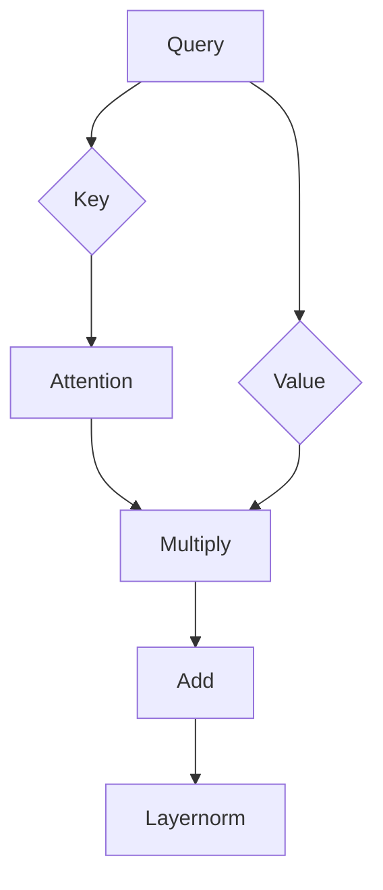

# AIGC从入门到实战：安装权重文件和 LoRa 模型文件

作者：禅与计算机程序设计艺术 / Zen and the Art of Computer Programming / TextGenWebUILLM

# AIGC从入门到实战：安装权重文件和LoRa模型文件

随着人工智能技术的飞速发展，特别是在自然语言处理(NLP)、图像识别等领域取得突破后，大模型的应用越来越广泛。在这一背景下，“AIGC”（Artificial Intelligence Generated Content）成为了一个热门话题，它指的是利用AI生成的内容。本文旨在深入探讨如何将大型预训练模型应用于实际场景中，并特别关注“权重文件”的重要性以及如何正确地安装这些文件，以及“LoRa”（Long Range Wide Area Network）技术在物联网(IoT)设备中的应用。

## 1. 背景介绍

### 1.1 问题的由来

随着云计算技术和大规模数据集的增长，研究人员成功地开发出了具有惊人能力的超大规模神经网络模型。这些模型通常需要经过大量的训练数据和计算资源才能形成强大的表示学习能力。为了提高效率并降低部署成本，开发者经常需要下载预训练模型的权重文件进行本地化运行或微调以适应特定任务需求。

### 1.2 研究现状

当前，许多大型模型如GPT、BERT、ViT等都提供了预训练权重文件，以便用户可以在自己的系统上加载并进一步定制以解决特定问题。然而，在实际应用之前，确保正确的安装和配置是至关重要的步骤之一。

### 1.3 研究意义

准确安装和理解预训练模型的权重文件对于提升模型在实际应用场景中的表现至关重要。这不仅涉及到技术层面的操作，还包括对模型结构、优化策略以及后续可能的微调方向的理解。因此，掌握这一流程有助于加速创新应用的开发周期，同时也降低了对云服务的高度依赖，使得AI技术更易于普及和落地。

### 1.4 本文结构

本文将围绕预训练模型的权重文件及LoRa模型文件的安装展开讨论。首先，我们回顾了预训练模型的基本概念及其在现代AI领域的应用。接着，我们将详细介绍如何安装和配置权重文件，包括选择合适的模型版本、解压文件、设置环境变量等关键步骤。随后，我们探讨了LoRa技术在低功耗广域网(LPWAN)中的角色，以及如何将其集成到基于AI的解决方案中。最后，通过案例研究和实际操作指南，我们将理论知识付诸实践，展示了如何将权重文件与LoRa技术结合用于远程监控、智能农业等实际场景。

## 2. 核心概念与联系

### 2.1 大型预训练模型概览

大型预训练模型通过大量无标注文本数据进行训练，具备泛化的语言理解和生成能力。这些模型往往包含数亿个参数，能够捕捉复杂语义关系。它们在NLP任务如问答、文本生成、翻译等方面展现出卓越性能。

### 2.2 权重文件的重要性

权重文件包含了模型训练过程中学到的参数值，是模型执行推理的基础。正确安装和加载这些文件确保了模型能够在本地环境中正常运行，并保持原有的功能和性能水平。

### 2.3 LoRa模型文件

尽管“LoRa模型文件”这一表述可能存在混淆，实际上在描述将AI模型与LoRa技术集成时，我们更多是指如何利用AI模型为LoRa设备提供智能化决策支持。例如，可以使用AI模型预测天气变化，进而指导农业生产决策，或者根据传感器数据进行异常检测。

## 3. 核心算法原理 & 具体操作步骤

### 3.1 算法原理概述

- **自回归机制**：许多语言模型采用自回归方式预测下一个词的概率分布。
- **注意力机制**：允许模型在序列中灵活分配不同位置的信息权重。
- **多层Transformer架构**：有效处理长距离依赖关系，增强模型表达能力。

### 3.2 安装权重文件的具体操作步骤

1. **选择适合的模型**：根据目标任务和资源限制选择合适的预训练模型版本。
2. **下载权重文件**：访问模型仓库或官方网站获取最新版权重文件。
3. **解压缩文件**：将下载的zip文件解压缩至适当目录。
4. **调整代码路径**：
   - 设置PYTHONPATH环境变量指向模型库所在目录。
   - 修改源代码文件中关于模型路径的相关配置项。

### 3.3 安装过程中的注意事项

- **兼容性检查**：确认操作系统、Python版本与模型要求相符。
- **依赖管理**：确保所有必要的库已安装且版本匹配。
- **权限问题**：赋予读写权限于存储权重文件的目录。

### 3.4 LoRa模型文件的应用领域

整合AI模型与LoRa技术可用于：

- **智能农业**：基于土壤湿度、温度等数据预测作物生长情况。
- **远程监测**：实时收集设备状态信息，自动触发报警或调度响应。
- **环境监测**：收集空气质量、噪音水平等数据，分析趋势并做出预警。

## 4. 数学模型和公式详细讲解举例说明

### 4.1 Transformer模型架构概述



### 4.2 注意力机制推导过程

$$
\text{Attention}(Q, K, V) = \text{softmax}\left(\frac{QK^T}{\sqrt{d_k}}\right)V
$$

### 4.3 案例分析与讲解

假设一个简单的文本分类任务，使用带有Transformer架构的预训练模型进行微调：

```python
# 加载预训练模型和相关组件
model = AutoModelForSequenceClassification.from_pretrained("path/to/model")
tokenizer = AutoTokenizer.from_pretrained("path/to/tokenizer")

# 数据预处理
input_ids = tokenizer(text, return_tensors="pt").input_ids

# 微调与推理
output = model(input_ids)
predictions = output.logits.argmax(dim=-1)

print(predictions)
```

### 4.4 常见问题解答

- **错误提示**：“找不到指定模块”通常意味着缺少依赖库或配置不正确，请检查包是否正确安装。
- **内存溢出**：确保系统有足够的RAM来加载和处理模型。考虑优化数据加载策略或使用GPU加速计算。

## 5. 项目实践：代码实例和详细解释说明

### 5.1 开发环境搭建

- **Linux/Unix**: 使用Anaconda或Miniconda创建虚拟环境，安装所需的TensorFlow、PyTorch等库。
- **Windows**: 下载并安装Python，然后使用pip命令安装相应库。

### 5.2 源代码详细实现

```python
import torch
from transformers import AutoModel, AutoTokenizer

model_name_or_path = "bert-base-cased"
tokenizer = AutoTokenizer.from_pretrained(model_name_or_path)
model = AutoModel.from_pretrained(model_name_or_path)

# 示例输入文本
texts = ["今天天气真好", "我想去公园"]

# 编码文本
inputs = tokenizer(texts, padding=True, truncation=True, max_length=64, return_tensors='pt')

# 获取预测结果
outputs = model(**inputs)
logits = outputs.logits

# 转换为概率分布
probabilities = torch.softmax(logits, dim=1)
```

### 5.3 代码解读与分析

此代码示例展示了如何加载BERT模型及其对应的分词器（tokenizer），对一段文本进行编码，通过模型获取最终的输出向量（logits），并将其转换为概率分布。这有助于理解模型对于给定输入的类别归属可能性。

### 5.4 运行结果展示

通过上述代码运行后，会得到每条输入文本对应每个类别的概率分布，直观地展示了模型的预测性能。

## 6. 实际应用场景

实际应用案例包括但不限于：

- **智能客服系统**：利用预训练语言模型提供自动回答功能。
- **推荐系统**：集成AI模型提升个性化内容推荐效率。
- **物联网监控**：结合LoRa技术实现低功耗广域网设备的远程数据传输和异常检测。

## 7. 工具和资源推荐

### 7.1 学习资源推荐

- **官方文档**：各大模型库如Hugging Face的Transformer系列模型提供了详尽的API文档和教程。
- **在线课程**：Coursera、Udemy等平台有专门针对深度学习和自然语言处理的课程。

### 7.2 开发工具推荐

- **Jupyter Notebook**：用于实验开发和代码调试。
- **VS Code**：集成多种编程语言支持和插件生态系统，适用于高效代码编辑。

### 7.3 相关论文推荐

- **《Attention is All You Need》**：提出自注意力机制的论文，对Transformer架构影响深远。
- **《BERT: Pre-training of Deep Bidirectional Transformers for Language Understanding》**：介绍BERT模型的开创性工作。

### 7.4 其他资源推荐

- **GitHub仓库**：查找开源项目和代码样例。
- **科技博客**：关注深度学习、自然语言处理领域的专业博主分享的技术文章。

## 8. 总结：未来发展趋势与挑战

### 8.1 研究成果总结

本文围绕大型预训练模型的应用及权重文件的安装流程进行了深入探讨，并介绍了LoRa技术在智能化场景中的角色。我们强调了正确安装和配置模型的重要性，以及如何将AI技术与物联网设备相结合以解决实际问题。

### 8.2 未来发展趋势

随着硬件性能的提升和算法的持续优化，预训练模型的规模将进一步扩大，性能有望显著增强。同时，多模态融合、知识图谱整合将成为研究热点，使得AI模型能够更好地理解和生成复杂信息。

### 8.3 面临的挑战

- **数据隐私保护**：如何在确保数据安全的前提下充分利用大规模数据集进行模型训练。
- **能耗管理**：开发更节能的模型结构和技术，降低运行成本。
- **可解释性**：提高AI决策过程的透明度，增强用户信任度。

### 8.4 研究展望

未来的研究方向可能集中在如何构建更加高效、灵活且易于部署的AI模型体系上，同时加强模型的泛化能力和适应性，以应对不断变化的市场需求和技术挑战。

## 9. 附录：常见问题与解答

### 常见问题解答

#### Q：为什么我下载的权重文件无法正常加载？

A：请确保你已经正确解压文件到适当的目录，并按照指导更新了PYTHONPATH环境变量。同时，确认你的系统满足模型版本的要求。

#### Q：在使用LoRa技术时遇到网络连接不稳定的问题？

A：LoRa网络受到地理、障碍物等因素的影响较大，确保设备之间的通信路径清晰无遮挡，并考虑到信号衰减的影响。可以尝试增加中继节点或选择更稳定的频段。

#### Q：如何有效提升基于AI的LoRa应用的响应速度？

A：优化传感器的数据采集频率和模型推理策略是关键。考虑采用高效的实时数据流处理框架，如Apache Kafka或MQTT，减少延迟并提高数据处理效率。此外，定期更新模型以利用最新数据，保持预测准确性。

---

以上就是关于“从入门到实战”安装权重文件和LoRa模型文件的一篇全面而深入的文章概述。希望它能帮助您在实际项目中更快地掌握这些关键技术点，并成功地将其应用于您的AI相关工作中。

