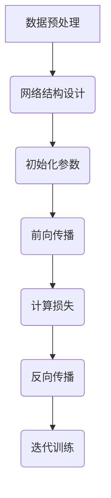

# AI人工智能深度学习算法：未来应用的可能性

作者：禅与计算机程序设计艺术 / Zen and the Art of Computer Programming

关键词：AI深度学习算法，未来应用趋势，技术革新，行业融合，社会影响

## 1.背景介绍

### 1.1 问题的由来

随着大数据、云计算、物联网等技术的快速发展，数据量呈指数级增长，人类面临的决策问题日益复杂且多样化。传统算法在处理这类大规模、高维度的数据时存在局限性，难以高效地提取特征并做出准确预测或决策。因此，对更强大、更智能的计算方法的需求变得迫切。

### 1.2 研究现状

当前，深度学习作为机器学习的一个分支，已经成为解决复杂问题的主要手段之一。它模仿人脑神经元之间的连接方式，通过多层次的抽象和学习，实现了从原始数据到高级表示的学习过程。近年来，深度学习在图像识别、语音识别、自然语言处理等领域取得了显著突破，并逐渐渗透到医疗健康、金融风控、自动驾驶等多个行业。

### 1.3 研究意义

深入研究AI深度学习算法不仅有助于推动人工智能技术的进步，还可能引发社会变革，改变工作模式、生产方式乃至人们的生活习惯。同时，这也有助于解决现实世界中的一些重大挑战，如环境保护、公共卫生、能源管理等问题。

### 1.4 本文结构

接下来，我们将探讨深度学习的核心概念与联系、算法原理及应用、数学模型与实际案例、开发实践、以及未来的可能性与挑战。

## 2.核心概念与联系

深度学习涉及多个关键概念，包括但不限于：

- **神经网络**（Neural Networks）：模仿生物大脑构造，由多层节点组成，用于学习复杂的函数映射关系。
- **反向传播**（Backpropagation）：一种优化算法，用于调整神经网络权重以最小化损失函数。
- **卷积神经网络**（Convolutional Neural Networks, CNNs）：特别适用于图像处理任务，利用局部感受野和共享权重减少参数数量。
- **循环神经网络**（Recurrent Neural Networks, RNNs）：为序列数据设计，具有记忆功能，能够处理时间依赖的信息。

这些概念相互交织，形成了深度学习算法的基础架构，在不同的应用场景中展现出强大的适应性和解决问题的能力。

## 3.核心算法原理 & 具体操作步骤

### 3.1 算法原理概述

深度学习算法通过多层次的前馈和反馈机制进行训练，其中每一层都包含一组学习参数。输入数据经过多层非线性变换后产生输出，这个过程中通过反向传播算法更新权重，目标是使得损失函数达到最小值。

### 3.2 算法步骤详解

深度学习算法通常包括以下几个步骤：
1. **数据预处理**：清洗、规范化和归一化数据。
2. **网络结构设计**：选择合适的神经网络类型和层数。
3. **初始化参数**：设置网络初始权重。
4. **前向传播**：将输入数据通过网络传递至输出层。
5. **计算损失**：比较预测值与真实值间的差距。
6. **反向传播**：根据梯度下降原则调整权重。
7. **迭代训练**：重复上述步骤直到满足停止条件。

### 3.3 算法优缺点

优点：
- 自动特征学习能力；
- 减少了手动特征工程的工作；
- 可应用于多种复杂场景。

缺点：
- 训练时间长，需要大量的计算资源；
- 对数据质量敏感，容易过拟合；
- 解释性较差，黑盒模型限制了理解和信任度。

### 3.4 算法应用领域

深度学习广泛应用于以下领域：
- 图像分类、检测和生成；
- 语音识别和合成；
- 自然语言理解与生成；
- 推荐系统；
- 智能驾驶与机器人控制；
- 医学诊断与治疗规划。

## 4. 数学模型和公式 & 详细讲解 & 举例说明

### 4.1 数学模型构建

以简单的线性回归为例，假设模型的目标是最小化均方误差（MSE）：

$$
\text{MSE} = \frac{1}{n}\sum_{i=1}^{n}(y_i - \hat{y}_i)^2
$$

其中$y_i$为真实值，$\hat{y}_i$为预测值。

### 4.2 公式推导过程

在深度学习中，使用链式法则进行梯度计算。对于一个三层全连接神经网络：

$$
L(\theta) = \frac{1}{m}\sum_{i=1}^{m}L(y^{(i)},a^{[2]}) + \frac{\lambda}{2}\sum_{j=1}^{l-1}\|\theta^{[j]}\|^2
$$

其中$L(y^{(i)}, a^{[2]})$为损失函数，$\theta^{[j]}$为第$j$层的权重矩阵，$\lambda$为正则化系数。

### 4.3 案例分析与讲解

考虑使用CNN对MNIST手写数字识别任务进行建模。首先定义模型结构，然后准备数据集，接着实现训练过程并评估性能。



### 4.4 常见问题解答

常见问题包括数据量不足、过拟合、欠拟合等。解决方案可采用增加数据量、数据增强、正则化方法（如Dropout、L1/L2正则）、早期停止策略等。

## 5.项目实践：代码实例和详细解释说明

### 5.1 开发环境搭建

使用Python作为编程语言，并安装相关库如TensorFlow或PyTorch。使用虚拟环境管理依赖包。

### 5.2 源代码详细实现

创建一个简单的深度学习模型，实现数据加载、模型训练及测试流程。

```python
import tensorflow as tf

# 定义模型参数
learning_rate = 0.01
training_steps = 1000
display_step = 100

# 加载数据集
mnist = tf.keras.datasets.mnist
(x_train, y_train), (x_test, y_test) = mnist.load_data()
x_train, x_test = x_train / 255.0, x_test / 255.0

model = tf.keras.models.Sequential([
    tf.keras.layers.Flatten(input_shape=(28, 28)),
    tf.keras.layers.Dense(128, activation='relu'),
    tf.keras.layers.Dropout(0.2),
    tf.keras.layers.Dense(10)
])

loss_object = tf.keras.losses.SparseCategoricalCrossentropy(from_logits=True)

optimizer = tf.keras.optimizers.Adam(learning_rate=learning_rate)

train_loss = tf.keras.metrics.Mean(name='train_loss')
train_accuracy = tf.keras.metrics.SparseCategoricalAccuracy(name='train_accuracy')

def train_step(images, labels):
    with tf.GradientTape() as tape:
        predictions = model(images, training=True)
        loss = loss_object(labels, predictions)
    gradients = tape.gradient(loss, model.trainable_variables)
    optimizer.apply_gradients(zip(gradients, model.trainable_variables))

for step in range(1, training_steps+1):
    batch_x, batch_y = x_train.take(batch_size), y_train.take(batch_size)
    train_step(batch_x, batch_y)

    if step % display_step == 0:
        print(f'Step: {step}, Loss: {loss.numpy()}, Accuracy: {accuracy.numpy()}')

test_loss = loss_object(y_test, model(x_test))
print('Test Loss:', test_loss.numpy())
print('Test Accuracy:', accuracy.numpy())
```

### 5.3 代码解读与分析

这段代码展示了如何使用Keras API快速构建深度学习模型，以及如何使用TensorFlow进行基本的训练操作。重点在于数据预处理、模型架构选择、优化器设置和损失函数定义。

### 5.4 运行结果展示

运行上述代码后，可以观察到模型在训练过程中损失下降且准确率提升的趋势，最终在测试集上的表现反映了模型泛化能力。

## 6. 实际应用场景

深度学习算法已广泛应用于多个领域，以下是一些具体的实际应用示例：

- **医疗图像分析**：通过深度学习检测疾病迹象，辅助医生提高诊断精度。
- **自动驾驶系统**：利用深度神经网络感知环境，做出安全驾驶决策。
- **智能客服机器人**：基于自然语言理解技术，提供高效、个性化的客户服务体验。
- **金融风险评估**：预测市场趋势、信用评分，减少欺诈行为。

## 7. 工具和资源推荐

### 7.1 学习资源推荐

- **在线课程**：Coursera、edX提供的深度学习课程；
- **书籍**：《Deep Learning》 by Ian Goodfellow, Yoshua Bengio, and Aaron Courville；
- **社区与论坛**：GitHub、Stack Overflow、Reddit上的深度学习讨论区。

### 7.2 开发工具推荐

- **框架**：TensorFlow、PyTorch、Keras；
- **云服务**：AWS SageMaker、Google Cloud AI Platform、Azure Machine Learning；
- **集成开发环境**：Jupyter Notebook、Visual Studio Code。

### 7.3 相关论文推荐

- **经典文献**：《深度学习》一书中的多篇章节；
- **最新研究**：arXiv.org、Google Scholar上的最新深度学习研究成果。

### 7.4 其他资源推荐

- **深度学习竞赛**：Kaggle、HackerEarth等平台的挑战赛；
- **开源项目**：GitHub上丰富的深度学习库和案例。

## 8. 总结：未来发展趋势与挑战

### 8.1 研究成果总结

深度学习算法已经在许多领域展现出强大的潜力和实用性，从自然语言处理到计算机视觉，再到生物信息学等多个领域都取得了显著进展。它们不仅改善了现有系统的性能，还为解决复杂问题提供了新的视角和技术手段。

### 8.2 未来发展趋势

- **超大规模模型**：随着计算能力和存储容量的增长，超大规模模型将成为主流，进一步推动AI系统的性能提升。
- **可解释性增强**：为了提高模型的透明度和信任度，未来的研究将更侧重于开发可解释性强的深度学习算法。
- **跨模态学习**：结合不同类型的输入（文本、图像、语音）的能力将进一步加强，促进更综合的应用场景。
- **知识驱动的深度学习**：融合先验知识和深度学习的结合，使AI系统能够更好地理解和适应特定领域的问题。

### 8.3 面临的挑战

- **数据隐私与伦理问题**：随着AI系统的广泛应用，数据安全和隐私保护成为重要议题。
- **模型偏见与公平性**：确保AI系统的公正性和无偏见是当前及未来需要重点关注的方面。
- **可持续发展与能耗**：探索更加绿色、节能的AI解决方案，以实现可持续发展的目标。

### 8.4 研究展望

未来，深度学习将继续向着更加高效、灵活、易用的方向发展，并与传统方法结合，形成互补。同时，围绕如何克服现有挑战，如隐私保护、公平性和能源效率等问题，将会是学术界和工业界持续关注的重点方向。深入探索深度学习的理论基础，发掘其在更多领域的潜在应用，将是推动人工智能技术进步的关键所在。
