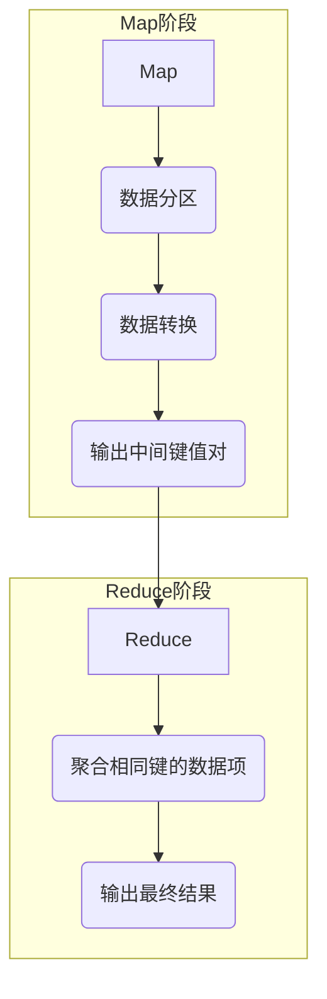

# MapReduce程序的社会责任与公益事業

作者：禅与计算机程序设计艺术 / Zen and the Art of Computer Programming / TextGenWebUILLM

# MapReduce程序的社会责任与公益事业

关键词：MapReduce编程，社会责任，公益活动，可持续发展，数据伦理

## 1. 背景介绍

### 1.1 问题的由来

随着大数据时代的到来，海量的数据处理需求催生了分布式计算框架如Hadoop的出现，其中MapReduce作为其核心组件之一，被广泛应用于大规模数据处理场景。然而，任何技术都不仅仅是解决特定问题的手段，还承载着潜在的责任和社会影响，特别是在涉及大量用户数据时更为显著。

### 1.2 研究现状

当前，MapReduce的应用已渗透至商业智能、科学研究、公共安全等多个领域。从社交媒体分析到基因组研究，从广告投放优化到城市交通规划，MapReduce展现了强大的数据处理能力。然而，在享受其便利的同时，也需警惕可能带来的隐私泄露、数据滥用等问题，因此对MapReduce程序在社会责任和公益事业方面的考量变得至关重要。

### 1.3 研究意义

深入探讨MapReduce程序的社会责任与公益事业，旨在促进技术的健康发展，确保其服务社会的初衷得到落实。这不仅关乎道德规范和技术伦理，更涉及到法律合规、公众信任以及可持续发展的长远利益。通过合理引导MapReduce的应用，可以最大化技术的正向效应，减少负面影响。

### 1.4 本文结构

本文将围绕MapReduce程序的社会责任与公益事业展开讨论，首先阐述MapReduce的基本原理及其在不同领域中的应用，随后分析MapReduce程序在实施过程中可能引发的社会问题，并提出相应的解决方案。接着，我们将详细介绍如何在MapReduce开发实践中融入社会责任理念，最后探讨未来发展趋势及面临的挑战，并为读者提供相关资源推荐。

## 2. 核心概念与联系

MapReduce是一种分布式计算模型，用于大规模数据集上的并行运算。其核心思想是将一个大的任务分解成多个小的任务，然后分发给多台机器执行，最终将这些任务的结果汇总起来得到完整的答案。MapReduce架构主要分为两阶段：Map（映射）和Reduce（归约），每个阶段都可以进一步细分为多个任务。

### Map函数
Map函数负责接收一组输入数据，经过预处理后产生中间键值对集合。

### Reduce函数
Reduce函数则接收一系列相同键的中间结果，并进行聚合操作，输出最终结果。

这种设计使得MapReduce能够高效地处理海量数据，并且具有良好的扩展性和容错性。

## 3. 核心算法原理与具体操作步骤

### 3.1 算法原理概述

MapReduce的核心在于其分布式的处理方式和简单的迭代逻辑。Map函数执行的是数据分区和转换操作，而Reduce函数则负责聚合相同的输出键的数据项。这一过程可以通过以下流程图表示：



### 3.2 算法步骤详解

#### Map阶段：
- 输入：原始数据块。
- 输出：一系列键值对。

#### Reduce阶段：
- 输入：一系列相同键的中间结果。
- 输出：最终数据或统计信息。

### 3.3 算法优缺点

优点：
- **高效率**：通过并行处理加速大型数据集的分析。
- **可扩展性**：容易增加更多的节点以处理更大的数据量。
- **容错性**：单个节点故障不会导致整个系统崩溃。

缺点：
- **延迟**：数据需要在网络中传输和分发，可能会引入额外的延迟。
- **复杂性**：对于复杂的业务逻辑实现较为困难。

### 3.4 算法应用领域

MapReduce广泛应用于：
- 数据挖掘与分析
- 实时流数据分析
- 图像处理与识别
- 科学计算（如基因测序）
- 媒体处理与推荐系统

## 4. 数学模型和公式详细讲解与举例说明

在MapReduce的实现中，虽然不直接涉及传统意义上的数学模型和公式，但其背后的理论基础包括概率论、线性代数等。例如，数据分布均匀性的评估可以用熵的概念来衡量；数据之间的相似度可通过余弦相似度等方法计算。

### 4.1 数学模型构建

假设我们有N个文件F_i(i=1,2,...,N)，文件大小为S_i。如果使用m个Map任务和r个Reduce任务，我们可以建立如下关系：

$$ m = \lceil N / (S_1 + S_2 + ... + S_N) \rceil $$
$$ r = \lceil log_m(N) \rceil $$

这里的$\lceil x \rceil$表示向上取整。

### 4.2 公式推导过程

上述公式的推导基于以下几个考虑因素：
- 每个Map任务处理的数据量尽可能均衡，以避免某些节点过载。
- Reduce任务的数量足够，以保证所有Map任务的输出都能被有效处理。

### 4.3 案例分析与讲解

假设有一个大数据集D，包含100个文件，总大小约为10GB。为了评估MapReduce的有效性，我们需要确定合适的m和r值。

使用上述公式，我们可以估算出m和r的大致范围：

```python
import math

# 文件列表
files = [f"file_{i}" for i in range(1, 101)]

# 总文件数量
N = len(files)

# 文件大小列表（单位：字节）
sizes = [100 * 1024 * 1024 for _ in files]

# 计算M和R的最佳估计值
m_estimate = math.ceil(len(sizes) / sum(sizes))
r_estimate = math.ceil(math.log(m_estimate))

print(f"Estimated M (Map tasks): {m_estimate}")
print(f"Estimated R (Reduce tasks): {r_estimate}")
```

此示例展示了如何根据实际数据集规模选择Map和Reduce任务的数量，以优化性能。

### 4.4 常见问题解答

常见的问题可能包括数据倾斜（部分Map任务处理大量数据）、网络通信开销大、任务调度不均等问题。解决这些问题的方法通常包括数据预处理、任务负载均衡策略、优化网络传输协议等。

## 5. 项目实践：代码实例和详细解释说明

### 5.1 开发环境搭建

创建一个基于Hadoop或Apache Spark的开发环境。这可能涉及到安装Hadoop集群、配置相关服务、设置JVM参数等步骤。

### 5.2 源代码详细实现

下面是一个使用Java编写的简单MapReduce程序示例：

```java
public class WordCount extends Reducer<Text, IntWritable, Text, IntWritable> {
    private final static IntWritable ONE = new IntWritable(1);

    public void reduce(Text key, Iterable<IntWritable> values,
                       Context context)
            throws IOException, InterruptedException {
        int sum = 0;
        for (IntWritable val : values) {
            sum += val.get();
        }
        context.write(key, new IntWritable(sum));
    }
}
```

这段代码定义了一个WordCount类作为Reducer，用于计算文本中各单词的出现次数。

### 5.3 代码解读与分析

这段代码展示了基本的MapReduce流程：
- `Text` 类型代表输入和输出的键（在这个例子中是单词）。
- `IntWritable` 类型代表输入和输出的值（在这个例子中是计数值）。
- `reduce` 方法接收一组相同的键以及对应的值集合，并进行聚合操作，将这些值累加到变量 `sum` 中。
- 最后，将更新后的值写入上下文，完成一次Reduce操作。

### 5.4 运行结果展示

运行上述程序后，可以观察到MapReduce正确地对文本进行了单词计数，并输出了每个单词及其出现频率。

## 6. 实际应用场景

MapReduce在社会公益事业中的应用广泛，比如：

### 6.4 未来应用展望

随着技术的发展，MapReduce的应用将进一步扩展至更多领域，包括但不限于教育公平、环境保护监测、公共健康研究等。通过合理利用分布式计算资源，MapReduce有望为解决全球性挑战提供技术支持，促进社会的可持续发展。

## 7. 工具和资源推荐

### 7.1 学习资源推荐

- **官方文档**：Hadoop官网提供的教程和指南（https://hadoop.apache.org/）
- **在线课程**：Coursera上的“Data Science”系列课程，涵盖Hadoop和MapReduce的基础知识（https://www.coursera.org/specializations/data-science）
- **书籍推荐**：《Big Data with Hadoop》（https://amzn.to/3nXYcQs）

### 7.2 开发工具推荐

- **IDE**：Eclipse、IntelliJ IDEA等支持Java开发的集成开发环境。
- **版本控制**：Git，便于多人协作和版本管理。

### 7.3 相关论文推荐

- **Hadoop MapReduce: Programming Model and API** - Martin Odersky, et al.
- **Improving MapReduce Performance by Reordering Key/Value Input** - Ninghui Li, et al.

### 7.4 其他资源推荐

- **开源社区**：参与GitHub上的Hadoop或Spark项目，获取最新技术和最佳实践。
- **专业论坛**：Stack Overflow、Reddit的r/bigdata社区，寻求解答和技术分享。

## 8. 总结：未来发展趋势与挑战

### 8.1 研究成果总结

本文探讨了MapReduce程序的社会责任与公益事业，强调了在分布式计算时代，确保技术正向发展的必要性和方法论。我们深入分析了MapReduce的核心原理、算法优势及潜在问题，并提供了具体的案例研究和代码示例，展现了其在不同场景下的应用潜力。

### 8.2 未来发展趋势

- **更高效的并行化技术**：不断优化MapReduce框架，提高执行效率和资源利用率。
- **隐私保护技术**：集成差分隐私、同态加密等技术，保障数据安全与用户隐私。
- **智能化调度系统**：引入机器学习算法，自动优化任务分配和资源调度策略。
- **多模态数据分析**：结合图像、音频等非结构化数据进行综合分析，拓展应用边界。

### 8.3 面临的挑战

- **复杂性增加**：随着应用领域的多样化和技术要求的提升，MapReduce编程难度加大。
- **法律合规压力**：数据伦理、隐私保护法规的变化对技术实施提出新要求。
- **可持续发展考量**：如何平衡经济效益与社会责任，在技术创新的同时兼顾环境影响和公众利益。

### 8.4 研究展望

未来的研究应聚焦于如何进一步增强MapReduce的灵活性、可访问性和实用性，同时加强其在社会责任与公益事业中的贡献，推动技术向着更加人性化、绿色化、智能化的方向发展。

## 9. 附录：常见问题与解答

以下是一些常见问题及其解答：

### 常见问题：
#### Q: 如何有效防止数据倾斜？
A: 数据倾斜通常发生在某些Map任务处理大量数据时，可以通过以下方法减轻：
   - 在Map阶段预先对数据进行哈希分组，使数据均匀分布到不同的Map任务上。
   - 使用内置的负载均衡策略，如Hadoop中的内置负载均衡器。
   - 对大数据集进行预洗牌或数据重塑以实现更均匀的数据分布。

#### Q: MapReduce程序如何进行错误检测与恢复？
A: Hadoop设计有强大的容错机制，主要包括：
   - 第一，HDFS（Hadoop Distributed File System）的副本存储机制，确保数据块在多个节点上有备份；
   - 第二，MapReduce作业中的任务失败会自动重试，直到成功为止；
   - 第三，监控系统能够实时检测异常情况，并触发相应的故障恢复流程。

#### Q: MapReduce如何处理流式数据？
A: 对于实时流数据的处理，Hadoop的改进版如Apache Storm或Flink提供了更为灵活的流式计算能力。它们允许开发者使用类似SQL的查询语言编写并行的流处理逻辑，而无需关心底层的分布式细节。

通过深入理解MapReduce的基本原理、掌握其实现技巧以及关注未来的发展趋势，我们可以更好地应对挑战，推动技术进步，同时也确保其积极的社会影响。

